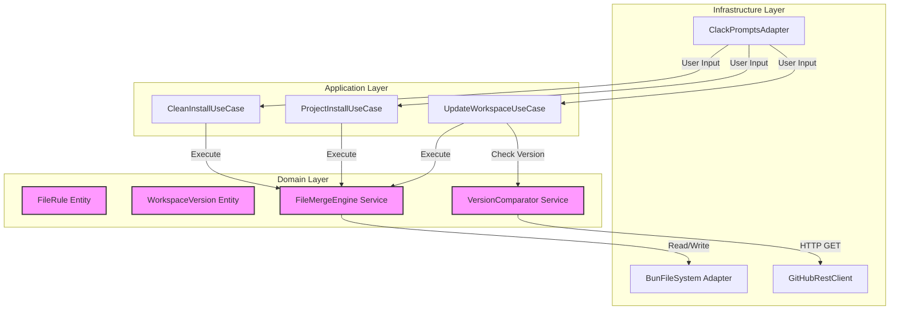

# AGENTS.MD – Códice: Opencode Workspace Installer v1.0.0
**Fecha:** 2026-06-13 | **Autor:** Fisherk2 | **Estado:** Aprobado

---

## 🎯 Contexto del Proyecto

### Descripción MVP y Propósito
**Códice** es un instalador/actualizador de línea de comandos (CLI) compilado con Bun, diseñado para desplegar plantillas de workspace de OpenCode de forma atómica, segura e inteligente. Su propósito técnico es automatizar la gestión de archivos de configuración, agentes, skills y comandos, resolviendo el problema de la fragmentación y pérdida de personalizaciones durante actualizaciones.

### Requisitos Funcionales y No Funcionales

| Categoría | Requisito | Prioridad | Criterio de Aceptación |
|-----------|-----------|-----------|------------------------|
| **Funcional** | Menú interactivo con 3 modos (Limpia, Proyecto, Actualizar) | Alta | TUI responde en <100ms, validación de entrada robusta |
| **Funcional** | Motor de fusión granular (Obligatorio/Estándar/Opcional) | Alta | 100% de archivos clasificados correctamente, cero pérdida de datos |
| **Funcional** | Atomicidad (Staging + Rename) | Alta | Interrupción no corrompe proyecto destino |
| **Funcional** | Consulta de versión remota (GitHub API) | Alta | Timeout de 3s, fallback a mensaje de error claro |
| **No Funcional** | Rendimiento | Alta | Instalación completa <5s (local), consulta API <2s |
| **No Funcional** | Portabilidad | Alta | Binarios para Linux, macOS, Windows (x64) |
| **No Funcional** | Seguridad | Alta | Prevención de Path Traversal, sin ejecución de código arbitrario |
| **No Funcional** | Observabilidad | Media | Logs estructurados en modo `--verbose` |

### Dominio y Límites del Sistema
- **Dominio:** Gestión de archivos, versionado semántico, interacción TUI.
- **Límites (In-Scope):** Instalación/actualización del template empaquetado, gestión de versiones local/remota.
- **Límites (Out-of-Scope):** Instalación de dependencias externas, soporte para múltiples fuentes de template, modificación de archivos del usuario post-instalación.

### Orden de Implementación Propuesto
1. **Núcleo de Dominio:** Entidades (`FileRule`, `SemanticVersion`), Servicios (`FileMergeEngine`, `VersionComparator`).
2. **Infraestructura:** Adaptadores (`BunFileSystem`, `GitHubRestClient`, `ClackPromptsAdapter`).
3. **Casos de Uso:** Orquestación de los 3 modos de instalación.
4. **CLI Entry Point:** Integración final y compilación.
5. **Testing & CI/CD:** Pruebas unitarias, E2E, y pipeline de GitHub Actions.

---

## 🏗️ Arquitectura y Diseño

### Patrones Arquitectónicos Aplicados
- **Clean Architecture (Robert C. Martin):** Separación estricta en capas (Domain → Application → Infrastructure) para garantizar que la lógica de negocio sea independiente de frameworks y detalles de implementación.
- **Dependency Inversion Principle (DIP):** Los casos de uso dependen de interfaces (`IFileSystem`, `IGitHubClient`), no de implementaciones concretas.
- **Strategy Pattern:** El `FileMergeEngine` utiliza estrategias de fusión (Obligatorio, Estándar, Opcional) intercambiables.
- **Command Pattern (implícito):** Cada modo de instalación (Limpia, Proyecto, Actualizar) se encapsula como un comando independiente.

### Diagrama de Componentes y Flujo de Datos



### Estrategia de Comunicación entre Módulos
- **Inyección de Dependencias:** Los casos de uso reciben las interfaces de infraestructura a través de su constructor.
- **Result/Either Pattern:** Los servicios del dominio retornan tipos `Result<T, Error>` para manejo explícito de errores sin excepciones.
- **Event Emitter (opcional):** Para notificar progreso de copia de archivos a la TUI (spinner de carga).

### Justificación Técnica de Elecciones Críticas
| Decisión | Justificación | Alternativa Descartada |
|----------|---------------|------------------------|
| Bun para compilación | Binario nativo, velocidad superior, API de fs moderna | Node.js + pkg (mayor overhead, menor rendimiento) |
| @clack/prompts | UX moderna, zero-dependency tree, ideal para binarios | Inquirer (más pesado, UI menos moderna) |
| Staging + Rename | Atomicidad garantizada, cero corrupción | Journal de reversión (complejo, propenso a fallos) |
| GitHub REST API | Estándar, no requiere Git instalado, JSON estructurado | Git ls-remote (dependencia externa fuerte) |

---

## 🔧 Guías de Desarrollo

### Principios SOLID y Ortogonalidad Aplicados
- **SRP (Single Responsibility):** Cada clase tiene una única razón para cambiar. `FileMergeEngine` solo fusiona; `AtomicFileWriter` solo garantiza atomicidad.
- **OCP (Open/Closed):** Nuevas reglas de fusión se añaden como estrategias, sin modificar el motor.
- **LSP (Liskov Substitution):** Los adaptadores de infraestructura son intercambiables sin romper el contrato.
- **ISP (Interface Segregation):** Interfaces pequeñas y específicas (`IFileReader`, `IFileWriter` en vez de un `IFileSystem` gigante).
- **DIP (Dependency Inversion):** El dominio no conoce Bun ni GitHub; solo interfaces.
- **Ortogonalidad:** La lógica de versión es independiente de la lógica de fusión. Cambios en una no afectan la otra.

### Patrones de Diseño
- **Factory Method:** Para crear instancias de `FileRule` según el tipo (Obligatorio, Estándar, Opcional).
- **Template Method:** En los casos de uso, el esqueleto del algoritmo es fijo, pero los pasos específicos varían.
- **Decorator:** Para añadir logging o métricas a los servicios sin modificar su código.

### Convenciones de Nomenclatura y Estructura
```
src/
├── domain/
│   ├── entities/
│   │   ├── FileRule.ts
│   │   └── WorkspaceVersion.ts
│   └── services/
│       ├── FileMergeEngine.ts
│       └── VersionComparator.ts
├── application/
│   ├── use-cases/
│   │   ├── CleanInstallUseCase.ts
│   │   ├── ProjectInstallUseCase.ts
│   │   └── UpdateWorkspaceUseCase.ts
│   └── ports/
│       ├── IFileSystem.ts
│       ├── IGitHubClient.ts
│       └── IUserPrompt.ts
├── infrastructure/
│   ├── adapters/
│   │   ├── BunFileSystem.ts
│   │   ├── GitHubRestClient.ts
│   │   └── ClackPromptsAdapter.ts
│   └── config/
│       └── constants.ts
└── cli/
    └── main.ts
```

- **Nombres descriptivos:** `FileMergeEngine` (no `Merger`), `VersionComparator` (no `VersionCheck`).
- **Archivos pequeños:** Máximo 200 líneas por archivo. Si crece más, extraer responsabilidades.
- **Comentarios:** Solo para explicar el *porqué*, nunca el *qué*.

### Checklists de Pre-Commit
- [ ] ¿El código pasa `bun run lint` sin errores?
- [ ] ¿Las pruebas unitarias pasan con >80% de cobertura?
- [ ] ¿Se han añadido tipos explícitos (no `any`)?
- [ ] ¿Los nombres son descriptivos y siguen la convención?
- [ ] ¿Se ha actualizado la documentación si cambió la API?

### Estrategia de Manejo de Errores
- **Fail-Fast:** Validar entradas al inicio de cada función.
- **Result Pattern:** Retornar `Result<T, Error>` en vez de lanzar excepciones.
- **Error Messages Accionables:** "Permiso denegado en /path/to/file. Ejecute con sudo o revise permisos." (no "Error 403").
- **Graceful Degradation:** Si la API de GitHub falla, mostrar mensaje claro y permitir instalación manual.

---

## 🧪 Testing y Calidad

### Estrategia de Pruebas en 3 Fases
| Fase | Alcance | Herramienta | Criterio de Éxito |
|------|---------|-------------|-------------------|
| **Unitarias** | Funciones puras del dominio (`VersionComparator`, `FileRule`) | `bun:test` | >90% cobertura, todos los edge cases cubiertos |
| **Integración** | Interacción entre servicios y adaptadores (mock de fs/GitHub) | `bun:test` + mocks | Flujos completos de fusión y versionado |
| **E2E** | Ejecución del binario compilado en directorio temporal | Scripts de shell (`bash`/`zx`) | Validación de archivos copiados, versiones, y rollback en fallo |

### Frameworks y Patrones de Testing
- **Arrange-Act-Assert (AAA):** Estructura clara en cada test.
- **Fixtures:** Directorios de prueba con estructuras de archivos predefinidas.
- **Mocking:** Usar `bun:test` mocks para aislar dependencias externas (fs, red).
- **Snapshot Testing:** Para validar la salida de la TUI (opcional).

### Métricas de Calidad
- **Cobertura:** >80% en unitarias, >70% en integración.
- **Complejidad Ciclomática:** <10 por función.
- **Deuda Técnica:** Monitoreada con SonarQube (opcional) o revisión manual.

### Estrategia de Mockeo
- **FileSystem Mock:** Simular operaciones de lectura/escritura sin tocar disco real.
- **GitHub API Mock:** Retornar respuestas predefinidas (éxito, error 404, rate limit).
- **TUI Mock:** Simular entradas de usuario para probar flujos interactivos.

---

## 🔒 Seguridad y Prohibiciones

### Validación de Inputs y Sanitización
- **Path Traversal Prevention:** Usar `path.resolve()` y verificar que el destino esté dentro del directorio permitido.
- **Semantic Version Validation:** Validar que los tags de GitHub sigan el formato `vX.Y.Z` usando `semver`.
- **Input Sanitization:** No confiar en entradas de usuario sin validación explícita.

### Manejo de Secretos
- **No Hardcode Tokens:** No se soporta autenticación de GitHub. El cliente usa únicamente requests no autenticadas (60 req/hr). Si en el futuro se añade soporte para tokens, usar variables de entorno (`GITHUB_TOKEN`).
- **No Loggear Secrets:** Excluir tokens y credenciales de los logs, incluso en modo `--verbose`.

### Control de Excepciones y Timeouts
- **Network Timeout:** 3 segundos para consultas a GitHub API.
- **Filesystem Errors:** Capturar `EACCES`, `ENOSPC`, y mostrar mensajes accionables.
- **Graceful Shutdown:** Manejar `SIGINT` (Ctrl+C) para limpiar directorio de staging.

### Lista Explícita de Prácticas Prohibidas
- ❌ **Hardcodear rutas absolutas:** Siempre usar `path.join()` o `path.resolve()`.
- ❌ **Ejecutar código arbitrario:** No evaluar scripts del template sin consentimiento explícito.
- ❌ **Side-effects ocultos:** Las funciones no deben modificar estado global sin ser explícitas.
- ❌ **Acoplamiento temporal:** No depender del orden de ejecución de módulos no relacionados.
- ❌ **Ignorar errores:** Nunca capturar excepciones sin manejarlas o loggearlas.
- ❌ **Usar `any` en TypeScript:** Siempre tipar explícitamente.
- ❌ **Duplicación de lógica (DRY):** Si copias y pegas, extrae a una función.
- ❌ **Comentarios obvios:** No comentar `// Incrementa i en 1` para `i++`.

---

## 📚 Referencias y Recursos
- **Clean Architecture** – Robert C. Martin
- **Clean Code** – Robert C. Martin
- **Software Development, Design, and Coding** – John F. Dooley
- **Ingeniería de Software: Un Enfoque Práctico** – Roger S. Pressman
- **Systems Analysis and Design** – Alan Dennis et al.
- **Bun Documentation:** https://bun.sh/docs
- **Clack Prompts:** https://www.clackjs.com/
- **GitHub REST API:** https://docs.github.com/en/rest

---