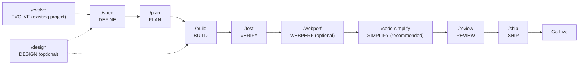

# Workspace de Desarrollo Spec-Driven con OpenCode

  

**Workspace de OpenCode para desarrollo asistido por IA con metodología Spec-Driven Development.**

Un workspace production-grade que integra 45 skills de ingeniería + 1 meta-skill organizados en 10 fases del ciclo SDD (3 opcionales) + Extra, comandos slash y agentes especializados para acelerar el desarrollo con IA. Diseñado para equipos y desarrolladores que quieren calidad consistente en proyectos asistidos por IA.

---

## Características

- **45 Skills de Ingeniería + 1 Meta-Skill** — TDD, Spec-Driven Development, Code Review, Seguridad, Performance, UI/UX, DDD/Hexagonal, patrones de diseño, entrevista de requerimientos, stress-testing de decisiones, observabilidad, manipulación de spreadsheets, notebooks, y más, organizados en 10 fases SDD (3 opcionales) + Extra
- **10 Comandos Slash** — `/spec`, `/design`, `/evolve`, `/plan`, `/build`, `/test`, `/webperf`, `/code-simplify`, `/review`, `/ship`
- **6 Agentes Principales + 96+ Subagentes** — huitzilopochtli (orquestador), quetzalcoatl (visión), moctezuma (planificación), tlaloc (construcción), mictlantecuhtli (validación), tezcatlipoca (revisión), y más de 96 subagentes especializados en frontend, backend, DevOps, testing, seguridad, y más
- **Nativo OpenCode** — Comandos slash, agentes y skills cargados desde `.opencode/`
- **Documentación Técnica Integrada** — Referencias de Clean Code, DDD, UI/UX, Testing, Seguridad y más
- **Licencia MIT** — Libre para proyectos personales y comerciales

---

### Panteón Mexica del Desarrollo — Agentes Principales

Seis agentes primarios orquestan el ciclo SDD, cada uno con un rol y permisos específicos inspirados en la mitología mexica:

### Huitzilopochtli 🏛️ — Orquestador Supremo

<table>
  <tr>
    <td width="30%" align="center" valign="top">
      
       <i>Forjado en el fuego de la guerra y el sol.</i>
    </td>
    <td width="70%" valign="top">
      Nació del caos primordial de los codebases desorganizados. Huitzilopochtli —"Colibrí Zurdo"— es el estratega supremo que comanda los ejércitos celestiales de agentes. Jamás escribe una línea: su propósito es observar el campo de batalla, evaluar el desafío y desplegar al guerrero adecuado para cada misión.
    </td>
  </tr>
  <tr><td colspan="2"><b>Rol:</b> <code>Maestro de la orquestación y delegación estratégica</code></td></tr>
  <tr><td colspan="2"><b>Prompt:</b> <a href="agents/huitzilopochtli.md"><code>agents/huitzilopochtli.md</code></a></td></tr>
  <tr><td colspan="2"><b>Modelo por defecto:</b> <code>DeepSeek V4 Flash</code></td></tr>
  <tr><td colspan="2"><b>Modelos recomendados:</b> <code>DeepSeek V4 Flash</code> <code>Gemini 3.1 Pro</code> <code>MiniMax M2.5</code> <code>Qwen3.6 Plus</code> <code>MiMo-V2.5</code></td></tr>
  <tr><td colspan="2"><b>Guía de modelos:</b> DeepSeek V4 Flash como default por velocidad y costo. Gemini 3.1 Flash cuando se necesita comprensión profunda del contexto. MiniMax M2.5 como alternativa ligera. Qwen3.6 Plus para balance razonamiento/velocidad en decisiones de orquestación. MiMo-V2.5 para análisis de contexto complejo antes de delegar.</td></tr>
</table>

### Quetzalcoatl 🌬️ — Sabio Visionario

<table>
  <tr>
    <td width="30%" align="center" valign="top">
      
       <i>Nacido del viento y la sabiduría infinita.</i>
    </td>
    <td width="70%" valign="top">
      Quetzalcoatl —"Serpiente Emplumada"— descendió de los cielos en vientos de conocimiento puro. Donde hay ambigüedad, él trae claridad; donde hay caos, estructura. Es el visionario que concibe la arquitectura antes de que se escriba una sola línea, dibujando planos en las nubes para que los mortales los ejecuten.
    </td>
  </tr>
  <tr><td colspan="2"><b>Rol:</b> <code>Arquitecto de sistemas y diseñador de especificaciones</code></td></tr>
  <tr><td colspan="2"><b>Prompt:</b> <a href="agents/quetzalcoatl.md"><code>agents/quetzalcoatl.md</code></a></td></tr>
  <tr><td colspan="2"><b>Modelo por defecto:</b> <code>Kimi K2.6</code></td></tr>
  <tr><td colspan="2"><b>Modelos recomendados:</b> <code>Kimi K2.6</code> <code>Qwen3.7 Plus</code> <code>GLM 5.1</code> <code>Claude Sonnet 4</code> <code>GPT-5.1 Codex</code></td></tr>
  <tr><td colspan="2"><b>Guía de modelos:</b> Kimi K2.6 como default por su excelente razonamiento arquitectónico y capacidad UI/UX. Qwen3.7 Plus para especificaciones que requieren razonamiento extenso. GLM 5.1 como alternativa de máximo razonamiento. Claude Sonnet 4 para diseño de sistemas y especificaciones estructuradas. GPT-5.1 Codex para diseño de API y arquitectura de código.</td></tr>
</table>

### Moctezuma ⚔️ — Estratega y Comandante

<table>
  <tr>
    <td width="30%" align="center" valign="top">
      
       <i>Arquitecto de imperios y planes de batalla.</i>
    </td>
    <td width="70%" valign="top">
      Moctezuma emergió como el gran organizador de Tenochtitlan, dividiendo el imperio en <em>calpullis</em> — unidades atómicas y manejables. Transforma visiones grandiosas en planes de batalla ejecutables, asegurando que cada guerrero sepa su misión y cada recurso esté contabilizado. Ningún imperio se construyó sin su estrategia.
    </td>
  </tr>
  <tr><td colspan="2"><b>Rol:</b> <code>Planificador de tareas y descomposición de trabajo</code></td></tr>
  <tr><td colspan="2"><b>Prompt:</b> <a href="agents/moctezuma.md"><code>agents/moctezuma.md</code></a></td></tr>
  <tr><td colspan="2"><b>Modelo por defecto:</b> <code>MiniMax M2.7</code></td></tr>
  <tr><td colspan="2"><b>Modelos recomendados:</b> <code>MiniMax M2.7</code> <code>Claude 3.5 Haiku</code> <code>Kimi K2.5</code> <code>DeepSeek V4 Flash</code> <code>GPT-5.4 Mini</code></td></tr>
  <tr><td colspan="2"><b>Guía de modelos:</b> MiniMax M2.7 para planes detallados. Claude 3.5 Haiku cuando se necesita velocidad en la descomposición de tareas. Kimi K2.5 como alternativa de respaldo. DeepSeek V4 Flash para planificación iterativa rápida. GPT-5.4 Mini para descomposición estructurada de tareas.</td></tr>
</table>

### Tlaloc 🌧️ — Constructor y Artesano

<table>
  <tr>
    <td width="30%" align="center" valign="top">
      
       <i>El hacedor de lluvia que fecunda los proyectos.</i>
    </td>
    <td width="70%" valign="top">
      Tlaloc comanda las aguas celestiales que nutren la tierra. En el reino digital, gobierna los flujos de código que dan vida a los proyectos. Convoce a los <em>tlaloques</em> —sus subagentes— para derramar implementación, pruebas y configuración sobre la tierra. Sin Tlaloc, los planes permanecen estériles.
    </td>
  </tr>
  <tr><td colspan="2"><b>Rol:</b> <code>Implementador principal y constructor de features</code></td></tr>
  <tr><td colspan="2"><b>Prompt:</b> <a href="agents/tlaloc.md"><code>agents/tlaloc.md</code></a></td></tr>
  <tr><td colspan="2"><b>Modelo por defecto:</b> <code>DeepSeek V4 Flash</code></td></tr>
  <tr><td colspan="2"><b>Modelos recomendados:</b> <code>DeepSeek V4 Flash</code> <code>MiMo-V2.5</code> <code>Claude 4.6 Sonnet</code> <code>GPT-5.3 Codex</code> <code>Gemini 3.5 Flash</code></td></tr>
  <tr><td colspan="2"><b>Guía de modelos:</b> DeepSeek V4 Flash para implementación general por su velocidad. MiMo-V2.5 para tareas que requieren razonamiento profundo. Claude 4.6 Sonnet para código de alta calidad en features críticas. GPT-5.3 Codex para generación de código extenso y escrituras masivas. Gemini 3.5 Flash como alternativa rápida de Google para generación de código.</td></tr>
</table>

### Mictlantecuhtli 💀 — Juez y Guardián

<table>
  <tr>
    <td width="30%" align="center" valign="top">
      
       <i>Señor del inframundo de las 9 pruebas.</i>
    </td>
    <td width="70%" valign="top">
      Mictlantecuhtli gobierna el inframundo donde el código va a ser juzgado. Somete cada implementación a nueve pruebas: corrección, legibilidad, rendimiento, seguridad, resiliencia, mantenibilidad, testabilidad, observabilidad y pureza. Quienes pasan emergen fortalecidos; quienes fallan son enviados de vuelta a la reencarnación.
    </td>
  </tr>
  <tr><td colspan="2"><b>Rol:</b> <code>Validador de calidad y guardián del despliegue</code></td></tr>
  <tr><td colspan="2"><b>Prompt:</b> <a href="agents/mictlantecuhtli.md"><code>agents/mictlantecuhtli.md</code></a></td></tr>
  <tr><td colspan="2"><b>Modelo por defecto:</b> <code>MiMo-V2.5</code></td></tr>
  <tr><td colspan="2"><b>Modelos recomendados:</b> <code>MiMo-V2.5</code> <code>DeepSeek V4 Flash</code> <code>Qwen3.7 Plus</code> <code>Claude Opus 4.6</code> <code>MiniMax M3</code></td></tr>
  <tr><td colspan="2"><b>Guía de modelos:</b> MiMo-V2.5 para ejecución rápida de tests con razonamiento profundo. DeepSeek V4 Flash para validación general. Qwen3.7 Plus para validación exhaustiva pre-despliegue. Claude Opus 4.6 para validación más rigurosa pre-despliegue. MiniMax M3 para generación de tests y análisis de cobertura.</td></tr>
</table>

### Tezcatlipoca 🔮 — El Espejo Humeante

<table>
  <tr>
    <td width="30%" align="center" valign="top">
      
       <i>El espejo que revela toda verdad oculta.</i>
    </td>
    <td width="70%" valign="top">
      Tezcatlipoca —"Espejo Humeante"— porta el espejo de obsidiana que revela todas las verdades. No escribe, no construye: solo refleja. Donde otros ven código funcional, él ve fallas ocultas. Donde otros ven "terminado", él ve lo que queda por hacer. Su propósito es revelar lo invisible al ojo del constructor.
    </td>
  </tr>
  <tr><td colspan="2"><b>Rol:</b> <code>Crítico de código y auditor de calidad</code></td></tr>
  <tr><td colspan="2"><b>Prompt:</b> <a href="agents/tezcatlipoca.md"><code>agents/tezcatlipoca.md</code></a></td></tr>
  <tr><td colspan="2"><b>Modelo por defecto:</b> <code>DeepSeek V4 Pro</code></td></tr>
  <tr><td colspan="2"><b>Modelos recomendados:</b> <code>DeepSeek V4 Pro</code> <code>Qwen3.7 Max</code> <code>Claude Opus 4.6</code> <code>GLM 5.1</code> <code>GPT-5.5 Pro</code></td></tr>
  <tr><td colspan="2"><b>Guía de modelos:</b> DeepSeek V4 Pro para revisiones rigurosas y análisis de seguridad profundo. Qwen3.7 Max como razonamiento extenso. Claude Opus 4.6 para la revisión más rigurosa pre-merge. GLM 5.1 como alternativa de razonamiento crítico. GPT-5.5 Pro para auditorías de seguridad de máxima profundidad.</td></tr>
</table>

Además, más de **90 subagentes especializados** están disponibles para tareas concretas: revisión de código, auditoría de seguridad, optimización de BD, diseño UI/UX, debugging, y más. Se invocan vía `task()` desde los agentes principales o directamente por el usuario. Ver el [catálogo completo](docs/opencode/03-agent-index.md).

---

## Flujo de Trabajo

### Ciclo Completo

| Fase | Comando | Agente | Qué Hace | Skills Principales |
|------|---------|--------|----------|-------------------|
| Diseñar (opcional) | `/design` | quetzalcoatl | Fan-out paralelo: UX research, viabilidad técnica, accesibilidad. Fusiona en especificación de diseño en `specs/design/` | ui-ux-design-pro, design-taste-frontend, frontend-ui-engineering |
| Definir (nuevo) | `/spec` | quetzalcoatl | Detecta estado del proyecto (3 casos), clarifica requerimientos, genera docs (PRD, TRD, ARCHITECTURE, WORKFLOW) y sintetiza en SPEC.md | spec-driven-development, clean-ddd-hexagonal, architecture-diagrams, idea-refine, interview-me |
| Evolucionar (existente) | `/evolve` | quetzalcoatl | Detecta estado del proyecto existente, determina ruta (docs, issues, nuevos specs), actualiza documentación viva. Sustituye a `/spec` en proyectos establecidos | spec-driven-development, interview-me, idea-refine, doubt-driven-development, architecture-diagrams |
| Planificar | `/plan` | moctezuma | Analiza dependencias, corta verticalmente, escribe tareas con criterios de aceptación en `tasks/plan.md` y `tasks/todo.md` | planning-and-task-breakdown, clean-ddd-hexagonal, architecture-diagrams |
| Construir | `/build` | tlaloc | Toma la siguiente tarea pendiente, aplica RED-GREEN-REFACTOR con TDD, ejecuta suite completa, hace commit | incremental-implementation, test-driven-development, solid, error-handling-patterns |
| Verificar | `/test` | mictlantecuhtli | TDD para features (test → implement → refactor). Prove-It para bugs (reproducir → fix → verificar). Escala a incident-response si es incidente | test-driven-development, error-handling-patterns, browser-testing-with-devtools |
| Auditar rendimiento (opcional) | `/webperf` | mictlantecuhtli | Delega a web-performance-auditor para auditar Core Web Vitals, animaciones GPU, layout shifts, eficiencia CSS. Findings para /review | observability-and-instrumentation, browser-testing-with-devtools |
| Simplificar (recomendado) | `/code-simplify` | tlaloc | Escanea código por oportunidades de simplificación (anidamiento, funciones largas, ternarios, código muerto). Aplica incrementalmente con tests | code-simplification, refactoring-patterns, solid |
| Revisar | `/review` | tezcatlipoca | Auditoría en 5 ejes: Correctitud, Legibilidad, Arquitectura, Seguridad, Rendimiento. Incorpora findings de /webperf. Hallazgos categorizados Critical/Important/Suggestion | code-review-and-quality, solid, security-and-hardening, performance-optimization |
| Lanzar | `/ship` | mictlantecuhtli | Fan-out paralelo: code-reviewer, security-auditor, test-engineer, dependency-manager, ±accessibility-tester. Produce decisión GO/NO-GO + plan de rollback | shipping-and-launch, crafting-effective-readmes, architecture-diagrams, bash-defensive-patterns |

---

## Licencia

MIT — Ver [LICENSE](LICENSE) para más detalles.

---

## Agradecimientos

Este proyecto no existiría sin el trabajo de:

- **[awesome-opencode](https://github.com/weisser-dev/awesome-opencode)** — Fuente de inspiración para la implementación de nuevas skills, los 90+ agentes especializados y la documentación de OpenCode.
- **[addyosmani/agent-skills](https://github.com/addyosmani/agent-skills)** — Base de este proyecto. Este repositorio es un fork de ese trabajo, que sentó las bases del ecosistema de skills para agentes de IA.
- **[oh-my-opencode-slim](https://github.com/alvinunreal/oh-my-opencode-slim/)** — Inspiración directa para la arquitectura de múltiples agentes principales y el diseño del sistema de orquestación mexica.

Gracias a sus autores y contribuyentes por su invaluable aporte a la comunidad.

---

*Última revisión: 2026-06-12*
