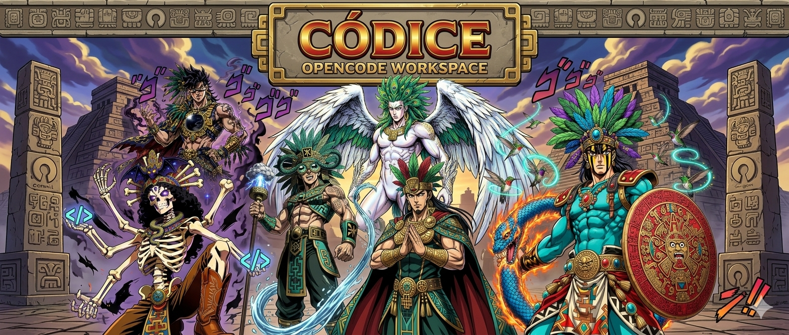
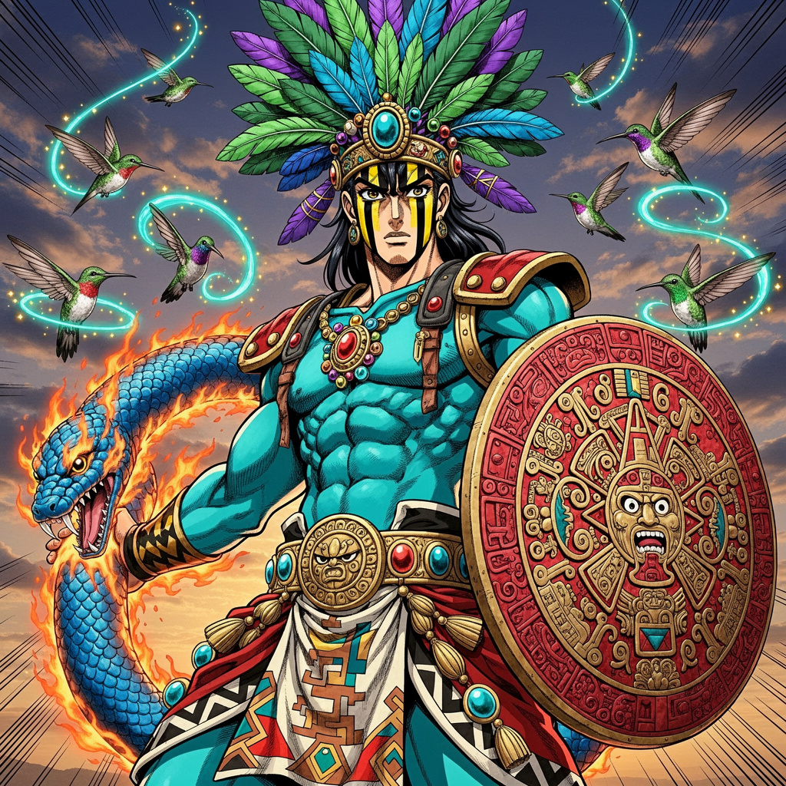
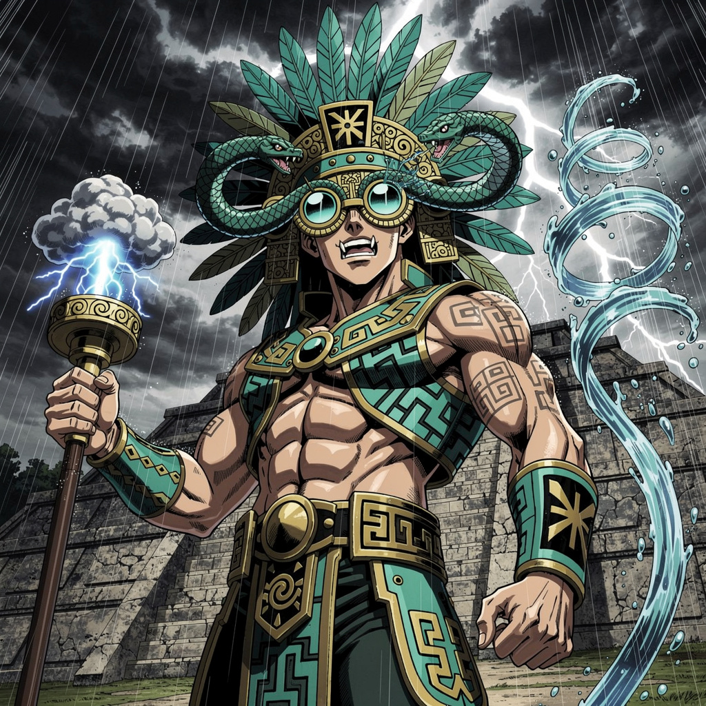
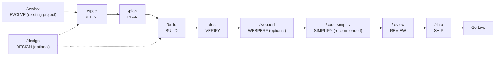

# Spec-Driven Development Workspace with OpenCode

  

**OpenCode Workspace for AI-assisted development with Spec-Driven Development methodology.**

A production-grade workspace integrating 45 engineering skills + 1 meta-skill organized in 10 SDD cycle phases (3 optional) + Extra, slash commands, and specialized agents to accelerate AI-assisted development. Designed for teams and developers who want consistent quality in AI-assisted projects.

---

## Features

- **45 Engineering Skills + 1 Meta-Skill** — TDD, Spec-Driven Development, Code Review, Security, Performance, UI/UX, DDD/Hexagonal, design patterns, requirements interview, decision stress-testing, observability, spreadsheet manipulation, notebooks, and more, organized in 10 SDD phases (3 optional) + Extra
- **10 Slash Commands** — `/spec`, `/design`, `/evolve`, `/plan`, `/build`, `/test`, `/webperf`, `/code-simplify`, `/review`, `/ship`
- **6 Main Agents + 96+ Subagents** — huitzilopochtli (orchestrator), quetzalcoatl (vision), moctezuma (planning), tlaloc (construction), mictlantecuhtli (validation), tezcatlipoca (review), and 96+ subagents specialized in frontend, backend, DevOps, testing, security, and more
- **OpenCode Native** — Slash commands, agents, and skills loaded from `.opencode/`
- **Integrated Technical Documentation** — References for Clean Code, DDD, UI/UX, Testing, Security, and more
- **MIT License** — Free for personal and commercial projects

---

### Mexican Development Pantheon — Main Agents

Six primary agents orchestrate the SDD cycle, each with a specific role and permissions inspired by Mexican mythology:

### Huitzilopochtli 🏛️ — Supreme Orchestrator

<table>
  <tr>
    <td width="30%" align="center" valign="top">
      
       <i>Forged in the fire of war and sun.</i>
    </td>
    <td width="70%" valign="top">
      Born from the primordial chaos of disorganized codebases. Huitzilopochtli —"Left Hummingbird"— is the supreme strategist commanding the celestial armies of agents. Never writes a line: his purpose is to observe the battlefield, assess the challenge, and deploy the appropriate warrior for each mission.
    </td>
  </tr>
  <tr><td colspan="2"><b>Role:</b> <code>Master of orchestration and strategic delegation</code></td></tr>
  <tr><td colspan="2"><b>Prompt:</b> <a href="agents/huitzilopochtli.md"><code>agents/huitzilopochtli.md</code></a></td></tr>
  <tr><td colspan="2"><b>Default Model:</b> <code>DeepSeek V4 Flash</code></td></tr>
  <tr><td colspan="2"><b>Recommended Models:</b> <code>DeepSeek V4 Flash</code> <code>Gemini 3.1 Pro</code> <code>MiniMax M2.5</code> <code>Qwen3.6 Plus</code> <code>MiMo-V2.5</code></td></tr>
  <tr><td colspan="2"><b>Model Guide:</b> DeepSeek V4 Flash as default for speed and cost. Gemini 3.1 Flash when deep context comprehension is needed. MiniMax M2.5 as a lightweight alternative. Qwen3.6 Plus for reasoning/speed balance in orchestration decisions. MiMo-V2.5 for complex context analysis before delegation.</td></tr>
</table>

### Quetzalcoatl 🌬️ — Visionary Sage

<table>
  <tr>
    <td width="30%" align="center" valign="top">
      
       <i>Born from wind and infinite wisdom.</i>
    </td>
    <td width="70%" valign="top">
      Quetzalcoatl —"Feathered Serpent"— descended from the heavens on winds of pure knowledge. Where there is ambiguity, he brings clarity; where there is chaos, structure. He is the visionary who conceives architecture before a single line is written, drawing blueprints in the clouds for mortals to execute.
    </td>
  </tr>
  <tr><td colspan="2"><b>Role:</b> <code>System architect and specification designer</code></td></tr>
  <tr><td colspan="2"><b>Prompt:</b> <a href="agents/quetzalcoatl.md"><code>agents/quetzalcoatl.md</code></a></td></tr>
  <tr><td colspan="2"><b>Default Model:</b> <code>Kimi K2.6</code></td></tr>
  <tr><td colspan="2"><b>Recommended Models:</b> <code>Kimi K2.6</code> <code>Qwen3.7 Plus</code> <code>GLM 5.1</code> <code>Claude Sonnet 4</code> <code>GPT-5.1 Codex</code></td></tr>
  <tr><td colspan="2"><b>Model Guide:</b> Kimi K2.6 as default for excellent architectural reasoning and UI/UX capability. Qwen3.7 Plus for specifications requiring extensive reasoning. GLM 5.1 as maximum reasoning alternative. Claude Sonnet 4 for system design and structured specifications. GPT-5.1 Codex for API design and code architecture.</td></tr>
</table>

### Moctezuma ⚔️ — Strategist and Commander

<table>
  <tr>
    <td width="30%" align="center" valign="top">
      
       <i>Architect of empires and battle plans.</i>
    </td>
    <td width="70%" valign="top">
      Moctezuma emerged as the great organizer of Tenochtitlan, dividing the empire into <em>calpullis</em> — atomic and manageable units. Transforms grand visions into executable battle plans, ensuring each warrior knows their mission and every resource is accounted for. No empire was built without his strategy.
    </td>
  </tr>
  <tr><td colspan="2"><b>Role:</b> <code>Task planner and work breakdown specialist</code></td></tr>
  <tr><td colspan="2"><b>Prompt:</b> <a href="agents/moctezuma.md"><code>agents/moctezuma.md</code></a></td></tr>
  <tr><td colspan="2"><b>Default Model:</b> <code>MiniMax M2.7</code></td></tr>
  <tr><td colspan="2"><b>Recommended Models:</b> <code>MiniMax M2.7</code> <code>Claude 3.5 Haiku</code> <code>Kimi K2.5</code> <code>DeepSeek V4 Flash</code> <code>GPT-5.4 Mini</code></td></tr>
  <tr><td colspan="2"><b>Model Guide:</b> MiniMax M2.7 for detailed plans. Claude 3.5 Haiku when speed is needed in task breakdown. Kimi K2.5 as backup alternative. DeepSeek V4 Flash for rapid iterative planning. GPT-5.4 Mini for structured task decomposition.</td></tr>
</table>

### Tlaloc 🌧️ — Builder and Artisan

<table>
  <tr>
    <td width="30%" align="center" valign="top">
      
       <i>The rainmaker who fertilizes projects.</i>
    </td>
    <td width="70%" valign="top">
      Tlaloc commands the celestial waters that nourish the earth. In the digital realm, he governs the code flows that bring projects to life. Summons the <em>tlaloques</em> —his subagents— to pour implementation, tests, and configuration upon the earth. Without Tlaloc, plans remain sterile.
    </td>
  </tr>
  <tr><td colspan="2"><b>Role:</b> <code>Main implementer and feature builder</code></td></tr>
  <tr><td colspan="2"><b>Prompt:</b> <a href="agents/tlaloc.md"><code>agents/tlaloc.md</code></a></td></tr>
  <tr><td colspan="2"><b>Default Model:</b> <code>DeepSeek V4 Flash</code></td></tr>
  <tr><td colspan="2"><b>Recommended Models:</b> <code>DeepSeek V4 Flash</code> <code>MiMo-V2.5</code> <code>Claude 4.6 Sonnet</code> <code>GPT-5.3 Codex</code> <code>Gemini 3.5 Flash</code></td></tr>
  <tr><td colspan="2"><b>Model Guide:</b> DeepSeek V4 Flash for general implementation due to speed. MiMo-V2.5 for tasks requiring deep reasoning. Claude 4.6 Sonnet for high-quality code in critical features. GPT-5.3 Codex for extensive code generation and mass writing. Gemini 3.5 Flash as Google's fast alternative for code generation.</td></tr>
</table>

### Mictlantecuhtli 💀 — Judge and Guardian

<table>
  <tr>
    <td width="30%" align="center" valign="top">
      
       <i>Lord of the underworld of 9 trials.</i>
    </td>
    <td width="70%" valign="top">
      Mictlantecuhtli governs the underworld where code goes to be judged. Subjects each implementation to nine trials: correctness, readability, performance, security, resilience, maintainability, testability, observability, and purity. Those who pass emerge strengthened; those who fail are sent back for reincarnation.
    </td>
  </tr>
  <tr><td colspan="2"><b>Role:</b> <code>Quality validator and deployment guardian</code></td></tr>
  <tr><td colspan="2"><b>Prompt:</b> <a href="agents/mictlantecuhtli.md"><code>agents/mictlantecuhtli.md</code></a></td></tr>
  <tr><td colspan="2"><b>Default Model:</b> <code>MiMo-V2.5</code></td></tr>
  <tr><td colspan="2"><b>Recommended Models:</b> <code>MiMo-V2.5</code> <code>DeepSeek V4 Flash</code> <code>Qwen3.7 Plus</code> <code>Claude Opus 4.6</code> <code>MiniMax M3</code></td></tr>
  <tr><td colspan="2"><b>Model Guide:</b> MiMo-V2.5 for fast test execution with deep reasoning. DeepSeek V4 Flash for general validation. Qwen3.7 Plus for exhaustive pre-deployment validation. Claude Opus 4.6 for most rigorous pre-deployment validation. MiniMax M3 for test generation and coverage analysis.</td></tr>
</table>

### Tezcatlipoca 🔮 — The Smoking Mirror

<table>
  <tr>
    <td width="30%" align="center" valign="top">
      
       <i>The mirror that reveals all hidden truth.</i>
    </td>
    <td width="70%" valign="top">
      Tezcatlipoca —"Smoking Mirror"— bears the obsidian mirror that reveals all truths. Does not write, does not build: only reflects. Where others see functional code, he sees hidden flaws. Where others see "done", he sees what remains to be done. His purpose is to reveal what is invisible to the builder's eye.
    </td>
  </tr>
  <tr><td colspan="2"><b>Role:</b> <code>Code critic and quality auditor</code></td></tr>
  <tr><td colspan="2"><b>Prompt:</b> <a href="agents/tezcatlipoca.md"><code>agents/tezcatlipoca.md</code></a></td></tr>
  <tr><td colspan="2"><b>Default Model:</b> <code>DeepSeek V4 Pro</code></td></tr>
  <tr><td colspan="2"><b>Recommended Models:</b> <code>DeepSeek V4 Pro</code> <code>Qwen3.7 Max</code> <code>Claude Opus 4.6</code> <code>GLM 5.1</code> <code>GPT-5.5 Pro</code></td></tr>
  <tr><td colspan="2"><b>Model Guide:</b> DeepSeek V4 Pro for rigorous reviews and deep security analysis. Qwen3.7 Max for extensive reasoning. Claude Opus 4.6 for most rigorous pre-merge review. GLM 5.1 as critical reasoning alternative. GPT-5.5 Pro for maximum depth security audits.</td></tr>
</table>

Additionally, over **90 specialized subagents** are available for specific tasks: code review, security audit, DB optimization, UI/UX design, debugging, and more. Invoked via `task()` from main agents or directly by the user. See the [complete catalog](docs/opencode/03-agent-index.md).

---

## Workflow

### Full Cycle

| Phase | Command | Agent | What It Does | Main Skills |
|------|---------|--------|--------------|-------------|
| Design (optional) | `/design` | quetzalcoatl | Parallel fan-out: UX research, technical feasibility, accessibility. Merges into design specification in `specs/design/` | ui-ux-design-pro, design-taste-frontend, frontend-ui-engineering |
| Define (new) | `/spec` | quetzalcoatl | Detects project state (3 cases), clarifies requirements, generates docs (PRD, TRD, ARCHITECTURE, WORKFLOW) and synthesizes into SPEC.md | spec-driven-development, clean-ddd-hexagonal, architecture-diagrams, idea-refine, interview-me |
| Evolve (existing) | `/evolve` | quetzalcoatl | Detects existing project state, determines route (docs, issues, new specs), updates living documentation. Replaces `/spec` in established projects | spec-driven-development, interview-me, idea-refine, doubt-driven-development, architecture-diagrams |
| Plan | `/plan` | moctezuma | Analyzes dependencies, cuts vertically, writes tasks with acceptance criteria in `tasks/plan.md` and `tasks/todo.md` | planning-and-task-breakdown, clean-ddd-hexagonal, architecture-diagrams |
| Build | `/build` | tlaloc | Takes next pending task, applies RED-GREEN-REFACTOR with TDD, runs full suite, commits | incremental-implementation, test-driven-development, solid, error-handling-patterns |
| Verify | `/test` | mictlantecuhtli | TDD for features (test → implement → refactor). Prove-It for bugs (reproduce → fix → verify). Escalates to incident-response if incident | test-driven-development, error-handling-patterns, browser-testing-with-devtools |
| Audit performance (optional) | `/webperf` | mictlantecuhtli | Delegates to web-performance-auditor to audit Core Web Vitals, GPU animations, layout shifts, CSS efficiency. Findings for /review | observability-and-instrumentation, browser-testing-with-devtools |
| Simplify (recommended) | `/code-simplify` | tlaloc | Scans code for simplification opportunities (nesting, long functions, ternaries, dead code). Applies incrementally with tests | code-simplification, refactoring-patterns, solid |
| Review | `/review` | tezcatlipoca | 5-axis audit: Correctness, Readability, Architecture, Security, Performance. Incorporates /webperf findings. Findings categorized Critical/Important/Suggestion | code-review-and-quality, solid, security-and-hardening, performance-optimization |
| Ship | `/ship` | mictlantecuhtli | Parallel fan-out: code-reviewer, security-auditor, test-engineer, dependency-manager, ±accessibility-tester. Produces GO/NO-GO decision + rollback plan | shipping-and-launch, crafting-effective-readmes, architecture-diagrams, bash-defensive-patterns |

---

## License

MIT — See [LICENSE](LICENSE) for details.

---

## Acknowledgments

This project would not exist without the work of:

- **[awesome-opencode](https://github.com/weisser-dev/awesome-opencode)** — Source of inspiration for implementing new skills, the 90+ specialized agents, and OpenCode documentation.
- **[addyosmani/agent-skills](https://github.com/addyosmani/agent-skills)** — Base of this project. This repository is a fork of that work, which laid the foundations of the AI agent skill ecosystem.
- **[oh-my-opencode-slim](https://github.com/alvinunreal/oh-my-opencode-slim/)** — Direct inspiration for the multi-main-agent architecture and Mexican orchestration system design.

Thanks to their authors and contributors for their invaluable contribution to the community.

---

*Last revision: 2026-06-12*
