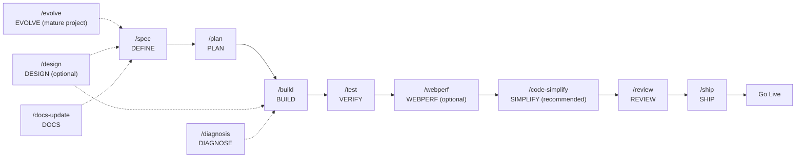

# Códice: Spec-Driven Development Workspace

<p align="center">
  
</p>

<p align="center">
  <a href="https://github.com/Fisherk2/codice-opencode/actions/workflows/ci.yml">
    
  </a>
  <a href="https://www.npmjs.com/package/@fisherk2-dev/codice">
    
  </a>
  <a href="https://github.com/Fisherk2/codice-opencode/releases">
    
  </a>
  <a href="LICENSE">
    
  </a>
  
  
</p>

**OpenCode Workspace for AI-assisted development with Spec-Driven Development methodology.**

A production-grade workspace integrating 45 engineering skills + 1 meta-skill organized in 10 SDD cycle phases (3 optional) + Extra, slash commands, and specialized agents to accelerate AI-assisted development. Designed for teams and developers who want consistent quality in AI-assisted projects.

---

## Features

- **45 Engineering Skills + 1 Meta-Skill** — TDD, Spec-Driven Development, Code Review, Security, Performance, UI/UX, DDD/Hexagonal, design patterns, requirements interview, decision stress-testing, observability, spreadsheet manipulation, notebooks, and more, organized in 10 SDD phases (3 optional) + Extra
- **12 Slash Commands** — `/spec`, `/design`, `/evolve`, `/docs-update`, `/diagnosis`, `/plan`, `/build`, `/test`, `/webperf`, `/code-simplify`, `/review`, `/ship`
- **6 Main Agents + 96+ Subagents** — huitzilopochtli (orchestrator), quetzalcoatl (vision), moctezuma (planning), tlaloc (construction), mictlantecuhtli (validation), tezcatlipoca (review), and 96+ subagents specialized in frontend, backend, DevOps, testing, security, and more
- **OpenCode Native** — Slash commands, agents, and skills loaded from `.opencode/`
- **Integrated Technical Documentation** — References for Clean Code, DDD, UI/UX, Testing, Security, and more
- **MIT License** — Free for personal and commercial projects

---

### Mexican Development Pantheon — Main Agents

Six primary agents orchestrate the SDD cycle, each with a specific role and permissions inspired by Mexican mythology:

### Huitzilopochtli 🏛️ — Supreme Orchestrator

<table>
  <tr>
    <td width="30%" align="center" valign="top">
      
      <br><sub><i>Forged in the fire of war and sun.</i></sub>
    </td>
    <td width="70%" valign="top">
      Born from the primordial chaos of disorganized codebases. Huitzilopochtli —"Left Hummingbird"— is the supreme strategist commanding the celestial armies of agents. Never writes a line: his purpose is to observe the battlefield, assess the challenge, and deploy the appropriate warrior for each mission.
    </td>
  </tr>
  <tr><td colspan="2"><b>Role:</b> <code>Master of orchestration and strategic delegation</code></td></tr>
  <tr><td colspan="2"><b>Prompt:</b> <a href="template/obligatorio/agents/huitzilopochtli.md"><code>template/obligatorio/agents/huitzilopochtli.md</code></a></td></tr>
  <tr><td colspan="2"><b>Default Model:</b> <code>MiMo-V2.5</code></td></tr>
  <tr><td colspan="2"><b>Recommended Models:</b> <code>DeepSeek V4 Flash</code> <code>MiMo-V2.5</code> <code>MiniMax M3</code> <code>GLM 5.2</code></td></tr>
  <tr><td colspan="2"><b>Model Guide:</b> MiMo-V2.5 as default for complex context analysis and strategic delegation. DeepSeek V4 Flash for speed and cost. MiniMax M3 as a lightweight alternative. GLM 5.2 as critical reasoning alternative.</td></tr>
</table>

### Quetzalcoatl 🌬️ — Visionary Sage

<table>
  <tr>
    <td width="30%" align="center" valign="top">
      
      <br><sub><i>Born from wind and infinite wisdom.</i></sub>
    </td>
    <td width="70%" valign="top">
      Quetzalcoatl —"Feathered Serpent"— descended from the heavens on winds of pure knowledge. Where there is ambiguity, he brings clarity; where there is chaos, structure. He is the visionary who conceives architecture before a single line is written, drawing blueprints in the clouds for mortals to execute.
    </td>
  </tr>
  <tr><td colspan="2"><b>Role:</b> <code>System architect and specification designer</code></td></tr>
  <tr><td colspan="2"><b>Prompt:</b> <a href="template/obligatorio/agents/quetzalcoatl.md"><code>template/obligatorio/agents/quetzalcoatl.md</code></a></td></tr>
  <tr><td colspan="2"><b>Default Model:</b> <code>Qwen 3.7 Plus</code></td></tr>
  <tr><td colspan="2"><b>Recommended Models:</b> <code>Kimi 2.6</code> <code>Claude Sonnet 4</code> <code>GLM 5.2</code> <code>GPT-5.3 Codex</code></td></tr>
  <tr><td colspan="2"><b>Model Guide:</b> Qwen 3.7 Plus as default for strong reasoning and coding balance. Claude Sonnet 4 for system design and structured specifications. GLM 5.2 as maximum reasoning alternative. Kimi 2.6 for UI/UX design reasoning. GPT-5.3 Codex for API design and code architecture.</td></tr>
</table>

### Moctezuma ⚔️ — Strategist and Commander

<table>
  <tr>
    <td width="30%" align="center" valign="top">
      
      <br><sub><i>Architect of empires and battle plans.</i></sub>
    </td>
    <td width="70%" valign="top">
      Moctezuma emerged as the great organizer of Tenochtitlan, dividing the empire into <em>calpullis</em> — atomic and manageable units. Transforms grand visions into executable battle plans, ensuring each warrior knows their mission and every resource is accounted for. No empire was built without his strategy.
    </td>
  </tr>
  <tr><td colspan="2"><b>Role:</b> <code>Task planner and work breakdown specialist</code></td></tr>
  <tr><td colspan="2"><b>Prompt:</b> <a href="template/obligatorio/agents/moctezuma.md"><code>template/obligatorio/agents/moctezuma.md</code></a></td></tr>
  <tr><td colspan="2"><b>Default Model:</b> <code>MiniMax M3</code></td></tr>
  <tr><td colspan="2"><b>Recommended Models:</b> <code>MiniMax M3</code> <code>Claude Haiku 4.5</code> <code>Kimi K2.5</code> <code>DeepSeek V4 Flash</code> <code>GPT-5.4 Mini</code></td></tr>
  <tr><td colspan="2"><b>Model Guide:</b> MiniMax M3 for detailed, structured plans. Claude Haiku 4.5 when speed is needed in task breakdown. Kimi K2.5 as backup alternative. DeepSeek V4 Flash for rapid iterative planning. GPT-5.4 Mini for structured task decomposition.</td></tr>
</table>

### Tlaloc 🌧️ — Builder and Artisan

<table>
  <tr>
    <td width="30%" align="center" valign="top">
      
      <br><sub><i>The rainmaker who fertilizes projects.</i></sub>
    </td>
    <td width="70%" valign="top">
      Tlaloc commands the celestial waters that nourish the earth. In the digital realm, he governs the code flows that bring projects to life. Summons the <em>tlaloques</em> —his subagents— to pour implementation, tests, and configuration upon the earth. Without Tlaloc, plans remain sterile.
    </td>
  </tr>
  <tr><td colspan="2"><b>Role:</b> <code>Main implementer and feature builder</code></td></tr>
  <tr><td colspan="2"><b>Prompt:</b> <a href="template/obligatorio/agents/tlaloc.md"><code>template/obligatorio/agents/tlaloc.md</code></a></td></tr>
  <tr><td colspan="2"><b>Default Model:</b> <code>DeepSeek V4 Flash</code></td></tr>
  <tr><td colspan="2"><b>Recommended Models:</b> <code>DeepSeek V4 Flash</code> <code>Kimi K2.7 Code</code> <code>MiMo-V2.5</code> <code>Claude Sonnet 4</code> <code>GPT-5.3 Codex</code></td></tr>
  <tr><td colspan="2"><b>Model Guide:</b> DeepSeek V4 Flash for general implementation due to speed. Kimi K2.7 Code as the best option for coding-intensive tasks — excels at writing, refactoring, and implementing code. MiMo-V2.5 for tasks requiring deep reasoning. Claude Sonnet 4 for high-quality code in critical features. GPT-5.3 Codex for extensive code generation and mass writing.</td></tr>
</table>

### Mictlantecuhtli 💀 — Judge and Guardian

<table>
  <tr>
    <td width="30%" align="center" valign="top">
      
      <br><sub><i>Lord of the underworld of 9 trials.</i></sub>
    </td>
    <td width="70%" valign="top">
      Mictlantecuhtli governs the underworld where code goes to be judged. Subjects each implementation to nine trials: correctness, readability, performance, security, resilience, maintainability, testability, observability, and purity. Those who pass emerge strengthened; those who fail are sent back for reincarnation.
    </td>
  </tr>
  <tr><td colspan="2"><b>Role:</b> <code>Quality validator and deployment guardian</code></td></tr>
  <tr><td colspan="2"><b>Prompt:</b> <a href="template/obligatorio/agents/mictlantecuhtli.md"><code>template/obligatorio/agents/mictlantecuhtli.md</code></a></td></tr>
  <tr><td colspan="2"><b>Default Model:</b> <code>MiMo-V2.5</code></td></tr>
  <tr><td colspan="2"><b>Recommended Models:</b> <code>MiMo-V2.5</code> <code>Kimi K2.7 Code</code> <code>DeepSeek V4 Flash</code> <code>Claude Opus 4.6</code> <code>MiniMax M3</code></td></tr>
  <tr><td colspan="2"><b>Model Guide:</b> MiMo-V2.5 for fast test execution with deep reasoning. Kimi K2.7 Code for coding-intensive validation — excels at writing tests, fixing code paths, and implementing patches. DeepSeek V4 Flash for general validation. Claude Opus 4.6 for most rigorous pre-deployment validation. MiniMax M3 for test generation and coverage analysis.</td></tr>
</table>

### Tezcatlipoca 🔮 — The Smoking Mirror

<table>
  <tr>
    <td width="30%" align="center" valign="top">
      
      <br><sub><i>The mirror that reveals all hidden truth.</i></sub>
    </td>
    <td width="70%" valign="top">
      Tezcatlipoca —"Smoking Mirror"— bears the obsidian mirror that reveals all truths. Does not write, does not build: only reflects. Where others see functional code, he sees hidden flaws. Where others see "done", he sees what remains to be done. His purpose is to reveal what is invisible to the builder's eye.
    </td>
  </tr>
  <tr><td colspan="2"><b>Role:</b> <code>Code critic and quality auditor</code></td></tr>
  <tr><td colspan="2"><b>Prompt:</b> <a href="template/obligatorio/agents/tezcatlipoca.md"><code>template/obligatorio/agents/tezcatlipoca.md</code></a></td></tr>
  <tr><td colspan="2"><b>Default Model:</b> <code>GLM 5.2</code></td></tr>
  <tr><td colspan="2"><b>Recommended Models:</b> <code>GLM 5.2</code> <code>Claude Opus 4.6</code> <code>DeepSeek V4 Pro</code> <code>GPT-5.5 Pro</code> <code>Claude Sonnet 4.6</code></td></tr>
  <tr><td colspan="2"><b>Model Guide:</b> GLM 5.2 as default for critical reasoning and code audit. Claude Opus 4.6 for most rigorous pre-merge review. DeepSeek V4 Pro for deep security analysis. GPT-5.5 Pro for maximum depth security audits. Claude Sonnet 4.6 for rapid review cycles.</td></tr>
</table>

Additionally, over **90 specialized subagents** are available for specific tasks: code review, security audit, DB optimization, UI/UX design, debugging, and more. Invoked via `task()` from main agents or directly by the user. See the [complete catalog](template/opcional/docs/opencode/03-agent-index.md).

---

## Install / Update

**Códice** is a command-line tool that installs and updates this OpenCode workspace template atomically, safely, and intelligently.

### Quick Install (Recommended)

Requires [Bun](https://bun.sh) installed on your system.

```bash
bunx @fisherk2-dev/codice
```

That's it. Bun downloads and runs the latest version automatically.

> **Note:** If you encounter issues with `bunx` (e.g., no output, scoped package cache issues), use `npx @fisherk2-dev/codice` as a fallback — both commands work identically.

> **Tip:** Use `bunx --fresh @fisherk2-dev/codice` to force download the latest version.

> **Next steps:** After installation, follow the [First Steps Before Opening OpenCode](template/opcional/docs/opencode/00-setup.md#first-steps-before-opening-opencode-after-install-códice-workspace) guide to configure models, install plugin dependencies, and start your first workflow.

### Offline / Air-gapped Alternative

If you don't have Bun installed or prefer a standalone binary, download the compiled binary for your platform:

#### Linux (x64) / macOS (x64)

```bash
# Download the latest binary for your platform:
curl -L -o codice https://github.com/Fisherk2/codice-opencode/releases/latest/download/codice-linux
# macOS: replace `codice-linux` with `codice-macos`

# Make it executable:
chmod +x codice

# Run the installer:
./codice
```

#### Windows (x64)

```powershell
# Download the latest binary:
curl -L -o codice.exe https://github.com/Fisherk2/codice-opencode/releases/latest/download/codice-windows.exe

# Run the installer:
.\codice.exe
```

### Usage

Códice presents an interactive menu with three installation modes:

| Mode | Description | When to Use |
|------|-------------|-------------|
| **Clean Install** | Overwrites the destination with the complete template | Starting a fresh project |
| **Project Install** | Selectively merges files using classification rules | Adopting the template into an existing project |
| **Update Workspace** | Updates only Obligatorio + Estándar files after a version check | Keeping an existing installation current |

```bash
# Interactive menu (default) — via bunx or binary:
bunx @fisherk2-dev/codice     # via npm (requires Bun)
./codice                   # via compiled binary (standalone)

# Direct mode with flags:
bunx @fisherk2-dev/codice --dest ./my-project
./codice --force
./codice --version
codice --help
```

### Flags

| Flag | Description |
|------|-------------|
| `--dest <path>` | Target installation directory (default: current directory) |
| `--force` | Skip all confirmation prompts |
| `--verbose` | Enable structured logging to stderr |
| `--version` | Print binary version and exit |
| `--clean` | Run Clean Install mode (skip interactive menu) |
| `--project` | Run Project Install mode (skip interactive menu) |
| `--update` | Run Update Workspace mode (skip interactive menu) |
| `--help` | Show usage help |

---

## Workflow



### Full Cycle

| Phase | Command | Agent | What It Does | Main Skills |
|------|---------|--------|--------------|-------------|
| Design (optional) | `/design` | quetzalcoatl | Parallel fan-out: UX research, technical feasibility, accessibility. Merges into design specification in `specs/design/` | ui-ux-design-pro, design-taste-frontend, frontend-ui-engineering |
| Define (new) | `/spec` | quetzalcoatl | Detects project state (3 cases), clarifies requirements, generates docs (PRD, TRD, ARCHITECTURE, WORKFLOW) and synthesizes into SPEC.md | spec-driven-development, clean-ddd-hexagonal, architecture-diagrams, idea-refine, interview-me |
| Evolve (mature) | `/evolve` | quetzalcoatl | Creates new specs or modifies existing ones for mature projects with version history. Redirects to `/spec` for new/immature projects | spec-driven-development, interview-me, idea-refine, doubt-driven-development, architecture-diagrams |
| Sync documentation | `/docs-update` | quetzalcoatl | Pre-flight analyzes docs state, question-tool resolves contradictions, then synchronizes docs with current codebase | documentation-and-adrs, agent-md-refactor, architecture-diagrams |
| Diagnose issues | `/diagnosis` | quetzalcoatl | Analyzes remote issues, executes diagnostic commands, documents root cause in `docs/diagnosis/` with structured template | interview-me, debugging-and-error-recovery |
| Plan | `/plan` | moctezuma | Analyzes dependencies, cuts vertically, writes tasks with acceptance criteria in `tasks/plan.md` and `tasks/todo.md` | planning-and-task-breakdown, clean-ddd-hexagonal, architecture-diagrams |
| Build | `/build` | tlaloc | Takes next pending task, applies RED-GREEN-REFACTOR with TDD, runs full suite, commits | incremental-implementation, test-driven-development, solid, error-handling-patterns |
| Verify | `/test` | mictlantecuhtli | TDD for features (test → implement → refactor). Prove-It for bugs (reproduce → fix → verify). Escalates to incident-response if incident | test-driven-development, error-handling-patterns, browser-testing-with-devtools |
| Audit performance (optional) | `/webperf` | mictlantecuhtli | Delegates to web-performance-auditor to audit Core Web Vitals, GPU animations, layout shifts, CSS efficiency. Findings for /review | observability-and-instrumentation, browser-testing-with-devtools |
| Simplify (recommended) | `/code-simplify` | tlaloc | Scans code for simplification opportunities (nesting, long functions, ternaries, dead code). Applies incrementally with tests | code-simplification, refactoring-patterns, solid |
| Review | `/review` | tezcatlipoca | 5-axis audit: Correctness, Readability, Architecture, Security, Performance. Incorporates /webperf findings. Findings categorized Critical/Important/Suggestion | code-review-and-quality, solid, security-and-hardening, performance-optimization |
| Ship | `/ship` | mictlantecuhtli | Parallel fan-out: code-reviewer, security-auditor, test-engineer, dependency-manager, ±accessibility-tester. Produces GO/NO-GO decision + rollback plan | shipping-and-launch, crafting-effective-readmes, architecture-diagrams, bash-defensive-patterns |

---

## Workspace Structure

```
project-root/
├── AGENTS.md                   # Agent personas and orchestration
├── CHANGELOG.md                # Release history
├── CONTRIBUTING.md             # How to add agents and skills
├── Justfile                    # Task runner commands
├── LICENSE                     # MIT License
├── Makefile                    # Build targets
├── README.md                   # Project overview
├── SPEC.md                     # Project specification
├── opencode.json               # OpenCode configuration
├── skills-lock.json            # Skill dependency lockfile
├── requirements.txt            # Python dependencies
├── .env.example                # Environment variables template
│
├── agents/                     # 102+ agent personas (6 primary + 96+ subagents)
│   ├── huitzilopochtli.md      #   Supreme Orchestrator
│   ├── quetzalcoatl.md         #   Visionary Architect
│   ├── moctezuma.md            #   Strategic Commander
│   ├── tlaloc.md               #   Rain God Builder
│   ├── mictlantecuhtli.md      #   Underworld Judge
│   ├── tezcatlipoca.md         #   Smoking Mirror Critic
│   └── ... (96+ subagent files)
│
├── commands/                   # 12 slash commands for OpenCode
│   ├── build.md                #   BUILD
│   ├── code-simplify.md        #   SIMPLIFY (recommended pre-review)
│   ├── design.md               #   DESIGN (optional, UI/UX)
│   ├── diagnosis.md            #   DIAGNOSE (issue analysis)
│   ├── docs-update.md          #   DOCS (sync documentation)
│   ├── evolve.md               #   EVOLVE (mature projects)
│   ├── plan.md                 #   PLAN
│   ├── review.md               #   REVIEW
│   ├── ship.md                 #   SHIP
│   ├── spec.md                 #   DEFINE (new projects)
│   ├── test.md                 #   VERIFY
│   └── webperf.md              #   WEBPERF (optional, perf. audit)
│
├── .opencode/                  # OpenCode runtime config
│   ├── agents -> ../agents     #   Symlink to agents
│   ├── commands -> ../commands #   Symlink to commands
│   ├── skills -> ../skills     #   Symlink to skills
│   ├── plugins/                #   SDD pipeline plugin
│       ├── sdd-pipeline.ts     #     Pipeline state machine
│       └── sdd-workflow-test.md #   Workflow test specs
│
├── skills/                     # 46 skills (45 engineering + 1 meta-skill)
│   ├── using-agent-skills/     #   META: skill discovery
│   ├── idea-refine/            #   DEFINE / EVOLVE
│   ├── spec-driven-development/#   DEFINE / EVOLVE
│   ├── agent-md-refactor/      #   DEFINE (PRE-FLIGHT)
│   ├── env-setup/              #   DEFINE (PRE-FLIGHT)
│   ├── clean-ddd-hexagonal/    #   DEFINE / PLAN / BUILD
│   ├── design-patterns/        #   DEFINE / PLAN / REVIEW
│   ├── architecture-diagrams/  #   DEFINE / PLAN / SHIP
│   ├── ui-ux-design-pro/       #   DEFINE / BUILD
│   ├── interview-me/           #   DEFINE / EVOLVE (extract requirements)
│   ├── doubt-driven-development/ # EVOLVE / BUILD (stress-test decisions)
│   ├── planning-and-task-breakdown/ # PLAN
│   ├── incremental-implementation/  # BUILD
│   ├── test-driven-development/     # BUILD
│   ├── source-driven-development/   # BUILD
│   ├── context-engineering/         # BUILD
│   ├── frontend-ui-engineering/     # BUILD
│   ├── api-and-interface-design/    # BUILD
│   ├── api-spec-generation/         # BUILD
│   ├── docker-optimize/             # BUILD / SHIP
│   ├── db-migration/                # BUILD / SHIP
│   ├── solid/                       # BUILD / REVIEW
│   ├── clean-code/                  # BUILD / REVIEW
│   ├── error-handling-patterns/     # BUILD / VERIFY / REVIEW
│   ├── design-taste-frontend/       # BUILD / VERIFY / REVIEW
│   ├── bash-defensive-patterns/     # BUILD / SHIP
│   ├── observability-and-instrumentation/ # BUILD / VERIFY / SHIP
│   ├── browser-testing-with-devtools/ # VERIFY / WEBPERF
│   ├── debugging-and-error-recovery/  # VERIFY
│   ├── code-review-and-quality/       # REVIEW
│   ├── code-simplification/           # SIMPLIFY
│   ├── security-and-hardening/        # REVIEW
│   ├── dependency-audit/              # REVIEW
│   ├── performance-optimization/      # REVIEW
│   ├── performance-analysis/          # REVIEW
│   ├── refactoring-patterns/          # SIMPLIFY
│   ├── git-workflow-and-versioning/   # SHIP
│   ├── changelog-generate/            # SHIP
│   ├── ci-cd-and-automation/          # SHIP
│   ├── deprecation-and-migration/     # SHIP
│   ├── documentation-and-adrs/        # SHIP / EVOLVE
│   ├── shipping-and-launch/           # SHIP
│   ├── incident-response/             # SHIP / VERIFY
│   ├── crafting-effective-readmes/    # DEFINE / SHIP
│   ├── xlsx/                          # EXTRA
│   └── excel-analysis/                # EXTRA
│
├── references/                 # 59 technical reference files
│   ├── testing-patterns.md
│   ├── security-checklist.md
│   ├── performance-checklist.md
│   ├── accessibility-checklist.md
│   ├── clean-code.md
│   ├── code-smells.md
│   ├── design-patterns.md
│   ├── solid-principles.md
│   ├── error-handling.md
│   ├── tdd.md
│   ├── architecture.md
│   ├── DDD-STRATEGIC.md
│   ├── DDD-TACTICAL.md
│   ├── HEXAGONAL.md
│   ├── CQRS-EVENTS.md
│   ├── refactoring-smell-catalog.md
│   ├── component-patterns.md
│   ├── color-system.md
│   ├── typography.md
│   └── ... (59 files total — see references/ for the full list)
│
├── docs/                       # Project documentation
│   ├── APPFLOW.md              #   Application flow
│   ├── ARCHITECTURE.md         #   System architecture decisions
│   ├── CODE_STYLE.md           #   Coding conventions
│   ├── DESIGN.md               #   Design directions
│   ├── PRD.md                  #   Product requirements
│   ├── SCHEMA.md               #   Data schema
│   ├── TRD.md                  #   Technical requirements
│   ├── WORKFLOW.md             #   Implementation workflow
│   └── opencode/               #   OpenCode configuration guides
│       ├── USER_GUIDE.md       #     Complete Reference Guide
│       ├── 00-setup.md
│       ├── 01-agents.md
│       ├── 02-orchestration-patterns.md
│       ├── 03-agent-index.md
│       ├── 04-commands.md    #     Command creation guide
│       ├── 05-skills.md
│       ├── 06-mcp-servers.md
│       ├── 07-models.md
│       ├── 08-rules.md
│       ├── 09-tools-and-custom-tools.md
│       └── 10-permissions.md
│
├── specs/                      # Project specifications
│   ├── spec-xx.md              #   Feature specs
│   ├── adr/                    #   Architecture Decision Records
│   │   └── adr-xxx.md          #     Template
│   └── design/                 #   Design docs
│       ├── components.md
│       ├── style-guide.md
│       └── user-flow.md
│
├── scripts/                    # Helper scripts
│   ├── build.sh
│   ├── lint.sh
│   ├── setup.sh
│   └── test.sh
│
├── tasks/                      # Task tracking
│   ├── plan.md                 #   Current plan
│   └── todo.md                 #   Todo list
│
├── src/                        # Source code
└── tests/                      # Tests
```

**Note:** The `.opencode/agents`, `.opencode/commands`, and `.opencode/skills` directories are symlinks created automatically by the Códice installer after copying template files. This ensures compatibility with npm packaging (which strips symlinks from tarballs).

---

## Troubleshooting

| Problem | Solution |
|---------|----------|
| `bunx @fisherk2-dev/codice` not found | Ensure Bun is installed: `curl -fsSL https://bun.sh/install \| bash` |
| `bunx` shows no output or hangs | Try `bunx @fisherk2-dev/codice@latest` or use `npx @fisherk2-dev/codice` instead |
| `bunx` uses a cached version | Run `bunx --fresh @fisherk2-dev/codice` |
| `Permission denied` (binary) | Run `chmod +x` on the downloaded binary, or prepend `sudo` |
| Binary not found after install | Ensure the binary is in your `$PATH`, or use `./codice` |
| GitHub API rate limited | Wait 1 hour, or proceed with the bundled local template (Códice continues without remote check) |
| Installation interrupted (Ctrl+C) | Códice automatically rolls back any partial changes — your project is safe |
| `--dest` path outside workspace | Códice rejects path traversal attempts with exit code 1 |
| Symlinks not created | If `.opencode/agents` is missing after installation, re-run the installer. Symlinks are created during post-installation and require write permissions in the project directory |

---

## License

MIT — See [LICENSE](LICENSE) for details.

---

## Acknowledgments

This project would not exist without the work of:

- **[awesome-opencode](https://github.com/weisser-dev/awesome-opencode)** — Source of inspiration for implementing new skills, the 90+ specialized agents, and OpenCode documentation.
- **[addyosmani/agent-skills](https://github.com/addyosmani/agent-skills)** — Base of this project. This repository is a fork of that work, which laid the foundations of the AI agent skill ecosystem.
- **[oh-my-opencode-slim](https://github.com/alvinunreal/oh-my-opencode-slim/)** — Direct inspiration for the multi-main-agent architecture and Mexican orchestration system design.

Thanks to their authors and contributors for their invaluable contribution to the community.

---
