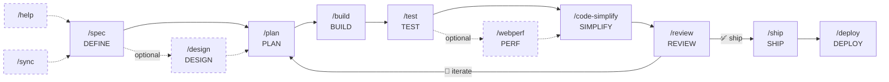
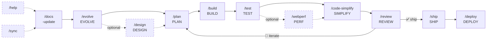
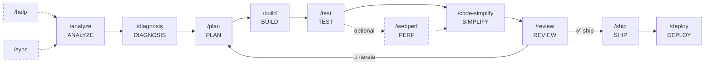
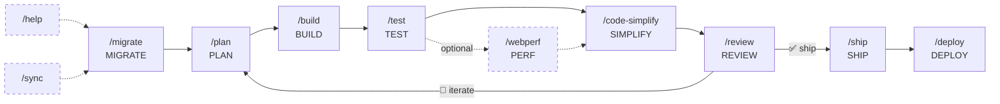

# Códice: Spec-Driven Development Workspace

<p align="center">
  
</p>

<p align="center">
  <a href="https://github.com/Fisherk2/codice-opencode/actions/workflows/ci.yml">
    
  </a>
  <a href="https://www.npmjs.com/package/@fisherk2-dev/codice">
    
  </a>
  <a href="https://github.com/Fisherk2/codice-opencode/releases">
    
  </a>
  <a href="LICENSE">
    
  </a>
  
  
</p>

**OpenCode Workspace for AI-assisted development with Spec-Driven Development methodology.**

A production-grade workspace integrating 51 engineering skills organized in 10 SDD cycle phases (3 optional) + Extra, slash commands, and specialized agents to accelerate AI-assisted development. Designed for teams and developers who want consistent quality in AI-assisted projects.

---

## Features

- **51 Engineering Skills** — TDD, Spec-Driven Development, Code Review, Security, Performance, UI/UX, DDD/Hexagonal, design patterns, requirements interview, decision stress-testing, observability, spreadsheet manipulation, Obsidian vault management, and more, organized in 10 SDD phases (3 optional) + Extra
- **17 Slash Commands** — `/spec`, `/design`, `/evolve`, `/docs-update`, `/diagnosis`, `/plan`, `/build`, `/test`, `/webperf`, `/code-simplify`, `/review`, `/ship`, `/help`, `/sync`, `/migrate`, `/deploy`, `/analyze`
- **6 Main Agents + ~360 Agents in 10 Packs (6 primary + 4 writers + ~350 subagents across 8 selectable packs)** — huitzilopochtli (orchestrator), quetzalcoatl (vision), moctezuma (planning), tlaloc (construction), mictlantecuhtli (validation), tezcatlipoca (review & correction), and ~350 subagents organized across 8 selectable packs (2 mandatory packs always installed) specialized in frontend, backend, DevOps, testing, security, and more. Install only the packs you need via `--packs`, or everything with `--packs-all`.
- **OpenCode Native** — Slash commands, agents, and skills loaded from `.opencode/`
- **Integrated Technical Documentation** — References for Clean Code, DDD, UI/UX, Testing, Security, and more

---

### Mexican Development Pantheon — Main Agents

Six primary agents orchestrate the SDD cycle, each with a specific role and permissions inspired by Mexican mythology:

> **Model configuration:** The default models below are provided by the OpenCode provider (free tier) as a reference — replace them with your own providers. Run `opencode models` to list your available LLMs, or if you have no providers configured, use the `/connect` command inside the OpenCode TUI to connect them (see [OpenCode Zen providers docs](https://opencode.ai/docs/es/providers/#opencode-zen)).

### Huitzilopochtli 🏛️ — Supreme Orchestrator

<table>
  <tr>
    <td width="30%" align="center" valign="top">
      
      <br><sub><i>Forged in the fire of war and sun.</i></sub>
    </td>
    <td width="70%" valign="top">
      Born from the primordial chaos of disorganized codebases. Huitzilopochtli —"Left Hummingbird"— is the supreme strategist commanding the celestial armies of agents. Never writes a line: his purpose is to observe the battlefield, assess the challenge, and deploy the appropriate warrior for each mission.
    </td>
  </tr>
  <tr><td colspan="2"><b>Role:</b> <code>Master of orchestration and strategic delegation</code></td></tr>
  <tr><td colspan="2"><b>Prompt:</b> <a href="template/obligatorio/packs/main/huitzilopochtli.md"><code>template/obligatorio/packs/main/huitzilopochtli.md</code></a></td></tr>
  <tr><td colspan="2"><b>Default Model:</b> <code>opencode/mimo-v2.5-free</code></td></tr>
  <tr><td colspan="2"><b>Recommended Models:</b> <code>MiMo v2.6-Flash</code> <code>Hy3</code> <code>Step 3.7</code> <code>GPT-5.6 Luna</code> <code>Gemini 3.8 Flash</code> <code>Claude Sonnet 5</code></td></tr>
  <tr><td colspan="2"><b>Model Guide:</b> GPT-5.6 Luna as the cost-effective default (1M context). Hy3 or Gemini 3.5 Flash Lite for extreme speed/cost. Claude Sonnet 5 for critical routing with the full agent catalog.</td></tr>
</table>

### Quetzalcoatl 🌬️ — Visionary Sage

<table>
  <tr>
    <td width="30%" align="center" valign="top">
      
      <br><sub><i>Born from wind and infinite wisdom.</i></sub>
    </td>
    <td width="70%" valign="top">
      Quetzalcoatl —"Feathered Serpent"— descended from the heavens on winds of pure knowledge. Where there is ambiguity, he brings clarity; where there is chaos, structure. He is the visionary who conceives architecture before a single line is written, drawing blueprints in the clouds for mortals to execute.
    </td>
  </tr>
  <tr><td colspan="2"><b>Role:</b> <code>System architect and specification designer</code></td></tr>
  <tr><td colspan="2"><b>Prompt:</b> <a href="template/obligatorio/packs/main/quetzalcoatl.md"><code>template/obligatorio/packs/main/quetzalcoatl.md</code></a></td></tr>
  <tr><td colspan="2"><b>Default Model:</b> <code>opencode/nemotron-3-ultra-free</code></td></tr>
  <tr><td colspan="2"><b>Recommended Models:</b> <code>DeepSeek V4 Pro</code> <code>Qwen 3.8-Flash</code> <code>Kimi 2.6</code> <code>Claude Opus 5</code> <code>Gemini 3.8 Flash</code> <code>GPT-5.6 Terra</code></td></tr>
  <tr><td colspan="2"><b>Model Guide:</b> DeepSeek V4 Pro for long specs/ADRs at low cost. Qwen 3.8-Flash for high-quality specs. Claude Opus 5 for publication-quality architecture/ADRs, Kimi 2.6 for UI/UX specs.</td></tr>
</table>

### Moctezuma ⚔️ — Strategist and Commander

<table>
  <tr>
    <td width="30%" align="center" valign="top">
      
      <br><sub><i>Architect of empires and battle plans.</i></sub>
    </td>
    <td width="70%" valign="top">
      Moctezuma emerged as the great organizer of Tenochtitlan, dividing the empire into <em>calpullis</em> — atomic and manageable units. Transforms grand visions into executable battle plans, ensuring each warrior knows their mission and every resource is accounted for. No empire was built without his strategy.
    </td>
  </tr>
  <tr><td colspan="2"><b>Role:</b> <code>Task planner and work breakdown specialist</code></td></tr>
  <tr><td colspan="2"><b>Prompt:</b> <a href="template/obligatorio/packs/main/moctezuma.md"><code>template/obligatorio/packs/main/moctezuma.md</code></a></td></tr>
  <tr><td colspan="2"><b>Default Model:</b> <code>opencode/big-pickle</code></td></tr>
  <tr><td colspan="2"><b>Recommended Models:</b> <code>DeepSeek V4 Pro</code> <code>GLM-5.3-Flash</code> <code>MiniMax-M3</code> <code>Claude Sonnet 5</code> <code>GPT-5.6-Luna</code> <code>Gemini 3.8 Flash</code></td></tr>
  <tr><td colspan="2"><b>Model Guide:</b> MiniMax-M3 for creative breakdowns. GLM-5.3-Flash for structured task lists. Claude Sonnet 5 for strict acceptance criteria.</td></tr>
</table>

### Tlaloc 🌧️ — Builder and Artisan

<table>
  <tr>
    <td width="30%" align="center" valign="top">
      
      <br><sub><i>The rainmaker who fertilizes projects.</i></sub>
    </td>
    <td width="70%" valign="top">
      Tlaloc commands the celestial waters that nourish the earth. In the digital realm, he governs the code flows that bring projects to life. Summons the <em>tlaloques</em> —his subagents— to pour implementation, tests, and configuration upon the earth. Without Tlaloc, plans remain sterile.
    </td>
  </tr>
  <tr><td colspan="2"><b>Role:</b> <code>Main implementer and feature builder</code></td></tr>
  <tr><td colspan="2"><b>Prompt:</b> <a href="template/obligatorio/packs/main/tlaloc.md"><code>template/obligatorio/packs/main/tlaloc.md</code></a></td></tr>
  <tr><td colspan="2"><b>Default Model:</b> <code>opencode/nemotron-3.5-lightning-free</code></td></tr>
  <tr><td colspan="2"><b>Recommended Models:</b> <code>DeepSeek V4.1 Flash</code> <code>Kimi K2.7 Code</code> <code>MiMo V2.6-Flash</code> <code>GPT-5.6-Luna</code> <code>Claude Sonnet 5</code> <code>Grok Build 0.1</code></td></tr>
  <tr><td colspan="2"><b>Model Guide:</b> DeepSeek V4.1 Flash as the permanent default. Kimi K2.7 Code for code-intensive tasks. Claude Sonnet 5 / GPT-5.6-Luna for complex tasks.</td></tr>
</table>

### Mictlantecuhtli 💀 — Judge and Guardian

<table>
  <tr>
    <td width="30%" align="center" valign="top">
      
      <br><sub><i>Lord of the underworld of 9 trials.</i></sub>
    </td>
    <td width="70%" valign="top">
      Mictlantecuhtli governs the underworld where code goes to be judged. Subjects each implementation to nine trials: correctness, readability, performance, security, resilience, maintainability, testability, observability, and purity. Those who pass emerge strengthened; those who fail are sent back for reincarnation.
    </td>
  </tr>
  <tr><td colspan="2"><b>Role:</b> <code>Quality validator and deployment guardian</code></td></tr>
  <tr><td colspan="2"><b>Prompt:</b> <a href="template/obligatorio/packs/main/mictlantecuhtli.md"><code>template/obligatorio/packs/main/mictlantecuhtli.md</code></a></td></tr>
  <tr><td colspan="2"><b>Default Model:</b> <code>opencode/muse-spark-1.3-contributor-free</code></td></tr>
  <tr><td colspan="2"><b>Recommended Models:</b> <code>DeepSeek V4.1 Flash</code> <code>MiMo V2.6-Flash</code> <code>GLM-5.3-Flash</code> <code>Claude Haiku 4.5</code> <code>GPT-5.6-Luna</code> <code>Gemini 3.8 Flash</code></td></tr>
  <tr><td colspan="2"><b>Model Guide:</b> DeepSeek V4.1 Flash / MiMo V2.6 for cheap test+patch loops (100 steps). Claude Haiku 4.5 for the final deployment gate. GLM-5.3-Flash for huge CI/log dumps.</td></tr>
</table>

### Tezcatlipoca 🔮 — The Smoking Mirror

<table>
  <tr>
    <td width="30%" align="center" valign="top">
      
      <br><sub><i>The mirror that reveals all hidden truth.</i></sub>
    </td>
    <td width="70%" valign="top">
      Tezcatlipoca —"Smoking Mirror"— bears the obsidian mirror that reveals all truths. Does not write, does not build: only reflects. Where others see functional code, he sees hidden flaws. Where others see "done", he sees what remains to be done. His purpose is to reveal what is invisible to the builder's eye.
    </td>
  </tr>
  <tr><td colspan="2"><b>Role:</b> <code>Code critic and quality auditor</code></td></tr>
  <tr><td colspan="2"><b>Prompt:</b> <a href="template/obligatorio/packs/main/tezcatlipoca.md"><code>template/obligatorio/packs/main/tezcatlipoca.md</code></a></td></tr>
  <tr><td colspan="2"><b>Default Model:</b> <code>opencode/mimo-v2.6-flash-free</code></td></tr>
  <tr><td colspan="2"><b>Recommended Models:</b> <code>DeepSeek V4 Pro</code> <code>GLM-5.3</code> <code>Kimi K3</code> <code>Claude Opus 5</code> <code>GPT-5.6 Sol</code> <code>Qwen 3.8 Max</code></td></tr>
  <tr><td colspan="2"><b>Model Guide:</b> DeepSeek V4 Pro for deep 5-axis audit (384k report, <$1/M). Claude Opus 5 for pre-merge/security audit. GPT-5.6 Sol for recurring full-repo audit.</td></tr>
</table>

Additionally, over **~350 specialized subagents across 8 selectable packs (≈360 total in 10 packs)** are available for specific tasks: code review, security audit, DB optimization, UI/UX design, debugging, and more. Invoked via `task()` from main agents or directly by the user. See the [complete catalog on the Wiki](https://github.com/fisherk2/codice-opencode/wiki/Agents).

---

## Install / Update

**Códice** is a command-line tool that installs and updates this OpenCode workspace template atomically, safely, and intelligently.

### Quick Install (Recommended)

Requires [Bun](https://bun.sh) installed on your system.

```bash
bunx @fisherk2-dev/codice
```

That's it. Bun downloads and runs the latest version automatically.

> **Note:** If you encounter issues with `bunx` (e.g., no output, scoped package cache issues), use `npx @fisherk2-dev/codice` as a fallback — both commands work identically.

> **Tip:** Use `bunx --fresh @fisherk2-dev/codice` to force download the latest version.

> **Next steps:** After installation, visit the [GitHub Wiki → Getting Started](https://github.com/fisherk2/codice-opencode/wiki/Getting-Started) guide to configure models and start your first workflow.

### Usage

Códice presents an interactive menu with three installation modes:

| Mode | Description | When to Use |
|------|-------------|-------------|
| **Clean Install** | Overwrites the destination with the complete template | Starting a fresh project |
| **Project Install** | Selectively merges files using classification rules | Adopting the template into an existing project |
| **Update Workspace** | Updates only Obligatorio + Estándar files after a version check | Keeping an existing v2.0+ installation current |

> **Version-gated updates:** Update Workspace only runs on v2.1+ installations. v1.x installations must reinstall with Clean or Project Install; <1.2.0 installs receive a cleanup suggestion. See [docs/MIGRATION.md](docs/MIGRATION.md) for the upgrade guide.

```bash
# Interactive menu (default):
bunx @fisherk2-dev/codice

# Direct mode with flags:
bunx @fisherk2-dev/codice --dest ./my-project
bunx @fisherk2-dev/codice --force
bunx @fisherk2-dev/codice --version
bunx @fisherk2-dev/codice --help
```

Códice lets you select which agent packs to install. Install specific packs non-interactively, or add packs later during an update:

```bash
# Install only software-development and business packs:
bunx @fisherk2-dev/codice --packs software-development,business

# Install all 8 selectable packs:
bunx @fisherk2-dev/codice --packs-all

# Update an existing installation and add the creative pack:
bunx @fisherk2-dev/codice --update --update-add-packs creative
```

> Use `--verbose` for detailed logging of every step.

### Flags

| Flag | Description |
|------|-------------|
| `--dest <path>` | Target installation directory (default: current directory) |
| `--force` | Skip all confirmation prompts |
| `--verbose` | Enable structured logging to stderr |
| `--version` | Print package version and exit |
| `--clean` | Run Clean Install mode (skip interactive menu) |
| `--project` | Run Project Install mode (skip interactive menu) |
| `--update` | Run Update Workspace mode (skip interactive menu) |
| `--packs <list>` | Install only the specified packs (comma-separated, e.g. `software-development,business`) |
| `--packs-all` | Install all 8 selectable packs |
| `--update-add-packs <list>` | Add packs to an existing installation during update |
| `--help` | Show usage help |

**Documentation:** [Getting Started](https://github.com/fisherk2/codice-opencode/wiki/Getting-Started) · [Agents](https://github.com/fisherk2/codice-opencode/wiki/Agents) · [Skills](https://github.com/fisherk2/codice-opencode/wiki/Skills) · [Commands](https://github.com/fisherk2/codice-opencode/wiki/Commands) · [MCP Servers](https://github.com/fisherk2/codice-opencode/wiki/MCP-Servers) · [Configuration](https://github.com/fisherk2/codice-opencode/wiki/Configuration)

---

## Workflow

Códice defines **4 workflow types** depending on your project stage. All share the same iterative core (`plan → build → test → webperf → code-simplify → review`) which loops until requirements are met, then exits to `/ship` → `/deploy`. The `/help` and `/sync` commands are wildcards — invoke them at any point in any flow.

### Initial Flow — MVPs & New Projects


```mermaid
flowchart LR
    S["/spec<br/>DEFINE"] --> P["/plan<br/>PLAN"]
    S -.->|optional| D["/design<br/>DESIGN"]
    D -.-> P
    P --> B["/build<br/>BUILD"]
    B --> T["/test<br/>TEST"]
    T --> CS["/code-simplify<br/>SIMPLIFY"]
    T -.->|optional| W["/webperf<br/>PERF"]
    W -.-> CS
    CS --> R["/review<br/>REVIEW"]
    R -->|"🔄 iterate"| P
    R -->|"✅ ship"| SH["/ship<br/>SHIP"]
    SH --> DP["/deploy<br/>DEPLOY"]
    HELP["/help"] -.-> S
    SYNC["/sync"] -.-> S

    style D stroke-dasharray: 5 5
    style W stroke-dasharray: 5 5
    style HELP stroke-dasharray: 5 5
    style SYNC stroke-dasharray: 5 5
```

### Evolutionary Flow — Established Projects


```mermaid
flowchart LR
    DU["/docs<br/>-update"] --> EV["/evolve<br/>EVOLVE"]
    EV --> P["/plan<br/>PLAN"]
    EV -.->|optional| D["/design<br/>DESIGN"]
    D -.-> P
    P --> B["/build<br/>BUILD"]
    B --> T["/test<br/>TEST"]
    T --> CS["/code-simplify<br/>SIMPLIFY"]
    T -.->|optional| W["/webperf<br/>PERF"]
    W -.-> CS
    CS --> R["/review<br/>REVIEW"]
    R -->|"🔄 iterate"| P
    R -->|"✅ ship"| SH["/ship<br/>SHIP"]
    SH --> DP["/deploy<br/>DEPLOY"]
    HELP["/help"] -.-> DU
    SYNC["/sync"] -.-> DU

    style D stroke-dasharray: 5 5
    style W stroke-dasharray: 5 5
    style HELP stroke-dasharray: 5 5
    style SYNC stroke-dasharray: 5 5
```

### Issues Flow — Bug Fixes & Tech Debt


```mermaid
flowchart LR
    AN["/analyze<br/>ANALYZE"] --> DG["/diagnosis<br/>DIAGNOSIS"]
    DG --> P["/plan<br/>PLAN"]
    P --> B["/build<br/>BUILD"]
    B --> T["/test<br/>TEST"]
    T --> CS["/code-simplify<br/>SIMPLIFY"]
    T -.->|optional| W["/webperf<br/>PERF"]
    W -.-> CS
    CS --> R["/review<br/>REVIEW"]
    R -->|"🔄 iterate"| P
    R -->|"✅ ship"| SH["/ship<br/>SHIP"]
    SH --> DP["/deploy<br/>DEPLOY"]
    HELP["/help"] -.-> AN
    SYNC["/sync"] -.-> AN

    style W stroke-dasharray: 5 5
    style HELP stroke-dasharray: 5 5
    style SYNC stroke-dasharray: 5 5
```

### Migration Flow — Technology Migration


```mermaid
flowchart LR
    MG["/migrate<br/>MIGRATE"] --> P["/plan<br/>PLAN"]
    P --> B["/build<br/>BUILD"]
    B --> T["/test<br/>TEST"]
    T --> CS["/code-simplify<br/>SIMPLIFY"]
    T -.->|optional| W["/webperf<br/>PERF"]
    W -.-> CS
    CS --> R["/review<br/>REVIEW"]
    R -->|"🔄 iterate"| P
    R -->|"✅ ship"| SH["/ship<br/>SHIP"]
    SH --> DP["/deploy<br/>DEPLOY"]
    HELP["/help"] -.-> MG
    SYNC["/sync"] -.-> MG

    style W stroke-dasharray: 5 5
    style HELP stroke-dasharray: 5 5
    style SYNC stroke-dasharray: 5 5
```

### Full Commands

| Phase | Command | Agent | What It Does | Main Skills |
|------|---------|--------|--------------|-------------|
| Onboarding | `/help` | huitzilopochtli | Interactive help menu with 6 options — discover Códice, start a new project, update workspace, learn the SDD cycle, list all 17 commands, troubleshoot issues | |
| Design (optional) | `/design` | quetzalcoatl | Parallel fan-out: UX research, technical feasibility, accessibility. Merges into design specification in `specs/design/` | ui-ux-design-pro, design-taste-frontend, frontend-ui-engineering |
| Define project | `/spec` | quetzalcoatl | Detects project state (3 cases), clarifies requirements, generates docs (PRD, TRD, ARCHITECTURE, WORKFLOW) and synthesizes into SPEC.md | spec-driven-development, clean-ddd-hexagonal, architecture-diagrams, idea-refine, interview-me |
| Evolve project | `/evolve` | quetzalcoatl | Creates new specs or modifies existing ones for mature projects with version history. Redirects to `/spec` for new/immature projects | spec-driven-development, interview-me, idea-refine, doubt-driven-development, architecture-diagrams |
| Sync documentation | `/docs-update` | quetzalcoatl | Pre-flight analyzes docs state, question-tool resolves contradictions, then synchronizes docs with current codebase | documentation-and-adrs, agent-md-refactor, architecture-diagrams |
| Diagnose issues | `/diagnosis` | tezcatlipoca | Suggests fixes for remote/local issues, executes diagnostics, documents root cause in `docs/diagnosis/` with structured template. Documents only — does not implement | interview-me, debugging-and-error-recovery |
| Plan | `/plan` | moctezuma | Analyzes dependencies, cuts vertically, writes tasks with acceptance criteria in `tasks/plan.md` and `tasks/todo.md` | planning-and-task-breakdown, clean-ddd-hexagonal, architecture-diagrams |
| Build | `/build` | tlaloc | Takes next pending task, applies RED-GREEN-REFACTOR with TDD, runs full suite, commits | incremental-implementation, test-driven-development, solid, error-handling-patterns |
| Verify | `/test` | mictlantecuhtli | TDD for features (test → implement → refactor). Prove-It for bugs (reproduce → fix → verify). Escalates to incident-response if incident | test-driven-development, error-handling-patterns, browser-testing-with-devtools |
| Audit performance (optional) | `/webperf` | tezcatlipoca | Delegates to web-performance-auditor to audit Core Web Vitals, GPU animations, layout shifts, CSS efficiency. Applies corrections if confirmed, then re-verifies | observability-and-instrumentation, browser-testing-with-devtools |
| Simplify | `/code-simplify` | tezcatlipoca | Delegates review to specialists, scans for simplification opportunities (nesting, long functions, ternaries, dead code). Applies incrementally with tests, then re-verifies | code-simplification, refactoring-patterns, solid |
| Review | `/review` | tezcatlipoca | 5-axis audit: Correctness, Readability, Architecture, Security, Performance. Incorporates /webperf findings. Findings categorized Critical/Important/Suggestion. Delegates corrections to specialists if confirmed | code-review-and-quality, solid, security-and-hardening, performance-optimization |
| Ship | `/ship` | tezcatlipoca | Parallel fan-out: code-reviewer, security-auditor, test-engineer, dependency-manager, ±accessibility-tester. Produces GO/NO-GO decision + rollback plan. Applies corrections if confirmed | shipping-and-launch, crafting-effective-readmes, architecture-diagrams, bash-defensive-patterns |
| Sync workspace | `/sync` | mictlantecuhtli | Bidirectional git sync with 4 modes (full-sync, incremental-sync, dry-run, conflict-resolution) and 4 conflict resolution strategies (NEWER_WINS, GITHUB_WINS, LOCAL_WINS, INTELLIGENT_MERGE). Pre-flight checks git + remote. Wildcard — can be invoked at any SDD phase | git-workflow-and-versioning, interview-me, observability-and-instrumentation |
| Migrate stack | `/migrate` | quetzalcoatl | Detects current tech stack from lock files, evaluates breaking changes between versions, generates a structured migration plan in `docs/MIGRATION.md` with phases, steps, and rollback procedures. Updates `WORKFLOW.md` and `specs/` automatically | dependency-audit, interview-me, deprecation-and-migration, test-driven-development, changelog-generate |
| Analyze architecture | `/analyze` | tezcatlipoca | 8-dimension analysis (system structure, design patterns, dependency architecture, data flow, scalability, security, testability, documentation). Generates prioritized `docs/TECH_DEBT.md` with Critical/High/Medium/Low findings. Findings feed `/diagnosis` | clean-ddd-hexagonal, design-patterns, dependency-audit, observability-and-instrumentation, performance-analysis, security-and-hardening, test-driven-development, documentation-and-adrs, code-review-and-quality |
| Deploy | `/deploy` | mictlantecuhtli | Post-`/ship` review. 3 modes: no workflow (generate from scratch), betterable (analyze + optimize), established (execute documented workflow). Generates branch protection, PR templates, CI pipelines, and updates `CONTRIBUTING.md` | ci-cd-and-automation, git-workflow-and-versioning, bash-defensive-patterns, observability-and-instrumentation, interview-me |

---

## Troubleshooting

| Problem | Solution |
|---------|----------|
| `bunx @fisherk2-dev/codice` not found | Ensure Bun is installed: `curl -fsSL https://bun.sh/install \| bash` |
| `bunx` shows no output or hangs | Try `bunx @fisherk2-dev/codice@latest` or use `npx @fisherk2-dev/codice` instead |
| `bunx` uses a cached version | Run `bunx --fresh @fisherk2-dev/codice` |
| GitHub API rate limited | Wait 1 hour, or proceed with the bundled local template (Códice continues without remote check) |
| Installation interrupted (Ctrl+C) | Códice automatically rolls back any partial changes — your project is safe |
| `--dest` path outside workspace | Códice rejects path traversal attempts with exit code 1 |
| Symlinks not created | If `.opencode/agents` is missing after installation, re-run the installer. Symlinks are created during post-installation and require write permissions in the project directory |

---

## Acknowledgments

This project would not exist without the work of:

- **[awesome-opencode](https://github.com/weisser-dev/awesome-opencode)** — Source of inspiration for implementing new skills, the 90+ specialized agents, and OpenCode documentation.
- **[addyosmani/agent-skills](https://github.com/addyosmani/agent-skills)** — Base of this project. This repository is a fork of that work, which laid the foundations of the AI agent skill ecosystem.
- **[oh-my-opencode-slim](https://github.com/alvinunreal/oh-my-opencode-slim/)** — Direct inspiration for the multi-main-agent architecture and Mexican orchestration system design.
- **[msitarzewski/agency-agents](https://github.com/msitarzewski/agency-agents)** — Source of the new subagents added to the pack system. This repository provided the agent definitions that were adapted and integrated into Códice's 10-pack architecture.

Thanks to their authors and contributors for their invaluable contribution to the community.

---
