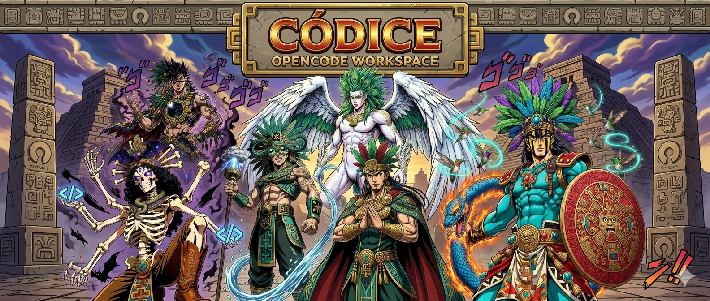
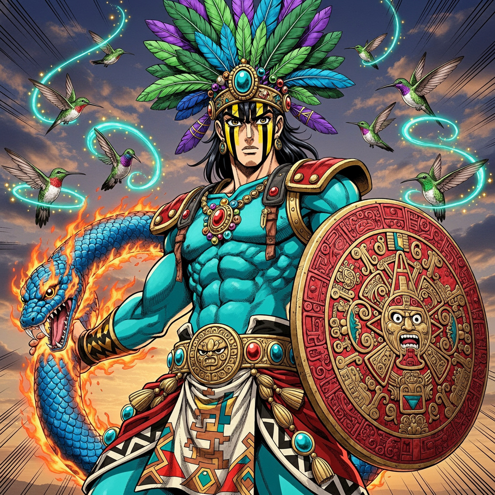
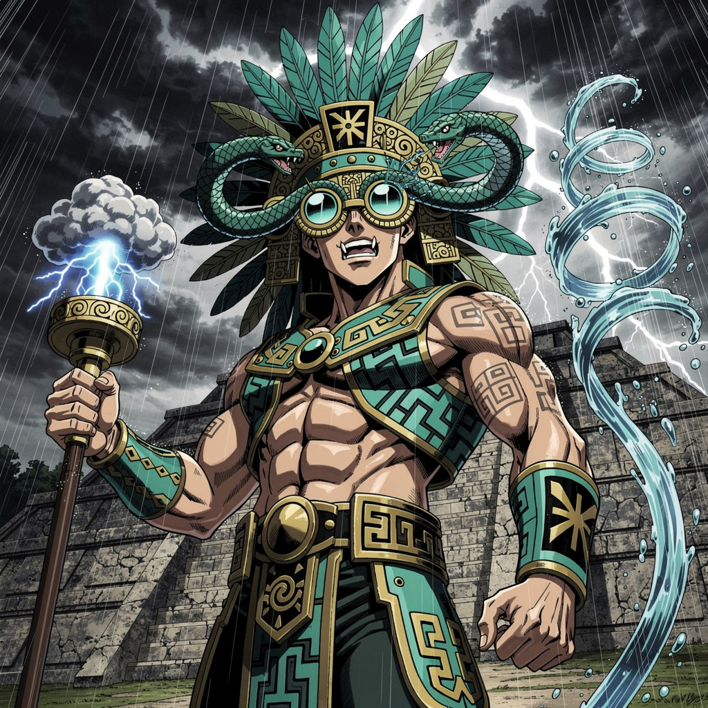
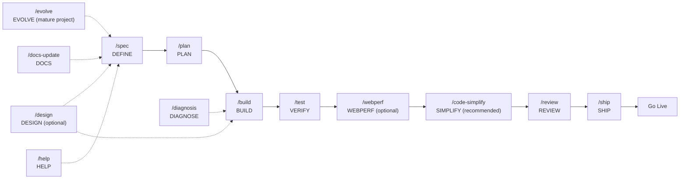

# Códice: Spec-Driven Development Workspace

<p align="center">
  
</p>

<p align="center">
  <a href="https://github.com/Fisherk2/codice-opencode/actions/workflows/ci.yml">
    
  </a>
  <a href="https://www.npmjs.com/package/@fisherk2-dev/codice">
    
  </a>
  <a href="https://github.com/Fisherk2/codice-opencode/releases">
    
  </a>
  <a href="LICENSE">
    
  </a>
  
  
</p>

**OpenCode Workspace for AI-assisted development with Spec-Driven Development methodology.**

A production-grade workspace integrating 51 engineering skills organized in 10 SDD cycle phases (3 optional) + Extra, slash commands, and specialized agents to accelerate AI-assisted development. Designed for teams and developers who want consistent quality in AI-assisted projects.

---

## Features

- **52 Engineering Skills** — TDD, Spec-Driven Development, Code Review, Security, Performance, UI/UX, DDD/Hexagonal, design patterns, requirements interview, decision stress-testing, observability, spreadsheet manipulation, Obsidian vault management, and more, organized in 10 SDD phases (3 optional) + Extra
- **13 Slash Commands** — `/spec`, `/design`, `/evolve`, `/docs-update`, `/diagnosis`, `/plan`, `/build`, `/test`, `/webperf`, `/code-simplify`, `/review`, `/ship`, `/help`
- **6 Main Agents + 98 Subagents** — huitzilopochtli (orchestrator), quetzalcoatl (vision), moctezuma (planning), tlaloc (construction), mictlantecuhtli (validation), tezcatlipoca (review), and 98 subagents specialized in frontend, backend, DevOps, testing, security, and more
- **OpenCode Native** — Slash commands, agents, and skills loaded from `.opencode/`
- **Integrated Technical Documentation** — References for Clean Code, DDD, UI/UX, Testing, Security, and more

---

### Mexican Development Pantheon — Main Agents

Six primary agents orchestrate the SDD cycle, each with a specific role and permissions inspired by Mexican mythology:

> **Model configuration:** The default models below are provided by the OpenCode provider (free tier) as a reference — replace them with your own providers. Run `opencode models` to list your available LLMs, or if you have no providers configured, use the `/connect` command inside the OpenCode TUI to connect them (see [OpenCode Zen providers docs](https://opencode.ai/docs/es/providers/#opencode-zen)).

### Huitzilopochtli 🏛️ — Supreme Orchestrator

<table>
  <tr>
    <td width="30%" align="center" valign="top">
      
      <br><sub><i>Forged in the fire of war and sun.</i></sub>
    </td>
    <td width="70%" valign="top">
      Born from the primordial chaos of disorganized codebases. Huitzilopochtli —"Left Hummingbird"— is the supreme strategist commanding the celestial armies of agents. Never writes a line: his purpose is to observe the battlefield, assess the challenge, and deploy the appropriate warrior for each mission.
    </td>
  </tr>
  <tr><td colspan="2"><b>Role:</b> <code>Master of orchestration and strategic delegation</code></td></tr>
  <tr><td colspan="2"><b>Prompt:</b> <a href="template/obligatorio/agents/huitzilopochtli.md"><code>template/obligatorio/agents/huitzilopochtli.md</code></a></td></tr>
  <tr><td colspan="2"><b>Default Model:</b> <code>opencode/ling-3.0-flash-free</code></td></tr>
  <tr><td colspan="2"><b>Recommended Models:</b> <code>MiniMax-M3</code> <code>Hy3</code> <code>Step 3.7</code> <code>GPT-5.6 Luna</code> <code>Gemini 3.5 Flash Lite</code> <code>Claude Sonnet 4.6</code></td></tr>
  <tr><td colspan="2"><b>Model Guide:</b> GPT-5.6 Luna as the cost-effective default (1M context). Hy3 or Gemini 3.5 Flash Lite for extreme speed/cost. Claude Sonnet 4.6 for critical routing with the full agent catalog.</td></tr>
</table>

### Quetzalcoatl 🌬️ — Visionary Sage

<table>
  <tr>
    <td width="30%" align="center" valign="top">
      
      <br><sub><i>Born from wind and infinite wisdom.</i></sub>
    </td>
    <td width="70%" valign="top">
      Quetzalcoatl —"Feathered Serpent"— descended from the heavens on winds of pure knowledge. Where there is ambiguity, he brings clarity; where there is chaos, structure. He is the visionary who conceives architecture before a single line is written, drawing blueprints in the clouds for mortals to execute.
    </td>
  </tr>
  <tr><td colspan="2"><b>Role:</b> <code>System architect and specification designer</code></td></tr>
  <tr><td colspan="2"><b>Prompt:</b> <a href="template/obligatorio/agents/quetzalcoatl.md"><code>template/obligatorio/agents/quetzalcoatl.md</code></a></td></tr>
  <tr><td colspan="2"><b>Default Model:</b> <code>opencode/big-pickle</code></td></tr>
  <tr><td colspan="2"><b>Recommended Models:</b> <code>DeepSeek V4 Pro</code> <code>Qwen 3.7 Plus</code> <code>Kimi K3</code> <code>Claude Opus 4.6</code> <code>Gemini 3.1 Pro</code> <code>GPT-5.6 Terra</code></td></tr>
  <tr><td colspan="2"><b>Model Guide:</b> DeepSeek V4 Pro for long specs/ADRs at low cost. Qwen 3.7 for high-quality specs. Claude Opus 4.6 for publication-quality architecture/ADRs.</td></tr>
</table>

### Moctezuma ⚔️ — Strategist and Commander

<table>
  <tr>
    <td width="30%" align="center" valign="top">
      
      <br><sub><i>Architect of empires and battle plans.</i></sub>
    </td>
    <td width="70%" valign="top">
      Moctezuma emerged as the great organizer of Tenochtitlan, dividing the empire into <em>calpullis</em> — atomic and manageable units. Transforms grand visions into executable battle plans, ensuring each warrior knows their mission and every resource is accounted for. No empire was built without his strategy.
    </td>
  </tr>
  <tr><td colspan="2"><b>Role:</b> <code>Task planner and work breakdown specialist</code></td></tr>
  <tr><td colspan="2"><b>Prompt:</b> <a href="template/obligatorio/agents/moctezuma.md"><code>template/obligatorio/agents/moctezuma.md</code></a></td></tr>
  <tr><td colspan="2"><b>Default Model:</b> <code>opencode/nemotron-3-ultra-free</code></td></tr>
  <tr><td colspan="2"><b>Recommended Models:</b> <code>Nemotron 3 Ultra Free</code> <code>GLM-5.2</code> <code>MiniMax-M3</code> <code>Claude Sonnet 4.6</code> <code>GPT-5.4</code> <code>Gemini 3.5 Flash</code></td></tr>
  <tr><td colspan="2"><b>Model Guide:</b> Nemotron 3 Ultra Free as the default (deterministic, free). GLM-5.2 for structured task lists. Claude Sonnet 4.6 for strict acceptance criteria.</td></tr>
</table>

### Tlaloc 🌧️ — Builder and Artisan

<table>
  <tr>
    <td width="30%" align="center" valign="top">
      
      <br><sub><i>The rainmaker who fertilizes projects.</i></sub>
    </td>
    <td width="70%" valign="top">
      Tlaloc commands the celestial waters that nourish the earth. In the digital realm, he governs the code flows that bring projects to life. Summons the <em>tlaloques</em> —his subagents— to pour implementation, tests, and configuration upon the earth. Without Tlaloc, plans remain sterile.
    </td>
  </tr>
  <tr><td colspan="2"><b>Role:</b> <code>Main implementer and feature builder</code></td></tr>
  <tr><td colspan="2"><b>Prompt:</b> <a href="template/obligatorio/agents/tlaloc.md"><code>template/obligatorio/agents/tlaloc.md</code></a></td></tr>
  <tr><td colspan="2"><b>Default Model:</b> <code>opencode/deepseek-v4-flash-free</code></td></tr>
  <tr><td colspan="2"><b>Recommended Models:</b> <code>DeepSeek V4 Flash</code> <code>Kimi K2.7 Code</code> <code>DeepSeek V4 Pro</code> <code>GPT-5.3 Codex</code> <code>Claude Sonnet 4.6</code> <code>Grok Build 0.1</code></td></tr>
  <tr><td colspan="2"><b>Model Guide:</b> DeepSeek V4 Flash as the permanent default (best cost/quality for 150 steps, 384k output). Kimi K2.7 Code for code-intensive tasks. Claude Sonnet 4.6 / GPT-5.3 Codex for strict architectural rules.</td></tr>
</table>

### Mictlantecuhtli 💀 — Judge and Guardian

<table>
  <tr>
    <td width="30%" align="center" valign="top">
      
      <br><sub><i>Lord of the underworld of 9 trials.</i></sub>
    </td>
    <td width="70%" valign="top">
      Mictlantecuhtli governs the underworld where code goes to be judged. Subjects each implementation to nine trials: correctness, readability, performance, security, resilience, maintainability, testability, observability, and purity. Those who pass emerge strengthened; those who fail are sent back for reincarnation.
    </td>
  </tr>
  <tr><td colspan="2"><b>Role:</b> <code>Quality validator and deployment guardian</code></td></tr>
  <tr><td colspan="2"><b>Prompt:</b> <a href="template/obligatorio/agents/mictlantecuhtli.md"><code>template/obligatorio/agents/mictlantecuhtli.md</code></a></td></tr>
  <tr><td colspan="2"><b>Default Model:</b> <code>opencode/laguna-s-2.1-free</code></td></tr>
  <tr><td colspan="2"><b>Recommended Models:</b> <code>DeepSeek V4 Flash</code> <code>MiMo V2.5</code> <code>Laguna S 2.1</code> <code>Claude Haiku 4.5</code> <code>GPT-5.4 Mini</code> <code>Gemini 3.5 Flash Lite</code></td></tr>
  <tr><td colspan="2"><b>Model Guide:</b> DeepSeek V4 Flash / MiMo V2.5 for cheap test+patch loops (100 steps). Claude Haiku 4.5 for the final deployment gate. Gemini 3.5 Flash Lite for huge CI/log dumps.</td></tr>
</table>

### Tezcatlipoca 🔮 — The Smoking Mirror

<table>
  <tr>
    <td width="30%" align="center" valign="top">
      
      <br><sub><i>The mirror that reveals all hidden truth.</i></sub>
    </td>
    <td width="70%" valign="top">
      Tezcatlipoca —"Smoking Mirror"— bears the obsidian mirror that reveals all truths. Does not write, does not build: only reflects. Where others see functional code, he sees hidden flaws. Where others see "done", he sees what remains to be done. His purpose is to reveal what is invisible to the builder's eye.
    </td>
  </tr>
  <tr><td colspan="2"><b>Role:</b> <code>Code critic and quality auditor</code></td></tr>
  <tr><td colspan="2"><b>Prompt:</b> <a href="template/obligatorio/agents/tezcatlipoca.md"><code>template/obligatorio/agents/tezcatlipoca.md</code></a></td></tr>
  <tr><td colspan="2"><b>Default Model:</b> <code>opencode/mimo-v2.5-free</code></td></tr>
  <tr><td colspan="2"><b>Recommended Models:</b> <code>DeepSeek V4 Pro</code> <code>GLM-5.2</code> <code>Kimi K3</code> <code>Claude Opus 4.6</code> <code>GPT-5.6 Sol</code> <code>Gemini 3.1 Pro</code></td></tr>
  <tr><td colspan="2"><b>Model Guide:</b> DeepSeek V4 Pro for deep 5-axis audit (384k report, <$1/M). Claude Opus 4.6 for pre-merge/security audit. Gemini 3.1 Pro for recurring full-repo audit.</td></tr>
</table>

Additionally, over **98 specialized subagents** are available for specific tasks: code review, security audit, DB optimization, UI/UX design, debugging, and more. Invoked via `task()` from main agents or directly by the user. See the [complete catalog on the Wiki](https://github.com/fisherk2/codice-opencode/wiki/Agents).

---

## Install / Update

**Códice** is a command-line tool that installs and updates this OpenCode workspace template atomically, safely, and intelligently.

### Quick Install (Recommended)

Requires [Bun](https://bun.sh) installed on your system.

```bash
bunx @fisherk2-dev/codice
```

That's it. Bun downloads and runs the latest version automatically.

> **Note:** If you encounter issues with `bunx` (e.g., no output, scoped package cache issues), use `npx @fisherk2-dev/codice` as a fallback — both commands work identically.

> **Tip:** Use `bunx --fresh @fisherk2-dev/codice` to force download the latest version.

> **Next steps:** After installation, visit the [GitHub Wiki → Getting Started](https://github.com/fisherk2/codice-opencode/wiki/Getting-Started) guide to configure models, install plugin dependencies, and start your first workflow.

### Usage

Códice presents an interactive menu with three installation modes:

| Mode | Description | When to Use |
|------|-------------|-------------|
| **Clean Install** | Overwrites the destination with the complete template | Starting a fresh project |
| **Project Install** | Selectively merges files using classification rules | Adopting the template into an existing project |
| **Update Workspace** | Updates only Obligatorio + Estándar files after a version check | Keeping an existing installation current |

```bash
# Interactive menu (default):
bunx @fisherk2-dev/codice

# Direct mode with flags:
bunx @fisherk2-dev/codice --dest ./my-project
bunx @fisherk2-dev/codice --force
bunx @fisherk2-dev/codice --version
bunx @fisherk2-dev/codice --help
```

> Use `--verbose` for detailed logging of every step.

### Flags

| Flag | Description |
|------|-------------|
| `--dest <path>` | Target installation directory (default: current directory) |
| `--force` | Skip all confirmation prompts |
| `--verbose` | Enable structured logging to stderr |
| `--version` | Print package version and exit |
| `--clean` | Run Clean Install mode (skip interactive menu) |
| `--project` | Run Project Install mode (skip interactive menu) |
| `--update` | Run Update Workspace mode (skip interactive menu) |
| `--help` | Show usage help |

---

## Workflow


```mermaid
flowchart LR
    A["/spec<br/>DEFINE"] --> B["/plan<br/>PLAN"]
    B --> C["/build<br/>BUILD"]
    C --> D["/test<br/>VERIFY"]
    D --> E["/webperf<br/>WEBPERF (optional)"]
    E --> F["/code-simplify<br/>SIMPLIFY (recommended)"]
    F --> G["/review<br/>REVIEW"]
    G --> H["/ship<br/>SHIP"]
    H --> I["Go Live"]

    J["/evolve<br/>EVOLVE (mature project)"] -.-> A
    K["/design<br/>DESIGN (optional)"] -.-> A
    K -.-> C
    L["/docs-update<br/>DOCS"] -.-> A
    M["/diagnosis<br/>DIAGNOSE"] -.-> C
    N["/help<br/>HELP"] -.-> A
```

### Full Cycle

| Phase | Command | Agent | What It Does | Main Skills |
|------|---------|--------|--------------|-------------|
| Onboarding | `/help` | huitzilopochtli | Interactive help menu with 6 options — discover Códice, start a new project, update workspace, learn the SDD cycle, list all 13 commands, troubleshoot issues | |
| Design (optional) | `/design` | quetzalcoatl | Parallel fan-out: UX research, technical feasibility, accessibility. Merges into design specification in `specs/design/` | ui-ux-design-pro, design-taste-frontend, frontend-ui-engineering |
| Define (new) | `/spec` | quetzalcoatl | Detects project state (3 cases), clarifies requirements, generates docs (PRD, TRD, ARCHITECTURE, WORKFLOW) and synthesizes into SPEC.md | spec-driven-development, clean-ddd-hexagonal, architecture-diagrams, idea-refine, interview-me |
| Evolve (mature) | `/evolve` | quetzalcoatl | Creates new specs or modifies existing ones for mature projects with version history. Redirects to `/spec` for new/immature projects | spec-driven-development, interview-me, idea-refine, doubt-driven-development, architecture-diagrams |
| Sync documentation | `/docs-update` | quetzalcoatl | Pre-flight analyzes docs state, question-tool resolves contradictions, then synchronizes docs with current codebase | documentation-and-adrs, agent-md-refactor, architecture-diagrams |
| Diagnose issues | `/diagnosis` | quetzalcoatl | Analyzes remote issues, executes diagnostic commands, documents root cause in `docs/diagnosis/` with structured template | interview-me, debugging-and-error-recovery |
| Plan | `/plan` | moctezuma | Analyzes dependencies, cuts vertically, writes tasks with acceptance criteria in `tasks/plan.md` and `tasks/todo.md` | planning-and-task-breakdown, clean-ddd-hexagonal, architecture-diagrams |
| Build | `/build` | tlaloc | Takes next pending task, applies RED-GREEN-REFACTOR with TDD, runs full suite, commits | incremental-implementation, test-driven-development, solid, error-handling-patterns |
| Verify | `/test` | mictlantecuhtli | TDD for features (test → implement → refactor). Prove-It for bugs (reproduce → fix → verify). Escalates to incident-response if incident | test-driven-development, error-handling-patterns, browser-testing-with-devtools |
| Audit performance (optional) | `/webperf` | mictlantecuhtli | Delegates to web-performance-auditor to audit Core Web Vitals, GPU animations, layout shifts, CSS efficiency. Findings for /review | observability-and-instrumentation, browser-testing-with-devtools |
| Simplify (recommended) | `/code-simplify` | tlaloc | Scans code for simplification opportunities (nesting, long functions, ternaries, dead code). Applies incrementally with tests | code-simplification, refactoring-patterns, solid |
| Review | `/review` | tezcatlipoca | 5-axis audit: Correctness, Readability, Architecture, Security, Performance. Incorporates /webperf findings. Findings categorized Critical/Important/Suggestion | code-review-and-quality, solid, security-and-hardening, performance-optimization |
| Ship | `/ship` | mictlantecuhtli | Parallel fan-out: code-reviewer, security-auditor, test-engineer, dependency-manager, ±accessibility-tester. Produces GO/NO-GO decision + rollback plan | shipping-and-launch, crafting-effective-readmes, architecture-diagrams, bash-defensive-patterns |

---

## Troubleshooting

| Problem | Solution |
|---------|----------|
| `bunx @fisherk2-dev/codice` not found | Ensure Bun is installed: `curl -fsSL https://bun.sh/install \| bash` |
| `bunx` shows no output or hangs | Try `bunx @fisherk2-dev/codice@latest` or use `npx @fisherk2-dev/codice` instead |
| `bunx` uses a cached version | Run `bunx --fresh @fisherk2-dev/codice` |
| GitHub API rate limited | Wait 1 hour, or proceed with the bundled local template (Códice continues without remote check) |
| Installation interrupted (Ctrl+C) | Códice automatically rolls back any partial changes — your project is safe |
| `--dest` path outside workspace | Códice rejects path traversal attempts with exit code 1 |
| Symlinks not created | If `.opencode/agents` is missing after installation, re-run the installer. Symlinks are created during post-installation and require write permissions in the project directory |

---

## Acknowledgments

This project would not exist without the work of:

- **[awesome-opencode](https://github.com/weisser-dev/awesome-opencode)** — Source of inspiration for implementing new skills, the 90+ specialized agents, and OpenCode documentation.
- **[addyosmani/agent-skills](https://github.com/addyosmani/agent-skills)** — Base of this project. This repository is a fork of that work, which laid the foundations of the AI agent skill ecosystem.
- **[oh-my-opencode-slim](https://github.com/alvinunreal/oh-my-opencode-slim/)** — Direct inspiration for the multi-main-agent architecture and Mexican orchestration system design.

Thanks to their authors and contributors for their invaluable contribution to the community.

---
