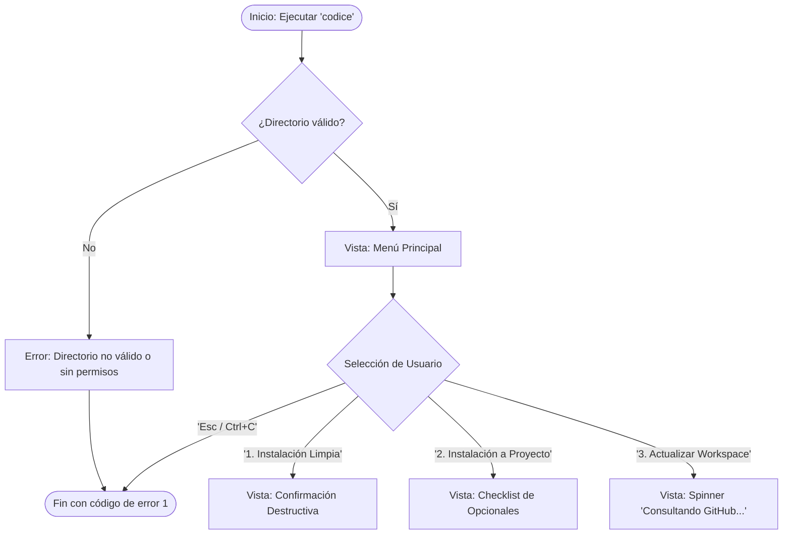
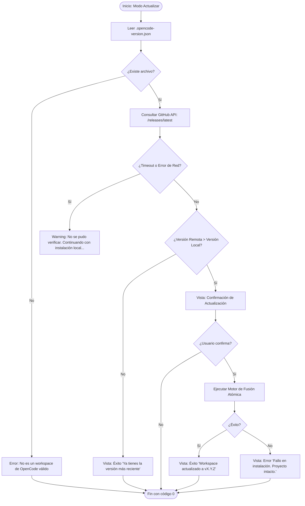

# Flujo de Navegación (TUI) – Códice: Opencode Workspace Installer v1.0.0
**Fecha:** 2026-06-13 | **Autor:** Fisherk2 | **Estado:** Borrador (Pendiente de Aprobación)

## 1. Actores y Roles
| Rol | Permisos | Vistas TUI Iniciales |
|-----|----------|----------------------|
| **Usuario Final** | Lectura/Escritura en directorio de trabajo actual | Menú Principal de Instalación |
| **Mantenedor (CI)** | Ejecución no interactiva (headless) | (Omite TUI, usa flags `--mode`, `--force`) |

## 2. Diagramas de Flujo por Caso de Uso

### Flujo 1: Menú Principal y Selección de Modo

### Flujo 2: Actualización de Workspace (Con verificación de versión)

## 3. Matriz de Navegación TUI
| Origen (Vista TUI) | Destino (Vista TUI) | Trigger (Tecla/Acción) | Condición | Estado Global Requerido | Rollback/Cancelación |
|--------------------|---------------------|------------------------|-----------|--------------------------|----------------------|
| Menú Principal | Confirmación Destructiva | `Enter` en Opción 1 | Directorio destino no está vacío | Ninguno | `Esc` regresa al Menú Principal |
| Confirmación Destructiva | Ejecución Limpia | `Enter` en "Sí, continuar" | Usuario confirma | `mode='clean'` | `Esc` o `Ctrl+C` aborta sin cambios |
| Menú Principal | Checklist Opcionales | `Enter` en Opción 2 | Directorio destino existe | `mode='project'` | `Esc` regresa al Menú Principal |
| Checklist Opcionales | Ejecución Proyecto | `Enter` en "Continuar" | Al menos 1 selección o default | `selectedOptionals: string[]` | `Esc` regresa al Menú Principal |
| Menú Principal | Consulta Remota | `Enter` en Opción 3 | Existe `.opencode-version.json` | `localVersion: string` | `Esc` o `Ctrl+C` aborta la petición HTTP |

## 4. Flujos Alternativos y Errores
- **Auth/Permiso Fallido (EACCES):** Si el CLI no puede escribir en el directorio de staging o destino, la TUI debe mostrar un error rojo claro: *"Error: Permiso denegado. Intente ejecutar con privilegios elevados o verifique los permisos de la carpeta."* y abortar limpiamente (código de salida 1).
- **Red Inestable (Timeout en GitHub API):** Si la petición a GitHub tarda > 3 segundos, el spinner se detiene y muestra: *"Advertencia: No se pudo conectar a GitHub. Se procederá con la versión empaquetada."* y continúa como una instalación normal.
- **Interrupción del Usuario (SIGINT / Ctrl+C):** El CLI debe capturar la señal `SIGINT`, mostrar un mensaje de *"Cancelado por el usuario"*, eliminar el directorio `.opencode-staging/` si existe, y salir con código 130. **Nunca** dejar el directorio de staging a medias.
- **Datos Inválidos:** Si el archivo `.opencode-version.json` está corrupto, la TUI debe tratar el proyecto como "no versionado" y sugerir una "Instalación a Proyecto" en lugar de "Actualizar".

## 5. Gestión de Estado de Navegación
- **Estado Local vs. Global:** El estado de la TUI (opciones seleccionadas en el checklist) se mantiene en memoria durante la ejecución del proceso de Node/Bun. No se persiste en disco hasta que la operación atómica es exitosa.
- **Persistencia:** La única persistencia es la escritura final del archivo `.opencode-version.json` y los archivos del template en el directorio destino, realizados en una única operación de movimiento atómico (`fs.rename`).
- **Rutas Protegidas:** El CLI valida que el `process.cwd()` (o el directorio pasado por argumento) sea un directorio real y que el usuario tenga permisos de escritura *antes* de mostrar cualquier menú interactivo (Fail-Fast).

## 6. Trazabilidad
| Flow-ID | PRD REQ-ID | Vista TUI | Componente Técnico (TRD) |
|---------|------------|-----------|--------------------------|
| F-01 | HU-01, RF-01 | Menú Principal | `ClackPromptsAdapter.select()` |
| F-02 | HU-02, RF-02 | Checklist Opcionales | `ClackPromptsAdapter.multiselect()` |
| F-03 | HU-03, RF-05 | Consulta Remota | `GitHubRestClient.getLatestRelease()` |
| F-04 | HU-05, RF-03 | Ejecución Atómica | `AtomicFileWriter.execute()` |
| F-05 | RF-05 (Seguridad) | Manejo de SIGINT | `process.on('SIGINT', cleanupHandler)` |

---