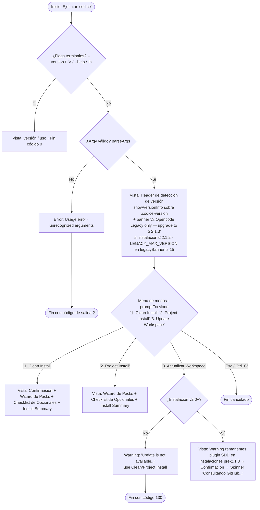
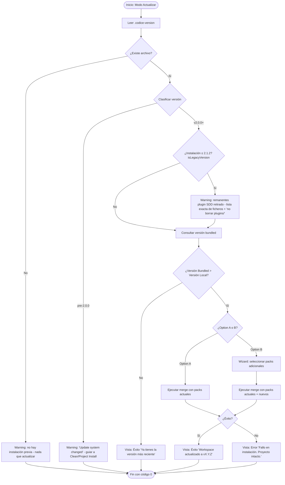
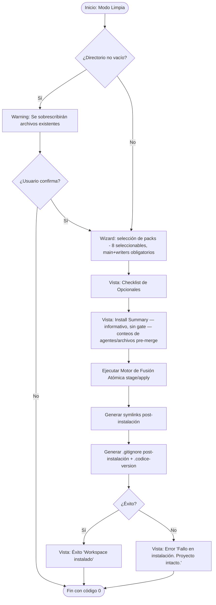
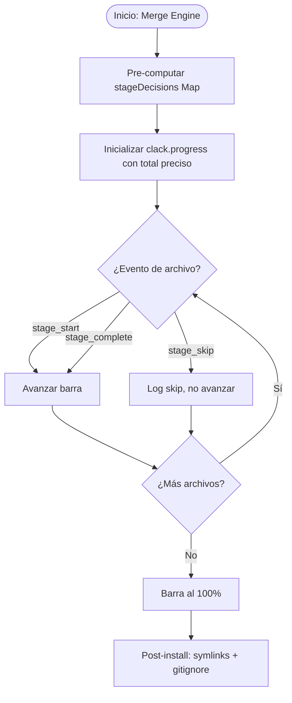
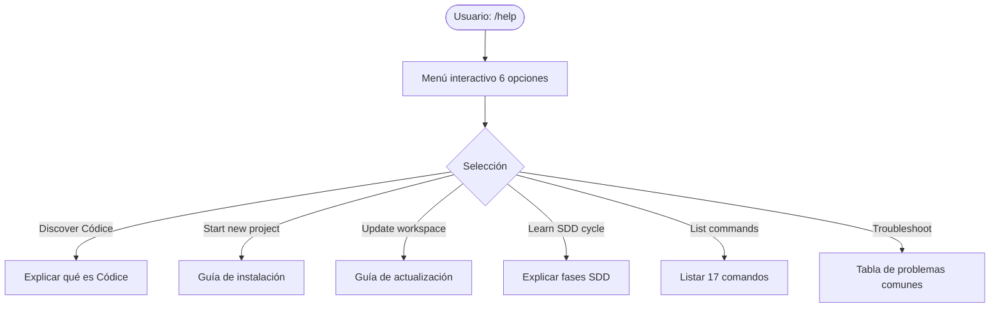
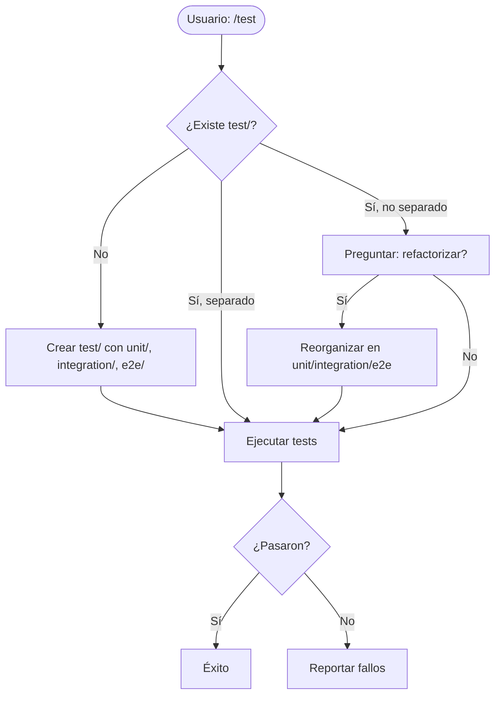
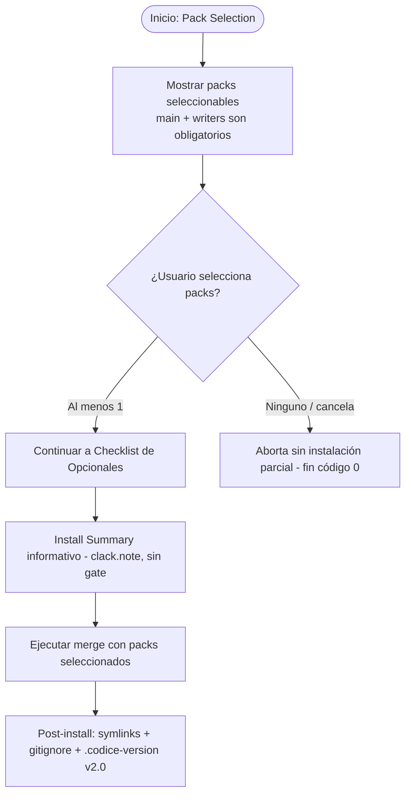
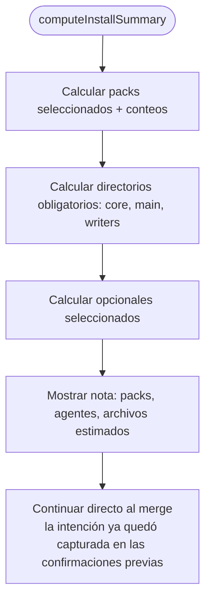
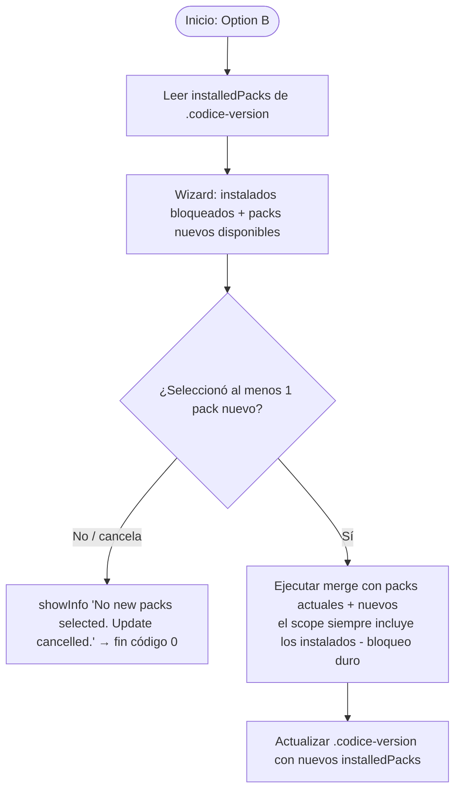

# Flujo de Navegación (TUI) – Códice: Opencode Workspace Installer v2.1.3
**Fecha:** 2026-07-11 | **Última actualización:** 2026-09-22 (v2.1.3) | **Autor:** Fisherk2 | **Estado:** Aprobado

## 1. Actores y Roles
| Rol | Permisos | Vistas TUI Iniciales |
|-----|----------|----------------------|
| **Usuario Final** | Lectura/Escritura en directorio de trabajo actual | Menú Principal de Instalación |
| **Mantenedor (CI)** | Ejecución no interactiva (headless) | (Omite TUI, usa flags `--clean`/`--project`/`--update` + `--force`) |

## 2. Diagramas de Flujo por Caso de Uso

### Flujo 1: Menú Principal y Selección de Modo (v2.1.3)

```mermaid
graph TD
    A([Inicio: Ejecutar 'codice']) --> B{¿Flags terminales? --version / -V / --help / -h}
    B -- Sí --> B1[Vista: versión / uso · Fin código 0]
    B -- No --> B2{¿Argv válido? parseArgs}
    B2 -- No --> C[Error: Usage error · unrecognized arguments]
    C --> Z([Fin con código de salida 2])
    B2 -- Sí --> D[Vista: Header de detección de versión<br/>showVersionInfo sobre .codice-version<br/>+ banner '⚠ Opencode Legacy only — upgrade to ≥ 2.1.3'<br/>si instalación ≤ 2.1.2 · LEGACY_MAX_VERSION en legacyBanner.ts:15]
    D --> E{Menú de modos · promptForMode<br/>'1. Clean Install' '2. Project Install' '3. Update Workspace'}
    E -- '1. Clean Install' --> F[Vista: Confirmación + Wizard de Packs + Checklist de Opcionales + Install Summary]
    E -- '2. Project Install' --> G[Vista: Wizard de Packs + Checklist de Opcionales + Install Summary]
    E -- '3. Actualizar Workspace' --> H{¿Instalación v2.0+?}
    H -- No --> H1[Warning: 'Update is not available...'<br/>use Clean/Project Install] --> Z2([Fin con código 130])
    H -- Sí --> I[Vista: Warning remanentes plugin SDD en instalaciones pre-2.1.3 → Confirmación → Spinner 'Consultando GitHub...']
    E -- 'Esc / Ctrl+C' --> Z3([Fin cancelado])
```

> **v2.0.0 → v2.1.3:** En Clean/Project Install, después de la selección de modo, el flujo real del `InstallUseCaseBase` es: confirmación (solo Clean) → **wizard de selección de packs** (8 seleccionables + 2 obligatorios: main, writers) → **checklist de opcionales** → **Install Summary** (recuento de agentes/archivos pre-merge) → stage/apply atómico. Ver Flujos 12 y 13. El banner legacy se emite **antes** del menú desde `versionInfoMessages` (fuente única — el flujo de update no lo repite; solo notifica remanentes del plugin SDD retirado).

### Flujo 2: Actualización de Workspace (Con verificación de versión)

```mermaid
graph TD
    A([Inicio: Modo Actualizar]) --> B[Leer .codice-version]
    B --> C{¿Existe archivo?}
    C -- No --> D[Warning: no hay instalación previa - nada que actualizar]
    D --> Z([Fin con código 0])
    C -- Sí --> C2{Clasificar versión}
    C2 -- pre-2.0.0 --> C4[Warning: 'Update system changed' - guiar a Clean/Project Install]
    C4 --> Z
    C2 -- v2.0.0+ --> L{¿Instalación ≤ 2.1.2? isLegacyVersion}
    L -- Sí --> LW[Warning: remanentes plugin SDD retirado - lista exacta de ficheros + 'no borrar plugins/']
    L -- No --> E
    LW --> E[Consultar versión bundled]
    E --> H{¿Versión Bundled > Versión Local?}
    H -- No --> I[Vista: Éxito 'Ya tienes la versión más reciente']
    I --> Z
    H -- Sí --> J2{¿Option A o B?}
    J2 -- Option A --> JA[Ejecutar merge con packs actuales]
    J2 -- Option B --> JB[Wizard: seleccionar packs adicionales]
    JB --> JC[Ejecutar merge con packs actuales + nuevos]
    JA --> M{¿Éxito?}
    JC --> M
    M -- Sí --> N[Vista: Éxito 'Workspace actualizado a vX.Y.Z']
    M -- No --> O[Vista: Error 'Fallo en instalación. Proyecto intacto.']
    N --> Z
    O --> Z
```

### Flujo 2b: Instalación Limpia (wizard de packs + menú de opcionales)

```mermaid
graph TD
    A([Inicio: Modo Limpia]) --> B{¿Directorio no vacío?}
    B -- Sí --> C[Warning: Se sobrescribirán archivos existentes]
    C --> D{¿Usuario confirma?}
    D -- No --> Z([Fin con código 0])
    D -- Sí --> W[Wizard: selección de packs - 8 seleccionables, main+writers obligatorios]
    B -- No --> W
    W --> E[Vista: Checklist de Opcionales]
    E --> S[Vista: Install Summary — informativo, sin gate — conteos de agentes/archivos pre-merge]
    S --> G[Ejecutar Motor de Fusión Atómica stage/apply]
    G --> H[Generar symlinks post-instalación]
    H --> I[Generar .gitignore post-instalación + .codice-version]
    I --> J{¿Éxito?}
    J -- Sí --> K[Vista: Éxito 'Workspace instalado']
    J -- No --> L[Vista: Error 'Fallo en instalación. Proyecto intacto.']
    K --> Z
    L --> Z
```

## 3. Matriz de Navegación TUI
| Origen (Vista TUI) | Destino (Vista TUI) | Trigger (Tecla/Acción) | Condición | Estado Global Requerido | Rollback/Cancelación |
|--------------------|---------------------|------------------------|-----------|--------------------------|----------------------|
| Header de detección | Menú de Modos | auto | Detección mostrada (banner legacy si ≤ 2.1.2) | `versionContext` | `Esc`/`Ctrl+C` sale con 130 |
| Menú Principal | Confirmación + Wizard Packs + Checklist | `Enter` en "Clean Install" | Directorio destino existe | `mode='clean'` | `Esc` regresa al Menú Principal |
| Wizard Packs + Checklist | Install Summary → Fusión | `Enter` en "Continuar" | Al menos 1 pack seleccionado | `mode='clean'`, `selectedPacks: string[]`, `selectedOptionals: string[]` | `Esc` o `Ctrl+C` aborta sin cambios |
| Menú Principal | Wizard Packs + Checklist | `Enter` en "Project Install" | Directorio destino existe | `mode='project'` | `Esc` regresa al Menú Principal |
| Menú Principal | Consulta Remota | `Enter` en "Update Workspace" | Existe `.codice-version` con v2.0+ | `localVersion: string` | `Esc` o `Ctrl+C` aborta la petición HTTP |

## 4. Flujos Alternativos y Errores
- **Auth/Permiso Fallido (EACCES):** Si el CLI no puede escribir en el directorio de staging o destino, la TUI debe mostrar un error rojo claro: *"Error: Permiso denegado. Intente ejecutar con privilegios elevados o verifique los permisos de la carpeta."* y abortar limpiamente (código de salida 1).
- **Red Inestable (Timeout en GitHub API):** Si la petición a GitHub tarda > 3 segundos, el spinner se detiene y muestra: *"Advertencia: No se pudo conectar a GitHub. Se procederá con la versión empaquetada."* y continúa como una instalación normal.
- **Interrupción del Usuario (SIGINT / Ctrl+C):** El CLI debe capturar la señal `SIGINT`, mostrar un mensaje de *"Cancelado por el usuario"*, eliminar el directorio `.codice-staging/` si existe, y salir con código 130. **Nunca** dejar el directorio de staging a medias.
- **Datos Inválidos:** Si el archivo `.codice-version` está corrupto, la TUI debe tratar el proyecto como "no versionado" y sugerir una "Instalación a Proyecto" en lugar de "Actualizar".

## 5. Gestión de Estado de Navegación
- **Estado Local vs. Global:** El estado de la TUI (opciones seleccionadas en el checklist) se mantiene en memoria durante la ejecución del proceso de Node/Bun. No se persiste en disco hasta que la operación atómica es exitosa.
- **Persistencia:** La única persistencia es la escritura final del archivo `.codice-version` y los archivos del template en el directorio destino, realizados en una única operación de movimiento atómico (`fs.rename`).
- **Rutas Protegidas:** Antes del menú el CLI solo valida la forma del destino `--dest` en tiempo de parseo (`validateDestPath.ts` — early-fail guard contra traversal y directorios de sistema; la contención real la aplica `pathResolver.ts` al escribir). La **escritibilidad** del destino no se comprueba antes del menú: `checkWritable` corre dentro del use case del modo seleccionado (`InstallUseCaseBase.ts:67`, `UpdateWorkspaceUseCase.ts:62`), es decir, post-selección de modo y antes de cualquier prompt destructivo.

## 6. Trazabilidad
| Flow-ID | PRD REQ-ID | Vista TUI | Componente Técnico (TRD) |
|---------|------------|-----------|--------------------------|
| F-01 | HU-01, RF-01 | Menú Principal | `ClackPromptsAdapter.select()` |
| F-02 | HU-02, RF-02 | Checklist Opcionales | `ClackPromptsAdapter.multiselect()` |
| F-03 | HU-03, RF-05 | Consulta Remota | `GitHubRestClient.getLatestRelease()` |
| F-04 | HU-05, RF-03 | Ejecución Atómica | `AtomicFileWriter.execute()` |
| F-05 | RF-05 (Seguridad) | Manejo de SIGINT | `process.on('SIGINT', cleanupHandler)` |
| F-06 | HU-01, RF-01 | Checklist Opcionales (Clean) | `ClackPromptsAdapter.multiselect()` |
| F-07 | RF-03 | Generación Symlinks Post-Install | `BunSymlinkCreator.createSymlinks()` |
| F-08 | RF-03 | Generación Gitignore Post-Install | `BunGitignoreCreator.createGitignore()` |

## 7. Flujos No-Interactivos

### Flujo con `--force`
Cuando se pasa `--force`, el CLI omite todos los prompts de confirmación:
- Clean Install: no pide confirmación de sobrescritura, auto-selecciona todos los packs y todos los opcionales
- Project Install: no muestra wizard ni menú de opcionales — usa SOLO el pack por defecto y ningún opcional (no hay opt-in con force)
- Update Workspace: no pide confirmación de actualización (equivale a Option A: solo packs instalados)

### Flujo con `--dest <path>`
Cuando se pasa `--dest <path>`, el CLI usa el path especificado como directorio destino en vez de `cwd()`.
- Valida que el path exista y sea un directorio
- Valida que el path resuelva dentro del directorio base (prevención de path traversal)
- Útil para desarrollo seguro: `just dev` usa `--dest tests/fixtures/workspace/`

### Flujo con flags de modo (`--clean` | `--project` | `--update`)
El modo se selecciona con flags booleanos dedicados — no existe un flag genérico de modo (`src/cli/parse-args.ts`):
- `--clean`, `--project` u `--update` omiten el menú principal y ejecutan directamente ese modo.
- Sin flag de modo el CLI entra en modo interactivo (menú).
- Flags combinatorios: `--dest <path>` (directorio destino), `--packs <list>` / `--packs-all` (ámbito de packs sin wizard; `--packs-all` gana sobre `--packs`), `--update-add-packs <list>` (Option B no interactiva), `--force` (omite confirmaciones), `--verbose`.
- Cualquier flag no reconocido aborta con "Usage error" (código de salida 2).

### Notificación de remanentes del plugin SDD (update desde < 2.1.3)
En Update Workspace, si la instalación local es ≤ 2.1.2 (`isLegacyVersion`), el CLI muestra **antes** del prompt de confirmación una advertencia con la lista exacta de ficheros del plugin SDD retirado que sobreviven como no gestionados (`buildPluginRemnantMessage` en `src/application/use-cases/updateHelpers.ts`: `sdd-pipeline.ts`, `src/destructivePatterns.ts`, `src/normalizeBash.ts`, `README.md`, `tsconfig.json` bajo `.opencode/plugins/`) y la indicación de **no borrar** `plugins/` (puede contener plugins de terceros). Cubre Option A, Option B y modo no interactivo.

## 8. Flujos Adicionales (v1.2.0)

### Flujo 9: Progress Bar durante instalación

```mermaid
graph TD
    A([Inicio: Merge Engine]) --> B[Pre-computar stageDecisions Map]
    B --> C[Inicializar clack.progress con total preciso]
    C --> D{¿Evento de archivo?}
    D -- stage_start --> E[Avanzar barra]
    D -- stage_complete --> E
    D -- stage_skip --> F[Log skip, no avanzar]
    E --> G{¿Más archivos?}
    F --> G
    G -- Sí --> D
    G -- No --> H[Barra al 100%]
    H --> I[Post-install: symlinks + gitignore]
```

### Flujo 10: Comando `/help`

```mermaid
graph TD
    A([Usuario: /help]) --> B[Menú interactivo 6 opciones]
    B --> C{Selección}
    C -- Discover Códice --> D[Explicar qué es Códice]
    C -- Start new project --> E[Guía de instalación]
    C -- Update workspace --> F[Guía de actualización]
    C -- Learn SDD cycle --> G[Explicar fases SDD]
    C -- List commands --> H[Listar 17 comandos]
    C -- Troubleshoot --> I[Tabla de problemas comunes]
```

### Flujo 11: Comando `/test` (v1.2.0)

```mermaid
graph TD
    A([Usuario: /test]) --> B{¿Existe test/?}
    B -- No --> C[Crear test/ con unit/, integration/, e2e/]
    B -- Sí, separado --> D[Ejecutar tests]
    B -- Sí, no separado --> E[Preguntar: refactorizar?]
    E -- Sí --> F[Reorganizar en unit/integration/e2e]
    E -- No --> D
    C --> D
    F --> D
    D --> G{¿Pasaron?}
    G -- Sí --> H[Éxito]
    G -- No --> I[Reportar fallos]
```

### Flujo 12: Wizard de Selección de Packs (v2.0.0, orden verificado en `InstallUseCaseBase`)

```mermaid
graph TD
    A([Inicio: Pack Selection]) --> B[Mostrar packs seleccionables<br/>main + writers son obligatorios]
    B --> C{¿Usuario selecciona packs?}
    C -- Al menos 1 --> D[Continuar a Checklist de Opcionales]
    C -- Ninguno / cancela --> E[Aborta sin instalación parcial - fin código 0]
    D --> F[Install Summary informativo - clack.note, sin gate]
    F --> H[Ejecutar merge con packs seleccionados]
    H --> I[Post-install: symlinks + gitignore + .codice-version v2.0]
```

### Flujo 13: Install Summary Screen (v2.0.0 — informativo desde FEV-22)

```mermaid
graph TD
    A([computeInstallSummary]) --> B[Calcular packs seleccionados + conteos]
    B --> C[Calcular directorios obligatorios: core, main, writers]
    C --> D[Calcular opcionales seleccionados]
    D --> E[Mostrar nota: packs, agentes, archivos estimados]
    E --> G[Continuar directo al merge<br/>la intención ya quedó capturada en las confirmaciones previas]
```

### Flujo 14: Update Option B — Agregar Packs (v2.0.0, verificado en `updateFlow.ts`)

```mermaid
graph TD
    A([Inicio: Option B]) --> B[Leer installedPacks de .codice-version]
    B --> C[Wizard: instalados bloqueados + packs nuevos disponibles]
    C --> D{¿Seleccionó al menos 1 pack nuevo?}
    D -- No / cancela --> F[showInfo 'No new packs selected. Update cancelled.' → fin código 0]
    D -- Sí --> I[Ejecutar merge con packs actuales + nuevos<br/>el scope siempre incluye los instalados - bloqueo duro]
    I --> J[Actualizar .codice-version con nuevos installedPacks]
```
> No interactivo: `--update-add-packs <list>` salta el wizard; los IDs se deduplican contra `installedPacks` (agregar un pack ya instalado es no-op).

---