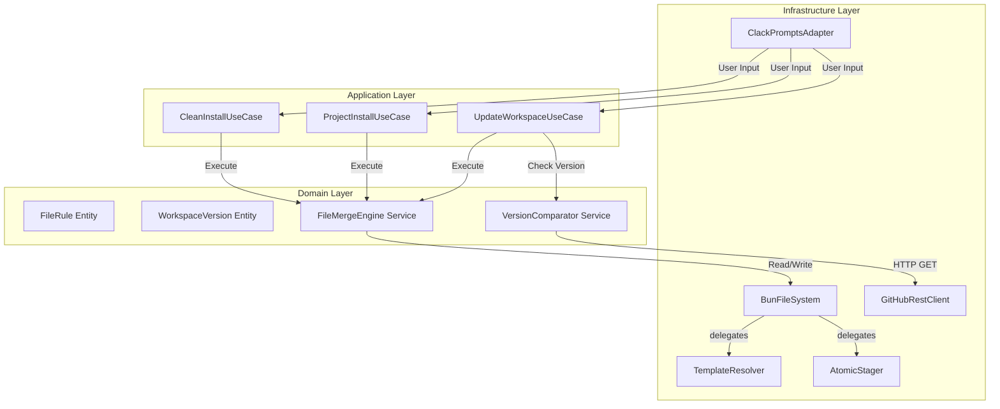

# Architecture – Códice: Opencode Workspace Installer

## Overview
Códice follows Clean Architecture with strict layer boundaries. Dependencies point inward: Infrastructure → Application → Domain.

## Architecture Decision Records (ADRs)

| ADR | Title | Status | Key Decision |
|-----|-------|--------|--------------|
| [ADR-001](../specs/adr/adr-001-clean-architecture.md) | Clean Architecture | Accepted | 4-layer structure with dependency rule |
| [ADR-002](../specs/adr/adr-002-bun-compilation.md) | Bun as Runtime/Compiler | Accepted | Single binary, zero runtime deps |
| [ADR-003](../specs/adr/adr-003-atomic-staging.md) | Atomic File Operations | Accepted | Staging + rename pattern |
| [ADR-004](../specs/adr/adr-004-clack-prompts.md) | TUI with @clack/prompts | Accepted | Lightweight interactive prompts |
| [ADR-005](../specs/adr/adr-005-dest-flag-and-workspace.md) | `--dest` Flag and Workspace Directory | Accepted | Safe dev playground via `--dest` + `tests/fixtures/workspace/` |
| [ADR-006](../specs/adr/adr-006-npm-publication.md) | npm Publication as Primary Distribution | Accepted | `bunx @fisherk2-dev/codice` as primary, binary as offline fallback |
| [ADR-007](../specs/adr/adr-007-template-resolver-source-mode.md) | Template Resolution for bunx/npm Mode | Accepted | Three-path detection cascade (compiled, bunx/npm, source) |

> **Note:** `TemplateResolver` and `AtomicStager` are extracted classes (not full ADRs). They are SRP-based refactorings of `BunFileSystem` that follow the existing ADR-003 (atomic staging) pattern.

### SPEC.md Resolved Decisions Coverage

All seven resolved decisions from [SPEC.md](../SPEC.md) are covered by the ADRs above or by their implementation:

| # | Decision | Covered By | Status |
|---|----------|------------|--------|
| 1 | Template Packaging Format (embed into binary) | ADR-002 (Bun compilation) | Documented |
| 2 | Optional File Grouping in TUI | ADR-004 (Clack prompts, IUserPrompt supports grouped multiselect) | Documented |
| 3 | GitHub Authentication (unauthenticated only) | ADR-002 (compiled binary, no runtime deps) | Documented |
| 4 | Windows Path Handling (normalize to `/`) | ADR-002 (cross-platform via Bun) | Documented |
| 5 | Local Version Storage (`.codice-version` file) | ADR-005 (dest flag affects version file location) | Documented |
| 6 | Rollback on Partial Failure | ADR-003 (atomic staging + backup/rollback) | Documented |
| 7 | Update Notification in Other Modes (exclusive to Update) | Implemented per SPEC.md; version check only runs in UpdateWorkspaceUseCase | Implemented |

## Layer Diagram

## Layer Responsibilities

### Domain Layer (`src/domain/`)
- Pure business logic, zero external dependencies
- Entities: FileRule, WorkspaceVersion
- Services: FileMergeEngine, VersionComparator
- Error handling via Result<T, Error>

### Application Layer (`src/application/`)
- Use cases orchestrate domain services
- Port interfaces: IFileSystem, IGitHubClient, IUserPrompt
- No business rules, only coordination

### Infrastructure Layer (`src/infrastructure/`)
- Concrete adapters for external systems
- BunFileSystem: Facade implementing IFileSystem, composes TemplateResolver + AtomicStager
- TemplateResolver: Template path resolution with category search and cache (extracted from BunFileSystem v1)
- AtomicStager: Atomic staging, commit, and rollback operations (extracted from BunFileSystem v1)
- GitHubRestClient: Version checking via GitHub API
- ClackPromptsAdapter: TUI interactions via @clack/prompts

### CLI Layer (`src/cli/`)
- Entry point: main.ts
- Dependency wiring
- Signal handling (SIGINT)
- Argument parsing

## Key Patterns
- **Strategy Pattern**: File merge rules (Obligatorio/Estándar/Opcional)
- **Dependency Inversion**: Domain depends on ports, not implementations
- **Result/Either**: Explicit error handling without exceptions
- **Command Pattern**: Each installation mode as independent command

## References
- [AGENTS.md](../AGENTS.md) — Full architectural guidelines
- [SPEC.md](../SPEC.md) — Central specification
- [WORKFLOW.md](./WORKFLOW.md) — Implementation phases
- [TECH_DEBT.md](./TECH_DEBT.md) — Known technical debt and improvement priorities
