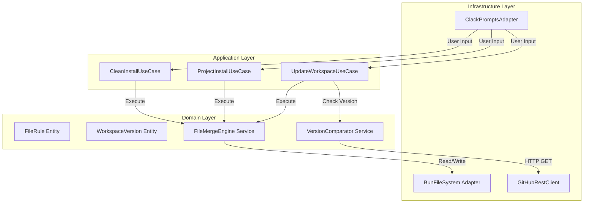

# Architecture – Códice: Opencode Workspace Installer

## Overview
Códice follows Clean Architecture with strict layer boundaries. Dependencies point inward: Infrastructure → Application → Domain.

## Architecture Decision Records (ADRs)

| ADR | Title | Status | Key Decision |
|-----|-------|--------|--------------|
| [ADR-001](../specs/adr/adr-001-clean-architecture.md) | Clean Architecture | Accepted | 4-layer structure with dependency rule |
| [ADR-002](../specs/adr/adr-002-bun-compilation.md) | Bun as Runtime/Compiler | Accepted | Single binary, zero runtime deps |
| [ADR-003](../specs/adr/adr-003-atomic-staging.md) | Atomic File Operations | Accepted | Staging + rename pattern |
| [ADR-004](../specs/adr/adr-004-clack-prompts.md) | TUI with @clack/prompts | Accepted | Lightweight interactive prompts |

## Layer Diagram

## Layer Responsibilities

### Domain Layer (`src/domain/`)
- Pure business logic, zero external dependencies
- Entities: FileRule, WorkspaceVersion
- Services: FileMergeEngine, VersionComparator
- Error handling via Result<T, Error>

### Application Layer (`src/application/`)
- Use cases orchestrate domain services
- Port interfaces: IFileSystem, IGitHubClient, IUserPrompt
- No business rules, only coordination

### Infrastructure Layer (`src/infrastructure/`)
- Concrete adapters for external systems
- BunFileSystem: Atomic file operations
- GitHubRestClient: Version checking
- ClackPromptsAdapter: TUI interactions

### CLI Layer (`src/cli/`)
- Entry point: main.ts
- Dependency wiring
- Signal handling (SIGINT)
- Argument parsing

## Key Patterns
- **Strategy Pattern**: File merge rules (Obligatorio/Estándar/Opcional)
- **Dependency Inversion**: Domain depends on ports, not implementations
- **Result/Either**: Explicit error handling without exceptions
- **Command Pattern**: Each installation mode as independent command

## References
- [AGENTS.md](../AGENTS.md) — Full architectural guidelines
- [SPEC.md](../SPEC.md) — Central specification
- [WORKFLOW.md](./WORKFLOW.md) — Implementation phases
