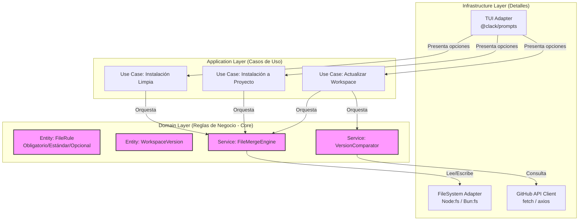

# Technical Requirements Document – Códice: Opencode Workspace Installer v1.0.0 (MVP)
**Fecha:** 2026-06-13 | **Autor:** Fisherk2 | **Estado:** Aprobado

## 1. Arquitectura de Referencia
Se aplicará **Clean Architecture** adaptada a una aplicación de línea de comandos (CLI). Esto garantiza que la lógica de negocio (reglas de fusión, comparación de versiones) esté completamente desacoplada de los detalles de implementación (sistema de archivos, red, librería de TUI).

- **Dominio/Entidades**: Define las reglas puras (ej: `FileMergeRule`, `SemanticVersion`). No tiene dependencias externas.
- **Casos de Uso/Aplicación**: Orquestan el flujo (ej: `UpdateWorkspaceUseCase`). Dependen del dominio, pero no de la infraestructura directa (usan interfaces).
- **Interfaces/Adaptadores**: Contratos (interfaces) para `IFileSystem`, `IGitHubClient`, `IUserPrompt`.
- **Infraestructura**: Implementaciones concretas (`BunFileSystem`, `ClackPromptsAdapter`, `GitHubRestClient`).

## 2. Stack Tecnológico & Justificación
| Capa | Tecnología | Versión | Justificación Arquitectónica |
|------|------------|---------|------------------------------|
| **Runtime/Build** | Bun | >= 1.1.x | Compilación a binario nativo (`bun build --compile`), velocidad de ejecución superior y API moderna de sistema de archivos. |
| **TUI / UX** | `@clack/prompts` | Latest | Ligera, moderna, zero-dependency tree profundo, ideal para binarios compilados. |
| **Validación** | `zod` | Latest | Esquemas de validación de datos en tiempo de ejecución (ej: validar respuesta de GitHub API). Principio de *Fail-Fast*. |
| **Versionado** | `semver` | Latest | Comparación robusta de versiones semánticas (v1.0.0 vs v1.1.0). |
| **Orquestación** | `just` | Latest | Task runner moderno, sintaxis más limpia que Make, escrito en Rust, ideal para definir flujos de desarrollo y CI/CD. |

## 3. Componentes del Sistema
| Componente | Responsabilidad | Interfaces Expuestas | Dependencias | Principio SOLID Aplicado |
|------------|-----------------|----------------------|--------------|--------------------------|
| `CLI Entrypoint` | Parsear argumentos e iniciar el flujo TUI. | `main()` | `@clack/prompts`, Use Cases | **SRP**: Solo maneja la capa de presentación CLI. |
| `FileMergeEngine` | Ejecutar la lógica de copiado atómico y fusión granular. | `executeMerge(source, dest, rules)` | `IFileSystem` | **OCP**: Abierto a nuevas reglas de fusión, cerrado a modificación. |
| `VersionManager` | Leer versión local y consultar remota. | `getLocalVersion()`, `checkRemoteUpdate()` | `IFileSystem`, `IGitHubClient` | **DIP**: Depende de abstracciones de red/FS, no de implementaciones. |
| `AtomicFileWriter` | Gestionar el patrón Staging + Rename. | `writeAtomically(data, path)` | `IFileSystem` | **SRP**: Responsable exclusivo de la integridad transaccional de archivos. |

## 4. Contratos de API / Integraciones
| Endpoint | Método | Request | Response | Autenticación | Rate Limit |
|----------|--------|---------|----------|---------------|------------|
| `GET /repos/{owner}/{repo}/releases/latest` | GET | Headers: `User-Agent: OpenCode-CLI` | JSON: `{ "tag_name": "v1.0.0", "name": "..." }` | No requerida | 60 req/hora (anon) |

## 5. Requisitos Técnicos No Funcionales
- **Escalabilidad**: El binario debe ser autocontenido. No escala horizontalmente (es una herramienta de cliente), pero debe escalar en tamaño de template sin degradar el rendimiento de memoria (streaming de archivos si el template crece >50MB).
- **Latencia/Throughput**: La operación de fusión local debe procesar >100 archivos/segundo. La consulta a GitHub debe tener un timeout de 3 segundos.
- **Seguridad**: 
  - Validación estricta de rutas (prevenir *Path Traversal* usando `path.resolve` y verificando que el destino esté dentro del directorio de trabajo permitido).
  - No ejecutar scripts descargados o del template sin consentimiento explícito.
- **Observabilidad**: Logs de error estructurados (JSON) en modo `--verbose`, salidas limpias en modo normal.

## 6. Estrategia de Despliegue & CI/CD
- **Entornos**: Local (desarrollo), CI (GitHub Actions), Release (GitHub Releases).
- **Pipeline (GitHub Actions)**:
  1. `checkout`
  2. `setup-bun`
  3. `just install` (dependencias)
  4. `just test` (unitarias + E2E)
  5. `just build` (compilación multiplataforma: linux-x64, macos-x64, windows-x64)
  6. `just release` (si el commit es un tag, sube los binarios a GitHub Releases).
- **Rollback**: Al ser un cliente, el "rollback" es que el usuario descargue la release anterior del binario. La atomicidad local protege contra rollbacks de instalación fallida.

## 7. Matriz de Trazabilidad
| PRD REQ-ID | TRD Componente | API/DB | Estado |
|------------|----------------|--------|--------|
| RF-01 (Menú TUI) | `CLI Entrypoint`, `@clack/prompts` | N/A | Especificado |
| RF-02 (Motor de Fusión) | `FileMergeEngine`, `AtomicFileWriter` | `fs` | Especificado |
| RF-03 (Atomicidad) | `AtomicFileWriter` | `fs` | Especificado |
| RF-04 (Versión Local) | `VersionManager` | `.codice-version` | Especificado |
| RF-05 (Versión Remota)| `VersionManager`, `IGitHubClient` | GitHub REST API | Especificado |

## 8. ADRs (Architecture Decision Records)
| ADR-ID | Contexto | Decisión | Consecuencias | Alternativas Descartadas |
|--------|----------|----------|---------------|--------------------------|
| **ADR-001** | Distribución del template | Empaquetar el template dentro del binario de Bun. | Binario más grande (~10-15MB), pero instalación offline instantánea y sin dependencias de red para el caso base. | Descarga dinámica desde GitHub (añade fragilidad de red). |
| **ADR-002** | Integridad de archivos | Patrón de Directorio Temporal + Intercambio Atómico (`fs.rename`). | Garantiza que el proyecto del usuario nunca quede corrupto por una interrupción. Requiere espacio en disco temporal. | Journal de reversión (demasiado complejo y propenso a fallos parciales). |
| **ADR-003** | Control de flujo de tareas | Uso de `Justfile` en lugar de `Makefile` o scripts npm. | Sintaxis más moderna, mejor manejo de variables de entorno y dependencias entre tareas. | `Makefile` (sintaxis obsoleta, problemas con tabs), `npm scripts` (demasiado anidado). |

---