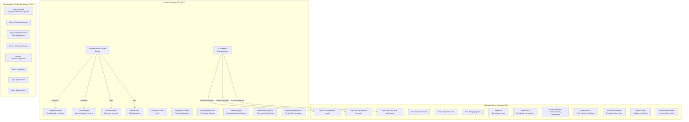

# Technical Requirements Document – Códice: Opencode Workspace Installer v2.1.0
**Fecha:** 2026-06-13 | **Última actualización:** 2026-08-19 | **Autor:** Fisherk2 | **Estado:** Aprobado

## 1. Arquitectura de Referencia
Se aplicará **Clean Architecture** adaptada a una aplicación de línea de comandos (CLI). Esto garantiza que la lógica de negocio (reglas de fusión, comparación de versiones) esté completamente desacoplada de los detalles de implementación (sistema de archivos, red, librería de TUI).

```mermaid
graph TD
    subgraph "Infrastructure Layer (Detalles)"
        FS[BunFileSystem Facade<br/>Bun:fs]
        TR[TemplateResolver<br/>Template path resolution]
        AS[AtomicStager<br/>Atomic staging + rename]
        DW[directoryWalker<br/>Recursive traversal]
        PR[pathResolver<br/>Path validation]
        GH[GitHub API Client<br/>fetch]
        TUI[TUI Adapter<br/>@clack/prompts]
        BSC[BunSymlinkCreator<br/>Post-install symlinks]
        BGC[BunGitignoreCreator<br/>Post-install gitignore]
        VL[VerboseLogger<br/>Structured verbose logging]
        PPO[packPromptOptions.ts<br/>Pack prompt definitions]
        VIM[versionInfoMessages.ts<br/>Version info messages]
        
        FS -->|delegates| TR
        FS -->|delegates| AS
        FS -->|uses| DW
        FS -->|uses| PR
    end

    subgraph "Application Layer (Casos de Uso)"
        UC1[Use Case: Instalación Limpia]
        UC2[Use Case: Instalación a Proyecto]
        UC3[Use Case: Actualizar Workspace]
        ISP[Port: ISymlinkCreator]
        IGC[Port: IGitignoreCreator]
        IST[Port: IStagingSystem]
        HLP[helpers.ts<br/>Shared guard logic]
        PI[postInstall.ts<br/>Post-install orchestration]
        ISUM[installSummary.ts<br/>Install summary computation]
        PO[packOptions.ts<br/>Pack selection definitions]
        IUCB[InstallUseCaseBase<br/>Template Method base]
        UF[updateFlow.ts<br/>Update merge logic]
        USC[updateStatusCheck.ts<br/>Version status check]
    end

    subgraph "Domain Layer (Reglas de Negocio - Core)"
        ENT1[Entity: FileRule<br/>Obligatorio/Estándar/Opcional]
        ENT2[Entity: WorkspaceVersion]
        ENT3[Entity: FileRuleManifest<br/>Rule aggregation]
        SRV1[Service: FileMergeEngine]
        SRV2[Service: VersionComparator]
        ERR1[Type: MergeError]
        ERR2[Type: SymlinkError]
        ERR3[Type: GitignoreError]
    end

    TUI -->|Presenta opciones| UC1
    TUI -->|Presenta opciones| UC2
    TUI -->|Presenta opciones| UC3
```

- **Dominio/Entidades**: Define las reglas puras (ej: `FileMergeRule`, `SemanticVersion`). No tiene dependencias externas.
- **Casos de Uso/Aplicación**: Orquestan el flujo (ej: `UpdateWorkspaceUseCase`). Dependen del dominio, pero no de la infraestructura directa (usan interfaces).
- **Interfaces/Adaptadores**: Contratos (interfaces) para `IFileSystem`, `IGitHubClient`, `IUserPrompt`.
- **Infraestructura**: Implementaciones concretas (`BunFileSystem`, `ClackPromptsAdapter`, `GitHubRestClient`).

## 2. Stack Tecnológico & Justificación
| Capa | Tecnología | Versión | Justificación Arquitectónica |
|------|------------|---------|------------------------------|
| **Runtime/Build** | Bun | >= 1.1.x | Velocidad de ejecución superior y API moderna de sistema de archivos. Distribución vía npm/bunx (compilación a binario removida en v1.2.0 — ADR-011). |
| **TUI / UX** | `@clack/prompts` | Latest | Ligera, moderna, zero-dependency tree profundo, ideal para herramientas CLI. |
| **Validación** | TypeScript strict + semver | Built-in / Latest | Validación de tipos en compilación + validación de versiones semánticas. Principio de *Fail-Fast*. |
| **Versionado** | `semver` | Latest | Comparación robusta de versiones semánticas (v1.0.0 vs v1.1.0). |
| **Orquestación** | `just` | Latest | Task runner moderno, sintaxis más limpia que Make, escrito en Rust, ideal para definir flujos de desarrollo y CI/CD. |

## 3. Componentes del Sistema
| Componente | Responsabilidad | Interfaces Expuestas | Dependencias | Principio SOLID Aplicado |
|------------|-----------------|----------------------|--------------|--------------------------|
| `CLI Entrypoint` | Parsear argumentos e iniciar el flujo TUI. | `main()` | `@clack/prompts`, Use Cases | **SRP**: Solo maneja la capa de presentación CLI. |
| `FileMergeEngine` | Ejecutar la lógica de copiado atómico y fusión granular. | `executeMerge(source, dest, rules)` | `IFileSystem` | **OCP**: Abierto a nuevas reglas de fusión, cerrado a modificación. |
| `VersionComparator` | Comparar versiones semánticas local vs remota. | `compareVersions(local, remote)` | `IVersionComparator` | **DIP**: Depende de abstracciones, no de implementaciones. |
| `AtomicStager` | Gestionar el patrón Staging + Rename. | `stageFile()`, `commit()`, `rollback()` | `IStagingSystem` | **SRP**: Responsable exclusivo de la integridad transaccional de archivos. |

### 3.1 Generadores Post-Instalación

npm excluye archivos `.gitignore` del paquete y resuelve symlinks durante el empaquetado. Para garantizar que estos archivos existan correctamente tras la instalación, se generan post-instalación mediante ports dedicados:

| Port | Adapter | Responsabilidad | Integrado en |
|------|---------|-----------------|--------------|
| `ISymlinkCreator` | `BunSymlinkCreator` | Crear symlinks para `.opencode/` (agents, commands, skills) | `CleanInstallUseCase`, `ProjectInstallUseCase` |
| `IGitignoreCreator` | `BunGitignoreCreator` | Generar `.gitignore` desde `template/estandar/gitignore` (renombrado para evitar exclusión de npm) | `CleanInstallUseCase`, `ProjectInstallUseCase` |

**Restricciones:**
- NO se ejecutan en `UpdateWorkspaceUseCase` (preservan personalizaciones del usuario).
- Son idempotentes: no sobrescriben si el archivo/symlink ya existe.
- Validan path containment para prevenir symlink escape fuera del directorio destino.

**Referencias:** ADR-008 (symlinks), ADR-009 (gitignore), ADR-010 (noTemplateCopy flag).

### 3.2 Componentes v2.0.0 (Pack System & Installer UX)

| Componente | Responsabilidad | Interfaces Expuestas | Dependencias | Principio SOLID Aplicado |
|------------|-----------------|----------------------|--------------|--------------------------|
| `InstallUseCaseBase` | Template Method base para CleanInstall y ProjectInstall. Define el esqueleto del algoritmo de instalación. | `execute()` | `IFileSystem`, `IUserPrompt` | **Template Method**: Subclasses override specific steps. |
| `installSummary.ts` | Computar resumen pre-instalación: packs seleccionados, conteos de agentes, archivos estimados. | `computeInstallSummary()` | `packOptions`, manifest data | **SRP**: Solo computa el resumen, no lo renderiza. |
| `updateStatusCheck.ts` | Verificar versión local vs bundled, clasificar estado de instalación (pre-1.2.0, v1.x, v2.0+). | `checkUpdateStatus()` | `WorkspaceVersion`, `.codice-version` | **SRP**: Solo verifica estado, no ejecuta merge. |
| `updateFlow.ts` | Lógica de merge para update mode: Option A (packs actuales) y Option B (agregar packs). | `executeUpdateFlow()` | `IFileSystem`, `FileMergeEngine` | **SRP**: Solo ejecuta el flujo de update. |
| `VerboseLogger` | Adapter para logging estructurado en modo verbose. | `log()`, `logProgress()` | `output.ts` | **SRP**: Solo maneja logging verbose. |

### 3.3 Componentes v2.1.0 (Slash Commands, Intent Auto-Discovery, Agent Delegation)

| Componente | Responsabilidad | Interfaces Expuestas | Dependencias | Principio SOLID Aplicado |
|------------|-----------------|----------------------|--------------|--------------------------|
| `/sync` Slash Command | Sincronización bidireccional de git con 4 modos (full-sync, incremental-sync, dry-run, conflict-resolution) y 4 estrategias (NEWER_WINS, GITHUB_WINS, LOCAL_WINS, INTELLIGENT_MERGE). | CLI command + skill invocation | `git-workflow-and-versioning` skill, `IGitClient` port (planned) | **OCP**: Nuevas estrategias de resolución se agregan sin modificar el comando. |
| `/migrate` Slash Command | Detección de stack técnico desde lock files, evaluación de breaking changes, generación de plan de migración estructurado con fases y rollback. | CLI command + skill invocation | `dependency-audit`, `deprecation-and-migration` skills | **SRP**: Solo genera el plan, no ejecuta la migración. |
| `/deploy` Slash Command | Post-`/ship` automation. 3 modos: no-workflow (generar desde cero), betterable (analizar+optimizar), established (ejecutar workflow documentado). Genera branch protection, PR templates, CI pipelines. | CLI command + skill invocation | `ci-cd-and-automation`, `bash-defensive-patterns` skills | **SRP**: Solo genera configuración, no la ejecuta. |
| `/analyze` Slash Command | Análisis arquitectónico de 8 dimensiones (system structure, design patterns, dependency architecture, data flow, scalability, security, testability, documentation). Genera `docs/TECH_DEBT.md` con hallazgos priorizados. | CLI command + skill invocation | `clean-ddd-hexagonal`, `design-patterns`, `dependency-audit` skills | **SRP**: Solo analiza y reporta, no modifica código. |
| SDD Intent Auto-Discovery | Detección basada en filesystem de palabras clave de comandos. Reemplaza el mapa hardcodeado `INTENT_PATTERNS` con un escaneo dinámico de `template/obligatorio/core/commands/*.md`. | `discoverIntents()` | filesystem reads | **OCP**: Nuevos comandos se descubren automáticamente sin modificar el plugin. |
| Bilingual Intent Support | Las palabras clave de comandos funcionan en inglés y español mediante un mapa de traducción que se aplica tras el auto-discovery. | `translateIntent(keyword, locale)` | static map | **OCP**: Nuevos idiomas se agregan como mapas independientes. |
| Agent Delegation Protocol | Los seis agentes primarios siguen un protocolo de tres fases (Analyze → Plan → Execute) antes de invocar subagentes. Cada `task()` incluye instrucciones determinísticas, skills a cargar y checklist de aceptación. | `delegateToSubagent(task)` | `task()` from opencode | **DIP**: Protocolo independiente del subagente concreto invocado. |

## 4. Contratos de API / Integraciones
| Endpoint | Método | Request | Response | Autenticación | Rate Limit |
|----------|--------|---------|----------|---------------|------------|
| `GET /repos/{owner}/{repo}/releases/latest` | GET | Headers: `User-Agent: OpenCode-CLI` | JSON: `{ "tag_name": "v1.0.0", "name": "..." }` | No requerida | 60 req/hora (anon) |

## 5. Requisitos Técnicos No Funcionales
- **Escalabilidad**: El CLI debe ser autocontenido. No escala horizontalmente (es una herramienta de cliente), pero debe escalar en tamaño de template sin degradar el rendimiento de memoria (streaming de archivos si el template crece >50MB).
- **Latencia/Throughput**: La operación de fusión local debe procesar >100 archivos/segundo. La consulta a GitHub debe tener un timeout de 3 segundos.
- **Seguridad**: 
  - Validación estricta de rutas (prevenir *Path Traversal* usando `path.resolve` y verificando que el destino esté dentro del directorio de trabajo permitido).
  - No ejecutar scripts descargados o del template sin consentimiento explícito.
- **Observabilidad**: Logs de error estructurados (JSON) en modo `--verbose`, salidas limpias en modo normal.

## 6. Estrategia de Despliegue & CI/CD
- **Entornos**: Local (desarrollo), CI (GitHub Actions), Release (GitHub Releases).
- **Pipeline (GitHub Actions)** — **v2.1 Hardening**:
  1. `checkout` (SHA-pined)
  2. `setup-bun` (SHA-pined) + `setup-just` (SHA-pined)
  3. `bun install`
  4. **Matrix job `quality`** (Ubuntu, macOS, Windows): `just check` (lint+format+typecheck) → `just test` (unit+integration) → `just test-e2e` (Linux only) → `just coverage-check 95` (Linux only).
  5. **Job `qa-plugin`** (Ubuntu): `just test-plugin-unit` + `just check-plugin` + `just test-plugin-integration`.
  6. **Job `packaging`** (Ubuntu): `just test-packaging` para validar estructura del tarball npm.
  7. **Branch Protection** (rama `main` y `develop`): required status checks strict = true; contexts = `quality (ubuntu-latest)`, `quality (macos-latest)`, `quality (windows-latest)`; required approving reviews = 0 (single-contributor); dismiss stale reviews = true; enforce admins = false; allow force pushes = false; allow deletions = false; required conversation resolution = true. Aplicado vía `scripts/setup-branch-protection.sh` (idempotente, JSON body via `--input`).
  8. **Release workflow** (tag `v*`): reusable `quality` job (`uses: ./.github/workflows/ci.yml`) → validación de tag format (`^v[0-9]+\.[0-9]+\.[0-9]+(-[a-zA-Z0-9.]+)?$`) → extracción de CHANGELOG section → validación de version match con `package.json` → detección de tipo (prerelease vs release) → `npm publish --provenance` (requiere `repository.url` en package.json) → `softprops/action-gh-release` con `make_latest` y `prerelease` flags.
  9. **PR templates + Issue templates**: `bug_report.md`, `feature_request.md` en `.github/ISSUE_TEMPLATE/`; `PULL_REQUEST_TEMPLATE.md` en `.github/`.
  10. **Permissions**: CI `contents: read`; release `contents: write + id-token: write` (para npm provenance OIDC).
- **Rollback**: Al ser un cliente, el "rollback" es que el usuario use la release anterior con bunx/npx. La atomicidad local protege contra rollbacks de instalación fallida.
- **paths-ignore** (push only, nunca en PR): `docs/**`, `CHANGELOG.md` — los cambios de documentación no rompen el CI.
- **npm provenance**: SLSA v1 generado automáticamente por npm al publicar con `--provenance`. Verificable en https://www.npmjs.com/package/@fisherk2-dev/codice.

## 7. Matriz de Trazabilidad
| PRD REQ-ID | TRD Componente | API/DB | Estado |
|------------|----------------|--------|--------|
| RF-01 (Menú TUI) | `CLI Entrypoint`, `@clack/prompts` | N/A | Implementado |
| RF-02 (Motor de Fusión) | `FileMergeEngine`, `AtomicStager` | `fs` | Implementado |
| RF-03 (Atomicidad) | `AtomicStager` | `fs` | Implementado |
| RF-04 (Versión Local) | `VersionComparator` | `.codice-version` | Implementado |
| RF-05 (Versión Remota)| `VersionComparator`, `IGitHubClient` | GitHub REST API | Implementado |

## 8. ADRs (Architecture Decision Records)
| ADR-ID | Contexto | Decisión | Consecuencias | Alternativas Descartadas |
|--------|----------|----------|---------------|--------------------------|
| **ADR-001** | Estructura del proyecto | Clean Architecture con 4 capas (Domain, Application, Infrastructure, CLI) | Dependencias siempre hacia adentro. Domain sin dependencias externas. | Arquitectura plana por carpetas funcionales. |
| **ADR-002** | Runtime y compilación | Bun como runtime y entorno de desarrollo | Runtime único, startup time superior. Compilación a binario removida en v1.2.0 (ADR-011). | Node.js + pkg, Deno compile. |
| **ADR-003** | Integridad de archivos | Patrón Staging Directory + Rename Atómico (`fs.rename`) | Garantiza que el proyecto nunca quede corrupto por interrupción. Requiere espacio temporal en disco. | Journal de reversión (demasiado complejo). |
| **ADR-004** | Interfaz TUI | @clack/prompts para prompts interactivos | Zero-dependency tree, ideal para herramientas CLI, spinners y prompts modernos. | Inquirer.js (árbol de dependencias pesado), prompts (menos moderno). |
| **ADR-005** | Desarrollo seguro | Flag `--dest` + directorio `tests/fixtures/workspace/` | `just dev` escribe en playground seguro, no en la raíz del proyecto. | Modificar CWD manualmente (propenso a errores). |
| **ADR-006** | Distribución | Publicación npm como método primario (`bunx @fisherk2-dev/codice`) | Amplía accesibilidad más allá de usuarios Bun. Distribución única vía npm (ver ADR-011). | Solo binarios (requiere descarga manual), solo source (requiere Bun). |
| **ADR-007** | Resolución de template | Cascada de 2 rutas (bunx/npm, source + CWD fallback; ruta compilado eliminada en v1.2.0 — ADR-011) | Funciona en todos los modos de distribución sin configuración manual. | Ruta hardcoded (frágil), variable de entorno (incómodo para usuarios). |
| **ADR-008** | Symlinks post-install | `ISymlinkCreator` port + `BunSymlinkCreator` adapter | Symlinks se generan post-instalación, evitando el strippng de npm. Idempotente. | Empaquetar symlinks en template (npm los resuelve). |
| **ADR-009** | Gitignore post-install | `IGitignoreCreator` port + `BunGitignoreCreator` adapter | `.gitignore` se genera post-instalación, evitando la exclusión de npm. | Renombrar a `.gitignore.txt` (confuso), empaquetar como otro nombre. |
| **ADR-010** | Entries virtuales en manifest | Flag `noTemplateCopy` para entries cuyo contenido se genera post-instalación | Entries como `.devin/` aparecen en UX de selección pero skipan resolución de template. | Eliminar del manifest (pierde visibilidad en UX). |
| **ADR-011** | Binary Removal | npm/bunx como única distribución; compilación de binarios removida | Eliminación de 74MB binarios, simplificación CI/CD | Mantener binarios (mantenimiento alto, poco uso) |
| **ADR-012** | References Co-location | Referencias co-locadas con skills, expuestas vía sección reference | Skills autocontenidos, configuración opcional | Referencias centralizadas en template/obligatorio/references/ |
| **ADR-013** | SDD Plugin Auto-Discovery | Auto-descubrimiento filesystem + configuración JSON + quality infra | Plugin desacoplado de documentación, extensible | Maps hardcoded en sdd-pipeline.ts |
| **ADR-014** | Sistema de packs | Clasificación de agentes en packs: 8 seleccionables + 2 obligatorios (main, writers) | Instalación selectiva de agentes, wizard de selección, tarball 8MB | Todos los agentes siempre (sin selección) |
| **ADR-015** | Installer UX v2 | UX metadata-driven con selección de packs, resumen pre-instalación, y actualizaciones version-gated | Mejor UX para gestión de packs, bloqueo de update en v1.x | UX plana sin selección de packs |
| **ADR-016** | Slash Commands v2.1 | Adición de 4 comandos (`/sync`, `/migrate`, `/deploy`, `/analyze`) con flujos definidos y delegación a skills | Cubre sync bidireccional, migración, deploy y análisis arquitectónico sin código nuevo en el template | Comandos implementados como bash scripts (frágil), CLI extension points (demasiado complejo) |
| **ADR-017** | SDD Intent Auto-Discovery & Bilingual | Detección filesystem-based de palabras clave + mapa de traducción EN/ES reemplaza `INTENT_PATTERNS` hardcoded | Nuevos comandos se descubren automáticamente; soporte bilingüe sin duplicar lógica | Mapa hardcoded en código (acoplamiento, requiere recompilar para agregar comandos) |
| **ADR-018** | Agent Delegation Protocol | Protocolo Analyze → Plan → Execute para agentes primarios; `task()` con instrucciones determinísticas, skills a cargar y checklist de aceptación | Trazabilidad y calidad consistente en delegaciones; verificado por 2052 tests y 31 E2E scenarios | Free-form task() sin estructura (resultados inconsistentes entre agentes) |
| **ADR-019** | CI/CD Hardening | SHA-pins en actions, branch protection real, PR/issue templates, npm provenance OIDC, workflow_call reuse | Pipeline seguro y reproducible; ataques de supply chain mitigados por pinning | Tags movibles (vulnerable a tag hijacking), sin protection (cualquiera pushea a main) |
| **ADR-020** | SPEC Modularization | SPEC.md monolítico (441 líneas) dividido en 8 sub-specs + índice reducido (44 líneas) | Cumple CODE_STYLE.md (max 200 líneas); carga selectiva por agente via skills/progressive disclosure | Mantener SPEC.md monolítico (excede límite, carga todo en cada sesión) |

---