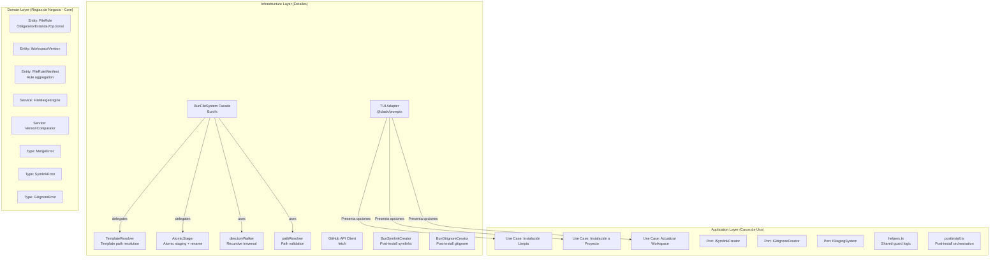

# Technical Requirements Document – Códice: Opencode Workspace Installer v1.1.3
**Fecha:** 2026-06-13 | **Última actualización:** 2026-07-27 | **Autor:** Fisherk2 | **Estado:** Aprobado

## 1. Arquitectura de Referencia
Se aplicará **Clean Architecture** adaptada a una aplicación de línea de comandos (CLI). Esto garantiza que la lógica de negocio (reglas de fusión, comparación de versiones) esté completamente desacoplada de los detalles de implementación (sistema de archivos, red, librería de TUI).

```mermaid
graph TD
    subgraph "Infrastructure Layer (Detalles)"
        FS[BunFileSystem Facade<br/>Bun:fs]
        TR[TemplateResolver<br/>Template path resolution]
        AS[AtomicStager<br/>Atomic staging + rename]
        DW[directoryWalker<br/>Recursive traversal]
        PR[pathResolver<br/>Path validation]
        GH[GitHub API Client<br/>fetch]
        TUI[TUI Adapter<br/>@clack/prompts]
        BSC[BunSymlinkCreator<br/>Post-install symlinks]
        BGC[BunGitignoreCreator<br/>Post-install gitignore]
        
        FS -->|delegates| TR
        FS -->|delegates| AS
        FS -->|uses| DW
        FS -->|uses| PR
    end

    subgraph "Application Layer (Casos de Uso)"
        UC1[Use Case: Instalación Limpia]
        UC2[Use Case: Instalación a Proyecto]
        UC3[Use Case: Actualizar Workspace]
        ISP[Port: ISymlinkCreator]
        IGC[Port: IGitignoreCreator]
        IST[Port: IStagingSystem]
        HLP[helpers.ts<br/>Shared guard logic]
        PI[postInstall.ts<br/>Post-install orchestration]
    end

    subgraph "Domain Layer (Reglas de Negocio - Core)"
        ENT1[Entity: FileRule<br/>Obligatorio/Estándar/Opcional]
        ENT2[Entity: WorkspaceVersion]
        ENT3[Entity: FileRuleManifest<br/>Rule aggregation]
        SRV1[Service: FileMergeEngine]
        SRV2[Service: VersionComparator]
        ERR1[Type: MergeError]
        ERR2[Type: SymlinkError]
        ERR3[Type: GitignoreError]
    end

    TUI -->|Presenta opciones| UC1
    TUI -->|Presenta opciones| UC2
    TUI -->|Presenta opciones| UC3
```

- **Dominio/Entidades**: Define las reglas puras (ej: `FileMergeRule`, `SemanticVersion`). No tiene dependencias externas.
- **Casos de Uso/Aplicación**: Orquestan el flujo (ej: `UpdateWorkspaceUseCase`). Dependen del dominio, pero no de la infraestructura directa (usan interfaces).
- **Interfaces/Adaptadores**: Contratos (interfaces) para `IFileSystem`, `IGitHubClient`, `IUserPrompt`.
- **Infraestructura**: Implementaciones concretas (`BunFileSystem`, `ClackPromptsAdapter`, `GitHubRestClient`).

## 2. Stack Tecnológico & Justificación
| Capa | Tecnología | Versión | Justificación Arquitectónica |
|------|------------|---------|------------------------------|
| **Runtime/Build** | Bun | >= 1.1.x | Velocidad de ejecución superior y API moderna de sistema de archivos. Distribución vía npm/bunx (compilación a binario removida en v1.2.0 — ADR-011). |
| **TUI / UX** | `@clack/prompts` | Latest | Ligera, moderna, zero-dependency tree profundo, ideal para herramientas CLI. |
| **Validación** | `zod` | Latest | Esquemas de validación de datos en tiempo de ejecución (ej: validar respuesta de GitHub API). Principio de *Fail-Fast*. |
| **Versionado** | `semver` | Latest | Comparación robusta de versiones semánticas (v1.0.0 vs v1.1.0). |
| **Orquestación** | `just` | Latest | Task runner moderno, sintaxis más limpia que Make, escrito en Rust, ideal para definir flujos de desarrollo y CI/CD. |

## 3. Componentes del Sistema
| Componente | Responsabilidad | Interfaces Expuestas | Dependencias | Principio SOLID Aplicado |
|------------|-----------------|----------------------|--------------|--------------------------|
| `CLI Entrypoint` | Parsear argumentos e iniciar el flujo TUI. | `main()` | `@clack/prompts`, Use Cases | **SRP**: Solo maneja la capa de presentación CLI. |
| `FileMergeEngine` | Ejecutar la lógica de copiado atómico y fusión granular. | `executeMerge(source, dest, rules)` | `IFileSystem` | **OCP**: Abierto a nuevas reglas de fusión, cerrado a modificación. |
| `VersionComparator` | Comparar versiones semánticas local vs remota. | `compareVersions(local, remote)` | `IVersionComparator` | **DIP**: Depende de abstracciones, no de implementaciones. |
| `AtomicStager` | Gestionar el patrón Staging + Rename. | `stageFile()`, `commit()`, `rollback()` | `IStagingSystem` | **SRP**: Responsable exclusivo de la integridad transaccional de archivos. |

### 3.1 Generadores Post-Instalación

npm excluye archivos `.gitignore` del paquete y resuelve symlinks durante el empaquetado. Para garantizar que estos archivos existan correctamente tras la instalación, se generan post-instalación mediante ports dedicados:

| Port | Adapter | Responsabilidad | Integrado en |
|------|---------|-----------------|--------------|
| `ISymlinkCreator` | `BunSymlinkCreator` | Crear 10 symlinks para `.opencode/` y `.devin/` (agents, commands, skills, workflows, rules) | `CleanInstallUseCase`, `ProjectInstallUseCase` |
| `IGitignoreCreator` | `BunGitignoreCreator` | Generar `.gitignore` desde `template/estandar/gitignore` (renombrado para evitar exclusión de npm) | `CleanInstallUseCase`, `ProjectInstallUseCase` |

**Restricciones:**
- NO se ejecutan en `UpdateWorkspaceUseCase` (preservan personalizaciones del usuario).
- Son idempotentes: no sobrescriben si el archivo/symlink ya existe.
- Validan path containment para prevenir symlink escape fuera del directorio destino.

**Referencias:** ADR-008 (symlinks), ADR-009 (gitignore), ADR-010 (noTemplateCopy flag).

## 4. Contratos de API / Integraciones
| Endpoint | Método | Request | Response | Autenticación | Rate Limit |
|----------|--------|---------|----------|---------------|------------|
| `GET /repos/{owner}/{repo}/releases/latest` | GET | Headers: `User-Agent: OpenCode-CLI` | JSON: `{ "tag_name": "v1.0.0", "name": "..." }` | No requerida | 60 req/hora (anon) |

## 5. Requisitos Técnicos No Funcionales
- **Escalabilidad**: El CLI debe ser autocontenido. No escala horizontalmente (es una herramienta de cliente), pero debe escalar en tamaño de template sin degradar el rendimiento de memoria (streaming de archivos si el template crece >50MB).
- **Latencia/Throughput**: La operación de fusión local debe procesar >100 archivos/segundo. La consulta a GitHub debe tener un timeout de 3 segundos.
- **Seguridad**: 
  - Validación estricta de rutas (prevenir *Path Traversal* usando `path.resolve` y verificando que el destino esté dentro del directorio de trabajo permitido).
  - No ejecutar scripts descargados o del template sin consentimiento explícito.
- **Observabilidad**: Logs de error estructurados (JSON) en modo `--verbose`, salidas limpias en modo normal.

## 6. Estrategia de Despliegue & CI/CD
- **Entornos**: Local (desarrollo), CI (GitHub Actions), Release (GitHub Releases).
- **Pipeline (GitHub Actions)**:
  1. `checkout`
  2. `setup-bun`
  3. `just install` (dependencias)
  4. `just test` (unitarias + E2E)
  5. `just release` (si el commit es un tag, publica en npm como @fisherk2-dev/codice).
- **Rollback**: Al ser un cliente, el "rollback" es que el usuario use la release anterior con bunx/npx. La atomicidad local protege contra rollbacks de instalación fallida.

## 7. Matriz de Trazabilidad
| PRD REQ-ID | TRD Componente | API/DB | Estado |
|------------|----------------|--------|--------|
| RF-01 (Menú TUI) | `CLI Entrypoint`, `@clack/prompts` | N/A | Implementado |
| RF-02 (Motor de Fusión) | `FileMergeEngine`, `AtomicStager` | `fs` | Implementado |
| RF-03 (Atomicidad) | `AtomicStager` | `fs` | Implementado |
| RF-04 (Versión Local) | `VersionComparator` | `.codice-version` | Implementado |
| RF-05 (Versión Remota)| `VersionComparator`, `IGitHubClient` | GitHub REST API | Implementado |

## 8. ADRs (Architecture Decision Records)
| ADR-ID | Contexto | Decisión | Consecuencias | Alternativas Descartadas |
|--------|----------|----------|---------------|--------------------------|
| **ADR-001** | Estructura del proyecto | Clean Architecture con 4 capas (Domain, Application, Infrastructure, CLI) | Dependencias siempre hacia adentro. Domain sin dependencias externas. | Arquitectura plana por carpetas funcionales. |
| **ADR-002** | Runtime y compilación | Bun como runtime y entorno de desarrollo | Runtime único, startup time superior. Compilación a binario removida en v1.2.0 (ADR-011). | Node.js + pkg, Deno compile. |
| **ADR-003** | Integridad de archivos | Patrón Staging Directory + Rename Atómico (`fs.rename`) | Garantiza que el proyecto nunca quede corrupto por interrupción. Requiere espacio temporal en disco. | Journal de reversión (demasiado complejo). |
| **ADR-004** | Interfaz TUI | @clack/prompts para prompts interactivos | Zero-dependency tree, ideal para herramientas CLI, spinners y prompts modernos. | Inquirer.js (árbol de dependencias pesado), prompts (menos moderno). |
| **ADR-005** | Desarrollo seguro | Flag `--dest` + directorio `tests/fixtures/workspace/` | `just dev` escribe en playground seguro, no en la raíz del proyecto. | Modificar CWD manualmente (propenso a errores). |
| **ADR-006** | Distribución | Publicación npm como método primario (`bunx @fisherk2-dev/codice`) | Amplía accesibilidad más allá de usuarios Bun. Distribución única vía npm (ver ADR-011). | Solo binarios (requiere descarga manual), solo source (requiere Bun). |
| **ADR-007** | Resolución de template | Cascada de 2 rutas (bunx/npm, source + CWD fallback; ruta compilado eliminada en v1.2.0 — ADR-011) | Funciona en todos los modos de distribución sin configuración manual. | Ruta hardcoded (frágil), variable de entorno (incómodo para usuarios). |
| **ADR-008** | Symlinks post-install | `ISymlinkCreator` port + `BunSymlinkCreator` adapter | Symlinks se generan post-instalación, evitando el strippng de npm. Idempotente. | Empaquetar symlinks en template (npm los resuelve). |
| **ADR-009** | Gitignore post-install | `IGitignoreCreator` port + `BunGitignoreCreator` adapter | `.gitignore` se genera post-instalación, evitando la exclusión de npm. | Renombrar a `.gitignore.txt` (confuso), empaquetar como otro nombre. |
| **ADR-010** | Entries virtuales en manifest | Flag `noTemplateCopy` para entries cuyo contenido se genera post-instalación | Entries como `.devin/` aparecen en UX de selección pero skipan resolución de template. | Eliminar del manifest (pierde visibilidad en UX). |

---