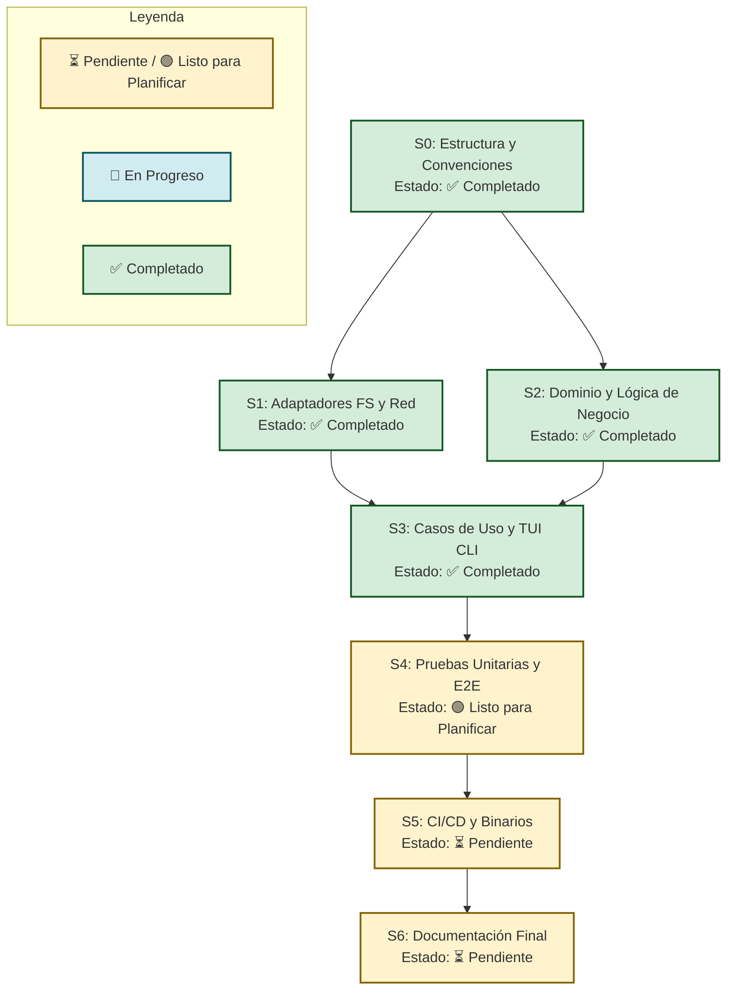

# Workflow – Códice: Opencode Workspace Installer v1.0.0 (MVP)
**Fecha:** 2026-06-14 | **Autor:** Fisherk2 | **Metodología:** Agile/Iterativo | **Estado:** F0 ✅ Completado | F1 ✅ Completado | F2 ✅ Completado | F3 ✅ Completado | F4 🟢 Listo para Planificar

## 1. Visión de Fases
| Fase | Objetivo | Entregables | Duración Estimada |
|------|----------|-------------|-------------------|
| **F0: Preparación** | Establecer la base del proyecto, entorno y convenciones. | `Justfile`, `bunfig.toml`, `.gitignore`, estructura de carpetas, linters. | 1 día |
| **F1: Infraestructura** | Implementar adaptadores de sistema de archivos y red. | `BunFileSystem.ts`, `GitHubRestClient.ts`, mocks de prueba. | 2 días |
| **F2: Núcleo** | Desarrollar la lógica de negocio pura y entidades del dominio. | `FileRule.ts`, `WorkspaceVersion.ts`, `FileMergeEngine.ts`, `VersionComparator.ts`. | 3 días |
| **F3: Interfaces** | Orquestar casos de uso y construir la TUI interactiva. | `CleanInstallUseCase.ts`, `ProjectInstallUseCase.ts`, `UpdateWorkspaceUseCase.ts`, `main.ts`. | 3 días |
| **F4: Pruebas** | Validar la robustez, cobertura y comportamiento E2E del binario. | Tests unitarios, tests de integración, scripts E2E (`test-e2e.sh`), reporte de cobertura. | 2 días |
| **F5: Despliegue** | Configurar CI/CD y generar binarios multiplataforma. | Pipeline de GitHub Actions, binarios compilados (`linux`, `macos`, `windows`), Release en GitHub. | 2 días |
| **F6: Cierre** | Documentación final, pulido y retrospectiva. | `README.md` actualizado, `CHANGELOG.md`, documentación de usuario. | 1 día |

## 2. Desglose por Fase

### Fase F0 – Preparación y Convenciones ✅ Completado
- **Tareas realizadas:** 
  - `T0.1`: Inicializar repositorio con `bun init` y estructura Clean Architecture (15 stubs + 12 directorios).
  - `T0.2`: Crear `Justfile` con 17 recipes: `setup`, `dev`, `lint`, `format`, `check`, `test`, `build`, `release`, `clean`.
  - `T0.3`: Configurar `@biomejs/biome` v2.5.0 para linting y formateo (strict rules, organize imports).
  - `T0.4`: Crear CI/CD pipeline (`.github/workflows/ci.yml`) — matrix 3-OS (ubuntu, macos, windows).
  - `T0.5`: Configurar `bunfig.toml` (dev/optional/peer deps, text lockfile, hoisted linker).
  - `T0.6`: Crear `.gitignore` optimizado para Bun/TypeScript (~42 líneas).
  - `T0.7`: Escribir 74 tests de validación F0 (8 módulos en `tests/unit/setup/`).
  - **Extra:** Code review 5-ejes sobre todo F0, corrección de 12 hallazgos (Result pattern, eslint muerto, stubs consistentes).
- **Artefactos generados:** `package.json`, `tsconfig.json`, `biome.json`, `bunfig.toml`, `Justfile`, `.github/workflows/ci.yml`, `.github/workflows/release.yml`, `.gitignore`, 15 stubs Clean Architecture, `src/domain/types/Result.ts`, 74 tests de validación.
- **Criterios de Completitud (DoD):** `just setup` ✅, `just lint` (4 warnings esperados, solo noConsole) ✅, `just check` ✅, `bun test` (74/74) ✅, `tsc --noEmit` ✅.
- **Dependencias:** Ninguna.

### Fase F1 – Infraestructura (Adaptadores) ✅ Completado
- **Tareas realizadas:**
  - `T1.1`: Implementar `IFileSystem` y `BunFileSystem` con staging atómico, rollback, path traversal prevention, template cache.
  - `T1.2`: Implementar `IGitHubClient` y `GitHubRestClient` con manejo de timeouts (3s), semver tag validation, content-length guard.
  - `T1.3`: Implementar `IClientPrompts` y `ClackPromptsAdapter` con confirm, multiselect, spinner, y flow messages.
  - `T1.4`: Escribir 64 tests de integración para los 3 adaptadores (32 BunFileSystem, 15 ClackPrompts, 17 GitHubRestClient).
  - `T1.5`: Code review 5-ejes sobre F1, corrección de 12 hallazgos (clearTimeout en finally, path traversal, rollback, semver, simplificaciones).
- **Artefactos generados:** `BunFileSystem.ts` con staging atómico, `resolveWithinRoot`, `restoreBackups`, template cache; `GitHubRestClient.ts` con semver validation, timeout handling, oversized response rejection; `ClackPromptsAdapter.ts` con implementación completa de `IUserPrompt`; 64 tests de integración, todos pasando; Commit: `124cfd0`.
- **Criterios de Completitud (DoD):** BunFileSystem implementa staging atómico, rollback en fallo, path traversal prevention ✅; BunFileSystem tiene isEmpty con safe default, template cache, version file ops ✅; GitHubRestClient maneja timeouts (3s), valida semver, rechaza oversized responses ✅; ClackPromptsAdapter usa @clack/prompts real con todos los métodos ✅; `bun test` (138/138) ✅; Code review F1 completado con 0 hallazgos críticos ✅.
- **Dependencias:** F0 ✅.

### Fase F2 – Núcleo (Dominio y Lógica de Negocio) ✅ Completado
- **Tareas realizadas:**
  - `T2.1`: Definir entidades `FileRule` (Obligatorio, Estándar, Opcional) y `WorkspaceVersion` con `fromJSON()` y `toJSON()`.
  - `T2.2`: Implementar `FileMergeEngine` con lógica de fusión granular y patrón Strategy (Obligatorio/Estándar/Opcional).
  - `T2.3`: Implementar `VersionComparator` usando la librería `semver`.
  - `T2.4`: Implementar `FileRuleManifest` con 32 reglas de clasificación + helpers.
  - `T2.5`: Implementar tipos `MergeError`, `Result<T,E>`.
  - `T2_Fix`: Code review Tezcatlipoca — ISO 8601 validation, módulo-level constant.
- **Artefactos generados:** `WorkspaceVersion.ts`, `FileRule.ts`, `FileRuleManifest.ts`, `FileMergeEngine.ts`, `VersionComparator.ts`, `MergeError.ts`, `Result.ts` (domain layer completa).
- **Criterios de Completitud (DoD):** 100% cobertura domain layer (100% lines, 96.4% functions) ✅; cero dependencias de Bun/Red ✅; `bun test` (214/214) ✅; biome lint 0 errors ✅; `tsc --noEmit` clean ✅; Code review 5-ejes aprobado ✅.
- **Dependencias:** F0 ✅, F1 ✅.

### Fase F3 – Interfaces (Casos de Uso y CLI) ✅ Completado
- **Tareas realizadas:**
  - `T3.1`: Implementar `CleanInstallUseCase`, `ProjectInstallUseCase` y `UpdateWorkspaceUseCase` con suscripción completa a `IUserPrompt` (confirmación, selección opcional, showSuccess/showCancel/showError).
  - `T3.2`: Integrar `@clack/prompts` en `main.ts` para el menú interactivo y manejo de señales `SIGINT` con `BunFileSystem.cleanStaging()`.
  - `T3.3`: Conectar la TUI con los casos de uso mediante inyección de dependencias en `main.ts`.
  - `T3.4`: Refactor — extraer `checkWritable()` y `writeVersionFileSafe()` a `src/application/helpers.ts` (Rule of Three).
  - `T3.5`: TDD gap audit — detectar y añadir 6 tests de cobertura faltantes (merge engine failure propagation, local version ahead, invalid semver fallback, optional file already exists).
  - `T3.6`: Code review 5-ejes con 3 correcciones: C1 (cancel+success UX), I1 (semver validation guard), I2 (split main.ts en 4 módulos <200 líneas c/u).
- **Artefactos generados:** `CleanInstallUseCase.ts`, `ProjectInstallUseCase.ts`, `UpdateWorkspaceUseCase.ts`, `helpers.ts`, `main.ts` (175 lines), `parse-args.ts`, `output.ts`, `container.ts`; test files para use cases (35 tests), CLI integration (10 tests), parseArgs unit (10 tests), gap tests (6 tests).
- **Criterios de Completitud (DoD):** CLI se ejecuta en modo desarrollo ✅; 3 flujos funcionan con datos mockeados ✅; `bun test` (269/269) ✅; `just check` 0 errores ✅; Code review completado con 0 hallazgos críticos ✅; main.ts <200 líneas ✅.
- **Dependencias:** F1 ✅, F2 ✅.

### Fase F4 – Pruebas (Unitarias, Integración y E2E) 🟢 Listo para Planificar
- **Tareas propuestas:**
  - `T4.1`: Escribir pruebas unitarias para dominio e infraestructura (`bun test`).
  - `T4.2`: Crear scripts E2E (`just test-e2e`) que compilen el binario, lo ejecuten en un directorio temporal y validen el estado final del sistema de archivos.
  - `T4.3`: Validar manejo de errores (ej: disco lleno, permiso denegado, red caída).
- **Criterios de Completitud (DoD):** Cobertura >80%, todos los tests E2E pasan en CI.
- **Dependencias:** F3 ✅.

### Fase F5 – Despliegue y CI/CD
- **Tareas:**
  - `T5.1`: Configurar GitHub Actions para ejecutar `just test` y `just build` en cada push/PR.
  - `T5.2`: Configurar el workflow de Release para compilar binarios multiplataforma (`bun build --compile`) y subirlos a GitHub Releases al crear un tag `v*.*.*`.
  - `T5.3`: Añadir badge de estado del CI/CD al `README.md`.
- **Criterios de Completitud (DoD):** Un tag creado dispara la creación de un Release con 3 binarios adjuntos.
- **Dependencias:** F4.

### Fase F6 – Cierre y Documentación
- **Tareas:**
  - `T6.1`: Redactar `README.md` con instrucciones de instalación "a prueba de tontos" (copiar y pegar).
  - `T6.2`: Generar `CHANGELOG.md` inicial y revisar `AGENTS.md` final.
  - `T6.3`: Retrospectiva del equipo y limpieza de deuda técnica.
- **Criterios de Completitud (DoD):** Documentación revisada, repositorio listo para uso público.
- **Dependencias:** F5.

## 3. DIAGRAMA DE DEPENDENCIA ENTRE *Specs*

> [!note] Regla de Dependencia
> Un *spec* solo puede iniciarse cuando todos los specs de los que depende estén en estado ✅ **Completado**. El grafo garantiza que no hay ciclos y que el riesgo de integración se minimiza al construir desde el núcleo (F2) hacia los bordes (F3, F5).

## 4. Estrategia de Pruebas por Fase
| Tipo | Alcance | Herramienta | Criterio de Éxito |
|------|---------|-------------|-------------------|
| **Unitarias** | Entidades, `FileMergeEngine`, `VersionComparator` | `bun:test` | >90% cobertura, 0 fallos, ejecución < 1s |
| **Integración** | `BunFileSystem` (con directorio temporal), `GitHubRestClient` (con MSW o mocks) | `bun:test` | Validación de atomicidad y manejo de timeouts |
| **E2E** | Binario compilado ejecutándose en entorno aislado | `bash` / `zx` scripts | El directorio destino refleja exactamente las reglas de fusión |
| **Seguridad** | Validación de Path Traversal, permisos de archivo | `bash` scripts + revisión manual | Intentos de `../../` son rechazados con código de error 1 |

## 5. Revisiones Técnicas Formales (FTRs)
| Gate | Artefacto a Revisar | Checklist | Participantes | Resultado |
|------|---------------------|-----------|---------------|-----------|
| **Gate 0** | Especificación | ¿SPEC.md, AGENTS.md y ADRs están aprobados? ¿Las decisiones arquitectónicas están documentadas? | Arquitecto | ✅ **Aprobado** — 2026-06-13 |
| **Gate 1** | F1 (Infraestructura) | ¿Adaptadores implementan staging atómico? ¿Manejo de timeouts? ¿Path traversal prevention? ¿Rollback en fallo? | Arquitecto, Dev Lead | ✅ **Aprobado** — 2026-06-14 |
| **Gate 2** | F2 (Núcleo) | ¿Lógica libre de efectos secundarios? ¿Principios SOLID aplicados? | Arquitecto, Dev Lead | ✅ **Aprobado** — 2026-06-14 |
| **Gate 3** | F3 (Interfaces) | ¿La TUI maneja `SIGINT` correctamente? ¿Los mensajes de error son accionables? | Arquitecto, UX Reviewer | ✅ **Aprobado** — 2026-06-14 |
| **Gate 4** | F4 (Pruebas) | ¿Cobertura >80%? ¿Los tests E2E validan el rollback atómico? | QA, Dev Lead | Pendiente |
| **Gate 5** | F5 (Release) | ¿El pipeline compila las 3 plataformas? ¿El binario funciona "out of the box"? | Arquitecto, DevOps | Pendiente |

## 6. Gestión de Riesgos
| Riesgo | Probabilidad | Impacto | Mitigación | Contingencia |
|--------|--------------|---------|------------|--------------|
| **Rate Limit de GitHub API** | Media | Alto | Implementar caché local de la última versión consultada (TTL 1 hora). | Fallback a instalación manual con advertencia al usuario. |
| **Fallo en compilación multiplataforma de Bun** | Baja | Alto | Usar versiones estables de Bun (`>= 1.1.x`) y probar en runners de GitHub Actions nativos. | Proveer instrucciones de instalación vía `bunx` como fallback. |
| **Corrupción de archivos del usuario** | Baja | Crítico | Patrón estricto de Staging + `fs.rename` atómico. | El directorio original permanece intacto; se elimina el staging. |
| **Complejidad excesiva en el checklist TUI** | Media | Medio | Agrupar opciones opcionales por categorías lógicas si superan los 10 ítems. | Refactorizar la TUI para usar paginación o submenús. |

## 7. Métricas de Progreso
- **Velocidad:** Número de tareas de `Justfile` completadas por semana.
- **Lead Time:** Tiempo desde que se inicia un spec hasta que se fusiona en `main`.
- **Defect Density:** Número de bugs reportados en E2E por cada 100 líneas de código.
- **Cobertura de Código:** Objetivo mínimo del 80% en `bun test --coverage`.
- **Definición de "Done" por capa:**
  - *Datos/Infra:* Adaptadores probados con mocks y casos de borde.
  - *Lógica:* 100% de pruebas unitarias pasando, sin dependencias externas.
  - *UI/TUI:* Flujos interactivos validados, manejo de `Ctrl+C` implementado.
  - *Despliegue:* Binarios generados y verificados en los 3 SOs principales.

## 8. Cronograma y Hitos
| Hito | Descripción | Fecha Objetivo (Semanas desde inicio) |
|------|-------------|---------------------------------------|
| **M1: Cimientos** | F0 y F1 completadas, entorno de desarrollo listo. | Semana 1 ✅ |
| **M2: Motor Funcional** | F2 y F3 completadas, CLI funcional en modo desarrollo. | F2 ✅ (Semana 2) — F3 ✅ (Semana 2) |
| **M3: Calidad Garantizada** | F4 completada, todas las pruebas E2E pasando en CI. | Semana 4 |
| **M4: Release v1.0.0** | F5 y F6 completadas, primera versión pública en GitHub Releases. | Semana 5 |

## 9. Control de Cambios y Lecciones Aprendidas
- **Control de Cambios:** Cualquier modificación al alcance (ej: añadir un nuevo modo de instalación) debe pasar por una actualización del PRD/TRD y ser aprobada por el Arquitecto antes de modificar el `WORKFLOW.MD`.
- **Lecciones Aprendidas:** Se documentarán al final de la Fase 6 en una sección de `RETROSPECTIVE.md`, enfocándose en la eficacia de `Justfile`, la experiencia con `@clack/prompts` y la robustez del patrón atómico de archivos.

---