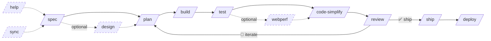
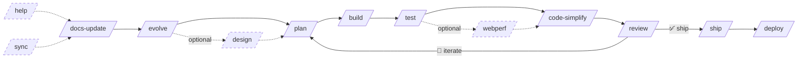
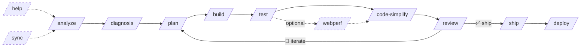
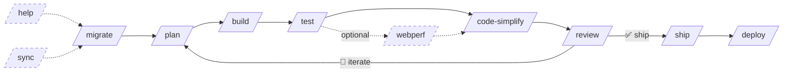

# Commands — SDD Workflow and Slash Commands

The Códice workspace is built around **Spec-driven Development (SDD)**, a structured workflow that guides your project from idea to release. Slash commands (`/command`) are the primary interface — each one activates a primary agent with a predefined workflow, combining skills, tools, and delegation patterns to deliver a specific outcome.

## The SDD Cycle

SDD organizes development into 4 workflow types depending on your project stage. All share the same iterative core (`plan → build → test → webperf → code-simplify → review`) which loops until requirements are satisfied, then exits to `/ship` → `/deploy`. The `/help` and `/sync` commands are wildcards — invoke them at any point in any flow.

### Initial Flow — MVPs & New Projects

Start here when building from scratch. `/spec` defines the project, `/design` establishes UI/UX if needed, then the iterative loop builds, tests, and refines until `/ship` + `/deploy`.



### Evolutionary Flow — Established Projects

Use this for projects with existing code and docs. `/docs-update` syncs documentation with the codebase, `/evolve` creates or modifies specs, then enters the iterative loop.



### Issues Flow — Bug Fixes & Tech Debt

Use this when addressing bugs, security issues, or tech debt. `/analyze` performs 8-dimension architecture analysis, `/diagnosis` documents root causes, then the iterative loop fixes and validates.



### Migration Flow — Technology Migration

Use this when migrating tech stacks, updating dependencies, or upgrading systems. `/migrate` detects the current stack, evaluates breaking changes, and generates a migration plan, then the iterative loop executes and validates.



| Phase | Command | Agent | Description |
|-------|---------|-------|-------------|
| **Onboarding** | `/help` | huitzilopochtli | Welcome the user, explain Códice, guide through workspace, and detect project state. Entry point for new users. |
| **Define** | `/spec` | quetzalcoatl | Create project specifications, documentation, and conventions from scratch. For new projects or features. |
| **Design** | `/design` | quetzalcoatl | Establish UI/UX specifications — design systems, user flows, component architecture, and accessibility requirements. |
| **Plan** | `/plan` | moctezuma | Break down specifications into small, verifiable tasks with acceptance criteria and dependency graphs. |
| **Build** | `/build` | tlaloc | Implement tasks incrementally using TDD (Red-Green-Refactor). Each task is built, tested, verified, and committed. |
| **Test** | `/test` | mictlantecuhtli | Write failing tests, implement to make them pass, and verify the full suite. Supports the Prove-It pattern for bug fixes. |
| **Refactor** | `/code-simplify` | tezcatlipoca | Simplify code for clarity and maintainability without changing behavior. Delegates review to specialists, applies fixes incrementally, then re-verifies. |
| **Review** | `/review` | tezcatlipoca | Conduct a five-axis code review: correctness, readability, architecture, security, and performance. Delegates findings to specialists and applies corrections if confirmed. |
| **Ship** | `/ship` | tezcatlipoca | Run a parallel fan-out pre-launch checklist (code review, security audit, test coverage, dependency audit, accessibility), then synthesize a go/no-go decision with rollback plan. Applies fixes if confirmed. |
| **Performance** | `/webperf` | tezcatlipoca | Run a web performance audit via the web-performance-auditor subagent. Deep mode with Lighthouse or quick mode via source scanning. Applies fixes if confirmed. |
| **Maintain** | `/docs-update` | quetzalcoatl | Update, migrate, and synchronize documentation with the current codebase state. Creates ADRs for significant decisions. |
| **Analyze** | `/diagnosis` | tezcatlipoca | Suggest fixes for problems (remote or local), run diagnostics, and document technical findings in `docs/diagnosis/`. Documents diagnosis — does not implement fixes. |
| **Evolve** | `/evolve` | quetzalcoatl | Create new specs or modify existing ones for mature projects with established versions and documentation. |
| **Sync** | `/sync` | mictlantecuhtli | Bidirectional git sync with 4 modes and 4 conflict resolution strategies. Can be invoked at any SDD phase. |
| **Migrate** (optional) | `/migrate` | quetzalcoatl | Detects current tech stack, evaluates breaking changes, generates a structured migration plan with phases, steps, and rollback procedures. |
| **Deploy** | `/deploy` | mictlantecuhtli | Post-`/ship` deployment automation. 3 modes: no workflow, betterable, established. Generates branch protection, PR templates, CI pipelines. |
| **Analyze** | `/analyze` | tezcatlipoca | 8-dimension architecture analysis generating prioritized `TECH_DEBT.md`. Findings feed `/diagnosis`. |

### Recommended Workflows

Each flow type is designed for a specific project situation. You can enter at any point and skip optional phases. The next-step suggestions within each command are advisory, not enforced.

| Flow | Entry Point | Use Case | Key Difference |
|------|-------------|----------|----------------|
| **Initial** | `/spec` | MVPs, new projects, greenfield | Starts from scratch — defines specs before building |
| **Evolutionary** | `/docs-update` | Established projects, feature additions | Syncs docs first, evolves existing specs |
| **Issues** | `/analyze` | Bug fixes, security patches, tech debt | Analyzes first, diagnoses, then fixes iteratively |
| **Migration** | `/migrate` | Tech stack changes, dependency upgrades | Plans migration, then executes and validates |

**All 4 flows converge** at the iterative core: `plan → build → test → webperf [opt] → code-simplify → review`. This loop repeats until the user is satisfied, then exits to `/ship` → `/deploy`.

**Wildcard commands:** `/help` (onboarding & help menu) and `/sync` (bidirectional git sync) can be invoked at any point in any flow.

## Command File Pattern

Every command file lives in `commands/` and follows a strict structure:

### YAML Frontmatter

```yaml
---
description: Action verb + what the command does in one line
agent: <primary-agent-name>
---
```

| Field | Required | Description |
|-------|----------|-------------|
| `description` | Yes | One-line description starting with an action verb. Example: "Break down the spec into small, verifiable tasks with acceptance criteria." |
| `agent` | Yes | The primary agent that executes this command. Must be one of: `huitzilopochtli`, `quetzalcoatl`, `moctezuma`, `tlaloc`, `mictlantecuhtli`, `tezcatlipoca`. |

### Markdown Body

The body contains numbered steps that the agent follows. Key patterns:

- **Skill references**: Skills are loaded with `**Load** \`skill-name\` skill`. For example, `**Load** \`test-driven-development\` skill`.
- **Delegation**: Commands delegate work to subagents with `**Delegate** \`subagent-name\` subagent`, passing deterministic instructions, skills to load, and a goal checklist.
- **Question tool**: Commands use the `question` tool at decision points to clarify intent with the user before proceeding.
- **Phases**: Complex commands use `## Phase` headings to organize multi-stage workflows.
- **Rules section**: Commands include a `## Rules` section listing constraints and restrictions.
- **Suggested Next Step**: Every command ends with a `## Suggested Next Step` block that suggests the next command to run.

### Example: `/spec`

```markdown
---
description: Init a new project — establish specs, documentation, and project conventions from scratch
agent: quetzalcoatl
---

## Pre-Flight: Detect Project State

1. Read @AGENTS.md — real project-specific rules or placeholder?
2. Read @SPEC.md — real content or missing?
3. Scan @docs/ — real documentation or empty templates?
4. Check @specs/ and @specs/adr/ — any existing modular files?

## Phase 0: Clarify Intent

If the user's request is vague, invoke @skills/interview-me/SKILL.md
to extract intent before proceeding.

## Phase 1: Refine Requirements

Use the `question` tool to clarify interactively:
1. Objective and target users
2. Core features and acceptance criteria
3. Tech stack preferences and constraints
4. Boundaries

## Phase 2: Generate Initial Documentation

Invoke @skills/spec-driven-development/SKILL.md to scaffold...

## Rules

1. `/spec` is for projects in conception phase. For mature projects, redirect to `/evolve`.
2. Never overwrite existing files without user confirmation.

## Suggested Next Step

> Your project specs are ready. Run `/plan` to create an execution plan, or run `/design` to establish the UI/UX design.
```

## How to Add a New Command

Adding a new slash command requires creating the command file, registering it in the SDD plugin, and updating the orchestration documentation. Follow these steps:

### Step 1: Create the Command File

Create `commands/<command-name>.md` with YAML frontmatter and a markdown body. For this guide, we will create a `/deploy` command.

```markdown
---
description: Deploy the application to a target environment with rollback support
agent: mictlantecuhtli
---

**Load** `shipping-and-launch` skill.

## Phase 0 — Pre-flight: Detect Target Environment

1. Check for deployment config files:
   - `Dockerfile` or `compose.yml` → Docker deployment
   - `.github/workflows/deploy.yml` → GitHub Actions
   - `Dokkufile` or `Procfile` → PaaS deployment
2. Use the `question` tool to let the user select the target environment.
3. Validate required environment variables are set.

## Phase 1 — Build and Package

1. Run the build step for the detected environment.
2. Package the application into the deployable artifact.
3. Verify the artifact is valid (checksum, size check).

## Phase 2 — Deploy

1. Deploy the artifact to the target environment.
2. Verify the deployment is healthy (health check endpoint).
3. If health check fails, initiate automatic rollback.

## Phase 3 — Post-Deploy

1. Run smoke tests against the deployed environment.
2. Tag the release in git.
3. Update the changelog.

## Rules

1. Never deploy without a health check verification step.
2. Always have a rollback plan before starting the deploy.
3. Use the `question` tool to confirm the target environment.

## Suggested Next Step

> Deployment complete. Run `/diagnosis` to monitor for issues, or run `/docs-update` to update deployment documentation.
```

### Step 2: Update Next-Step Suggestions

Review the `## Suggested Next Step` blocks in existing commands to see if any should add `/deploy` as a suggestion. For example, `/ship` could suggest: *"Run `/deploy` to push to production, or run `/docs-update` for documentation maintenance."*

### Step 3: Restart OpenCode

Restart your OpenCode session so it recognizes the new command file.

## Links

- [OpenCode Command Documentation](https://opencode.ai/docs/commands) — Official OpenCode command configuration guide.
- [Agent Reference](Agents) — Primary agents that execute each command.
- [SDD Pipeline Plugin](https://github.com/fisherk2/codice-opencode) — Source for command registration and intent detection.
