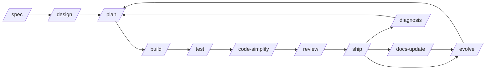

# Commands — SDD Workflow and Slash Commands

The Códice workspace is built around **Spec-driven Development (SDD)**, a structured workflow that guides your project from idea to release. Slash commands (`/command`) are the primary interface — each one activates a primary agent with a predefined workflow, combining skills, tools, and delegation patterns to deliver a specific outcome.

## The SDD Cycle

SDD organizes development into a repeatable cycle of phases. Each phase has a dedicated command that handles that phase's work and then suggests the next logical step.



| Phase | Command | Agent | Description |
|-------|---------|-------|-------------|
| **Define** | `/spec` | quetzalcoatl | Create project specifications, documentation, and conventions from scratch. For new projects or features. |
| **Design** | `/design` | quetzalcoatl | Establish UI/UX specifications — design systems, user flows, component architecture, and accessibility requirements. |
| **Plan** | `/plan` | moctezuma | Break down specifications into small, verifiable tasks with acceptance criteria and dependency graphs. |
| **Build** | `/build` | tlaloc | Implement tasks incrementally using TDD (Red-Green-Refactor). Each task is built, tested, verified, and committed. |
| **Test** | `/test` | mictlantecuhtli | Write failing tests, implement to make them pass, and verify the full suite. Supports the Prove-It pattern for bug fixes. |
| **Refactor** | `/code-simplify` | tlaloc | Simplify code for clarity and maintainability without changing behavior. Applies named refactoring transformations. |
| **Review** | `/review` | tezcatlipoca | Conduct a five-axis code review: correctness, readability, architecture, security, and performance. |
| **Ship** | `/ship` | mictlantecuhtli | Run a parallel fan-out pre-launch checklist (code review, security audit, test coverage, dependency audit, accessibility), then synthesize a go/no-go decision with rollback plan. |
| **Performance** | `/webperf` | mictlantecuhtli | Run a web performance audit via the web-performance-auditor subagent. Deep mode with Lighthouse or quick mode via source scanning. |
| **Maintain** | `/docs-update` | quetzalcoatl | Update, migrate, and synchronize documentation with the current codebase state. Creates ADRs for significant decisions. |
| **Analyze** | `/diagnosis` | quetzalcoatl | Analyze issues (remote or local), run diagnostics, and document technical findings in `docs/diagnosis/`. Does not implement fixes — only documents. |
| **Evolve** | `/evolve` | quetzalcoatl | Create new specs or modify existing ones for mature projects with established versions and documentation. |

### Flow Through the Cycle

The SDD cycle is designed to be followed sequentially, but you can enter at any point:

1. **Start with `/spec`** to define what you are building. After `/spec`, the command suggests: *"Run `/plan` to create an execution plan, or run `/design` to establish the UI/UX design of the project."*

2. **Use `/design`** to create design specifications. After `/design`, it suggests: *"Run `/plan` to create an execution plan for the implementation."*

3. **Run `/plan`** to break the spec into tasks. After `/plan`, it suggests: *"Run `/build` to start implementing the first task from the plan."*

4. **Execute `/build`** to implement tasks incrementally. After `/build`, it suggests: *"Run `/test` to validate the implementation and check for regressions."*

5. **Validate with `/test`** — write tests, fix bugs. After `/test`, it suggests: *"Run `/code-simplify` to refactor and simplify the code, or run `/webperf` if you want to optimize web performance."*

6. **Polish with `/code-simplify`** or **`/webperf`** . After `/code-simplify`: *"Run `/review` to review the latest implementations."* After `/webperf`: *"Run `/code-simplify` to refactor and simplify the code with performance improvements applied."*

7. **Review with `/review`** . After `/review`: *"Switch to agent tlaloc to fix the observations, then run `/ship` to prepare for launch."*

8. **Ship with `/ship`** . After `/ship`: *"Run `/docs-update`, `/diagnosis`, or `/evolve` for maintenance. If you are not ready to launch, run `/ship` again when ready."*

9. **Maintain with `/docs-update`** , **`/diagnosis`** , or **`/evolve`** . After `/docs-update`: *"Run `/evolve` to create new specs."* After `/diagnosis`: *"Run `/plan` to create an execution plan for implementing the fix."* After `/evolve`: *"Run `/plan` to create an execution plan, or run `/build` to start implementing directly."*

This flow is not rigid — you can skip phases, repeat them, or jump between them as your project demands. The next-step suggestions are advisory, not enforced.

## Command File Pattern

Every command file lives in `commands/` and follows a strict structure:

### YAML Frontmatter

```yaml
---
description: Action verb + what the command does in one line
agent: <primary-agent-name>
---
```

| Field | Required | Description |
|-------|----------|-------------|
| `description` | Yes | One-line description starting with an action verb. Example: "Break down the spec into small, verifiable tasks with acceptance criteria." |
| `agent` | Yes | The primary agent that executes this command. Must be one of: `quetzalcoatl`, `moctezuma`, `tlaloc`, `mictlantecuhtli`, `tezcatlipoca`. |

### Markdown Body

The body contains numbered steps that the agent follows. Key patterns:

- **Skill references**: Skills are referenced inline with `@skills/<skill-name>/SKILL.md`. For example, `@skills/test-driven-development/SKILL.md`.
- **Question tool**: Commands use the `question` tool at decision points to clarify intent with the user before proceeding.
- **Phases**: Complex commands use `## Phase` headings to organize multi-stage workflows.
- **Rules section**: Commands include a `## Rules` section listing constraints and restrictions.
- **Suggested Next Step**: Every command ends with a `## Suggested Next Step` block that suggests the next command to run.

### Example: `/spec`

```markdown
---
description: Init a new project — establish specs, documentation, and project conventions from scratch
agent: quetzalcoatl
---

## Pre-Flight: Detect Project State

1. Read @AGENTS.md — real project-specific rules or placeholder?
2. Read @SPEC.md — real content or missing?
3. Scan @docs/ — real documentation or empty templates?
4. Check @specs/ and @specs/adr/ — any existing modular files?

## Phase 0: Clarify Intent

If the user's request is vague, invoke @skills/interview-me/SKILL.md
to extract intent before proceeding.

## Phase 1: Refine Requirements

Use the `question` tool to clarify interactively:
1. Objective and target users
2. Core features and acceptance criteria
3. Tech stack preferences and constraints
4. Boundaries

## Phase 2: Generate Initial Documentation

Invoke @skills/spec-driven-development/SKILL.md to scaffold...

## Rules

1. `/spec` is for projects in conception phase. For mature projects, redirect to `/evolve`.
2. Never overwrite existing files without user confirmation.

## Suggested Next Step

> Your project specs are ready. Run `/plan` to create an execution plan, or run `/design` to establish the UI/UX design.
```

## How to Add a New Command

Adding a new slash command requires creating the command file, registering it in the SDD plugin, and updating the orchestration documentation. Follow these steps:

### Step 1: Create the Command File

Create `commands/<command-name>.md` with YAML frontmatter and a markdown body. For this guide, we will create a `/deploy` command.

```markdown
---
description: Deploy the application to a target environment with rollback support
agent: tlaloc
---

Invoke @skills/shipping-and-launch/SKILL.md.

## Phase 0 — Pre-flight: Detect Target Environment

1. Check for deployment config files:
   - `Dockerfile` or `compose.yml` → Docker deployment
   - `.github/workflows/deploy.yml` → GitHub Actions
   - `Dokkufile` or `Procfile` → PaaS deployment
2. Use the `question` tool to let the user select the target environment.
3. Validate required environment variables are set.

## Phase 1 — Build and Package

1. Run the build step for the detected environment.
2. Package the application into the deployable artifact.
3. Verify the artifact is valid (checksum, size check).

## Phase 2 — Deploy

1. Deploy the artifact to the target environment.
2. Verify the deployment is healthy (health check endpoint).
3. If health check fails, initiate automatic rollback.

## Phase 3 — Post-Deploy

1. Run smoke tests against the deployed environment.
2. Tag the release in git.
3. Update the changelog.

## Rules

1. Never deploy without a health check verification step.
2. Always have a rollback plan before starting the deploy.
3. Use the `question` tool to confirm the target environment.

## Suggested Next Step

> Deployment complete. Run `/diagnosis` to monitor for issues, or run `/docs-update` to update deployment documentation.
```

### Step 2: Register in COMMAND_AGENT_MAP

Open `.opencode/plugins/sdd-pipeline.ts` and add the command to the `COMMAND_AGENT_MAP`:

```typescript
const COMMAND_AGENT_MAP: Record<string, string> = {
  "/spec": "quetzalcoatl",
  "/design": "quetzalcoatl",
  "/evolve": "quetzalcoatl",
  "/plan": "moctezuma",
  "/build": "tlaloc",
  "/deploy": "tlaloc",        // <-- add here
  "/test": "mictlantecuhtli",
  "/review": "tezcatlipoca",
  "/ship": "mictlantecuhtli",
  "/code-simplify": "tlaloc",
  "/webperf": "mictlantecuhtli",
}
```

### Step 3: Register Intent Patterns (Optional)

If you want the SDD plugin to auto-detect when a user's question should trigger `/deploy`, add intent patterns:

```typescript
const INTENT_PATTERNS: Record<string, string[]> = {
  // ... existing patterns ...
  "/deploy": [
    "deploy", "desplegar", "release", "lanzar", "push to production",
    "go live", "production deploy", "roll out", "ship to production",
  ],
}
```

### Step 4: Update SDD Phase Suggestions

If `/deploy` introduces a new SDD phase (e.g., a "Deploy" phase between Ship and Maintain), update the `PHASE_SUGGESTIONS` and orchestration patterns documentation. For a command that fits an existing phase, you may skip this — `/deploy` would logically fit in the "Ship" phase.

### Step 5: Update Next-Step Suggestions

Review the `## Suggested Next Step` blocks in existing commands to see if any should add `/deploy` as a suggestion. For example, `/ship` could suggest: *"Run `/deploy` to push to production, or run `/docs-update` for documentation maintenance."*

### Step 6: Update Documentation

Add the new command to:
- [GitHub Wiki → Commands](https://github.com/fisherk2/codice-opencode/wiki/Commands) — Command creation documentation
- [Configuration](Configuration) — Full `opencode.json` reference and customization guide
- `README.md` — Full-cycle phase table and Mermaid diagram (if applicable)

### Step 7: Restart OpenCode

Restart your OpenCode session so it recognizes the new command file.

## Command Registration Summary

| Step | File | Change |
|------|------|--------|
| 1 | `commands/<name>.md` | Create command file with frontmatter + numbered steps |
| 2 | `.opencode/plugins/sdd-pipeline.ts` | Add to `COMMAND_AGENT_MAP` |
| 3 | `.opencode/plugins/sdd-pipeline.ts` | (Optional) Add to `INTENT_PATTERNS` |
| 4 | [GitHub Wiki → Commands](https://github.com/fisherk2/codice-opencode/wiki/Commands) | (If SDD phase is new) Update phase suggestions |
| 5 | Various command files | Update `## Suggested Next Step` blocks |
| 6 | User guide + README | Add command to reference tables |

## Command Details

### `/spec` — Project Specification

Invokes quetzalcoatl to establish the full specification foundation for a new project: AGENTS.md, SPEC.md, docs/ architecture, specs/ modules, and ADRs. Detects project state first — if the project already has stable code and versions, redirects to `/evolve`.

### `/design` — Design Specification

Invokes quetzalcoatl to create a comprehensive design specification. Fans out to ux-researcher, frontend-developer, and accessibility-tester in parallel, then merges their reports into docs/DESIGN.md and specs/design/.

### `/plan` — Task Breakdown

Invokes moctezuma to break specifications into small, verifiable tasks with acceptance criteria. Outputs tasks/plan.md and tasks/todo.md. Uses the `question` tool to present the plan for human review before saving.

### `/build` — Incremental Implementation

Invokes tlaloc to implement the next pending task from the plan. Uses TDD (Red-Green-Refactor), invoking supporting skills (clean-ddd-hexagonal, error-handling-patterns, security-and-hardening, etc.) as needed. Commits each task with a descriptive message.

### `/test` — TDD and Verification

Invokes mictlantecuhtli to run the TDD workflow. For new features: write failing tests, implement, refactor. For bug fixes: use the Prove-It pattern (write a test that reproduces the bug, confirm it fails, implement the fix, confirm it passes).

### `/code-simplify` — Code Refactoring

Invokes tlaloc to simplify code for clarity without changing behavior. Applies guard clauses, function extraction, dead code removal, and other named refactoring transformations. Runs tests after each change.

### `/review` — Five-Axis Code Review

Invokes tezcatlipoca to review changes across correctness, readability, architecture, security, and performance. Categorizes findings as Critical, Important, or Suggestion. Uses the `question` tool to resolve ambiguities before finalizing.

### `/ship` — Pre-Launch Checklist

Invokes mictlantecuhtli to run a parallel fan-out across 4-5 subagents (code-reviewer, security-auditor, test-engineer, dependency-manager, and optionally accessibility-tester). Merges their reports into a single go/no-go decision with a mandatory rollback plan.

### `/webperf` — Web Performance Audit

Invokes mictlantecuhtli to delegate to the web-performance-auditor subagent. Supports deep mode (Lighthouse reports, PageSpeed Insights, CrUX) and quick mode (source code scanning for structural anti-patterns).

### `/docs-update` — Documentation Synchronization

Invokes quetzalcoatl to update, migrate, and synchronize documentation with the current codebase. Scans for outdated docs, resolves contradictions, creates missing ADRs, and never touches tasks/ or code.

### `/diagnosis` — Issue Analysis

Invokes quetzalcoatl to analyze problems (remote issues or local bugs), run diagnostics via analysis subagents, and document findings in docs/diagnosis/. Does not implement fixes — only documents root cause and proposed solutions.

### `/evolve` — Spec Evolution

Invokes quetzalcoatl to create or modify specs for mature projects. Detects project maturity first — if the project is new, redirects to `/spec`. Never writes to tasks/ or implements code.

## Links

- [OpenCode Command Documentation](https://opencode.ai/docs/commands) — Official OpenCode command configuration guide.
- [Agent Reference](Agents) — Primary agents that execute each command.
- [SDD Pipeline Plugin](https://github.com/fisherk2/codice-opencode) — Source for command registration and intent detection.
