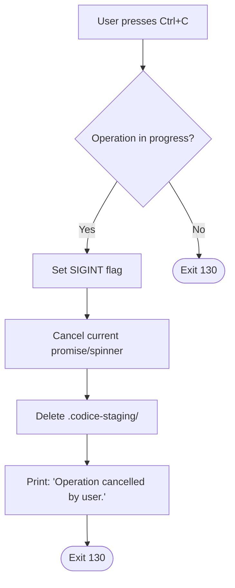

# Spec: CLI Commands & Installation Modes

**Spec ID:** S3-CMD  
**Status:** ✅ Approved  
**Phase:** F3 – Interfaces (Casos de Uso y CLI)  
**Depends on:** S2 (Dominio y Lógica de Negocio)  
**Author:** Fisherk2  
**Date:** 2026-06-13  
**Version:** 1.0.0

---

## 1. Design Philosophy

The Códice CLI is designed around three core principles:

| Principle | Description | Implementation |
|-----------|-------------|----------------|
| **Fool-proof** | The user cannot accidentally destroy their work. Every destructive action requires explicit confirmation. | Staging directory + atomic rename; warnings before overwrites. |
| **Atomic** | Operations either complete fully or leave zero trace. No partial states. | `fs.rename()` staging → target; cleanup on any interruption. |
| **Safe** | Graceful degradation at every boundary (network, disk, permissions). | Timeouts, actionable error messages, SIGINT handlers. |

The CLI operates in two primary interaction models:
- **Interactive Mode (default):** Rich TUI with `@clack/prompts` for guided workflows.
- **Non-Interactive Mode:** Flag-driven execution for CI/CD pipelines and scripting.

---

## 2. CLI Entry Points

### 2.1 Command Invocation

```bash
# Interactive mode (default)
bunx codice

# Non-interactive modes
bunx codice --clean    # Clean install, no TUI
bunx codice --update   # Update mode, no TUI
bunx codice --project  # Project mode with defaults, no TUI

# Informational
bunx codice --help     # Show help and exit
bunx codice --version  # Show version and exit
```

### 2.2 Flag Precedence Rules

1. `--help` and `--version` are **terminal flags** — they override all other flags and exit immediately.
2. Mode flags (`--clean`, `--update`, `--project`) are **mutually exclusive**. If multiple are provided, the CLI exits with code `2` and prints: `Error: Only one mode flag allowed (--clean, --update, --project).`
3. `--force` can be combined with any mode flag to skip confirmations.
4. `--verbose` can be combined with any invocation.

---

## 3. Installation Modes

### 3.1 Mode 1: Clean Install (`--clean`)

**Purpose:** Fresh project setup — install the complete workspace template into an empty or existing directory.

**Behavior:**
- Copies **ALL** files from `template/` to the current working directory.
- **Destructive:** Overwrites every existing file without individual prompts (unless `--force` is absent, in which case a single global confirmation is shown).
- Applies **no** classification rules — every file is treated as Obligatorio.

**TUI Flow (Interactive):**

```
[intro]     → "Códice Installer v1.0.0"
[warning]   → "⚠️ This will OVERWRITE all existing files in /current/dir"
[confirm]   → "Are you sure? (y/N)"
[spinner]   → "Copying files..."  (staging phase)
[spinner]   → "Applying changes..." (atomic rename)
[outro]     → "✅ Workspace installed successfully!"  or  "❌ Error: ..."
```

**Non-Interactive:**
```bash
bunx codice --clean --force    # No confirmation, direct execution
bunx codice --clean            # Still asks for confirmation unless --force
```

**Atomic Guarantee:**
1. Create `.codice-staging/` directory.
2. Copy all template files into staging.
3. On success: `fs.rename(staging, target)` — atomic at OS level.
4. On failure/SIGINT: recursively delete `.codice-staging/`.

---

### 3.2 Mode 2: Project Install (default / `--project`)

**Purpose:** Add the OpenCode workspace to an **existing project** without destroying existing files.

**Behavior:**
- Applies the **File Classification Rules** (see S2-Domain):
  - **Obligatorio:** Always copied. Overwrites if exists.
  - **Estándar:** Copied if target does not exist. Never overwrites.
  - **Opcional:** Presented to user as a checklist. Only copies selected items.

**TUI Flow (Interactive):**

```
[intro]     → "Códice Installer v1.0.0 — Project Mode"
[select]    → "What would you like to install?"
              ├─ [ ] .opencode/          (Obligatorio — pre-checked, disabled)
              ├─ [ ] .opencode/agents/    (Obligatorio — pre-checked, disabled)
              ├─ [ ] .opencode/skills/    (Estándar — pre-checked)
              ├─ [ ] .github/             (Opcional — unchecked)
              ├─ [ ] docs/                (Opcional — unchecked)
              └─ [ ] scripts/             (Opcional — unchecked)
[preview]   → "Summary: 12 files will be copied, 0 overwritten, 3 skipped"
[confirm]   → "Proceed? (Y/n)"
[spinner]   → "Staging files..."
[spinner]   → "Applying changes..."
[outro]     → "✅ Workspace added to project!"
```

**Non-Interactive:**
```bash
bunx codice --project --force          # All Estándar + no Opcionals
bunx codice --project --force --all    # All Estándar + ALL Opcionals (future flag)
```

> **Note:** In non-interactive `--project` mode, **Opcional files are skipped by default** to prevent unintended additions.

---

### 3.3 Mode 3: Update Workspace (`--update`)

**Purpose:** Update an existing workspace installation to the latest template version.

**Behavior:**
- Queries the **GitHub API** (`/repos/{owner}/{repo}/releases/latest`) for the latest release tag.
- Reads local version from `.codice-version`.
- Applies **only** Obligatorio + Estándar files. **Opcional files are never touched** to preserve user customizations.
- Uses the same atomic staging mechanism.

**Version Check Logic:**

| Condition | Behavior |
|-----------|----------|
| `local == remote` | Print "You already have the latest version (vX.Y.Z)." → Exit 0 |
| `local < remote` | Show changelog summary → Confirm → Proceed with update |
| `local > remote` | Print "Local version is newer than remote. Skipping update." → Exit 0 |
| No `.codice-version` | Treat as "unknown version" → Proceed with update |
| Network timeout (>3s) | Warning: "Could not check for updates. Using local template." → Proceed |
| GitHub API error (404/403) | Warning + proceed with local template |

**TUI Flow (Interactive):**

```
[intro]     → "Códice Updater v1.0.0"
[spinner]   → "Checking for updates..."
[note]      → "New version available: v1.1.0 (you have v1.0.0)"
[note]      → "Changelog: Added Python skill, fixed path traversal bug"
[confirm]   → "Update now? (Y/n)"
[spinner]   → "Downloading template..."
[spinner]   → "Staging changes..."
[spinner]   → "Applying update..."
[outro]     → "✅ Updated to v1.1.0!"  or  "❌ Update failed: ..."
```

**Non-Interactive:**
```bash
bunx codice --update --force    # Skip confirmation, update if newer version exists
```

---

## 4. TUI Flow Diagrams (Mermaid)

### 4.1 Clean Install Flow

```mermaid
flowchart TD
    A([Start]) --> B{Parse Args}
    B -->| --help | C[Show Help] --> Z([Exit 0])
    B -->| --version | D[Show Version] --> Z
    B -->| --clean | E{Check target dir}
    
    E -->|Not writable| F["Error: EACCES<br/>Exit 1"] --> Z
    E -->|Missing template/| G["Error: Template not found<br/>Exit 1"] --> Z
    E -->|OK| H{Interactive?}
    
    H -->|Yes| I["⚠️ Warning: Destructive"] --> J["Confirm? (y/N)"]
    J -->|No / Ctrl+C| K["Cleanup staging<br/>Exit 130"] --> Z
    J -->|Yes| L[Execute Clean Install]
    
    H -->|No --force| L
    H -->|No (no --force)| M["Error: --force required<br/>in non-interactive<br/>Exit 2"] --> Z
    
    L --> N["Create .codice-staging/"]
    N --> O["Copy ALL template files"]
    O --> P["Atomic rename"]
    P -->|Success| Q["✅ Success<br/>Exit 0"] --> Z
    P -->|Failure| R["Cleanup staging<br/>Exit 1"] --> Z
    
    style F fill:#ffcccc
    style G fill:#ffcccc
    style M fill:#ffcccc
    style K fill:#fff3cd
    style Q fill:#d4edda
    style R fill:#ffcccc
```

### 4.2 Project Install Flow

```mermaid
flowchart TD
    A([Start]) --> B{Parse Args}
    B -->| --project / default | C{Check target dir}
    
    C -->|Not writable| D["Error: EACCES<br/>Exit 1"] --> Z([Exit])
    C -->|Missing template/| E["Error: Template not found<br/>Exit 1"] --> Z
    C -->|OK| F{Interactive?}
    
    F -->|Yes| G["Show file checklist"]
    G --> H["User selects Opcionals"]
    H --> I["Show preview summary"]
    I --> J["Confirm? (Y/n)"]
    J -->|No / Ctrl+C| K["Cleanup<br/>Exit 130"] --> Z
    J -->|Yes| L[Execute Project Install]
    
    F -->|No --force| L
    F -->|No (no --force)| M["Error: --force required<br/>Exit 2"] --> Z
    
    L --> N["Create .codice-staging/"]
    N --> O["Copy Obligatorio files"]
    O --> P["Copy Estándar files (if not exist)"]
    P --> Q["Copy selected Opcional files"]
    Q --> R["Atomic rename"]
    R -->|Success| S["✅ Success<br/>Exit 0"] --> Z
    R -->|Failure| T["Cleanup staging<br/>Exit 1"] --> Z
    
    style D fill:#ffcccc
    style E fill:#ffcccc
    style M fill:#ffcccc
    style K fill:#fff3cd
    style S fill:#d4edda
    style T fill:#ffcccc
```

### 4.3 Update Workspace Flow

```mermaid
flowchart TD
    A([Start]) --> B{Parse Args}
    B -->| --update | C["Check .codice-version"]
    
    C -->|Corrupt / Missing| D["Treat as 'unknown'"]
    C -->|Valid| E["Read local version"]
    D --> F["Query GitHub API"]
    E --> F
    
    F -->|Timeout >3s| G["Warning: No internet<br/>Use local template"] --> H
    F -->|API Error| G --> H
    F -->|Success| I{"Local vs Remote"}
    
    I -->|local == remote| J["✅ Already latest<br/>Exit 0"] --> Z([Exit])
    I -->|local > remote| K["Local is newer<br/>Exit 0"] --> Z
    I -->|local < remote| L["Show changelog"]
    
    L --> M{Interactive?}
    M -->|Yes| N["Confirm update? (Y/n)"]
    N -->|No / Ctrl+C| O["Cleanup<br/>Exit 130"] --> Z
    N -->|Yes| H[Execute Update]
    
    M -->|No --force| H
    M -->|No (no --force)| P["Error: --force required<br/>Exit 2"] --> Z
    
    H --> Q["Create .codice-staging/"]
    Q --> R["Copy Obligatorio files"]
    R --> S["Copy Estándar files (if not exist)"]
    S --> T["Skip Opcional files"]
    T --> U["Atomic rename"]
    U -->|Success| V["✅ Updated<br/>Exit 0"] --> Z
    U -->|Failure| W["Cleanup staging<br/>Exit 1"] --> Z
    
    style G fill:#fff3cd
    style J fill:#d4edda
    style K fill:#d4edda
    style P fill:#ffcccc
    style O fill:#fff3cd
    style V fill:#d4edda
    style W fill:#ffcccc
```

### 4.4 SIGINT Handling (Global)



---

## 5. Error Handling Matrix

| Error Type | Trigger Condition | User-Facing Message | Exit Code | Recovery Action |
|------------|-------------------|---------------------|-----------|-----------------|
| **EACCES** | Target directory not writable | `❌ Permission denied: {path}. Run with appropriate permissions or choose a different directory.` | `1` | Abort before staging |
| **ENOSPC** | Disk full during copy | `❌ Disk full: unable to copy {filename}. Free up space and try again.` | `1` | Cleanup staging, abort |
| **ENOENT** | `template/` directory missing | `❌ Template directory not found. Reinstall Códice or check your installation.` | `1` | Abort immediately |
| **Network Timeout** | GitHub API > 3s | `⚠️ Could not check for updates. Using local template. (Timeout after 3s)` | `0` | Proceed with local |
| **GitHub API 404** | Repo/release not found | `⚠️ Could not fetch latest version. Using local template.` | `0` | Proceed with local |
| **GitHub API 403** | Rate limited | `⚠️ GitHub API rate limit exceeded. Using local template.` | `0` | Proceed with local |
| **Corrupt Version File** | `.codice-version` invalid | `⚠️ Could not read local version. Treating as unknown.` | — | Log warning, proceed |
| **Invalid Mode Flags** | Multiple mode flags | `❌ Error: Only one mode flag allowed (--clean, --update, --project).` | `2` | Print usage, abort |
| **Missing --force** | Non-interactive without `--force` | `❌ Error: --force is required for non-interactive execution.` | `2` | Print usage, abort |
| **SIGINT** | Ctrl+C during operation | `⚠️ Operation cancelled by user.` | `130` | Cleanup staging, abort |
| **Staging Rename Fail** | `fs.rename()` throws | `❌ Failed to apply changes: {error.message}. Your original files are safe.` | `1` | Cleanup staging, abort |
| **Unknown Error** | Unhandled exception | `❌ Unexpected error: {error.message}. Please report this issue.` | `1` | Cleanup staging, abort |

---

## 6. Exit Codes Documentation

| Code | Meaning | When Used |
|------|---------|-----------|
| `0` | Success | Normal completion, or graceful degradation (network fallback) |
| `1` | Runtime Error | Filesystem errors, unexpected exceptions, staging failure |
| `2` | CLI Usage Error | Invalid flag combinations, missing required flags, bad arguments |
| `130` | Interrupted by User | SIGINT (Ctrl+C) received during operation |

> **Convention:** Exit codes follow the Bash standard: `0` = success, `1` = general error, `2` = misuse, `130` = `128 + SIGINT(2)`.

---

## 7. TUI Component Mapping (@clack/prompts)

Each step in the interactive flow maps to a specific `@clack/prompts` component:

| Flow Step | Component | Purpose | Configuration |
|-----------|-----------|---------|---------------|
| **Intro** | `intro()` | Display app name and version | `message: "Códice Installer"` |
| **Warning** | `note()` | Highlight destructive actions | `message: "⚠️ This will overwrite..."` |
| **File Checklist** | `multiselect()` | Select Opcional files | `options` generated from `FileRule[]`, Obligatorio items `disabled: true` |
| **Confirmation** | `confirm()` | Yes/No decision | `active: "Yes"`, `inactive: "No"`, `initial: false` for destructive actions |
| **Preview** | `note()` | Show summary before execution | `message: "📋 Summary: {n} files to copy..."` |
| **Progress** | `spinner()` | Indicate ongoing operation | `message` updated per phase: "Staging...", "Applying..." |
| **Changelog** | `note()` | Display version changes | `message: "Changelog: ..."` |
| **Outro** | `outro()` | Final success/failure message | `message` with ✅ or ❌ prefix |
| **Error** | `cancel()` | Abort with error message | `message: error.message` |

### 7.1 Component Usage Rules

1. **Every interactive mode** must begin with `intro()` and end with `outro()` or `cancel()`.
2. **Destructive confirmations** (`--clean`) must default to `No` (`initial: false`).
3. **Non-destructive confirmations** (`--update`, `--project`) may default to `Yes` (`initial: true`).
4. **Spinners** must be cancelled and replaced with `outro()` on completion, or `cancel()` on error.
5. **Colors:** Use `picocolors` (dependency of `@clack/prompts`) for consistent theming:
   - Success: `pc.green()`
   - Warning: `pc.yellow()`
   - Error: `pc.red()`
   - Info: `pc.cyan()`

---

## 8. Non-Interactive / CI Mode Specification

### 8.1 Flag Reference

| Flag | Shorthand | Description | Default | Requires `--force` |
|------|-----------|-------------|---------|-------------------|
| `--clean` | — | Clean install mode | `false` | Yes (if non-interactive) |
| `--project` | — | Project install mode | `false` | Yes (if non-interactive) |
| `--update` | — | Update mode | `false` | Yes (if non-interactive) |
| `--force` | `-f` | Skip all confirmations | `false` | — |
| `--verbose` | `-v` | Structured JSON logging to stderr | `false` | No |
| `--version` | `-V` | Show version and exit | `false` | No |
| `--help` | `-h` | Show help and exit | `false` | No |

### 8.2 CI Mode Behavior

When any mode flag (`--clean`, `--update`, `--project`) is provided:

1. **No TUI is rendered.** All `@clack/prompts` calls are bypassed.
2. **Logging** goes to `stderr` in structured format (see 8.3).
3. **Exit codes** are strictly adhered to for pipeline control.
4. **If `--force` is missing**, the CLI exits with code `2` immediately.

### 8.3 Structured Logging (`--verbose`)

When `--verbose` is enabled, the CLI outputs JSON lines to `stderr`:

```json
{"level":"info","phase":"init","message":"Códice v1.0.0 starting","timestamp":"2026-06-13T10:00:00Z"}
{"level":"info","phase":"version_check","message":"Local: v1.0.0, Remote: v1.1.0","timestamp":"2026-06-13T10:00:01Z"}
{"level":"info","phase":"staging","message":"Created .codice-staging/","timestamp":"2026-06-13T10:00:01Z"}
{"level":"info","phase":"copy","message":"Copied 12 files","timestamp":"2026-06-13T10:00:02Z"}
{"level":"info","phase":"atomic","message":"Renamed staging to target","timestamp":"2026-06-13T10:00:02Z"}
{"level":"info","phase":"complete","message":"Operation successful","timestamp":"2026-06-13T10:00:02Z"}
```

Error example:
```json
{"level":"error","phase":"staging","message":"EACCES: permission denied, mkdir '/path'","code":"EACCES","timestamp":"2026-06-13T10:00:02Z"}
```

### 8.4 CI Usage Examples

```bash
# GitHub Actions — clean install
- run: bunx codice --clean --force --verbose

# GitHub Actions — update workspace
- run: bunx codice --update --force --verbose

# Local script — project mode with defaults
bunx codice --project --force

# Docker entrypoint — fail on any error
set -e
bunx codice --clean --force --verbose
```

---

## 9. File Classification in Practice

The CLI consumes the `FileRule[]` array produced by the Domain layer (S2). Here is how each mode interprets the rules:

| Mode | Obligatorio | Estándar | Opcional |
|------|-------------|----------|----------|
| **Clean** | Copy + Overwrite | Copy + Overwrite | Copy + Overwrite |
| **Project** | Copy + Overwrite | Copy if missing | Prompt user (multiselect) |
| **Update** | Copy + Overwrite | Copy if missing | **Skip entirely** |

> **Rationale for Update skipping Opcional:** User may have customized optional files (e.g., custom skills, project-specific docs). Updating them blindly would destroy their work.

---

## 10. State Machine Summary

The CLI can be modeled as a finite state machine:

```
[INIT] --parse args--> [VALIDATE]
[VALIDATE] --invalid--> [ERROR] --exit 2--> [END]
[VALIDATE] --valid--> [CHECK_ENV]
[CHECK_ENV] --missing template--> [ERROR] --exit 1--> [END]
[CHECK_ENV] --not writable--> [ERROR] --exit 1--> [END]
[CHECK_ENV] --ok--> {mode branch}

Mode = CLEAN:
  [CHECK_ENV] --> [CONFIRM] --no--> [CANCEL] --exit 130--> [END]
  [CONFIRM] --yes--> [STAGE] --> [COPY_ALL] --> [ATOMIC_RENAME]

Mode = PROJECT:
  [CHECK_ENV] --> [SELECT_OPTIONALS] --> [PREVIEW] --> [CONFIRM]
  [CONFIRM] --yes--> [STAGE] --> [COPY_RULED] --> [ATOMIC_RENAME]

Mode = UPDATE:
  [CHECK_ENV] --> [CHECK_VERSION] --up to date--> [END] --exit 0
  [CHECK_VERSION] --> [CONFIRM] --> [STAGE] --> [COPY_RULED_NO_OPT] --> [ATOMIC_RENAME]

[ATOMIC_RENAME] --success--> [SUCCESS] --exit 0--> [END]
[ATOMIC_RENAME] --failure--> [ROLLBACK] --> [ERROR] --exit 1--> [END]

Global: Any state --SIGINT--> [CANCEL] --cleanup--> [END] --exit 130
```

---

## 11. Acceptance Criteria (DoD)

- [ ] All three modes execute without errors in interactive mode.
- [ ] All three modes execute without errors in non-interactive mode (`--force`).
- [ ] `--help` and `--version` work correctly and exit 0.
- [ ] Invalid flag combinations exit 2 with a clear message.
- [ ] SIGINT at any phase cleans up `.codice-staging/` and exits 130.
- [ ] Network timeout gracefully falls back to local template (exit 0 with warning).
- [ ] TUI uses `@clack/prompts` components as specified in Section 7.
- [ ] `--verbose` outputs valid JSON lines to stderr.
- [ ] Exit codes match the specification in Section 6.
- [ ] Error messages are actionable (tell the user what to do, not just what failed).

---

## 12. Related Specs

- **S2-Domain:** `spec-domain-logic.md` — FileRule, WorkspaceVersion, FileMergeEngine, VersionComparator
- **S1-Infra:** `spec-infrastructure.md` — BunFileSystem, GitHubRestClient, ClackPromptsAdapter
- **S4-Tests:** `spec-testing.md` — E2E test scenarios for each CLI mode

---

## 13. Changelog

| Version | Date | Changes |
|---------|------|---------|
| 1.0.0 | 2026-06-13 | Initial spec: CLI commands, 3 installation modes, TUI flows, error matrix, exit codes, CI mode |
