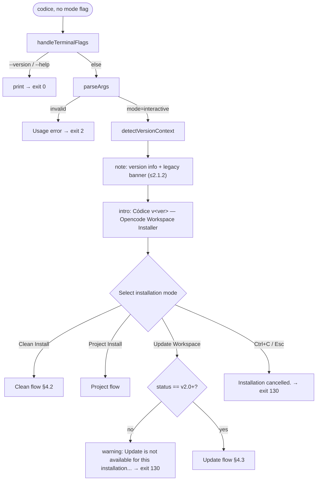
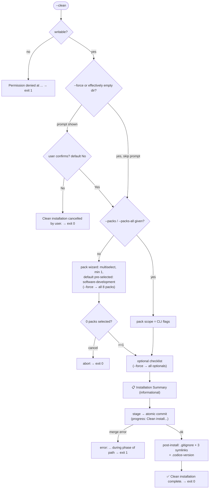
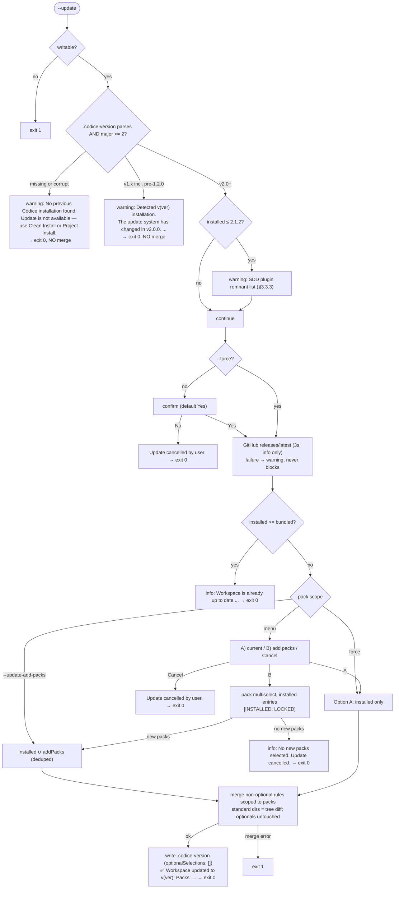
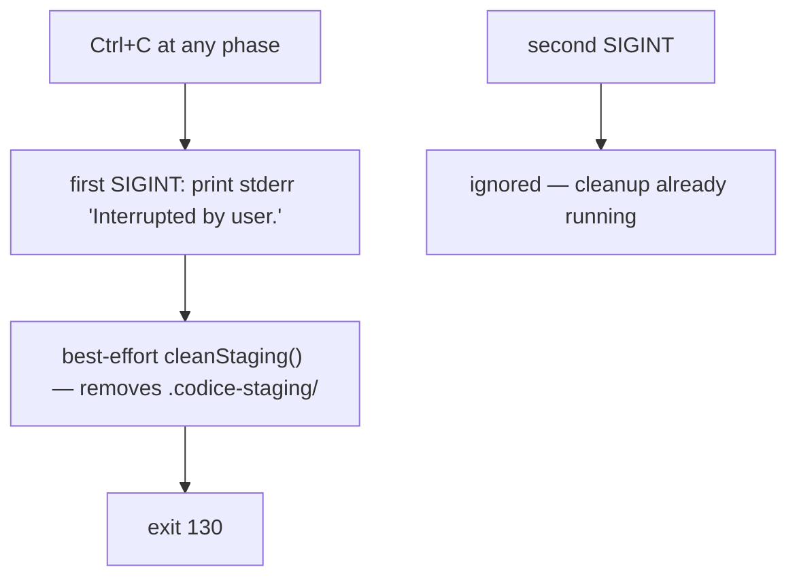

# Spec: CLI Commands & Installation Modes

**Spec ID:** S3-CMD  
**Status:** ✅ Approved  
**Phase:** F3 – Interfaces (Casos de Uso y CLI)  
**Depends on:** S2 (Dominio y Lógica de Negocio)  
**Author:** Fisherk2  
**Date:** 2026-09-22  
**Version:** 2.0.0

> **Authoritative source:** this spec is reverse-verified against the shipped code at
> Códice **v2.1.3** (`release/2.1.3`). Every behavioral claim is anchored to a file under
> `src/` (cited inline as `path/to/file.ts — symbol`). When code and prose disagree, the
> code wins and this document must be corrected. The v1.0.0 spec (2026-06-13) described
> pre-v2.0 behavior and several features that were never implemented; see §13 Changelog.

---

## 1. Design Philosophy

The Códice CLI is designed around three core principles:

| Principle | Description | Implementation |
|-----------|-------------|----------------|
| **Fool-proof** | The user cannot accidentally destroy their work. Destructive actions require explicit confirmation; the update flow is version-gated. | Confirmation prompts before merge; staging directory + atomic commit; `.codice-backup` files kept for pre-update content. |
| **Atomic** | Operations either complete fully or leave zero trace. No partial states. | Files are staged under `.codice-staging/` (`src/infrastructure/config/constants.ts — STAGING_DIR_NAME`) and committed in one pass by the merge engine; a failed commit restores `.codice-backup` files and cleans staging (`src/infrastructure/adapters/AtomicStager.ts — commitStaging` rollback path). |
| **Safe** | Graceful degradation at every boundary (network, disk, permissions). | GitHub API timeout + fail-soft (`src/infrastructure/adapters/GitHubRestClient.ts`), actionable error messages (`Result<T, Error>` everywhere), SIGINT staging cleanup (`src/cli/signalHandlers.ts — registerSigintHandler`). |

Two interaction models exist, and they are **orthogonal to mode selection**:

- **Interactive mode (default):** no mode flag given → the CLI renders a 3-option mode
  menu via `@clack/prompts` (`src/infrastructure/adapters/ClackPromptsAdapter.ts — MODE_OPTIONS`).
- **Non-interactive execution:** achieved with `--force` plus pack flags — **not** merely by
  passing a mode flag. `--clean` without `--force` still prompts for overwrite
  confirmation and pack/optional selection on a non-empty destination
  (`src/application/use-cases/InstallUseCaseBase.ts — execute`).

### 1.1 Invocation & package name

The npm package is **`@fisherk2-dev/codice`** (`package.json — name`). The bare `codice`
bin (`package.json — bin.codice → src/cli/bin.js`) exists **only after a global install**
(`npm i -g @fisherk2-dev/codice`). One-shot invocation therefore uses the scoped name:

```bash
bunx @fisherk2-dev/codice            # preferred (Bun runtime)
npx @fisherk2-dev/codice             # equivalent fallback — the bin's shebang
                                     # (#!/usr/bin/env bun) still executes under Bun
codice                               # bare bin, global install only
```

All examples below use `bunx @fisherk2-dev/codice`; substitute `codice` if globally installed.

---

## 2. CLI Entry Points

### 2.1 Command Invocation

```bash
# Interactive mode (default — no mode flag)
bunx @fisherk2-dev/codice

# Direct mode selection (skips the mode menu; prompts remain unless --force)
bunx @fisherk2-dev/codice --clean
bunx @fisherk2-dev/codice --project
bunx @fisherk2-dev/codice --update

# Fully unattended (CI/CD)
bunx @fisherk2-dev/codice --clean --force
bunx @fisherk2-dev/codice --project --force
bunx @fisherk2-dev/codice --update --force

# Informational (terminal flags — see 2.3)
bunx @fisherk2-dev/codice --help
bunx @fisherk2-dev/codice --version
```

Sources: `src/cli/main.ts — main`, `src/cli/signalHandlers.ts — handleTerminalFlags`,
`src/cli/parse-args.ts — parseArgs`.

### 2.2 Complete Flag Reference (1:1 with `ALLOWED_FLAGS`)

The parser accepts **exactly** the flags below (`src/cli/parse-args.ts — ALLOWED_FLAGS +
VALUE_FLAGS`). Anything else — unknown flags, positional arguments, `-f`, `-v` — is a
usage error (exit `2`). There are **no short forms other than `-V` and `-h`**.

| Flag | Value | Meaning | Where it applies | Source |
|------|-------|---------|------------------|--------|
| `--clean` | — | Select Clean Install mode (skips menu) | all | `parse-args.ts` |
| `--project` | — | Select Project Install mode (skips menu) | all | `parse-args.ts` |
| `--update` | — | Select Update Workspace mode (skips menu) | all | `parse-args.ts` |
| `--force` | — | Skip confirmations and interactive selection defaults per mode (see §8) | all | `parse-args.ts`, `InstallUseCaseBase.ts` |
| `--verbose` | — | Timestamped structured log lines to stderr (see §8.3) | all | `parse-args.ts`, `VerboseLogger.ts` |
| `--version` / `-V` | — | Print `Códice v<package version>` and exit 0 | terminal | `signalHandlers.ts`, `output.ts — printVersion` |
| `--help` / `-h` | — | Print usage (text of `output.ts — printHelp`) and exit 0 | terminal | `signalHandlers.ts`, `output.ts — printHelp` |
| `--dest <path>` | required | Target directory (default: `process.cwd()`) | all | `parse-args.ts`, `main.ts` |
| `--packs <list>` | required | Comma-separated pack IDs to install; skips the pack wizard | clean, project | `parse-args.ts`, `main.ts — resolvePacks` |
| `--packs-all` | — | Install all 8 selectable packs; skips the pack wizard | clean, project | `parse-args.ts`, `main.ts — resolvePacks` |
| `--update-add-packs <list>` | required | Comma-separated pack IDs to ADD during update (Option B without the menu) | update | `parse-args.ts`, `updateFlow.ts — resolveUpdatePacks` |

Notes:

- `--packs` and `--update-add-packs` values are validated against the manifest pack IDs
  at parse time (`src/cli/validatePackList.ts`); an unknown ID fails:
  `[error] Invalid pack list: "<raw>". Use --help to list valid pack IDs.` → exit `2`.
- Valid pack IDs (8 selectable): `software-development`, `business`, `hardware-emerging`,
  `science-research`, `operations-support`, `finance`, `creative`, `government-legal`
  (`src/domain/entities/FileRuleManifestData.ts`, exposed via
  `FileRuleManifest.ts — getAllPackIds`).
- `--dest` is validated early (`src/cli/validateDestPath.ts`): rejects empty values,
  `..` traversal segments, the filesystem root, bare drive roots, and well-known system
  directories (`/etc`, `/usr`, `/bin`, `/boot`, `/dev`, `/proc`, `/sys`, `/opt`,
  `/sbin`, `/root` on POSIX; `C:\Windows`, `C:\Program Files`, etc. on win32). This is an
  early-fail guard only — the real containment boundary is
  `src/infrastructure/adapters/pathResolver.ts` at write time.
- `--packs-all` takes precedence over `--packs` when both are given
  (`src/cli/main.ts — resolvePacks`: `packsAll` wins, then `packs`, else wizard).
- `--packs` / `--packs-all` have **no effect in update mode** — update pack scope comes
  from `.codice-version` (plus `--update-add-packs`). `--update-add-packs` is ignored by
  clean/project. The parser accepts any combination; the mode decides what is read
  (`src/cli/main.ts — runMode`).

### 2.3 Flag Precedence & Validation Order

Execution order in `src/cli/main.ts — main`:

1. **Terminal flags first:** `--version`/`-V` and `--help`/`-h` are checked against raw
   `process.argv` **before parsing** (`handleTerminalFlags(args)` — `args.includes(...)`).
   They win over everything, including otherwise-invalid arguments, and exit `0`.
2. **Parse:** mode/option/value flags as in §2.2. An unrecognized flag, a positional
   argument, a missing value for `--dest`/`--packs`/`--update-add-packs`, or a failed
   value validation returns `null` from `parseArgs` →
   `Usage error: unrecognized arguments. Use --help for usage information.` (stderr) →
   exit `2`.
3. **Mode resolution:** flags are *not* mutually exclusive. If several mode flags are
   given, precedence is `--clean` > `--project` > `--update`
   (`src/cli/parse-args.ts — parseArgs`, final if-chain). With **no** mode flag the CLI
   is interactive (`mode: "interactive"`).
4. **Version detection** (`src/cli/versionContext.ts — detectVersionContext`) → shown as
   a note in **every** mode, interactive or not (see §3.0).
5. **Menu (interactive only)** → **mode execution** (§3).

> ⚠ v1.0.0 documented an `Error: Only one mode flag allowed` message and a rule that
> non-interactive mode flags require `--force`. **Neither exists in the code.** Multiple
> mode flags resolve by precedence; omitting `--force` simply keeps the prompts (which
> will fail or hang without a TTY — hence §8: CI must pass `--force`).

---

## 3. Installation Modes

### 3.0 Shared Prelude (all modes)

Before any mode logic, the CLI prints the detected installation state as a `clack.note`
(`src/infrastructure/adapters/ClackPromptsAdapter.ts — showVersionInfo`, copy from
`src/infrastructure/adapters/versionInfoMessages.ts — buildVersionInfoMessages`):

| Status (`versionContext.ts`) | Note title | Note body (first line / behavior) |
|------------------------------|------------|-----------------------------------|
| `missing` (no or invalid `.codice-version`) | `ℹ️  No Installation Detected` | `No previous Códice installation found.` + `Update is not available — use Clean Install or Project Install.` |
| `pre-1.2.0` (major <1 or 1.0–1.1) | `⚠️  Pre-1.2.0 Installation Detected` | Recommends deleting `references/` and `.devin/` before reinstalling. |
| `pre-2.0.0` (1.2 ≤ v < 2) | `⚠️  Pre-2.0.0 Installation Detected` | `Detected v1.x installation (v<ver>).` + the v2.0 update-system-change message. |
| `v2.0+` (major ≥ 2) | `✅ v2.0+ Installation Detected` | `Current installation: v<ver>` + `Packs: <installedPacks>`. |

**Legacy banner (before the menu):** when the detected version is ≤ `2.1.2`
(`LEGACY_MAX_VERSION` in `src/application/legacyBanner.ts — isLegacyVersion`), the v2.0+
note also appends:

```
⚠ Opencode Legacy only — upgrade to ≥ 2.1.3 for native Opencode V2 support
```

(`src/application/legacyBanner.ts — LEGACY_BANNER_MESSAGE`, rendered by
`versionInfoMessages.ts`). Because this runs before `promptForMode`, the deprecation is
visible before the user commits to a mode, and the update flow deliberately does not
repeat it (`src/application/use-cases/UpdateWorkspaceUseCase.ts — execute` docstring).

In **interactive mode only**, the prelude is followed by
`showIntro("Códice v<version> — Opencode Workspace Installer")` and the
`Select installation mode:` menu with exactly three options
(`src/cli/main.ts — resolveInteractiveMode`, `ClackPromptsAdapter.ts — MODE_OPTIONS`):

```
Clean Install       — Complete template overwrite (all files)
Project Install     — Selective merge with file classification
Update Workspace    — Update to latest template version
```

- Cancel (Ctrl+C / Esc at the menu) → `Installation cancelled.` → exit **130**.
- Choosing **Update Workspace** when the prelude status is anything other than `v2.0+`
  → warning `Update is not available for this installation. Use Clean Install or
  Project Install instead.` → exit **130** (blocked at the menu, before the use case).

The mode flags `--clean` / `--project` / `--update` skip exactly this menu and nothing
else — the prelude note, the confirmation prompts, the pack wizard and the optional
checklist all still run unless suppressed by `--force` / `--packs` / `--packs-all`.

### 3.1 Mode 1: Clean Install (`--clean`)

**Purpose:** fresh or full reinstall — the selected template subset is written into the
destination as *mandatory* (overwrite whatever exists).

**Behavior** (`src/application/use-cases/CleanInstallUseCase.ts`, flow in
`InstallUseCaseBase.ts — execute`):

1. `checkWritable` (`src/application/helpers.ts`): probes by writing/removing a test
   file; failure → `Permission denied at "<dest>". Check directory permissions or run
   with elevated access.` → exit `1`.
2. Overwrite confirmation — **skipped** when `--force` or the directory is effectively
   empty (only `.git`/`.codice-version` present; `BunFileSystem.ts — isEmpty`,
   `helpers.ts — confirmOverwrite`):
   `The destination directory "<dest>" is not empty. All existing files may be
   overwritten. Continue?` — default **No**. "No" → `Clean installation cancelled by
   user.` → exit `0`.
3. **Pack wizard** — skipped when `--packs`/`--packs-all` supplied (pre-computed in
   `main.ts — resolvePacks`), or with `--force` (auto-selects **all 8** packs).
   Interactive: `Select agent packs to install:` multiselect, `software-development`
   pre-selected (`src/application/packOptions.ts — DEFAULT_PACKS`),
   **required: true → minimum 1 pack** (`ClackPromptsAdapter.ts — selectPacks`).
   Cancel → empty selection → install aborts cleanly with exit `0`.
4. **Optional checklist** — `Select optional files to install:` multiselect over the 10
   `optional` manifest rules (`helpers.ts — promptForOptionals`); not required (zero
   allowed). With `--force`, **all optional files are auto-selected**
   (`CleanInstallUseCase.ts — selectOptionals`).
5. **Installation summary** note (`📋 Installation Summary`) — informational only, no
   confirmation (`InstallUseCaseBase.ts — showInstallSummary`,
   `src/application/installSummary.ts`; design decision FEV-22 #5).
6. Merge: selected packs + mandatory + chosen optionals, every rule forced to
   `mandatory` category (overwrite) (`CleanInstallUseCase.ts — buildRules`), staged and
   committed atomically with a progress bar (label `Clean install...`).
7. Post-install (`src/application/postInstall.ts — runPostInstallSteps`): generate
   `.gitignore` from `template/estandar/gitignore` (npm strips dot-gitignored files —
   ADR-009), create the 3 symlinks `.opencode/{agents,commands,skills}`
   (`src/infrastructure/config/symlinks.ts` — ADR-008), write `.codice-version`
   (`version`, `installedPacks`, `installedAt`, `optionalSelections`). Gitignore or
   symlink failures are **non-fatal warnings**; a version-file write failure cleans
   staging and errors with `... Installation rolled back.` (exit `1`).
8. Success outro: `✅ Clean installation complete.` → exit `0`.

**Non-interactive (CI):**

```bash
bunx @fisherk2-dev/codice --clean --force                 # all 8 packs + all optionals
bunx @fisherk2-dev/codice --clean --force --packs business,creative   # --packs overrides the force default
bunx @fisherk2-dev/codice --clean --force --packs-all     # explicit all packs
```

(`--packs`/`--packs-all` beat the `--force` "all packs" default:
`options.packs ?? selectPacks(force)` in `InstallUseCaseBase.ts`; pinned by
`tests/e2e/29-non-interactive-packs.sh`.)

### 3.2 Mode 2: Project Install (`--project`)

**Purpose:** add the workspace into an **existing project** while preserving user files,
by respecting each rule's category.

**Behavior** (`src/application/use-cases/ProjectInstallUseCase.ts`): identical flow to
§3.1 with three differences:

- Confirmation copy: `... Some existing files may be overwritten. Continue?` (default No).
- `--force` selects **only the default pack** (`software-development`) and **zero
  optional files** (`selectPacks` / `selectOptionals` overrides) — the opposite of Clean's
  force defaults, which are *all packs / all optionals*.
- Categories are **preserved** into the merge engine (`buildRules`):
  mandatory → overwrite, pack → always copy, standard → copy only if missing,
  optional → copy only if selected **and** missing
  (`src/domain/services/stagePlanner.ts — shouldStage`).

Success outro: `✅ Project installation complete.` → exit `0`.
Cancel message: `Project installation cancelled by user.`

> **v1 correction:** v1.0.0 referenced a bulk-select flag as "future" — it never
> shipped and does not exist in `ALLOWED_FLAGS`. The real equivalents are
> `--packs-all` (all packs) and `--force` on **Clean** (all optional files).
> Project `--force` never adds optional files.

### 3.3 Mode 3: Update Workspace (`--update`)

**Purpose:** bring an existing **v2.0+** installation up to the template version bundled
in the running package. **No download occurs** — the GitHub API is consulted for
information only; the merge always uses the local `template/` shipped inside
`@fisherk2-dev/codice` (`UpdateWorkspaceUseCase.ts` constructor param
`bundledVersion = VERSION`, `src/cli/version.ts`).

**Flow** (`src/application/use-cases/UpdateWorkspaceUseCase.ts — execute`):

1. `checkWritable` (as §3.1).
2. **Version gate** (`readInstalledVersion`, before *any* destructive prompt), messages
   from `src/application/versionGateMessages.ts`:
   - `.codice-version` **missing, malformed JSON, or failing validation**
     (`src/application/versionData.ts — parseVersionData` → `WorkspaceVersion.fromJSON`)
     → **BLOCKED**: warning
     `No previous Códice installation found. Update is not available — use Clean Install or Project Install.`
     → graceful exit `0`, **no merge**. *(v1 claimed "treat as unknown → proceed"; the
     code does the opposite. Pinned by `tests/e2e/21-update-blocked-missing.sh`.)*
   - Installed major < 2 → **BLOCKED**: warning
     `Detected v<version> installation. The update system has changed in v2.0.0. Please reinstall using Clean Install or Project Install to adopt the new pack system.`
     → exit `0`. Pinned by `tests/e2e/22-update-blocked-v1x.sh`.
3. **SDD plugin remnant notification** — when the installed version is on the legacy
   line (≤ 2.1.2, `src/application/legacyBanner.ts — isLegacyVersion`): warning built by
   `src/application/use-cases/updateHelpers.ts — buildPluginRemnantMessage` —
   `Legacy plugin remnant: v2.1.3 removed the SDD plugin, but these files from your
   previous install remain and must be deleted manually:` followed by the five paths
   (`.opencode/plugins/sdd-pipeline.ts`, `.opencode/plugins/src/destructivePatterns.ts`,
   `.opencode/plugins/src/normalizeBash.ts`, `.opencode/plugins/README.md`,
   `.opencode/plugins/tsconfig.json`), the note about optional
   `sdd-workflow-test.md`, and `Do NOT delete the plugins/ directory itself`. Shown
   **before** the confirm prompt so every path (A/B/non-interactive) sees it.
4. **Confirmation** (skipped by `--force`): `Update workspace in "<dest>"? Packs: <list>.
   Continue?` — default **Yes** (`maybeConfirmUpdate`, `helpers.ts — confirmOverwrite`).
   "No" → `Update cancelled by user.` → exit `0`.
5. **GitHub info check** — never blocks (`src/application/use-cases/updateStatusCheck.ts
   — reportRemoteStatus`): `GET .../repos/fisherk2/codice-opencode/releases/latest`,
   3 s timeout (`src/infrastructure/config/constants.ts — GITHUB_API_TIMEOUT_MS`).
   Any failure (offline, 404, 403, timeout, bad tag) → warning
   `Could not check for updates via GitHub. Falling back to the bundled template version.`
   Remote newer than installed → info
   `A newer version (v<remote>) is available on GitHub. The bundled template (v<bundled>) will be used for this update.`
6. **Up-to-date check** (`notifyIfUpToDate`): installed ≥ bundled → info
   `Workspace is already up to date at version <local>. No update needed.` → exit `0`.
7. **Pack scope resolution** (`src/application/use-cases/updateFlow.ts
   — resolveUpdatePacks`):
   - `--update-add-packs <list>` → installed ∪ listed (deduped; already-installed IDs
     are a no-op). Non-interactive.
   - `--force` (without add-packs) → installed packs only (Option A, no prompt).
   - Interactive → `Select update option:` menu:
     `A) Update current workspace` (hint: only installed packs),
     `B) Update and add packs`,
     `Cancel` → `Update cancelled by user.` → exit `0`.
     Option B opens the pack multiselect with installed packs **locked** — labeled
     `[INSTALLED, LOCKED]`, hint `Already installed — cannot be removed`
     (`src/infrastructure/adapters/packPromptOptions.ts`). If nothing new is chosen →
     info `No new packs selected. Update cancelled.` → exit `0`.
8. **Merge** of non-optional rules scoped to the resolved packs
   (`filterByPacks(FILE_RULE_MANIFEST.filter(r => r.category !== "optional"), packs)`):
   mandatory and selected packs overwrite; standard directories get a **tree-level
   diff** — only files new in the template are added, user files are never touched
   (`updateMode: true`, `src/domain/services/stagePlanner.ts`, `treeDiff.ts`).
   **Optional files are never modified.** Progress label `Updating files...`.
9. **Finish** (`src/application/use-cases/updateHelpers.ts — finishUpdate`): write
   `.codice-version` with `optionalSelections: []` (optional selections reset per spec
   §6.1) and `installedPacks` = resolved scope; success outro
   `✅ Workspace updated to v<version>. Packs: <list>` → exit `0`.
   A non-semver resolved version fails loudly:
   `Cannot resolve version: neither explicit flag (...) nor bundled template (...) is
   valid semver.` (bug #79) → exit `1`.

**Non-interactive (CI):**

```bash
bunx @fisherk2-dev/codice --update --force                       # Option A only
bunx @fisherk2-dev/codice --update --force --update-add-packs finance,creative
```

> **v1 corrections in this mode:** no changelog display, no "Downloading template..."
> step, and no `.codice-version`-missing fallback-proceed (all three were in v1.0.0;
> none exist in `src/`). Update also performs **no** post-install generation — no
> `.gitignore` rewrite, no symlink creation (`src/application/helpers.ts` module
> docstring; pinned by `tests/e2e/10-update-no-symlinks.sh`).

---

## 4. TUI Flow Diagrams (Mermaid)

### 4.1 Interactive session (no mode flag)


```mermaid
flowchart TD
    A([codice, no mode flag]) --> B[handleTerminalFlags]
    B -->|--version / --help| C[print → exit 0]
    B -->|else| D[parseArgs]
    D -->|invalid| E["Usage error → exit 2"]
    D -->|mode=interactive| F[detectVersionContext]
    F --> G["note: version info + legacy banner (≤2.1.2)"]
    G --> H["intro: Códice v&lt;ver&gt; — Opencode Workspace Installer"]
    H --> I{Select installation mode}
    I -->|Clean Install| J[Clean flow §4.2]
    I -->|Project Install| K[Project flow]
    I -->|Update Workspace| L{status == v2.0+?}
    L -->|no| M["warning: Update is not available for this installation... → exit 130"]
    L -->|yes| N[Update flow §4.3]
    I -->|Ctrl+C / Esc| O["Installation cancelled. → exit 130"]
```

### 4.2 Clean Install flow (`--clean`)


```mermaid
flowchart TD
    A([--clean]) --> B{writable?}
    B -->|no| C["Permission denied at ... → exit 1"]
    B -->|yes| D{"--force or effectively empty dir?"}
    D -->|prompt shown| E{user confirms? default No}
    E -->|No| F["Clean installation cancelled by user. → exit 0"]
    E -->|Yes| G{--packs / --packs-all given?}
    D -->|yes, skip prompt| G
    G -->|no| H["pack wizard: multiselect, min 1,<br/>default pre-selected: software-development<br/>(--force → all 8 packs)"]
    G -->|yes| I[pack scope = CLI flags]
    H --> J{"0 packs selected?"}
    J -->|cancel| K["abort → exit 0"]
    J -->|>=1| L["optional checklist<br/>(--force → all optionals)"]
    I --> L
    L --> M["📋 Installation Summary (informational)"]
    M --> N["stage → atomic commit<br/>(progress: Clean install...)"]
    N -->|merge error| O["error: ... during phase of path → exit 1"]
    N -->|ok| P["post-install: .gitignore + 3 symlinks<br/>+ .codice-version"]
    P --> Q["✅ Clean installation complete. → exit 0"]
```

### 4.3 Update Workspace flow (`--update`)


```mermaid
flowchart TD
    A([--update]) --> B{writable?}
    B -->|no| C[exit 1]
    B -->|yes| D{".codice-version parses AND major >= 2?"}
    D -->|missing or corrupt| E["warning: No previous Códice installation found.<br/>Update is not available — use Clean Install or Project Install.<br/>→ exit 0, NO merge"]
    D -->|v1.x incl. pre-1.2.0| F["warning: Detected v(ver) installation.<br/>The update system has changed in v2.0.0. ...<br/>→ exit 0, NO merge"]
    D -->|v2.0+| G{"installed ≤ 2.1.2?"}
    G -->|yes| H["warning: SDD plugin remnant list (§3.3.3)"]
    G -->|no| I[continue]
    H --> I
    I --> J{"--force?"}
    J -->|no| K["confirm (default Yes)"]
    K -->|No| L["Update cancelled by user. → exit 0"]
    K -->|Yes| M["GitHub releases/latest (3s, info only)<br/>failure → warning, never blocks"]
    J -->|yes| M
    M --> N{"installed >= bundled?"}
    N -->|yes| O["info: Workspace is already up to date ... → exit 0"]
    N -->|no| P{pack scope}
    P -->|--update-add-packs| Q["installed ∪ addPacks (deduped)"]
    P -->|force| R["Option A: installed only"]
    P -->|menu| S["A) current / B) add packs / Cancel"]
    S -->|Cancel| T["Update cancelled by user. → exit 0"]
    S -->|B| U["pack multiselect, installed entries<br/>[INSTALLED, LOCKED]"]
    U -->|no new packs| V["info: No new packs selected. Update cancelled. → exit 0"]
    U -->|new packs| Q
    S -->|A| R
    Q --> W["merge non-optional rules scoped to packs<br/>standard dirs = tree diff; optionals untouched"]
    R --> W
    W -->|ok| X["write .codice-version (optionalSelections: [])<br/>✅ Workspace updated to v(ver). Packs: ... → exit 0"]
    W -->|merge error| Y[exit 1]
```

### 4.4 SIGINT Handling (Global)


```mermaid
flowchart TD
    A[Ctrl+C at any phase] --> B["first SIGINT: print stderr 'Interrupted by user.'"]
    B --> C["best-effort cleanStaging() — removes .codice-staging/"]
    C --> D["exit 130"]
    A2[second SIGINT] --> E[ignored — cleanup already running]
```

`.codice-backup` files are **deliberately not deleted** — they are the only on-disk copy
of pre-update content until the next successful commit
(`src/cli/signalHandlers.ts — registerSigintHandler`, SC-8).

---

## 5. Error Handling Matrix

Messages below are quoted from source (v1.0.0's paraphrases were inaccurate or fictional).

| Condition | User-facing output | Exit code | Source |
|-----------|--------------------|-----------|--------|
| Unrecognized flag / positional arg / missing flag value | `Usage error: unrecognized arguments. Use --help for usage information.` | `2` | `main.ts`, `parse-args.ts` |
| Invalid `--packs` / `--update-add-packs` ID | `[error] Invalid pack list: "<raw>". Use --help to list valid pack IDs.` + usage line | `2` | `parse-args.ts`, `validatePackList.ts` |
| Unsafe `--dest` (traversal, root, system dir, drive root, empty) | `[error] Invalid destination path: "<dest>" <reason>` + usage line | `2` | `validateDestPath.ts` |
| Destination not writable | `❌ Permission denied at "<dest>". Check directory permissions or run with elevated access.` | `1` | `helpers.ts — checkWritable`, `main.ts — showError` |
| `.codice-version` missing/corrupt during update | warning `No previous Códice installation found. Update is not available — use Clean Install or Project Install.` (no merge) | `0` | `versionGateMessages.ts — buildNoPreviousInstallWarning`, `UpdateWorkspaceUseCase.ts — readInstalledVersion` |
| Pre-v2.0 install during update | warning `Detected v<ver> installation. The update system has changed in v2.0.0. ...` (no merge) | `0` | `versionGateMessages.ts — buildUpdateSystemChangedWarning` |
| Update from ≤ 2.1.2 (SDD remnants) | warning with the 5 plugin paths to delete manually | update continues | `updateHelpers.ts — buildPluginRemnantMessage` |
| GitHub unreachable / timeout / bad tag (3 s) | warning `Could not check for updates via GitHub. Falling back to the bundled template version.` → proceed | `0` | `updateStatusCheck.ts — reportRemoteStatus`, `GitHubRestClient.ts`, `constants.ts` |
| Remote release newer than installed | info `A newer version (...) is available on GitHub. The bundled template (...) will be used for this update.` → proceed | `0` | `updateStatusCheck.ts` |
| Installed ≥ bundled template | info `Workspace is already up to date at version <ver>. No update needed.` (no merge) | `0` | `updateStatusCheck.ts — notifyIfUpToDate` |
| Merge planning failure | `❌ <error.message> during staging` (no path — plan computed before any write); residual staging cleaned | `1` | `FileMergeEngine.ts — execute` catch, `stagingError()` |
| Per-file staging failure | `❌ <error.message> during staging of <path>` (destination untouched) | `1` | `FileMergeEngine.ts`, `helpers.ts — wrapMergeError` |
| Commit (atomic promote) failure | `❌ Failed to commit staged files: <cause> during commit`; backups restored, staging cleaned | `1` | `AtomicStager.ts — commitStaging` rollback, `commitError()` |
| Version-file write failure post-merge | `❌ Failed to write version file: <cause>. Installation rolled back.` / `... Update rolled back.`; staging cleaned | `1` | `helpers.ts — writeVersionFileSafe` |
| `.gitignore` generation fails post-install | warning `Could not generate .gitignore: <cause>. The workspace was installed successfully. ...` — install still succeeds | `0` | `postInstall.ts — createGitignoreSafe` |
| Symlink creation partially fails | warning `Some .opencode/ symlinks could not be created (N failures). The workspace was installed successfully.` (+ `Re-run the installer...` hint on Clean only) | `0` | `postInstall.ts — createSymlinksWithWarning` |
| Non-semver resolved version at end of update | `❌ Cannot resolve version: neither explicit flag (...) nor bundled template (...) is valid semver.` | `1` | `UpdateWorkspaceUseCase.ts — resolveNewVersion` |
| SIGINT during operation | stderr `\nInterrupted by user.`; staging cleaned | `130` | `signalHandlers.ts` |
| Cancel at mode menu / blocked update at menu | `Installation cancelled.` / mode-blocked warning | `130` | `main.ts — resolveInteractiveMode` |
| Cancel at in-flow prompt | mode-specific `... cancelled by user.` | `0` | use cases' early `success(undefined)` |
| Unexpected throw | `Fatal error: <message>` (stderr) | `1` | `main.ts — main` catch |

---

## 6. Exit Codes Documentation

| Code | Meaning | When Used |
|------|---------|-----------|
| `0` | Success — **including graceful aborts**: version-gate block, already-up-to-date, user answered "No" at any in-flow prompt, empty pack selection | constants in `src/cli/output.ts` (`EXIT_SUCCESS`) |
| `1` | Runtime error | `EXIT_ERROR`: not writable, merge failure, version-file rollback, invalid resolved version, uncaught fatal |
| `2` | CLI usage error | `EXIT_USAGE`: unknown flags/positionals, missing/invalid flag values |
| `130` | Interrupted / menu-level cancel | `EXIT_INTERRUPT` (`128 + SIGINT`): Ctrl+C, cancel at the mode menu, choosing Update while the install is not v2.0+ |

> **Convention:** exit codes follow the Bash standard (`src/cli/output.ts`). Note the
> deliberate asymmetry: *flow-level* cancellations return `0` (the CLI did exactly what
> the user decided: nothing), while *menu/interrupt-level* cancellations return `130`.

---

## 7. TUI Component Mapping (@clack/prompts)

Implemented exclusively in `src/infrastructure/adapters/ClackPromptsAdapter.ts`
(port: `src/application/ports/IUserPrompt.ts`, split per ISP into `IMessageDisplay` +
`IProgressReporter`).

| Flow Step | Component | Real configuration |
|-----------|-----------|--------------------|
| Intro | `intro()` | `Códice v<ver> — Opencode Workspace Installer` — **interactive mode only** |
| Version note | `note(msg, title)` | titles of §3.0, shown before the menu in **all** modes |
| Mode menu | `select()` | `message: "Select installation mode:"`, 3 options (`MODE_OPTIONS`) |
| Pack wizard | `multiselect()` | `required: true` (min 1), `initialValues: ["software-development"]`; locked entries `[INSTALLED, LOCKED]` in Update Option B |
| Optional checklist | `multiselect()` | `required: false` — zero is valid |
| Update option | `select()` | `A) ...`, `B) ...`, `Cancel` (`updateFlow.ts — buildUpdateOptions`) |
| Confirmation | `confirm()` | install prompts default **No**; update prompt default **Yes** (`confirmOverwrite` `defaultYes`) |
| Summary | `note(..., "📋 Installation Summary")` | informational only — no confirm after it (FEV-22 #5) |
| Progress | `progress()` | `clack.progress({max, style:"heavy"})`; advanced per staged file; label per mode |
| Progress events | `log.*` | category map: `commit→✓ success`, `symlink→🔗 success`, `gitignore→📄 info`, `error→✗ error`, `skip→⊘ warn` (`PROGRESS_EMITTERS`) |
| Warning / Info | `note()` | yellow "⚠️  Warning" / plain "Info" titles |
| Success outro | `outro()` | prefixed `✅ ` |
| Cancel / Error | `cancel()` | plain for cancel; error prefixed `❌ ` |

### 7.1 Component Usage Rules (code-verified)

1. `showVersionInfo` runs before any other TUI output, in every mode.
2. `intro()` appears only when the mode menu will be shown; non-interactive invocations
   never render it.
3. Every run ends in exactly one outro-class call: `showSuccess`, `showCancel`, or
   `showError`.
4. Destructive install confirmations default to No; the update confirmation defaults to
   Yes for single-keystroke acceptance in unattended-adjacent sessions.
5. The progress bar is stopped (`completeProgress`) on every terminal event —
   success, merge error, or listener exception (`helpers.ts — createProgressCallback`).

---

## 8. Non-Interactive / CI Mode Specification

### 8.1 What makes a run truly non-interactive

| Mode flag | + `--force` skips | + pack flags | Residual prompts with no `--force` on non-empty dir |
|-----------|-------------------|--------------|------------------------------------------------------|
| `--clean` | overwrite confirm; pack wizard (→ all 8); optional checklist (→ all) | `--packs <ids>` / `--packs-all` override the force-all default | confirm → pack wizard → optionals |
| `--project` | overwrite confirm; pack wizard (→ `software-development` only); optional checklist (→ none) | same as Clean | same three prompts |
| `--update` | update confirm; pack menu (→ Option A) | `--update-add-packs <ids>` → Option B non-interactively | confirm → update option menu (→ possibly pack multiselect) |

A mode flag alone does **not** imply non-interactive. CI pipelines must pass `--force`
(and the pack flags they want); otherwise `@clack/prompts` will attempt TTY input.

### 8.2 Deterministic side of update in CI

`--update --force` on a v2.0+ install resolves to: installed packs only, merge with the
bundled template, GitHub consulted informationally (3 s cap) — network failure produces a
warning, never a pipeline failure. Already-up-to-date is exit `0` with an info note.

### 8.3 Structured Logging (`--verbose`)

`src/infrastructure/adapters/VerboseLogger.ts` writes **plain text** lines to stderr via
`console.warn` (not JSON — v1.0.0 was wrong):

```
[2026-09-22T10:00:00.000Z] github: GET https://api.github.com/... (timeout 3000ms)
[2026-09-22T10:00:00.150Z] github_response: status 200
[2026-09-22T10:00:01.000Z] stage: <path> ...
```

Operation names (`stage`, `commit`, `github`, `github_response`, `template_resolve`, ...)
are stable identifiers; format is `[ISO-8601] operation: detail`. Disabled by default —
zero output overhead when `--verbose` is absent.

### 8.4 Test-only environment surface

- `CODICE_GITHUB_API_URL` — override the releases endpoint; must be HTTPS on
  `*.github.com` or it warns and falls back (`src/infrastructure/config/constants.ts`).
- `CODICE_BYPASS_URL_VALIDATION=true` + `NODE_ENV=test` — allow a local mock server
  (used by `tests/e2e/common.sh`); never active in production.

### 8.5 CI Usage Examples

```bash
# GitHub Actions — clean install, full template
- run: bunx @fisherk2-dev/codice --clean --force --packs-all --verbose

# GitHub Actions — update installed packs only
- run: bunx @fisherk2-dev/codice --update --force --verbose

# CI — project install, specific packs, no optionals
- run: npx @fisherk2-dev/codice --project --force --packs software-development,finance

# Docker entrypoint — fail on any error
set -e
bunx @fisherk2-dev/codice --clean --force
```

---

## 9. File Classification in Practice

Categories from the domain manifest (`src/domain/entities/FileRuleManifestData.ts`),
staging decisions in `src/domain/services/stagePlanner.ts — shouldStage`:

| Category | Examples | Clean | Project | Update |
|----------|----------|-------|---------|--------|
| `mandatory` | `core` (→ root), `packs/main` (6 agents), `packs/writers` (4 agents) | Copy + overwrite | Copy + overwrite | Copy + overwrite |
| `pack` (8 selectable) | `packs/software-development` (144), `packs/business` (91), ... | Copy + overwrite **if selected** | Always copy **if selected** | Copy **if in resolved pack scope** (installed packs locked in) |
| `standard` | `README.md`, `docs/`, `specs/`, `AGENTS.md` | Copy + overwrite | Copy only if missing | Tree diff: only files new in template are added |
| `optional` | `.gitmessage`, `Justfile`, `Makefile`, `Dockerfile`, ... (10 entries) | Copy + overwrite if checked (force → all) | Copy if checked **and** missing (force → none) | **Never** |

Pack resolution per mode: Clean/Project take CLI `--packs(-all)` or wizard output
(`main.ts — resolvePacks` → use-case `options.packs`); Update starts from
`.codice-version.installedPacks` and only ever **adds** packs (Option B /
`--update-add-packs`) — deselection is impossible (`updateFlow.ts`, lock in
`packPromptOptions.ts`). Update additionally drops `optional` rules entirely
(`UpdateWorkspaceUseCase.ts`). `installedPacks` entries from the version file are
sanitized against `^[a-z0-9][a-z0-9-]*$` before display (`WorkspaceVersion.ts`).

---

## 10. State Machine Summary

```
[INIT] → terminal-flags check (--version/--help → exit 0)
       → [VALIDATE ARGS] --invalid--> exit 2
       → [DETECT VERSION CONTEXT] → note (legacy banner if ≤2.1.2)
       → interactive? → [MODE MENU] --cancel/blocked-update--> exit 130
       → [MODE]

CLEAN / PROJECT:
  [WRITABLE] --no--> exit 1
  [CONFIRM] --No--> exit 0            (skipped by --force / empty dir)
  [PACKS] (--packs/-all preset | wizard; 0 selected → exit 0)
  [OPTIONALS] (--force per-mode | checklist)
  [SUMMARY] → [STAGE] → [ATOMIC COMMIT] --fail--> cleanup + exit 1
  [POST-INSTALL: gitignore → symlinks → .codice-version] → exit 0

UPDATE:
  [WRITABLE] --no--> exit 1
  [VERSION GATE v2.0+] --missing/corrupt/v1.x--> warning + exit 0
  [REMNANT NOTICE ≤2.1.2] → [CONFIRM (Y/n)] --No--> exit 0
  [GH INFO (non-blocking)] → [UP-TO-DATE?] --yes--> exit 0
  [PACK SCOPE: A | B(+locks) | --update-add-packs | --force→A]
  [SCOPED MERGE (updateMode tree-diff)]
  [WRITE .codice-version (optionalSelections: [])] → exit 0

GLOBAL: SIGINT → stderr "Interrupted by user." → cleanStaging → exit 130
```

---

## 11. Acceptance Criteria (DoD)

Verified by the E2E suite (`tests/e2e/`, 31 scenarios) and unit/integration tests:

- [ ] `bunx @fisherk2-dev/codice` with no args shows version note → intro → 3-mode menu.
- [ ] `--help`/`--version` exit 0 and print the §2.2 flag surface (`printHelp` parity).
- [ ] Unknown flag or positional argument exits 2 with the usage line (§5).
- [ ] `--packs` with an unknown ID exits 2 with `Invalid pack list` (`validatePackList`).
- [ ] `--clean --force` on an empty dir installs all 8 packs + all optionals, writes
      `.codice-version`, `.gitignore`, 3 symlinks, exits 0 (`e2e/01`, `07`, `11`).
- [ ] `--project --force` installs default pack only, no optionals, preserves existing
      standard files (`e2e/02`, `08`, `12`, `30`).
- [ ] `--packs` rejects unknown IDs, empty values, and missing values at parse time
      with exit 2 (`e2e/19`); custom selections honored (`e2e/18`, `29`).
- [ ] Pack wizard enforces minimum 1 selection (`selectPacks` `required: true`);
      default pre-selection is `software-development` (`e2e/17`).
- [ ] Update with missing/corrupt `.codice-version` is BLOCKED, exits 0, merges nothing
      (`e2e/21`); v1.x install blocked (`e2e/22`); pre-1.2.0 note path (`e2e/26`).
- [ ] Update Option A / Option B flows with locked installed packs (`e2e/23`, `27`).
- [ ] Update performs no symlink/gitignore generation (`e2e/10`); granularity of
      standard-dir tree diff (`e2e/16`).
- [ ] SIGINT at any phase removes `.codice-staging/` and exits 130; a second SIGINT is
      ignored (`signalHandlers.ts`; rollback scenario `e2e/05`).
- [ ] Path-traversal destinations rejected pre-parse; runtime containment via
      `pathResolver` (`e2e/06`).
- [ ] GitHub outage never blocks an update (`updateStatusCheck.ts` fail-soft).
- [ ] Exit codes match §6 in all scenarios.

---

## 12. Related Specs

- **S2-Domain:** `spec-file-rules.md` — FileRule categories and classification rules
- **Template:** `spec-template.md`, `spec-agent-packs.md` — pack contents and counts
- **Installer UX:** `spec-installer-ux-v2.md` — wizard/summary design decisions
- **Overview & progress:** `spec-overview.md` — problem statement, user stories
- **Commands (dev & runtime):** `spec-commands.md` — Justfile/npm scripts table
- **Testing:** `spec-testing-strategy.md` — 31 E2E scenarios referenced above

---

## 13. Changelog

| Version | Date | Changes |
|---------|------|---------|
| 1.0.0 | 2026-06-13 | Initial spec: CLI commands, 3 installation modes, TUI flows, error matrix, exit codes, CI mode |
| 2.0.0 | 2026-09-22 | Full rewrite reverse-verified against v2.1.3 source. Fixes inverted/absent behavior: unscoped `bunx` invocations replaced by the real package name `@fisherk2-dev/codice` (bin `codice` is global-install only); missing/corrupt `.codice-version` now documented as **blocking** update (was "proceed with unknown"); the never-shipped bulk flag v1 promised as "future" is replaced by the real `--packs-all`; `-f`/`-v` shorthands removed (only `-V`/`-h` exist); multiple mode flags resolve by precedence instead of erroring; `--force` is not a precondition of mode flags; adds: interactive 3-mode menu, pre-menu version note + Opencode Legacy banner (≤2.1.2), SDD plugin-remnant notice for updates from ≤2.1.2, pack wizard (8 selectable + main/writers mandatory, min 1, `[INSTALLED, LOCKED]` in Option B), optional-file checklist semantics per mode, 📋 Installation Summary, bundled-template update model (no downloads), real exit-code semantics (flow cancels = 0, menu cancels/SIGINT = 130), non-JSON `--verbose` format, complete flag table, test env overrides. |

---

*End of Spec: CLI Commands & Installation Modes*
