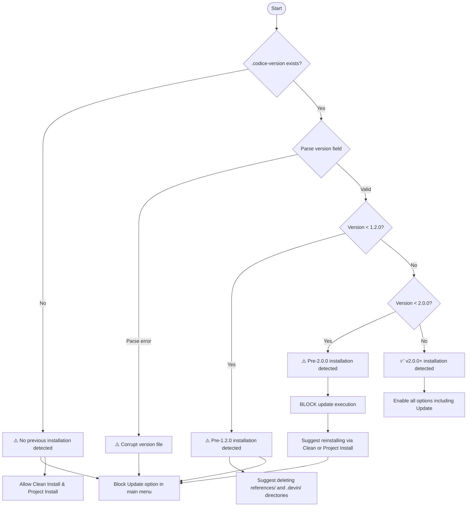
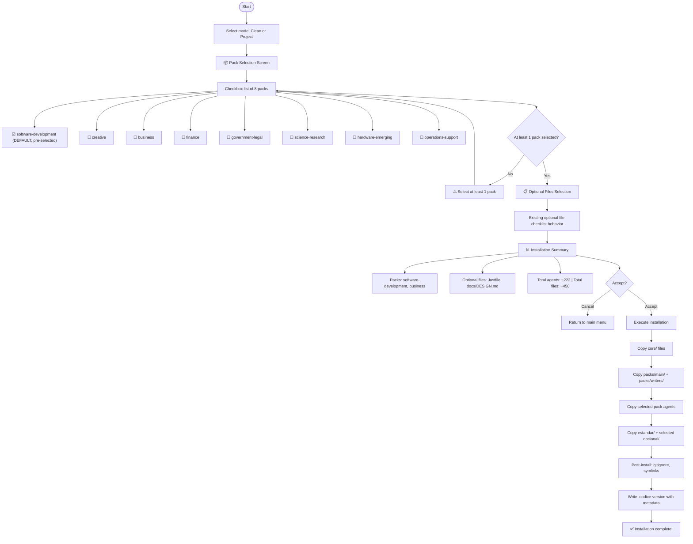
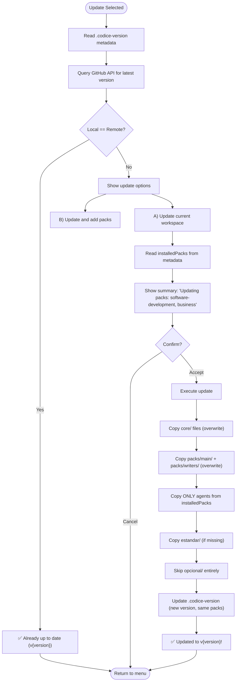
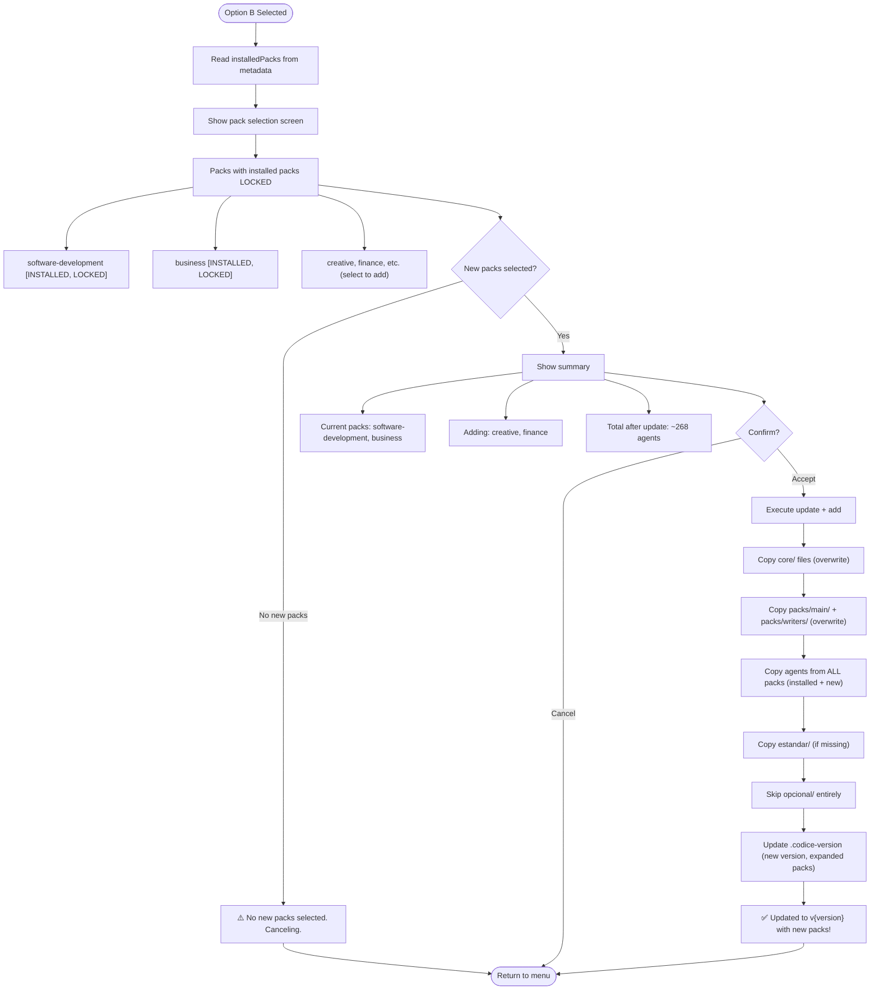

# Spec: Installer UX v2.0

**Spec ID:** S6-UX-V2
**Status:** Draft
**Phase:** v2.0.0 — Installer UX with Pack Selection
**Depends on:** S5 (Agent Pack System), S2 (FileRules), S3 (CLI Commands)
**Author:** Fisherk2
**Date:** 2026-08-04
**Version:** 2.0.0

---

## 1. Objective

Extend the Códice installer UX to support the new agent pack system (S5-PACKS). The installer must guide users through pack selection during installation, enforce version-gated updates, and persist installed pack metadata for future update scoping.

### User Stories

- **US-UX1 (New User):** As a new user running Clean Install, I want to select which agent packs to install so that my workspace matches my domain.
- **US-UX2 (Existing User):** As an existing user running Project Install, I want the same pack selection experience so that I adopt the template with the right agents.
- **US-UX3 (Updater — Current Packs):** As a user on v2.0.0+, I want to update only my currently installed packs so that I don't get unexpected new agents.
- **US-UX4 (Updater — Add Packs):** As a user on v2.0.0+, I want to add new packs during update so that I expand my workspace without reinstalling.
- **US-UX5 (Legacy User):** As a user on v1.x, I want a clear message telling me I must reinstall so that I understand why update is blocked.

---

## 2. Version Detection

On startup, the installer checks for `.codice-version` in the destination directory.

### 2.1 Detection Logic



### 2.2 Version File Messages

| Condition | Message | Action |
|-----------|---------|--------|
| No `.codice-version` | "No previous Códice installation found. Update is not available — use Clean Install or Project Install." | Block Update in menu |
| Version < 1.2.0 | "Detected pre-1.2.0 installation. We recommend deleting `references/` and `.devin/` directories (remnants from older versions) before reinstalling." | Block Update, suggest cleanup |
| 1.2.0 ≤ Version < 2.0.0 | "Detected v1.x installation. The update system has changed in v2.0.0. Please reinstall using Clean Install or Project Install to adopt the new pack system." | Block Update, suggest reinstall |
| Version ≥ 2.0.0 | "Current installation: v{version}. Packs: {packList}" | Enable all options |

---

## 3. Install Wizard — Clean Install & Project Install

Both Clean Install and Project Install share the same pack selection flow. The difference is in file merge behavior (see §6).

### 3.1 Flow Diagram



### 3.2 Pack Selection Screen — TUI Specification

**@clack/prompts mapping:** `multiselect()` with `options` array generated from pack definitions. `software-development` has `selected: true` by default. Each option shows pack name + approximate agent count.

**Validation:** At least 1 pack must be selected. If user deselects all, show: `"⚠️ You must select at least one agent pack."` and re-display the prompt.

### 3.3 Installation Summary Screen

Displayed before execution. Shows: selected packs with agent counts, mandatory directories (main + writers), selected optional files, and total estimated agents + files. User confirms or cancels (returns to main menu).

**@clack/prompts mapping:** `note()` for summary display + `confirm()` for accept/cancel.

---

## 4. Updater — Update Workspace

### 4.1 Pre-Check

Before any update logic runs, the installer validates the `.codice-version` file:

| Condition | Behavior |
|-----------|----------|
| No `.codice-version` | **CANCEL.** Message: "No previous installation found. Use Clean Install or Project Install instead." Return to main menu. |
| Version < 2.0.0 | **CANCEL.** Message: "Update requires v2.0.0+. Your version: {v}. Please reinstall using Clean Install or Project Install." Return to main menu. |
| Corrupt/unparseable | **CANCEL.** Message: "Could not read installation metadata. Please reinstall." Return to main menu. |
| Version ≥ 2.0.0 | **PROCEED.** Read `installedPacks` from metadata. |

### 4.2 Update Flow — Option A: Update Current Workspace



### 4.3 Update Flow — Option B: Update and Add Packs



### 4.4 Update Option Selection Screen

**@clack/prompts mapping:** `select()` with 3 options: A (update current), B (update + add packs), Cancel. Shows current version, available version, and installed packs list.

---

## 5. `.codice-version` Metadata Format

### 5.1 v2.0.0 Format

Extend the current format to include installed packs:

```json
{
  "version": "2.0.0",
  "installedPacks": ["software-development", "business"],
  "installedAt": "2026-08-04T12:00:00Z"
}
```

### 5.2 Field Definitions

| Field | Type | Required | Description |
|-------|------|----------|-------------|
| `version` | `string` | ✅ | Semantic version of the installed Códice package |
| `installedPacks` | `string[]` | ✅ | Array of pack IDs that were installed. Always includes implicit `main` and `writers` (not listed). |
| `installedAt` | `string` | ✅ | ISO 8601 timestamp of installation |

### 5.3 Migration from v1.x

| Source Format | Migration |
|---------------|-----------|
| v1.x `.codice-version` (no `installedPacks`) | Treated as "unknown packs" — update blocked, must reinstall |
| No `.codice-version` | Treated as "no installation" — update blocked |
| Corrupt JSON | Treated as "corrupt" — update blocked, must reinstall |

### 5.4 Implicit Packs

The `installedPacks` array does NOT include `main` and `writers` because they are mandatory and always present. The installer implicitly includes them during update operations.

---

## 6. Merge Behavior

### 6.1 File Copy Rules by Directory

| Directory | Clean Install | Project Install | Update (Option A) | Update (Option B) |
|-----------|--------------|-----------------|-------------------|-------------------|
| `core/` | Copy + overwrite | Obligatorio rules | Copy + overwrite | Copy + overwrite |
| `packs/main/` | Copy + overwrite | Copy + overwrite | Copy + overwrite | Copy + overwrite |
| `packs/writers/` | Copy + overwrite | Copy + overwrite | Copy + overwrite | Copy + overwrite |
| `packs/<selected>/` | Copy all agents | Copy all agents | **Skip** (not in installedPacks) | Copy all agents |
| `packs/<not-selected>/` | **Skip** | **Skip** | **Skip** | **Skip** |
| `estandar/` | Copy + overwrite | Copy if missing | Copy if missing | Copy if missing |
| `opcional/` | Copy + overwrite | Copy if selected + missing | **Skip entirely** | **Skip entirely** |

### 6.2 Pack Resolution

When copying from a selected pack, the installer:
1. Reads all `.md` files from `template/obligatorio/packs/<pack-id>/`
2. Copies each file to `agents/<filename>` in the destination
3. Preserves the flat `agents/` directory structure in the destination (packs are an installer concept, not a runtime concept)

---

## 7. CLI Flag Extensions

### 7.1 New Flags

| Flag | Description | Default |
|------|-------------|---------|
| `--packs <pack1,pack2>` | Comma-separated list of packs to install (non-interactive) | `software-development` |
| `--packs-all` | Install all packs (non-interactive) | `false` |
| `--update-add-packs <pack1,pack2>` | Add packs during update (non-interactive) | none |

### 7.2 Flag Examples

```bash
bunx codice --clean --force --packs software-development,business  # Specific packs
bunx codice --clean --force --packs-all                            # All packs
bunx codice --update --force --update-add-packs creative,finance   # Update + add packs
```

---

## 8. Boundaries

### Always

- **Persist pack metadata.** Every successful installation writes `.codice-version` with the `installedPacks` array.
- **Validate version before update.** Never execute update logic without confirming `.codice-version` exists and version ≥ 2.0.0.
- **Enforce minimum 1 pack.** Pack selection requires at least 1 pack selected.
- **Lock installed packs during Option B.** Previously installed packs cannot be deselected.

### Ask First

- **Proceeding with Clean Install on non-empty directory.** Same as v1.x — warn about overwrites.
- **Adding packs that significantly increase agent count.** If adding >50 agents, show a note: "This will add ~N agents to your workspace."

### Never

- **Never allow deselecting mandatory packs.** `main/` and `writers/` are always installed.
- **Never execute update on v1.x installations.** The metadata format is incompatible.
- **Never remove agents during update.** Update only adds/overwrites; it never deletes agents from the destination.
- **Never modify `.codice-version` unless installation succeeds.** Write only after all file operations complete.

---

## 9. Success Criteria

| ID | Criterion | Test Method |
|----|-----------|-------------|
| SC-UX1 | Pack selection screen displays 8 packs with software-development pre-selected | E2E test |
| SC-UX2 | At least 1 pack must be selected; validation prevents proceeding with 0 | Unit test |
| SC-UX3 | Installation summary shows selected packs + optional files before execution | E2E test |
| SC-UX4 | `.codice-version` contains `version`, `installedPacks`, `installedAt` after install | Integration test |
| SC-UX5 | Update blocked when `.codice-version` missing or version < 2.0.0 | E2E test |
| SC-UX6 | Option A updates only agents from installedPacks | E2E test with pre-seeded destination |
| SC-UX7 | Option B shows locked packs + selectable new packs | E2E test |
| SC-UX8 | Option B with no new packs selected cancels and returns to menu | Unit test |
| SC-UX9 | `--packs` flag works in non-interactive mode | E2E test |
| SC-UX10 | Agents are copied to flat `agents/` directory (not pack subdirectories) | E2E test |
| SC-UX11 | Legacy v1.x users see clear reinstall message | E2E test |
| SC-UX12 | Pre-1.2.0 users see cleanup suggestion for references/ and .devin/ | E2E test |

---

## 10. Open Questions

1. **Pack removal:** Once a pack is installed, there is no mechanism to remove it. User must reinstall. Is this acceptable for v2.0.0? (Planned for v2.2.0 — see TECH_DEBT.md)
2. **Pack updates detection:** When a pack's agents change between versions, should the updater show a diff? Deferred to v2.1.0.
3. **Non-interactive pack validation:** Should `--packs invalid-pack` fail with exit code 2? Yes, consistent with other flag validation.
4. **Pack count in summary:** Should the summary show exact agent count or approximate? Approximate (`~N`) is sufficient for v2.0.0.

---

## 11. Related Specifications

- [spec-agent-packs.md](./spec-agent-packs.md) — Agent Pack System (pack definitions and classification)
- [spec-file-rules.md](./spec-file-rules.md) — File classification system
- [spec-cli-commands.md](./spec-cli-commands.md) — CLI commands and installation modes
- [ADR-015](./adr/adr-015-installer-ux-v2.md) — Installer UX v2 decision record

---

## 12. Changelog

| Version | Date | Changes |
|---------|------|---------|
| 2.0.0 | 2026-08-04 | Initial specification. Pack selection wizard, version-gated updates, metadata format, merge behavior, CLI flags. |

---

*End of Spec: Installer UX v2.0*
