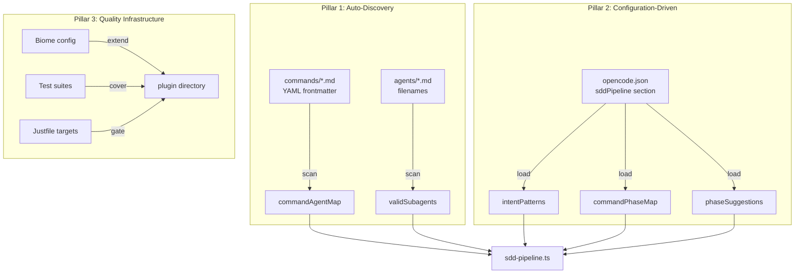
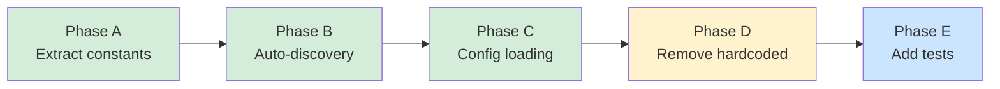
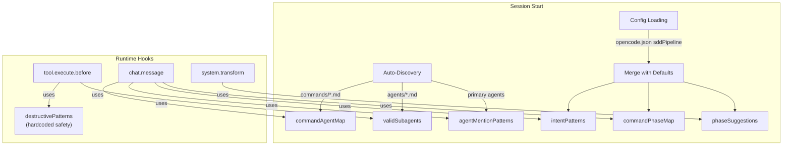

# Spec: SDD Plugin Decoupling & Quality Infrastructure

**Spec ID:** S5-PLUGIN  
**Status:** Draft  
**Phase:** FEV-13 (v1.2.0)  
**Depends on:** S3 (CLI Commands), S2 (Domain)  
**Author:** Fisherk2  
**Date:** 2026-07-29  
**Version:** 1.0.0  
**Issues:** [#53](https://github.com/fisherk2/codice-opencode/issues/53) (moved from v1.3.0 to v1.2.0)

---

## 1. Overview

This specification defines the decoupling of the SDD pipeline plugin (`sdd-pipeline.ts`, 665 lines) from hardcoded command/agent/skill catalogs, and establishes a quality infrastructure (linting, formatting, testing) for the plugin directory.

The plugin is an OpenCode plugin loaded automatically for every Códice workspace user. It manages the Spec-Driven Development pipeline: detecting user intent, mapping commands to agents, enforcing destructive-command guards, and validating subagent names.

### 1.1 Design Principles

| Principle | Description |
|-----------|-------------|
| **Auto-Discovery** | Structural data (command→agent map, valid subagent set) is derived from the filesystem at session start, not hardcoded. |
| **Configuration-Driven** | Behavioral data (intent patterns, phase suggestions, phase mappings) lives in `opencode.json`, editable without touching plugin code. |
| **Backward Compatible** | Hardcoded defaults serve as fallback when auto-discovery sources are absent. |
| **Quality Parity** | The plugin is linted, formatted, and tested with the same rigor as `src/`. |

---

## 2. Problem Statement

### 2.1 Coupling Problem

The plugin contains **6 hardcoded coupling points** that require editing the plugin source whenever a user adds a new command, agent, or skill:

| # | Constant | Lines | Entries | Coupling |
|---|----------|-------|---------|----------|
| 1 | `COMMAND_AGENT_MAP` | 43–56 | 12 | Adding a command requires editing this map |
| 2 | `VALID_SUBAGENTS` | 253–298 | 104 | Adding a subagent requires editing this set |
| 3 | `INTENT_PATTERNS` | 62–135 | 12 | Adding a command requires adding keywords |
| 4 | `COMMAND_PHASE_MAP` | 232–245 | 12 | Adding a command requires editing this map |
| 5 | `PHASE_SUGGESTIONS` | 315–357 | 6×6 | Adding an agent/command requires editing |
| 6 | `AGENT_MENTION_PATTERNS` | 33–40 | 6 | Adding a primary agent requires editing |

**Impact:** Users who add custom commands or agents (a documented workflow in the Wiki) must edit a 665-line TypeScript plugin. This is error-prone and contradicts the project's user-facing documentation, which says "create `commands/my-command.md`" without mentioning the plugin update step.

### 2.2 Quality Gap

| Dimension | `src/` + `tests/` | `template/` plugins |
|-----------|-------------------|---------------------|
| Biome lint | ✅ Covered | ❌ Excluded (`!!**/template`) |
| Biome format | ✅ Enforced | ❌ Excluded |
| Unit tests | ✅ 596 tests | ❌ Zero |
| Integration tests | ✅ | ❌ Zero |
| E2E tests | ✅ 15 scenarios | ❌ Zero |
| `just check` gate | ✅ | ❌ Not included |

The plugin is loaded automatically for 100% of users. A bug in `DESTRUCTIVE_PATTERNS` or `VALID_SUBAGENTS` affects every session.

---

## 3. Proposed Solution — Three Pillars



### 3.1 Pillar 1: Auto-Discovery (Structural Data)

**What moves:** `COMMAND_AGENT_MAP` and `VALID_SUBAGENTS` are replaced by filesystem scans at session start.

**Why these two:** They map 1:1 to filesystem structure. `commands/*.md` files already declare their `agent:` in YAML frontmatter. `agents/*.md` filenames are the subagent identifiers.

### 3.2 Pillar 2: Configuration-Driven (Behavioral Data)

**What moves:** `INTENT_PATTERNS`, `COMMAND_PHASE_MAP`, and `PHASE_SUGGESTIONS` move to `opencode.json` under a `sddPipeline` key.

**Why not auto-discovered:** These are behavioral mappings, not structural. A command's intent keywords, SDD phase, and cross-agent suggestions cannot be inferred from the file's frontmatter — they require human editorial judgment.

**Why not hardcoded:** Users customize their SDD workflow. Editing a JSON config is safer than editing a 665-line TypeScript file.

### 3.3 Pillar 3: Quality Infrastructure

**What changes:** Extend Biome coverage, create test suites, add Justfile targets for the plugin directory.

---

## 4. Auto-Discovery Specification

### 4.1 Command→Agent Map Discovery

**Source:** `commands/*.md` YAML frontmatter.

**Algorithm:**

```typescript
function discoverCommandAgentMap(commandsDir: string): Record<string, string> {
  const map: Record<string, string> = {}
  if (!existsSync(commandsDir)) return FALLBACK_COMMAND_AGENT_MAP
  for (const file of readdirSync(commandsDir).filter(f => f.endsWith(".md"))) {
    const fm = parseYamlFrontmatter(readFileSync(join(commandsDir, file), "utf-8"))
    if (fm?.agent) map[`/${file.replace(".md", "")}`] = fm.agent
  }
  return Object.keys(map).length > 0 ? map : FALLBACK_COMMAND_AGENT_MAP
}
```

**Fallback:** If `commands/` doesn't exist or has no valid files, use the current hardcoded `COMMAND_AGENT_MAP` as `FALLBACK_COMMAND_AGENT_MAP`.

**Edge cases:** Missing `agent:` frontmatter → skipped with debug warning. Duplicate names → last file wins (alphabetical). Non-`.md` files → ignored.

### 4.2 Valid Subagent Set Discovery

**Source:** `agents/*.md` filenames (without extension).

**Algorithm:**

```typescript
function discoverValidSubagents(agentsDir: string): Set<string> {
  if (!existsSync(agentsDir)) return FALLBACK_VALID_SUBAGENTS
  const names = readdirSync(agentsDir).filter(f => f.endsWith(".md")).map(f => f.replace(".md", ""))
  const primary = ["huitzilopochtli", "quetzalcoatl", "moctezuma", "tlaloc", "mictlantecuhtli", "tezcatlipoca"]
  return new Set([...names, ...primary])
}
```

**Fallback:** If `agents/` doesn't exist, use the current hardcoded `VALID_SUBAGENTS`. Primary agents are always included even if their files are missing.

### 4.3 Agent Mention Patterns Discovery

**Source:** Derived from the discovered subagent set. Only primary agents have mention patterns.

**Algorithm:** For each primary agent in the discovered set, generate `[@agent\b, agente\s+agent]` regex patterns. Non-primary subagents are not mentioned directly in user messages.

---

## 5. Configuration Specification

### 5.1 Schema

The `sddPipeline` section is optional and is NOT included in the default
`opencode.json`. Defaults live in the plugin's `src/defaults.ts` (Obligatorio
classification per OQ-1). Users who wish to customize behavioral settings
manually add this section to their `opencode.json`:

```json
{
  "sddPipeline": {
    "commandPhaseMap": {
      "/spec": "define", "/design": "define", "/evolve": "define",
      "/plan": "plan", "/build": "build", "/test": "verify",
      "/review": "review", "/ship": "ship", "/code-simplify": "review"
    },
    "intentPatterns": {
      "/spec": ["nueva feature", "requisito", "new feature", "requirement", "spec"],
      "/build": ["implementa", "codifica", "implement", "build", "code", "write code"]
    },
    "phaseSuggestions": {
      "idle": {},
      "define": {
        "moctezuma": "Consider /spec, /evolve, /design to define requirements.",
        "tlaloc": "Consider /spec, /evolve, /diagnosis to define requirements."
      },
      "plan": { "quetzalcoatl": "Consider /spec or /design first." },
      "build": {}, "verify": {}, "review": {}, "ship": {}
    }
  }
}
```

**Note:** The example shows a subset. The full default config includes all 12 commands in `commandPhaseMap` and all phase+agent combinations in `phaseSuggestions`.

### 5.2 Type Definition

```typescript
interface SddPipelineConfig {
  commandPhaseMap?: Record<string, string>
  intentPatterns?: Record<string, string[]>
  phaseSuggestions?: Record<string, Record<string, string>>
}
```

### 5.3 Loading and Merging

```typescript
function loadSddConfig(projectDir: string): SddPipelineConfig {
  const configPath = join(projectDir, "opencode.json")
  if (!existsSync(configPath)) return DEFAULT_SDD_CONFIG
  try {
    const raw = JSON.parse(readFileSync(configPath, "utf-8"))
    return raw.sddPipeline ?? DEFAULT_SDD_CONFIG
  } catch {
    console.debug("[sdd-pipeline] Could not parse opencode.json, using defaults")
    return DEFAULT_SDD_CONFIG
  }
}
```

**Merge strategy:** Config values override defaults per-key. Missing keys fall back to `DEFAULT_SDD_CONFIG` (the current hardcoded values extracted as constants).

### 5.4 Validation

On load, validate:
- `commandPhaseMap` values must be one of: `idle`, `define`, `plan`, `build`, `verify`, `review`, `ship`.
- `intentPatterns` keys must start with `/`.
- `phaseSuggestions` keys must be valid phase names.
- Invalid entries are logged as warnings and skipped (not fatal).

---

## 6. Plugin Quality Infrastructure

### 6.1 Biome Configuration

Extend `biome.json` to include the plugin directories:

```json
{
  "files": {
    "includes": [
      "**",
      "!!**/dist",
      "!!**/node_modules",
      "!!**/template/obligatorio/skills",
      "!!**/template/opcional/skills",
      "!!**/skills"
    ]
  }
}
```

**Change:** Remove `!!**/template` blanket exclusion. Instead, exclude only `template/obligatorio/skills/` and `template/opcional/skills/` (external skill code with their own test dependencies). This includes `template/obligatorio/.opencode/plugins/sdd-pipeline.ts` and `template/opcional/.opencode/plugins/` in lint and format checks.

### 6.2 Justfile Targets

Add dedicated targets for plugin quality:

```justfile
check-plugin:
    bunx @biomejs/biome check template/obligatorio/.opencode/plugins/ template/opcional/.opencode/plugins/

test-plugin-unit:
    bun test tests/plugin/unit/

test-plugin-integration:
    bun test tests/plugin/integration/

check-all:
    bunx @biomejs/biome ci src/ tests/ template/obligatorio/.opencode/plugins/ template/opcional/.opencode/plugins/ && bun run tsc --noEmit
```

Update existing `check` target to include plugin directories or create `check-all` as a superset.

### 6.3 Test Directory Structure

```
tests/plugin/
├── unit/
│   ├── normalizeBash.test.ts
│   ├── destructivePatterns.test.ts
│   ├── intentDetection.test.ts
│   ├── commandPhaseMapping.test.ts
│   ├── autoDiscovery.test.ts
│   └── configLoading.test.ts
├── integration/
│   ├── chatMessage.test.ts
│   ├── toolExecuteBefore.test.ts
│   └── systemTransform.test.ts
└── e2e/
    └── pluginInstallation.test.ts
```

---

## 7. Migration Plan

### 7.1 Phase A: Extract Constants (non-breaking)

1. Move all 6 hardcoded maps to a `DEFAULTS` object at the top of the file.
2. No behavioral change — plugin reads from `DEFAULTS` as before.
3. Add Biome coverage and fix any lint issues.

### 7.2 Phase B: Add Auto-Discovery (non-breaking)

1. Implement `discoverCommandAgentMap()` and `discoverValidSubagents()`.
2. Plugin uses discovered values when available, falls back to `DEFAULTS`.
3. Log discovery results in `console.debug` for troubleshooting.

### 7.3 Phase C: Add Configuration Loading (non-breaking)

1. Implement `loadSddConfig()` to read `sddPipeline` from `opencode.json`.
2. Merge config over `DEFAULTS` (config wins on conflict).
3. Add validation for config values.

### 7.4 Phase D: Remove Hardcoded Constants (cleanup)

1. After Phases B+C are validated, remove the inline `COMMAND_AGENT_MAP`, `VALID_SUBAGENTS`, `INTENT_PATTERNS`, `COMMAND_PHASE_MAP`, `PHASE_SUGGESTIONS`, and `AGENT_MENTION_PATTERNS` from the plugin body.
2. Move them to a separate `defaults.ts` module or keep as `DEFAULTS` object.
3. Plugin file shrinks from 665 lines to ~350 lines.

### 7.5 Phase E: Add Tests

1. Unit tests for pure functions (normalizeBash, auto-discovery, config loading).
2. Integration tests for hooks with mocked OpenCode context.
3. E2E test for plugin installation verification.



---

## 8. Testing Strategy

### 8.1 Unit Tests

| Test File | Coverage Target | Key Scenarios |
|-----------|----------------|---------------|
| `normalizeBash.test.ts` | 100% | Strip comments, collapse whitespace, handle empty input |
| `destructivePatterns.test.ts` | 100% | Each regex pattern matched + negative cases (safe commands) |
| `intentDetection.test.ts` | >90% | Keyword matching, word-boundary enforcement, false-positive prevention |
| `commandPhaseMapping.test.ts` | 100% | All 12 commands map correctly, unknown commands return `idle` |
| `autoDiscovery.test.ts` | >90% | Scan with valid files, empty directory, missing directory, malformed frontmatter |
| `configLoading.test.ts` | >90% | Valid config, missing file, invalid JSON, partial config, validation failures |

### 8.2 Integration Tests

| Test File | Coverage Target | Key Scenarios |
|-----------|----------------|---------------|
| `chatMessage.test.ts` | >80% | Agent mention detection, command detection with boundary check, intent keyword detection |
| `toolExecuteBefore.test.ts` | >80% | Destructive command blocking, subagent validation, safe command passthrough |
| `systemTransform.test.ts` | >70% | SDD context injection, phase suggestion injection, intent suggestion injection |

### 8.3 E2E Tests

| Scenario | Method |
|----------|--------|
| Plugin file exists after clean install | Assert `template/obligatorio/.opencode/plugins/sdd-pipeline.ts` in destination |
| Plugin passes Biome lint | Run `bunx @biomejs/biome check` on plugin directory |
| Audit log created on first session | Assert `.opencode/plugins/.sdd-audit.log` exists after plugin load |

---

## 9. Boundaries

### 9.1 Always

- **Fallback to defaults** when auto-discovery sources are missing. Never crash because `commands/` or `agents/` doesn't exist.
- **Validate config on load.** Log warnings for invalid entries, skip them, continue with defaults.
- **Log discovery results** in `console.debug` so users can troubleshoot why a command or agent wasn't detected.
- **Preserve all safety guards.** `DESTRUCTIVE_PATTERNS` and subagent validation remain in the plugin — they are not configurable.

### 9.2 Ask First

- **Changing `DESTRUCTIVE_PATTERNS`.** This is a safety boundary. Additions or removals require explicit justification and test coverage for each pattern.
- **Modifying the `sddPipeline` config schema.** Breaking changes to the config structure require a migration path for existing users.

### 9.3 Never

- **Execute code from discovered files.** Auto-discovery reads YAML frontmatter and filenames only. No `eval`, no `require`, no dynamic imports from `commands/` or `agents/`.
- **Silently ignore discovery failures.** If `commands/` exists but contains no valid `.md` files, log a warning — don't silently fall back.
- **Allow config to override safety.** `sddPipeline` config controls behavioral suggestions, not security guards. `DESTRUCTIVE_PATTERNS` and `VALID_SUBAGENTS` validation are not configurable.

---

## 10. Success Criteria

| ID | Criterion | Test Method |
|----|-----------|-------------|
| SC-1 | Adding a new command in `commands/` is detected by the plugin without editing `sdd-pipeline.ts` | Integration test: add temp command file, verify it appears in discovered map |
| SC-2 | Adding a new agent in `agents/` is accepted by `task()` validation without editing `sdd-pipeline.ts` | Integration test: add temp agent file, verify `task()` call passes validation |
| SC-3 | `INTENT_PATTERNS`, `COMMAND_PHASE_MAP`, `PHASE_SUGGESTIONS` are configurable via `opencode.json` without editing plugin code | Unit test: load custom config, verify merged values |
| SC-4 | Plugin passes `bunx @biomejs/biome check` with zero errors | `just check-plugin` exits 0 |
| SC-5 | Plugin has >80% test coverage across unit + integration suites | `bun test --coverage tests/plugin/` |
| SC-6 | Plugin file size reduced from 665 lines to <400 lines after Phase D | Line count verification |
| SC-7 | All existing functionality preserved — no regression in command detection, intent matching, destructive blocking, or subagent validation | Full test suite passes |
| SC-8 | Backward compatible — plugin works without `sddPipeline` config in `opencode.json` (uses defaults) | Integration test with no config |

---

## 11. Architecture Impact

### 11.1 New ADR

**ADR-013: SDD Plugin Auto-Discovery & Configuration** — Document the decision to move from hardcoded catalogs to filesystem auto-discovery + JSON configuration. Cover the three-pillar approach, fallback strategy, and safety boundary rationale.

### 11.2 Affected Files

| File | Change |
|------|--------|
| `template/obligatorio/.opencode/plugins/sdd-pipeline.ts` | Refactor: extract defaults, add auto-discovery, add config loading |
| `template/obligatorio/opencode.json` | Add `sddPipeline` configuration section |
| `biome.json` | Remove `!!**/template` exclusion, add specific skill exclusions |
| `Justfile` | Add `check-plugin`, `test-plugin-unit`, `test-plugin-integration`, `check-all` targets |
| `tests/plugin/unit/*.test.ts` | New: unit tests for pure functions |
| `tests/plugin/integration/*.test.ts` | New: integration tests for hooks |
| `tests/plugin/e2e/*.test.ts` | New: E2E tests for plugin installation |
| `specs/adr/adr-013-plugin-auto-discovery.md` | New: ADR documenting the decision |
| `docs/TECH_DEBT.md` | Update: mark plugin coupling as resolved |

### 11.3 Plugin Architecture After Refactor



---

## 12. Open Questions

| # | Question | Impact | Proposed Default |
|---|----------|--------|------------------|
| OQ-1 | Should `sddPipeline` config be classified as Obligatorio or Estándar in the file rules? If Obligatorio, updates overwrite user customizations. If Estándar, users miss new defaults. | Config delivery strategy | **Obligatorio** — the config contains behavioral defaults that should stay in sync with plugin updates. Users who customize should do so after installation (Estándar behavior applies to their modified copy). |
| OQ-2 | Should auto-discovery cache results or scan on every session start? | Startup performance | **Scan on every start** — the directories are small (<200 files), `readdirSync` is <5ms. Caching adds complexity for negligible gain. |
| OQ-3 | Should the plugin emit a warning when a command exists in `commands/` but has no entry in `commandPhaseMap` config? | UX for new commands | **Yes, `console.debug`** — helps users notice their new command defaults to `idle` phase. |
| OQ-4 | Should `DESTRUCTIVE_PATTERNS` eventually move to config? | Safety vs flexibility | **No** — this is a safety boundary, not behavioral. Keep hardcoded. If users need to allow specific commands, they should adjust `opencode.json` `permission.bash` rules instead. |

---

## 13. Related Specifications

- [Spec: File Classification Rules](./spec-file-rules.md) — Determines how plugin files are delivered
- [Spec: CLI Commands & Installation Modes](./spec-cli-commands.md) — Command structure and frontmatter format
- [SPEC.md](../SPEC.md) — Central specification, Resolved Decision #9 (post-install generation)
- [docs/diagnosis/fix06-v1.2-phase3-documentation.md](../docs/diagnosis/fix06-v1.2-phase3-documentation.md) — FEV-13 diagnosis

---

## 14. Change Log

| Version | Date | Changes |
|---------|------|---------|
| 1.0.0 | 2026-07-29 | Initial specification. Three-pillar approach: auto-discovery, configuration-driven, quality infrastructure. Migration plan, testing strategy, and architecture impact. |

---

*End of Spec: SDD Plugin Decoupling & Quality Infrastructure*
