# Implementation Plan: FEV-20 — Plugin VALID_SUBAGENTS Removal (v2.0 Phase 4)

**Phase:** FEV-20 (v2.0 Phase 4) — 🔲 Planificado
**Scope:** Eliminar `VALID_SUBAGENTS` Set hardcoded (~110 entries) de `validSubagents.ts`; mantener `PRIMARY_AGENTS` (6 primarios) como única fuente de verdad hardcoded. Cambiar el fallback en `sdd-pipeline.ts` de `DEFAULTS.VALID_SUBAGENTS` a `new Set(PRIMARY_AGENTS)`. Actualizar mensajes de error de "VALID_SUBAGENTS catalog" a "agents/ directory". Hacer que `discoverValidSubagents()` escanee recursivamente subdirectorios del `agents/` del usuario (forward-compatible con la estructura `packs/`). Actualizar tests + Wiki `SDD-Pipeline.md` (TD-V2-5).
**Spec:** [specs/spec-agent-packs.md §5](../specs/spec-agent-packs.md), [ADR-014](../specs/adr/adr-014-agent-pack-system.md)
**Tech Debt:** TD-V2-1, TD-V2-5
**Date:** 2026-08-05
**Author:** Moctezuma (Strategic Planner)
**Branch:** `feat/new-agents` (continúa de FEV-19 ✅; usuario confirmó NO crear branch nueva)
**Methodology:** Per-file vertical slicing (1 commit por archivo de plugin modificado = 5 commits atómicos en Phases 1-3) + docs (1 commit) + verification gate + final docs (1 commit). **Total: 6-7 commits atómicos** (matching FEV-19 pattern).
**Wall-clock estimate:** ~3h (matching WORKFLOW.md §FEV-20 estimate)

---

## Overview

FEV-20 completa la simplificación de gobernanza iniciada por el pack system (FEV-17/18) y consolidada por FEV-19. Hoy, `validSubagents.ts` contiene un Set hardcoded de **~110 nombres de subagentes** (`VALID_SUBAGENTS`) que debe actualizarse **manualmente cada vez que se añade un subagente**. Esto contradice directamente el principio de auto-discovery (ADR-013) y crea un cuello de botella de mantenimiento.

Con FEV-20:

- **`PRIMARY_AGENTS`** (6 primarios: huitzilopochtli, quetzalcoatl, moctezuma, tlaloc, mictlantecuhtli, tezcatlipoca) sigue siendo **hardcoded** porque es la identidad del plugin — el set de agentes integrados que el sistema reconoce sin necesidad de archivos.
- **`VALID_SUBAGENTS`** desaparece. En su lugar, `sdd-pipeline.ts` deriva el conjunto de subagentes válidos de **una sola fuente**: el filesystem del usuario (`agents/`) + `PRIMARY_AGENTS` como fallback.
- **`discoverValidSubagents()`** se vuelve **recursivo** para escanear subdirectorios del `agents/` (forward-compatible con estructuras `packs/<name>/` si el destino alguna vez las tiene).
- **Mensajes de error** cambian de "VALID_SUBAGENTS catalog" a "agents/ directory" (más preciso para el modelo mental del usuario).

**Por qué importa:** FEV-20 es la última piedra angular de la simplificación de gobernanza. Sin él, añadir un nuevo subagente todavía requiere (1) crear el archivo `.md` Y (2) editar `validSubagents.ts` para registrarlo — un paso redundante que crea drift. Con FEV-20, los pasos son solo (1) crear el archivo `.md`. Cero edición de código del plugin.

**Lo que FEV-20 NO hace** (delimitado a FEV-21+):
- ❌ UI de selección de packs en installer (FEV-21)
- ❌ Updater con pack scoping (FEV-22)
- ❌ Tests E2E para pack selection (FEV-23)
- ❌ Wiki `Agents.md` ya actualizado en FEV-19 (no requiere cambios; el cambio de error message se refleja en `SDD-Pipeline.md`)

---

## Architecture Decisions

| # | Decision | Rationale |
|---|----------|-----------|
| **1** | **Mantener `PRIMARY_AGENTS` hardcoded, eliminar `VALID_SUBAGENTS`** | `PRIMARY_AGENTS` es la identidad del plugin (6 agentes integrados que existen sin archivos). `VALID_SUBAGENTS` es solo una cache de archivos del filesystem — derivable. Single source of truth: el filesystem para subagentes, la constante para primarios. |
| **2** | **Reemplazar `DEFAULTS.VALID_SUBAGENTS` con `new Set(PRIMARY_AGENTS)`** | Cumple literal con ADR-014 línea 70 y spec-agent-packs.md §5 fila 192. Mínimo cambio, máxima claridad. Cuando el `agents/` no existe, solo los 6 primarios son válidos (cualquier otro `task()` falla con mensaje útil). |
| **3** | **`discoverValidSubagents()` recursivo en subdirectorios** | Decisión usuario 2026-08-05 vía question tool. Cumple SC-P8 (spec-agent-packs.md). Forward-compatible si destino tiene `packs/<name>/` en el futuro. Costo: 1 helper adicional (`scanMarkdownFilesRecursive`) + 2 tests. Beneficio: el plugin está listo para cualquier estructura de subagentes. |
| **4** | **Mensaje de error: "agents/ directory" en lugar de "VALID_SUBAGENTS catalog"** | El usuario ve la palabra "catalog" y busca en el código fuente. La realidad es que debe crear un archivo `.md` en `agents/`. El nuevo mensaje apunta a la acción correcta. Coincide con ADR-014 línea 71. |
| **5** | **Per-file vertical slicing (6 commits atómicos)** | Consistente con FEV-19. Cada commit toca 1 archivo. Mejor rollback: si `autoDiscovery.ts` rompe tests, se revierte solo ese commit. Historia clara para review. |
| **6** | **No tests grep automatizados** | Decisión usuario (heredada de FEV-19). Validación manual vía `just check` + `just test`. Trade-off: menos protección contra regresión pero más rápido. |
| **7** | **Wiki `SDD-Pipeline.md` actualizado, Wiki `Agents.md` ya en orden** | TD-V2-5 cubre SDD-Pipeline.md. Agents.md ya fue actualizado en FEV-19 (count 104→~355, file tree, permission model). La frase "VALID_SUBAGENTS catalog" en Agents.md (línea 122-125 sobre `task()` permissions) requiere verificación — si existe, reemplazar. |
| **8** | **Wiki `rsync` NO incluido en FEV-20** | Decisión heredada de FEV-19: el sync al Wiki público se hace en FEV-23 / v2.0.0 release. Solo se actualiza el source `docs/wiki-source/`. |
| **9** | **No crear nueva branch** | Usuario confirmó en FEV-19: usar `feat/new-agents` actual. FEV-20 se acumula en la misma rama. |
| **10** | **No version bump** | v2.0.0 coordina al final con FEV-21 a FEV-23. |
| **11** | **Total: ~3h wall-clock** | 1h Phase 1 (plugin core: 3 archivos) + 0.5h Phase 2 (recursivo) + 0.5h Phase 3 (tests) + 0.5h Phase 4 (docs) + 0.25h Phase 5 (verify) + 0.25h Phase 6 (final docs) = 3h. |

---

## Patterns Applied (Design Decision Documentation)

| Pattern | Where | Why |
|---------|-------|-----|
| **Single Source of Truth (SSOT)** | `PRIMARY_AGENTS` is the only hardcoded list. `VALID_SUBAGENTS` (110 entries) is replaced by `new Set(PRIMARY_AGENTS)`. The filesystem is the SSOT for subagents. | Eliminates drift between catalog and filesystem. Adding a new agent requires zero code changes. |
| **Encapsulate What Varies** | The variation (new agents) is encapsulated in the filesystem (`agents/*.md`). The invariant (6 primary agents) is in the plugin. | Changes to subagent catalog don't ripple through code. Plugin is closed for modification but open for extension. |
| **Repository Pattern** (informal) | `discoverValidSubagents()` acts as a read-only repository of valid agent names. It abstracts the source (filesystem) from the consumer (`sdd-pipeline.ts`). | Consumer doesn't need to know how agents are stored — only that the Set contains valid names. |
| **Composite Pattern** | The recursive directory scan treats the file tree as a composite of files and subdirectories. `scanMarkdownFilesRecursive(dir)` is a tree walker over a Composite of `Dirent` nodes. | Uniform handling of flat (`agents/foo.md`) and nested (`agents/legacy/foo.md`) structures. |
| **Open-Closed Principle** | Plugin is open for extension (add agents via filesystem) but closed for modification (no code edit needed for new subagents). | Aligns with ADR-013's "Pillar 1: Auto-discovery" principle. |
| **Null Object / Default Strategy** | `new Set(PRIMARY_AGENTS)` is the null-safe default when no `agents/` directory exists. The plugin never crashes — it always has a valid Set to check against. | Defensive design: missing filesystem ≠ undefined behavior. |
| **Lazy Load** (existing, reinforced) | `discoverValidSubagents()` is called inside the plugin's `async (ctx) => {}` factory, not at module load. The catalog is computed at session start from current filesystem state. | Always reflects the latest workspace state without restart. |
| **Dependency Inversion** (existing) | `sdd-pipeline.ts` depends on the abstraction `discoverValidSubagents()` (a function), not on the hardcoded `VALID_SUBAGENTS` constant directly. The fallback is explicit (`?? new Set(PRIMARY_AGENTS)`). | Plugin doesn't import infrastructure (filesystem) — it imports a discovery adapter. |

---

## Pre-Audit Snapshot (2026-08-05)

### Current `VALID_SUBAGENTS` references (grep audit)

| File | Line(s) | Reference | Action |
|------|:-------:|-----------|--------|
| `template/obligatorio/core/.opencode/plugins/src/validSubagents.ts` | 30-143 | `export const VALID_SUBAGENTS: ReadonlySet<string> = new Set([...PRIMARY_AGENTS, "backend-developer", ...])` (~110 entries) | **DELETE entire Set** |
| `template/obligatorio/core/.opencode/plugins/src/defaults.ts` | 15 | `import { PRIMARY_AGENTS, VALID_SUBAGENTS } from "./validSubagents";` | **Remove VALID_SUBAGENTS from import** |
| `template/obligatorio/core/.opencode/plugins/src/defaults.ts` | 19 | `export { PRIMARY_AGENTS, VALID_SUBAGENTS } from "./validSubagents";` | **Remove VALID_SUBAGENTS from re-export** |
| `template/obligatorio/core/.opencode/plugins/src/defaults.ts` | 146 | `VALID_SUBAGENTS: typeof VALID_SUBAGENTS;` (in `DEFAULTS` type) | **Remove field from DEFAULTS type** |
| `template/obligatorio/core/.opencode/plugins/src/defaults.ts` | 153 | `VALID_SUBAGENTS,` (in `DEFAULTS` object) | **Remove field from DEFAULTS object** |
| `template/obligatorio/core/.opencode/plugins/sdd-pipeline.ts` | 60 | `const validSubagents = discoveredValidSubagents.size > 0 ? discoveredValidSubagents : DEFAULTS.VALID_SUBAGENTS;` | **Change to `new Set(PRIMARY_AGENTS)`** (need to import PRIMARY_AGENTS) |
| `template/obligatorio/core/.opencode/plugins/sdd-pipeline.ts` | 334 | `throw new SddError(`Unknown subagent: "${subagentName}". Use an agent from the VALID_SUBAGENTS catalog.`);` | **Change message to "agents/ directory"** |
| `template/obligatorio/core/.opencode/plugins/src/__tests__/defaults.test.ts` | 10, 19-22, 71-74, 110-114 | Multiple assertions on `VALID_SUBAGENTS` and `DEFAULTS.VALID_SUBAGENTS` | **Remove or update assertions** |
| `template/obligatorio/core/.opencode/plugins/src/autoDiscovery.ts` | 86-91 | `discoverValidSubagents()` scans `agentsDir` flat (not recursive) | **Add recursive scan** (new `scanMarkdownFilesRecursive` helper) |
| `template/obligatorio/core/.opencode/plugins/src/__tests__/autoDiscovery.test.ts` | 178-245 | Tests for `discoverValidSubagents()` (flat scan only) | **Add 2 tests for nested subdirs** |
| `docs/wiki-source/SDD-Pipeline.md` | 5, 52-56, 139, 156 | Line 52: "(104 agents: 98 subagents + 6 primary)" — needs recount; line 56: "VALID_SUBAGENTS catalog" error message — update | **Update count, error message reference, and module size** |
| `docs/wiki-source/Agents.md` | 122-129 | Section "Subagent Delegation" mentions agent count | **Verify and update if "VALID_SUBAGENTS catalog" appears** |

### Current `VALID_SUBAGENTS` set size

| Category | Count |
|----------|:-----:|
| Primary agents (in `PRIMARY_AGENTS`) | 6 |
| Backend & APIs | 23 |
| Frontend & Mobile | 8 |
| Database & Data | 8 |
| DevOps & Infra | 12 |
| Security | 3 |
| Testing & QA | 9 |
| Debugging | 1 |
| AI / ML | 6 |
| DX & Tooling | 5 |
| Processes | 5 |
| Specialized Domains | 6 |
| Documentation & Research | 6 |
| Product & Business | 10 |
| **Total (current)** | **~108 subagents + 6 primaries = 114** |
| **Total (target after FEV-20)** | **6 (only PRIMARY_AGENTS)** |

> **Note:** Current `VALID_SUBAGENTS` has 114 entries total (6 primary + 108 subagents). After FEV-20, the hardcoded set is 6 entries. The 108 subagents are derived from the filesystem at runtime via `discoverValidSubagents()`.

### Current `agents/` directory in source template (count)

```
$ find template/obligatorio/packs -name "*.md" | wc -l
361
```

> **Note:** This counts source packs, not destination. After FEV-17 `destPath`, the destination is flat. The plugin scans the destination, not the source.

---

## Dependency Graph

```
FEV-19 ✅ (feat/new-agents branch base)
    ↓
Phase 1: Plugin Source (1h, sequential by file)
    ├── T1.1 validSubagents.ts (delete VALID_SUBAGENTS Set) → 1 commit
    ├── T1.2 defaults.ts (remove VALID_SUBAGENTS from imports/exports/DEFAULTS) → 1 commit
    └── T1.3 sdd-pipeline.ts (import PRIMARY_AGENTS, fallback, error message) → 1 commit
    ↓
Phase 2: Auto-Discovery Recursive Scan (0.5h)
    ├── T2.1 autoDiscovery.ts (add scanMarkdownFilesRecursive) → 1 commit (bundles code + tests)
    ↓
Phase 3: Test Updates (0.5h)
    └── T3.1 defaults.test.ts (remove VALID_SUBAGENTS assertions) → 1 commit
    ↓
Phase 4: Documentation (0.5h, gates Phase 5)
    ├── T4.1 docs/wiki-source/SDD-Pipeline.md (count, error msg, module size) → 1 commit
    └── T4.2 docs/wiki-source/Agents.md (verify + update if needed) → bundled in T4.1
    ↓
Phase 5: Verification (0.25h, gates Phase 6)
    └── T5.1 just check + just test + just test-e2e
    ↓
Phase 6: Final Docs (0.25h)
    └── T6.1 CHANGELOG.md + WORKFLOW.md + TECH_DEBT.md → 1 commit
    ↓
FEV-20 Complete → FEV-21 ready
```

**Critical path:** T1.1 → T1.2 → T1.3 → T2.1 → T3.1 → T4.1 → T5.1 → T6.1 (~3h total)
**Parallel opportunities:** T4.2 could be parallel with T4.1 but bundled for atomicity.
**Solo execution:** 1 día calendario (con review entre phases).

---

## Mermaid Dependency Diagram

```mermaid
graph TD
    F19[FEV-19 ✅<br/>feat/new-agents base] --> T11
    T11[T1.1 validSubagents.ts<br/>delete VALID_SUBAGENTS Set<br/>~15min]:::seq --> T12
    T12[T1.2 defaults.ts<br/>remove from imports/exports/DEFAULTS<br/>~20min]:::seq --> T13
    T13[T1.3 sdd-pipeline.ts<br/>import PRIMARY_AGENTS + fallback + error msg<br/>~25min]:::seq --> CP1
    CP1{Phase 1 Checkpoint<br/>3 plugin files updated}:::gate --> T21
    T21[T2.1 autoDiscovery.ts<br/>add scanMarkdownFilesRecursive<br/>+ 2 tests<br/>~30min]:::seq --> CP2
    CP2{Phase 2 Checkpoint<br/>recursive scan works}:::gate --> T31
    T31[T3.1 defaults.test.ts<br/>remove VALID_SUBAGENTS assertions<br/>~30min]:::seq --> CP3
    CP3{Phase 3 Checkpoint<br/>all tests pass}:::gate --> T41
    T41[T4.1 SDD-Pipeline.md<br/>+ verify Agents.md<br/>~30min]:::seq --> CP4
    CP4{Phase 4 Checkpoint<br/>docs updated}:::gate --> T51
    T51[T5.1 just check + test + e2e<br/>~15min]:::seq --> CP5
    CP5{Phase 5 Checkpoint<br/>0 errors, all pass}:::gate --> T61
    T61[T6.1 CHANGELOG + WORKFLOW + TD<br/>~15min]:::seq --> DONE
    DONE[FEV-20 Complete ✅<br/>FEV-21 ready]:::done

    classDef done fill:#51cf66,stroke:#2f9e44,color:#fff
    classDef gate fill:#ffd43b,stroke:#f59f00,color:#000
    classDef seq fill:#e7e7e7,stroke:#666,color:#000
```



---

## File-by-File Change Matrix

| File | Phase | Change Type | Lines Affected | Commit |
|------|:-----:|-------------|:--------------:|--------|
| `template/obligatorio/core/.opencode/plugins/src/validSubagents.ts` | 1 | Delete Set | -114 lines | T1.1 |
| `template/obligatorio/core/.opencode/plugins/src/defaults.ts` | 1 | Remove imports/exports/DEFAULTS field | -4 lines | T1.2 |
| `template/obligatorio/core/.opencode/plugins/sdd-pipeline.ts` | 1 | Import + fallback + error msg | -3 / +3 lines | T1.3 |
| `template/obligatorio/core/.opencode/plugins/src/autoDiscovery.ts` | 2 | Add recursive helper | +18 lines | T2.1 |
| `template/obligatorio/core/.opencode/plugins/src/__tests__/autoDiscovery.test.ts` | 2 | Add 2 tests for nested subdirs | +40 lines | T2.1 (bundled) |
| `template/obligatorio/core/.opencode/plugins/src/__tests__/defaults.test.ts` | 3 | Remove/update assertions | -12 lines | T3.1 |
| `docs/wiki-source/SDD-Pipeline.md` | 4 | Update count, error msg, module size | ~5 lines | T4.1 |
| `docs/wiki-source/Agents.md` | 4 | Verify (no changes expected) | 0 lines | T4.1 (bundled) |
| `CHANGELOG.md` | 6 | Add FEV-20 entry | +~20 lines | T6.1 |
| `docs/WORKFLOW.md` | 6 | Mark FEV-20 complete | ~10 lines | T6.1 |
| `docs/TECH_DEBT.md` | 6 | Close TD-V2-1, TD-V2-5 | +~10 lines | T6.1 |

**Total:** 10 files modified (8 plugin/template + 2 docs), 6 atomic commits
**Net lines:** -119 (T1.1+T1.2+T1.3+T3.1) +78 (T2.1+T4.1+T6.1) = **-41 lines net**

---

## Task List

### Phase 1: Plugin Source Code Changes (~1h, sequential, 3 commits)

> **Vertical slicing per file.** Cada commit toca 1 archivo de plugin. Pattern: 1) remove `VALID_SUBAGENTS` references, 2) preserve `PRIMARY_AGENTS` invariant, 3) update fallback/error message, 4) commit.

#### Task 1.1: Delete `VALID_SUBAGENTS` Set from `validSubagents.ts`

**Description:** En `template/obligatorio/core/.opencode/plugins/src/validSubagents.ts`, eliminar completamente la constante `VALID_SUBAGENTS` (líneas 23-143). Mantener `PRIMARY_AGENTS` (líneas 9-21) intacto. Actualizar el comentario del header (líneas 1-7) para reflejar el nuevo modelo: `PRIMARY_AGENTS` es la única lista hardcoded; los subagentes se derivan del filesystem en runtime vía `discoverValidSubagents()`.

**Current state (líneas 23-143, ~114 entries):**

```typescript
/**
 * Valid subagent names for task() validation.
 *
 * Set of all known agents (subagents + 6 primary agents).
 * Used to validate task() calls at runtime — rejects invented or
 * misspelled subagent names before they reach the agent runtime.
 */
export const VALID_SUBAGENTS: ReadonlySet<string> = new Set([
	...PRIMARY_AGENTS,
	"backend-developer",
	"typescript-pro",
	// ... ~108 more entries
]);
```

**Target state:**

```typescript
// ---------------------------------------------------------------------------
// PRIMARY_AGENTS — Canonical list of the 6 primary agent names
//
// These are the 6 agents that are always valid for task() validation,
// even when no corresponding `.md` file exists in the user's `agents/`
// directory. They form the invariant identity of the SDD pipeline.
//
// Subagents are NOT hardcoded here — they are discovered at runtime by
// scanning the user's `agents/` directory (recursively) via
// `discoverValidSubagents()` in autoDiscovery.ts. This follows the
// Open-Closed Principle: the plugin is closed for modification (no
// hardcoded catalog) but open for extension (add new agents by creating
// .md files in the user's agents/ directory).
//
// See: ADR-013 (Auto-Discovery), ADR-014 (Agent Pack System).
// ---------------------------------------------------------------------------
```

> **Keep:** `PRIMARY_AGENTS` array (líneas 9-21) — single source of truth for primary agent identity.
> **Delete:** `VALID_SUBAGENTS` Set (líneas 23-143) — replaced by filesystem scan + `new Set(PRIMARY_AGENTS)`.

**Acceptance criteria:**

- [ ] `VALID_SUBAGENTS` constant completely removed from `validSubagents.ts`
- [ ] `PRIMARY_AGENTS` constant preserved (6 entries: huitzilopochtli, quetzalcoatl, moctezuma, tlaloc, mictlantecuhtli, tezcatlipoca)
- [ ] Header comment (líneas 1-7) updated to reflect new model (referencing autoDiscovery + ADRs)
- [ ] File reduced from 143 lines to ~25 lines
- [ ] `grep -c "VALID_SUBAGENTS" template/obligatorio/core/.opencode/plugins/src/validSubagents.ts` = 0
- [ ] `grep -c "PRIMARY_AGENTS" template/obligatorio/core/.opencode/plugins/src/validSubagents.ts` = 1 (declaration)

**Verification:**

- [ ] `head -25 template/obligatorio/core/.opencode/plugins/src/validSubagents.ts` shows only `PRIMARY_AGENTS` declaration
- [ ] `tail -5 template/obligatorio/core/.opencode/plugins/src/validSubagents.ts` ends with `] as const;`
- [ ] `wc -l template/obligatorio/core/.opencode/plugins/src/validSubagents.ts` < 30
- [ ] `grep "backend-developer\|typescript-pro\|docker-expert" template/obligatorio/core/.opencode/plugins/src/validSubagents.ts` returns 0 (no more subagent names)

**Dependencies:** FEV-19 ✅
**Files likely touched:** `template/obligatorio/core/.opencode/plugins/src/validSubagents.ts` (-118 lines)
**Estimated scope:** S (1 archivo, 1 constant deleted)
**Commit:** `refactor(plugin): delete VALID_SUBAGENTS hardcoded catalog; rely on filesystem auto-discovery`

---

#### Task 1.2: Remove `VALID_SUBAGENTS` references from `defaults.ts`

**Description:** En `template/obligatorio/core/.opencode/plugins/src/defaults.ts`, eliminar todas las referencias a `VALID_SUBAGENTS`: (1) línea 15 (import), (2) línea 19 (re-export), (3) línea 146 (campo en type de `DEFAULTS`), (4) línea 153 (campo en objeto `DEFAULTS`). Mantener `PRIMARY_AGENTS` en todos esos lugares (sigue siendo necesario para `AGENT_MENTION_PATTERNS`).

**Current state (línea 15):**

```typescript
import { PRIMARY_AGENTS, VALID_SUBAGENTS } from "./validSubagents";
```

**Target state:**

```typescript
import { PRIMARY_AGENTS } from "./validSubagents";
```

**Current state (línea 19):**

```typescript
export { PRIMARY_AGENTS, VALID_SUBAGENTS } from "./validSubagents";
```

**Target state:**

```typescript
export { PRIMARY_AGENTS } from "./validSubagents";
```

**Current state (líneas 144-150, DEFAULTS type):**

```typescript
export const DEFAULTS: Readonly<{
	COMMAND_AGENT_MAP: typeof COMMAND_AGENT_MAP;
	VALID_SUBAGENTS: typeof VALID_SUBAGENTS;
	INTENT_PATTERNS: typeof INTENT_PATTERNS;
	COMMAND_PHASE_MAP: typeof COMMAND_PHASE_MAP;
	PHASE_SUGGESTIONS: typeof PHASE_SUGGESTIONS;
	AGENT_MENTION_PATTERNS: typeof AGENT_MENTION_PATTERNS;
}> = {
	COMMAND_AGENT_MAP,
	VALID_SUBAGENTS,
	INTENT_PATTERNS,
	COMMAND_PHASE_MAP,
	PHASE_SUGGESTIONS,
	AGENT_MENTION_PATTERNS,
} as const;
```

**Target state:**

```typescript
export const DEFAULTS: Readonly<{
	COMMAND_AGENT_MAP: typeof COMMAND_AGENT_MAP;
	INTENT_PATTERNS: typeof INTENT_PATTERNS;
	COMMAND_PHASE_MAP: typeof COMMAND_PHASE_MAP;
	PHASE_SUGGESTIONS: typeof PHASE_SUGGESTIONS;
	AGENT_MENTION_PATTERNS: typeof AGENT_MENTION_PATTERNS;
}> = {
	COMMAND_AGENT_MAP,
	INTENT_PATTERNS,
	COMMAND_PHASE_MAP,
	PHASE_SUGGESTIONS,
	AGENT_MENTION_PATTERNS,
} as const;
```

**Acceptance criteria:**

- [ ] Línea 15: `VALID_SUBAGENTS` removido del import (queda solo `PRIMARY_AGENTS`)
- [ ] Línea 19: `VALID_SUBAGENTS` removido del re-export
- [ ] `DEFAULTS` type (línea 144): campo `VALID_SUBAGENTS: typeof VALID_SUBAGENTS;` eliminado
- [ ] `DEFAULTS` object (línea 153): campo `VALID_SUBAGENTS,` eliminado
- [ ] `grep -c "VALID_SUBAGENTS" template/obligatorio/core/.opencode/plugins/src/defaults.ts` = 0
- [ ] `grep -c "PRIMARY_AGENTS" template/obligatorio/core/.opencode/plugins/src/defaults.ts` ≥ 1 (preserved)

**Verification:**

- [ ] `head -20 template/obligatorio/core/.opencode/plugins/src/defaults.ts | grep "import"` shows only `PRIMARY_AGENTS` from `./validSubagents`
- [ ] `grep "VALID_SUBAGENTS" template/obligatorio/core/.opencode/plugins/src/defaults.ts` returns 0
- [ ] `grep "AGENT_MENTION_PATTERNS" template/obligatorio/core/.opencode/plugins/src/defaults.ts` ≥ 2 (still functional)

**Dependencies:** Task 1.1
**Files likely touched:** `template/obligatorio/core/.opencode/plugins/src/defaults.ts` (-4 lines)
**Estimated scope:** XS (1 archivo, 4 líneas modificadas)
**Commit:** `refactor(plugin): remove VALID_SUBAGENTS from defaults.ts imports and DEFAULTS object`

---

#### Task 1.3: Update `sdd-pipeline.ts` fallback + error message

**Description:** En `template/obligatorio/core/.opencode/plugins/sdd-pipeline.ts`, hacer 3 cambios: (1) importar `PRIMARY_AGENTS` desde `./src/validSubagents`; (2) cambiar el fallback de `DEFAULTS.VALID_SUBAGENTS` a `new Set(PRIMARY_AGENTS)`; (3) actualizar el mensaje de error de "VALID_SUBAGENTS catalog" a "agents/ directory".

**Current state (líneas 4-11, imports):**

```typescript
import {
	discoverAgentMentionPatterns,
	discoverCommandAgentMap,
	discoverValidSubagents,
} from "./src/autoDiscovery";
import { loadSddConfig } from "./src/configLoader";
import { DEFAULTS, DESTRUCTIVE_PATTERNS } from "./src/defaults";
```

**Target state:**

```typescript
import {
	discoverAgentMentionPatterns,
	discoverCommandAgentMap,
	discoverValidSubagents,
} from "./src/autoDiscovery";
import { loadSddConfig } from "./src/configLoader";
import { DEFAULTS, DESTRUCTIVE_PATTERNS } from "./src/defaults";
import { PRIMARY_AGENTS } from "./src/validSubagents";
```

**Current state (líneas 59-60, fallback):**

```typescript
const validSubagents =
	discoveredValidSubagents.size > 0 ? discoveredValidSubagents : DEFAULTS.VALID_SUBAGENTS;
```

**Target state:**

```typescript
// [FEV-20] Fallback to PRIMARY_AGENTS (6 built-in agents) when no `agents/`
// directory exists. The user can delegate to any primary agent without
// needing a corresponding `.md` file. Subagents must be registered via
// filesystem (auto-discovery from `agents/`).
const validSubagents =
	discoveredValidSubagents.size > 0 ? discoveredValidSubagents : new Set(PRIMARY_AGENTS);
```

**Current state (líneas 331-336, error message):**

```typescript
if (subagentName && !validSubagents.has(subagentName)) {
	audit("tool.before", `BLOCKED task: unknown subagent "${subagentName}"`);
	throw new SddError(
		`Unknown subagent: "${subagentName}". Use an agent from the VALID_SUBAGENTS catalog.`,
	);
}
```

**Target state:**

```typescript
if (subagentName && !validSubagents.has(subagentName)) {
	audit("tool.before", `BLOCKED task: unknown subagent "${subagentName}"`);
	throw new SddError(
		`Unknown subagent: "${subagentName}". Create an .md file in the agents/ directory or use a primary agent.`,
	);
}
```

**Acceptance criteria:**

- [ ] `PRIMARY_AGENTS` importado de `./src/validSubagents` (nueva línea en bloque de imports)
- [ ] Fallback (línea 60): `DEFAULTS.VALID_SUBAGENTS` → `new Set(PRIMARY_AGENTS)`
- [ ] Error message (línea 334): "Use an agent from the VALID_SUBAGENTS catalog" → "Create an .md file in the agents/ directory or use a primary agent"
- [ ] `grep -c "VALID_SUBAGENTS" template/obligatorio/core/.opencode/plugins/sdd-pipeline.ts` = 0
- [ ] `grep "PRIMARY_AGENTS" template/obligatorio/core/.opencode/plugins/sdd-pipeline.ts` ≥ 1 (import)
- [ ] Comentario JSDoc-style explicando el fallback (mínimo 2 líneas)

**Verification:**

- [ ] `head -15 template/obligatorio/core/.opencode/plugins/sdd-pipeline.ts | grep "import"` shows new import line
- [ ] `grep -A 3 "Fallback to PRIMARY_AGENTS" template/obligatorio/core/.opencode/plugins/sdd-pipeline.ts` shows the new comment + fallback
- [ ] `grep "agents/ directory" template/obligatorio/core/.opencode/plugins/sdd-pipeline.ts` returns 1
- [ ] `grep "VALID_SUBAGENTS catalog" template/obligatorio/core/.opencode/plugins/sdd-pipeline.ts` returns 0
- [ ] Manual: TypeScript parses without errors (verified by `just check` in Phase 5)

**Dependencies:** Task 1.2
**Files likely touched:** `template/obligatorio/core/.opencode/plugins/sdd-pipeline.ts` (+3 / -3 lines)
**Estimated scope:** S (1 archivo, 3 cambios en 2 secciones)
**Commit:** `refactor(plugin): use PRIMARY_AGENTS as fallback and update error message`

---

#### Checkpoint: Phase 1 Complete (gates Phase 2)

- [ ] `validSubagents.ts` solo contiene `PRIMARY_AGENTS` (~25 lines)
- [ ] `defaults.ts` no menciona `VALID_SUBAGENTS`
- [ ] `sdd-pipeline.ts` importa `PRIMARY_AGENTS`, usa `new Set(PRIMARY_AGENTS)` como fallback, mensaje de error actualizado
- [ ] **Cero referencias a `VALID_SUBAGENTS` en código del plugin** (excepto posibles comentarios históricos en docs)
- [ ] **Review con humano antes de Phase 2** — verificar que el cambio no rompe tests existentes

---

### Phase 2: Auto-Discovery Recursive Scan (~0.5h, 1 commit)

#### Task 2.1: Add `scanMarkdownFilesRecursive()` helper + tests

**Description:** En `template/obligatorio/core/.opencode/plugins/src/autoDiscovery.ts`, añadir un nuevo helper `scanMarkdownFilesRecursive(dir)` que escanea archivos `.md` recursivamente en subdirectorios. Modificar `discoverValidSubagents()` para usar el helper recursivo. Añadir 2 tests en `autoDiscovery.test.ts` para validar el comportamiento con subdirectorios anidados.

**Current state (líneas 134-142, `scanMarkdownFiles`):**

```typescript
function scanMarkdownFiles(dir: string): string[] {
	if (!existsSync(dir)) {
		return [];
	}

	return readdirSync(dir, { withFileTypes: true })
		.filter((entry) => entry.isFile() && extname(entry.name).toLowerCase() === ".md")
		.map((entry) => basename(entry.name, ".md"));
}
```

**Target state (add recursive helper, keep flat for `discoverCommandAgentMap`):**

```typescript
/**
 * Scans a directory for markdown files and returns their base names (without `.md`).
 *
 * Non-recursive: only scans files in the top level of `dir`. Used by
 * {@link discoverCommandAgentMap} because commands are expected to be flat
 * (one command = one file at the top level of `commands/`).
 *
 * @param dir - Path to the directory to scan.
 * @returns Array of base names (e.g., `["spec", "build"]` for `spec.md`, `build.md`).
 */
function scanMarkdownFiles(dir: string): string[] {
	if (!existsSync(dir)) {
		return [];
	}

	return readdirSync(dir, { withFileTypes: true })
		.filter((entry) => entry.isFile() && extname(entry.name).toLowerCase() === ".md")
		.map((entry) => basename(entry.name, ".md"));
}

/**
 * Scans a directory recursively for markdown files and returns their base names.
 *
 * Recursive: walks subdirectories and collects all `.md` files. Used by
 * {@link discoverValidSubagents} to support nested agent organization
 * (e.g., `agents/packs/<pack-name>/<agent>.md` if the destination ever
 * adopts a pack-based layout).
 *
 * Returns **basename only** (e.g., `"foo"` for `agents/packs/software/foo.md`)
 * because agent names are flat identifiers — the directory hierarchy is just
 * organizational.
 *
 * Skips hidden directories (starting with `.`) to avoid `.git`, `.opencode`, etc.
 *
 * @param dir - Path to the directory to scan recursively.
 * @returns Array of base names of all `.md` files found recursively.
 */
function scanMarkdownFilesRecursive(dir: string): string[] {
	if (!existsSync(dir)) {
		return [];
	}

	const results: string[] = [];
	const entries = readdirSync(dir, { withFileTypes: true });

	for (const entry of entries) {
		// Skip hidden directories (e.g., .git, .opencode, .vscode)
		if (entry.isDirectory() && entry.name.startsWith(".")) {
			continue;
		}

		const fullPath = join(dir, entry.name);
		if (entry.isDirectory()) {
			results.push(...scanMarkdownFilesRecursive(fullPath));
		} else if (entry.isFile() && extname(entry.name).toLowerCase() === ".md") {
			results.push(basename(entry.name, ".md"));
		}
	}

	return results;
}
```

**Current state (líneas 85-91, `discoverValidSubagents`):**

```typescript
export function discoverValidSubagents(agentsDir: string): Set<string> {
	if (!existsSync(agentsDir)) {
		return new Set(); // Caller falls back to DEFAULTS.VALID_SUBAGENTS
	}
	const discovered = scanMarkdownFiles(agentsDir);
	return new Set([...discovered, ...PRIMARY_AGENTS]);
}
```

**Target state:**

```typescript
export function discoverValidSubagents(agentsDir: string): Set<string> {
	if (!existsSync(agentsDir)) {
		// Caller falls back to new Set(PRIMARY_AGENTS) — see sdd-pipeline.ts
		return new Set();
	}
	// [FEV-20] Recursive scan: discovers agents in subdirectories too
	// (e.g., agents/packs/software/foo.md → "foo").
	const discovered = scanMarkdownFilesRecursive(agentsDir);
	return new Set([...discovered, ...PRIMARY_AGENTS]);
}
```

**Update import (línea 13) — add `join` from "node:path":**

```typescript
import { existsSync, readdirSync, readFileSync } from "node:fs";
import { basename, extname, join } from "node:path";
```

**Add tests to `autoDiscovery.test.ts` (after line 244, before `describe("discoverAgentMentionPatterns()"`, line 247):**

```typescript
	// [FEV-20] Recursive scan tests
	test("11. Nested subdirectories are scanned recursively", () => {
		createTestFixture(agentsDir);
		// Top-level agent
		writeAgentFile(agentsDir, "top-level-agent.md");
		// Nested agent
		mkdirSync(join(agentsDir, "packs", "software-development"), { recursive: true });
		writeAgentFile(join(agentsDir, "packs", "software-development"), "backend-developer.md");
		// Doubly-nested agent
		mkdirSync(join(agentsDir, "legacy", "deprecated"), { recursive: true });
		writeAgentFile(join(agentsDir, "legacy", "deprecated"), "old-tool.md");

		const result = discoverValidSubagents(agentsDir);

		expect(result.has("top-level-agent")).toBe(true);
		expect(result.has("backend-developer")).toBe(true);
		expect(result.has("old-tool")).toBe(true);
		// All primaries still present
		for (const name of PRIMARY) {
			expect(result.has(name)).toBe(true);
		}
	});

	test("12. Hidden directories are skipped (not scanned)", () => {
		createTestFixture(agentsDir);
		writeAgentFile(agentsDir, "visible-agent.md");
		// Hidden directory should be skipped
		mkdirSync(join(agentsDir, ".git"), { recursive: true });
		writeAgentFile(join(agentsDir, ".git"), "should-be-ignored.md");
		// .opencode directory also skipped
		mkdirSync(join(agentsDir, ".opencode"), { recursive: true });
		writeAgentFile(join(agentsDir, ".opencode"), "internal-agent.md");

		const result = discoverValidSubagents(agentsDir);

		expect(result.has("visible-agent")).toBe(true);
		expect(result.has("should-be-ignored")).toBe(false);
		expect(result.has("internal-agent")).toBe(false);
	});
```

**Acceptance criteria:**

- [ ] `scanMarkdownFilesRecursive(dir)` añadido a `autoDiscovery.ts` (~25 lines, recursive + hidden dir skip)
- [ ] `scanMarkdownFiles(dir)` preservado (non-recursive, usado por `discoverCommandAgentMap`)
- [ ] `discoverValidSubagents()` usa `scanMarkdownFilesRecursive` (reemplaza `scanMarkdownFiles`)
- [ ] Import actualizado: `join` añadido a imports de `node:path`
- [ ] 2 nuevos tests en `autoDiscovery.test.ts`: nested subdirs (test 11) + hidden dirs skip (test 12)
- [ ] `grep -c "scanMarkdownFilesRecursive" template/obligatorio/core/.opencode/plugins/src/autoDiscovery.ts` ≥ 2 (declaration + 1 call)
- [ ] `grep -c "scanMarkdownFilesRecursive" template/obligatorio/core/.opencode/plugins/src/__tests__/autoDiscovery.test.ts` ≥ 0 (tests use the public API, not the helper directly)
- [ ] Hidden directories (starting with `.`) se saltan: `.git`, `.opencode`, `.vscode`, etc.

**Verification:**

- [ ] `grep "scanMarkdownFilesRecursive" template/obligatorio/core/.opencode/plugins/src/autoDiscovery.ts` returns ≥ 2
- [ ] `grep "skipHidden\|skip.*hidden\|startsWith.*\\." template/obligatorio/core/.opencode/plugins/src/autoDiscovery.ts` returns 1 (the `entry.name.startsWith(".")` check)
- [ ] `wc -l template/obligatorio/core/.opencode/plugins/src/autoDiscovery.ts` shows growth (~+25 lines)
- [ ] `just test -- autoDiscovery` passes (12 tests total: 8 original + 2 new + 2 from mentions)
- [ ] Manual: test 11 (nested) and test 12 (hidden) both pass

**Dependencies:** Task 1.3
**Files likely touched:** `template/obligatorio/core/.opencode/plugins/src/autoDiscovery.ts` (+25 lines), `template/obligatorio/core/.opencode/plugins/src/__tests__/autoDiscovery.test.ts` (+40 lines)
**Estimated scope:** M (1 archivo modificado + 1 archivo de tests, recursive logic + 2 tests)
**Commit:** `feat(plugin): recursive scan of agents/ directory for subagent discovery`

---

#### Checkpoint: Phase 2 Complete (gates Phase 3)

- [ ] `scanMarkdownFilesRecursive` añadido a `autoDiscovery.ts`
- [ ] `discoverValidSubagents` usa la versión recursiva
- [ ] 2 nuevos tests pasan (nested subdirs + hidden dirs skip)
- [ ] `just test -- autoDiscovery` shows 12/12 pass (10 original + 2 new)
- [ ] **Review con humano antes de Phase 3** — validar que la recursión no introduce ciclos infinitos (no debería porque `readdirSync` no sigue symlinks por defecto en la mayoría de OS, pero verificar en CI)

---

### Phase 3: Test Updates (~0.5h, 1 commit)

#### Task 3.1: Update `defaults.test.ts` to remove `VALID_SUBAGENTS` assertions

**Description:** En `template/obligatorio/core/.opencode/plugins/src/__tests__/defaults.test.ts`, eliminar todas las aserciones que referencian `VALID_SUBAGENTS` o `DEFAULTS.VALID_SUBAGENTS`. Mantener las aserciones de `PRIMARY_AGENTS` (sigue siendo exportado desde `defaults.ts` y se usa en `AGENT_MENTION_PATTERNS`).

**Cambios específicos:**

**1. Línea 10 (import) — remover `VALID_SUBAGENTS`:**

```typescript
// Current:
import {
	AGENT_MENTION_PATTERNS,
	COMMAND_AGENT_MAP,
	COMMAND_PHASE_MAP,
	DEFAULTS,
	DESTRUCTIVE_PATTERNS,
	INTENT_PATTERNS,
	PHASE_SUGGESTIONS,
	VALID_SUBAGENTS,
} from "../defaults";

// Target:
import {
	AGENT_MENTION_PATTERNS,
	COMMAND_AGENT_MAP,
	COMMAND_PHASE_MAP,
	DEFAULTS,
	DESTRUCTIVE_PATTERNS,
	INTENT_PATTERNS,
	PHASE_SUGGESTIONS,
} from "../defaults";
```

**2. Líneas 19-22 — eliminar test:**

```typescript
// DELETE entire test:
test("VALID_SUBAGENTS is a non-empty Set<string>", () => {
	expect(VALID_SUBAGENTS).toBeDefined();
	expect(VALID_SUBAGENTS.size).toBeGreaterThan(0);
});
```

**3. Líneas 71-74 — eliminar test:**

```typescript
// DELETE entire test:
test("DEFAULTS contains VALID_SUBAGENTS", () => {
	expect(DEFAULTS).toHaveProperty("VALID_SUBAGENTS");
	expect(DEFAULTS.VALID_SUBAGENTS.size).toBeGreaterThan(0);
});
```

**4. Líneas 110-114 — actualizar test (mantener el nombre, cambiar aserción):**

```typescript
// Current:
test("VALID_SUBAGENTS contains primary agents", () => {
	expect(VALID_SUBAGENTS.has("huitzilopochtli")).toBe(true);
	expect(VALID_SUBAGENTS.has("quetzalcoatl")).toBe(true);
	expect(VALID_SUBAGENTS.has("tlaloc")).toBe(true);
});

// Target:
test("PRIMARY_AGENTS (used to build defaults) contains canonical names", () => {
	// [FEV-20] PRIMARY_AGENTS is the single hardcoded source of truth.
	// VALID_SUBAGENTS is now derived from PRIMARY_AGENTS + filesystem scan.
	const { PRIMARY_AGENTS } = await import("../validSubagents");
	expect(PRIMARY_AGENTS).toContain("huitzilopochtli");
	expect(PRIMARY_AGENTS).toContain("quetzalcoatl");
	expect(PRIMARY_AGENTS).toContain("tlaloc");
});
```

> **Note:** El test re-formulado importa `PRIMARY_AGENTS` dinámicamente. Esto es válido porque el test está verificando que la constante canónica sigue conteniendo los 6 primarios esperados.

**Acceptance criteria:**

- [ ] `VALID_SUBAGENTS` removido del import (línea 10)
- [ ] Test "VALID_SUBAGENTS is a non-empty Set<string>" eliminado (líneas 19-22)
- [ ] Test "DEFAULTS contains VALID_SUBAGENTS" eliminado (líneas 71-74)
- [ ] Test "VALID_SUBAGENTS contains primary agents" actualizado para usar `PRIMARY_AGENTS` (líneas 110-114)
- [ ] `grep -c "VALID_SUBAGENTS" template/obligatorio/core/.opencode/plugins/src/__tests__/defaults.test.ts` = 0
- [ ] `just test -- defaults` shows 100% pass (todos los tests restantes válidos)
- [ ] Cobertura de `defaults.ts` no cae por debajo del baseline (98%+)

**Verification:**

- [ ] `grep "VALID_SUBAGENTS" template/obligatorio/core/.opencode/plugins/src/__tests__/defaults.test.ts` returns 0
- [ ] `head -15 template/obligatorio/core/.opencode/plugins/src/__tests__/defaults.test.ts | grep "import"` no muestra `VALID_SUBAGENTS`
- [ ] `just test -- defaults` exit 0 (all pass)
- [ ] `bun test --coverage` muestra `defaults.ts` ≥ 95% line coverage

**Dependencies:** Task 2.1
**Files likely touched:** `template/obligatorio/core/.opencode/plugins/src/__tests__/defaults.test.ts` (-12 lines net, 2 tests removed + 1 updated)
**Estimated scope:** S (1 archivo, 4 secciones modificadas, 2 tests eliminados)
**Commit:** `test(plugin): remove VALID_SUBAGENTS assertions from defaults tests`

---

#### Checkpoint: Phase 3 Complete (gates Phase 4)

- [ ] `defaults.test.ts` sin referencias a `VALID_SUBAGENTS`
- [ ] Tests restantes pasan (0 fail)
- [ ] Cobertura de `defaults.ts` ≥ 95% line
- [ ] `just test -- defaults` 100% pass
- [ ] **Review con humano antes de Phase 4** — validar que ningún test crítico fue eliminado por error

---

### Phase 4: Documentation Updates (~0.5h, 1 commit)

#### Task 4.1: Update `docs/wiki-source/SDD-Pipeline.md` (TD-V2-5)

**Description:** En `docs/wiki-source/SDD-Pipeline.md`, hacer 4 cambios para reflejar FEV-20: (1) línea 5 (header de source): "1508 lines total" → recálculo; (2) línea 52: "104 agents" → "~355 agents" (post-FEV-18 reality); (3) línea 55-56: error message ejemplo "VALID_SUBAGENTS catalog" → "agents/ directory"; (4) línea 156: module size de `defaults.ts` "529" → recalcular.

**Cambio 1 — Header (línea 5):**

```diff
- > **Source:** `sdd-pipeline.ts` (366 lines) + 6 modules in `src/` (1142 lines) = **1508 lines total**
+ > **Source:** `sdd-pipeline.ts` (~379 lines) + 6 modules in `src/` (~1080 lines) = **~1459 lines total**
```

> **Note:** Las cifras exactas se recalculan después de los cambios con `wc -l`. Los valores aproximados arriba son referencia.

**Cambio 2 — Agent count (línea 52):**

```diff
- When an agent uses `task()` to delegate to a subagent, the plugin validates that the subagent name exists in the catalog (**104 agents**: 98 subagents + 6 primary). If the LLM invents a name, it receives an error:
+ When an agent uses `task()` to delegate to a subagent, the plugin validates that the subagent name exists in the catalog (**~355 agents**: ~349 subagents from `packs/` + 6 primary). If the LLM invents a name, it receives an error:
```

**Cambio 3 — Error message example (líneas 55-56):**

```diff
- ```
- Unknown subagent: "python-wizard". Use an agent from the VALID_SUBAGENTS catalog.
- ```
+ ```
+ Unknown subagent: "python-wizard". Create an .md file in the agents/ directory or use a primary agent.
+ ```
```

**Cambio 4 — Module size table (línea 156):**

```diff
- | `src/defaults.ts` | 529 | All hardcoded configuration maps |
+ | `src/defaults.ts` | ~155 | All hardcoded configuration maps (VALID_SUBAGENTS removed in FEV-20) |
```

**Add reference to FEV-20 (after line 137, in "Pillar 1" section):**

```markdown
> **Note (FEV-20):** The auto-discovery scan is **recursive** — subdirectories of `agents/` (e.g., `agents/packs/<pack-name>/`) are also scanned. Hidden directories (`.git`, `.opencode`, etc.) are skipped.
```

**Acceptance criteria:**

- [ ] Header (línea 5): "1508 lines total" → recálculo con `wc -l` real
- [ ] Agent count (línea 52): "104 agents: 98 subagents + 6 primary" → "~355 agents: ~349 subagents from packs/ + 6 primary"
- [ ] Error message (línea 55-56): "VALID_SUBAGENTS catalog" → "agents/ directory or use a primary agent"
- [ ] Module size (línea 156): `defaults.ts` 529 → ~155
- [ ] New note (post-línea 137): FEV-20 recursive scan + hidden dir skip
- [ ] `grep -c "VALID_SUBAGENTS catalog" docs/wiki-source/SDD-Pipeline.md` = 0
- [ ] `grep "agents/ directory" docs/wiki-source/SDD-Pipeline.md` ≥ 1

**Verification:**

- [ ] `head -10 docs/wiki-source/SDD-Pipeline.md | grep "lines total"` shows new count
- [ ] `grep "VALID_SUBAGENTS catalog" docs/wiki-source/SDD-Pipeline.md` returns 0
- [ ] `grep "agents/ directory" docs/wiki-source/SDD-Pipeline.md` returns 1
- [ ] `grep "355" docs/wiki-source/SDD-Pipeline.md` returns 1
- [ ] Manual review: 4 cambios coherentes, sin referencias rotas

**Dependencies:** Task 3.1
**Files likely touched:** `docs/wiki-source/SDD-Pipeline.md` (~5 lines modified)
**Estimated scope:** S (1 archivo, 5 secciones modificadas)
**Commit:** `docs(wiki): update SDD-Pipeline.md for FEV-20 (count, error msg, recursive scan)`

#### Task 4.2: Verify `docs/wiki-source/Agents.md` (no changes expected, but verify)

**Description:** Verificar que `docs/wiki-source/Agents.md` no contiene referencias a "VALID_SUBAGENTS catalog" o conteos de agentes desactualizados que requieran corrección post-FEV-20. Si se encuentran, actualizar inline. FEV-19 ya actualizó este archivo (count 104→~355, file tree, permission model).

**Audit commands:**

```bash
# Check for VALID_SUBAGENTS references
grep -n "VALID_SUBAGENTS" docs/wiki-source/Agents.md

# Check for outdated agent counts
grep -n "104 agents\|98 subagents" docs/wiki-source/Agents.md

# Check for catalog references
grep -n "catalog" docs/wiki-source/Agents.md
```

**Expected output (if FEV-19 was complete):**

- `VALID_SUBAGENTS`: 0 matches (FEV-19 already removed)
- `104 agents`: 0 matches (FEV-19 updated to ~355)
- `catalog`: 0 matches (FEV-19 rewrote section "Subagent Delegation" without catalog references)

**If matches found:** Update inline (bundled in T4.1 commit message "docs(wiki): update SDD-Pipeline.md and Agents.md for FEV-20").

**Acceptance criteria:**

- [ ] Audit ejecutado, 0 referencias a "VALID_SUBAGENTS" en Agents.md
- [ ] 0 referencias a "104 agents" o "98 subagents" en Agents.md
- [ ] Si hay matches, corregidos en este commit
- [ ] Si no hay matches, commit incluye nota de verificación

**Verification:**

- [ ] `grep "VALID_SUBAGENTS" docs/wiki-source/Agents.md` returns 0
- [ ] `grep "104 agents\|98 subagents" docs/wiki-source/Agents.md` returns 0
- [ ] Commit message menciona la verificación ("verified no changes needed" o lista los cambios)

**Dependencies:** Task 4.1
**Files likely touched:** `docs/wiki-source/Agents.md` (0 lines if no changes; bundled in T4.1 commit)
**Estimated scope:** XS (audit only, 0-3 lines if matches)
**Commit:** Bundled in T4.1

---

#### Checkpoint: Phase 4 Complete (gates Phase 5)

- [ ] `SDD-Pipeline.md` actualizado: count, error message, module size, recursive scan note
- [ ] `Agents.md` auditado (sin cambios esperados)
- [ ] 0 referencias a "VALID_SUBAGENTS catalog" en `docs/wiki-source/`
- [ ] **Review con humano antes de Phase 5** — validar coherencia docs ↔ código

---

### Phase 5: Verification (CRITICAL — gates Phase 6)

#### Task 5.1: Run full verification suite

**Description:** Ejecutar la suite completa de tests + quality checks para verificar FEV-20. **No se agregan tests automatizados nuevos** más allá de los 2 de Phase 2 (decisión usuario heredada de FEV-19). Se confía en que `just check` detectará cualquier TypeScript error, y `just test` validará que el plugin sigue funcionando con los archivos modificados.

**Acceptance criteria:**

- [ ] `just check` exit 0 (lint + format + typecheck) — 0 errors
- [ ] `just test` exit 0 (986+ tests, 0 fail — 2 tests nuevos en autoDiscovery.test.ts, 2 tests eliminados en defaults.test.ts = net 0)
- [ ] `just test-e2e` exit 0 (16/16 scenarios)
- [ ] TypeScript compila sin errores
- [ ] Biome no reporta nuevos warnings
- [ ] Plugin carga sin errores en sesión de prueba (verificación manual opcional)

**Verification:**

- [ ] Output of `just check` muestra 0 errors, 0 warnings nuevos
- [ ] Output of `just test` muestra 988+ pass (986 baseline + 2 new recursive), 0 fail
- [ ] Output of `just test-e2e` muestra 16/16 pass
- [ ] Manual: `head -25 template/obligatorio/core/.opencode/plugins/src/validSubagents.ts` muestra solo `PRIMARY_AGENTS`
- [ ] Manual: `grep "VALID_SUBAGENTS" template/obligatorio/core/.opencode/plugins/sdd-pipeline.ts` returns 0
- [ ] Manual: `grep "scanMarkdownFilesRecursive" template/obligatorio/core/.opencode/plugins/src/autoDiscovery.ts` returns ≥ 2

**Dependencies:** Task 4.1 (T4.2 bundled)
**Files likely touched:** None (verification only)
**Estimated scope:** S (~5min total)
**Commit:** N/A (verification only, no code changes)

---

#### Checkpoint: Phase 5 Complete (gates Phase 6)

- [ ] `just check` 0 errors
- [ ] `just test` 988+ tests pass (986 baseline + 2 new recursive tests)
- [ ] `just test-e2e` 16/16 pass
- [ ] Cobertura plugin ≥ 95% line
- [ ] **Review con humano antes de Phase 6** — si algo falla, NO proceder a Phase 6, identificar root cause

---

### Phase 6: Final Documentation (~0.25h, 1 commit)

#### Task 6.1: Update CHANGELOG.md + WORKFLOW.md + TECH_DEBT.md

**Description:** Documentar FEV-20 en 3 archivos: (1) `CHANGELOG.md` con entrada FEV-20; (2) `docs/WORKFLOW.md` cambiar FEV-20 de `🔲 Planificado` a `✅ Completo`; (3) `docs/TECH_DEBT.md` cerrar TD-V2-1 y TD-V2-5.

**CHANGELOG entry (add to `[Unreleased]` section):**

```markdown
## [Unreleased]

### Changed

- **FEV-20 — Plugin VALID_SUBAGENTS Removal (v2.0 Phase 4):**
  - Removed hardcoded `VALID_SUBAGENTS` Set (~110 entries) from `validSubagents.ts`; kept `PRIMARY_AGENTS` (6 primaries) as single hardcoded source of truth
  - Updated `defaults.ts` to remove `VALID_SUBAGENTS` from imports, re-exports, and `DEFAULTS` object
  - Updated `sdd-pipeline.ts` fallback from `DEFAULTS.VALID_SUBAGENTS` to `new Set(PRIMARY_AGENTS)`
  - Updated error message from "Use an agent from the VALID_SUBAGENTS catalog" to "Create an .md file in the agents/ directory or use a primary agent"
  - Made `discoverValidSubagents()` recursive (scans subdirectories, skips hidden dirs) — forward-compatible with `packs/<name>/` style layouts
  - Removed 2 tests from `defaults.test.ts` and reformulated 1 test to use `PRIMARY_AGENTS`
  - Added 2 new tests to `autoDiscovery.test.ts` for recursive scan (nested subdirs + hidden dirs skip)
  - Net change: -41 lines (plugin source: -114 + recursive helper: +25; docs: +20; tests: +28)

### Docs

- **FEV-20 — Wiki SDD-Pipeline.md:** Updated agent count (104 → ~355), error message example, module size for `defaults.ts`, added note about recursive scan
```

**WORKFLOW.md change (línea 40):**

```diff
- | FEV-20 | Plugin VALID_SUBAGENTS Removal (v2.0 Phase 4) | TD-V2-1, TD-V2-5: plugin cleanup + auto-discovery recursive scan | 🔲 Planificado |
+ | FEV-20 | Plugin VALID_SUBAGENTS Removal (v2.0 Phase 4) | TD-V2-1, TD-V2-5: plugin cleanup + auto-discovery recursive scan | ✅ Completo (2026-08-05) |
```

**WORKFLOW.md section FEV-20 update (líneas 316-325):**

```markdown
### FEV-20 — Plugin VALID_SUBAGENTS Removal ✅ Completo (2026-08-05)
**Esfuerzo:** ~3h | **Dependencias:** FEV-19 | **Spec:** S5-PACKS §5 | **Tech Debt:** TD-V2-1, TD-V2-5
- Eliminado `VALID_SUBAGENTS` Set (~110 entries) de `validSubagents.ts`; conservado `PRIMARY_AGENTS` (6 primarios)
- `defaults.ts`: removidas referencias a `VALID_SUBAGENTS` (imports, re-exports, DEFAULTS object)
- `sdd-pipeline.ts`: fallback `DEFAULTS.VALID_SUBAGENTS` → `new Set(PRIMARY_AGENTS)`; mensaje de error actualizado
- `discoverValidSubagents()` ahora escanea recursivamente subdirectorios (forward-compatible con `packs/<name>/`); salta dirs ocultos
- Tests: -2 en `defaults.test.ts` (VALID_SUBAGENTS removidos), +2 en `autoDiscovery.test.ts` (nested subdirs + hidden dirs)
- Docs: `SDD-Pipeline.md` actualizado (count, error msg, recursive scan note), `Agents.md` auditado (sin cambios)
**Resultado:** Plugin sin catálogo hardcoded, auto-discovery recursivo, error message apunta a la acción correcta, 6 commits atómicos, docs actualizados.
```

**TECH_DEBT.md change (líneas 233-239 — agregar a "Resolved" en sección v2.0.0):**

```markdown
### FEV-20 — Plugin VALID_SUBAGENTS Removal (2026-08-05)

| ID | Item | Resolution |
|----|------|------------|
| **TD-V2-1** | Remove hardcoded `VALID_SUBAGENTS` | ✅ Deleted `VALID_SUBAGENTS` Set from `validSubagents.ts` (~110 entries). Kept `PRIMARY_AGENTS` (6 primaries) as single hardcoded source. Updated `defaults.ts` to remove all references. Changed `sdd-pipeline.ts` fallback to `new Set(PRIMARY_AGENTS)`. Updated error message from "VALID_SUBAGENTS catalog" to "agents/ directory". |
| **TD-V2-5** | Update SDD-Pipeline.md wiki and error messages | ✅ Wiki `SDD-Pipeline.md` updated: agent count (104 → ~355), error message example ("VALID_SUBAGENTS catalog" → "agents/ directory"), module size for `defaults.ts` (529 → ~155), added note about recursive scan in Pillar 1 section. Wiki `Agents.md` audited — no changes needed (FEV-19 already updated). |
```

**Acceptance criteria:**

- [ ] `CHANGELOG.md` tiene entrada FEV-20 con 2 subsecciones (Changed, Docs)
- [ ] `docs/WORKFLOW.md` FEV-20 status: `🔲 Planificado` → `✅ Completo (2026-08-05)`
- [ ] `docs/WORKFLOW.md` sección FEV-20 expandida con resultados
- [ ] `docs/TECH_DEBT.md` tiene nueva subsección "FEV-20" con 2 rows de resolución
- [ ] `docs/TECH_DEBT.md` tabla v2.0.0 abierta ya NO tiene TD-V2-1, TD-V2-5

**Verification:**

- [ ] `grep "FEV-20" CHANGELOG.md | wc -l` ≥ 2 (Changed + 1 Docs)
- [ ] `grep "FEV-20.*✅ Completo (2026-08-05)" docs/WORKFLOW.md` returns 1
- [ ] `grep "TD-V2-1" docs/TECH_DEBT.md` returns 1 (en la sección FEV-20 Resolved)
- [ ] `grep "TD-V2-1" docs/TECH_DEBT.md | head -1` muestra la resolución
- [ ] `grep "TD-V2-5" docs/TECH_DEBT.md` returns 1 (en la sección FEV-20 Resolved)

**Dependencies:** Task 5.1
**Files likely touched:** `CHANGELOG.md` (+~20 lines), `docs/WORKFLOW.md` (~10 lines modified), `docs/TECH_DEBT.md` (+~10 lines)
**Estimated scope:** S (3 archivos)
**Commit:** `docs: FEV-20 changelog, workflow, and tech debt updates (TD-V2-1/5 closed)`

---

#### Checkpoint: FEV-20 Complete ✅

- [ ] All 6 phases complete
- [ ] 6 atomic commits with Conventional Commits format
- [ ] All commits include `Co-Authored-By: Moctezuma <dev@fisherk2.com>` trailer
- [ ] `just check` exit 0
- [ ] `just test` exit 0 (988+ tests)
- [ ] `just test-e2e` exit 0 (16/16 scenarios)
- [ ] CHANGELOG.md, WORKFLOW.md, TECH_DEBT.md actualizados
- [ ] Branch `feat/new-agents` ready for PR to `develop`
- [ ] **FEV-20 cierra; FEV-21 (Installer UX: Pack Selection) puede comenzar**

---

## Risks and Mitigations

| ID | Risk | Impact | Mitigation |
|----|------|--------|------------|
| **R1** | Infinite recursion in `scanMarkdownFilesRecursive` if symlinks create cycles | High — could hang the plugin | `readdirSync` does NOT follow symlinks by default in Node.js. Belt-and-suspenders: also skip directories starting with `.` (catches `.git` which often has internal symlinks). |
| **R2** | Test count drops (2 tests removed in defaults.test.ts) | Low — coverage maintained but test count decreases by 2 net (-2 + 2 = 0 from FEV-20 itself, but we add 2 recursive tests so net 0 change from baseline) | Verify coverage ≥ 95% in Phase 5. If coverage drops, add tests for new fallback path. |
| **R3** | Hidden directory detection too aggressive (skips legitimate dirs) | Low — `.foo` is rarely used for agent organization | Document the convention in `scanMarkdownFilesRecursive` JSDoc: "Hidden directories (starting with `.`) are skipped". If user has `.experimental-agents/`, document workaround. |
| **R4** | Existing E2E tests rely on old `VALID_SUBAGENTS` behavior | Low — E2E tests use the CLI, not the plugin directly | T5.1 runs `just test-e2e` to verify. If any test fails, identify and patch. |
| **R5** | Wiki `Agents.md` has hidden references to "VALID_SUBAGENTS catalog" not found by grep | Low — manual audit in T4.2 covers this | T4.2 audits the file. If matches found, fix inline. |
| **R6** | Plugin still works in user's session after FEV-20 (no plugin reload needed) | Low — plugin is reloaded on every session start | Documentation in PR description: "Restart your OpenCode session to load the updated plugin". |
| **R7** | Backport compatibility: users on v1.2.x don't have the recursive scan | Low — backward compatible because old behavior (flat scan) is a subset of new (recursive) | Document in PR that v2.0.0+ users get recursive scan; v1.2.x users have flat scan (which still works for flat `agents/`). |
| **R8** | `sdd-pipeline.ts` line 60 comment about DEFAULTS is now misleading | Low — comment is accurate for the new behavior | Update the comment in T1.3 to explain the new fallback semantics. |

---

## Open Questions (decidir durante ejecución)

1. **¿Mantener `PRIMARY_AGENTS` exportado desde `defaults.ts` o solo desde `validSubagents.ts`?**
   - Estado actual: `defaults.ts` re-exporta `PRIMARY_AGENTS` (línea 19).
   - Decisión propuesta: **MANTENER** el re-export desde `defaults.ts` (consumidores que importan de `defaults.ts` siguen funcionando sin cambio). El cambio en FEV-20 solo afecta a `VALID_SUBAGENTS`.

2. **¿Tests de `defaults.test.ts` para `PRIMARY_AGENTS` deben quedarse o moverse a `validSubagents.test.ts`?**
   - Estado actual: `defaults.test.ts` no testea `PRIMARY_AGENTS` directamente (el test eliminado en T3.1 era para `VALID_SUBAGENTS`).
   - Decisión propuesta: **MOVER** el test de `PRIMARY_AGENTS` a `validSubagents.test.ts` (nuevo archivo o existente). Esto mantiene la cohesión: `defaults.test.ts` testea defaults, `validSubagents.test.ts` testea la constante canónica.
   - **Decisión final:** crear el test reformulado (líneas 110-114) en `defaults.test.ts` mismo para minimizar disruption. Si `validSubagents.test.ts` no existe, no crearlo solo para esto.

3. **¿Sincronizar Wiki público (`docs/wiki-source/.wiki/`) en FEV-20 o esperar a FEV-23?**
   - Estado actual: WORKFLOW.md no menciona sync de Wiki en FEV-20.
   - Decisión propuesta: **ESPERAR** a FEV-23 / v2.0.0 release (consistente con FEV-19).

4. **¿Agregar integration test que ejecute el plugin end-to-end (cargar plugin, llamar `task()` con subagente válido/inválido)?**
   - Estado actual: No hay integration test del plugin en runtime.
   - Decisión propuesta: **NO** agregar — fuera de scope (~3h). Los 12 tests unitarios + 16 E2E tests son suficientes para validar el cambio.

---

## Definition of Done — FEV-20

### Funcional

- [ ] `validSubagents.ts` contiene solo `PRIMARY_AGENTS` (~25 lines, sin `VALID_SUBAGENTS`)
- [ ] `defaults.ts` no importa ni re-exporta `VALID_SUBAGENTS`
- [ ] `defaults.ts` `DEFAULTS` object no tiene campo `VALID_SUBAGENTS`
- [ ] `sdd-pipeline.ts` importa `PRIMARY_AGENTS` desde `./src/validSubagents`
- [ ] `sdd-pipeline.ts` fallback es `new Set(PRIMARY_AGENTS)` (no `DEFAULTS.VALID_SUBAGENTS`)
- [ ] `sdd-pipeline.ts` error message: "agents/ directory" (no "VALID_SUBAGENTS catalog")
- [ ] `autoDiscovery.ts` tiene `scanMarkdownFilesRecursive` helper
- [ ] `discoverValidSubagents()` usa la versión recursiva
- [ ] Hidden directories (`.git`, `.opencode`, etc.) se saltan

### Tests

- [ ] `autoDiscovery.test.ts` tiene 2 nuevos tests: nested subdirs + hidden dirs skip
- [ ] `defaults.test.ts` no tiene referencias a `VALID_SUBAGENTS`
- [ ] `defaults.test.ts` test reformulado verifica `PRIMARY_AGENTS` (no `VALID_SUBAGENTS`)
- [ ] 988+ tests pass, 0 fail (986 baseline + 2 new recursive tests)

### Docs

- [ ] `docs/wiki-source/SDD-Pipeline.md` actualizado: count, error message, module size, recursive scan note
- [ ] `docs/wiki-source/Agents.md` auditado (sin cambios esperados)
- [ ] `CHANGELOG.md` tiene entrada FEV-20
- [ ] `docs/WORKFLOW.md` FEV-20 marcado ✅
- [ ] `docs/TECH_DEBT.md` TD-V2-1, TD-V2-5 cerradas

### Calidad

- [ ] `just check`: 0 errors, 0 warnings nuevos
- [ ] `just test`: 988+ tests, 0 fail
- [ ] `just test-e2e`: 16/16 scenarios
- [ ] Cobertura plugin ≥ 95% line
- [ ] No `any` types introducidos
- [ ] No nuevos dependencies

### Proceso

- [ ] 6 atomic commits con Conventional Commits format
- [ ] Todos los commits con `Co-Authored-By: Moctezuma <dev@fisherk2.com>` trailer
- [ ] Branch `feat/new-agents` (continúa de FEV-19)
- [ ] PR description documentado
- [ ] No version bump (v2.0.0 coordina al final con FEV-21 a FEV-23)

---

## Resumen de Archivos a Crear/Modificar

### Archivos modificados (9)

**Plugin source (3):**
1. `template/obligatorio/core/.opencode/plugins/src/validSubagents.ts` (-118 lines)
2. `template/obligatorio/core/.opencode/plugins/src/defaults.ts` (-4 lines)
3. `template/obligatorio/core/.opencode/plugins/sdd-pipeline.ts` (±0 net, +3/-3 lines)

**Plugin auto-discovery (1):**
4. `template/obligatorio/core/.opencode/plugins/src/autoDiscovery.ts` (+25 lines)

**Plugin tests (2):**
5. `template/obligatorio/core/.opencode/plugins/src/__tests__/defaults.test.ts` (-12 lines net, 2 tests removed + 1 updated)
6. `template/obligatorio/core/.opencode/plugins/src/__tests__/autoDiscovery.test.ts` (+40 lines, 2 new tests)

**Docs (3):**
7. `docs/wiki-source/SDD-Pipeline.md` (~5 lines modified)
8. `CHANGELOG.md` (+~20 lines)
9. `docs/WORKFLOW.md` (~10 lines modified)
10. `docs/TECH_DEBT.md` (+~10 lines)

### Archivos NO modificados (verificados)

- `template/obligatorio/core/.opencode/plugins/src/configLoader.ts` (no usa `VALID_SUBAGENTS`)
- `template/obligatorio/core/.opencode/plugins/src/destructivePatterns.ts` (no usa `VALID_SUBAGENTS`)
- `template/obligatorio/core/.opencode/plugins/src/intentPatterns.ts` (no usa `VALID_SUBAGENTS`)
- `template/obligatorio/core/.opencode/plugins/src/normalizeBash.ts` (no usa `VALID_SUBAGENTS`)
- `template/obligatorio/core/.opencode/plugins/src/types.ts` (no usa `VALID_SUBAGENTS`)
- `template/obligatorio/core/.opencode/plugins/src/escapeRegExp.ts` (no usa `VALID_SUBAGENTS`)
- `template/obligatorio/packs/**` (agents intactos, no requieren cambios)
- `docs/wiki-source/Agents.md` (auditado, sin cambios necesarios post-FEV-19)

### Nuevos archivos (0)

- 0 scripts nuevos
- 0 specs nuevos
- 0 archivos de tests nuevos (2 tests añadidos a archivo existente)

### Total changes

- 10 files modified (8 plugin/template + 4 docs)
- +115 lines, -148 lines = **-33 lines net** (slight reduction due to catalog deletion)
- 6 atomic commits
- 2 new tests (autoDiscovery recursive), 2 tests removed (defaults VALID_SUBAGENTS)

---

## Métricas Esperadas

| Métrica | Baseline (post-FEV-19) | Meta FEV-20 | Verificación |
|---------|------------------------|-------------|--------------|
| Tests (pass/fail) | 991 / 0 | 991 / 0 (sin net change: -2 + 2) | `just test` |
| E2E scenarios | 16 / 16 | 16 / 16 | `just test-e2e` |
| `just check` errors | 0 | 0 | `just check` |
| Coverage (plugin) | ≥95% | ≥95% | `bun test --coverage` |
| Hardcoded agents in plugin | 114 (6 primary + 108 subagents) | 6 (solo PRIMARY_AGENTS) | `grep "VALID_SUBAGENTS" plugin` |
| Auto-discovery: nested subdirs | 0 (flat only) | 1 (recursive) | `autoDiscovery.test.ts:11` |
| Auto-discovery: hidden dirs skip | N/A | 1 (skipped) | `autoDiscovery.test.ts:12` |
| `VALID_SUBAGENTS` references in plugin | 11 | 0 | `grep "VALID_SUBAGENTS" template/obligatorio/core/.opencode/plugins/` |
| Files touched | — | 10 (3 plugin src + 1 discovery + 2 tests + 4 docs) | `git diff --stat` |
| Atomic commits | — | 6 | `git log --oneline develop..HEAD \| wc -l` |
| Wall-clock | — | ~3h | Self-reported |

---

## Próximo Paso

Una vez aprobado el plan:
1. **Phase 1** (3 commits, ~1h) — Plugin source: `validSubagents.ts` + `defaults.ts` + `sdd-pipeline.ts`
2. **Phase 2** (1 commit, ~0.5h) — Auto-discovery recursive scan + 2 tests
3. **Phase 3** (1 commit, ~0.5h) — `defaults.test.ts` cleanup
4. **Phase 4** (1 commit, ~0.5h) — Wiki `SDD-Pipeline.md` + audit `Agents.md`
5. **Phase 5** (verification, ~0.25h) — `just check` + `just test` + `just test-e2e`
6. **Phase 6** (1 commit, ~0.25h) — Changelog + workflow + tech debt
7. **Total:** ~3h wall-clock, 1 día calendario con review cycles

**Comando sugerido:** `> Run /build to start Phase 1 Task 1.1 (delete VALID_SUBAGENTS Set from validSubagents.ts)`

---

*Última actualización: 2026-08-05 — Moctezuma (Strategic Planner) — FEV-20 plan ready for human review*

Co-Authored-By: Moctezuma <dev@fisherk2.com>
