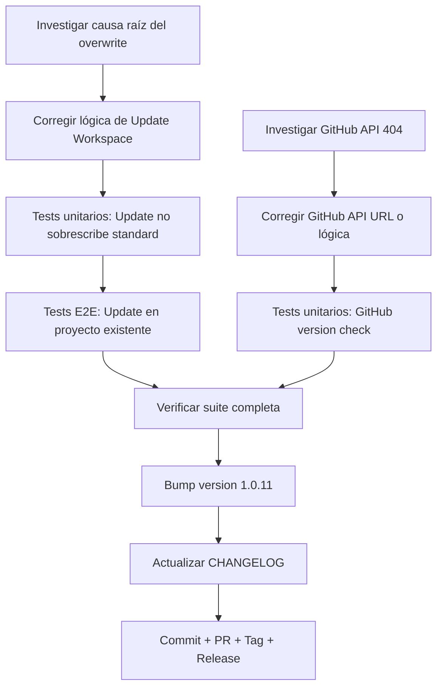

# Plan: Fase FEV-3 — Update Workspace overwrite fix + GitHub API fix (v1.0.11)

**Fecha:** 2026-06-26 | **Autor:** Quetzalcoatl (Visionary Sage) | **Estado:** 🟡 Plan Aprobado
**Versión objetivo:** v1.0.11
**Issues principales:**
1. Update Workspace sobrescribe archivos Estándar (README.md, AGENTS.md, docs/, specs/, tasks/)
2. GitHub version check retorna 404 — no detecta versión disponible

---

## Overview

Tras el release de v1.0.10, se probaron los tres modos de instalación en un proyecto real (el propio repositorio de Códice). Se identificaron dos problemas:

1. **Update Workspace sobrescribe archivos Estándar**: Al ejecutar Update Workspace en un proyecto existente, archivos clasificados como `standard` están siendo sobrescritos cuando NO deberían serlo. Solo los archivos `mandatory` (obligatorio) deben sobrescribirse.

2. **GitHub version check falla con 404**: El check de versión contra la API de GitHub retorna 404, mostrando el mensaje "Could not check for updates via GitHub. Falling back to the bundled template version."

**Objetivo:** Publicar v1.0.11 que resuelva ambos problemas sin regresión.

---

## Arquitectura de Decisiones (ADR)

| Decisión | Rationale |
|----------|-----------|
| **ADR-FEV3-1**: Solo archivos `mandatory` deben sobrescribirse en Update Workspace | El comportamiento esperado es que archivos `standard` se preserven si ya existen. Solo `obligatorio` debe sobrescribirse. |
| **ADR-FEV3-2**: Investigar `destinationExists()` para directorios | El bug puede estar en cómo se verifica la existencia de directorios vs archivos individuales dentro del directorio. |
| **ADR-FEV3-3**: Verificar nombre del repositorio en GitHub | El 404 puede deberse a un nombre incorrecto del repositorio en `constants.ts`. |
| **ADR-FEV3-4**: Bump a v1.0.11 (patch sobre v1.0.10) | Correcciones de bugs que no rompen API. Patch increment es correcto semánticamente. |

---

## Dependency Graph

---

## Task Breakdown

### Phase 1: Diagnóstico e Investigación

#### Task FEV3-T1: Investigar causa raíz del overwrite en Update Workspace
**Descripción:** Investigar por qué Update Workspace sobrescribe archivos standard cuando la lógica en `FileMergeEngine.shouldStage()` parece correcta (`return !exists` para standard rules).

**Hipótesis a verificar:**
1. `destinationExists()` no funciona correctamente para directorios
2. `stageFile()` maneja directorios recursivamente sin verificar archivos individuales
3. `AtomicStager.commitStaging()` aplica cambios incorrectamente

**Criterios de Aceptación:**
- [ ] Identificar la causa raíz exacta del overwrite
- [ ] Documentar el bug con evidencia (logs, traces)
- [ ] Proponer solución

**Verificación:**
- [ ] Causa raíz identificada y documentada

**Dependencias:** Ninguna.
**Archivos:**
- `src/infrastructure/adapters/BunFileSystem.ts`
- `src/infrastructure/adapters/AtomicStager.ts`
- `src/domain/services/FileMergeEngine.ts`

**Scope:** M (2h).

---

#### Task FEV3-T5: Investigar GitHub API 404
**Descripción:** Investigar por qué la API de GitHub retorna 404 para `https://api.github.com/repos/fisherk2/11-codice-opencode/releases/latest`.

**Hipótesis a verificar:**
1. El nombre del repositorio en `constants.ts` es incorrecto
2. No hay releases publicados en el repositorio
3. El endpoint `/releases/latest` no funciona para este repositorio

**Criterios de Aceptación:**
- [ ] Verificar el nombre correcto del repositorio en GitHub
- [ ] Verificar si existen releases publicados
- [ ] Si no hay releases, el warning es correcto
- [ ] Si el nombre es incorrecto, proponer corrección

**Verificación:**
- [ ] Causa raíz identificada y documentada

**Dependencias:** Ninguna.
**Archivos:**
- `src/infrastructure/config/constants.ts`

**Scope:** S (30min).

---

### Phase 2: Corrección de Update Workspace

#### Task FEV3-T2: Corregir lógica de Update Workspace
**Descripción:** Corregir la lógica de Update Workspace para preservar archivos standard existentes. Solo archivos mandatory deben sobrescribirse.

**Criterios de Aceptación:**
- [ ] Update Workspace NO sobrescribe archivos standard existentes
- [ ] Update Workspace SÍ sobrescribe archivos mandatory
- [ ] Update Workspace copia archivos standard que NO existen en el destino
- [ ] Lógica clara y documentada

**Verificación:**
- [ ] `bun test` — todos pasan
- [ ] `just check` — 0 errores

**Dependencias:** FEV3-T1.
**Archivos:**
- `src/application/use-cases/UpdateWorkspaceUseCase.ts`
- `src/domain/services/FileMergeEngine.ts` (si es necesario)

**Scope:** M (2h).

---

#### Task FEV3-T3: Tests unitarios: Update Workspace no sobrescribe archivos standard
**Descripción:** Crear tests que verifiquen que Update Workspace preserva archivos standard existentes.

**Criterios de Aceptación:**
- [ ] Test: Update Workspace no sobrescribe README.md existente
- [ ] Test: Update Workspace no sobrescribe AGENTS.md existente
- [ ] Test: Update Workspace no sobrescribe directorio docs/ existente
- [ ] Test: Update Workspace SÍ sobrescribe archivos mandatory
- [ ] Test: Update Workspace copia archivos standard que NO existen

**Verificación:**
- [ ] `bun test` — todos pasan
- [ ] Coverage ≥ 90%

**Dependencias:** FEV3-T2.
**Archivos:**
- `tests/integration/use-cases/update-workspace.test.ts`

**Scope:** M (1h).

---

### Phase 3: Corrección de GitHub API

#### Task FEV3-T6: Corregir GitHub API URL o lógica de version check
**Descripción:** Corregir el GitHub API URL o la lógica de version check para que funcione correctamente.

**Criterios de Aceptación:**
- [ ] GitHub version check funciona correctamente
- [ ] Si no hay releases, muestra mensaje claro
- [ ] Si el nombre del repo es incorrecto, se corrige

**Verificación:**
- [ ] `bun test` — todos pasan
- [ ] `just check` — 0 errores

**Dependencias:** FEV3-T5.
**Archivos:**
- `src/infrastructure/config/constants.ts`
- `src/infrastructure/adapters/GitHubRestClient.ts` (si es necesario)

**Scope:** S (1h).

---

#### Task FEV3-T7: Tests unitarios: GitHub version check
**Descripción:** Crear tests que verifiquen que el GitHub version check funciona correctamente.

**Criterios de Aceptación:**
- [ ] Test: GitHub version check retorna tag correcto
- [ ] Test: GitHub version check maneja 404 correctamente
- [ ] Test: GitHub version check maneja timeout correctamente

**Verificación:**
- [ ] `bun test` — todos pasan

**Dependencias:** FEV3-T6.
**Archivos:**
- `tests/integration/adapters/github-rest-client.test.ts`

**Scope:** S (1h).

---

### Phase 4: End-to-End Testing

#### Task FEV3-T4: Tests E2E: Update Workspace en proyecto existente
**Descripción:** Crear script E2E que verifique que Update Workspace preserva archivos standard existentes en un proyecto real.

**Criterios de Aceptación:**
- [ ] Script `tests/e2e/15-update-workspace-existing-project.sh`:
  1. Crea directorio temporal con archivos standard pre-existentes
  2. Ejecuta binario compilado en modo Update Workspace
  3. Verifica que archivos standard NO fueron sobrescritos
  4. Verifica que archivos mandatory SÍ fueron sobrescritos
- [ ] Script integrado en `just test-e2e`
- [ ] Total E2E: 15/15 pasando

**Verificación:**
- [ ] `just test-e2e` — 15/15 escenarios

**Dependencias:** FEV3-T3, FEV3-T7.
**Archivos:**
- `tests/e2e/15-update-workspace-existing-project.sh` (nuevo)

**Scope:** M (1h 15min).

---

### Phase 5: Verificación Integral

#### Task FEV3-T8: Verificar suite completa sin regresión
**Descripción:** Ejecutar toda la suite de tests para asegurar que no hay regresión con los cambios de FEV-3.

**Criterios de Aceptación:**
- [ ] `bun test` — ≥472 pass, 0 fail
- [ ] `just check` — 0 errores
- [ ] E2E: 15/15 pasando
- [ ] Coverage: ≥97.66% funciones / ≥96.52% líneas

**Verificación:**
- [ ] `bun test --coverage` — sin pérdida
- [ ] `just check` — clean
- [ ] `just test-e2e` — 15/15

**Dependencias:** FEV3-T4.
**Archivos:** (ninguno).

**Scope:** XS (10min).

---

### Phase 6: Release Preparation

#### Task FEV3-T9: Bump version a 1.0.11
**Descripción:** Actualizar `package.json` de `1.0.10` a `1.0.11` (patch fix).

**Criterios de Aceptación:**
- [ ] `package.json` → `"version": "1.0.11"`
- [ ] Commit: `chore: bump version to 1.0.11`

**Verificación:**
- [ ] `git diff package.json` muestra solo el bump

**Dependencias:** FEV3-T8.
**Archivos:**
- `package.json`

**Scope:** XS (5min).

---

#### Task FEV3-T10: Actualizar CHANGELOG con sección v1.0.11
**Descripción:** Crear entrada `[1.0.11]` con la descripción de los fixes.

**Criterios de Aceptación:**
- [ ] `CHANGELOG.md`:
  - Header `[1.0.11] — 2026-06-26`
  - Entry `Fixed`: "Update Workspace no sobrescribe archivos Estándar"
  - Entry `Fixed`: "GitHub version check funciona correctamente"

**Verificación:**
- [ ] `git diff CHANGELOG.md` muestra la nueva sección

**Dependencias:** FEV3-T9.
**Archivos:**
- `CHANGELOG.md`

**Scope:** XS (5min).

---

#### Task FEV3-T11: Commit + PR + Tag + Release
**Descripción:** Hacer commit de los cambios, pushear, crear PR, hacer merge, tag, release pipeline.

**Criterios de Aceptación:**
- [ ] Branch: `fix/fev-3-update-overwrite` (base = develop)
- [ ] PR creado en GitHub contra `develop`
- [ ] CI pasa (3 platforms: Linux, macOS, Windows)
- [ ] Squash merge a develop
- [ ] PR develop → main
- [ ] Squash merge a main
- [ ] `git tag -a v1.0.11 -m "Release v1.0.11 — Update Workspace fix + GitHub API fix"`
- [ ] `git push origin v1.0.11` → release pipeline ejecuta
- [ ] `npm view @fisherk2-dev/codice version` → `1.0.11`
- [ ] GitHub Release con 4 assets
- [ ] Branch local eliminado
- [ ] `develop` sincronizado con `main`

**Verificación:**
- [ ] GitHub Release publicado
- [ ] npm `latest` → 1.0.11

**Dependencias:** FEV3-T10.
**Archivos:** (git only).

**Scope:** S (15min).

---

## Riesgos y Mitigaciones

| Riesgo | Impacto | Mitigación |
|--------|---------|------------|
| **El bug de overwrite es más complejo de lo esperado** | Alto | Investigar a fondo antes de implementar. Puede requerir cambios en múltiples capas. |
| **El nombre del repositorio en GitHub es diferente** | Bajo | Verificar con `gh repo view` antes de cambiar constants.ts. |
| **No hay releases en GitHub** | Bajo | Si no hay releases, el warning es correcto. Documentar y cerrar. |
| **Los tests E2E no capturan el bug real** | Alto | Crear test que simule un proyecto real con archivos standard pre-existentes. |

---

## Métricas Objetivo

| Métrica | v1.0.10 (actual) | Meta v1.0.11 |
|---------|-----------------|--------------|
| Tests (pass/fail) | 472 / 0 | ≥472 / 0 |
| Coverage (funciones) | 97.66% | ≥97.66% |
| Coverage (líneas) | 96.52% | ≥96.52% |
| E2E escenarios | 14/14 | 15/15 (+1 update en proyecto real) |
| `just check` errores | 0 | 0 |
| Update Workspace sobrescribe standard | ❌ (bug) | ✅ |
| GitHub version check funciona | ❌ (404) | ✅ |
| Issues críticos abiertos | 0 | 0 |

---

## Resumen de Esfuerzo

| Tarea | Scope | Esfuerzo |
|-------|-------|----------|
| FEV3-T1: Investigar causa raíz overwrite | M | 2h |
| FEV3-T5: Investigar GitHub API 404 | S | 30min |
| FEV3-T2: Corregir lógica Update Workspace | M | 2h |
| FEV3-T3: Tests unitarios Update Workspace | M | 1h |
| FEV3-T6: Corregir GitHub API URL | S | 1h |
| FEV3-T7: Tests unitarios GitHub version check | S | 1h |
| FEV3-T4: Tests E2E Update en proyecto existente | M | 1h 15min |
| FEV3-T8: Verificar suite completa | XS | 10min |
| FEV3-T9: Bump version 1.0.11 | XS | 5min |
| FEV3-T10: Actualizar CHANGELOG | XS | 5min |
| FEV3-T11: Commit + PR + Tag + Release | S | 15min |
| **Total** | | **~10h** |

---

*Última actualización: 2026-06-26*
