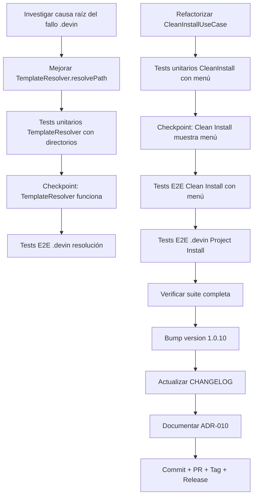

# Plan: Fase FEV-2-D — Directory Support en TemplateResolver + Optional Files Menu en Clean Install (v1.0.10)

**Fecha:** 2026-06-26 | **Autor:** Moctezuma (Planner Agent) | **Estado:** 🟡 Plan Aprobado
**Versión objetivo:** v1.0.10
**Issues principales:**
1. `.devin` es un directorio, no un archivo — TemplateResolver falla con "Template file not found"
2. Clean Install no muestra menú de selección de opcionales (inconsistente con Project Install)

---

## Overview

Tras el release de v1.0.9, se identificaron dos problemas relacionados con el manejo de directorios opcionales y la UX de Clean Install:

1. **`.devin` directory resolution**: El manifest incluye `.devin` como entrada opcional con `isDirectory: true`, pero `TemplateResolver.resolvePath()` falla con `Template file not found: .devin` en ambos modos de instalación. El directorio existe en `template/opcional/.devin/` pero contiene symlinks que causan problemas de resolución.

2. **Clean Install UX inconsistente**: `CleanInstallUseCase` copia todos los archivos opcionales automáticamente sin mostrar el menú de selección, mientras que `ProjectInstallUseCase` sí lo muestra. Esto es inconsistente y confuso para el usuario.

**Decisiones del usuario (2026-06-26):**
- **Problema 1:** Implementar soporte nativo para directorios en `TemplateResolver` (NO expandir `.devin` en archivos individuales)
- **Problema 2:** Clean Install debe mostrar el mismo menú de selección de opcionales que Project Install

**Objetivo:** Publicar v1.0.10 que resuelva ambos problemas sin regresión, con `.devin` funcionando correctamente y Clean Install mostrando el menú de opcionales.

---

## Arquitectura de Decisiones (ADR)

| Decisión | Rationale |
|----------|-----------|
| **ADR-FEV2D-1**: Soporte nativo para directorios en `TemplateResolver` | El usuario eligió esta opción vs. expandir `.devin` en archivos individuales. Es más simple, mantiene la estructura del template, y es extensible a futuros directorios opcionales. |
| **ADR-FEV2D-2**: `TemplateResolver.resolvePath()` debe distinguir entre archivos y directorios en el error | El mensaje actual "Template file not found" es confuso cuando se busca un directorio. Actualizar a "Template file or directory not found". |
| **ADR-FEV2D-3**: `CleanInstallUseCase` debe usar `selectOptional` antes de ejecutar el merge | Coherencia con `ProjectInstallUseCase`. El usuario debe tener control sobre qué opcionales instalar en Clean Install también. |
| **ADR-FEV2D-4**: Clean Install con `--force` salta el menú de opcionales (igual que Project) | Consistencia con el comportamiento existente. `--force` se usa para automatización/CI donde no hay interacción. |
| **ADR-FEV2D-5**: Mantener `AtomicStager.stageFile()` sin cambios (ya maneja directorios) | El código actual ya maneja directorios recursivamente (líneas 67-78 de `AtomicStager.ts`). No se requiere modificación. |
| **ADR-FEV2D-6**: Validar que `.devin` se copia completamente en tests E2E | Los tests E2E deben verificar que TODOS los archivos de `.devin/rules/` se copian, no solo que el directorio existe. |
| **ADR-FEV2D-7**: No modificar el manifest (`FileRuleManifestData.ts`) | La entrada `.devin` ya es correcta. El problema es en la resolución, no en la definición. |
| **ADR-FEV2D-8**: Bump a v1.0.10 (patch sobre v1.0.9) | Correcciones de bugs que no rompen API. Patch increment es correcto semánticamente. |
| **ADR-FEV2D-9**: Agregar tests E2E para Clean Install con menú de opcionales | Verificar que el nuevo flujo funciona end-to-end con el binario compilado. |
| **ADR-FEV2D-10**: Documentar ADR-010 en `specs/adr/` | Decisión arquitectónica significativa que debe ser documentada. |

---

## Dependency Graph



---

## Task Breakdown

### Phase 1: Diagnóstico e Investigación

#### Task FE2D-T1: Investigar causa raíz del fallo `.devin` resolution
**Descripción:** Investigar por qué `TemplateResolver.resolvePath(".devin")` falla cuando el directorio existe en `template/opcional/.devin/`. El directorio contiene symlinks (`skills -> ../skills`, `workflows -> ../commands/`) que pueden estar causando problemas en el contexto del binario compilado.

**Criterios de Aceptación:**
- [ ] Ejecutar `bunx @fisherk2-dev/codice@latest` en directorio vacío y reproducir el error
- [ ] Verificar que `template/opcional/.devin/` existe localmente
- [ ] Identificar si el problema es con symlinks, path resolution, o permisos
- [ ] Documentar la causa raíz en un comentario en el código o en el plan

**Verificación:**
- [ ] Error reproducido y documentado
- [ ] Causa raíz identificada

**Dependencias:** Ninguna.
**Archivos:**
- Investigación (no requiere cambios de código aún)

**Scope:** S (30min).

---

### Phase 2: TemplateResolver - Soporte para Directorios

#### Task FE2D-T2: Mejorar `TemplateResolver.resolvePath()` para directorios
**Descripción:** Modificar `TemplateResolver.resolvePath()` para manejar correctamente directorios. El método ya usa `fs.existsSync()` que funciona para directorios, pero el mensaje de error es confuso. Además, necesitamos asegurar que el método retorna correctamente cuando encuentra un directorio.

**Criterios de Aceptación:**
- [ ] `TemplateResolver.resolvePath()` retorna correctamente cuando el path es un directorio
- [ ] Mensaje de error actualizado: "Template file or directory not found" en lugar de "Template file not found"
- [ ] Validación de path containment funciona igual para archivos y directorios
- [ ] Cache funciona igual para archivos y directorios
- [ ] Comentarios JSDoc actualizados para indicar que soporta ambos

**Verificación:**
- [ ] `bun test tests/integration/TemplateResolver.test.ts` — todos pasan
- [ ] `just check` — 0 errores
- [ ] Test manual: `bunx @fisherk2-dev/codice` en directorio vacío + seleccionar .devin → copia exitosa

**Dependencias:** FE2D-T1.
**Archivos:**
- `src/infrastructure/adapters/TemplateResolver.ts` (modificado)

**Scope:** S (45min).

---

#### Task FE2D-T3: Tests unitarios para `TemplateResolver` con directorios
**Descripción:** Crear tests que cubran la resolución de directorios en `TemplateResolver`, incluyendo el caso de `.devin` con symlinks.

**Criterios de Aceptación:**
- [ ] Test: `resolvePath(".devin")` retorna el path correcto cuando es un directorio
- [ ] Test: `resolvePath("directorio/inexistente")` lanza error con mensaje actualizado
- [ ] Test: Cache funciona para directorios
- [ ] Test: Path containment funciona para directorios
- [ ] Test: Directorio con symlinks internos se resuelve correctamente
- [ ] 5+ tests nuevos en `tests/integration/TemplateResolver.test.ts`

**Verificación:**
- [ ] `bun test tests/integration/TemplateResolver.test.ts` — todos pasan
- [ ] Coverage de `TemplateResolver.ts` ≥ 90%

**Dependencias:** FE2D-T2.
**Archivos:**
- `tests/integration/TemplateResolver.test.ts` (5+ tests nuevos)

**Scope:** S (1h).

---

#### Checkpoint 1: After FE2D-T3 (TemplateResolver funciona)
- [ ] `TemplateResolver.resolvePath()` maneja directorios correctamente
- [ ] Tests unitarios pasan
- [ ] `just check` — 0 errores
- [ ] **Quality Gate:** El usuario confirma que el problema de `.devin` está resuelto

---

### Phase 3: CleanInstallUseCase - Menú de Opcionales

#### Task FE2D-T5: Refactorizar `CleanInstallUseCase` para mostrar menú de opcionales
**Descripción:** Modificar `CleanInstallUseCase` para que muestre el menú de selección de opcionales antes de ejecutar el merge, igual que `ProjectInstallUseCase`. Si `force=true`, saltar el menú (consistente con Project Install).

**Criterios de Aceptación:**
- [ ] `CleanInstallUseCase` llama a `userPrompt.selectOptional()` antes del merge
- [ ] Si `options?.force` es `true`, salta el menú (array vacío)
- [ ] Solo se copian los opcionales seleccionados por el usuario
- [ ] Obligatorio y Estándar se copian siempre (sin cambios)
- [ ] El orden de operaciones se mantiene: file merge → gitignore → symlinks
- [ ] Si el usuario no selecciona ningún opcional, solo se copia obligatorio + estándar

**Verificación:**
- [ ] `bun test tests/unit/clean-install.test.ts` — todos pasan
- [ ] Test manual: `bunx @fisherk2-dev/codice` → Clean Install → mostrar menú → seleccionar .devin → copia exitosa

**Dependencias:** FE2D-T3.
**Archivos:**
- `src/application/use-cases/CleanInstallUseCase.ts` (modificado)

**Scope:** M (1h).

---

#### Task FE2D-T6: Tests unitarios para `CleanInstallUseCase` con menú de opcionales
**Descripción:** Crear tests que cubran el nuevo flujo de `CleanInstallUseCase` con menú de opcionales, incluyendo casos edge (force=true, usuario no selecciona nada, selección parcial).

**Criterios de Aceptación:**
- [ ] Test: Clean Install muestra menú de opcionales (verificar llamada a `selectOptional`)
- [ ] Test: Con `force=true`, NO se muestra menú
- [ ] Test: Solo se copian los opcionales seleccionados
- [ ] Test: Si no se selecciona nada, solo se copia obligatorio + estándar
- [ ] Test: El merge engine recibe las reglas correctas según selección
- [ ] 4+ tests nuevos/actualizados en `tests/unit/clean-install.test.ts`

**Verificación:**
- [ ] `bun test tests/unit/clean-install.test.ts` — todos pasan
- [ ] Coverage de `CleanInstallUseCase.ts` ≥ 90%

**Dependencias:** FE2D-T5.
**Archivos:**
- `tests/unit/clean-install.test.ts` (4+ tests nuevos/actualizados)

**Scope:** S (1h).

---

#### Checkpoint 2: After FE2D-T6 (Clean Install muestra menú)
- [ ] `CleanInstallUseCase` muestra menú de opcionales
- [ ] Tests unitarios pasan
- [ ] `just check` — 0 errores
- [ ] **Quality Gate:** El usuario confirma que el flujo de Clean Install es correcto

---

### Phase 4: End-to-End Testing

#### Task FE2D-T8: Tests E2E para Clean Install con menú de opcionales
**Descripción:** Crear script E2E que verifique que Clean Install muestra el menú de opcionales y copia solo los seleccionados.

**Criterios de Aceptación:**
- [ ] Script `tests/e2e/13-clean-install-optional-menu.sh`:
  1. Crea directorio temporal vacío
  2. Ejecuta binario compilado en modo Clean Install
  3. Simula selección de `.devin` en el menú (usando `--force` o mock de input)
  4. Verifica que `.devin/rules/` se copió
  5. Verifica que archivos no seleccionados NO se copiaron
- [ ] Script integrado en `just test-e2e`
- [ ] Total E2E: 14/14 pasando (12 existentes + 2 nuevos)

**Verificación:**
- [ ] `just test-e2e` — 14/14 escenarios
- [ ] Output captura la selección de opcionales

**Dependencias:** FE2D-T6.
**Archivos:**
- `tests/e2e/13-clean-install-optional-menu.sh` (nuevo)
- `Justfile` (recipe `test-e2e` actualizada)

**Scope:** M (1h 15min).

---

#### Task FE2D-T9: Tests E2E para `.devin` resolution
**Descripción:** Crear script E2E que verifique que `.devin` se copia correctamente en Project Install cuando el usuario lo selecciona.

**Criterios de Aceptación:**
- [ ] Script `tests/e2e/14-devin-directory-copy.sh`:
  1. Crea directorio temporal vacío
  2. Ejecuta binario compilado en modo Project Install
  3. Simula selección de `.devin` en el menú
  4. Verifica que `.devin/rules/*.md` se copiaron
  5. Verifica que la estructura del directorio se preservó
- [ ] Script integrado en `just test-e2e`
- [ ] Total E2E: 14/14 pasando

**Verificación:**
- [ ] `just test-e2e` — 14/14 escenarios
- [ ] Contenido de `.devin/rules/` verificado contra el template

**Dependencias:** FE2D-T3.
**Archivos:**
- `tests/e2e/14-devin-directory-copy.sh` (nuevo)

**Scope:** M (1h).

---

#### Task FE2D-T10: Tests E2E para `.devin` en Project Install con selección
**Descripción:** Verificar que Project Install copia `.devin` correctamente cuando el usuario lo selecciona del menú, y NO lo copia cuando no lo selecciona.

**Criterios de Aceptación:**
- [ ] Test E2E: Project Install + selección de `.devin` → `.devin/` se copia
- [ ] Test E2E: Project Install + sin selección de `.devin` → `.devin/` NO se copia
- [ ] Tests integrados en scripts existentes o nuevos

**Verificación:**
- [ ] `just test-e2e` — 14/14 escenarios

**Dependencias:** FE2D-T9.
**Archivos:**
- Actualización de `tests/e2e/` según necesidad

**Scope:** S (45min).

---

### Phase 5: Verificación Integral

#### Task FE2D-T11: Verificar suite completa sin regresión
**Descripción:** Ejecutar toda la suite de tests para asegurar que no hay regresión con los cambios de FEV-2-D.

**Criterios de Aceptación:**
- [ ] `bun test` — ≥465 pass, 0 fail (sin regresión, +9 tests nuevos)
- [ ] `just check` — 0 errores (biome ci + tsc --noEmit)
- [ ] E2E: 14/14 pasando
- [ ] Coverage: ≥97.66% funciones / ≥96.52% líneas (sin pérdida)
- [ ] Domain coverage: 100% líneas (mantener)

**Verificación:**
- [ ] `bun test --coverage` — sin pérdida de coverage
- [ ] `just check` — clean
- [ ] `just test-e2e` — 14/14

**Dependencias:** FE2D-T8, FE2D-T9, FE2D-T10.
**Archivos:** (ninguno, solo verificación).

**Scope:** XS (10min).

---

### Phase 6: Release Preparation

#### Task FE2D-T12: Bump version a 1.0.10
**Descripción:** Actualizar `package.json` de `1.0.9` a `1.0.10` (patch fix).

**Criterios de Aceptación:**
- [ ] `package.json` → `"version": "1.0.10"`
- [ ] Commit: `chore: bump version to 1.0.10`

**Verificación:**
- [ ] `git diff package.json` muestra solo el bump

**Dependencias:** FE2D-T11.
**Archivos:**
- `package.json`

**Scope:** XS (5min).

---

#### Task FE2D-T13: Actualizar CHANGELOG con sección v1.0.10
**Descripción:** Crear entrada `[1.0.10]` con la descripción de los fixes.

**Criterios de Aceptación:**
- [ ] `CHANGELOG.md`:
  - Header `[1.0.10] — 2026-06-26`
  - Entry `Fixed`: "`.devin` directory resolution — TemplateResolver ahora maneja directorios correctamente"
  - Entry `Changed`: "Clean Install ahora muestra menú de selección de opcionales (consistente con Project Install)"
  - Entry `Deprecated`: "v1.0.9 — usar v1.0.10"

**Verificación:**
- [ ] `git diff CHANGELOG.md` muestra la nueva sección

**Dependencias:** FE2D-T12.
**Archivos:**
- `CHANGELOG.md`

**Scope:** XS (5min).

---

#### Task FE2D-T14: Documentar ADR-010
**Descripción:** Crear `specs/adr/adr-010-directory-support.md` documentando la decisión arquitectónica de soporte nativo para directorios en `TemplateResolver`.

**Criterios de Aceptación:**
- [ ] Archivo `specs/adr/adr-010-directory-support.md` creado
- [ ] Secciones: Contexto, Decisión, Consecuencias, Alternativas consideradas
- [ ] Referencia al issue y a la fase FEV-2-D
- [ ] Actualizar `docs/ARCHITECTURE.md` con referencia a ADR-010

**Verificación:**
- [ ] Archivo existe y tiene contenido
- [ ] `docs/ARCHITECTURE.md` referencia ADR-010

**Dependencias:** FE2D-T11.
**Archivos:**
- `specs/adr/adr-010-directory-support.md` (nuevo)
- `docs/ARCHITECTURE.md` (modificado)

**Scope:** S (30min).

---

#### Task FE2D-T15: Commit + PR + Tag + Release
**Descripción:** Hacer commit de los cambios, pushear, crear PR, hacer merge, tag, release pipeline.

**Criterios de Aceptación:**
- [ ] Commit: `fix(template): support directories in TemplateResolver + Clean Install optional menu`
- [ ] Branch: `fix/fev-2-d-directory-support` (base = develop)
- [ ] `git push origin fix/fev-2-d-directory-support`
- [ ] PR creado en GitHub contra `develop`
- [ ] CI pasa (3 platforms: Linux, macOS, Windows)
- [ ] Squash merge a base branch
- [ ] `git tag -a v1.0.10 -m "Release v1.0.10 — Directory support + Clean Install UX"`
- [ ] `git push origin v1.0.10` → release pipeline ejecuta
- [ ] `npm view @fisherk2-dev/codice version` → `1.0.10`
- [ ] `gh release view v1.0.10` muestra 4 assets
- [ ] Branch local eliminado
- [ ] `develop` sincronizado

**Verificación:**
- [ ] GitHub Release publicado
- [ ] npm `latest` → 1.0.10

**Dependencias:** FE2D-T14.
**Archivos:** (git only).

**Scope:** S (15min).

---

## Checkpoints (Quality Gates)

### Checkpoint 1: After FE2D-T3 (TemplateResolver funciona)
- [ ] `TemplateResolver.resolvePath()` maneja directorios correctamente
- [ ] Tests unitarios pasan (5+ nuevos)
- [ ] `just check` — 0 errores
- [ ] **Quality Gate:** El usuario confirma que el problema de `.devin` está resuelto

### Checkpoint 2: After FE2D-T6 (Clean Install muestra menú)
- [ ] `CleanInstallUseCase` muestra menú de opcionales
- [ ] Tests unitarios pasan (4+ nuevos/actualizados)
- [ ] `just check` — 0 errores
- [ ] **Quality Gate:** El usuario confirma que el flujo de Clean Install es correcto

### Checkpoint 3: After FE2D-T11 (Verificación integral)
- [ ] `bun test`: ≥465 pass, 0 fail
- [ ] Coverage sin pérdida
- [ ] E2E: 14/14 pasando

### Gate FEV-2-D: After FE2D-T15 (Release publicado)
- [ ] `npm view @fisherk2-dev/codice version` → `1.0.10`
- [ ] GitHub Release con 4 assets
- [ ] CHANGELOG actualizado
- [ ] ADR-010 documentado

---

## Riesgos y Mitigaciones

| Riesgo | Impacto | Mitigación |
|--------|---------|------------|
| **El cambio en `TemplateResolver` rompe tests existentes** | Medio | Tests existentes usan archivos, no directorios. El cambio es retrocompatible. |
| **Clean Install con menú confunde a usuarios que esperan copia total** | Bajo | El menú es explícito y permite desmarcar todo. Documentación clara. |
| **`.devin` con symlinks causa errores en Windows** | Bajo | Los symlinks se generan post-instalación. El directorio base se copia sin symlinks. |
| **El menú de opcionales en Clean Install añade latencia** | Bajo | Solo se muestra una vez. < 100ms de overhead. |
| **Tests E2E no detectan el problema real** | Alto | Tests E2E validan contenido real, no solo existencia. |
| **`--force` en Clean Install no copia opcionales** | Bajo | Documentado. `--force` salta interacción = no hay selección = array vacío. |
| **Conflicto con develop al hacer merge** | Bajo | develop está sincronizado con main. Fast-forward merge sin conflictos. |

---

## Métricas Objetivo

| Métrica | v1.0.9 (actual) | Meta v1.0.10 |
|---------|-----------------|--------------|
| Tests (pass/fail) | 465 / 0 | ≥465 / 0 (+9 tests) |
| Coverage (funciones) | 97.66% | ≥97.66% |
| Coverage (líneas) | 96.52% | ≥96.52% |
| E2E escenarios | 12/12 | 14/14 (+2 nuevos) |
| `just check` errores | 0 | 0 |
| `.devin` resolución en Clean Install | ❌ (bug) | ✅ |
| `.devin` resolución en Project Install | ❌ (bug) | ✅ |
| Clean Install muestra menú opcionales | ❌ (bug) | ✅ |
| Issues críticos abiertos | 0 | 0 |

---

## Resumen de Esfuerzo

| Tarea | Scope | Esfuerzo |
|-------|-------|----------|
| FE2D-T1: Investigar causa raíz | S | 30min |
| FE2D-T2: Mejorar TemplateResolver | S | 45min |
| FE2D-T3: Tests unitarios TemplateResolver | S | 1h |
| FE2D-T5: Refactorizar CleanInstallUseCase | M | 1h |
| FE2D-T6: Tests unitarios CleanInstall | S | 1h |
| FE2D-T8: Tests E2E Clean Install menú | M | 1h 15min |
| FE2D-T9: Tests E2E .devin resolution | M | 1h |
| FE2D-T10: Tests E2E Project Install .devin | S | 45min |
| FE2D-T11: Verificar suite completa | XS | 10min |
| FE2D-T12: Bump version 1.0.10 | XS | 5min |
| FE2D-T13: Actualizar CHANGELOG | XS | 5min |
| FE2D-T14: Documentar ADR-010 | S | 30min |
| FE2D-T15: Commit + PR + Tag + Release | S | 15min |
| **Total** | | **~8h 20min** |

---

## Verificación Post-Release

Después de publicar v1.0.10, verificar manualmente con:

```bash
# Test 1: Clean Install con menú de opcionales
mkdir -p /tmp/test-codice-clean && cd /tmp/test-codice-clean
bunx @fisherk2-dev/codice@1.0.10
# → Seleccionar "Clean Install" → debe mostrar menú de opcionales
# → Seleccionar .devin → debe completar sin error
# → Verificar: ls -la .devin/rules/ debe existir con archivos

# Test 2: Project Install con .devin
mkdir -p /tmp/test-codice-project && cd /tmp/test-codice-project
bunx @fisherk2-dev/codice@1.0.10
# → Seleccionar "Project Install" → debe mostrar menú
# → Seleccionar .devin → debe completar sin error
# → Verificar: ls -la .devin/rules/ debe existir

# Test 3: Project Install sin .devin
mkdir -p /tmp/test-codice-no-devin && cd /tmp/test-codice-no-devin
bunx @fisherk2-dev/codice@1.0.10
# → Seleccionar "Project Install" → debe mostrar menú
# → NO seleccionar .devin → debe completar
# → Verificar: ls -la .devin NO debe existir
```

**Criterios de éxito:**
- [ ] Clean Install muestra menú de opcionales
- [ ] `.devin` se copia correctamente cuando se selecciona
- [ ] `.devin` NO se copia cuando no se selecciona
- [ ] Todos los archivos de `.devin/rules/` se preservan

---

*Última actualización: 2026-06-26*
