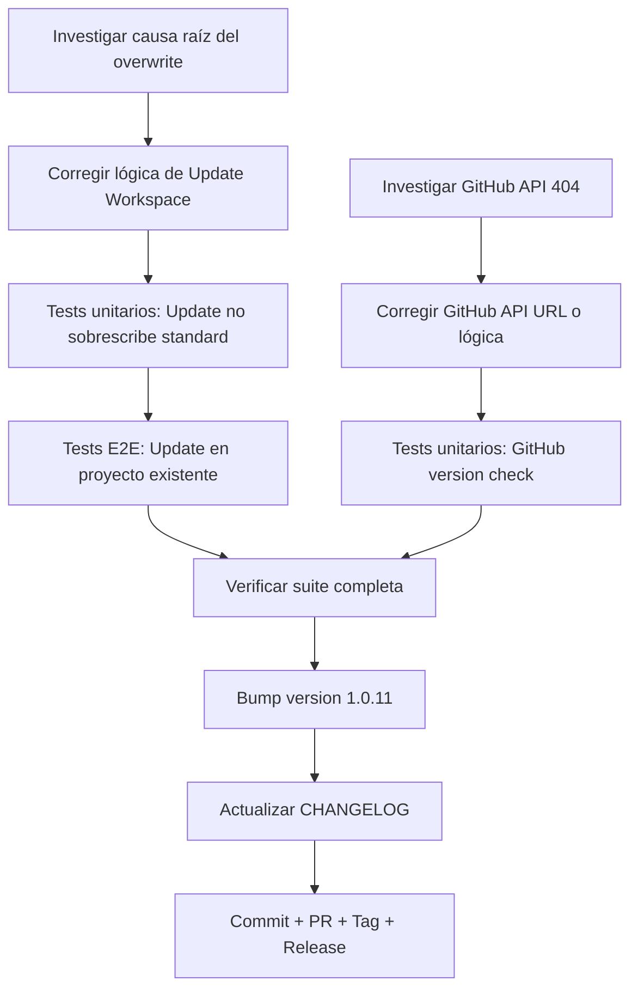

# Plan: Fase FEV-3 — Update Workspace overwrite fix + GitHub API fix (v1.0.11)

**Fecha:** 2026-06-26 | **Autor:** Quetzalcoatl (Visionary Sage) | **Estado:** 🟡 Plan Aprobado
**Versión objetivo:** v1.0.11
**Issues principales:**
1. Update Workspace sobrescribe archivos Estándar (README.md, AGENTS.md, docs/, specs/, tasks/)
2. GitHub version check retorna 404 — no detecta versión disponible

---

## Overview

Tras el release de v1.0.10, se probaron los tres modos de instalación en un proyecto real (el propio repositorio de Códice). Se identificaron dos problemas:

1. **Update Workspace sobrescribe archivos Estándar**: Al ejecutar Update Workspace en un proyecto existente, archivos clasificados como `standard` están siendo sobrescritos cuando NO deberían serlo. Solo los archivos `mandatory` (obligatorio) deben sobrescribirse.

2. **GitHub version check falla con 404**: El check de versión contra la API de GitHub retorna 404, mostrando el mensaje "Could not check for updates via GitHub. Falling back to the bundled template version."

**Objetivo:** Publicar v1.0.11 que resuelva ambos problemas sin regresión.

---

## Arquitectura de Decisiones (ADR)

| Decisión | Rationale |
|----------|-----------|
| **ADR-FEV3-1**: Solo archivos `mandatory` deben sobrescribirse en Update Workspace | El comportamiento esperado es que archivos `standard` se preserven si ya existen. Solo `obligatorio` debe sobrescribirse. |
| **ADR-FEV3-2**: Investigar `destinationExists()` para directorios | El bug puede estar en cómo se verifica la existencia de directorios vs archivos individuales dentro del directorio. |
| **ADR-FEV3-3**: Verificar nombre del repositorio en GitHub | El 404 puede deberse a un nombre incorrecto del repositorio en `constants.ts`. |
| **ADR-FEV3-4**: Bump a v1.0.11 (patch sobre v1.0.10) | Correcciones de bugs que no rompen API. Patch increment es correcto semánticamente. |

---

## Dependency Graph



---

## Task Breakdown

> **Nota sobre la regresión:** El Problema 1 es una **regresión de FEV-1 Issue #2** (v1.0.5). El WORKFLOW.md líneas 280-313 documenta que Issue #2 fue resuelto, pero el fix se perdió durante un refactor posterior. Las tareas FEV3-T1/T2 reflejan el fix específico, no una investigación genérica.

### Phase 1: Corrección de bugs (causas raíz ya identificadas)

#### Task FEV3-T1: Corregir `BunFileSystem.destinationExists()` para soportar directorios
**Descripción:** Cambiar `BunFileSystem.destinationExists()` en `src/infrastructure/adapters/BunFileSystem.ts:56-67` para usar `fs.access()` en vez de `Bun.file().exists()`. `Bun.file()` solo funciona con archivos, no con directorios, lo que causa que standard directories (docs/, specs/, tasks/) se sobrescriban durante Update Workspace.

**Causa raíz:** `Bun.file(fullPath).exists()` retorna `false` cuando `fullPath` es un directorio, incluso si existe. Por lo tanto, `FileMergeEngine.shouldStage()` para reglas standard siempre retorna `!exists = true` para directorios, stageando y sobrescribiendo su contenido.

**Criterios de Aceptación:**
- [ ] `destinationExists()` retorna `true` para directorios existentes
- [ ] `destinationExists()` retorna `false` para directorios inexistentes
- [ ] `destinationExists()` sigue funcionando correctamente para archivos
- [ ] No se introducen cambios en la API del port

**Verificación:**
- [ ] `bun test` — todos pasan
- [ ] `just check` — 0 errores

**Dependencias:** Ninguna.
**Archivos:**
- `src/infrastructure/adapters/BunFileSystem.ts:56-67`

**Scope:** XS (15min).

---

#### Task FEV3-T2: Corregir `GITHUB_REPO` en `constants.ts:5`
**Descripción:** Cambiar `GITHUB_REPO` de `"11-codice-opencode"` a `"codice-opencode"` en `src/infrastructure/config/constants.ts:5`. El repo real en GitHub es `fisherk2/codice-opencode`, no `fisherk2/11-codice-opencode`.

**Evidencia:**
```bash
$ curl -s -o /dev/null -w "%{http_code}" "https://api.github.com/repos/fisherk2/11-codice-opencode/releases/latest"
404
$ curl -s -o /dev/null -w "%{http_code}" "https://api.github.com/repos/fisherk2/codice-opencode/releases/latest"
200
```

**Criterios de Aceptación:**
- [ ] `GITHUB_REPO = "codice-opencode"` en `constants.ts`
- [ ] `getGitHubApiUrl()` retorna URL correcta
- [ ] GitHub version check funciona contra el repo real

**Verificación:**
- [ ] `bun test` — todos pasan
- [ ] `just check` — 0 errores
- [ ] Test E2E con GitHub mock retorna tag esperado

**Dependencias:** Ninguna.
**Archivos:**
- `src/infrastructure/config/constants.ts:5`

**Scope:** XS (5min).

---

### Phase 2: Tests unitarios (TDD)

#### Task FEV3-T3: Tests unitarios: `destinationExists()` retorna `true` para directorios
**Descripción:** Crear tests que verifiquen que `BunFileSystem.destinationExists()` funciona correctamente con directorios. Esto es el test RED que faltaba para evitar que la regresión vuelva a ocurrir.

**Criterios de Aceptación:**
- [ ] Test: `destinationExists("docs")` retorna `true` cuando `docs/` existe
- [ ] Test: `destinationExists("docs")` retorna `false` cuando `docs/` no existe
- [ ] Test: `destinationExists("README.md")` retorna `true` cuando existe
- [ ] Test: `destinationExists("README.md")` retorna `false` cuando no existe

**Verificación:**
- [ ] `bun test` — todos pasan
- [ ] Coverage de `BunFileSystem.destinationExists()` ≥ 90%

**Dependencias:** FEV3-T1.
**Archivos:**
- `tests/integration/adapters/bun-file-system.test.ts` (añadir tests)

**Scope:** S (30min).

---

#### Task FEV3-T4: Tests unitarios: UpdateWorkspaceUseCase no sobrescribe standard
**Descripción:** Crear tests que verifiquen que `UpdateWorkspaceUseCase` no sobrescribe archivos/directorios standard existentes. Este es el test de regresión para FEV-1 Issue #2.

**Criterios de Aceptación:**
- [ ] Test: Update no sobrescribe `README.md` existente
- [ ] Test: Update no sobrescribe `AGENTS.md` existente
- [ ] Test: Update no sobrescribe directorio `docs/` existente (ni sus archivos)
- [ ] Test: Update no sobrescribe directorio `specs/` existente
- [ ] Test: Update SÍ sobrescribe archivos mandatory (regression check)
- [ ] Test: Update copia archivos standard que NO existen en destino

**Verificación:**
- [ ] `bun test` — todos pasan
- [ ] Coverage de UpdateWorkspaceUseCase ≥ 90%

**Dependencias:** FEV3-T1.
**Archivos:**
- `tests/integration/use-cases/update-workspace.test.ts` (añadir tests)

**Scope:** M (1h).

---

#### Task FEV3-T5: Tests unitarios: GitHub API retorna tag correcto con repo fix
**Descripción:** Crear tests que verifiquen que el GitHub version check funciona correctamente con el repo name corregido. Test contra mock server que retorna 200 con tag válido.

**Criterios de Aceptación:**
- [ ] Test: `getLatestReleaseTag()` retorna `v1.0.10` contra mock 200
- [ ] Test: `getLatestReleaseTag()` retorna `null` contra mock 404
- [ ] Test: `getLatestReleaseTag()` retorna `null` contra mock con tag inválido
- [ ] Test: `getLatestReleaseTag()` retorna `null` en timeout

**Verificación:**
- [ ] `bun test` — todos pasan

**Dependencias:** FEV3-T2.
**Archivos:**
- `tests/integration/adapters/github-rest-client.test.ts` (añadir/actualizar tests)

**Scope:** S (30min).

---

### Phase 3: End-to-End Testing

#### Task FEV3-T6: Test E2E: Update Workspace en proyecto existente
**Descripción:** Crear script E2E que verifique que Update Workspace preserva archivos standard existentes en un proyecto real. Este test debe fallar antes del fix y pasar después.

**Criterios de Aceptación:**
- [ ] Script `tests/e2e/15-update-workspace-existing-project.sh`:
  1. Crea directorio temporal con archivos standard pre-existentes (README.md, AGENTS.md, docs/)
  2. Ejecuta binario compilado en modo Update Workspace con `--force`
  3. Verifica que archivos standard NO fueron sobrescritos (contenido original intacto)
  4. Verifica que archivos mandatory SÍ fueron sobrescritos
- [ ] Script integrado en `just test-e2e`
- [ ] Total E2E: 15/15 pasando

**Verificación:**
- [ ] `just test-e2e` — 15/15 escenarios

**Dependencias:** FEV3-T1, FEV3-T2, FEV3-T3, FEV3-T4, FEV3-T5.
**Archivos:**
- `tests/e2e/15-update-workspace-existing-project.sh` (nuevo)

**Scope:** M (1h).

---

### Phase 4: Verificación Integral

#### Task FEV3-T7: Verificar suite completa sin regresión
**Descripción:** Ejecutar toda la suite de tests para asegurar que no hay regresión con los cambios de FEV-3.

**Criterios de Aceptación:**
- [ ] `bun test` — ≥472 pass, 0 fail
- [ ] `just check` — 0 errores
- [ ] E2E: 15/15 pasando
- [ ] Coverage: ≥97.66% funciones / ≥96.52% líneas (sin pérdida)

**Verificación:**
- [ ] `bun test --coverage` — sin pérdida
- [ ] `just check` — clean
- [ ] `just test-e2e` — 15/15

**Dependencias:** FEV3-T6.
**Archivos:** (ninguno).

**Scope:** XS (10min).

---

### Phase 5: Release Preparation

#### Task FEV3-T8: Bump version a 1.0.11 y release
**Descripción:** Actualizar `package.json` de `1.0.10` a `1.0.11` (patch fix), actualizar CHANGELOG, hacer commit, PR, merge, tag, release pipeline.

**Criterios de Aceptación:**
- [ ] `package.json` → `"version": "1.0.11"`
- [ ] CHANGELOG.md sección `[1.0.11]`:
  - `Fixed`: "Update Workspace no sobrescribe archivos Estándar (regresión de FEV-1 #2)"
  - `Fixed`: "GitHub version check funciona correctamente (repo name fix)"
- [ ] Commit: `fix(use-case): preserve standard files in Update + fix GitHub repo URL`
- [ ] Branch: `fix/fev-3-update-overwrite` (base = develop)
- [ ] PR contra develop → CI pasa → squash merge
- [ ] PR develop → main → CI pasa → squash merge
- [ ] `git tag -a v1.0.11 -m "Release v1.0.11 — Update Workspace fix + GitHub API fix"`
- [ ] `git push origin v1.0.11` → release pipeline ejecuta
- [ ] `npm view @fisherk2-dev/codice version` → `1.0.11`
- [ ] GitHub Release con 4 assets
- [ ] Branch local eliminado
- [ ] `develop` sincronizado con `main`

**Verificación:**
- [ ] GitHub Release publicado
- [ ] npm `latest` → 1.0.11

**Dependencias:** FEV3-T7.
**Archivos:**
- `package.json`
- `CHANGELOG.md`

**Scope:** S (15min).

---

## Riesgos y Mitigaciones

| Riesgo | Impacto | Mitigación |
|--------|---------|------------|
| **El bug de overwrite es más complejo de lo esperado** | Alto | Investigar a fondo antes de implementar. Puede requerir cambios en múltiples capas. |
| **El nombre del repositorio en GitHub es diferente** | Bajo | Verificar con `gh repo view` antes de cambiar constants.ts. |
| **No hay releases en GitHub** | Bajo | Si no hay releases, el warning es correcto. Documentar y cerrar. |
| **Los tests E2E no capturan el bug real** | Alto | Crear test que simule un proyecto real con archivos standard pre-existentes. |

---

## Métricas Objetivo

| Métrica | v1.0.10 (actual) | Meta v1.0.11 |
|---------|-----------------|--------------|
| Tests (pass/fail) | 472 / 0 | ≥472 / 0 |
| Coverage (funciones) | 97.66% | ≥97.66% |
| Coverage (líneas) | 96.52% | ≥96.52% |
| E2E escenarios | 14/14 | 15/15 (+1 update en proyecto real) |
| `just check` errores | 0 | 0 |
| Update Workspace sobrescribe standard | ❌ (bug) | ✅ |
| GitHub version check funciona | ❌ (404) | ✅ |
| Issues críticos abiertos | 0 | 0 |

---

## Resumen de Esfuerzo

| Tarea | Scope | Esfuerzo |
|-------|-------|----------|
| FEV3-T1: Corregir `destinationExists()` para directorios | XS | 15min |
| FEV3-T2: Corregir `GITHUB_REPO` en `constants.ts:5` | XS | 5min |
| FEV3-T3: Tests unitarios `destinationExists()` | S | 30min |
| FEV3-T4: Tests unitarios UpdateWorkspaceUseCase (regresión) | M | 1h |
| FEV3-T5: Tests unitarios GitHub API | S | 30min |
| FEV3-T6: Test E2E Update en proyecto existente | M | 1h |
| FEV3-T7: Verificar suite completa | XS | 10min |
| FEV3-T8: Bump version + CHANGELOG + release | S | 15min |
| **Total** | | **~3h 45min** |

---

*Última actualización: 2026-06-26*
