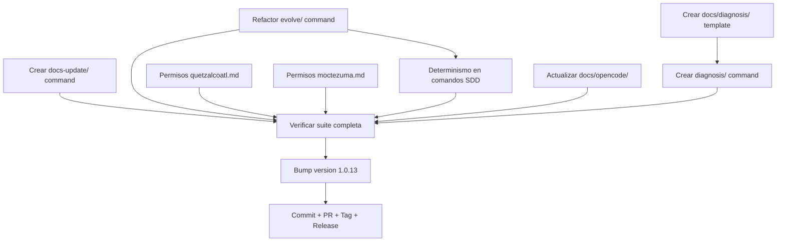

# Plan: Fase FEV-4 — SDD Command Refactor + Governance (v1.0.13)

**Fecha:** 2026-06-27 | **Autor:** Moctezuma (Strategic Planner) | **Estado:** 🟡 Plan Aprobado
**Versión objetivo:** v1.0.13
**Issue principal:** #15 — Gobernanza y determinismo en los comandos del workspace
**Branch:** `feat/fev-4-issue-15` (creado desde develop, ya con commit de documentación `d15c538`)

---

## Overview

Issue #15 identifica problemas de gobernanza y determinismo en los comandos del workspace. Propone:

1. **Nuevo comando `docs-update/`** — Actualizar, migrar y sincronizar documentación
2. **Nuevo comando `diagnosis/`** — Analizar issues y documentar diagnósticos técnicos
3. **Refactor de `evolve/`** — Simplificar a solo crear specs para proyectos maduros
4. **Gobernanza de agentes** — Restringir Quetzalcoatl (no `tasks/`) y Moctezuma (solo `tasks/`)
5. **Determinismo del flujo SDD** — Comandos sugieren el siguiente paso al finalizar

**Objetivo:** Publicar v1.0.13 que implemente la propuesta de Issue #15 sin regresión.

---

## Arquitectura de Decisiones (ADR)

| Decisión | Rationale |
|----------|-----------|
| **ADR-FEV4-1**: Mantener `evolve/` con scope reducido (Opción B) | Preserva la separación entre proyectos nuevos (`spec/`) y maduros (`evolve/`). Requiere pre-flight para detectar tipo de proyecto. |
| **ADR-FEV4-1b**: Eliminar Routes A y B de `evolve/` | Route A (Update living documentation) ahora es responsabilidad de `docs-update/`. Route B (Resolve an issue) ahora es responsabilidad de `diagnosis/`. Si el usuario invoca `evolve/` para esas tareas, el agente debe sugerir los comandos apropiados. |
| **ADR-FEV4-2**: Crear `docs-update/` con pre-flight + question-tool | Sigue el patrón establecido en `spec/` y `evolve/`. Evita contradicciones antes de escribir. Agente: Quetzalcoatl. |
| **ADR-FEV4-3**: Crear `diagnosis/` que SOLO diagnostica, no implementa | Evita que el agente "ayude" implementando soluciones no solicitadas. Vincula al issue remoto sin copiar contenido. Agente: Quetzalcoatl. |
| **ADR-FEV4-4**: Gobernanza restrictiva para Moctezuma (solo `tasks/`) | Previene que Moctezuma escriba fuera de su scope. El usuario debe saber exactamente qué esperar. |
| **ADR-FEV4-5**: Determinismo vía sugerencia explícita al final de cada comando | Mejora la UX del flujo SDD. El usuario no necesita consultar docs para saber qué sigue. |
| **ADR-FEV4-6**: Eliminar sugerencias de comandos en configuración de agentes | Los agentes sugieren invocar otros agentes primarios, no comandos específicos. Mantiene separación de responsabilidades. |

---

## Dependency Graph

**Critical path:** T1 → T8 → T7 → T10 → T11
**Parallelizable:** T2, T3, T4, T5, T6, T9 (sin dependencias entre sí, pero T4 depende de T3)

---

## Task Breakdown

### Phase 1: Command Refactor

#### Task FEV4-T1: Refactor comando `evolve/` con scope reducido
**Descripción:** Refactorizar `template/obligatorio/commands/evolve.md` para que solo se enfoque en crear nuevas specs para proyectos maduros con versiones robustas. **Eliminar Routes A y B** (Update living documentation → ahora es `docs-update/`; Resolve an issue → ahora es `diagnosis/`). Si el usuario invoca `evolve/` para esas tareas, el agente debe sugerir los comandos apropiados. Añadir pre-flight que detecte si el proyecto es maduro o no.

**Criterios de Aceptación:**
- [ ] `evolve.md` solo crea specs (no escribe en `tasks/`)
- [ ] **Routes A y B eliminadas completamente** (responsabilidades transferidas a `docs-update/` y `diagnosis/`)
- [ ] Si el usuario quiere actualizar docs, el agente sugiere ejecutar `docs-update/`
- [ ] Si el usuario quiere resolver issues, el agente sugiere ejecutar `diagnosis/`
- [ ] Pre-flight detecta madurez del proyecto (existencia de `package.json`, versiones, etc.)
- [ ] Si el proyecto NO es maduro, sugiere al usuario usar `spec/` en su lugar
- [ ] Documenta explícitamente las restricciones (no implementar código, no escribir en `tasks/`)

**Verificación:**
- [ ] `bun test` — todos pasan
- [ ] `just check` — 0 errores
- [ ] Manual: leer el archivo y verificar que el scope está claramente delimitado

**Dependencias:** Ninguna.
**Archivos:**
- `template/obligatorio/commands/evolve.md` (modificar)

**Scope:** M (45min).

---

#### Task FEV4-T2: Crear comando `docs-update/`
**Descripción:** Crear nuevo comando `template/obligatorio/commands/docs-update.md` que actualice, migre y sincronice documentación con código y archivos de configuración. Debe incluir pre-flight para analizar documentos existentes y question-tool para resolver contradicciones.

**Criterios de Aceptación:**
- [ ] Archivo `docs-update.md` creado con frontmatter YAML
- [ ] Pre-flight analiza docs existentes y sugiere crear faltantes
- [ ] Question-tool se invoca antes de escribir (resuelve contradicciones)
- [ ] Restricciones explícitas: NO escribir en `tasks/`, NO implementar código
- [ ] Sugerencia de siguiente paso al final: "Ejecuta `/plan` si hay cambios que requieren implementación"

**Verificación:**
- [ ] `bun test` — todos pasan
- [ ] `just check` — 0 errores
- [ ] Manual: el archivo sigue el formato de los otros comandos

**Dependencias:** Ninguna.
**Archivos:**
- `template/obligatorio/commands/docs-update.md` (nuevo)

**Scope:** M (45min).

---

#### Task FEV4-T3: Crear comando `diagnosis/`
**Descripción:** Crear nuevo comando `template/obligatorio/commands/diagnosis.md` que analice issues del repositorio remoto, detecte problemas y documente diagnósticos técnicos en `docs/diagnosis/`. NO implementa soluciones.

**Criterios de Aceptación:**
- [ ] Archivo `diagnosis.md` creado con frontmatter YAML
- [ ] Pre-flight identifica la issue objetivo (número o URL)
- [ ] Permite ejecutar comandos de análisis en terminal
- [ ] Crea archivos en `docs/diagnosis/` con formato estructurado
- [ ] Restricciones explícitas: NO implementar fixes, NO escribir en `tasks/`
- [ ] Vincula al issue remoto sin copiar contenido
- [ ] Sugerencia de siguiente paso al final: "Ejecuta `/plan` para implementar la solución diagnosticada"

**Verificación:**
- [ ] `bun test` — todos pasan
- [ ] `just check` — 0 errores
- [ ] Manual: el archivo sigue el formato de los otros comandos

**Dependencias:** Ninguna.
**Archivos:**
- `template/obligatorio/commands/diagnosis.md` (nuevo)

**Scope:** M (45min).

---

#### Task FEV4-T4: Crear `docs/diagnosis/` con README y template
**Descripción:** Crear el directorio `template/estandar/docs/diagnosis/` con un `README.md` que explique el propósito y un `diagnosis-template.md` que sirva como placeholder para nuevos diagnósticos.

**Criterios de Aceptación:**
- [ ] Directorio `template/estandar/docs/diagnosis/` creado
- [ ] `README.md` con frase: "Si investigaste un problema, documenta el diagnóstico aquí"
- [ ] `diagnosis-template.md` con estructura: Metadata, Síntomas, Diagnóstico, Solución, Verificación, Lecciones
- [ ] Ambos archivos siguen el formato de la plantilla estándar

**Verificación:**
- [ ] `bun test` — todos pasan
- [ ] `just check` — 0 errores
- [ ] Manual: los archivos son legibles y siguen convenciones

**Dependencias:** FEV4-T3 (lógicamente relacionado, pero puede hacerse en paralelo).
**Archivos:**
- `template/estandar/docs/diagnosis/README.md` (nuevo)
- `template/estandar/docs/diagnosis/diagnosis-template.md` (nuevo)

**Scope:** S (30min).

---

### Phase 2: Agent Governance

#### Task FEV4-T5: Actualizar permisos de `quetzalcoatl.md`
**Descripción:** Actualizar `template/obligatorio/agents/quetzalcoatl.md` para restringir su escritura: solo puede escribir en documentación (`docs/`, `specs/`, `README.md`, `CHANGELOG.md`, etc.). NO puede escribir en `tasks/`, código fuente (`src/`), ni archivos de configuración.

**Criterios de Aceptación:**
- [ ] Sección de permisos explícita: solo documentación
- [ ] Prohibido: `tasks/`, `src/`, `package.json`, `tsconfig.json`, `opencode.json`
- [ ] Explicación de por qué (evitar implementación accidental)
- [ ] Sugerencia al final: invocar Moctezuma para crear planes de ejecución

**Verificación:**
- [ ] `bun test` — todos pasan
- [ ] `just check` — 0 errores
- [ ] Manual: leer el archivo y verificar que las restricciones son claras

**Dependencias:** Ninguna.
**Archivos:**
- `template/obligatorio/agents/quetzalcoatl.md` (modificar)

**Scope:** S (20min).

---

#### Task FEV4-T6: Actualizar permisos de `moctezuma.md`
**Descripción:** Actualizar `template/obligatorio/agents/moctezuma.md` para restringir su escritura: SOLO puede escribir en `tasks/` y sus ficheros. NO puede escribir en documentación, código, ni configuración.

**Criterios de Aceptación:**
- [ ] Sección de permisos explícita: solo `tasks/`
- [ ] Prohibido: `docs/`, `specs/`, `src/`, archivos de configuración
- [ ] Explicación de por qué (separación clara de responsabilidades)
- [ ] Advertencia clara al usuario sobre el scope

**Verificación:**
- [ ] `bun test` — todos pasan
- [ ] `just check` — 0 errores
- [ ] Manual: leer el archivo y verificar que las restricciones son claras

**Dependencias:** Ninguna.
**Archivos:**
- `template/obligatorio/agents/moctezuma.md` (modificar)

**Scope:** S (20min).

---

### Phase 3: SDD Determinism

#### Task FEV4-T7: Añadir determinismo a comandos SDD
**Descripción:** Añadir sugerencia explícita del siguiente paso al final de cada comando del ciclo SDD. Eliminar la sección "Composition" con sugerencias de comandos en la configuración de agentes (debe sugerir agentes, no comandos).

**Criterios de Aceptación:**
- [ ] Cada comando SDD termina con "Siguiente paso: ejecuta [comando]"
- [ ] Flujo determinista:
  - `spec/` → sugiere `plan/`
  - `plan/` → sugiere `build/`
  - `build/` → sugiere `test/`
  - `test/` → sugiere `review/`
  - `review/` → sugiere `ship/`
  - `ship/` → sugiere `docs-update/`, `diagnosis/` o `evolve/`
  - `docs-update/` → sugiere `plan/`
  - `diagnosis/` → sugiere `plan/`
  - `evolve/` → sugiere `plan/`
- [ ] Configuración de agentes sin sugerencias de comandos específicos
- [ ] Agentes sugieren invocar otros agentes primarios (no comandos)

**Verificación:**
- [ ] `bun test` — todos pasan
- [ ] `just check` — 0 errores
- [ ] Manual: verificar que cada comando tiene la sugerencia correcta

**Dependencias:** FEV4-T1, FEV4-T2, FEV4-T3 (los nuevos comandos ya creados).
**Archivos:**
- `template/obligatorio/commands/spec.md` (modificar)
- `template/obligatorio/commands/plan.md` (modificar)
- `template/obligatorio/commands/build.md` (modificar)
- `template/obligatorio/commands/test.md` (modificar)
- `template/obligatorio/commands/review.md` (modificar)
- `template/obligatorio/commands/ship.md` (modificar)
- `template/obligatorio/commands/design.md` (modificar)
- `template/obligatorio/commands/code-simplify.md` (modificar)
- `template/obligatorio/commands/webperf.md` (modificar)
- `template/obligatorio/agents/quetzalcoatl.md` (modificar — eliminar comandos)
- `template/obligatorio/agents/moctezuma.md` (modificar — eliminar comandos)
- `template/obligatorio/agents/tlaloc.md` (modificar — eliminar comandos)

**Scope:** L (1.5h). Dividir en sub-tareas si es necesario.

---

### Phase 4: Documentation Update

#### Task FEV4-T8: Actualizar documentación de comandos
**Descripción:** Actualizar `docs/opencode/04-commands.md` y `docs/opencode/USER_GUIDE.md` para reflejar los nuevos comandos `docs-update/` y `diagnosis/`, y el refactor de `evolve/`.

**Criterios de Aceptación:**
- [ ] `04-commands.md` lista los 12 comandos (10 anteriores + 2 nuevos)
- [ ] `USER_GUIDE.md` incluye secciones para los nuevos comandos
- [ ] Documenta el refactor de `evolve/`
- [ ] Actualiza el flujo determinista con sugerencias de siguiente paso

**Verificación:**
- [ ] `bun test` — todos pasan
- [ ] `just check` — 0 errores
- [ ] Manual: los docs son consistentes con los comandos

**Dependencias:** FEV4-T1, FEV4-T2, FEV4-T3, FEV4-T7.
**Archivos:**
- `docs/opencode/04-commands.md` (modificar)
- `docs/opencode/USER_GUIDE.md` (modificar)

**Scope:** M (45min).

---

### Phase 5: Verification

#### Task FEV4-T9: Verificar suite completa sin regresión
**Descripción:** Ejecutar toda la suite de tests para asegurar que no hay regresión con los cambios de FEV-4.

**Criterios de Aceptación:**
- [ ] `bun test` — ≥481 pass, 0 fail
- [ ] `just check` — 0 errores
- [ ] E2E: 15/15 pasando
- [ ] Coverage: ≥97.66% funciones / ≥96.52% líneas (sin pérdida)

**Verificación:**
- [ ] `bun test --coverage` — sin pérdida
- [ ] `just check` — clean
- [ ] `just test-e2e` — 15/15

**Dependencias:** FEV4-T1, T2, T3, T4, T5, T6, T7, T8.
**Archivos:** (ninguno).

**Scope:** XS (10min).

---

### Phase 6: Release Preparation

#### Task FEV4-T10: Bump version a 1.0.13 y actualizar CHANGELOG
**Descripción:** Actualizar `package.json` de `1.0.12` a `1.0.13` (minor feature), actualizar CHANGELOG con sección `[1.0.13]`.

**Criterios de Aceptación:**
- [ ] `package.json` → `"version": "1.0.13"`
- [ ] CHANGELOG.md sección `[1.0.13]`:
  - `Added`: "New `docs-update/` command"
  - `Added`: "New `diagnosis/` command"
  - `Added`: "New `docs/diagnosis/` directory in template"
  - `Changed`: "Refactored `evolve/` command with reduced scope"
  - `Changed`: "Agent governance: Quetzalcoatl restricted to documentation"
  - `Changed`: "Agent governance: Moctezuma restricted to `tasks/`"
  - `Changed`: "SDD determinism: commands suggest next step"
  - `Fixed`: "Issue #15: governance and determinism"

**Verificación:**
- [ ] `grep "1.0.13" package.json` → match
- [ ] CHANGELOG tiene sección `[1.0.13]`

**Dependencias:** FEV4-T9.
**Archivos:**
- `package.json`
- `CHANGELOG.md`

**Scope:** S (15min).

---

#### Task FEV4-T11: Commit + PR + Tag + Release
**Descripción:** Commit final, crear PR contra develop, esperar CI, squash merge, crear PR develop→main, esperar CI, squash merge, tag v1.0.13, push, release pipeline.

**Criterios de Aceptación:**
- [ ] Commit: `feat(sdd): v1.0.13 — command refactor + governance + determinism`
- [ ] Branch: `feat/fev-4-issue-15` (ya existe con commit de docs)
- [ ] PR feat/fev-4-issue-15 → develop → CI pasa → squash merge
- [ ] PR develop → main → CI pasa → squash merge
- [ ] `git tag -a v1.0.13 -m "Release v1.0.13 — SDD command refactor + governance + determinism"`
- [ ] `git push origin v1.0.13` → release pipeline ejecuta
- [ ] `npm view @fisherk2-dev/codice version` → `1.0.13`
- [ ] GitHub Release con assets
- [ ] Branch local eliminado
- [ ] `develop` sincronizado con `main`

**Verificación:**
- [ ] GitHub Release publicado
- [ ] npm `latest` → 1.0.13
- [ ] CI pasa en 3 plataformas

**Dependencias:** FEV4-T10.
**Archivos:** (ninguno — solo git operations).

**Scope:** S (20min).

---

## Checkpoints

### Checkpoint 1: After T1, T2, T3, T4 (Commands creados/refactorizados)
- [ ] `evolve.md` refactorizado con scope reducido
- [ ] `docs-update.md` creado
- [ ] `diagnosis.md` creado
- [ ] `docs/diagnosis/` con README y template
- [ ] `bun test` — todos pasan
- [ ] `just check` — 0 errores

### Checkpoint 2: After T5, T6 (Gobernanza aplicada)
- [ ] `quetzalcoatl.md` con permisos restrictivos
- [ ] `moctezuma.md` con permisos restrictivos
- [ ] `bun test` — todos pasan
- [ ] `just check` — 0 errores

### Checkpoint 3: After T7, T8 (Determinismo + docs actualizados)
- [ ] Todos los comandos SDD sugieren siguiente paso
- [ ] Agentes sin sugerencias de comandos
- [ ] `docs/opencode/04-commands.md` y `USER_GUIDE.md` actualizados
- [ ] `bun test` — todos pasan
- [ ] `just check` — 0 errores

### Checkpoint 4: After T9 (Verificación integral)
- [ ] `bun test`: ≥481 pass, 0 fail
- [ ] Coverage sin pérdida
- [ ] E2E: 15/15 pasando

### Gate FEV-4: After T10, T11 (Release publicado)
- [ ] `npm view` → `1.0.13`
- [ ] GitHub Release con assets
- [ ] CHANGELOG actualizado
- [ ] `main` y `develop` sincronizados

---

## Riesgos y Mitigaciones

| Riesgo | Impacto | Mitigación |
|--------|---------|------------|
| **Refactor de `evolve/` rompe comportamiento existente** | Alto | Mantener el pre-flight que detecta proyectos maduros. Si el proyecto es nuevo, redirigir a `spec/`. |
| **Los nuevos comandos (`docs-update/`, `diagnosis/`) se solapan con `evolve/`** | Medio | Documentar claramente el scope de cada uno. `evolve/` = specs para maduros, `docs-update/` = sync docs, `diagnosis/` = diagnosticar issues. |
| **Gobernanza restrictiva de Moctezuma limita funcionalidad** | Medio | El usuario puede invocar otros agentes para tareas fuera de `tasks/`. Documentar claramente en `moctezuma.md`. |
| **Determinismo rígido no se adapta a flujos personalizados** | Bajo | Las sugerencias son soft — el usuario puede ignorarlas. Documentar que son recomendaciones, no imposiciones. |
| **Los tests E2E no capturan cambios en comandos** | Alto | Los comandos son markdown (no código), no se pueden testear con E2E. Verificar manualmente que el formato es correcto. |

---

## Métricas Objetivo

| Métrica | v1.0.12 (actual) | Meta v1.0.13 |
|---------|------------------|--------------|
| Tests (pass/fail) | 481 / 0 | ≥481 / 0 |
| Coverage (funciones) | 97.66% | ≥97.66% |
| Coverage (líneas) | 96.52% | ≥96.52% |
| E2E escenarios | 15/15 | 15/15 |
| `just check` errores | 0 | 0 |
| Comandos SDD | 10 | 12 (+docs-update, +diagnosis) |
| Issues críticos abiertos | 0 | 0 |
| Issue #15 | 🟡 Abierto | ✅ Resuelto |

---

## Resumen de Esfuerzo

| Tarea | Scope | Esfuerzo |
|-------|-------|----------|
| FEV4-T1: Refactor `evolve/` | M | 45min |
| FEV4-T2: Crear `docs-update/` | M | 45min |
| FEV4-T3: Crear `diagnosis/` | M | 45min |
| FEV4-T4: Crear `docs/diagnosis/` template | S | 30min |
| FEV4-T5: Permisos `quetzalcoatl.md` | S | 20min |
| FEV4-T6: Permisos `moctezuma.md` | S | 20min |
| FEV4-T7: Determinismo en comandos SDD | L | 1.5h |
| FEV4-T8: Actualizar docs/opencode/ | M | 45min |
| FEV4-T9: Verificar suite completa | XS | 10min |
| FEV4-T10: Bump version + CHANGELOG | S | 15min |
| FEV4-T11: Commit + PR + Tag + Release | S | 20min |
| **Total** | | **~7h** |

---

## Open Questions

*Todas las preguntas abiertas han sido resueltas. Decisiones tomadas:*

| # | Pregunta | Decisión |
|---|----------|----------|
| 1 | ¿Gobernanza restrictiva de Moctezuma? | ✅ Solo `tasks/` (sin excepciones) |
| 2 | ¿Qué hacer con Route A de `evolve/`? | ✅ Eliminar Routes A y B. Si el usuario quiere actualizar docs → sugerir `docs-update/`. Si quiere resolver issues → sugerir `diagnosis/` |
| 3 | ¿Agentes de los nuevos comandos? | ✅ Mantener Quetzalcoatl para `docs-update/` y `diagnosis/` |

---

*Última actualización: 2026-06-27*
