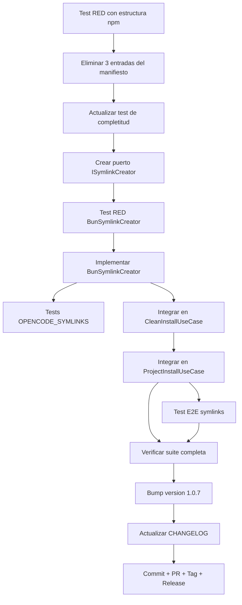

# Plan: Fase FEV-2-B — Resolución de Symlinks Rotos + Generación Post-Install (v1.0.7)

**Fecha:** 2026-06-26 | **Autor:** Moctezuma (Planner Agent) | **Estado:** 🟡 Plan Aprobado
**Versión objetivo:** v1.0.7
**Issue principal:** Bug residual post-v1.0.6 — symlinks no preservados por npm

---

## Overview

Tras el release de v1.0.6, el usuario reporta que `bunx @fisherk2-dev/codice@latest` aún falla con `Template file not found: .opencode/agents` en los tres modos (Clean, Project, Update).

**Causa raíz:** El template local tiene 3 symlinks en `template/obligatorio/.opencode/`:
- `.opencode/agents` → `../agents` (directorio real con 103 archivos .md)
- `.opencode/commands` → `../commands/`
- `.opencode/skills` → `../skills/`

npm **resuelve (dereference) symlinks al empaquetar el tarball**, por lo que estos 3 paths no existen en el paquete publicado. El manifiesto (`FileRuleManifestData.ts`) lista los 3 paths como obligatorios, y `TemplateResolver.resolvePath()` falla porque `fs.existsSync()` retorna `false` en todas las categorías.

**Decisión del usuario (2026-06-26):**
- **Enfoque dual:**
  1. **Eliminar las 3 entradas** del manifiesto (fixea el bug — los archivos reales ya están en `agents/`, `commands/`, `skills/` a nivel raíz).
  2. **Generar symlinks post-instalación** (recrea la estructura del dev workspace en el destino del usuario, manteniendo `.opencode/agents → ../agents` funcional).
- **Versión:** v1.0.7 (npm no permite republicar 1.0.6)
- **Razón:** Combina la solución mínima del bug con la mejora de UX (workspace final idéntico al dev).

**Objetivo:** Publicar v1.0.7 que funcione correctamente con `bunx` en los 3 modos, sin regresión, con estructura de workspace equivalente al dev, y cerrar el issue residual.

---

## Arquitectura de Decisiones (ADR-009)

| Decisión | Rationale |
|----------|-----------|
| **ADR-FEV2B-1**: Eliminar 3 entradas del manifiesto (`.opencode/agents`, `.opencode/commands`, `.opencode/skills`) | Los symlinks no existen en el tarball de npm. La raíz `agents/`, `commands/`, `skills/` ya cubre la copia de archivos. `opencode.json` no referencia paths explícitos, solo nombres de agentes. |
| **ADR-FEV2B-2**: NO reemplazar symlinks con directorios reales | Duplica 100+ archivos. El workspace instalado no necesita `.opencode/agents/` como directorio separado — la convención es que opencode busca agentes en `agents/` a nivel raíz. |
| **ADR-FEV2B-3**: Generar symlinks post-instalación como parte del instalador | El usuario quiere preservar la estructura del dev workspace. El instalador crea symlinks relativos en el destino: `.opencode/agents → ../agents`, `.opencode/commands → ../commands/`, `.opencode/skills → ../skills/`. Bun soporta `fs.symlink()` cross-platform. |
| **ADR-FEV2B-4**: Versión 1.0.7 (no parche sobre 1.0.6) | npm rechaza republicar la misma versión. Es un patch fix → 1.0.7 es correcto semánticamente. |
| **ADR-FEV2B-5**: Mantener branch `fix/symlinks-template-paths` | El branch anterior `fix/no-install-issue` tenía 11 commits ya squash-mergeados en main. Se eliminó (local + prune) y se creó uno limpio desde main. |
| **ADR-FEV2B-6**: Actualizar test de completitud para validar solo paths reales del tarball | El test `file-rule-manifest.test.ts` debe verificar que cada path del manifiesto existe en el paquete npm (simulando la estructura post-resolución de symlinks), no en el dev local. |
| **ADR-FEV2B-7**: SymlinkGenerator como adapter de infraestructura | Sigue Clean Architecture: puerto `ISymlinkCreator` en `application/ports/`, adaptador `BunSymlinkCreator` en `infrastructure/adapters/`. Aislable, mockeable en tests. |
| **ADR-FEV2B-8**: Symlinks solo en Clean Install y Project Install (no en Update) | Update Workspace preserva estructura existente. Si el usuario borró `.opencode/agents`, no debe restaurarse en update — solo en install inicial. |
| **ADR-FEV2B-9**: Symlinks idempotentes | Si el symlink ya existe (install previo), no se sobreescribe ni se reemplaza. Si el destino es un directorio real (usuario lo convirtió), se omite con warning. |
| **ADR-FEV2B-10**: Generar symlinks para `.devin/` si el usuario seleccionó `.devin` | `template/opcional/.devin/` tiene 7 symlinks: 2 a nivel directorio (`.devin/skills → ../skills`, `.devin/workflows → ../commands/`) y 5 dentro de `.devin/rules/` apuntando a `docs/`, `CONTRIBUTING.md`, y 3 archivos de `skills/`. Si el usuario NO selecciona `.devin` en Project Install, no se generan sus symlinks. **Nota:** el path del manifiesto cambia de `.devin/rules` a `.devin` para reflejar la copia completa del directorio (UX más claro). |
| **ADR-FEV2B-11**: Cambiar path del manifiesto de `.devin/rules` a `.devin` (UX) | El path actual `.devin/rules` es engañoso: el usuario ve solo "rules" en la TUI pero hay 2 symlinks hermanos (`.devin/skills`, `.devin/workflows`) y 5 symlinks dentro de `.devin/rules/`. Cambiar a `.devin` refleja la copia completa del directorio, elimina confusión, y agrupa toda la configuración de Devin como una sola unidad opcional. |

---

## Task Breakdown

### Phase 1: Diagnóstico RED (Bloqueante)

#### Task FEV2B-T0: Test RED que reproduce el fallo con symlinks
**Descripción:** Test que simule la estructura del paquete npm (sin symlinks) y verifique que `resolvePath(".opencode/agents")` falla con el manifiesto actual. El test debe ser RED con el código actual.

**Criterios de Aceptación:**
- [ ] Test crea directorio temporal con estructura:
  ```
  tmp/
  ├── template/
  │   ├── obligatorio/
  │   │   ├── agents/        (real dir)
  │   │   ├── commands/      (real dir)
  │   │   ├── skills/        (real dir)
  │   │   └── .opencode/
  │   │       └── plugins/   (solo esto, sin agents/commands/skills)
  │   └── opcional/
  ```
- [ ] Test invoca `TemplateResolver.resolvePath(".opencode/agents")` y espera throw.
- [ ] Test es RED con código actual (la entrada existe en el manifiesto).

**Verificación:**
- [ ] `bun test tests/integration/TemplateResolver.test.ts` — el test falla con error "Template file not found: .opencode/agents".

**Dependencias:** Ninguna.
**Archivos:**
- `tests/integration/TemplateResolver.test.ts` (nuevo test).

**Scope:** S (30min).

---

### Phase 2: Fix del Manifiesto

#### Task FEV2B-T1: Eliminar 3 entradas de symlinks del manifiesto
**Descripción:** Remover de `FileRuleManifestData.ts` las entradas para `.opencode/agents`, `.opencode/commands`, `.opencode/skills`. Estas referencian symlinks que no existen en el paquete npm.

**Criterios de Aceptación:**
- [ ] 3 entradas eliminadas de la sección OBLIGATORIO del `FILE_RULE_MANIFEST`.
- [ ] Entrada `.devin/rules` cambiada a `.devin` (per ADR-FEV2B-11, mejor UX).
- [ ] Total mandatory: 11 → 8.
- [ ] Total general: 35 → 32.
- [ ] Comentario explicativo añadido referenciando el ADR-009.
- [ ] Test FEV2B-T0 ahora pasa (GREEN).

**Verificación:**
- [ ] `bun test tests/integration/TemplateResolver.test.ts` — todos pasan.
- [ ] `just check` — 0 errores.

**Dependencias:** FEV2B-T0.
**Archivos:**
- `src/domain/entities/FileRuleManifestData.ts` (3 entradas eliminadas + comment).

**Scope:** XS (15min).

---

### Phase 3: Tests de Completitud Actualizados

#### Task FEV2B-T2: Actualizar test de completitud del manifiesto
**Descripción:** El test `file-rule-manifest.test.ts` cuenta archivos en `template/<categoría>/` y verifica que el manifest tenga al menos esa cantidad. Debe actualizarse para excluir los symlinks `.opencode/{agents,commands,skills}` del conteo de `obligatorio/` (porque no existen en el tarball de npm).

**Criterios de Aceptación:**
- [ ] Test modificado para filtrar symlinks al contar archivos en `obligatorio/`.
- [ ] Conteo esperado: 8 mandatory (después del fix), 11 standard, 13 optional.
- [ ] Test verifica que las entradas eliminadas NO existen en el manifiesto.
- [ ] Test sigue detectando cuando se añaden archivos al dir sin actualizar el manifest (regression guard).

**Verificación:**
- [ ] `bun test tests/unit/file-rule-manifest.test.ts` — todos pasan.
- [ ] Si comento una entrada válida del manifest, el test falla (guard funciona).

**Dependencias:** FEV2B-T1.
**Archivos:**
- `tests/unit/file-rule-manifest.test.ts` (modificado).

**Scope:** S (30min).

---

### Phase 4: Generador de Symlinks (Post-Install Feature)

#### Task FEV2B-T3: Crear puerto `ISymlinkCreator`
**Descripción:** Definir interfaz `ISymlinkCreator` en `src/application/ports/` siguiendo Clean Architecture. La interfaz declara un método para crear symlinks relativos en el destino.

**Criterios de Aceptación:**
- [ ] Nuevo archivo `src/application/ports/ISymlinkCreator.ts`.
- [ ] Interface exporta: `createSymlink(target: string, linkPath: string): Promise<Result<void, SymlinkError>>`.
- [ ] JSDoc con propósito, parámetros, errores.
- [ ] Tipo `SymlinkError` definido en `src/domain/types/SymlinkError.ts`.

**Verificación:**
- [ ] `just check` — 0 errores.
- [ ] `tsc --noEmit` — 0 errores.

**Dependencias:** FEV2B-T2.
**Archivos:**
- `src/application/ports/ISymlinkCreator.ts` (nuevo).
- `src/domain/types/SymlinkError.ts` (nuevo).

**Scope:** XS (20min).

---

#### Task FEV2B-T4: Test RED para `BunSymlinkCreator` (TDD)
**Descripción:** Crear tests que cubran: crear symlink nuevo, idempotencia (skip si ya existe), skip si es directorio real con warning, paths relativos correctos, error handling de `fs.symlink`.

**Criterios de Aceptación:**
- [ ] Archivo `tests/unit/adapters/bun-symlink-creator.test.ts`.
- [ ] 6+ tests cubriendo:
  1. Crea symlink nuevo: `fs.symlink` llamado con target y link correctos
  2. Idempotencia: si symlink ya existe, no se sobreescribe
  3. Skip directorio real: si `linkPath` es un directorio, skip con warning
  4. Paths relativos: usa paths relativos desde la ubicación del link
  5. Error de permisos: retorna `Result.err` con `SymlinkError`
  6. Verifica que el target existe antes de crear
- [ ] Tests son RED con código actual (la clase no existe).

**Verificación:**
- [ ] `bun test tests/unit/adapters/bun-symlink-creator.test.ts` — todos fallan porque la clase no existe.

**Dependencias:** FEV2B-T3.
**Archivos:**
- `tests/unit/adapters/bun-symlink-creator.test.ts` (nuevo).

**Scope:** S (45min).

---

#### Task FEV2B-T5: Implementar `BunSymlinkCreator` adapter (TDD GREEN)
**Descripción:** Crear clase `BunSymlinkCreator` en `src/infrastructure/adapters/` que implementa `ISymlinkCreator` usando `fs.symlinkSync` de Bun/Node.

**Criterios de Aceptación:**
- [ ] Archivo `src/infrastructure/adapters/BunSymlinkCreator.ts`.
- [ ] Implementa `ISymlinkCreator` con `fs.symlinkSync(target, linkPath)`.
- [ ] Verifica existencia del target antes de crear (seguridad).
- [ ] Verifica si el link ya existe (idempotencia).
- [ ] Verifica si el link es un directorio real (skip con warning).
- [ ] Usa paths relativos para portabilidad cross-platform.
- [ ] Captura errores de `EACCES`, `EEXIST`, `ENOENT` y los mapea a `SymlinkError`.
- [ ] Tests FEV2B-T4 ahora pasan (GREEN).
- [ ] Exporta también una lista `OPENCODE_SYMLINKS` con los 3 symlinks a crear:
  ```typescript
  export const OPENCODE_SYMLINKS: readonly SymlinkSpec[] = [
    { linkPath: ".opencode/agents", target: "../agents" },
    { linkPath: ".opencode/commands", target: "../commands/" },
    { linkPath: ".opencode/skills", target: "../skills/" },
  ];
  ```
- [ ] Exporta también una lista `DEVIN_SYMLINKS` con los 7 symlinks a crear (solo si el usuario seleccionó `.devin/rules`):
  ```typescript
  export const DEVIN_SYMLINKS: readonly SymlinkSpec[] = [
    { linkPath: ".devin/skills", target: "../skills" },
    { linkPath: ".devin/workflows", target: "../commands/" },
    { linkPath: ".devin/rules/CODE_STYLE.md", target: "../../docs/CODE_STYLE.md" },
    { linkPath: ".devin/rules/CONTRIBUTING.md", target: "../../CONTRIBUTING.md" },
    { linkPath: ".devin/rules/code-review-and-quality.md", target: "../../skills/code-review-and-quality/SKILL.md" },
    { linkPath: ".devin/rules/incremental-implementation.md", target: "../../skills/incremental-implementation/SKILL.md" },
    { linkPath: ".devin/rules/test-driven-development.md", target: "../../skills/test-driven-development/SKILL.md" },
  ];
  ```
- [ ] **Inventario total de symlinks en el template:** 10 (3 en `.opencode/`, 7 en `.devin/`). Ver ADR-FEV2B-10.

**Verificación:**
- [ ] `bun test tests/unit/adapters/bun-symlink-creator.test.ts` — todos pasan.
- [ ] `just check` — 0 errores.

**Dependencias:** FEV2B-T4.
**Archivos:**
- `src/infrastructure/adapters/BunSymlinkCreator.ts` (nuevo).

**Scope:** M (1h).

---

#### Task FEV2B-T6: Tests para `OPENCODE_SYMLINKS` y `DEVIN_SYMLINKS` constants
**Descripción:** Tests que validan que las constantes `OPENCODE_SYMLINKS` y `DEVIN_SYMLINKS` contienen los symlinks esperados, con paths válidos y targets correctos.

**Criterios de Aceptación:**
- [ ] Tests en `tests/unit/adapters/bun-symlink-creator.test.ts` o nuevo archivo.
- [ ] Verifica que `OPENCODE_SYMLINKS.length === 3` y contiene los 3 paths de `.opencode/`.
- [ ] Verifica que `DEVIN_SYMLINKS.length === 7` y contiene los 7 paths de `.devin/`.
- [ ] Verifica que todos los targets son relativos y apuntan a paths que existen en el template.
- [ ] Verifica que `OPENCODE_SYMLINKS` tiene `linkPath` que comienza con `.opencode/`.
- [ ] Verifica que `DEVIN_SYMLINKS` tiene `linkPath` que comienza con `.devin/`.

**Verificación:**
- [ ] `bun test` — todos pasan.

**Dependencias:** FEV2B-T5.
**Archivos:**
- `tests/unit/adapters/bun-symlink-creator.test.ts` (extendido).

**Scope:** XS (20min).

---

#### Task FEV2B-T7: Integrar `ISymlinkCreator` en `CleanInstallUseCase`
**Descripción:** Modificar `CleanInstallUseCase` para que, después de `commitStaging()`, invoque el `ISymlinkCreator` con `OPENCODE_SYMLINKS + DEVIN_SYMLINKS` (Clean Install copia TODO, incluyendo opcionales).

**Criterios de Aceptación:**
- [ ] `CleanInstallUseCase` recibe `ISymlinkCreator` por inyección de dependencias.
- [ ] Después de `commitStaging()` exitoso, llama a `symlinkCreator.createSymlinks([...OPENCODE_SYMLINKS, ...DEVIN_SYMLINKS])` (10 symlinks total).
- [ ] Si la creación de symlinks falla, no se hace rollback (los archivos ya están copiados). Se muestra warning al usuario.
- [ ] Tests del use case actualizados con mock de `ISymlinkCreator`.
- [ ] Test verifica que `createSymlinks` se llama con los 10 symlinks (3 opencode + 7 devin).

**Verificación:**
- [ ] `bun test tests/unit/clean-install.test.ts` — todos pasan.
- [ ] `just check` — 0 errores.

**Dependencias:** FEV2B-T5.
**Archivos:**
- `src/application/use-cases/CleanInstallUseCase.ts` (modificado).
- `tests/unit/clean-install.test.ts` (mock actualizado).

**Scope:** M (45min).

---

#### Task FEV2B-T8: Integrar `ISymlinkCreator` en `ProjectInstallUseCase`
**Descripción:** Misma integración que FEV2B-T7 pero para `ProjectInstallUseCase`. Los symlinks de `.devin/` solo se crean si el usuario seleccionó `.devin/rules`. NO integrar en `UpdateWorkspaceUseCase` (per ADR-FEV2B-8).

**Criterios de Aceptación:**
- [ ] `ProjectInstallUseCase` recibe `ISymlinkCreator` por inyección de dependencias.
- [ ] Después de `commitStaging()` exitoso:
  - Llama a `symlinkCreator.createSymlinks(OPENCODE_SYMLINKS)` (3 symlinks, siempre).
  - Si `.devin` está en `selectedOptionals`, llama a `symlinkCreator.createSymlinks(DEVIN_SYMLINKS)` (7 symlinks adicionales).
- [ ] Si `.devin` NO está seleccionado, NO se crean los 7 symlinks de `.devin/`.
- [ ] Tests del use case actualizados con mock de `ISymlinkCreator`.
- [ ] Test verifica: (a) caso con `.devin` seleccionado → 10 symlinks; (b) caso sin `.devin` → solo 3 symlinks.
- [ ] `UpdateWorkspaceUseCase` NO modificado (no incluye `ISymlinkCreator`).

**Verificación:**
- [ ] `bun test tests/unit/project-install.test.ts` — todos pasan (incluyendo 2 tests nuevos para los casos a/b).
- [ ] `bun test tests/unit/update-workspace.test.ts` — sin cambios, sigue pasando.
- [ ] `just check` — 0 errores.

**Dependencias:** FEV2B-T7.
**Archivos:**
- `src/application/use-cases/ProjectInstallUseCase.ts` (modificado).
- `tests/unit/project-install.test.ts` (mock + 2 tests nuevos).

**Scope:** M (1h).

---

### Phase 5: Tests E2E y Verificación

#### Task FEV2B-T9: Test E2E con symlinks (Clean Install)
**Descripción:** Crear test E2E que verifique que tras `Clean Install` con binario compilado, los 10 symlinks existen en el destino (3 de `.opencode/` + 7 de `.devin/`).

**Criterios de Aceptación:**
- [ ] Script `tests/e2e/07-symlinks-clean-install.sh`:
  1. Crea directorio temporal vacío.
  2. Ejecuta binario compilado en modo Clean Install (con `--force` o input simulado).
  3. Verifica que existen los 3 symlinks de `.opencode/`:
     - `dest/.opencode/agents` (symlink → `../agents`)
     - `dest/.opencode/commands` (symlink → `../commands/`)
     - `dest/.opencode/skills` (symlink → `../skills/`)
  4. Verifica que existen los 7 symlinks de `.devin/` (Clean Install copia TODO):
     - `dest/.devin/skills` (symlink → `../skills`)
     - `dest/.devin/workflows` (symlink → `../commands/`)
     - `dest/.devin/rules/CODE_STYLE.md` (symlink → `../../docs/CODE_STYLE.md`)
     - `dest/.devin/rules/CONTRIBUTING.md` (symlink → `../../CONTRIBUTING.md`)
     - `dest/.devin/rules/code-review-and-quality.md` (symlink → `../../skills/code-review-and-quality/SKILL.md`)
     - `dest/.devin/rules/incremental-implementation.md` (symlink → `../../skills/incremental-implementation/SKILL.md`)
     - `dest/.devin/rules/test-driven-development.md` (symlink → `../../skills/test-driven-development/SKILL.md`)
  5. Verifica que los symlinks resuelven correctamente (los targets existen).
- [ ] Script integrado en `just test-e2e`.
- [ ] Total E2E: 7/7 pasando.

**Verificación:**
- [ ] `just test-e2e` — 7/7 escenarios.
- [ ] Output captura los 10 symlinks creados.

**Dependencias:** FEV2B-T8.
**Archivos:**
- `tests/e2e/07-symlinks-clean-install.sh` (nuevo).
- `Justfile` (recipe `test-e2e` actualizada).

**Scope:** M (1h 15min).

---

#### Task FEV2B-T10: Verificar suite completa
**Descripción:** Verificar que no hay regresión con todos los tests unit + integration + e2e.

**Criterios de Aceptación:**
- [ ] `bun test` — 390+ pass, 0 fail (sin regresión, +8 tests de symlinks).
- [ ] `just check` — 0 errores (biome ci + tsc --noEmit).
- [ ] E2E: 7/7 pasando.
- [ ] Coverage: ≥97.66% funciones / ≥96.52% líneas (sin pérdida).
- [ ] Domain coverage: 100% líneas (mantener).

**Verificación:**
- [ ] `bun test --coverage` — sin pérdida de coverage.

**Dependencias:** FEV2B-T8, FEV2B-T9.
**Archivos:** (ninguno, solo verificación).

**Scope:** XS (10min).

---

### Phase 6: Release

#### Task FEV2B-T11: Bump version a 1.0.7
**Descripción:** Actualizar `package.json` de `1.0.5` a `1.0.7` (patch fix, no se puede republicar 1.0.6).

**Criterios de Aceptación:**
- [ ] `package.json` → `"version": "1.0.7"`.
- [ ] Commit con mensaje: `chore: bump version to 1.0.7`.

**Verificación:**
- [ ] `git diff package.json` muestra solo el bump de versión.

**Dependencias:** FEV2B-T10.
**Archivos:**
- `package.json`.

**Scope:** XS (5min).

---

#### Task FEV2B-T12: Actualizar CHANGELOG con sección v1.0.7
**Descripción:** Crear entrada `[1.0.7] — 2026-06-26` con la descripción del fix + nueva feature.

**Criterios de Aceptación:**
- [ ] `CHANGELOG.md`:
  - Header `[1.0.7] — 2026-06-26`.
  - Entry `Fixed`: "Symlinks no preservados por npm: 3 entradas de `.opencode/{agents,commands,skills}` eliminadas del manifiesto (eran symlinks locales que no se incluyen en el tarball)".
  - Entry `Added`: "Generación de symlinks post-instalación: tras Clean Install o Project Install, se crean symlinks `.opencode/{agents,commands,skills} → ../{agents,commands,skills}/` para preservar la estructura del dev workspace".
- [ ] Entry `Deprecated`: "v1.0.6 — usar v1.0.7".

**Verificación:**
- [ ] `git diff CHANGELOG.md` muestra la nueva sección.

**Dependencias:** FEV2B-T11.
**Archivos:**
- `CHANGELOG.md`.

**Scope:** XS (5min).

---

#### Task FEV2B-T13: Commit + Push + PR + Tag + Release
**Descripción:** Hacer commit de los cambios, pushear, crear PR, hacer merge, tag, release pipeline.

**Criterios de Aceptación:**
- [ ] Commit: `fix(manifest): remove symlink entries + feat(symlinks): post-install generation (#10)`.
- [ ] `git push origin fix/symlinks-template-paths`.
- [ ] PR creado en GitHub contra `main`.
- [ ] CI pasa (3 platforms: Linux, macOS, Windows).
- [ ] Squash merge a `main`.
- [ ] `git tag -a v1.0.7 -m "Release v1.0.7 — Symlink fix + post-install generation"`.
- [ ] `git push origin v1.0.7` → release pipeline ejecuta.
- [ ] `npm view @fisherk2-dev/codice version` → `1.0.7`.
- [ ] `gh release view v1.0.7` muestra 4 assets (linux, macos, windows.exe, checksums).
- [ ] `git checkout develop && git merge main` (fast-forward).
- [ ] `git push origin develop`.
- [ ] Branch local `fix/symlinks-template-paths` eliminado.

**Verificación:**
- [ ] GitHub Release: https://github.com/Fisherk2/codice-opencode/releases/tag/v1.0.7
- [ ] npm: `@fisherk2-dev/codice@1.0.7` es el `latest`.

**Dependencias:** FEV2B-T12.
**Archivos:** (git only).

**Scope:** S (15min).

---

## Dependency Graph



---

## Checkpoints

### Checkpoint 1: After FEV2B-T1 (Fix del manifiesto)
- [ ] `FileRuleManifestData.ts` sin las 3 entradas de symlinks.
- [ ] Test FEV2B-T0 pasa (GREEN).
- [ ] `just check` — 0 errores.

### Checkpoint 2: After FEV2B-T5 (SymlinkCreator implementado)
- [ ] `ISymlinkCreator` port creado.
- [ ] `BunSymlinkCreator` adapter implementado.
- [ ] `OPENCODE_SYMLINKS` constant exportada.
- [ ] 6+ tests pasando.
- [ ] `just check` — 0 errores.

### Checkpoint 3: After FEV2B-T8 (Symlinks integrados en use cases)
- [ ] `CleanInstallUseCase` genera symlinks post-commit.
- [ ] `ProjectInstallUseCase` genera symlinks post-commit.
- [ ] `UpdateWorkspaceUseCase` NO modificado.
- [ ] Tests de use cases pasan.
- [ ] `just check` — 0 errores.

### Checkpoint 4: After FEV2B-T10 (Verificación integral)
- [ ] `bun test`: 390+ pass, 0 fail.
- [ ] Coverage sin pérdida.
- [ ] E2E: 7/7 pasando.

### Gate FEV-2-B: After FEV2B-T13 (Release publicado)
- [ ] `npm view @fisherk2-dev/codice version` → `1.0.7`.
- [ ] GitHub Release con 4 assets.
- [ ] CHANGELOG actualizado.
- [ ] Issue residual cerrado.

---

## Riesgos y Mitigaciones

| Riesgo | Impacto | Mitigación |
|--------|---------|------------|
| **Eliminación de entradas causa regresión en dev local** | Bajo | Los symlinks locales siguen funcionando. El fix solo afecta el paquete npm. `just dev` (modo source) no usa `resolvePath` con la misma lógica. |
| **Test de completitud demasiado estricto** | Medio | El test cuenta archivos del filesystem local, no del tarball. Ajustar para filtrar symlinks al contar. |
| **v1.0.7 falla con un nuevo bug residual** | Alto | E2E con binario compilado antes de release. Test manual con `bunx @fisherk2-dev/codice@1.0.7` desde directorio limpio. |
| **PR no pasa CI en Windows por path separator** | Bajo | El fix FEV-2 anterior ya normalizó paths con `path.sep`. No debería haber regresión. |
| **Conflicto con develop al hacer merge** | Bajo | develop está sincronizado con main en `6ba9ee6`. Fast-forward merge sin conflictos. |
| **`fs.symlink` falla en Windows por permisos** | Medio | Bun soporta symlinks en Windows con permisos de admin o Developer Mode. Si falla, warning al usuario y continúa (no es bloqueante). Tests E2E en Windows CI validan. |
| **Symlink creation deja workspace inconsistente** | Bajo | ADR-FEV2B-9: idempotencia. Si el symlink ya existe o es un directorio real, skip con warning. Los archivos reales ya están copiados por el flujo principal. |
| **`OPENCODE_SYMLINKS` desactualizado** | Bajo | Constante exportada desde `BunSymlinkCreator.ts`. Test FEV2B-T6 verifica que los 3 paths existen en el template. Si se añade un nuevo symlink, se actualiza la constante y el test. |

---

## Métricas Objetivo

| Métrica | v1.0.6 (actual) | Meta v1.0.7 |
|---------|-----------------|-------------|
| Tests (pass/fail) | 382 / 0 | ≥395 / 0 (+13 tests symlinks) |
| Coverage (funciones) | 97.66% | ≥97.66% |
| Coverage (líneas) | 96.52% | ≥96.52% |
| E2E escenarios | 6/6 | 7/7 (+1 symlinks) |
| `just check` errores | 0 | 0 |
| Manifest entries (total) | 35 | 32 |
| Manifest entries (mandatory) | 11 | 8 |
| Symlinks generados en Clean Install | 0 | 10 (3 opencode + 7 devin) |
| Symlinks generados en Project Install | 0 | 3-10 (según selección) |
| Symlinks en Update Workspace | 0 | 0 (preserva existente) |
| Issues críticos abiertos | 1 (residual) | 0 |

---

## Resumen de Esfuerzo

| Tarea | Scope | Esfuerzo |
|-------|-------|----------|
| FEV2B-T0: Test RED con estructura npm | S | 30min |
| FEV2B-T1: Eliminar 3 entradas del manifiesto | XS | 15min |
| FEV2B-T2: Actualizar test de completitud | S | 30min |
| FEV2B-T3: Crear puerto ISymlinkCreator | XS | 20min |
| FEV2B-T4: Test RED BunSymlinkCreator | S | 45min |
| FEV2B-T5: Implementar BunSymlinkCreator | M | 1h |
| FEV2B-T6: Tests OPENCODE_SYMLINKS + DEVIN_SYMLINKS | XS | 20min |
| FEV2B-T7: Integrar en CleanInstallUseCase | M | 45min |
| FEV2B-T8: Integrar en ProjectInstallUseCase (10/3 symlinks según selección) | M | 1h |
| FEV2B-T9: Test E2E con 10 symlinks | M | 1h 15min |
| FEV2B-T10: Verificar suite completa | XS | 10min |
| FEV2B-T11: Bump version 1.0.7 | XS | 5min |
| FEV2B-T12: Actualizar CHANGELOG | XS | 5min |
| FEV2B-T13: Commit + PR + Tag + Release | S | 15min |
| **Total** | | **~7h 10min** |

---

## Verificación Post-Release

Después de publicar v1.0.7, verificar manualmente con:

```bash
# Test 1: Clean Install
mkdir -p /tmp/test-codice && cd /tmp/test-codice
bunx @fisherk2-dev/codice@1.0.7
# → Seleccionar "Clean Install" → debe completar sin error
# → Verificar: ls -la .opencode/ debe mostrar 3 symlinks (agents, commands, skills)
# → Verificar: readlink .opencode/agents debe retornar ../agents

# Test 2: Project Install (con opcionales)
mkdir -p /tmp/test-codice2 && cd /tmp/test-codice2
bunx @fisherk2-dev/codice@1.0.7
# → Seleccionar "Project Install" → seleccionar docs/opencode → debe completar
# → Verificar symlinks igual que Test 1

# Test 3: Update Workspace
mkdir -p /tmp/test-codice3 && cd /tmp/test-codice3
git init && bunx @fisherk2-dev/codice@1.0.7
# → Seleccionar "Update Workspace" → debe completar
# → Update NO crea symlinks (preserva estructura existente)
```

**Criterios de éxito:**
- [ ] Los 3 modos funcionan sin `Template file not found`.
- [ ] Tras Clean/Project Install, existen los 3 symlinks en `.opencode/`.
- [ ] Los symlinks resuelven correctamente a los directorios reales.
- [ ] Tras Update, los symlinks NO se modifican (si existían, se preservan; si no, no se crean).

---

*Última actualización: 2026-06-26*
