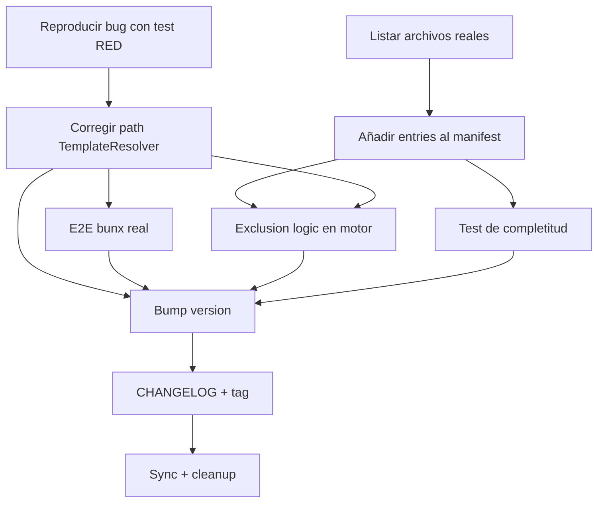

# Plan: Fase FEV-2 — Resolución de Issue #8 (v1.0.6)

**Fecha:** 2026-06-25 | **Autor:** Moctezuma (Planner Agent) | **Estado:** 🟡 Plan Aprobado
**Versión objetivo:** v1.0.6
**Issue principal:** #8 (CRITICAL) — `bunx @fisherk2-dev/codice` falla con `Template file not found: opencode.json`

---

## Overview

Resolver el **Issue #8** (crítico) detectado tras el release de v1.0.5. La causa raíz es un path relativo incorrecto en `TemplateResolver.detectTemplateRoot()`: como el método reside en `src/infrastructure/adapters/`, `import.meta.dir` apunta allí, y `../../template` resuelve a `src/template` (inexistente) en vez de a la raíz del paquete. Se requiere ajustar la ruta a `../../../template` y añadir tests que cubran la estructura real del paquete npm.

**Adicionalmente**, la issue reporta que la checklist de opcionales en "Project Install" no muestra todos los archivos elegibles de `template/opcional/`. El `FileRuleManifestData.ts` solo lista 9 opcionales cuando en realidad hay 28+ archivos en el directorio. Esto requiere:

1. Añadir las entradas faltantes al manifest (incluyendo `docs/opencode/` como directorio opcional único).
2. Implementar lógica de exclusión en el motor de copia: `docs/` (estándar) debe excluir `docs/opencode/` (opcional) para evitar copia doble.
3. Añadir test de completitud que detecte cuando se agreguen archivos al dir sin actualizar el manifest.

**Objetivo:** Publicar v1.0.6 con el fix verificado en `bunx` desde un directorio vacío, manifest completo, sin regresiones.

---

## Arquitectura de Decisiones (ADR-008)

| Decisión | Rationale |
|----------|-----------|
| **ADR-FEV2-1**: Corregir ruta relativa de `../../template` a `../../../template` en `TemplateResolver.detectTemplateRoot()` | `import.meta.dir` apunta a `src/infrastructure/adapters/` (no a `src/cli/`), por lo que se necesita un nivel adicional para alcanzar la raíz del paquete. |
| **ADR-FEV2-2**: Validar la corrección con un test que verifique el path resuelto al directorio `template/` en el paquete npm | Asegura que el fix funciona en el contexto real de `bunx`, no solo en desarrollo local. |
| **ADR-FEV2-3**: Añadir las 13+ entradas faltantes al `FileRuleManifestData` para reflejar todos los archivos de `template/opcional/` | La issue #8 reporta que la checklist no muestra todos los elegibles. Solución: completeness. |
| **ADR-FEV2-4**: `docs/opencode/` se lista como un solo item opcional (no archivos individuales) | Reduce la lista de 13 items a 1. Decisión del usuario. |
| **ADR-FEV2-5**: Incluir archivos y directorios ocultos (`.gitmessage`, `.opencode/plugins/sdd-workflow-test.md`, `.devin/rules`) en el manifest | Decisión del usuario: máxima flexibilidad. |
| **ADR-FEV2-6**: Implementar lógica de exclusión en el motor de copia: `docs/` (estándar) excluye `docs/opencode/` (opcional) | Evita copia doble cuando el usuario elige no instalar `docs/opencode/`. |
| **ADR-FEV2-7**: Test de completitud por categoría que cuente archivos en `template/<categoría>/` y verifique que el manifest tenga al menos esa cantidad | Detecta automáticamente cuando se agreguen archivos al dir sin actualizar el manifest (regression guard). |

---

## Task Breakdown

### Phase 1: Diagnóstico del Template Path (Bloqueante)

#### Task FEV2-T0: Reproducir bug del template path con test RED
**Descripción:** Crear un test que simule la estructura real del paquete npm (`src/infrastructure/adapters/TemplateResolver.ts` + `template/` en la raíz) y confirme que el `detectTemplateRoot()` actual produce `src/template` en vez de `template/`.

**Criterios de Aceptación:**
- [ ] Test que cree un directorio temporal con estructura:
  ```
  tmp/
  ├── template/obligatorio/opencode.json
  └── src/infrastructure/adapters/TemplateResolver.ts (mock)
  ```
- [ ] Test verifica que `detectTemplateRoot()` retorna la ruta del `template/` (debe fallar con el código actual, pasar con el fix).
- [ ] Test es RED con el código actual, GREEN después del fix.

**Verificación:**
- [ ] `bun test` — el test falla con error "Template not found" o path incorrecto.

**Dependencias:** Ninguna.
**Archivos:**
- `tests/integration/TemplateResolver.test.ts` (nuevo test).

**Scope:** S (30min).

---

#### Task FEV2-T1: Corregir ruta en `TemplateResolver.detectTemplateRoot()`
**Descripción:** Cambiar la ruta de source mode de `../../template` a `../../../template`.

**Criterios de Aceptación:**
- [ ] `src/infrastructure/adapters/TemplateResolver.ts` línea 52 corregida.
- [ ] JSDoc actualizado para reflejar el path real (`src/infrastructure/adapters/` + 3 niveles).
- [ ] Test FEV2-T0 ahora pasa (GREEN).

**Verificación:**
- [ ] `bun test tests/integration/TemplateResolver.test.ts` — todos pasan.
- [ ] `just check` — 0 errores.

**Dependencias:** FEV2-T0.
**Archivos:**
- `src/infrastructure/adapters/TemplateResolver.ts`.

**Scope:** XS (15min).

---

#### Task FEV2-T2: Test E2E con bunx real en directorio limpio
**Descripción:** Crear un script E2E que simule la instalación vía `bunx` en un directorio temporal vacío y verifique que los 3 modos (Clean, Project, Update) funcionan sin el error "Template not found".

**Criterios de Aceptación:**
- [ ] Script `tests/e2e/07-bunx-template-resolution.sh` que:
  1. Crea un directorio temporal vacío.
  2. Ejecuta `bunx @fisherk2-dev/codice@<version-dev>` o el binario compilado.
  3. Para cada modo, verifica que no aparece "Template file not found".
- [ ] Script integrado en `just test-e2e`.

**Verificación:**
- [ ] `just test-e2e` — 7/7 escenarios pasando (6 anteriores + nuevo).
- [ ] Output captura: "Template file not found" no aparece en ningún modo.

**Dependencias:** FEV2-T1.
**Archivos:**
- `tests/e2e/07-bunx-template-resolution.sh` (nuevo).
- `tests/e2e/common.sh` (helpers actualizados si es necesario).

**Scope:** M (1h).

---

### Phase 2: Completar Manifest de Opcionales

#### Task FEV2-T3: Listar todos los archivos reales de `template/opcional/`
**Descripción:** Hacer un inventario completo de archivos y directorios en `template/opcional/` (incluyendo ocultos) para usarlos como referencia al actualizar el manifest.

**Criterios de Aceptación:**
- [ ] Lista exhaustiva de archivos/dirs generada con `find template/opcional -mindepth 1`.
- [ ] Lista categorizada (archivos sueltos vs directorios vs ocultos).

**Verificación:**
- [ ] Documento de inventario en el commit message o en un comment en el código.

**Dependencias:** Ninguna (puede hacerse en paralelo con FEV2-T0).
**Archivos:** (ninguno, solo inventario).

**Scope:** XS (5min).

---

#### Task FEV2-T4: Añadir entradas faltantes al `FileRuleManifestData`
**Descripción:** Actualizar el `FileRuleManifestData.ts` con todas las entradas que faltan para reflejar los archivos reales en `template/opcional/`. Las entradas nuevas son:

| Path | Categoría | Descripción |
|------|-----------|-------------|
| `.gitmessage` | optional | Git commit message template; team-specific customization |
| `docs/opencode` | optional | Complete OpenCode configuration guides; user may not need all |
| `Justfile` | optional | ✅ (ya existe) |
| `Makefile` | optional | ✅ (ya existe) |
| `requirements.txt` | optional | ✅ (ya existe) |
| `scripts` | optional | ✅ (ya existe) |
| `Dockerfile` | optional | ✅ (ya existe) |
| `docker-compose.yml` | optional | ✅ (ya existe) |
| `docs/DESIGN.md` | optional | ✅ (ya existe) |
| `docs/SCHEMA.md` | optional | ✅ (ya existe) |
| `specs/design` | optional | ✅ (ya existe) |
| `.opencode/plugins/sdd-workflow-test.md` | optional | Workflow test specs; only for SDD pipeline validation |
| `.devin/rules` | optional | Devin rules for AI agent; team-specific |

**Criterios de Aceptación:**
- [ ] 4 nuevas entradas añadidas al array `FILE_RULE_MANIFEST` en categoría `optional`.
- [ ] Total de opcionales: 9 (actuales) + 4 (nuevas) = 13.
- [ ] Orden: alfabético por `path` para consistencia.

**Verificación:**
- [ ] `bun test` — tests existentes siguen pasando.
- [ ] Test FEV2-T6 (completitud) pasa.

**Dependencias:** FEV2-T3.
**Archivos:**
- `src/domain/entities/FileRuleManifestData.ts` (4 entradas nuevas).

**Scope:** S (30min).

---

### Phase 3: Lógica de Exclusión

#### Task FEV2-T5: Implementar exclusion logic en motor de copia
**Descripción:** El motor de copia debe excluir `docs/opencode/` cuando copia `docs/` (estándar), para evitar copia doble. Similar a como Git excluye `.git` o como GitHub Actions excluye `node_modules`.

**Criterios de Aceptación:**
- [ ] El motor de copia (`BunFileSystem.stageFile` o `walkDirectory` en `directoryWalker.ts`) soporta un patrón de exclusión opcional.
- [ ] Cuando se copia `docs/` (estándar), se excluye `docs/opencode/`.
- [ ] Si el usuario eligió `docs/opencode/` (opcional), se copia desde su entrada individual.
- [ ] Sin copia doble del directorio.

**Verificación:**
- [ ] Test unitario que verifica que copiar `docs/` no incluye `docs/opencode/`.
- [ ] Test E2E con selección de `docs/opencode` opcional verifica que aparece una sola vez en destino.
- [ ] `just check` — 0 errores.

**Dependencias:** FEV2-T1, FEV2-T4.
**Archivos:**
- `src/infrastructure/adapters/directoryWalker.ts` (añadir `excludePaths` param).
- `src/application/use-cases/ProjectInstallUseCase.ts` (o donde se invoca el walker).

**Scope:** M (1h 30min).

---

### Phase 4: Tests de Completitud

#### Task FEV2-T6: Test de completitud por categoría
**Descripción:** Crear un test que cuenta archivos en `template/<categoría>/` y verifica que el manifest tenga al menos esa cantidad de entries en esa categoría. Detecta automáticamente cuando se agreguen archivos al dir sin actualizar el manifest.

**Criterios de Aceptación:**
- [ ] Test que:
  1. Hace `fs.readdirSync` recursivo en `template/opcional/` (incluyendo ocultos).
  2. Cuenta el número de archivos y directorios de primer nivel.
  3. Verifica que `FILE_RULE_MANIFEST.filter(r => r.category === 'optional').length >= archivos_contados`.
- [ ] Test se ejecuta en CI.
- [ ] Si se añade un archivo a `template/opcional/` sin actualizar el manifest, el test falla.

**Verificación:**
- [ ] `bun test` — nuevo test pasa con manifest actualizado.
- [ ] Si comento una entrada del manifest, el test falla (regression guard funciona).

**Dependencias:** FEV2-T4.
**Archivos:**
- `tests/unit/file-rule-manifest.test.ts` (nuevo).

**Scope:** S (45min).

---

### Phase 5: Release

#### Task FEV2-T7: Bump version a 1.0.6
**Descripción:** Actualizar `package.json` de `1.0.5` a `1.0.6` (patch increment, fix crítico).

**Criterios de Aceptación:**
- [ ] `package.json` → `"version": "1.0.6"`.
- [ ] Commit con mensaje: `chore: bump version to 1.0.6`.

**Verificación:**
- [ ] `git diff package.json` muestra solo el bump de versión.

**Dependencias:** FEV2-T1, FEV2-T2, FEV2-T4, FEV2-T5, FEV2-T6.
**Archivos:**
- `package.json`.

**Scope:** XS (5min).

---

#### Task FEV2-T8: Actualizar CHANGELOG y crear tag
**Descripción:** Mover `[Unreleased]` a `[1.0.6] — 2026-06-25`. Crear tag anotado y pushear.

**Criterios de Aceptación:**
- [ ] `CHANGELOG.md`:
  - Header `[1.0.6] — 2026-06-25` con entry de Issue #8.
  - Entry adicional: "Manifest de opcionales completo: 4 entradas añadidas (docs/opencode, .gitmessage, .opencode/plugins/sdd-workflow-test.md, .devin/rules)".
  - Entry adicional: "Lógica de exclusión en motor de copia: docs/ estándar excluye docs/opencode/ opcional".
- [ ] `git tag -a v1.0.6 -m "Release v1.0.6 — Issue #8 (bunx + manifest)"`.
- [ ] `git push origin v1.0.6`.

**Verificación:**
- [ ] `git tag -l "v1.0.*"` muestra `v1.0.6`.
- [ ] GitHub Actions `release.yml` se ejecuta.

**Dependencias:** FEV2-T7.
**Archivos:**
- `CHANGELOG.md`.

**Scope:** S (10min).

---

#### Task FEV2-T9: Verificar release + sync main → develop + cleanup
**Descripción:** Confirmar publicación, merge main a develop, eliminar branches de feature.

**Criterios de Aceptación:**
- [ ] `npm view @fisherk2-dev/codice version` retorna `1.0.6`.
- [ ] `gh release view v1.0.6` muestra 4 assets (linux, macos, windows.exe, checksums).
- [ ] `git checkout develop && git merge main` (fast-forward).
- [ ] `git push origin develop`.
- [ ] `git branch -d fix/no-install-issue` (local).
- [ ] `git push origin --delete fix/no-install-issue` (remote).
- [ ] Solo `main` y `develop` quedan.

**Verificación:**
- [ ] `git branch` muestra solo `main` y `develop`.
- [ ] `git branch -r` muestra solo `origin/main` y `origin/develop`.

**Dependencias:** FEV2-T8.
**Archivos:** (git only).

**Scope:** S (10min).

---

## Dependency Graph



---

## Checkpoints

### Checkpoint 1: After FEV2-T1 (Template path fix)
- [ ] `TemplateResolver.ts` corregido con `../../../template`.
- [ ] Tests existentes pasan sin regresión.
- [ ] `just check` — 0 errores.

### Checkpoint 2: After FEV2-T4 + FEV2-T6 (Manifest completo)
- [ ] 13+ entradas opcionales en el manifest.
- [ ] Test de completitud pasa.
- [ ] Coverage ≥97.66%.

### Checkpoint 3: After FEV2-T5 (Exclusion logic)
- [ ] `docs/` no copia `docs/opencode/`.
- [ ] Selección de `docs/opencode` opcional funciona.
- [ ] Sin copia doble.

### Checkpoint 4: After FEV2-T2 (E2E bunx)
- [ ] 7/7 E2E escenarios pasando.
- [ ] No "Template file not found" en output.

### Gate FEV-2: After FEV2-T8 (Release publicado)
- [ ] `npm view @fisherk2-dev/codice version` → `1.0.6`.
- [ ] GitHub Release con 4 assets.
- [ ] CHANGELOG actualizado.

---

## Riesgos y Mitigaciones

| Riesgo | Impacto | Mitigación |
|--------|---------|------------|
| **Fix de path rompe compiled mode** | Alto | Test E2E 03 (compiled binary) debe seguir pasando después de FEV2-T1. |
| **Exclusion logic rompe copia de docs/** | Alto | Tests unitarios de FileRuleManifest + E2E con selección explícita. |
| **Manifest incompleto sigue después del fix** | Medio | Test FEV2-T6 detecta automáticamente. |
| **Publicación falla por versión duplicada** | Bajo | El `release.yml` maneja "cannot publish over previously published version". |
| **`bunx` real prueba versión de npm, no el fix local** | Medio | El E2E usa binario local (compilado) o versión dev con `npm link`. |

---

## Métricas Objetivo

| Métrica | v1.0.5 (actual) | Meta v1.0.6 |
|---------|-----------------|-------------|
| Tests (pass/fail) | 382 / 0 | ≥382 / 0 |
| Coverage (funciones) | 97.66% | ≥97.66% |
| Coverage (líneas) | 96.52% | ≥96.52% |
| E2E escenarios | 6/6 | 7/7 (nuevo 07-bunx) |
| `just check` errores | 0 | 0 |
| Manifest opcionales (entries) | 9 | 13+ |
| Issues críticos abiertos | 1 (#8) | 0 |

---

## Resumen de Esfuerzo

| Tarea | Scope | Esfuerzo |
|-------|-------|----------|
| FEV2-T0: Reproducir bug con test RED | S | 30min |
| FEV2-T1: Corregir path | XS | 15min |
| FEV2-T2: E2E bunx real | M | 1h |
| FEV2-T3: Listar archivos reales | XS | 5min |
| FEV2-T4: Añadir entries al manifest | S | 30min |
| FEV2-T5: Exclusion logic | M | 1h 30min |
| FEV2-T6: Test de completitud | S | 45min |
| FEV2-T7: Bump version | XS | 5min |
| FEV2-T8: CHANGELOG + tag | S | 10min |
| FEV2-T9: Sync + cleanup | S | 10min |
| **Total** | | **~5h 50min** |

---

*Última actualización: 2026-06-25*
