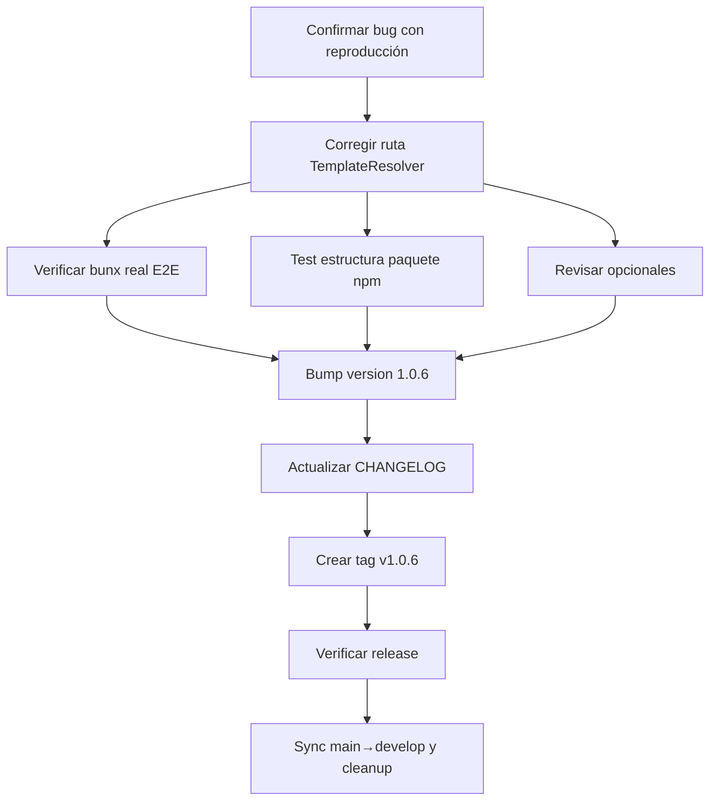

# Plan: Fase FEV-2 — Resolución de Issue #8 (v1.0.6)

**Fecha:** 2026-06-25 | **Autor:** Moctezuma (Planner Agent) | **Estado:** 🟡 Plan Aprobado
**Versión objetivo:** v1.0.6
**Issue principal:** #8 (CRITICAL) — `bunx @fisherk2-dev/codice` falla con `Template file not found: opencode.json`

---

## Overview

Resolver el **Issue #8** (crítico) detectado tras el release de v1.0.5. La causa raíz es un path relativo incorrecto en `TemplateResolver.detectTemplateRoot()`: como el método reside en `src/infrastructure/adapters/`, `import.meta.dir` apunta allí, y `../../template` resuelve a `src/template` (inexistente) en vez de a la raíz del paquete. Se requiere ajustar la ruta a `../../../template` y añadir tests que cubran la estructura real del paquete npm.

**Objetivo:** Publicar v1.0.6 con el fix verificado en `bunx` desde un directorio vacío, sin regresiones.

---

## Arquitectura de Decisiones (ADR-008)

| Decisión | Rationale |
|----------|-----------|
| **ADR-FEV2-1**: Corregir ruta relativa de `../../template` a `../../../template` en `TemplateResolver.detectTemplateRoot()` | `import.meta.dir` apunta a `src/infrastructure/adapters/` (no a `src/cli/`), por lo que se necesita un nivel adicional para alcanzar la raíz del paquete. |
| **ADR-FEV2-2**: Validar la corrección con un test que verifique el path resuelto al directorio `template/` en el paquete npm | Asegura que el fix funciona en el contexto real de `bunx`, no solo en desarrollo local. |
| **ADR-FEV2-3**: Revisar el manifiesto de archivos opcionales para evitar selección de directorios o archivos no-deseados | La issue #8 también menciona que `Project Install` muestra `scripts/`, `Makefile`, `requirements.txt` como opcionales; estos deberían clasificarse correctamente. |

---

## Task Breakdown

### Phase 1: Diagnóstico Confirmado

#### Task FEV2-T0: Confirmar causa raíz con reproducción aislada
**Descripción:** Antes de aplicar el fix, documentar la reproducción del bug con un script temporal que simule la estructura del paquete npm (`src/infrastructure/adapters/TemplateResolver.ts` ejecutado desde el contexto bunx) y confirme que `detectTemplateRoot()` produce `src/template` en vez de `template/`.

**Criterios de Aceptación:**
- [ ] Script de reproducción en `tests/integration/TemplateResolver.test.ts` que simule `import.meta.dir` apuntando a `src/infrastructure/adapters/`.
- [ ] Output documentado en el commit message del fix.
- [ ] Confirmación de que el path actual produce `src/template` (bug) y el path corregido produce `template/` (fix).

**Verificación:**
- [ ] Test RED: el path actual falla con `template not found`.
- [ ] Documentación del bug en el commit message.

**Dependencias:** Ninguna.
**Archivos:**
- `tests/integration/TemplateResolver.test.ts` (nuevo test que reproduce el bug).

**Scope:** S (30min).

---

### Phase 2: Fix del Template Path

#### Task FEV2-T1: Corregir ruta relativa en `TemplateResolver.detectTemplateRoot()`
**Descripción:** Cambiar la ruta de source mode de `../../template` a `../../../template` en `TemplateResolver.detectTemplateRoot()` para reflejar la ubicación real del archivo (`src/infrastructure/adapters/`).

**Criterios de Aceptación:**
- [ ] Línea 52 de `src/infrastructure/adapters/TemplateResolver.ts` corregida.
- [ ] JSDoc actualizado para reflejar el path real (`src/infrastructure/adapters/` + 3 niveles).
- [ ] Tests existentes siguen pasando.

**Verificación:**
- [ ] `bun test tests/integration/TemplateResolver.test.ts` — todos pasan.
- [ ] Test RED previo ahora pasa (GREEN).
- [ ] `just check` — 0 errores.

**Dependencias:** FEV2-T0 (confirmación del bug).
**Archivos:**
- `src/infrastructure/adapters/TemplateResolver.ts` (1 línea modificada + JSDoc).

**Scope:** XS (15min).

---

#### Task FEV2-T2: Añadir test específico para estructura del paquete npm
**Descripción:** Añadir un test que simule la estructura real del paquete npm publicado (`node_modules/@fisherk2-dev/codice/` con `src/infrastructure/adapters/TemplateResolver.ts` y `template/` en la raíz) y verifique que `detectTemplateRoot()` retorna la ruta correcta al directorio `template/`.

**Criterios de Aceptación:**
- [ ] Test que cree un directorio temporal con estructura: `template/obligatorio/opencode.json` y `src/infrastructure/adapters/TemplateResolver.ts` (mock).
- [ ] Verificación de que `detectTemplateRoot()` retorna la ruta absoluta del `template/` creado.
- [ ] Test debe pasar con el fix aplicado y fallar sin él (TDD).

**Verificación:**
- [ ] `bun test` — nuevo test pasa.
- [ ] `bun test --coverage` — coverage de `TemplateResolver` no disminuye.

**Dependencias:** FEV2-T1.
**Archivos:**
- `tests/integration/TemplateResolver.test.ts` (nuevo test).

**Scope:** S (45min).

---

### Phase 3: Verificación en bunx Real

#### Task FEV2-T3: Verificar fix con `bunx` en directorio limpio
**Descripción:** Ejecutar `bunx @fisherk2-dev/codice@<version-dev>` en un directorio temporal vacío y confirmar que los tres modos (Clean Install, Project Install, Update Workspace) funcionan sin el error `Template file not found`.

**Criterios de Aceptación:**
- [ ] Clean Install: instala sin error.
- [ ] Project Install: muestra checklist de opcionales y permite instalar.
- [ ] Update Workspace: consulta GitHub API y actualiza sin error.

**Verificación:**
- [ ] Script de verificación en `tests/e2e/07-bunx-template-resolution.sh` (nuevo escenario E2E).
- [ ] Output captura: "Template file not found" no aparece.

**Dependencias:** FEV2-T1, FEV2-T2.
**Archivos:**
- `tests/e2e/07-bunx-template-resolution.sh` (nuevo).
- `tests/e2e/common.sh` (actualizar si es necesario).

**Scope:** M (1h).

---

### Phase 4: Revisión de Opcionales (Issue #8 Adicional)

#### Task FEV2-T4: Revisar manifiesto de archivos opcionales
**Descripción:** La issue #8 también reporta que en "Project Install" se muestran como opcionales archivos que no deberían serlo: `scripts/`, `Makefile`, `requirements.txt`. Revisar el manifiesto y clasificar correctamente.

**Criterios de Aceptación:**
- [ ] Revisar `src/domain/entities/file-rule-manifest.ts` (o equivalente).
- [ ] Confirmar clasificación de `scripts/`, `Makefile`, `requirements.txt`, `Dockerfile`, `docker-compose.yml`, `docs/DESIGN.md`, `docs/SCHEMA.md`, `specs/design/`.
- [ ] Si están mal clasificados, corregir.

**Verificación:**
- [ ] Test que verifique el manifiesto retorna la categoría correcta para cada path.
- [ ] E2E: la checklist de opcionales muestra solo archivos que el usuario realmente puede elegir.

**Dependencias:** FEV2-T1.
**Archivos:**
- `src/domain/entities/file-rule-manifest.ts` (o el archivo que corresponda).
- `tests/unit/` (test de regresión).

**Scope:** S (30min).

> **Nota:** Si la revisión determina que estos archivos están bien clasificados como opcionales (es la intención del usuario poder elegirlos), entonces esta task es solo documental: añadir un comentario explicando la decisión.

---

### Phase 5: Release

#### Task FEV2-T5: Bump version a 1.0.6
**Descripción:** Actualizar `package.json` de `1.0.5` a `1.0.6` (patch increment, fix crítico).

**Criterios de Aceptación:**
- [ ] `package.json` → `"version": "1.0.6"`.
- [ ] Commit con mensaje conventional: `chore: bump version to 1.0.6`.

**Verificación:**
- [ ] `git diff package.json` muestra solo el bump de versión.

**Dependencias:** FEV2-T1, FEV2-T2, FEV2-T3.
**Archivos:**
- `package.json`.

**Scope:** XS (5min).

---

#### Task FEV2-T6: Actualizar CHANGELOG y mover `[Unreleased]` a `[1.0.6]`
**Descripción:** Mover la sección `[Unreleased]` actual a `[1.0.6] — 2026-06-25` con la fecha del release, manteniendo el formato Keep a Changelog.

**Criterios de Aceptación:**
- [ ] `CHANGELOG.md` — sección `[1.0.6] — 2026-06-25` con el entry de Issue #8.
- [ ] Sin sección `[Unreleased]` (vacía después del move).

**Verificación:**
- [ ] `git diff CHANGELOG.md` muestra el cambio de header.

**Dependencias:** FEV2-T5.
**Archivos:**
- `CHANGELOG.md`.

**Scope:** XS (5min).

---

#### Task FEV2-T7: Crear tag `v1.0.6` y push
**Descripción:** Crear tag anotado `v1.0.6` con mensaje descriptivo y pushear para gatillar el release workflow.

**Criterios de Aceptación:**
- [ ] `git tag -a v1.0.6 -m "Release v1.0.6 — Issue #8 (bunx template path)"`.
- [ ] `git push origin v1.0.6`.
- [ ] GitHub Actions `release.yml` se ejecuta.

**Verificación:**
- [ ] `git tag -l "v1.0.*"` muestra `v1.0.5` y `v1.0.6`.
- [ ] `gh run list --workflow release.yml` muestra run completado.

**Dependencias:** FEV2-T5, FEV2-T6.
**Archivos:** (ninguno, solo git).

**Scope:** S (10min).

---

#### Task FEV2-T8: Verificar release en npm y GitHub
**Descripción:** Confirmar que el release v1.0.6 se publicó correctamente en npm (`@fisherk2-dev/codice@1.0.6`) y que el GitHub Release tiene los 3 binarios + checksums.

**Criterios de Aceptación:**
- [ ] `npm view @fisherk2-dev/codice version` retorna `1.0.6`.
- [ ] `gh release view v1.0.6` muestra 4 assets (linux, macos, windows.exe, checksums).

**Verificación:**
- [ ] `npm view @fisherk2-dev/codice version` → `1.0.6`.
- [ ] GitHub Release tiene assets.

**Dependencias:** FEV2-T7.
**Archivos:** (ninguno, verificación).

**Scope:** XS (5min).

---

#### Task FEV2-T9: Sync main → develop y cleanup
**Descripción:** Mergear main a develop (fast-forward) y eliminar branches de feature.

**Criterios de Aceptación:**
- [ ] `git checkout develop && git merge main` (fast-forward).
- [ ] `git push origin develop`.
- [ ] `git branch -d fix/no-install-issue` (local).
- [ ] `git push origin --delete fix/no-install-issue` (remote).
- [ ] Solo `main` y `develop` quedan.

**Verificación:**
- [ ] `git branch` muestra solo `main` y `develop`.
- [ ] `git branch -r` muestra solo `origin/main` y `origin/develop`.

**Dependencias:** FEV2-T8.
**Archivos:** (ninguno, solo git).

**Scope:** S (10min).

---

## Dependency Graph

---

## Checkpoints

### Checkpoint 1: After FEV2-T1 (Fix aplicado)
- [ ] `TemplateResolver.ts` corregido con `../../../template`.
- [ ] Tests existentes pasan sin regresión (382+).
- [ ] `just check` — 0 errores.

### Checkpoint 2: After FEV2-T2 + FEV2-T4 (Cobertura completa)
- [ ] Nuevo test de estructura npm pasa.
- [ ] Manifiesto de opcionales revisado y documentado.
- [ ] `bun test --coverage` ≥97.66% funciones.

### Checkpoint 3: After FEV2-T3 (Verificación E2E)
- [ ] E2E test con `bunx` real pasa en los 3 modos.
- [ ] No aparece "Template file not found" en output.

### Gate FEV-2: After FEV2-T8 (Release publicado)
- [ ] `npm view @fisherk2-dev/codice version` → `1.0.6`.
- [ ] GitHub Release `v1.0.6` con 4 assets.
- [ ] CHANGELOG actualizado.

---

## Riesgos y Mitigaciones

| Riesgo | Impacto | Mitigación |
|--------|---------|------------|
| **Fix rompe compiled mode** | Alto | Test E2E 03 (compiled binary) debe seguir pasando. |
| **Tests no detectan regresión en bunx** | Alto | Test FEV2-T2 simula estructura real del paquete npm. |
| **Opcionales mal clasificados** | Medio | Task FEV2-T4 revisa el manifiesto explícitamente. |
| **Publicación falla por versión existente** | Bajo | El `release.yml` maneja "cannot publish over previously published version". |

---

## Métricas Objetivo

| Métrica | v1.0.5 (actual) | Meta v1.0.6 |
|---------|-----------------|-------------|
| Tests (pass/fail) | 382 / 0 | ≥382 / 0 |
| Coverage (funciones) | 97.66% | ≥97.66% |
| Coverage (líneas) | 96.52% | ≥96.52% |
| E2E escenarios | 6/6 | 7/7 (nuevo 07-bunx) |
| `just check` errores | 0 | 0 |
| Issues críticos abiertos | 1 (#8) | 0 |

---

## Resumen de Esfuerzo

| Tarea | Scope | Esfuerzo |
|-------|-------|----------|
| FEV2-T0: Reproducir bug | S | 30min |
| FEV2-T1: Corregir path | XS | 15min |
| FEV2-T2: Test paquete npm | S | 45min |
| FEV2-T3: E2E bunx real | M | 1h |
| FEV2-T4: Revisar opcionales | S | 30min |
| FEV2-T5: Bump version | XS | 5min |
| FEV2-T6: CHANGELOG | XS | 5min |
| FEV2-T7: Tag + push | S | 10min |
| FEV2-T8: Verificar release | XS | 5min |
| FEV2-T9: Sync + cleanup | S | 10min |
| **Total** | | **~4h 35min** |

---

*Última actualización: 2026-06-25*
