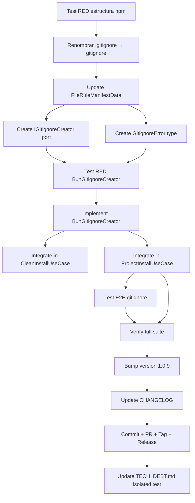

# Plan: Fase FEV-2-C — Resolución de `.gitignore` Excluido por npm + Tech Debt: Test Aislado (v1.0.9)

**Fecha:** 2026-06-26 | **Autor:** Moctezuma (Planner Agent) | **Estado:** ✅ Completo
**Versión objetivo:** v1.0.9
**Issue principal:** Issue #11 — npm excluye archivos `.gitignore` del paquete
**Tech Debt (v1.1.0):** Test de integración aislado que simule `bunx` desde directorio temporal

---

## Overview

Tras el release de v1.0.8, se identificó la **Issue #11**: `bunx @fisherk2-dev/codice@latest` falla con `Template file not found: .gitignore` en los tres modos de instalación (Clean, Project, Update).

**Causa raíz:** npm tiene un comportamiento hardcoded que **excluye archivos `.gitignore` del paquete por defecto**, incluso cuando están listados en el campo `files` de `package.json`. El archivo `template/estandar/.gitignore` (2930 bytes) existe en el repositorio, pero no se incluye en el tarball publicado.

```bash
# El archivo existe localmente
$ ls -la template/estandar/.gitignore
-rw-r--r-- 1 fisherk2 fisherk2 2930 Jun 16 13:36 template/estandar/.gitignore

# PERO no aparece en el paquete npm
$ npm pack --dry-run 2>&1 | grep gitignore
(no output)
```

**Patrón identificado:** Es el mismo problema que FEV-2-B resolvió con symlinks:
- **FEV-2-B:** npm resuelve symlinks → archivos no existen en el tarball
- **FEV-2-C:** npm excluye `.gitignore` → archivos no existen en el tarball

**Decisión del usuario (2026-06-26):**
- **Opción 1 (Recomendada):** Renombrar `template/estandar/.gitignore` → `template/estandar/gitignore` y generar `.gitignore` post-instalación (mismo patrón que FEV-2-B para symlinks).
- **Tech Debt adicional (v1.1.0):** Actualizar `docs/TECH_DEBT.md` para documentar la necesidad de un test de integración aislado que simule `bunx` desde un directorio temporal. Esto evitará futuros bugs de empaquetado que no se detectan con `just dev` (que usa el `template/` local).
- **Versión:** v1.0.9 (no se puede republicar v1.0.8).

**Objetivo:** Publicar v1.0.9 que funcione correctamente con `bunx` en los 3 modos, sin regresión, con `.gitignore` generado post-instalación, y dejar documentado el test aislado para v1.1.0.

---

## Arquitectura de Decisiones (ADR)

| Decisión | Rationale |
|----------|-----------|
| **ADR-FEV2C-1**: Renombrar `.gitignore` → `gitignore` + generar post-instalación | npm excluye `.gitignore` por hardcoded behavior. Renombrar evita la exclusión. La generación post-install es el mismo patrón que FEV-2-B (symlinks) — probado y robusto. |
| **ADR-FEV2C-2**: Generar `.gitignore` solo en Clean Install y Project Install (NO en Update) | Update Workspace preserva estructura existente. Si el usuario ya tiene un `.gitignore` personalizado, NO debe sobrescribirse. Mismo principio que FEV-2-B (symlinks solo en install inicial). |
| **ADR-FEV2C-3**: Generación idempotente (skip si ya existe) | Si el usuario tiene un `.gitignore` preexistente, se respeta. No hay rollback. Si la generación falla, se muestra warning pero NO se aborta la instalación. |
| **ADR-FEV2C-4**: Usar port `IGitignoreCreator` + adapter `BunGitignoreCreator` (Clean Architecture) | Sigue el mismo patrón que `ISymlinkCreator` (FEV-2-B). Aislable, mockeable en tests, y mantiene la separación de capas (application no depende de infra). |
| **ADR-FEV2C-5**: Crear type `GitignoreError` en domain | Coherencia con `SymlinkError` (FEV-2-B). Errores tipados explícitamente para que los use cases puedan manejarlos sin acoplarse a `fs` de Node/Bun. |
| **ADR-FEV2C-6**: Eliminar entrada `.gitignore` de `FileRuleManifestData` | La entrada del manifest hace que `TemplateResolver.resolvePath()` falle porque el archivo NO existe en el tarball. Al eliminarla, el manifest coincide con la realidad del paquete npm. |
| **ADR-FEV2C-7**: Bump a v1.0.9 (no parche sobre v1.0.8) | npm rechaza republicar la misma versión. v1.0.8 ya está publicado con el bug. Es un patch fix → v1.0.9 es correcto semánticamente. |
| **ADR-FEV2C-8**: Eliminar entrada de `.gitignore` del test de completitud | El test `file-rule-manifest.test.ts` cuenta archivos reales en `template/`. Al renombrar `.gitignore` → `gitignore`, el conteo cambia. El test debe actualizarse para excluir el archivo renombrado (ahora no es `.gitignore` real, es un asset para post-install). |
| **ADR-FEV2C-9**: Actualizar `docs/TECH_DEBT.md` con deuda del test aislado (v1.1.0) | El test de integración actual (`TemplateResolver.test.ts`) usa `template/` local. Esto oculta bugs de empaquetado que solo aparecen en `bunx`. v1.1.0 añadirá un test que simule `bunx` desde directorio temporal aislado. |
| **ADR-FEV2C-10**: Generar `.gitignore` ANTES de los symlinks en el flujo de Clean Install | Orden de operaciones: file merge → gitignore generation → symlink generation. Razón: si symlinks fallan, el `.gitignore` ya está en su sitio (atomicidad del archivo crítico). |

---

## Dependency Graph



---

## Task Breakdown

### Phase 1: Diagnóstico RED (Bloqueante)

#### Task FE2C-T0: Test RED con estructura del paquete npm
**Descripción:** Test que simula la estructura del paquete npm (sin `.gitignore`) y verifica que `resolvePath(".gitignore")` falla con el manifiesto actual. El test debe ser RED con el código actual.

**Criterios de Aceptación:**
- [ ] Test crea directorio temporal con estructura:
  ```
  tmp/
  ├── template/
  │   ├── obligatorio/
  │   │   ├── agents/
  │   │   ├── commands/
  │   │   ├── skills/
  │   │   └── .opencode/
  │   │       └── plugins/
  │   ├── estandar/
  │   │   ├── README.md
  │   │   ├── CHANGELOG.md
  │   │   ├── docs/
  │   │   ├── specs/
  │   │   ├── tasks/
  │   │   └── LICENSE
  │   │   (SIN .gitignore — porque npm lo excluye)
  │   └── opcional/
  ```
- [ ] Test invoca `TemplateResolver.resolvePath(".gitignore")` y espera throw con `TemplateNotFoundError`.
- [ ] Test es RED con código actual (la entrada existe en el manifiesto).

**Verificación:**
- [ ] `bun test tests/integration/TemplateResolver.test.ts` — el test falla con error "Template file not found: .gitignore".

**Dependencias:** Ninguna.
**Archivos:**
- `tests/integration/TemplateResolver.test.ts` (nuevo test).

**Scope:** S (30min).

---

### Phase 2: Fix del Template

#### Task FE2C-T1: Renombrar `template/estandar/.gitignore` → `template/estandar/gitignore`
**Descripción:** Renombrar el archivo `.gitignore` a `gitignore` (sin punto) para evitar la exclusión automática de npm.

**Criterios de Aceptación:**
- [ ] Archivo `template/estandar/.gitignore` renombrado a `template/estandar/gitignore`.
- [ ] Contenido idéntico al original (2930 bytes).
- [ ] Test FE2C-T0 ahora muestra que `gitignore` SÍ existe en la estructura npm simulada.
- [ ] `git status` muestra el rename correctamente.

**Verificación:**
- [ ] `ls -la template/estandar/gitignore` — archivo existe.
- [ ] `ls template/estandar/.gitignore` — archivo NO existe.
- [ ] `npm pack --dry-run 2>&1 | grep gitignore` — ahora aparece `template/estandar/gitignore`.

**Dependencias:** FE2C-T0.
**Archivos:**
- `template/estandar/.gitignore` (eliminado).
- `template/estandar/gitignore` (nuevo, contenido idéntico).

**Scope:** XS (5min).

---

#### Task FE2C-T2: Eliminar entrada `.gitignore` de `FileRuleManifestData.ts`
**Descripción:** Remover la entrada para `.gitignore` del `FILE_RULE_MANIFEST`. La generación post-instalación se encarga de crear el archivo `.gitignore` en el destino del usuario.

**Criterios de Aceptación:**
- [ ] 1 entrada eliminada de la sección ESTANDAR del `FILE_RULE_MANIFEST`.
- [ ] Comentario explicativo añadido referenciando el ADR-FEV2C-6 y mencionando que se genera post-instalación.
- [ ] Total standard: 12 → 11.
- [ ] Total general: 32 → 31.
- [ ] Test FE2C-T0 ahora pasa (GREEN) — el manifiesto ya no referencia `.gitignore`.

**Verificación:**
- [ ] `bun test tests/integration/TemplateResolver.test.ts` — todos pasan.
- [ ] `grep -n "gitignore" src/domain/entities/FileRuleManifestData.ts` — solo aparece el comentario explicativo, no la entrada del path.
- [ ] `just check` — 0 errores.

**Dependencias:** FE2C-T1.
**Archivos:**
- `src/domain/entities/FileRuleManifestData.ts` (1 entrada eliminada + comment).

**Scope:** XS (15min).

---

#### Task FE2C-T2.5: Actualizar test de completitud `file-rule-manifest.test.ts`
**Descripción:** El test cuenta archivos en `template/estandar/` y verifica que el manifest tenga al menos esa cantidad. Debe actualizarse para excluir `gitignore` del conteo (ahora es un asset para post-install, no un archivo de plantilla).

**Criterios de Aceptación:**
- [ ] Test modificado para excluir `gitignore` (sin punto) del conteo de `estandar/`.
- [ ] Conteo esperado: 8 mandatory, 11 standard (después del fix), 12 optional.
- [ ] Test verifica que la entrada `.gitignore` NO existe en el manifiesto.
- [ ] Test verifica que `gitignore` SÍ existe en el filesystem de `template/estandar/`.

**Verificación:**
- [ ] `bun test tests/unit/file-rule-manifest.test.ts` — todos pasan.
- [ ] Si comento una entrada válida del manifest, el test falla (guard funciona).

**Dependencias:** FE2C-T2.
**Archivos:**
- `tests/unit/file-rule-manifest.test.ts` (modificado).

**Scope:** S (30min).

---

### Phase 3: Port-Adapter Pattern (Clean Architecture)

#### Task FE2C-T3: Crear puerto `IGitignoreCreator`
**Descripción:** Definir interfaz `IGitignoreCreator` en `src/application/ports/` siguiendo Clean Architecture. La interfaz declara un método para generar el archivo `.gitignore` en el destino.

**Criterios de Aceptación:**
- [ ] Nuevo archivo `src/application/ports/IGitignoreCreator.ts`.
- [ ] Interface exporta: `createGitignore(destPath: string): Promise<Result<void, GitignoreError>>`.
- [ ] JSDoc con propósito, parámetros, errores, y modo de operación (Clean/Project solamente, NO Update).
- [ ] Sin imports de `fs` o `Bun` (Clean Architecture: domain/application no depende de infra).

**Verificación:**
- [ ] `just check` — 0 errores.
- [ ] `tsc --noEmit` — 0 errores.

**Dependencias:** FE2C-T2.
**Archivos:**
- `src/application/ports/IGitignoreCreator.ts` (nuevo).

**Scope:** XS (20min).

---

#### Task FE2C-T4: Crear type `GitignoreError` en domain
**Descripción:** Crear tipo `GitignoreError` en `src/domain/types/` siguiendo el mismo patrón que `SymlinkError` (FEV-2-B).

**Criterios de Aceptación:**
- [ ] Nuevo archivo `src/domain/types/GitignoreError.ts`.
- [ ] Extiende `Error` con campo `code: GitignoreErrorCode` (enum: `READ_FAILED`, `WRITE_FAILED`, `TEMPLATE_NOT_FOUND`).
- [ ] Factory functions: `gitignoreReadError(path)`, `gitignoreWriteError(path)`, `gitignoreTemplateNotFoundError(path)`.
- [ ] Exportado desde el barrel `src/domain/types/index.ts` (si existe).
- [ ] JSDoc con propósito y casos de uso.

**Verificación:**
- [ ] `just check` — 0 errores.
- [ ] `tsc --noEmit` — 0 errores.

**Dependencias:** FE2C-T2.
**Archivos:**
- `src/domain/types/GitignoreError.ts` (nuevo).

**Scope:** XS (10min).

---

#### Task FE2C-T5: Test RED para `BunGitignoreCreator` (TDD)
**Descripción:** Crear tests que cubran: crear `.gitignore` nuevo, idempotencia (skip si ya existe), lectura del template `gitignore`, error handling, validación de paths.

**Criterios de Aceptación:**
- [ ] Archivo `tests/unit/adapters/bun-gitignore-creator.test.ts`.
- [ ] 6+ tests cubriendo:
  1. Crea `.gitignore` nuevo: el archivo se crea con el contenido del template
  2. Idempotencia: si `.gitignore` ya existe, no se sobreescribe
  3. Skip directorio: si `destPath/.gitignore` es un directorio, skip con warning
  4. Read template failed: retorna `Result.err` con `GitignoreError` (READ_FAILED)
  5. Write failed: retorna `Result.err` con `GitignoreError` (WRITE_FAILED)
  6. Template not found: retorna `Result.err` con `GitignoreError` (TEMPLATE_NOT_FOUND)
- [ ] Tests son RED con código actual (la clase no existe).

**Verificación:**
- [ ] `bun test tests/unit/adapters/bun-gitignore-creator.test.ts` — todos fallan porque la clase no existe.

**Dependencias:** FE2C-T3, FE2C-T4.
**Archivos:**
- `tests/unit/adapters/bun-gitignore-creator.test.ts` (nuevo).

**Scope:** S (45min).

---

#### Task FE2C-T6: Implementar `BunGitignoreCreator` adapter (TDD GREEN)
**Descripción:** Crear clase `BunGitignoreCreator` en `src/infrastructure/adapters/` que implementa `IGitignoreCreator` usando `Bun.write()` de Bun.

**Criterios de Aceptación:**
- [ ] Archivo `src/infrastructure/adapters/BunGitignoreCreator.ts`.
- [ ] Implementa `IGitignoreCreator` con:
  - Constructor: `constructor(templatePath: string, verbose?: boolean)` donde `templatePath` apunta a `template/estandar/gitignore`.
  - Método: `createGitignore(destPath: string): Promise<Result<void, GitignoreError>>`.
- [ ] Lee contenido de `template/estandar/gitignore` con `Bun.file().text()`.
- [ ] Escribe a `destPath/.gitignore` con `Bun.write()`.
- [ ] Verifica si `.gitignore` ya existe antes de escribir (idempotencia).
- [ ] Verifica si `destPath/.gitignore` es un directorio real (skip con warning).
- [ ] Captura errores de `EACCES`, `EISDIR`, `ENOENT` y los mapea a `GitignoreError`.
- [ ] Si `verbose` es true, log a stderr con timestamp.
- [ ] Tests FE2C-T5 ahora pasan (GREEN).

**Verificación:**
- [ ] `bun test tests/unit/adapters/bun-gitignore-creator.test.ts` — todos pasan.
- [ ] `just check` — 0 errores.

**Dependencias:** FE2C-T5.
**Archivos:**
- `src/infrastructure/adapters/BunGitignoreCreator.ts` (nuevo).

**Scope:** M (1h).

---

### Phase 4: Use Case Integration

#### Task FE2C-T7: Integrar `IGitignoreCreator` en `CleanInstallUseCase`
**Descripción:** Modificar `CleanInstallUseCase` para que, después de `commitStaging()`, invoque el `IGitignoreCreator` para generar `.gitignore` en el destino (Clean Install copia TODO).

**Criterios de Aceptación:**
- [ ] `CleanInstallUseCase` recibe `IGitignoreCreator` por inyección de dependencias.
- [ ] Después de `commitStaging()` exitoso, llama a `gitignoreCreator.createGitignore(destinationPath)`.
- [ ] Si la creación de `.gitignore` falla, se muestra warning al usuario, NO se hace rollback.
- [ ] El orden es: file merge → gitignore generation → symlink generation (per ADR-FEV2C-10).
- [ ] Tests del use case actualizados con mock de `IGitignoreCreator`.
- [ ] Test verifica que `createGitignore` se llama con el destinationPath correcto.
- [ ] Test verifica que si `createGitignore` falla con error, el use case retorna `Result.ok` con warning (no aborta).

**Verificación:**
- [ ] `bun test tests/unit/clean-install.test.ts` — todos pasan.
- [ ] `just check` — 0 errores.

**Dependencias:** FE2C-T6.
**Archivos:**
- `src/application/use-cases/CleanInstallUseCase.ts` (modificado).
- `src/cli/container.ts` (DI wiring actualizado).
- `tests/unit/clean-install.test.ts` (mock actualizado).

**Scope:** M (45min).

---

#### Task FE2C-T8: Integrar `IGitignoreCreator` en `ProjectInstallUseCase`
**Descripción:** Misma integración que FE2C-T7 pero para `ProjectInstallUseCase`. El `.gitignore` se genera SIEMPRE (es standard, no opcional). NO integrar en `UpdateWorkspaceUseCase` (per ADR-FEV2C-2).

**Criterios de Aceptación:**
- [ ] `ProjectInstallUseCase` recibe `IGitignoreCreator` por inyección de dependencias.
- [ ] Después de `commitStaging()` exitoso, llama a `gitignoreCreator.createGitignore(destinationPath)`.
- [ ] El orden es: file merge → gitignore generation → symlink generation.
- [ ] Si la creación de `.gitignore` falla, se muestra warning al usuario, NO se hace rollback.
- [ ] `UpdateWorkspaceUseCase` NO modificado (no incluye `IGitignoreCreator`).
- [ ] Tests del use case actualizados con mock de `IGitignoreCreator`.
- [ ] Test verifica que `createGitignore` se llama con el destinationPath correcto.
- [ ] Test verifica que `UpdateWorkspaceUseCase` no llama a `createGitignore` (regression guard).

**Verificación:**
- [ ] `bun test tests/unit/project-install.test.ts` — todos pasan.
- [ ] `bun test tests/unit/update-workspace.test.ts` — sin cambios, sigue pasando.
- [ ] `just check` — 0 errores.

**Dependencias:** FE2C-T7.
**Archivos:**
- `src/application/use-cases/ProjectInstallUseCase.ts` (modificado).
- `src/cli/container.ts` (DI wiring actualizado para Project).
- `tests/unit/project-install.test.ts` (mock actualizado).
- `tests/unit/update-workspace.test.ts` (regression test añadido).

**Scope:** M (1h).

---

### Phase 5: Testing

#### Task FE2C-T9: Test E2E con gitignore (Clean Install + Project Install)
**Descripción:** Crear tests E2E que verifiquen que tras `Clean Install` y `Project Install` con binario compilado, el archivo `.gitignore` existe en el destino con el contenido correcto.

**Criterios de Aceptación:**
- [ ] Script `tests/e2e/11-gitignore-clean-install.sh`:
  1. Crea directorio temporal vacío.
  2. Ejecuta binario compilado en modo Clean Install.
  3. Verifica que `dest/.gitignore` existe.
  4. Verifica que el contenido de `dest/.gitignore` coincide con `template/estandar/gitignore` (en el tarball simulado).
- [ ] Script `tests/e2e/12-gitignore-project-install.sh`:
  1. Crea directorio temporal vacío.
  2. Ejecuta binario compilado en modo Project Install.
  3. Verifica que `dest/.gitignore` existe.
  4. Verifica que el contenido coincide con el template.
- [ ] Scripts integrados en `just test-e2e`.
- [ ] Total E2E: 12/12 pasando (10 existentes + 2 nuevos de gitignore).

**Verificación:**
- [ ] `just test-e2e` — 12/12 escenarios.
- [ ] Output captura el `.gitignore` creado.

**Dependencias:** FE2C-T8.
**Archivos:**
- `tests/e2e/11-gitignore-clean-install.sh` (nuevo).
- `tests/e2e/12-gitignore-project-install.sh` (nuevo).
- `Justfile` (recipe `test-e2e` actualizada).

**Scope:** M (1h 15min).

---

#### Task FE2C-T10: Verificar suite completa
**Descripción:** Verificar que no hay regresión con todos los tests unit + integration + e2e.

**Criterios de Aceptación:**
- [ ] `bun test` — 460+ pass, 0 fail (sin regresión, +14 tests de gitignore).
- [ ] `just check` — 0 errores (biome ci + tsc --noEmit).
- [ ] E2E: 12/12 pasando.
- [ ] Coverage: ≥97.66% funciones / ≥96.52% líneas (sin pérdida).
- [ ] Domain coverage: 100% líneas (mantener).

**Verificación:**
- [ ] `bun test --coverage` — sin pérdida de coverage.

**Dependencias:** FE2C-T8, FE2C-T9.
**Archivos:** (ninguno, solo verificación).

**Scope:** XS (10min).

---

### Phase 6: Release

#### Task FE2C-T11: Bump version a 1.0.9
**Descripción:** Actualizar `package.json` de `1.0.8` a `1.0.9` (patch fix, no se puede republicar 1.0.8).

**Criterios de Aceptación:**
- [ ] `package.json` → `"version": "1.0.9"`.
- [ ] Commit con mensaje: `chore: bump version to 1.0.9`.

**Verificación:**
- [ ] `git diff package.json` muestra solo el bump de versión.

**Dependencias:** FE2C-T10.
**Archivos:**
- `package.json`.

**Scope:** XS (5min).

---

#### Task FE2C-T12: Actualizar CHANGELOG con sección v1.0.9
**Descripción:** Crear entrada `[1.0.9] — 2026-06-26` con la descripción del fix.

**Criterios de Aceptación:**
- [ ] `CHANGELOG.md`:
  - Header `[1.0.9] — 2026-06-26`.
  - Entry `Fixed`: "Issue #11 — `Template file not found: .gitignore` en `bunx @fisherk2-dev/codice` (npm excluye `.gitignore` del paquete). Renombrado a `gitignore` (sin punto) y generado post-instalación (mismo patrón que symlinks en v1.0.7)".
  - Entry `Deprecated`: "v1.0.8 — usar v1.0.9".
  - Remover entry `[Unreleased]` con Issue #11 (ahora resuelto).

**Verificación:**
- [ ] `git diff CHANGELOG.md` muestra la nueva sección.

**Dependencias:** FE2C-T11.
**Archivos:**
- `CHANGELOG.md`.

**Scope:** XS (5min).

---

#### Task FE2C-T13: Commit + PR + Tag + Release
**Descripción:** Hacer commit de los cambios, pushear, crear PR, hacer merge, tag, release pipeline.

**Criterios de Aceptación:**
- [ ] Commit: `fix(gitignore): post-install generation + remove manifest entry (#11)`.
- [ ] Branch: `fix/fev-2-c-gitignore` (base = develop).
- [ ] `git push origin fix/fev-2-c-gitignore`.
- [ ] PR creado en GitHub contra `develop` (o `main` según convención actual).
- [ ] CI pasa (3 platforms: Linux, macOS, Windows).
- [ ] Squash merge a base branch.
- [ ] `git tag -a v1.0.9 -m "Release v1.0.9 — Gitignore post-install generation"`.
- [ ] `git push origin v1.0.9` → release pipeline ejecuta.
- [ ] `npm view @fisherk2-dev/codice version` → `1.0.9`.
- [ ] `gh release view v1.0.9` muestra 4 assets (linux, macos, windows.exe, checksums).
- [ ] Branch local `fix/fev-2-c-gitignore` eliminado.
- [ ] `develop` sincronizado con base branch.

**Verificación:**
- [ ] GitHub Release: https://github.com/Fisherk2/codice-opencode/releases/tag/v1.0.9
- [ ] npm: `@fisherk2-dev/codice@1.0.9` es el `latest`.

**Dependencias:** FE2C-T12.
**Archivos:** (git only).

**Scope:** S (15min).

---

### Phase 7: Tech Debt Documentation (v1.1.0)

#### Task FE2C-T14: Actualizar `docs/TECH_DEBT.md` con deuda del test aislado
**Descripción:** Documentar en `docs/TECH_DEBT.md` la necesidad de un test de integración aislado que simule `bunx @fisherk2-dev/codice` desde un directorio temporal. Este test detectará bugs de empaquetado npm que el test actual (`TemplateResolver.test.ts` con `template/` local) no detecta.

**Criterios de Aceptación:**
- [ ] Nueva sección añadida en `docs/TECH_DEBT.md` (sección 5.3, después de "E2E Coverage Not Captured by `bun --coverage`"):
  - **Problema:** El test de integración actual usa `template/` local (del CWD). Esto oculta bugs que solo aparecen cuando el binario se ejecuta desde un directorio ajeno (caso real de `bunx`).
  - **Solución propuesta (v1.1.0):** Test de integración aislado que:
    1. Build el paquete npm con `bun pm pack`.
    2. Install el paquete en un directorio temporal (`os.tmpdir()`).
    3. Run el binario instalado desde el directorio temporal.
    4. Verify que la resolución de templates, gitignore, y symlinks funciona correctamente.
  - **Por qué es importante:** FEV-2-B y FEV-2-C fueron bugs que solo se detectaron DESPUÉS del release porque `just dev` (modo source) usa el `template/` local. Un test pre-release habría detectado ambos.
  - **Esfuerzo estimado:** 4-6 horas.
  - **Impacto:** Detecta bugs de empaquetado ANTES del release. Reduce tiempo de post-release fixes.
- [ ] Mover Issue #11 de "Known Issues (v1.0.8)" a "Resolved in v1.0.9" con la descripción del fix.
- [ ] Actualizar el header del documento con la versión actual: "Technical Debt — Códice v1.0.9".
- [ ] Actualizar métricas en el header: tests, coverage.

**Verificación:**
- [ ] `git diff docs/TECH_DEBT.md` muestra la nueva sección.
- [ ] El documento es coherente con la versión v1.0.9.

**Dependencias:** FE2C-T13.
**Archivos:**
- `docs/TECH_DEBT.md` (modificado).

**Scope:** XS (15min).

---

## Checkpoints (Quality Gates)

### Checkpoint 1: After FE2C-T2 (Template fix)
- [ ] `template/estandar/gitignore` existe (renombrado).
- [ ] `template/estandar/.gitignore` NO existe.
- [ ] Entrada `.gitignore` eliminada de `FileRuleManifestData.ts`.
- [ ] Test FE2C-T0 pasa (GREEN).
- [ ] `npm pack --dry-run` incluye `gitignore` (sin punto).
- [ ] `just check` — 0 errores.

### Checkpoint 2: After FE2C-T6 (Port + Adapter implementados)
- [ ] `IGitignoreCreator` port creado.
- [ ] `GitignoreError` type creado.
- [ ] `BunGitignoreCreator` adapter implementado.
- [ ] 6+ tests pasando.
- [ ] `just check` — 0 errores.

### Checkpoint 3: After FE2C-T8 (Use cases integrados)
- [ ] `CleanInstallUseCase` genera `.gitignore` post-commit.
- [ ] `ProjectInstallUseCase` genera `.gitignore` post-commit.
- [ ] `UpdateWorkspaceUseCase` NO genera `.gitignore` (regression test included).
- [ ] Tests de use cases pasan.
- [ ] `just check` — 0 errores.

### Checkpoint 4: After FE2C-T10 (Verificación integral)
- [ ] `bun test`: 460+ pass, 0 fail.
- [ ] Coverage sin pérdida.
- [ ] E2E: 12/12 pasando.

### Gate FEV-2-C: After FE2C-T13 (Release publicado)
- [ ] `npm view @fisherk2-dev/codice version` → `1.0.9`.
- [ ] GitHub Release con 4 assets.
- [ ] CHANGELOG actualizado.
- [ ] Issue #11 cerrado.

### Gate FE2C-T14: After Tech Debt Documentation
- [ ] `docs/TECH_DEBT.md` actualizado con sección del test aislado.
- [ ] Issue #11 movido a "Resolved in v1.0.9".
- [ ] Header del documento actualizado a v1.0.9.

---

## Riesgos y Mitigaciones

| Riesgo | Impacto | Mitigación |
|--------|---------|------------|
| **Renombrar `.gitignore` rompe tests que asumen el path** | Medio | FE2C-T0 RED test antes de FE2C-T1; actualizar tests que referencien el path. |
| **Gitignore generation falla en Windows (permisos de archivo)** | Bajo | Idempotent: skip if exists, log warning. No es bloqueante. |
| **Tests E2E no detectan bug de empaquetado** | Alto | FE2C-T14 (v1.1.0) añade test aislado para prevenir regresión futura. |
| **v1.0.9 falla con un nuevo bug residual** | Alto | E2E con binario compilado antes de release. Test manual con `bunx @fisherk2-dev/codice@1.0.9` desde directorio limpio. |
| **`IGitignoreCreator` se acopla a infra accidentalmente** | Bajo | Revisión de código en FE2C-T3 para asegurar que la interface no importa `fs` o `Bun`. |
| **El test aislado (v1.1.0) requiere infra de CI compleja** | Medio | El test se ejecutará localmente + en CI. La complejidad se documenta en FE2C-T14. |
| **El orden de operaciones (gitignore antes de symlinks) cambia la atomicidad** | Bajo | Per ADR-FEV2C-10. Si symlinks fallan, el `.gitignore` ya está en su sitio (atomicidad del archivo crítico). El usuario no se queda sin `.gitignore` si los symlinks fallan. |
| **Conflicto con develop al hacer merge** | Bajo | develop está sincronizado con main. Fast-forward merge sin conflictos. |

---

## Métricas Objetivo

| Métrica | v1.0.8 (actual) | Meta v1.0.9 |
|---------|-----------------|-------------|
| Tests (pass/fail) | 446 / 0 | ≥460 / 0 (+14 tests gitignore) |
| Coverage (funciones) | 97.66% | ≥97.66% |
| Coverage (líneas) | 96.52% | ≥96.52% |
| E2E escenarios | 10/10 | 12/12 (+2 gitignore) |
| `just check` errores | 0 | 0 |
| Manifest entries (total) | 32 | 31 |
| Manifest entries (standard) | 12 | 11 |
| Gitignore generado en Clean Install | ❌ (bug) | ✅ |
| Gitignore generado en Project Install | ❌ (bug) | ✅ |
| Gitignore en Update Workspace | ❌ (bug) | ❌ (preserva existente) |
| Issues críticos abiertos | 1 (#11) | 0 |

---

## Resumen de Esfuerzo

| Tarea | Scope | Esfuerzo |
|-------|-------|----------|
| FE2C-T0: Test RED con estructura npm | S | 30min |
| FE2C-T1: Renombrar `.gitignore` → `gitignore` | XS | 5min |
| FE2C-T2: Eliminar entrada del manifiesto | XS | 15min |
| FE2C-T2.5: Actualizar test de completitud | S | 30min |
| FE2C-T3: Crear puerto `IGitignoreCreator` | XS | 20min |
| FE2C-T4: Crear type `GitignoreError` | XS | 10min |
| FE2C-T5: Test RED `BunGitignoreCreator` | S | 45min |
| FE2C-T6: Implementar `BunGitignoreCreator` | M | 1h |
| FE2C-T7: Integrar en `CleanInstallUseCase` | M | 45min |
| FE2C-T8: Integrar en `ProjectInstallUseCase` | M | 1h |
| FE2C-T9: Test E2E con gitignore | M | 1h 15min |
| FE2C-T10: Verificar suite completa | XS | 10min |
| FE2C-T11: Bump version 1.0.9 | XS | 5min |
| FE2C-T12: Actualizar CHANGELOG | XS | 5min |
| FE2C-T13: Commit + PR + Tag + Release | S | 15min |
| FE2C-T14: Actualizar TECH_DEBT.md (isolated test) | XS | 15min |
| **Total** | | **~7h 10min** |

---

## Verificación Post-Release

Después de publicar v1.0.9, verificar manualmente con:

```bash
# Test 1: Clean Install (debe generar .gitignore)
mkdir -p /tmp/test-codice && cd /tmp/test-codice
bunx @fisherk2-dev/codice@1.0.9
# → Seleccionar "Clean Install" → debe completar sin error
# → Verificar: ls -la .gitignore debe existir
# → Verificar: cat .gitignore debe tener el contenido del template

# Test 2: Project Install (debe generar .gitignore)
mkdir -p /tmp/test-codice2 && cd /tmp/test-codice2
bunx @fisherk2-dev/codice@1.0.9
# → Seleccionar "Project Install" → debe completar
# → Verificar .gitignore igual que Test 1

# Test 3: Update Workspace (NO debe generar .gitignore, preserva existente)
mkdir -p /tmp/test-codice3 && cd /tmp/test-codice3
git init
echo "node_modules/" > .gitignore  # Crear .gitignore del usuario
bunx @fisherk2-dev/codice@1.0.9
# → Seleccionar "Update Workspace" → debe completar
# → Verificar: cat .gitignore debe seguir mostrando "node_modules/" (NO sobrescrito)
```

**Criterios de éxito:**
- [ ] Los 3 modos funcionan sin `Template file not found`.
- [ ] Tras Clean/Project Install, existe `.gitignore` con el contenido del template.
- [ ] Tras Update, el `.gitignore` del usuario NO se sobrescribe.

---

## Notas para v1.1.0 (Tech Debt)

El test aislado propuesto en FE2C-T14 es la pieza que falta para **detectar bugs de empaquetado npm ANTES del release**. Tanto FEV-2-B (symlinks) como FEV-2-C (gitignore) fueron bugs que solo se detectaron DESPUÉS del release porque:

1. `just dev` usa `template/` local (modo source) → oculta el problema del tarball.
2. Los tests unitarios/integración usan `template/` local → mismo problema.
3. Los tests E2E compilan el binario y lo ejecutan, pero NO validan el contenido del tarball de npm.

El test aislado (v1.1.0) cerrará esta brecha. Diseño preliminar:

```typescript
// tests/integration/installed-package.test.ts (v1.1.0)
describe('Isolated Package Behavior', () => {
  it('should resolve template correctly when installed via npm in a foreign directory', async () => {
    // 1. Crear directorio temporal (simula directorio del usuario)
    const userDir = await fs.mkdtemp(path.join(os.tmpdir(), 'codice-test-'));
    
    // 2. Build el paquete npm (equivalente a `bun pm pack`)
    const tarballPath = await buildPackage(projectRoot);
    
    // 3. Install el paquete en userDir
    await exec(`npm install ${tarballPath}`, { cwd: userDir });
    
    // 4. Run el binario instalado
    const result = await exec('npx codice --version', { cwd: userDir });
    
    // 5. Verify
    expect(result.exitCode).toBe(0);
    expect(result.stdout).toMatch(/\d+\.\d+\.\d+/);
    
    // 6. Verify que el template se resuelve correctamente
    const result2 = await exec('npx codice --dry-run', { cwd: userDir });
    expect(result2.exitCode).toBe(0);
    expect(result2.stderr).not.toContain('Template file not found');
  });
});
```

Este test se ejecutará en CI antes del release, evitando futuros bugs de empaquetado.

---

*Última actualización: 2026-06-26*
