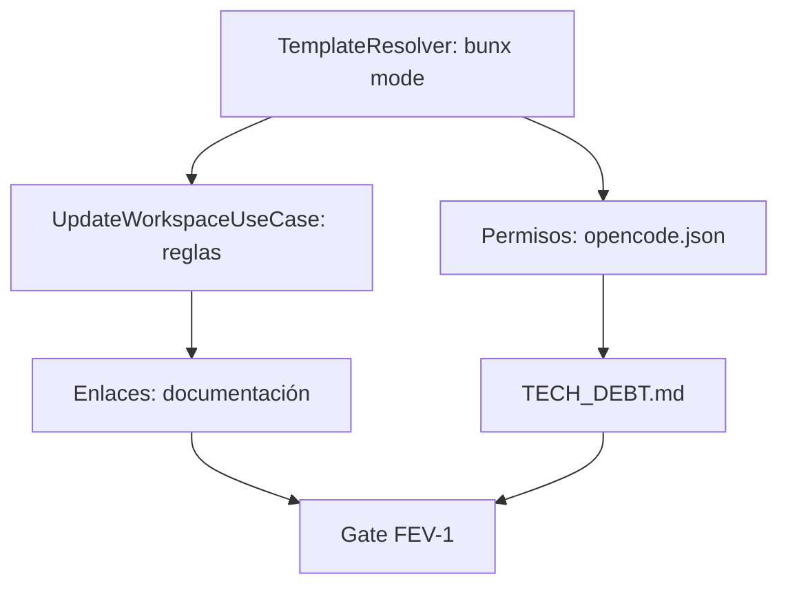

# Plan: Fase FEV-1 — Resolución de Issues Críticos (v1.0.5)

**Fecha:** 2026-06-17 | **Autor:** Moctezuma (Planner Agent) | **Estado:** 🟡 Plan Aprobado

## Overview

Resolver los **5 issues críticos** identificados en la Fase FEV-1 para estabilizar Códice y mejorar seguridad/documentación:
1. **Issue #6 (bunx)**: Template resolution en modo `bunx` (crítico).
2. **Issue #2 (update overwrite)**: Corregir transformación de reglas en `UpdateWorkspaceUseCase` (crítico).
3. **Issue #3 (permisos)**: Actualizar `opencode.json` para bloquear lectura de credenciales (seguridad).
4. **Issue #4 (enlaces)**: Corregir enlaces rotos en documentación (calidad).
5. **Issue #5 (TECH_DEBT.md)**: Añadir `TECH_DEBT.md` a la plantilla (documentación).

**Objetivo:** Publicar v1.0.5 con todos los issues resueltos y sin regresiones.

---

## Arquitectura de Decisiones (ADR-007)

| Decisión | Rationale |
|----------|-----------|
| **ADR-FEV1-1**: Añadir tercera ruta en `TemplateResolver` para `bunx` | Necesario para soportar instalación vía `bunx` sin romper el modo compilado. |
| **ADR-FEV1-2**: No convertir `standard` a `mandatory` en `UpdateWorkspaceUseCase` | Preserva la lógica de `destinationExists()` para evitar sobrescrituras. |
| **ADR-FEV1-3**: Extender `permissions.read.deny` en `opencode.json` | Bloquea lectura de archivos sensibles por el agente IA. |
| **ADR-FEV1-4**: Usar rutas relativas corregidas en documentación | Mantiene enlaces funcionales tras reorganización de directorios. |
| **ADR-FEV1-5**: Incluir `TECH_DEBT.md` como placeholder en `estandar/` | Proporciona visibilidad de deuda técnica a usuarios. |

---

## Task Breakdown

### Phase 1: Issues Críticos (Bloqueantes)

#### Task FEV1-T1: TemplateResolver — Añadir soporte para `bunx` (Issue #6)
**Descripción:** Modificar `TemplateResolver.detectTemplateRoot()` para detectar automáticamente el modo `bunx` (source mode) y resolver la ruta del template desde `node_modules/@fisherk2-dev/codice/template/`.

**Criterios de Aceptación:**
- [ ] Añadir tercera ruta de detección: `path.resolve(import.meta.dir, '../template/')`.
- [ ] Mantener compatibilidad con modos existentes (compiled y source desarrollo).
- [ ] Fallar con `TemplateNotFoundError` si no se encuentra el template en ninguna ruta.
- [ ] Tests unitarios para los 3 modos (compiled, bunx, source).

**Verificación:**
- [ ] `bunx @fisherk2-dev/codice` funciona en un directorio limpio.
- [ ] `bun run src/cli/main.ts` (source mode) sigue funcionando.
- [ ] `./dist/codice-linux` (compiled mode) sigue funcionando.
- [ ] `bun test` pasa sin regresión (360 tests, 0 fail).

**Dependencias:** Ninguna.
**Archivos:**
- `src/infrastructure/adapters/TemplateResolver.ts`
- `tests/integration/TemplateResolver.test.ts` (nuevos tests).

**Scope:** M (2h).

---

#### Task FEV1-T2: UpdateWorkspaceUseCase — Corregir transformación de reglas (Issue #2)
**Descripción:** Modificar `buildUpdateRules()` para que **no convierta** reglas `standard` a `mandatory`, preservando la verificación `destinationExists()`.

**Criterios de Aceptación:**
- [ ] Solo reglas `obligatorio` se convierten a `mandatory`.
- [ ] Reglas `standard` mantienen su tipo original.
- [ ] Tests unitarios para los 3 tipos de reglas (`obligatorio`, `standard`, `opcional`).

**Verificación:**
- [ ] `UpdateWorkspaceUseCase` no sobrescribe archivos existentes en `estandar/`.
- [ ] `bun test` pasa sin regresión (360 tests, 0 fail).
- [ ] E2E: Escenario "Update Workspace" pasa (6/6).

**Dependencias:** Ninguna.
**Archivos:**
- `src/application/use-cases/UpdateWorkspaceUseCase.ts`
- `tests/unit/UpdateWorkspaceUseCase.test.ts` (nuevos tests).

**Scope:** M (1h).

---

### Phase 2: Seguridad y Calidad

#### Task FEV1-T3: Actualizar permisos en `opencode.json` (Issue #3)
**Descripción:** Extender la lista `permissions.read.deny` para bloquear archivos de credenciales (`.npmrc`, `.pem`, `*.key`, etc.).

**Criterios de Aceptación:**
- [ ] Añadir patrones: `.env*`, `.npmrc`, `.pem`, `*.key`, `*.p12`, `*.pfx`, `credentials.json`, `service-account*.json`.
- [ ] Validar que el agente IA no puede leer estos archivos en pruebas manuales.

**Verificación:**
- [ ] `just check` pasa (0 errores).
- [ ] Revisión manual: Intentar leer `.npmrc` con el agente IA falla.

**Dependencias:** Ninguna.
**Archivos:**
- `template/obligatorio/opencode.json`.

**Scope:** S (30min).

---

#### Task FEV1-T4: Corregir enlaces rotos en documentación (Issue #4)
**Descripción:** Actualizar rutas relativas en `README.md`, `CONTRIBUTING.md`, y `AGENTS.md` para reflejar la nueva estructura de directorios (`obligatorio/`, `estandar/`, `opcional/`).

**Criterios de Aceptación:**
- [ ] Revisar y corregir enlaces en:
  - `template/estandar/README.md`
  - `template/estandar/CONTRIBUTING.md`
  - `template/obligatorio/AGENTS.md`
- [ ] Usar rutas relativas correctas (ej: `../obligatorio/skills/xlsx/SKILL.md`).

**Verificación:**
- [ ] Todos los enlaces funcionan al instalar la plantilla.
- [ ] `just check` pasa (0 errores).

**Dependencias:** Ninguna.
**Archivos:**
- `template/estandar/README.md`
- `template/estandar/CONTRIBUTING.md`
- `template/obligatorio/AGENTS.md`.

**Scope:** M (1h).

---

### Phase 3: Documentación

#### Task FEV1-T5: Añadir TECH_DEBT.md a la plantilla (Issue #5)
**Descripción:** Crear `template/estandar/TECH_DEBT.md` como placeholder que referencia al documento canónico en el repositorio.

**Criterios de Aceptación:**
- [ ] Archivo `TECH_DEBT.md` en `template/estandar/` con contenido:
  ```markdown
  # Technical Debt
  Este documento es un placeholder. Consulta el catálogo oficial de deuda técnica en:
  [docs/TECH_DEBT.md](../../docs/TECH_DEBT.md)
  ```

**Verificación:**
- [ ] `just check` pasa (0 errores).
- [ ] El archivo se incluye al instalar la plantilla.

**Dependencias:** Ninguna.
**Archivos:**
- `template/estandar/TECH_DEBT.md` (nuevo).

**Scope:** XS (15min).

---

## Checkpoints

### Checkpoint 1: After FEV1-T1 + FEV1-T2 (Issues Críticos)
- [ ] `bunx @fisherk2-dev/codice` funciona en todos los modos.
- [ ] `UpdateWorkspaceUseCase` no sobrescribe archivos `estandar/`.
- [ ] `bun test`: 360 pass, 0 fail (sin regresión).
- [ ] E2E: 6/6 escenarios pasando.

### Checkpoint 2: After FEV1-T3 + FEV1-T4 (Seguridad y Calidad)
- [ ] Agente IA no puede leer archivos de credenciales.
- [ ] Todos los enlaces en documentación funcionan.
- [ ] `just check`: 0 errores.

### Gate FEV-1: F5.5 Review Checklist (Final)
- [ ] Todos los issues de FEV-1 resueltos (#6, #2, #3, #4, #5).
- [ ] `bun test`: 360 pass, 0 fail.
- [ ] `just check`: 0 errores.
- [ ] E2E: 6/6 escenarios pasando.
- [ ] ADR-007 documentado en `specs/adr/`.
- [ ] CHANGELOG.md actualizado con sección `[Unreleased]`.

---

## Dependency Graph



---

## Riesgos y Mitigaciones

| Riesgo | Impacto | Mitigación |
|--------|---------|------------|
| **TemplateResolver rompe compiled mode** | Alto | Probar ambos modos (bun run + binary) antes de merge. |
| **Tests de regresión en UpdateWorkspaceUseCase** | Alto | Tests unitarios + E2E para escenario "Update Workspace". |
| **Enlaces rotos en documentación** | Medio | Revisión manual de enlaces en plantilla instalada. |
| **Publicación de TECH_DEBT.md sin contexto** | Bajo | Incluir referencia al documento canónico. |

---

## Métricas Objetivo

| Métrica | Actual (v1.0.4) | Meta (v1.0.5) |
|---------|-----------------|---------------|
| Tests (pass/fail) | 360 / 0 | 360 / 0 |
| Coverage (funciones) | 97.66% | ≥97.66% |
| Coverage (líneas) | 96.52% | ≥96.52% |
| E2E escenarios | 6/6 | 6/6 |
| `just check` errores | 0 | 0 |
| Issues críticos abiertos | 2 (#6, #2) | 0 |
| Issues totales abiertos | 5 | 0 |

---

*Última actualización: 2026-06-17*