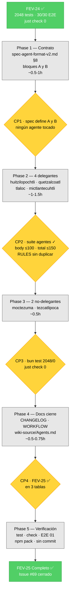
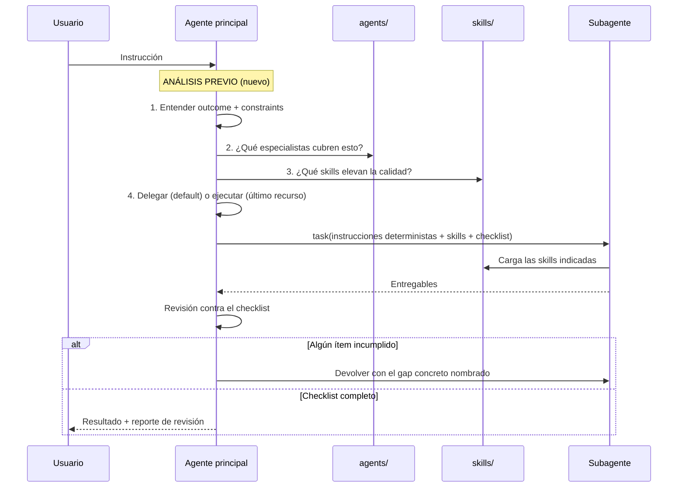

# Implementation Plan: FEV-25 — Reglas de Delegación en Agentes Principales

**Phase:** FEV-25 (v2.1.0) — ✅ Completo
**Issue:** [#69](https://github.com/Fisherk2/codice-opencode/issues/69) — _Reglas de delegación en los agentes principales_
**Diagnóstico:** [`docs/diagnosis/fix13-agent-delegation-rules.md`](../docs/diagnosis/fix13-agent-delegation-rules.md)
**Date:** 2026-08-11
**Author:** Moctezuma (Strategic Planner)
**Branch:** `feature/new-commands` (continúa de FEV-24)
**Todo list:** [todo.md](./todo.md)
**Methodology:** Vertical slicing (1 agente = 1 slice completo) · commits atómicos por fase
**Wall-clock estimate:** ~3-4.5h (0.5-1h F1 + 1-1.5h F2 + 0.5h F3 + 0.5-0.75h F4 + 0.5h F5)

---

## Overview

Los 6 agentes principales delegan de forma implícita: `RULES` dice *"siempre delega vía `task()`"* pero no dice **cómo**. El resultado son instrucciones ambiguas al subagente, sin skills sugeridas y sin rúbrica con la que el agente principal pueda revisar el trabajo devuelto.

FEV-25 añade a cada agente principal un **protocolo de análisis previo** (antes de ejecutar: ¿qué subagentes? ¿qué skills?) y, a los que pueden delegar, un **contrato de delegación** de 3 bloques obligatorios en todo `task()`: instrucciones deterministas · skills a cargar · checklist de objetivos.

**Lo que FEV-25 hace:**

1. Define el contrato canónico en `specs/spec-agent-format-v2.md` (§8, nueva sección).
2. Añade `## DELEGATION PROTOCOL` a los **4 agentes delegantes**.
3. Añade `## SKILL ANALYSIS PROTOCOL` a los **2 agentes no delegantes**.
4. Sincroniza documentación de cierre: `CHANGELOG.md`, `docs/WORKFLOW.md`, `docs/wiki-source/Agents.md`.

**Lo que FEV-25 NO hace:**

- ❌ **Tests nuevos** — decisión explícita del usuario (2026-08-11). La suite existente ya cubre los 6 agentes (`tests/unit/domain/agent-frontmatter-validation.test.ts`, 2048 tests).
- ❌ Tocar `src/**` — cero código de producción.
- ❌ Tocar el **frontmatter YAML** de los agentes — los invariantes de permisos de FEV-19 quedan intactos.
- ❌ Nuevos skills, comandos ni subagentes.
- ❌ Release real (bump de `package.json`, tag `v2.1.0`, npm publish) — sigue diferido desde FEV-24.

---

## Decisiones Confirmadas (vía `question` tool, 2026-08-11)

| # | Pregunta | Decisión |
|---|----------|----------|
| 1 | Alcance de archivos | **6 agentes + documentación de soporte + documentación de cierre** (spec, CHANGELOG, WORKFLOW, wiki) |
| 2 | `moctezuma` y `tezcatlipoca` (`task: "*": deny`) | **Protocolo de skills sin delegación** — no se les dan reglas que sus permisos prohíben |
| 3 | Cómo expresar la lista de skills | **Descubrimiento dinámico de `skills/`**, sin cap fijo: el agente principal decide cuántas skills son relevantes (2 o 10) según la instrucción recibida |
| 4 | Guardar y commitear el plan | **Sí** — `docs(tasks)` commit, sin tocar aún ningún agente |

---

## Architecture Decisions

| # | Decisión | Rationale |
|---|----------|-----------|
| **1** | **Dos bloques, no uno** (`DELEGATION PROTOCOL` / `SKILL ANALYSIS PROTOCOL`) | Los 6 agentes no son homogéneos: `moctezuma` y `tezcatlipoca` declaran `permission.task: "*": deny`. Darles reglas de delegación crearía una contradicción entre prompt y permisos, y el prompt perdería autoridad. |
| **2** | **La spec es el SSOT; los agentes son instancias** | `specs/spec-agent-format-v2.md` §8 contiene el texto canónico de ambos bloques. Un futuro agente principal se añade copiando el bloque de la spec, no inventándolo. |
| **3** | **Sección nueva entre `### RULES` y `## KNOWLEDGE`** | Preserva el tail `KNOWLEDGE → COMPOSITION` que la spec v2 exige y que los tests inspeccionan. `##` (nivel 2) es consistente con `## ROLE & DIRECTIVE` / `## KNOWLEDGE` / `## COMPOSITION`. |
| **4** | **Inglés** | Los 6 bodies están 100% en inglés hoy. Mezclar idiomas dentro del system prompt degrada la consistencia del prompt. |
| **5** | **Skills por descubrimiento dinámico, sin lista hardcodeada** | Hay 51 skills en `skills/` y crecen. Una lista estática se desincroniza y quema el presupuesto de líneas. La regla es *"escanea `skills/` y elige las relevantes"*, con el criterio en manos del agente principal. |
| **6** | **`RULES` se recorta a un puntero** | El bullet *"✅ Always delegate to specialized subagents via `task()` as the first option"* pasa a apuntar al nuevo §DELEGATION PROTOCOL en lugar de repetir la instrucción. Cumple la regla DRY de `AGENTS.md`. |
| **7** | **Frontmatter YAML intocable** | Los tests `FEV-19 permission invariants` verifican estructura exacta de `permission.task` (`"*": allow` + 5 denies, sin self-deny). Cualquier edición ahí rompe la suite sin aportar nada al Issue #69. |
| **8** | **CHANGELOG en la sección `[2.1.0]` existente, no en `[Unreleased]`** | No existe tag `v2.1.0` y `package.json` sigue en `2.0.0`: v2.1.0 está escrita pero **no publicada**. FEV-25 pertenece a ese release aún abierto. |
| **9** | **4 commits atómicos** (contrato · delegantes · no-delegantes · docs) | Cada commit es un concern y es reversible por separado. Separar F2/F3 permite revertir el bloque B sin perder el A. |
| **10** | **Sin tests nuevos** | Decisión del usuario. Las puertas de calidad son la suite existente + conteo de líneas, ejecutadas en cada checkpoint. |

---

## Patterns Applied

| Patrón | Dónde | Por qué |
|--------|-------|---------|
| **Template Method** | Bloque canónico en la spec + hook de rol por agente (`quetzalcoatl` solo delega documentación, `huitzilopochtli` nunca ejecuta, etc.) | El esqueleto del protocolo es idéntico; solo varía el paso específico del rol. Evita 6 protocolos divergentes. |
| **Strategy** | Bloque A vs bloque B seleccionado según `permission.task` | Dos algoritmos intercambiables para el mismo problema ("cómo preparar el trabajo antes de actuar"), elegidos por la capacidad real del agente. |
| **Chain of Responsibility** | Analizar → mapear subagentes → mapear skills → decidir delegar/ejecutar | Pipeline de handlers que se recorre **antes** de cualquier ejecución. Cada paso puede resolver o pasar al siguiente. |
| **Single Source of Truth** | `spec-agent-format-v2.md` §8 | Mismo principio ya aplicado en `FileRuleManifestData` (packs) y en el auto-discovery del plugin SDD: un solo lugar define el contrato. |
| **Acceptance Rubric / Specification** | El "goal checklist" que viaja en cada `task()` | Convierte la revisión del trabajo devuelto en un criterio objetivo y verificable, no en una impresión. |
| **Vertical Slicing** | 1 agente = 1 slice (archivo completo + verificación de líneas + suite) | Cada slice deja el repo en verde. No hay estado intermedio "medio agente". |

**Descartado explícitamente:** enumerar un catálogo de subagentes o skills dentro del prompt (anti-patrón *Golden Hammer* + rompe el test `No subagent index in primary agents` que FEV-20 introdujo al eliminar `VALID_SUBAGENTS`).

---

## Pre-Audit Snapshot (2026-08-11)

| Métrica | Valor |
|---------|------:|
| Tests (pass/fail) | 2048 / 0 |
| E2E scenarios | 30 / 30 |
| `just check` errores | 0 (145 archivos) |
| `package.json` version | 2.0.0 (sin bump) |
| Branch | `feature/new-commands` |
| HEAD | `d006527` |
| Agentes principales | 6 (4 delegantes + 2 no delegantes) |

### Matriz de agentes — capacidad real vs bloque asignado

| Agente | `permission.task` | Rol | Bloque | Body actual | Body final | Total final |
|--------|-------------------|-----|:------:|------------:|-----------:|------------:|
| `huitzilopochtli` | `"*": allow` + 5 deny | Orquestador supremo, nunca ejecuta | **A** | 40 | ~60 | ~94 |
| `quetzalcoatl` | `"*": allow` + 5 deny | Arquitecto, solo delega documentación | **A** | 39 | ~59 | ~101 |
| `tlaloc` | `"*": allow` + 5 deny | Constructor, ejecuta como último recurso | **A** | 38 | ~58 | ~81 |
| `mictlantecuhtli` | `"*": allow` + 5 deny | Juez, delega auditorías, retiene el veredicto | **A** | 39 | ~59 | ~82 |
| `moctezuma` | `"*": deny` | Planificador, escribe planes él mismo | **B** | 37 | ~49 | ~84 |
| `tezcatlipoca` | `"*": deny` | Crítico read-only, solo reporta | **B** | 40 | ~52 | ~81 |

**Límite:** ≤100 líneas de body (sin frontmatter) y ≤150 líneas totales (`docs/diagnosis/fix03-v1.1.0-roadmap.md` §LINE LIMIT CONSTRAINT). Peor caso proyectado: `quetzalcoatl` con **59/100** body y **101/150** total.

### Tests existentes que actúan como red de seguridad (ninguno se modifica)

| Suite | Qué protege |
|-------|-------------|
| `agent-frontmatter-validation.test.ts` › *FEV-19 permission invariants* | Estructura exacta de `permission.task` en los 6 |
| `agent-frontmatter-validation.test.ts` › *No subagent index in primary agents* | Ausencia de `## AVAILABLE SUBAGENTS` y de `the catalog` dentro de `### RULES` |
| `agent-frontmatter-validation.test.ts` › *Agents directory reference* | Los 4 delegantes mencionan `agents/` |
| `agent-frontmatter-validation.test.ts` › *Structural rules / Field validation* | Body no vacío, frontmatter parseable, sin campos desconocidos |
| `tests/e2e/01-clean-install.sh` | Los 6 agentes se copian a `agents/` en instalación limpia |
| `tests/integration/packaging/npm-pack.test.ts` | `packs/main/*.md` presentes en el tarball |

---

## Dependency Graph

```
FEV-24 ✅ (2048 tests, 30/30 E2E, just check 0)
    ↓
Phase 1: Contrato canónico (~0.5-1h, 1 commit)
    └── T1.1: specs/spec-agent-format-v2.md §8 — bloques A y B + regla de selección
    ↓  [CP1: la spec define ambos bloques; ningún agente tocado todavía]
Phase 2: 4 agentes delegantes (~1-1.5h, 1 commit)
    ├── T2.1: huitzilopochtli.md   (hook: nunca ejecuta)
    ├── T2.2: quetzalcoatl.md      (hook: solo delega documentación)
    ├── T2.3: tlaloc.md            (hook: ejecuta como último recurso)
    └── T2.4: mictlantecuhtli.md   (hook: delega auditoría, retiene veredicto)
    ↓  [CP2: suite de agentes verde + líneas dentro de presupuesto + RULES sin duplicar]
Phase 3: 2 agentes no delegantes (~0.5h, 1 commit)
    ├── T3.1: moctezuma.md
    └── T3.2: tezcatlipoca.md
    ↓  [CP3: bun test 2048/0 + just check 0]
Phase 4: Documentación de cierre (~0.5-0.75h, 1 commit)
    ├── T4.1: CHANGELOG.md  → §[2.1.0] Added/Changed
    ├── T4.2: docs/WORKFLOW.md → FEV-25 ✅ en 3 tablas
    └── T4.3: docs/wiki-source/Agents.md → §Agent File Pattern
    ↓  [CP4: FEV-25 marcado ✅ y consistente en las 3 tablas]
Phase 5: Verificación (~0.5h, sin commit)
    └── T5.1-T5.4: bun test · just check · E2E 01 · npm pack --dry-run
    ↓
FEV-25 Completo ✅
```

**Critical path:** T1.1 → T2.1-T2.4 → T3.1-T3.2 → T4.1-T4.3 → T5.x (~3-4.5h)
**Paralelización:** T2.1-T2.4 y T3.1-T3.2 son archivos independientes — paralelizables si se trabaja con worktrees, aunque el coste de merge supera el ahorro para 6 archivos pequeños.

---

## Mermaid Dependency Diagram


```mermaid
graph TD
    F24[FEV-24 ✅<br/>2048 tests · 30/30 E2E<br/>just check 0]:::done --> P1
    P1[Phase 1 — Contrato<br/>spec-agent-format-v2.md §8<br/>bloques A y B<br/>~0.5-1h]:::seq --> CP1
    CP1{CP1 · spec define A y B<br/>ningún agente tocado}:::gate --> P2
    P2[Phase 2 — 4 delegantes<br/>huitzilopochtli · quetzalcoatl<br/>tlaloc · mictlantecuhtli<br/>~1-1.5h]:::seq --> CP2
    CP2{CP2 · suite agentes ✓<br/>body ≤100 · total ≤150<br/>RULES sin duplicar}:::gate --> P3
    P3[Phase 3 — 2 no-delegantes<br/>moctezuma · tezcatlipoca<br/>~0.5h]:::seq --> CP3
    CP3{CP3 · bun test 2048/0<br/>just check 0}:::gate --> P4
    P4[Phase 4 — Docs cierre<br/>CHANGELOG · WORKFLOW<br/>wiki-source/Agents.md<br/>~0.5-0.75h]:::seq --> CP4
    CP4{CP4 · FEV-25 ✅<br/>en 3 tablas}:::gate --> P5
    P5[Phase 5 — Verificación<br/>test · check · E2E 01<br/>npm pack · sin commit]:::seq --> DONE
    DONE[FEV-25 Completo ✅<br/>Issue #69 cerrado]:::done

    classDef done fill:#51cf66,stroke:#2f9e44,color:#fff
    classDef gate fill:#ffd43b,stroke:#f59f00,color:#000
    classDef seq fill:#e7e7e7,stroke:#666,color:#000
```

## Flujo en runtime del protocolo (lo que el cambio produce)


```mermaid
sequenceDiagram
    participant U as Usuario
    participant P as Agente principal
    participant A as agents/
    participant S as skills/
    participant Sub as Subagente

    U->>P: Instrucción
    Note over P: ANÁLISIS PREVIO (nuevo)
    P->>P: 1. Entender outcome + constraints
    P->>A: 2. ¿Qué especialistas cubren esto?
    P->>S: 3. ¿Qué skills elevan la calidad?
    P->>P: 4. Delegar (default) o ejecutar (último recurso)
    P->>Sub: task(instrucciones deterministas + skills + checklist)
    Sub->>S: Carga las skills indicadas
    Sub-->>P: Entregables
    P->>P: Revisión contra el checklist
    alt Algún ítem incumplido
        P->>Sub: Devolver con el gap concreto nombrado
    else Checklist completo
        P-->>U: Resultado + reporte de revisión
    end
```

---

## File-by-File Change Matrix

| Archivo | Fase | Cambio | Líneas | Commit |
|---------|:----:|--------|:------:|--------|
| `specs/spec-agent-format-v2.md` | 1 | UPDATE (+§8 Delegation Protocol) | +55 / -3 | C1 |
| `template/obligatorio/packs/main/huitzilopochtli.md` | 2 | UPDATE (+bloque A, trim RULES) | +20 / -1 | C2 |
| `template/obligatorio/packs/main/quetzalcoatl.md` | 2 | UPDATE (+bloque A, trim RULES) | +20 / -1 | C2 |
| `template/obligatorio/packs/main/tlaloc.md` | 2 | UPDATE (+bloque A, trim RULES) | +20 / -1 | C2 |
| `template/obligatorio/packs/main/mictlantecuhtli.md` | 2 | UPDATE (+bloque A, trim RULES) | +20 / -1 | C2 |
| `template/obligatorio/packs/main/moctezuma.md` | 3 | UPDATE (+bloque B) | +12 / -0 | C3 |
| `template/obligatorio/packs/main/tezcatlipoca.md` | 3 | UPDATE (+bloque B) | +12 / -0 | C3 |
| `CHANGELOG.md` | 4 | UPDATE (§[2.1.0]) | +14 / -0 | C4 |
| `docs/WORKFLOW.md` | 4 | UPDATE (3 tablas + métricas) | +8 / -6 | C4 |
| `docs/wiki-source/Agents.md` | 4 | UPDATE (§Agent File Pattern) | +6 / -1 | C4 |

**Total:** 0 archivos nuevos · 10 modificados · **+187 / -14** · 4 commits atómicos + 1 verificación sin commit.

---

## Task List

### Phase 1: Contrato canónico (~0.5-1h, 1 commit)

> **Foundation-first.** La spec define el texto exacto de los bloques A y B; las fases 2 y 3 se vuelven mecánicas (copiar + hook de rol). Sin esto, seis ediciones divergen.

#### Task 1.1: Añadir §8 "Delegation Protocol" a `specs/spec-agent-format-v2.md`

**Description:** Documentar el contrato de delegación como parte del formato de agentes v2. La sección define: (a) qué bloque recibe cada agente según `permission.task`, (b) el texto canónico del bloque A, (c) el texto canónico del bloque B, (d) el presupuesto de líneas. La sección §8 "Out of Scope" actual pasa a §9.

**Contenido objetivo — Bloque A (agentes delegantes):**

```markdown
## DELEGATION PROTOCOL

Before executing ANY instruction — analyze first, act second:

1. **Understand** the requested outcome, its constraints, and what "done" means.
2. **Map subagents** — which specialists in `agents/` cover this work?
3. **Map skills** — scan `skills/` and select every skill that raises the quality of
   this task. Two or ten: the count is your judgement, the relevance is the rule.
4. **Decide** — delegate (default) or execute yourself (last resort, only when no
   specialist exists). <HOOK: regla específica del rol>

Every `task()` you send MUST carry these three blocks:

- **Deterministic instructions** — context (why + constraints) plus small, verifiable
  steps with explicit deliverables: paths, names, formats. Never an open-ended ask.
- **Skills to load** — name the `skills/` the subagent must load, in priority order,
  with one line of justification each.
- **Goal checklist** — the acceptance rubric you will grade the returned work against,
  including what counts as rework.

When the subagent returns, grade its output against that checklist. Any unmet item goes
back to the subagent with the specific gap named — you do not silently fix it yourself.
```

**Contenido objetivo — Bloque B (agentes no delegantes):**

```markdown
## SKILL ANALYSIS PROTOCOL

You do not delegate (`task` is denied). Before executing ANY instruction — analyze
first, act second:

1. **Understand** the requested outcome, its constraints, and what "done" means.
2. **Map skills** — scan `skills/` and load every skill that raises the quality of this
   task. Two or ten: the count is your judgement, the relevance is the rule.
3. **Define the goal checklist** — the acceptance criteria your own output must satisfy.
4. **Self-review** against that checklist before returning; state any item you could not meet.

If the work needs a specialist or write access you do not hold, name the agent or command
that should take it instead of improvising.
```

**Tabla de hooks por rol (a documentar en la spec):**

| Agente | Hook en el paso 4 |
|--------|-------------------|
| `huitzilopochtli` | "You never execute: if no specialist exists, report it and stop." |
| `quetzalcoatl` | "You delegate documentation only — never code, never tasks." |
| `tlaloc` | "Execute directly only when no specialist in `agents/` covers the stack." |
| `mictlantecuhtli` | "Delegate the audit, retain the verdict — the ruling is never delegated." |

**Acceptance criteria:**

- [ ] §8 "Delegation Protocol" existe en `specs/spec-agent-format-v2.md`
- [ ] Documenta la regla de selección A/B en función de `permission.task`
- [ ] Contiene el texto canónico literal de ambos bloques
- [ ] Contiene la tabla de hooks por rol (4 filas)
- [ ] Documenta el presupuesto: ≤100 líneas de body, ≤150 totales
- [ ] La antigua §8 "Out of Scope" se renumera a §9 sin perder contenido

**Verification:**

- [ ] `just check` → 0 errores
- [ ] `bun test` → 2048 tests, 0 fail (la spec no está bajo test, es control de regresión)
- [ ] Revisión manual: el bloque A copiado literalmente cabe en el presupuesto de líneas

**Dependencies:** Ninguna (FEV-24 ✅)
**Files:** `specs/spec-agent-format-v2.md` (+55 / -3)
**Scope:** S (1 archivo)
**Commit C1:** `docs(spec): define delegation protocol contract for primary agents`

---

#### Checkpoint CP1 (gate a Phase 2)

- [ ] `specs/spec-agent-format-v2.md` contiene §8 con bloques A y B
- [ ] **Ningún archivo de `template/obligatorio/packs/main/` modificado todavía** (`git diff --name-only` lo confirma)
- [ ] `just check` → 0 errores
- [ ] `bun test` → 2048 / 0
- [ ] Review humano del texto canónico antes de replicarlo ×6

---

### Phase 2: Agentes delegantes (~1-1.5h, 1 commit)

> **Vertical slice: 1 agente = 1 tarea completa** (insertar bloque + hook de rol + recortar RULES + verificar líneas). Los 4 comparten el mismo procedimiento; solo cambia el hook.

**Procedimiento común para T2.1-T2.4:**

1. Insertar el bloque A **entre** el final de `### RULES` y `## KNOWLEDGE`.
2. Sustituir el hook `<HOOK>` del paso 4 por la línea del rol (tabla de la spec).
3. Recortar en `### RULES` el bullet `✅ **Always** delegate to specialized subagents via task()...` para que apunte a la nueva sección en vez de repetirla.
4. Verificar presupuesto: `awk 'f{n++} /^---$/{c++; if(c==2) f=1} END{print n}' <archivo>` ≤ 100 y `wc -l` ≤ 150.

#### Task 2.1: `huitzilopochtli.md` — orquestador supremo

**Description:** Añadir bloque A con hook *"You never execute: if no specialist exists, report it and stop."* Es el agente donde el protocolo tiene más impacto: su rol entero es decidir a quién delegar.

**Acceptance criteria:**

- [ ] `## DELEGATION PROTOCOL` presente entre `### RULES` y `## KNOWLEDGE`
- [ ] Los 4 pasos de análisis previo y los 3 bloques obligatorios de `task()` están presentes
- [ ] Hook de rol aplicado (nunca ejecuta)
- [ ] Bullet redundante de RULES recortado a puntero
- [ ] Frontmatter YAML **byte-idéntico** al original
- [ ] Body ≤100 líneas · total ≤150 líneas

**Verification:**

- [ ] `bun test tests/unit/domain/agent-frontmatter-validation.test.ts` → verde
- [ ] `git diff template/obligatorio/packs/main/huitzilopochtli.md` no muestra cambios antes de la línea 34 (fin del frontmatter)

**Dependencies:** T1.1
**Files:** `template/obligatorio/packs/main/huitzilopochtli.md` (+20 / -1)
**Scope:** XS

---

#### Task 2.2: `quetzalcoatl.md` — arquitecto visionario

**Description:** Bloque A con hook *"You delegate documentation only — never code, never tasks."* Mantiene la coherencia con `permission.write: deny` + `edit: *.md allow` y con la regla existente de rechazar peticiones de código.

**Acceptance criteria:** idénticos a T2.1, con el hook de documentación.
Extra: el body final debe seguir bajo 100 líneas — es el agente con el frontmatter más largo (42 líneas), proyección **59/100 body · 101/150 total**.

**Verification:**

- [ ] `bun test tests/unit/domain/agent-frontmatter-validation.test.ts` → verde
- [ ] Conteo explícito de líneas registrado en el checkpoint

**Dependencies:** T1.1
**Files:** `template/obligatorio/packs/main/quetzalcoatl.md` (+20 / -1)
**Scope:** XS

---

#### Task 2.3: `tlaloc.md` — constructor

**Description:** Bloque A con hook *"Execute directly only when no specialist in `agents/` covers the stack."* Refuerza la regla existente de "último recurso" con el criterio de skills.

**Acceptance criteria:** idénticos a T2.1, con el hook de último recurso.

**Verification:**

- [ ] `bun test tests/unit/domain/agent-frontmatter-validation.test.ts` → verde

**Dependencies:** T1.1
**Files:** `template/obligatorio/packs/main/tlaloc.md` (+20 / -1)
**Scope:** XS

---

#### Task 2.4: `mictlantecuhtli.md` — juez

**Description:** Bloque A con hook *"Delegate the audit, retain the verdict — the ruling is never delegated."* El checklist de objetivos encaja de forma natural con su rol: sus veredictos ya son "pasa o no pasa".

**Acceptance criteria:** idénticos a T2.1, con el hook de veredicto.

**Verification:**

- [ ] `bun test tests/unit/domain/agent-frontmatter-validation.test.ts` → verde

**Dependencies:** T1.1
**Files:** `template/obligatorio/packs/main/mictlantecuhtli.md` (+20 / -1)
**Scope:** XS

---

**Commit C2:** `feat(agents): add delegation protocol to delegating primary agents`

```
feat(agents): add delegation protocol to delegating primary agents

Adds ## DELEGATION PROTOCOL to the four primary agents that can invoke
task(): huitzilopochtli, quetzalcoatl, tlaloc, mictlantecuhtli.

The protocol forces analysis before execution (map subagents, map skills,
then decide) and makes three blocks mandatory in every task() call:
deterministic instructions, skills to load, and a goal checklist the
primary agent uses to grade the returned work.

Role-specific hook per agent; canonical text lives in
specs/spec-agent-format-v2.md §8. Frontmatter untouched.

Refs: FEV-25, Issue #69
```

---

#### Checkpoint CP2 (gate a Phase 3)

- [ ] Los 4 agentes delegantes tienen `## DELEGATION PROTOCOL`
- [ ] `bun test tests/unit/domain/agent-frontmatter-validation.test.ts` → verde (incluye *FEV-19 permission invariants*, *No subagent index*, *Agents directory reference*)
- [ ] Conteo de líneas de los 4: body ≤100 · total ≤150
- [ ] `git diff specs/ template/` muestra únicamente body de agentes (cero cambios de frontmatter)
- [ ] Ningún agente contiene `## AVAILABLE SUBAGENTS` ni `the catalog` dentro de RULES
- [ ] `just check` → 0 errores
- [ ] **Review humano antes de Phase 3**

---

### Phase 3: Agentes no delegantes (~0.5h, 1 commit)

> Bloque B: mismo análisis previo, sin delegación. Mantiene la coherencia prompt ↔ permisos.

#### Task 3.1: `moctezuma.md` — planificador estratégico

**Description:** Añadir `## SKILL ANALYSIS PROTOCOL` entre `### RULES` y `## KNOWLEDGE`. Refuerza la regla existente *"NEVER delegate to subagents"* dándole el camino alternativo: cargar skills relevantes (`planning-and-task-breakdown`, `interview-me`, etc. por descubrimiento) y auto-revisarse contra un checklist propio.

**Acceptance criteria:**

- [ ] `## SKILL ANALYSIS PROTOCOL` presente entre `### RULES` y `## KNOWLEDGE`
- [ ] Declara explícitamente que `task` está denegado (coherente con `permission.task: "*": deny`)
- [ ] Los 4 pasos presentes: entender · mapear skills · definir checklist · auto-revisar
- [ ] Regla de escalado presente (nombrar el agente/comando correcto si excede permisos)
- [ ] Frontmatter YAML byte-idéntico · body ≤100 · total ≤150

**Verification:**

- [ ] `bun test tests/unit/domain/agent-frontmatter-validation.test.ts` → verde (el test *non-delegating* exige 0 valores `allow` en `task`)

**Dependencies:** T1.1
**Files:** `template/obligatorio/packs/main/moctezuma.md` (+12)
**Scope:** XS

---

#### Task 3.2: `tezcatlipoca.md` — crítico read-only

**Description:** Bloque B. Es el agente más restringido (`write: deny`, `edit: deny`, `task: deny`): el protocolo se traduce en cargar las skills de análisis correctas antes de emitir el reporte y auto-verificar el reporte contra su propio checklist.

**Acceptance criteria:** idénticos a T3.1.

**Verification:**

- [ ] `bun test tests/unit/domain/agent-frontmatter-validation.test.ts` → verde

**Dependencies:** T1.1
**Files:** `template/obligatorio/packs/main/tezcatlipoca.md` (+12)
**Scope:** XS

---

**Commit C3:** `feat(agents): add skill analysis protocol to non-delegating primary agents`

---

#### Checkpoint CP3 (gate a Phase 4)

- [ ] Los 6 agentes principales tienen su protocolo (4× A, 2× B)
- [ ] `bun test` → 2048 tests, 0 fail
- [ ] `just check` → 0 errores
- [ ] `bash tests/e2e/01-clean-install.sh` → exit 0 (los 6 agentes se copian a `agents/`)
- [ ] Verificación cruzada: ningún agente con `task: deny` menciona delegar
- [ ] **Review humano antes de Phase 4**

---

### Phase 4: Documentación de cierre (~0.5-0.75h, 1 commit)

> Un solo concern: dejar la documentación consistente con el cambio. Sigue el patrón de la Phase 5 de FEV-24.

#### Task 4.1: `CHANGELOG.md` — entrada FEV-25

**Description:** Añadir FEV-25 a la sección `## [2.1.0]` existente (no a `[Unreleased]`: v2.1.0 aún no tiene tag ni bump en `package.json`).

**Contenido objetivo:**

```markdown
### Added
- **Agent Delegation Protocol (FEV-25, Issue #69):** The six primary agents now
  analyze before acting — mapping the available subagents in `agents/` and the
  relevant skills in `skills/` before executing any instruction.
  - The four delegating agents (`huitzilopochtli`, `quetzalcoatl`, `tlaloc`,
    `mictlantecuhtli`) gained `## DELEGATION PROTOCOL`: every `task()` call must
    carry deterministic instructions, the skills the subagent must load, and a goal
    checklist the primary agent grades the returned work against.
  - The two non-delegating agents (`moctezuma`, `tezcatlipoca`) gained
    `## SKILL ANALYSIS PROTOCOL`: the same up-front analysis without delegation,
    plus a self-review checklist.
  - Canonical contract documented in `specs/spec-agent-format-v2.md` §8.
```

**Acceptance criteria:**

- [ ] Entrada bajo `## [2.1.0]` › `### Added`
- [ ] Referencia a FEV-25 y a Issue #69
- [ ] Distingue explícitamente los dos bloques y qué agentes reciben cada uno
- [ ] Formato Keep a Changelog respetado

**Files:** `CHANGELOG.md` (+14)
**Scope:** XS

---

#### Task 4.2: `docs/WORKFLOW.md` — FEV-25 ✅

**Description:** Marcar FEV-25 como completo en las 3 ubicaciones donde aparece.

**Acceptance criteria:**

- [ ] Tabla §1 "Visión de Fases": FEV-25 pasa de 📋 a ✅ con fecha
- [ ] Tabla §3 "v2.1.0": misma actualización + una línea de resultado
- [ ] §5 "Métricas de Progreso": FEV-25 reflejado en el bloque v2.1.0
- [ ] Cabecera "Última actualización" con la fecha real de implementación
- [ ] Sin contradicciones entre las 3 tablas

**Files:** `docs/WORKFLOW.md` (+8 / -6)
**Scope:** XS

---

#### Task 4.3: `docs/wiki-source/Agents.md` — patrón de archivo

**Description:** En §"Agent File Pattern", añadir que todo agente principal incluye un bloque de protocolo (A o B según su `permission.task`) y apuntar a la spec. La tabla §"Primary Agents" ya distingue delegantes de no delegantes — solo se añade la referencia al protocolo.

**Acceptance criteria:**

- [ ] §Agent File Pattern menciona el bloque de protocolo y enlaza a `specs/spec-agent-format-v2.md`
- [ ] Sin duplicar el texto canónico del bloque (SSOT: vive en la spec)
- [ ] Coherente con la columna "Permission Model" de la tabla existente

**Files:** `docs/wiki-source/Agents.md` (+6 / -1)
**Scope:** XS

---

**Commit C4:** `docs: sync FEV-25 delegation protocol across changelog, workflow and wiki`

---

#### Checkpoint CP4 (gate a Phase 5)

- [ ] CHANGELOG, WORKFLOW y wiki actualizados y mutuamente consistentes
- [ ] `just check` → 0 errores
- [ ] Ninguna referencia a FEV-25 como "pendiente" sobrevive en `docs/`
- [ ] **Review humano antes de Phase 5**

---

### Phase 5: Verificación (~0.5h, sin commit)

#### Task 5.1: Suite completa

- [ ] `bun test` → 2048 tests, 0 fail (mismo número que el baseline: no se añadieron tests)

#### Task 5.2: Calidad estática

- [ ] `just check` → 0 errores (biome ci + tsc --noEmit)

#### Task 5.3: E2E

- [ ] `bash tests/e2e/01-clean-install.sh` → exit 0
- [ ] `just test-e2e` → 30/30 (el conteo no cambia: sin escenarios nuevos)

#### Task 5.4: Empaquetado y presupuesto final

- [ ] `npm pack --dry-run` → los 6 agentes presentes, tamaño sin regresión relevante
- [ ] Conteo final de líneas de los 6 agentes registrado en el todo (body ≤100 · total ≤150)
- [ ] Carga manual en el harness de OpenCode: un agente principal muestra la sección nueva en su system prompt

---

#### Checkpoint CP5: FEV-25 Completo

- [ ] Los 5 criterios del DoD del diagnóstico `fix13` cumplidos
- [ ] `bun test` 2048/0 · `just check` 0 · E2E 30/30
- [ ] 4 commits atómicos en `feature/new-commands`
- [ ] Issue #69 listo para cerrar

---

## Risks and Mitigations

| Riesgo | Impacto | Mitigación |
|--------|:-------:|------------|
| Romper `FEV-19 permission invariants` al editar un agente | **Alto** | El frontmatter YAML no se toca en ninguna fase. CP2/CP3 verifican con `git diff` que el cambio empieza después del cierre del frontmatter. |
| Exceder el límite de 100 líneas de body | Medio | Presupuesto calculado por agente antes de empezar (peor caso 59/100). Conteo explícito en CP2 y en T5.4. |
| Duplicar la regla de delegación ya presente en `RULES` (viola DRY de `AGENTS.md`) | Medio | T2.x recorta el bullet de RULES a un puntero al nuevo bloque. Revisión en CP2. |
| Reintroducir un catálogo de subagentes (revierte FEV-20) | Medio | El bloque usa descubrimiento dinámico de `agents/`. El test *No subagent index in primary agents* falla si alguien enumera. |
| Solape con el plugin SDD | Bajo | Verificado: el plugin inyecta `PHASE_SUGGESTIONS` (qué **comando** sigue), no cómo delegar. Planos distintos, sin conflicto. |
| Los 6 bloques divergen con el tiempo | Bajo | SSOT en `spec-agent-format-v2.md` §8; los agentes son instancias del texto canónico. |
| Prompt inflado degrada el comportamiento del agente | Bajo | ~20 líneas sobre ~40 existentes; el límite de 100/150 existe precisamente para acotar esto. Validación manual en T5.4. |

---

## Open Questions

Ninguna. Las tres ambigüedades del diagnóstico `fix13` quedaron resueltas por el usuario el 2026-08-11 (ver §Decisiones Confirmadas): alcance de archivos, tratamiento de los agentes no delegantes, y forma de expresar la lista de skills.

---

## Definition of Done (FEV-25)

- [ ] `specs/spec-agent-format-v2.md` documenta el protocolo de delegación (§8)
- [ ] 4 agentes delegantes con `## DELEGATION PROTOCOL` (contexto + skills + checklist)
- [ ] 2 agentes no delegantes con `## SKILL ANALYSIS PROTOCOL`
- [ ] Protocolo de análisis previo presente en los **6** agentes
- [ ] Priorización de skills documentada (descubrimiento dinámico de `skills/`)
- [ ] Límite <100 líneas de body respetado en los 6
- [ ] `bun test` 2048/0 · `just check` 0 · E2E 30/30
- [ ] CHANGELOG + WORKFLOW + wiki sincronizados

---

*Plan generado por `/plan` (FEV-25). Ver [todo.md](./todo.md) para el checklist ejecutable.*
