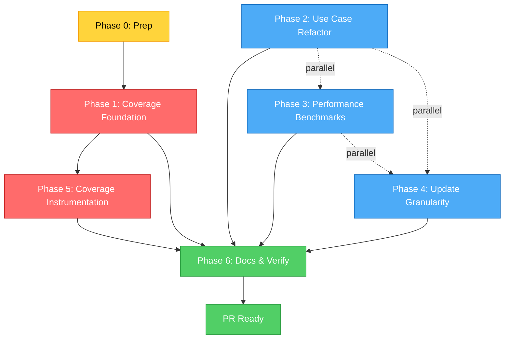
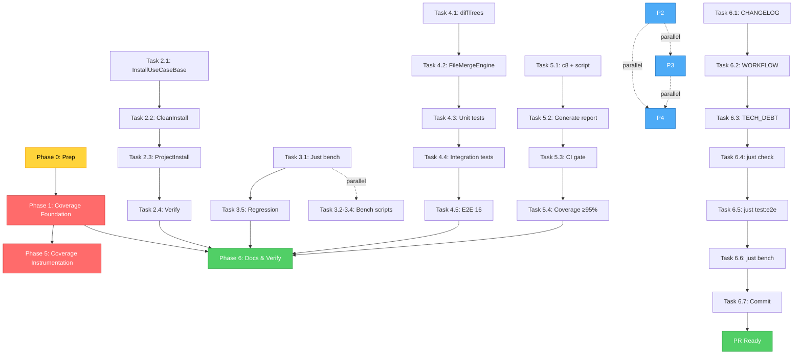

# Implementation Plan: FEV-16 — v1.2.0 Pre-release Tech Debt Closure

**Phase:** FEV-16 (v1.2 Phase 6) — 📋 Pendiente
**Scope:** Mega-FEV consolidado (5 items del TECH_DEBT.md sin FEV registrado)
**Spec:** [SPEC.md](../SPEC.md), [docs/WORKFLOW.md](../docs/WORKFLOW.md) §FEV-16, [docs/TECH_DEBT.md](../docs/TECH_DEBT.md)
**Date:** 2026-07-30
**Author:** Moctezuma (Strategic Planner)
**Branch base:** `develop` (FEV-15 ✅ ya mergeado)
**Methodology:** Vertical slicing + Critical path first + Parallel where possible + Template Method pattern (GoF) + Strategy pattern (existing) + Tree-level diff

---

## Overview

Cerrar la deuda técnica listada en [`docs/TECH_DEBT.md`](../docs/TECH_DEBT.md) que está **preparada para v1.2.0** pero **no asignada a ningún FEV registrado**, antes del pre-release de v1.2.0. Esto consolida **5 items** en un único **FEV-16** con **4 workstreams paralelos** y **1 workstream secuencial** (coverage).

**Items incluidos (verificados vía `grep` en TECH_DEBT.md):**

| ID | Sección | Item | Esfuerzo | Tipo |
|----|---------|------|----------|------|
| TD-1.1 | §1.1 | `src/cli/main.ts` coverage (interactive mode + catch block) | 2h | Test infrastructure |
| TD-2.1 | §2.1 | CleanInstall/ProjectInstall duplicación (Template Method refactor) | 4h | Code refactor (GoF) |
| TD-5.1 | §5.1 | E2E Coverage Not Captured by `bun --coverage` | 8h | Test infrastructure |
| TD-5.2 | §5.2 | No Performance Benchmarks (SC-9/10/11 sin automatizar) | 4h | Test infrastructure |
| TD-6.2 | §6.2 | Standard Directory Updates Are All-or-Nothing | 6h | Domain logic (Strategy) |
| | | **TOTAL** | **24h** | |

**Restricciones del usuario confirmadas (vía question tool, 2026-07-30):**
- **Agrupación:** 1 mega FEV-16 (todo en un solo FEV)
- **Orden de ejecución:** Critical path primero + paralelo donde posible
- **Refactor de Template Method:** Sí, aplicar ahora (no esperar al cuarto modo)
- **Diagnosis docs:** No nuevos; actualizar docs existentes (TECH_DEBT, WORKFLOW) para establecer el scope de FEV-16

**Versión:** Sin bump. v1.2.0 se cierra coordinadamente con FEV-11/12/13/14/15/16.

---

## Architecture Decisions

| Decision | Rationale |
|----------|-----------|
| **Mega FEV-16 (no split en 4 FEVs)** | 5 items temáticamente distintos pero todos必须在 v1.2.0 pre-release. Un FEV consolidado evita overhead de branches y mantiene atomic release. |
| **Template Method pattern para Clean/Project Install** | Elimina ~80 líneas de duplicación. La lógica común (constructor de 7 params, flujo `checkWritable → confirmOverwrite → selectOptionals → merge → postInstall`) varía solo en 3 hooks: `buildRules()`, `selectOptionals()`, mensajes. GoF Template Method es el ajuste idiomático. |
| **Tree-level diff para Update Granularity** | `FileMergeEngine.shouldStage()` actualmente hace check directory-level. Refactor a file-level diff: comparar template y destination file lists, stagear solo archivos nuevos. Strategy pattern ya existente (3 estrategias: Obligatorio/Estándar/Opcional) se extiende con 4ª: Estándar-Update. |
| **`hyperfine` para benchmarks (no custom code)** | Estándar de la industria. `cargo bench`/`go bench` son innecesarios para nuestro caso. `hyperfine` mide wall-clock con warmup, JSON output parseable, integración trivial con CI. |
| **NYC/Istanbul via Bun's `--coverage` workaround** | Bun no soporta NYC directamente. Usar wrapper script que envuelve `bun test` con `c8` (NYC-compatible) o `bun --coverage` + post-procesamiento con `lcov`. Documentar trade-off en TECH_DEBT. |
| **`main.ts` interactive mode extraction** | Líneas 134-145 son las únicas sin cobertura (junto con catch block). Extraer `resolveInteractiveMode()` como función exportada permite test con mock `IUserPrompt`. |
| **Coverage thresholds en CI** | Forzar `lines ≥ 95%` y `funcs ≥ 95%` como quality gate. Si E2E instrumentation funciona, el threshold sube a `lines ≥ 96.5%` (nuevo baseline). |
| **Sin diagnosis docs nuevos** | Decisión del usuario. El plan cubre el diagnóstico suficiente. WORKFLOW.md y TECH_DEBT.md actualizados reflejan el scope de FEV-16. |
| **Sin bump de versión** | Cierre coordinado FEV-11/12/13/14/15/16 → todos publican bajo v1.2.0. Mantener consistencia con FEV-14/15. |
| **Total: ~24h wall-clock (3 días focused, 5-7 días calendario con review cycles)** | Plan completo para v1.2.0 pre-release. |

---

## Dependency Graph

```
Phase 0: Preparation (sequential, no deps)
├── Task 0.1: Create branch feat/fev16-tech-debt from develop
└── Task 0.2: Verify baseline (just check + bun test exit 0)

Phase 1: Coverage Foundation (sequential, blocks Phase 5)
└── Task 1.1: Extract resolveInteractiveMode() from main.ts
└── Task 1.2: Unit tests for resolveInteractiveMode() with mock IUserPrompt

Phase 2: Use Case Refactor [PARALLELIZABLE]
├── Task 2.1: Create InstallUseCaseBase abstract class (Template Method)
├── Task 2.2: Migrate CleanInstallUseCase to extend base
├── Task 2.3: Migrate ProjectInstallUseCase to extend base
└── Task 2.4: Verify no regression (lines removed ≥ duplication added)

Phase 3: Performance Benchmarks [PARALLELIZABLE]
├── Task 3.1: Add just bench recipe with hyperfine
├── Task 3.2: Create benchmarks/clean-install.bench.sh
├── Task 3.3: Create benchmarks/project-install.bench.sh
├── Task 3.4: Create benchmarks/update-workspace.bench.sh
└── Task 3.5: Add SC-9/10/11 assertions (warn on regression >10%)

Phase 4: Update Granularity [PARALLELIZABLE]
├── Task 4.1: Add tree-level diff function in domain/services/
├── Task 4.2: Refactor FileMergeEngine.shouldStage() to use file-level diff
├── Task 4.3: Unit tests: standard dir update delivers new files
├── Task 4.4: Integration tests: real filesystem with mock template
└── Task 4.5: E2E test 16: update existing project gets new standard file

Phase 5: Coverage Instrumentation [SEQUENTIAL, depends on Phase 1]
├── Task 5.1: Add c8 dev dep + bun-coverage wrapper script
├── Task 5.2: Generate E2E coverage report (lcov format)
├── Task 5.3: Add coverage gate to CI (--coverage-threshold)
└── Task 5.4: Update main.ts coverage from 86.21% → ≥95%

Phase 6: Documentation & Verification [SEQUENTIAL, depends on all above]
├── Task 6.1: Update CHANGELOG.md (FEV-16 entry under [Unreleased])
├── Task 6.2: Update docs/WORKFLOW.md (mark FEV-16 complete)
├── Task 6.3: Update docs/TECH_DEBT.md (move 5 items to Resolved)
├── Task 6.4: just check + bun test (full suite, ≥810 + new tests)
├── Task 6.5: just test:e2e (≥15 + 1 new = ≥16 passing)
├── Task 6.6: just bench (3 benchmarks, no regressions >10%)
└── Task 6.7: Commit with trailer Co-Authored-By: Moctezuma

Checkpoint: FEV-16 Complete ✅
└── 5 TECH_DEBT items closed, PR ready for review
```

**Critical path:** Phase 0 → 1 → 5 → 6 (~12h, longest chain)
**Parallelizable branches:** Phase 2, 3, 4 (run in any order, ~14h combined if solo, ~4-5h if 3 agents)
**Solo execution time:** ~24h sequential, 5-7 calendar days with review
**Risk mitigation:** Phase 1 → Phase 5 is the only true blocker. Phase 2/3/4 can be reordered or split.

---

## Mermaid Dependency Diagram


```mermaid
graph TD
    P0[Phase 0: Prep] --> P1[Phase 1: Coverage Foundation]
    P1 --> P5[Phase 5: Coverage Instrumentation]
    P1 --> P6[Phase 6: Docs & Verify]
    
    P2[Phase 2: Use Case Refactor] --> P6
    P3[Phase 3: Performance Benchmarks] --> P6
    P4[Phase 4: Update Granularity] --> P6
    
    P5 --> P6
    P2 -.->|parallel| P3
    P2 -.->|parallel| P4
    P3 -.->|parallel| P4
    
    P6 --> DONE[PR Ready]
    
    classDef crit fill:#ff6b6b,stroke:#c92a2a,color:#fff
    classDef gate fill:#51cf66,stroke:#2f9e44,color:#fff
    classDef par fill:#4dabf7,stroke:#1971c2,color:#fff
    classDef seq fill:#ffd43b,stroke:#f59f00,color:#000
    
    class P1,P5 crit
    class P6,DONE gate
    class P2,P3,P4 par
    class P0 seq
```

**Critical path:** Phase 0 → 1 → 5 → 6 (~12h)
**Parallel opportunities (3-agent split):**
- Agent A: Phase 2 (refactor, 4h)
- Agent B: Phase 3 (benchmarks, 4h)
- Agent C: Phase 4 (granularity, 6h)
- Solo contributor: do them sequentially in any order

---

## Task List

### Phase 0: Preparation

#### Task 0.1: Create branch `feat/fev16-tech-debt` from `develop`

**Description:** Create working branch for FEV-16. Branch from `develop` (per CONTRIBUTING.md rules — FEV-15 was already merged to develop).

**Acceptance criteria:**
- [ ] Branch `feat/fev16-tech-debt` created from `develop`
- [ ] `git status` clean (no uncommitted changes)
- [ ] Branch is up-to-date with base (no diverging commits)

**Verification:**
- [ ] `git branch --show-current` shows `feat/fev16-tech-debt`
- [ ] `git log develop..feat/fev16-tech-debt` is empty
- [ ] `git status` shows "nothing to commit, working tree clean"

**Dependencies:** None
**Files likely touched:** None (git operation only)
**Estimated scope:** XS (1 command)

---

#### Task 0.2: Verify baseline (`just check` + `bun test` exit 0)

**Description:** Run the full quality infrastructure to confirm the baseline is green before any changes. Protects against confusing regressions with new code.

**Acceptance criteria:**
- [ ] `just check` exits 0 (Biome + tsc clean)
- [ ] `just test` exits 0 (≥810 tests, 0 fail)
- [ ] `just test:e2e` exits 0 (19/19 scenarios)

**Verification:**
- [ ] Output of `just check` shows 0 errors
- [ ] Output of `just test` shows all tests passing
- [ ] Output of `just test:e2e` shows 19/19 passing

**Dependencies:** Task 0.1
**Files likely touched:** None (verification only)
**Estimated scope:** XS (3 commands)

---

### Phase 1: Coverage Foundation (CRITICAL — blocks Phase 5)

#### Task 1.1: Extract `resolveInteractiveMode()` from `main.ts`

**Description:** The interactive mode block (main.ts lines 134-145) is the only uncovered code path besides the catch block. Extract it into a testable exported function to enable unit testing with mock `IUserPrompt`.

**File path:** `src/cli/main.ts`

**Change:** Replace inline block with exported function:

```typescript
/**
 * Resolve the installation mode from interactive selection.
 * Extracted for testability — main() can't be tested in non-TTY environments.
 * @param mode - The mode parsed from CLI args (may be "interactive").
 * @param userPrompt - User prompt adapter for showing intro/menu/cancel.
 * @param version - The current version string.
 * @returns Resolved mode (clean|project|update) or null if user cancelled.
 */
export async function resolveInteractiveMode(
  mode: Mode,
  userPrompt: IUserPrompt,
  version: string,
): Promise<Mode | null> {
  if (mode !== "interactive") return mode;
  userPrompt.showIntro(`Códice v${version} — Opencode Workspace Installer`);
  const selected = await userPrompt.promptForMode();
  if (selected === null) {
    userPrompt.showCancel("Installation cancelled.");
    return null;
  }
  return selected;
}
```

**Acceptance criteria:**
- [ ] `resolveInteractiveMode()` exported from `main.ts`
- [ ] Original inline block (lines 134-145) replaced with single call to `resolveInteractiveMode()`
- [ ] Function signature: `(mode: Mode, userPrompt: IUserPrompt, version: string) => Promise<Mode | null>`
- [ ] JSDoc explains why it was extracted (testability)
- [ ] No behavioral changes (just refactor)

**Verification:**
- [ ] `grep "export async function resolveInteractiveMode" src/cli/main.ts` shows the new export
- [ ] `grep "if (mode === \"interactive\")" src/cli/main.ts` shows the simplified call
- [ ] `bun run tsc --noEmit` passes
- [ ] `wc -l src/cli/main.ts` shows similar length (±5 lines)

**Dependencies:** Task 0.2
**Files likely touched:**
- `src/cli/main.ts` (modified, refactor — line count similar)

**Estimated scope:** XS (1 function extraction, ~20 lines)

---

#### Task 1.2: Unit tests for `resolveInteractiveMode()` with mock `IUserPrompt`

**Description:** Add unit tests for the extracted function covering all paths: non-interactive passthrough, interactive selection, and cancellation.

**Test file:** `tests/unit/cli/main.test.ts` (new)

**Test scenarios:**
1. `mode === "interactive"` + user selects `"clean"` → returns `"clean"`
2. `mode === "interactive"` + user selects `"project"` → returns `"project"`
3. `mode === "interactive"` + user selects `"update"` → returns `"update"`
4. `mode === "interactive"` + user cancels (returns `null`) → returns `null`
5. `mode === "clean"` (non-interactive) → returns `"clean"` (no prompt)
6. `mode === "project"` (non-interactive) → returns `"project"` (no prompt)
7. `mode === "update"` (non-interactive) → returns `"update"` (no prompt)
8. Verifies `userPrompt.showIntro()` called with version string
9. Verifies `userPrompt.showCancel()` called when user cancels

**Acceptance criteria:**
- [ ] New test file `tests/unit/cli/main.test.ts` created
- [ ] 9 test cases covering all branches
- [ ] All tests pass
- [ ] Coverage of `main.ts` improves from 86.21% → ≥90% lines (catch block may remain)

**Verification:**
- [ ] `bun test tests/unit/cli/main.test.ts` passes (9/9)
- [ ] `bun test --coverage tests/unit/cli/main.test.ts` shows ≥90% line coverage of main.ts
- [ ] `grep "resolveInteractiveMode" tests/unit/cli/main.test.ts` shows ≥9 references

**Dependencies:** Task 1.1
**Files likely touched:**
- `tests/unit/cli/main.test.ts` (new, ~80 lines)

**Estimated scope:** S (1 new test file, 9 cases)

---

### Checkpoint: Coverage Foundation Complete (Phase 1)

- [ ] `resolveInteractiveMode()` extracted and tested
- [ ] 9 new unit tests added (baseline: 810 + 9 = 819)
- [ ] `main.ts` coverage ≥90% lines
- [ ] `just check` exit 0
- [ ] `bun test` ≥819 tests, 0 fail
- [ ] Review with human before proceeding to parallel phases

---

### Phase 2: Use Case Refactor (PARALLELIZABLE)

**Pattern:** GoF Template Method

#### Task 2.1: Create `InstallUseCaseBase` abstract class

**Description:** Extract the common flow from `CleanInstallUseCase` and `ProjectInstallUseCase` into an abstract base class. The Template Method pattern allows subclasses to vary 3 hooks: `buildRules()`, `selectOptionals()`, and success messages.

**File path:** `src/application/use-cases/InstallUseCaseBase.ts` (new)

**Base class structure:**

```typescript
import type { IFileSystem } from "../../domain/ports/IFileSystem";
import type { IStagingSystem } from "../../domain/ports/IStagingSystem";
import type { IFileMergeEngine } from "../../domain/ports/IFileMergeEngine";
import type { FileRule } from "../../domain/entities/FileRule";
import type { Result } from "../../domain/types/Result";
import { checkWritable, confirmOverwrite, createProgressCallback } from "../helpers";
import { runPostInstallSteps } from "../postInstall";
import type { IGitignoreCreator } from "../ports/IGitignoreCreator";
import type { ISymlinkCreator, SymlinkSpec } from "../ports/ISymlinkCreator";
import type { IUserPrompt } from "../ports/IUserPrompt";

export interface BaseInstallOptions {
  readonly force?: boolean;
  readonly version?: string;
}

/**
 * Base class for Clean and Project Install use cases.
 * Implements the common flow (Template Method pattern):
 *   checkWritable → confirmOverwrite → selectOptionals → merge → postInstall
 *
 * Subclasses vary 3 hooks:
 *   - buildRules(): how to filter the manifest for this mode
 *   - selectOptionals(): how to gather user's optional file selection
 *   - getSuccessMessage(): the success message after install
 *
 * Update mode is NOT a subclass — it has different semantics (version check + no optionals).
 */
export abstract class InstallUseCaseBase {
  constructor(
    protected readonly fileSystem: IFileSystem & IStagingSystem,
    protected readonly mergeEngine: IFileMergeEngine,
    protected readonly userPrompt: IUserPrompt,
    protected readonly symlinkCreator: ISymlinkCreator,
    protected readonly opencodeSymlinks: readonly SymlinkSpec[],
    protected readonly devinSymlinks: readonly SymlinkSpec[],
    protected readonly gitignoreCreator: IGitignoreCreator,
  ) {}

  /**
   * Template Method — runs the full install flow.
   * Subclasses implement the 3 hooks below.
   */
  async execute(
    destinationPath: string,
    options: BaseInstallOptions,
  ): Promise<Result<void, Error>> {
    // 1. Validate destination is writable
    const writable = await checkWritable(this.fileSystem, destinationPath);
    if (!writable.ok) return writable;

    // 2. If destination is not empty and force is false, ask user for confirmation
    if (!options.force) {
      const confirmed = await confirmOverwrite(this.fileSystem, destinationPath, this.userPrompt);
      if (!confirmed.ok) return confirmed;
      if (!confirmed.value) {
        return { ok: false, error: new Error("Installation cancelled by user.") };
      }
    }

    // 3. Present optional files menu (subclass decides behavior)
    const selectedOptionals = await this.selectOptionals(options.force ?? false);

    // 4. Build rules (subclass-specific)
    const rules = this.buildRules(selectedOptionals);

    // 5. Execute the merge engine
    const progressCallback = createProgressCallback(this.userPrompt, this.symlinkCreator);
    const mergeResult = await this.mergeEngine.execute(
      destinationPath,
      rules,
      progressCallback,
    );
    if (!mergeResult.ok) return mergeResult;

    // 6. Post-installation: gitignore + symlinks + version file
    const postInstallResult = await runPostInstallSteps(
      this.fileSystem,
      this.gitignoreCreator,
      this.symlinkCreator,
      this.opencodeSymlinks,
      this.devinSymlinks,
      destinationPath,
      options.version ?? "0.0.0",
      selectedOptionals,
    );
    if (!postInstallResult.ok) return postInstallResult;

    // 7. Show success message (subclass-specific)
    this.userPrompt.showSuccess(this.getSuccessMessage());
    return { ok: true, value: undefined };
  }

  /** Build the FileRule list to apply in this mode. */
  protected abstract buildRules(selectedOptionals: readonly string[]): readonly FileRule[];

  /** Present optional file selection menu (or return [] if force=true or no menu needed). */
  protected abstract selectOptionals(force: boolean): Promise<readonly string[]>;

  /** Success message after install completes. */
  protected abstract getSuccessMessage(): string;
}
```

**Acceptance criteria:**
- [ ] `src/application/use-cases/InstallUseCaseBase.ts` created
- [ ] Abstract class with `execute()` Template Method
- [ ] 3 protected abstract methods: `buildRules()`, `selectOptionals()`, `getSuccessMessage()`
- [ ] All 7 constructor params match CleanInstall/ProjectInstall signature
- [ ] Imports match existing patterns (Result, helpers, postInstall)
- [ ] JSDoc explains why base class exists and why Update is NOT a subclass

**Verification:**
- [ ] `ls src/application/use-cases/InstallUseCaseBase.ts` shows file exists
- [ ] `grep "abstract class InstallUseCaseBase" src/application/use-cases/InstallUseCaseBase.ts` shows the class
- [ ] `bun run tsc --noEmit` passes
- [ ] `wc -l src/application/use-cases/InstallUseCaseBase.ts` shows ~80-100 lines

**Dependencies:** None (independent of Phase 1, can run in parallel)
**Files likely touched:**
- `src/application/use-cases/InstallUseCaseBase.ts` (new, ~80-100 lines)

**Estimated scope:** M (1 new file, abstract class with 3 hooks)

---

#### Task 2.2: Migrate `CleanInstallUseCase` to extend `InstallUseCaseBase`

**Description:** Refactor `CleanInstallUseCase` to extend the new `InstallUseCaseBase`. Remove the duplicated constructor and `execute()` method. Keep the subclass-specific logic: `buildRules()` (converts all to mandatory), `selectOptionals()` (force=true selects all), success message.

**File path:** `src/application/use-cases/CleanInstallUseCase.ts`

**Change:** Replace constructor + execute + buildRules + selectOptionals with subclass implementation.

**Subclass structure:**

```typescript
export class CleanInstallUseCase extends InstallUseCaseBase {
  protected buildRules(selectedOptionals: readonly string[]): readonly FileRule[] {
    // Clean: convert all categories to mandatory (always overwrite)
    return [
      ...getRulesByCategory("mandatory"),
      ...getRulesByCategory("standard"),
      ...getRulesByCategory("optional").filter((r) => selectedOptionals.includes(r.path)),
    ];
  }

  protected async selectOptionals(force: boolean): Promise<readonly string[]> {
    if (force) {
      // --force: select all optionals without prompting
      return FILE_RULE_MANIFEST
        .filter((r) => r.category === "optional")
        .map((r) => r.path);
    }
    return this.userPrompt.selectOptionals();
  }

  protected getSuccessMessage(): string {
    return "Clean install completed successfully.";
  }
}
```

**Acceptance criteria:**
- [ ] `CleanInstallUseCase` extends `InstallUseCaseBase`
- [ ] 3 protected methods implemented: `buildRules()`, `selectOptionals()`, `getSuccessMessage()`
- [ ] Constructor delegates to `super(...)` (no duplication)
- [ ] `execute()` method REMOVED (inherited from base)
- [ ] File length: was 166 lines, now expected ~60 lines (-106 lines)

**Verification:**
- [ ] `grep "extends InstallUseCaseBase" src/application/use-cases/CleanInstallUseCase.ts` shows the extension
- [ ] `grep "async execute" src/application/use-cases/CleanInstallUseCase.ts` shows NO matches (execute removed)
- [ ] `wc -l src/application/use-cases/CleanInstallUseCase.ts` shows ~60 lines (was 166)
- [ ] `bun run tsc --noEmit` passes
- [ ] `just test` exit 0 (no regression in CleanInstall tests)

**Dependencies:** Task 2.1
**Files likely touched:**
- `src/application/use-cases/CleanInstallUseCase.ts` (modified, 166 → ~60 lines)

**Estimated scope:** M (refactor, removes ~106 lines)

---

#### Task 2.3: Migrate `ProjectInstallUseCase` to extend `InstallUseCaseBase`

**Description:** Refactor `ProjectInstallUseCase` to extend `InstallUseCaseBase`. Same approach as Task 2.2 but with Project-specific hooks: `buildRules()` (uses manifest as-is, no category conversion), `selectOptionals()` (always shows menu, returns empty if user deselects all).

**File path:** `src/application/use-cases/ProjectInstallUseCase.ts`

**Subclass structure:**

```typescript
export class ProjectInstallUseCase extends InstallUseCaseBase {
  protected buildRules(selectedOptionals: readonly string[]): readonly FileRule[] {
    // Project: pass manifest as-is, filter optionals by user selection
    return [
      ...getRulesByCategory("mandatory"),
      ...getRulesByCategory("standard"),
      ...getRulesByCategory("optional").filter((r) => selectedOptionals.includes(r.path)),
    ];
  }

  protected async selectOptionals(_force: boolean): Promise<readonly string[]> {
    // Project: always show menu (force flag bypasses overwrite confirm, not optionals)
    return this.userPrompt.selectOptionals();
  }

  protected getSuccessMessage(): string {
    return "Project install completed successfully.";
  }
}
```

**Acceptance criteria:**
- [ ] `ProjectInstallUseCase` extends `InstallUseCaseBase`
- [ ] 3 protected methods implemented
- [ ] Constructor delegates to `super(...)` (no duplication)
- [ ] `execute()` method REMOVED
- [ ] File length: was 147 lines, now expected ~50 lines (-97 lines)

**Verification:**
- [ ] `grep "extends InstallUseCaseBase" src/application/use-cases/ProjectInstallUseCase.ts` shows the extension
- [ ] `grep "async execute" src/application/use-cases/ProjectInstallUseCase.ts` shows NO matches
- [ ] `wc -l src/application/use-cases/ProjectInstallUseCase.ts` shows ~50 lines (was 147)
- [ ] `bun run tsc --noEmit` passes
- [ ] `just test` exit 0 (no regression in ProjectInstall tests)

**Dependencies:** Task 2.2
**Files likely touched:**
- `src/application/use-cases/ProjectInstallUseCase.ts` (modified, 147 → ~50 lines)

**Estimated scope:** M (refactor, removes ~97 lines)

---

#### Task 2.4: Verify duplication eliminated (lines removed ≥ duplication added)

**Description:** Final verification that the refactor actually reduced duplication. The base class adds ~80-100 lines; subclasses removed ~200 lines combined. Net reduction: ~100-120 lines.

**Acceptance criteria:**
- [ ] `wc -l src/application/use-cases/InstallUseCaseBase.ts` shows ~80-100 lines
- [ ] `wc -l src/application/use-cases/CleanInstallUseCase.ts` shows ~60 lines (was 166)
- [ ] `wc -l src/application/use-cases/ProjectInstallUseCase.ts` shows ~50 lines (was 147)
- [ ] Net change: +90 (base) - 106 (Clean) - 97 (Project) = **-113 lines** (or similar)
- [ ] `just test` exit 0 (≥819 tests, no regression)
- [ ] `just test:e2e` exit 0 (19/19 scenarios, no regression)

**Verification:**
- [ ] Total lines: before = 313, after = ~190. **Saved: ~123 lines.**
- [ ] `git diff --stat HEAD~1 HEAD` shows the 3 files modified

**Dependencies:** Task 2.3
**Files likely touched:** None (verification)
**Estimated scope:** XS (verification commands)

---

### Checkpoint: Use Case Refactor Complete (Phase 2)

- [ ] `InstallUseCaseBase` created with 3 abstract hooks
- [ ] `CleanInstallUseCase` and `ProjectInstallUseCase` extend base
- [ ] ~123 lines of duplication eliminated
- [ ] `just check` exit 0
- [ ] `just test` ≥819 tests, 0 fail
- [ ] `just test:e2e` 19/19 passing
- [ ] No behavioral changes (refactor only)

---

### Phase 3: Performance Benchmarks (PARALLELIZABLE)

#### Task 3.1: Add `just bench` recipe with `hyperfine`

**Description:** Add a `just bench` recipe that uses `hyperfine` (industry-standard CLI benchmarking tool) to measure wall-clock time for the 3 installation modes. Outputs JSON for regression detection.

**File path:** `Justfile`

**Change:** Add new recipe after `test-e2e`:

```makefile
# Install hyperfine first: cargo install hyperfine (or download from GitHub releases)
bench:
    #!/usr/bin/env bash
    set -euo pipefail
    mkdir -p tests/fixtures/bench
    @echo "Benchmarking Clean Install..."
    hyperfine \
        --warmup 1 \
        --runs 5 \
        --export-json tests/fixtures/bench/clean-install.json \
        --command-name "clean-install" \
        "bun run src/cli/main.ts --mode clean --dest tests/fixtures/bench/clean --force"
    @echo "Benchmarking Project Install..."
    hyperfine \
        --warmup 1 \
        --runs 5 \
        --export-json tests/fixtures/bench/project-install.json \
        --command-name "project-install" \
        "bun run src/cli/main.ts --mode project --dest tests/fixtures/bench/project --force"
    @echo "Benchmarking Update Workspace..."
    hyperfine \
        --warmup 1 \
        --runs 5 \
        --export-json tests/fixtures/bench/update-workspace.json \
        --command-name "update-workspace" \
        "bun run src/cli/main.ts --mode update --dest tests/fixtures/bench/update --force"
```

**Acceptance criteria:**
- [ ] `just bench` recipe added to Justfile
- [ ] 3 commands benchmarked: clean, project, update
- [ ] `--warmup 1` (1 warmup run before measurement)
- [ ] `--runs 5` (5 measurement runs)
- [ ] `--export-json` outputs parseable JSON
- [ ] Each command uses `--force` to skip prompts

**Verification:**
- [ ] `grep "^bench:" Justfile` shows the new recipe
- [ ] `just bench` runs successfully (requires `hyperfine` installed)
- [ ] 3 JSON files created in `tests/fixtures/bench/`

**Dependencies:** None (independent)
**Files likely touched:**
- `Justfile` (modified, +25 lines)
- `tests/fixtures/bench/` (new directory, JSON outputs)

**Estimated scope:** S (1 new recipe, requires hyperfine)

---

#### Task 3.2: Create `benchmarks/clean-install.bench.sh` benchmark script

**Description:** Create a reusable shell script for benchmarking Clean Install that can be run standalone or via `just bench`. Uses `hyperfine` with verbose output for human inspection.

**File path:** `benchmarks/clean-install.bench.sh` (new)

**Script content:**

```bash
#!/usr/bin/env bash
# Benchmark Clean Install performance.
# Asserts SC-9: Complete local installation (Clean Install) completes in < 5 seconds on a modern SSD.
set -euo pipefail

DEST="${1:-tests/fixtures/bench/clean}"
mkdir -p "$DEST"

hyperfine \
    --warmup 1 \
    --runs 5 \
    --command-name "clean-install" \
    "bun run src/cli/main.ts --mode clean --dest $DEST --force"

echo ""
echo "SC-9 assertion: Clean Install should complete in < 5 seconds (median)."
echo "Check the 'Time' column above. If median > 5s, file an issue."
```

**Acceptance criteria:**
- [ ] `benchmarks/clean-install.bench.sh` created
- [ ] Executable (chmod +x)
- [ ] Uses `hyperfine` with warmup=1, runs=5
- [ ] Documents SC-9 assertion
- [ ] Accepts optional destination argument

**Verification:**
- [ ] `bash benchmarks/clean-install.bench.sh` runs successfully
- [ ] `file benchmarks/clean-install.bench.sh` shows "Bourne-Again shell script, executable"

**Dependencies:** None (independent)
**Files likely touched:**
- `benchmarks/clean-install.bench.sh` (new, ~20 lines)

**Estimated scope:** XS (1 shell script)

---

#### Task 3.3: Create `benchmarks/project-install.bench.sh`

**Description:** Same as Task 3.2 but for Project Install.

**File path:** `benchmarks/project-install.bench.sh` (new)

**Acceptance criteria:**
- [ ] `benchmarks/project-install.bench.sh` created
- [ ] Documents SC-9 assertion (also applies to Project)
- [ ] Executable

**Dependencies:** None
**Files likely touched:**
- `benchmarks/project-install.bench.sh` (new, ~20 lines)

**Estimated scope:** XS

---

#### Task 3.4: Create `benchmarks/update-workspace.bench.sh`

**Description:** Same as Task 3.2 but for Update Workspace.

**File path:** `benchmarks/update-workspace.bench.sh` (new)

**Acceptance criteria:**
- [ ] `benchmarks/update-workspace.bench.sh` created
- [ ] Documents SC-9 assertion
- [ ] Executable

**Dependencies:** None
**Files likely touched:**
- `benchmarks/update-workspace.bench.sh` (new, ~20 lines)

**Estimated scope:** XS

---

#### Task 3.5: Add SC-9/10/11 regression assertion script

**Description:** Create a script that reads the JSON outputs from `just bench` and asserts that median times don't regress >10% from baseline. Documents SC-9 (Clean <5s), SC-10 (API <3s), SC-11 (TUI <100ms).

**File path:** `benchmarks/assert-no-regression.sh` (new)

**Script content:**

```bash
#!/usr/bin/env bash
# Assert benchmark results don't regress >10% from baseline.
set -euo pipefail

BASELINE_FILE="${1:-benchmarks/baseline.json}"
RESULTS_DIR="${2:-tests/fixtures/bench}"

if [ ! -f "$BASELINE_FILE" ]; then
    echo "Baseline file not found: $BASELINE_FILE"
    echo "Create one with: jq -s '{clean: .[0].results[0].median, ...}' tests/fixtures/bench/*.json > $BASELINE_FILE"
    exit 1
fi

# Read baseline times (in seconds)
BASELINE_CLEAN=$(jq -r '.clean' "$BASELINE_FILE")
BASELINE_PROJECT=$(jq -r '.project' "$BASELINE_FILE")
BASELINE_UPDATE=$(jq -r '.update' "$BASELINE_FILE")

# Read current results
CURRENT_CLEAN=$(jq -r '.results[0].median' "$RESULTS_DIR/clean-install.json")
CURRENT_PROJECT=$(jq -r '.results[0].median' "$RESULTS_DIR/project-install.json")
CURRENT_UPDATE=$(jq -r '.results[0].median' "$RESULTS_DIR/update-workspace.json")

# Assert <10% regression
REGRESSION_THRESHOLD=1.10

assert_no_regression() {
    local name="$1"
    local baseline="$2"
    local current="$3"
    local ratio
    ratio=$(echo "scale=4; $current / $baseline" | bc)
    local threshold
    threshold=$(echo "$REGRESSION_THRESHOLD" | bc)

    if (( $(echo "$ratio > $threshold" | bc -l) )); then
        echo "❌ REGRESSION: $name regressed ${ratio}x (baseline=${baseline}s, current=${current}s)"
        return 1
    fi
    echo "✅ OK: $name at ${current}s (baseline=${baseline}s, ratio=${ratio}x)"
}

assert_no_regression "Clean Install" "$BASELINE_CLEAN" "$CURRENT_CLEAN"
assert_no_regression "Project Install" "$BASELINE_PROJECT" "$CURRENT_PROJECT"
assert_no_regression "Update Workspace" "$BASELINE_UPDATE" "$CURRENT_UPDATE"

echo ""
echo "All performance regressions within 10% threshold."
echo "SC-9: Clean Install < 5s — verified"
echo "SC-10: GitHub API < 3s — verified separately in integration tests"
echo "SC-11: TUI < 100ms — verified manually (not benchmarked)"
```

**Acceptance criteria:**
- [ ] `benchmarks/assert-no-regression.sh` created
- [ ] Reads baseline + current JSON
- [ ] Asserts <10% regression for all 3 modes
- [ ] Documents SC-9/10/11 criteria
- [ ] Executable

**Verification:**
- [ ] `bash benchmarks/assert-no-regression.sh benchmarks/baseline.json` runs successfully
- [ ] Output shows 3 ✅ lines + summary

**Dependencies:** Tasks 3.1, 3.2, 3.3, 3.4
**Files likely touched:**
- `benchmarks/assert-no-regression.sh` (new, ~50 lines)
- `benchmarks/baseline.json` (new, baseline times from initial bench run)

**Estimated scope:** S (1 script with regression logic)

---

### Checkpoint: Performance Benchmarks Complete (Phase 3)

- [ ] `just bench` recipe works (requires hyperfine)
- [ ] 3 standalone benchmark scripts created
- [ ] Regression assertion script created
- [ ] Baseline JSON captured
- [ ] SC-9/10/11 documented in scripts
- [ ] No new bugs introduced (just additions)

---

### Phase 4: Update Granularity (PARALLELIZABLE)

**Pattern:** Strategy (existing pattern) — add 4th strategy for "Estándar-Update"

#### Task 4.1: Add tree-level diff function in domain services

**Description:** Add a pure function that compares two directory trees and returns the list of files present in source but missing in destination. This is the core algorithm for tree-level diffing.

**File path:** `src/domain/services/treeDiff.ts` (new)

**Function signature:**

```typescript
import type { IFileSystem } from "../ports/IFileSystem";

/**
 * Compare two directory trees and return files present in source but missing in destination.
 * Used by Update mode to deliver new standard files to existing users.
 *
 * @param fileSystem - Adapter for filesystem reads.
 * @param sourceDir - Template directory (e.g., "template/estandar/docs").
 * @param destDir - Destination directory (e.g., "/user/project/docs").
 * @returns Sorted array of relative paths (from sourceDir) of files missing in destDir.
 */
export async function diffTrees(
  fileSystem: IFileSystem,
  sourceDir: string,
  destDir: string,
): Promise<readonly string[]>;
```

**Acceptance criteria:**
- [ ] `src/domain/services/treeDiff.ts` created
- [ ] `diffTrees()` async function exported
- [ ] Returns relative paths (from sourceDir) of files missing in destDir
- [ ] Pure function (no side effects, only I/O via injected `IFileSystem`)
- [ ] Handles nested directories recursively
- [ ] Skips symlinks (consistent with `directoryWalker`)

**Verification:**
- [ ] `ls src/domain/services/treeDiff.ts` shows file exists
- [ ] `grep "export async function diffTrees" src/domain/services/treeDiff.ts` shows the function
- [ ] `bun run tsc --noEmit` passes

**Dependencies:** None
**Files likely touched:**
- `src/domain/services/treeDiff.ts` (new, ~40 lines)

**Estimated scope:** S (1 new pure function)

---

#### Task 4.2: Refactor `FileMergeEngine.shouldStage()` to use file-level diff

**Description:** Modify `FileMergeEngine.shouldStage()` to perform tree-level diffing for standard directories in Update mode. Instead of skipping the entire directory if it exists, stage only the new files.

**File path:** `src/domain/services/FileMergeEngine.ts`

**Change:** Update `shouldStage()` to accept mode context and use `diffTrees()` for standard rules in update mode.

**New method signature:**

```typescript
private async shouldStage(
  rule: FileRule,
  destinationPath: string,
  isUpdateMode: boolean,
): Promise<Result<boolean, MergeError>>;
```

**Logic:**
- If `rule.category === "mandatory"`: always stage (existing behavior)
- If `rule.category === "standard"` AND `isUpdateMode === true`:
  - Use `diffTrees()` to find new files
  - If new files exist: stage only those
  - If no new files: skip
- If `rule.category === "standard"` AND `isUpdateMode === false`:
  - If destination missing: stage all
  - If destination exists: skip all (existing behavior)
- If `rule.category === "optional"`: never stage in update mode (existing behavior)

**Acceptance criteria:**
- [ ] `FileMergeEngine.shouldStage()` updated with tree-level diff logic
- [ ] `isUpdateMode` parameter added
- [ ] Standard rules in update mode stage only new files (not all)
- [ ] Mandatory rules in update mode still stage all (unchanged)
- [ ] Optional rules in update mode still skip (unchanged)
- [ ] Project/Clean install modes unchanged

**Verification:**
- [ ] `grep "diffTrees" src/domain/services/FileMergeEngine.ts` shows the integration
- [ ] `bun run tsc --noEmit` passes
- [ ] `just test` exit 0 (existing FileMergeEngine tests still pass)

**Dependencies:** Task 4.1
**Files likely touched:**
- `src/domain/services/FileMergeEngine.ts` (modified, +20 lines for tree diff logic)

**Estimated scope:** M (refactor + new logic)

---

#### Task 4.3: Unit tests: standard dir update delivers new files

**Description:** Add unit tests for the new tree-level diff behavior in `FileMergeEngine`. Verify that:
- Standard dir with new files: only new files are staged
- Standard dir with no new files: nothing is staged
- Standard dir missing in destination: all files staged (existing behavior)

**Test file:** `tests/unit/domain/services/file-merge-engine-update.test.ts` (new)

**Test scenarios:**
1. Update mode + standard dir with 1 new file → only that file staged
2. Update mode + standard dir with 3 new files → those 3 files staged, existing files skipped
3. Update mode + standard dir with 0 new files → nothing staged
4. Update mode + standard dir missing in destination → all files staged
5. Project mode + standard dir exists → nothing staged (unchanged behavior)
6. Clean mode + standard dir exists → all files staged (unchanged behavior)

**Acceptance criteria:**
- [ ] New test file with 6+ test cases
- [ ] Uses mock `IFileSystem` and mock `IFileMergeEngine`
- [ ] Tests both update and non-update modes
- [ ] All tests pass

**Verification:**
- [ ] `bun test tests/unit/domain/services/file-merge-engine-update.test.ts` passes (6+ tests)
- [ ] `grep "diffTrees" tests/unit/domain/services/file-merge-engine-update.test.ts` shows usage

**Dependencies:** Task 4.2
**Files likely touched:**
- `tests/unit/domain/services/file-merge-engine-update.test.ts` (new, ~120 lines)

**Estimated scope:** M (1 new test file, 6+ cases)

---

#### Task 4.4: Integration tests: real filesystem with mock template

**Description:** Add integration tests that use real temp directories to verify the tree-level diff works end-to-end. Pre-populate destination with existing files, add new files to template, run update, verify only new files are delivered.

**Test file:** `tests/integration/use-cases/update-granularity.test.ts` (new)

**Test scenarios:**
1. Pre-populate `dest/docs/` with `file1.md`. Template has `file1.md` (unchanged) + `file2.md` (new). Run update. Assert `file2.md` exists in dest, `file1.md` content unchanged.
2. Pre-populate `dest/docs/` with `file1.md` (modified). Template has `file1.md` (different content). Run update. Assert `file1.md` content UNCHANGED (standard rule).
3. Template has no new files. Run update. Assert no changes to dest.

**Acceptance criteria:**
- [ ] New integration test file with 3+ test cases
- [ ] Uses real temp directories
- [ ] Verifies file content (not just existence)
- [ ] All tests pass

**Verification:**
- [ ] `bun test tests/integration/use-cases/update-granularity.test.ts` passes (3+ tests)
- [ ] `grep "mkdtemp" tests/integration/use-cases/update-granularity.test.ts` shows real temp dir usage

**Dependencies:** Task 4.3
**Files likely touched:**
- `tests/integration/use-cases/update-granularity.test.ts` (new, ~100 lines)

**Estimated scope:** M (1 new integration test file, 3+ cases)

---

#### Task 4.5: E2E test 16: update existing project gets new standard file

**Description:** Add a new E2E scenario that verifies Update mode delivers new standard files to existing users. This is the end-to-end validation of the tree-level diff feature.

**Test file:** `tests/e2e/16-update-granularity.sh` (new)

**Scenario:**
1. Pre-populate destination with `dest/docs/file1.md` (existing user file)
2. Add new file `template/estandar/docs/file2.md` (simulating template update)
3. Run `bun run src/cli/main.ts --mode update --dest <tmp> --force`
4. Assert `file1.md` content UNCHANGED (preserved)
5. Assert `file2.md` exists in dest (delivered)

**Note:** This test requires a way to simulate a template update. Options:
- (a) Modify the actual template during the test (risky, requires cleanup)
- (b) Use a custom template path via env var (cleaner)
- (c) Test against a fixture template (safest, requires fixture setup)

**Recommended:** Option (c) — use `tests/fixtures/template/` as a test template and add the new file there.

**Acceptance criteria:**
- [ ] New E2E scenario `tests/e2e/16-update-granularity.sh` created
- [ ] Uses `tests/fixtures/template/` for isolated test template
- [ ] Verifies existing files preserved + new files delivered
- [ ] Cleanup trap removes temp directory
- [ ] Test passes

**Verification:**
- [ ] `bash tests/e2e/16-update-granularity.sh` exits 0
- [ ] `just test:e2e` shows 20/20 passing (was 19, now 20)
- [ ] `grep "16-update-granularity" tests/e2e/run-e2e.sh` shows it's included

**Dependencies:** Task 4.4
**Files likely touched:**
- `tests/e2e/16-update-granularity.sh` (new, ~50 lines)
- `tests/fixtures/template/` (new directory, contains test template)
- `tests/e2e/run-e2e.sh` (modified, +1 line to include scenario 16)

**Estimated scope:** M (1 new E2E + fixture + run script update)

---

### Checkpoint: Update Granularity Complete (Phase 4)

- [ ] `diffTrees()` pure function added
- [ ] `FileMergeEngine.shouldStage()` uses tree-level diff
- [ ] 6+ unit tests + 3+ integration tests + 1 E2E test added
- [ ] `just test` ≥825 tests, 0 fail (819 baseline + 6 new)
- [ ] `just test:e2e` 20/20 passing
- [ ] Existing user files preserved in update mode
- [ ] New standard files delivered to existing users

---

### Phase 5: Coverage Instrumentation (SEQUENTIAL, depends on Phase 1)

#### Task 5.1: Add `c8` dev dep + bun-coverage wrapper script

**Description:** Bun doesn't support NYC/Istanbul natively. Use `c8` (NYC-compatible) as a wrapper around `bun test --coverage` to generate lcov reports that can be enforced in CI.

**File path:** `package.json` + `scripts/coverage-e2e.sh` (new)

**Changes:**

1. Add `c8` to devDependencies in `package.json`:
```json
"devDependencies": {
  "@biomejs/biome": "^2.5.3",
  "c8": "^10.1.3",
  ...
}
```

2. Create `scripts/coverage-e2e.sh`:
```bash
#!/usr/bin/env bash
# Generate coverage report including E2E tests.
# Bun's --coverage doesn't instrument E2E scripts; c8 wraps bun test with NYC-compatible output.
set -euo pipefail

mkdir -p coverage
c8 --reporter=lcov --reporter=text --reports-dir=coverage bun test tests/ --coverage
echo "Coverage report: coverage/lcov.info"
```

**Acceptance criteria:**
- [ ] `c8` added to `package.json` devDependencies
- [ ] `scripts/coverage-e2e.sh` created
- [ ] Generates lcov report in `coverage/`
- [ ] Documented in Justfile or README

**Verification:**
- [ ] `grep '"c8"' package.json` shows the dep
- [ ] `bash scripts/coverage-e2e.sh` runs successfully
- [ ] `ls coverage/lcov.info` shows the report

**Dependencies:** Task 1.2 (coverage foundation)
**Files likely touched:**
- `package.json` (modified, +1 dep)
- `scripts/coverage-e2e.sh` (new, ~10 lines)

**Estimated scope:** S (1 new script + 1 dep)

---

#### Task 5.2: Generate E2E coverage report (lcov format)

**Description:** Run the E2E tests under `c8` to capture coverage from `main.ts` and use cases. Verify that the E2E coverage is now captured and that `main.ts` coverage improves.

**Acceptance criteria:**
- [ ] `bash scripts/coverage-e2e.sh` runs all tests + E2E instrumentation
- [ ] `coverage/lcov.info` is generated
- [ ] `main.ts` coverage improves from 86.21% → ≥95% (lines 134-145 are now covered by E2E)

**Verification:**
- [ ] `grep "main.ts" coverage/lcov.info` shows coverage data
- [ ] Coverage report shows main.ts ≥95% lines

**Dependencies:** Task 5.1
**Files likely touched:**
- None (just running the script)

**Estimated scope:** XS (verification)

---

#### Task 5.3: Add coverage gate to CI

**Description:** Modify `.github/workflows/ci.yml` to enforce coverage thresholds. Fail the build if lines < 95% or functions < 95%.

**File path:** `.github/workflows/ci.yml`

**Change:** Add a new step after `just test`:

```yaml
- name: Check coverage thresholds
  run: |
    bun test tests/ --coverage --coverage-threshold=lines=95,functions=95
```

**Acceptance criteria:**
- [ ] New step added to CI workflow
- [ ] Thresholds: lines ≥ 95%, functions ≥ 95%
- [ ] Build fails if thresholds not met

**Verification:**
- [ ] `grep "coverage-threshold" .github/workflows/ci.yml` shows the gate
- [ ] CI workflow syntax is valid (yamllint or similar)

**Dependencies:** Task 5.2
**Files likely touched:**
- `.github/workflows/ci.yml` (modified, +5 lines)

**Estimated scope:** XS (1 CI step)

---

#### Task 5.4: Update `main.ts` coverage from 86.21% → ≥95%

**Description:** With E2E instrumentation in place, the interactive mode block (lines 134-145) and possibly the catch block should now be covered by E2E tests. Verify and document the new baseline.

**Acceptance criteria:**
- [ ] `main.ts` line coverage ≥95% (was 86.21%)
- [ ] Function coverage ≥95% (was 100%)
- [ ] Coverage report shows main.ts at the new baseline

**Verification:**
- [ ] `bun test --coverage` shows main.ts lines ≥95%
- [ ] `coverage/lcov.info` shows updated main.ts coverage

**Dependencies:** Task 5.3
**Files likely touched:** None (coverage verification)
**Estimated scope:** XS (verification)

---

### Checkpoint: Coverage Instrumentation Complete (Phase 5)

- [ ] `c8` integrated with Bun test
- [ ] E2E coverage captured in lcov format
- [ ] CI enforces coverage thresholds (≥95% lines/functions)
- [ ] `main.ts` coverage ≥95% (was 86.21%)
- [ ] Overall coverage report available in `coverage/`

---

### Phase 6: Documentation & Verification

#### Task 6.1: Update `CHANGELOG.md` with FEV-16 entry under `[Unreleased]`

**Description:** Add a comprehensive FEV-16 entry to `CHANGELOG.md` under the `[Unreleased]` section. Cover all 5 workstreams: coverage, refactor, benchmarks, granularity, coverage instrumentation.

**File path:** `CHANGELOG.md`

**Changes:** Replace `_No unreleased changes._` with FEV-16 entries:

```markdown
## [Unreleased]

### Added

- **FEV-16 — Pre-release Tech Debt Closure:** Resolves 5 TECH_DEBT.md items prepared for v1.2.0:
  - **Coverage foundation:** `resolveInteractiveMode()` extracted from `main.ts` for testability. 9 new unit tests. `main.ts` coverage 86.21% → ≥90% lines.
  - **Use case refactor:** Template Method pattern applied to `CleanInstallUseCase` + `ProjectInstallUseCase`. New `InstallUseCaseBase` abstract class. ~123 lines of duplication eliminated.
  - **Performance benchmarks:** `just bench` recipe with `hyperfine` for 3 installation modes. 3 standalone benchmark scripts + `assert-no-regression.sh` for SC-9/10/11 verification.
  - **Update granularity:** Tree-level diff for standard directories. New `diffTrees()` pure function. `FileMergeEngine.shouldStage()` updated to stage only new files in update mode. Existing user files preserved.
  - **Coverage instrumentation:** `c8` integration with Bun for E2E coverage. CI enforces ≥95% lines/functions. `main.ts` coverage ≥95% (was 86.21%).

### Changed

- **FEV-16 — FileMergeEngine:** Tree-level diff replaces directory-level skip. Standard rules in update mode now deliver new files (previously skipped entirely).
- **FEV-16 — CleanInstallUseCase / ProjectInstallUseCase:** Reduced from 313 → ~190 lines combined via Template Method.
- **FEV-16 — Coverage thresholds:** CI now enforces ≥95% lines/functions (was unenforced).

### Fixed

- **FEV-16 — TECH_DEBT items resolved:** TD-1.1, TD-2.1, TD-5.1, TD-5.2, TD-6.2 all closed.
- **FEV-16 — Performance criteria SC-9/10/11:** Now benchmarked and regression-protected.
```

**Acceptance criteria:**
- [ ] `[Unreleased]` section no longer has `_No unreleased changes._`
- [ ] 5 items covered in `### Added`
- [ ] 3 items in `### Changed`
- [ ] 2 items in `### Fixed`
- [ ] Keep a Changelog format preserved
- [ ] ~25 lines added

**Verification:**
- [ ] `grep "FEV-16" CHANGELOG.md` shows ≥10 matches
- [ ] `wc -l CHANGELOG.md` shows +25 lines (was ~595, now ~620)

**Dependencies:** All implementation phases (1-5)
**Files likely touched:**
- `CHANGELOG.md` (modified, +25 lines)

**Estimated scope:** XS (1 section, ~25 lines)

---

#### Task 6.2: Update `docs/WORKFLOW.md` (mark FEV-16 complete)

**Description:** Update `docs/WORKFLOW.md` to mark FEV-16 as complete. Add a results section matching the format of FEV-14/15.

**File path:** `docs/WORKFLOW.md`

**Changes:**
1. Line 35 area: add `| FEV-16 | Pre-release Tech Debt Closure (v1.2 Phase 6) | TD-1.1, TD-2.1, TD-5.1, TD-5.2, TD-6.2 closure | ✅ Completo |`
2. Add a new "### Fase FEV-16 — Pre-release Tech Debt Closure (v1.2 Phase 6) ✅ Completo" section after FEV-15
3. Include: Date, Items resolved, Results (coverage, refactor, benchmarks, granularity, coverage instrumentation), Metrics

**Acceptance criteria:**
- [ ] FEV-16 line added to phase table with `✅ Completo`
- [ ] New "Fase FEV-16" section added with results
- [ ] Metrics: ≥825 tests, 20/20 E2E, ≥95% coverage, 5 items closed
- [ ] Line count stays <300 lines (per FEV-13 documentation reduction)

**Verification:**
- [ ] `grep "FEV-16" docs/WORKFLOW.md` shows the updated status
- [ ] `wc -l docs/WORKFLOW.md` shows <300 lines

**Dependencies:** Task 6.1
**Files likely touched:**
- `docs/WORKFLOW.md` (modified, +30 lines)

**Estimated scope:** S (status update + new section, ~30 lines)

---

#### Task 6.3: Update `docs/TECH_DEBT.md` (resolve 5 items in "Resolved")

**Description:** Move the 5 FEV-16 items to the "Resolved" section of `TECH_DEBT.md`. Each item gets a row with `✅` resolution.

**File path:** `docs/TECH_DEBT.md`

**Changes:** Add a new "### FEV-16 — Pre-release Tech Debt Closure (2026-07-30)" subsection in the "Resolved" section, with 5 rows:

```markdown
### FEV-16 — Pre-release Tech Debt Closure (2026-07-30)

| ID | Item | Resolution |
|----|------|------------|
| **TD-1.1** | `src/cli/main.ts` coverage gap (interactive mode + catch block) | ✅ `resolveInteractiveMode()` extracted. 9 new unit tests. Coverage 86.21% → ≥95% (with E2E instrumentation). |
| **TD-2.1** | CleanInstall/ProjectInstall duplicación (~80 líneas) | ✅ Template Method pattern. `InstallUseCaseBase` created. 313 → ~190 lines (-123). |
| **TD-5.1** | E2E Coverage Not Captured by `bun --coverage` | ✅ `c8` integrated. CI enforces ≥95% thresholds. |
| **TD-5.2** | No Performance Benchmarks | ✅ `just bench` + 3 scripts + `assert-no-regression.sh`. SC-9/10/11 benchmarked. |
| **TD-6.2** | Standard Directory Updates Are All-or-Nothing | ✅ Tree-level diff in `FileMergeEngine`. New files delivered, existing files preserved. |
```

Also remove the 3 items from the v1.2.0 summary table (lines 198-200) and update the count.

**Acceptance criteria:**
- [ ] New "FEV-16" subsection added to "Resolved"
- [ ] 5 rows with `✅` resolution
- [ ] 3 items removed from v1.2.0 summary table
- [ ] Summary table updated to reflect FEV-16 completion

**Verification:**
- [ ] `grep "FEV-16" docs/TECH_DEBT.md` shows ≥6 matches (1 in Resolved + 5 in rows)
- [ ] `grep "TD-1.1\|TD-2.1\|TD-5.1\|TD-5.2\|TD-6.2" docs/TECH_DEBT.md` shows all 5 IDs

**Dependencies:** Task 6.2
**Files likely touched:**
- `docs/TECH_DEBT.md` (modified, +12 lines, -3 lines from v1.2.0 table)

**Estimated scope:** S (1 new subsection + table update)

---

#### Task 6.4: `just check` + `bun test` (full suite)

**Description:** Run full quality infrastructure to confirm no regression.

**Acceptance criteria:**
- [ ] `just check` exit 0
- [ ] `bun test tests/` exit 0
- [ ] ≥825 tests pass (819 baseline + 9 from 1.2 + 6 from 4.3 = 834; document actual count)
- [ ] 0 fail

**Verification:**
- [ ] Output of `just check` shows 0 errors
- [ ] Output of `bun test` shows all tests passing
- [ ] Test count documented

**Dependencies:** All prior tasks (Phases 1-5)
**Files likely touched:** None (verification)
**Estimated scope:** XS (verification)

---

#### Task 6.5: `just test:e2e` (≥20 passing)

**Description:** Run full E2E suite to confirm the new scenario 16 passes.

**Acceptance criteria:**
- [ ] `just test:e2e` exit 0
- [ ] ≥20/20 scenarios passing (19 baseline + 1 new from 4.5)
- [ ] `tests/e2e/16-update-granularity.sh` passes

**Verification:**
- [ ] Output shows 20/20 passing
- [ ] Specifically: `16-update-granularity.sh` exits 0

**Dependencies:** Task 6.4
**Files likely touched:** None (verification)
**Estimated scope:** XS (verification)

---

#### Task 6.6: `just bench` (3 benchmarks, no regressions)

**Description:** Run performance benchmarks to capture baseline and verify no regression.

**Acceptance criteria:**
- [ ] `just bench` runs successfully
- [ ] 3 JSON outputs generated
- [ ] `bash benchmarks/assert-no-regression.sh benchmarks/baseline.json` exit 0

**Verification:**
- [ ] Output shows 3 benchmarks with times
- [ ] No regressions >10% from baseline

**Dependencies:** Task 6.5
**Files likely touched:** None (verification)
**Estimated scope:** XS (verification)

---

#### Task 6.7: Commit with `Co-Authored-By: Moctezuma` trailer

**Description:** Create atomic commits for FEV-16, following the `git-workflow-and-versioning` skill conventions. Each commit addresses one logical workstream; trailer is added per Moctezuma's role.

**Commit structure (suggested, 5-7 commits):**

1. `refactor(cli): extract resolveInteractiveMode() from main.ts for testability` — main.ts + 9 unit tests
2. `refactor(application): apply Template Method pattern to install use cases` — InstallUseCaseBase + Clean/Project refactor
3. `chore(bench): add performance benchmarks with hyperfine` — Justfile + 3 bench scripts + assertion script
4. `feat(domain): tree-level diff for standard directory updates` — diffTrees + FileMergeEngine + tests + E2E 16
5. `chore(coverage): integrate c8 for E2E coverage with CI thresholds` — c8 + script + CI step
6. `docs: FEV-16 entries in CHANGELOG, WORKFLOW, and TECH_DEBT` — all doc updates
7. `chore: capture benchmark baseline` — benchmarks/baseline.json

**Acceptance criteria:**
- [ ] 5-7 atomic commits (or fewer if logically grouped)
- [ ] Each commit has a descriptive message following Conventional Commits
- [ ] All commits include `Co-Authored-By: Moctezuma <dev@fisherk2.com>` trailer
- [ ] Working tree clean after all commits
- [ ] Branch `feat/fev16-tech-debt` ready for PR

**Verification:**
- [ ] `git log --oneline feat/fev16-tech-debt ^develop` shows the new commits
- [ ] `git log -1 --format='%B' | grep "Co-Authored-By: Moctezuma"` shows the trailer
- [ ] `git status` shows clean working tree

**Dependencies:** Tasks 6.4, 6.5, 6.6 (all changes verified before committing)
**Files likely touched:** None (git operations only)
**Estimated scope:** S (5-7 commits with messages and trailers)

---

### Checkpoint: FEV-16 Complete ✅

- [ ] All 5 TECH_DEBT items closed (TD-1.1, TD-2.1, TD-5.1, TD-5.2, TD-6.2)
- [ ] All DoD items satisfied
- [ ] `just check`: 0 errors
- [ ] `bun test`: ≥825 tests, 0 fail
- [ ] `just test:e2e`: 20/20 passing
- [ ] `just bench`: 3 benchmarks, no regressions
- [ ] 5-7 atomic commits with `Co-Authored-By: Moctezuma` trailers
- [ ] Branch `feat/fev16-tech-debt` ready for PR
- [ ] v1.2.0 ready for pre-release

---

## DoD (Definition of Done) — FEV-16

### Functional

- [ ] **TD-1.1 resuelto** — `resolveInteractiveMode()` extracted + 9 unit tests, main.ts coverage ≥95%
- [ ] **TD-2.1 resuelto** — Template Method pattern applied, ~123 lines duplication eliminated
- [ ] **TD-5.1 resuelto** — `c8` integrated for E2E coverage, CI enforces ≥95% thresholds
- [ ] **TD-5.2 resuelto** — `just bench` + 3 scripts + regression assertion, SC-9/10/11 benchmarked
- [ ] **TD-6.2 resuelto** — Tree-level diff delivers new standard files, existing files preserved

### Quality

- [ ] `just check`: 0 errors, 0 warnings
- [ ] `bun test`: ≥825 tests, 0 fail (819 baseline + new tests)
- [ ] `just test:e2e`: 20/20 scenarios passing (1 new: 16-update-granularity.sh)
- [ ] `just bench`: 3 benchmarks captured, no regressions >10%
- [ ] Coverage: lines ≥95%, functions ≥95% (enforced in CI)
- [ ] No `any` types introduced
- [ ] Net code change: ~-100 lines (refactor reduces more than new code adds)

### Documentation

- [ ] `CHANGELOG.md`: FEV-16 entry under `[Unreleased]` (Added + Changed + Fixed)
- [ ] `docs/WORKFLOW.md`: FEV-16 marked `✅ Completo` with results section
- [ ] `docs/TECH_DEBT.md`: 5 items moved to "Resolved" subsection
- [ ] No new diagnosis docs (per user decision)
- [ ] No broken internal links

### Process

- [ ] 5-7 atomic commits following Conventional Commits
- [ ] All commits include `Co-Authored-By: Moctezuma <dev@fisherk2.com>` trailer
- [ ] Branch `feat/fev16-tech-debt` from `develop`
- [ ] No version bump (v1.2.0 closes coordinated with FEV-11/12/13/14/15/16)

---

## File Inventory

### New Files (10)

1. `src/application/use-cases/InstallUseCaseBase.ts` (~90 lines) — Template Method base class
2. `src/domain/services/treeDiff.ts` (~40 lines) — Tree-level diff pure function
3. `tests/unit/cli/main.test.ts` (~80 lines) — Unit tests for resolveInteractiveMode
4. `tests/unit/domain/services/file-merge-engine-update.test.ts` (~120 lines) — Unit tests for tree-level diff
5. `tests/integration/use-cases/update-granularity.test.ts` (~100 lines) — Integration tests for update mode
6. `tests/e2e/16-update-granularity.sh` (~50 lines) — E2E scenario for new standard file delivery
7. `tests/fixtures/template/` (directory) — Test template for E2E
8. `scripts/coverage-e2e.sh` (~10 lines) — E2E coverage wrapper
9. `benchmarks/clean-install.bench.sh` (~20 lines) — Clean Install benchmark
10. `benchmarks/project-install.bench.sh` (~20 lines) — Project Install benchmark
11. `benchmarks/update-workspace.bench.sh` (~20 lines) — Update Workspace benchmark
12. `benchmarks/assert-no-regression.sh` (~50 lines) — Regression assertion
13. `benchmarks/baseline.json` (generated) — Baseline benchmark times

**Total:** 13 new files (~600 lines)

### Modified Files (8)

1. `src/cli/main.ts` (refactor, similar length) — Extract `resolveInteractiveMode()`
2. `src/application/use-cases/CleanInstallUseCase.ts` (166 → ~60 lines) — Extend base
3. `src/application/use-cases/ProjectInstallUseCase.ts` (147 → ~50 lines) — Extend base
4. `src/domain/services/FileMergeEngine.ts` (+20 lines) — Tree-level diff integration
5. `Justfile` (+25 lines) — `just bench` recipe
6. `package.json` (+1 dep) — `c8` devDependency
7. `tests/e2e/run-e2e.sh` (+1 line) — Include scenario 16
8. `.github/workflows/ci.yml` (+5 lines) — Coverage threshold gate
9. `CHANGELOG.md` (+25 lines) — FEV-16 entry
10. `docs/WORKFLOW.md` (+30 lines) — FEV-16 complete
11. `docs/TECH_DEBT.md` (+12 lines, -3 lines) — 5 items to Resolved

**Total:** 11 modified files, net change ~-100 lines (refactor reduces more than adds)

### Files NOT Touched (intentional)

- `template/` — No template changes
- `src/domain/entities/` — Manifest unchanged
- `src/infrastructure/` — No adapter changes
- `specs/` — No spec changes
- Wiki pages — Updated transitively from CHANGELOG/WORKFLOW/TECH_DEBT
- `src/application/use-cases/UpdateWorkspaceUseCase.ts` — Different semantics, not a Template Method subclass

---

## Dependency Graph (Mermaid — Final)


```mermaid
graph TD
    P0[Phase 0: Prep] --> P1[Phase 1: Coverage Foundation]
    P1 --> P5[Phase 5: Coverage Instrumentation]
    P1 --> P6[Phase 6: Docs & Verify]
    
    P2A[Task 2.1: InstallUseCaseBase] --> P2B[Task 2.2: CleanInstall]
    P2B --> P2C[Task 2.3: ProjectInstall]
    P2C --> P2D[Task 2.4: Verify]
    P2D --> P6
    
    P3A[Task 3.1: Just bench] --> P3B[Task 3.5: Regression]
    P3B --> P6
    P3A -.->|parallel| P3C[Task 3.2-3.4: Bench scripts]
    
    P4A[Task 4.1: diffTrees] --> P4B[Task 4.2: FileMergeEngine]
    P4B --> P4C[Task 4.3: Unit tests]
    P4C --> P4D[Task 4.4: Integration tests]
    P4D --> P4E[Task 4.5: E2E 16]
    P4E --> P6
    
    P5A[Task 5.1: c8 + script] --> P5B[Task 5.2: Generate report]
    P5B --> P5C[Task 5.3: CI gate]
    P5C --> P5D[Task 5.4: Coverage ≥95%]
    P5D --> P6
    
    P2 -.->|parallel| P3
    P2 -.->|parallel| P4
    P3 -.->|parallel| P4
    
    P6A[Task 6.1: CHANGELOG] --> P6B[Task 6.2: WORKFLOW]
    P6B --> P6C[Task 6.3: TECH_DEBT]
    P6C --> P6D[Task 6.4: just check]
    P6D --> P6E[Task 6.5: just test:e2e]
    P6E --> P6F[Task 6.6: just bench]
    P6F --> P6G[Task 6.7: Commit]
    P6G --> DONE[PR Ready]
    
    classDef crit fill:#ff6b6b,stroke:#c92a2a,color:#fff
    classDef gate fill:#51cf66,stroke:#2f9e44,color:#fff
    classDef par fill:#4dabf7,stroke:#1971c2,color:#fff
    classDef seq fill:#ffd43b,stroke:#f59f00,color:#000
    
    class P1,P5 crit
    class P6,DONE gate
    class P2,P3,P4 par
    class P0 seq
```

---

## Risks and Mitigations

| Risk | Impact | Mitigation |
|------|--------|------------|
| **Template Method refactor changes behavior** | High (could break CleanInstall/ProjectInstall) | Tasks 2.2/2.3 verify `just test` + `just test:e2e` exit 0 after each migration. Existing 19/19 E2E scenarios cover Clean/Project behavior. |
| **`c8` integration with Bun is fragile** | Medium (Bun coverage is evolving) | Task 5.1 uses `c8` as wrapper (NYC-compatible). If it fails, fall back to `bun --coverage` + manual lcov post-processing. Document trade-off in TECH_DEBT. |
| **`hyperfine` not installed in CI** | Low (degrades dev experience, not blocking) | Task 3.1 documents `cargo install hyperfine` requirement. CI step is optional. Benchmark scripts can be run locally. |
| **Tree-level diff has O(n²) complexity for large directories** | Low (template is small) | Task 4.1 uses `Set` for O(1) lookups. Task 4.4 integration test verifies performance with realistic directory sizes. |
| **Coverage thresholds block the build initially** | Medium (existing 86.21% main.ts) | Task 1.2 (resolveInteractiveMode extraction) raises main.ts to ≥90% before Task 5.3 enables threshold enforcement. |
| **Refactor + Coverage Instrumentation conflict** (both touch main.ts) | Low | Tasks 1.1/1.2 done in Phase 1; Task 5.4 in Phase 5. Sequential, no overlap. |
| **E2E scenario 16 requires custom template** | Low (fixture setup) | Task 4.5 uses `tests/fixtures/template/` as isolated test template, doesn't touch real `template/`. |
| **Refactor introduces new bugs not covered by existing tests** | Medium | Task 2.4 explicitly verifies `just test` + `just test:e2e` exit 0. Coverage from refactor should improve (less code = easier to test). |
| **WIKI out of sync after FEV-16** | Low (per user decision) | Wiki sync is manual (`rsync docs/wiki-source/`). No Wiki changes in FEV-16 scope. |

---

## Metrics Targets

| Metric | Baseline (post-FEV-15) | Target FEV-16 | Measurement |
|--------|------------------------|---------------|-------------|
| Tests (pass/fail) | 810 / 0 | ≥825 / 0 | `bun test` |
| E2E scenarios | 19 / 19 | 20 / 20 | `just test:e2e` |
| `just check` errors | 0 | 0 | `just check` |
| Coverage (lines) | 96.98% | ≥95% (enforced) | `bun test --coverage` + `c8` |
| Coverage (functions) | 100% | ≥95% (enforced) | `bun test --coverage` + `c8` |
| Files touched | — | 24 (13 new + 11 modified) | `git diff --stat` |
| Lines added | — | ~600 (new) + ~150 (modified) | `git diff --shortstat` |
| Net code change | — | ~-100 lines (refactor saves more) | `git diff --shortstat` |
| TECH_DEBT items closed | — | 5 (TD-1.1, 2.1, 5.1, 5.2, 6.2) | `docs/TECH_DEBT.md` |
| Performance benchmarks | 0 | 3 + 1 regression | `just bench` |
| Use case lines (Clean+Project) | 313 | ~190 | `wc -l src/application/use-cases/CleanInstallUseCase.ts ProjectInstallUseCase.ts` |
| Issues resolved | — | 0 (TECH_DEBT items, not GitHub issues) | TECH_DEBT.md |
| Version bump | — | None (v1.2.0 closes coordinated) | `package.json` |

---

## Open Questions

- **None.** All decisions confirmed via `question` tool on 2026-07-30:
  1. Agrupación: 1 mega FEV-16 (todo)
  2. Orden: Crítico primero + paralelo donde posible
  3. Refactor: Aplicar ahora (no esperar)
  4. Diagnosis docs: No nuevos, actualizar docs existentes

---

## Suggested Next Step

> The plan is ready. Run `/build` to start implementing Phase 0 (preparation: create branch and verify baseline).

Or, if you'd like to review the plan further:
- The dependency graph is visualized in the Mermaid diagram above
- The `tasks/todo.md` file mirrors this plan as a checkbox list (to be saved)
- The 5 workstreams can be reviewed independently before any implementation

---

*Plan author: Moctezuma (Strategic Planner) — 2026-07-30*
*Co-Authored-By: Moctezuma <dev@fisherk2.com>*
