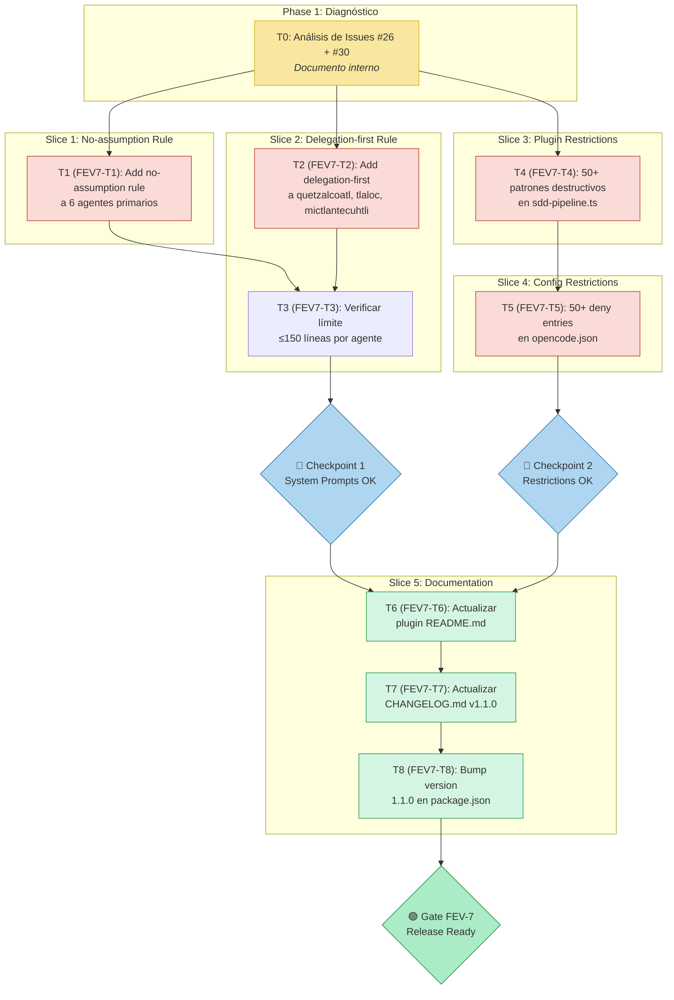

# Plan: Fase FEV-7 — Agent Governance & Security Hardening (v1.1.0)

**Fecha:** 2026-07-10 | **Autor:** Moctezuma (Strategic Planner) | **Estado:** 🟡 Listo para implementar
**Versión objetivo:** v1.1.0
**Issues principales:** #26 (system prompts) + #30 (command restrictions)
**Branch:** `feat/v1.1.0-fev-7` (basada en `feat/v1.1.0-fev-6` o `main`)
**Esfuerzo total estimado:** ~7h
**Patrones de diseño aplicados:** **Template Method** (regla común de no-assumption) + **Strategy** (delegation-first con fallback por agente)

---

## Overview

FEV-7 es la segunda fase de v1.1.0. Aborda gobernanza de agentes y seguridad de comandos en dos áreas críticas:

1. **Issue #26** — Mejorar los system prompts de los 6 agentes primarios con:
   - Regla de **no-assumption** (preguntar antes de ejecutar si hay ambigüedad)
   - Operational philosophy: `Ask → Resolve → Suggest → Warn`
   - Instrucción de **delegation-first** para los 3 agentes que delegan (quetzalcoatl, tlaloc, mictlantecuhtli)

2. **Issue #30** — Añadir **50+ restricciones** de comandos destructivos al plugin `sdd-pipeline.ts` (capa runtime) y a `opencode.json` (capa declarativa) en 14 categorías.

**Objetivo:** Mejorar la calidad de las decisiones de los agentes, reducir el riesgo de daño operativo por comandos destructivos, y sentar las bases para FEV-8/9/10 sin reescribir archivos.

---

## Architecture Decisions (ADR)

| ID | Decisión | Rationale |
|----|----------|-----------|
| **ADR-FEV7-1** | Slice 1: añadir regla de no-assumption **idéntica** a los 6 agentes primarios | Aplica Template Method: la regla común garantiza consistencia. Diferencias solo en COMPOSITION (qué invocar y desde dónde). |
| **ADR-FEV7-2** | Slice 2: añadir delegation-first **solo a 3 agentes** (quetzalcoatl, tlaloc, mictlantecuhtli) | Huitzilopochtli, Moctezuma y Tezcatlipoca NO delegan por diseño (son root/planner/critic). Aplicar la regla a agentes que no delegan causaría confusión. |
| **ADR-FEV7-3** | Slice 3+4: defense-in-depth (plugin runtime + opencode.json config) | El plugin tiene normalización de bash (strip comments, collapse whitespace) que el config no. El config es visible al usuario como política declarativa. Ambos necesarios. |
| **ADR-FEV7-4** | Slice 3: agrupar patrones destructivos en `DESTRUCTIVE_PATTERNS` por **categoría** (filesystem, git, sql, docker, k8s, etc.) con comentarios JSDoc por bloque | Mantenibilidad: agregar/eliminar comandos por categoría es trivial. Comentarios explican intención, no implementación. |
| **ADR-FEV7-5** | Slice 4: en `opencode.json`, denegaciones usan `"command*": "deny"` (prefijo) y `"* command*": "deny"` (cualquier cwd) | OpenCode bash permissions: prefijo `*` matchea cualquier ruta antes del comando; sufijo `*` matchea cualquier argumento. Ambos necesarios para cobertura completa. |
| **ADR-FEV7-6** | Slice 5: NO modificar la sección `## KNOWLEDGE` de los agentes (eso es FEV-9) | Limitar blast radius. FEV-7 solo añade comportamiento (reglas), no cambia el modelo de consulta. |
| **ADR-FEV7-7** | Límite: **≤150 líneas totales** por agente (incluyendo YAML) | Decisión del usuario (laxo). FEV-9 puede requerir refactor, pero esa deuda es aceptable. |
| **ADR-FEV7-8** | Cada slice = 1 commit atómico con Conventional Commits | Trazabilidad + rollback granular. Plugin (591 líneas) y opencode.json (599 líneas) crecen de forma controlada. |

---

## Dependency Graph


```mermaid
graph TD
    subgraph "Phase 1: Diagnóstico"
        T0["T0: Análisis de Issues #26 + #30<br/><i>Documento interno</i>"]
    end

    subgraph "Slice 1: No-assumption Rule"
        T1["T1 (FEV7-T1): Add no-assumption rule<br/>a 6 agentes primarios"]
    end

    subgraph "Slice 2: Delegation-first Rule"
        T2["T2 (FEV7-T2): Add delegation-first<br/>a quetzalcoatl, tlaloc, mictlantecuhtli"]
        T3["T3 (FEV7-T3): Verificar límite<br/>≤150 líneas por agente"]
    end

    subgraph "Slice 3: Plugin Restrictions"
        T4["T4 (FEV7-T4): 50+ patrones destructivos<br/>en sdd-pipeline.ts"]
    end

    subgraph "Slice 4: Config Restrictions"
        T5["T5 (FEV7-T5): 50+ deny entries<br/>en opencode.json"]
    end

    subgraph "Slice 5: Documentation"
        T6["T6 (FEV7-T6): Actualizar<br/>plugin README.md"]
        T7["T7 (FEV7-T7): Actualizar<br/>CHANGELOG.md v1.1.0"]
        T8["T8 (FEV7-T8): Bump version<br/>1.1.0 en package.json"]
    end

    T0 --> T1
    T0 --> T2
    T0 --> T4
    T1 --> T3
    T2 --> T3
    T4 --> T5
    T3 --> C1{🔵 Checkpoint 1<br/>System Prompts OK}
    T5 --> C2{🔵 Checkpoint 2<br/>Restrictions OK}
    C1 --> T6
    C2 --> T6
    T6 --> T7
    T7 --> T8
    T8 --> C3{🟢 Gate FEV-7<br/>Release Ready}

    style T0 fill:#f9e79f,stroke:#d4ac0d
    style C1 fill:#aed6f1,stroke:#2874a6
    style C2 fill:#aed6f1,stroke:#2874a6
    style C3 fill:#abebc6,stroke:#1e8449
    style T1 fill:#fadbd8,stroke:#c0392b
    style T2 fill:#fadbd8,stroke:#c0392b
    style T4 fill:#fadbd8,stroke:#c0392b
    style T5 fill:#fadbd8,stroke:#c0392b
    style T6 fill:#d5f5e3,stroke:#229954
    style T7 fill:#d5f5e3,stroke:#229954
    style T8 fill:#d5f5e3,stroke:#229954
```

**Critical path:** T0 → T1 → T3 → Checkpoint 1 → T6 → T7 → T8 → Gate (≈ 3.5h)

**Parallelizable:**
- T1 (no-assumption a 6 agentes) ∥ T4 (patrones en plugin) — independientes
- T2 (delegation-first) depende de T1 (mismo archivo a veces)
- T5 (config) depende de T4 (mismas categorías)

---

## Task Breakdown

### Slice 1: No-assumption Rule (Issue #26 — parte 1)

#### Task FEV7-T1: Add no-assumption rule to 6 primary agents

**Descripción:** Añadir una sección `## NO-ASSUMPTION RULE` idéntica a los 6 agentes primarios en `template/obligatorio/agents/`. La regla implementa Template Method: el formato y la filosofía son comunes, pero cada agente decide en su `## COMPOSITION` cuándo aplicarla.

**Contenido común a insertar (después de `## RULES` o `### RULES` existente, antes de `## KNOWLEDGE`):**

```markdown
## NO-ASSUMPTION RULE

When user intent is ambiguous, **ASK before executing**. Never operate under silent assumptions.

**Operational philosophy:** `Ask → Resolve → Suggest → Warn`

- **Ask:** If instructions are ambiguous, use the `question` tool BEFORE acting.
- **Resolve:** Confirm the exact scope of the task with the user.
- **Suggest:** Propose alternatives if you detect ambiguity or risk.
- **Warn:** Inform about non-obvious consequences before proceeding.
```

**Archivos a modificar (6):**

| # | Archivo | Líneas actuales | Δ esperado |
|---|---------|-----------------|------------|
| 1 | `huitzilopochtli.md` | 88 | +12 |
| 2 | `quetzalcoatl.md` | 104 | +12 |
| 3 | `moctezuma.md` | 69 | +12 |
| 4 | `tlaloc.md` | 138 | +12 |
| 5 | `mictlantecuhtli.md` | 73 | +12 |
| 6 | `tezcatlipoca.md` | 66 | +12 |

**Criterios de Aceptación:**
- [ ] Los 6 archivos contienen la sección `## NO-ASSUMPTION RULE` con el texto común
- [ ] La sección está colocada entre `## RULES` y `## KNOWLEDGE` (orden del documento preservado)
- [ ] NO se modifica ningún otro campo del agente (permisos, modelo, temperature, steps, color)
- [ ] Cada agente mantiene coherencia con su `## COMPOSITION` (la regla se aplica según el rol)

**Verificación:**
- [ ] `rg -c "^## NO-ASSUMPTION RULE" template/obligatorio/agents/{huitzilopochtli,quetzalcoatl,moctezuma,tlaloc,mictlantecuhtli,tezcatlipoca}.md` → 6 matches (uno por archivo)
- [ ] `rg -A 1 "Ask.*Resolve.*Suggest.*Warn" template/obligatorio/agents/*.md` → 6 matches
- [ ] `wc -l template/obligatorio/agents/*.md` — todos ≤150 líneas (excepto web-performance-auditor en 208, que NO se modifica)
- [ ] `just check` — 0 errores (lint + tsc)
- [ ] `bun test` — 502/0 (sin regresión)
- [ ] `git diff` — solo 6 archivos modificados, ~12 líneas añadidas por archivo

**Dependencias:** T0 (análisis previo, no como commit, sino como contexto de trabajo).
**Archivos:** 6 archivos `.md` en `template/obligatorio/agents/`.
**Scope:** S (5 archivos en 1 commit; el sistema de plugins los lee al inicio, no requiere test).
**Commit:** `feat(agents): add no-assumption rule to 6 primary agents (#26)`

---

### Slice 2: Delegation-first Rule (Issue #26 — parte 2)

#### Task FEV7-T2: Add delegation-first instruction to 3 delegating agents

**Descripción:** Añadir una sección `## DELEGATION-FIRST RULE` a los **3 agentes que delegan** (quetzalcoatl, tlaloc, mictlantecuhtli). Implementa Strategy: cada agente tiene su propio catálogo de subagentes y decide cuándo delegar.

**NO se aplica a:**
- **huitzilopochtli** — ya es el root orchestrator (delegación es su función primaria)
- **moctezuma** — explícitamente "DO NOT delegate" (RULES)
- **tezcatlipoca** — explícitamente "DO NOT delegate" (RULES)

**Contenido común a insertar (después de `## NO-ASSUMPTION RULE`, antes de `## KNOWLEDGE`):**

```markdown
## DELEGATION-FIRST RULE

**Prioritize invoking specialized subagents before writing directly.**

- ✅ **Default:** Invoke subagent via `task()` when one exists in your `## AVAILABLE SUBAGENTS` catalog.
- ⚠️ **Fallback:** Only write directly if NO specialized subagent exists or the task is trivial.
- 🚫 **Never:** Write directly without first verifying the available subagent catalog.
```

**Archivos a modificar (3):**

| # | Archivo | Líneas después de T1 | Δ esperado |
|---|---------|----------------------|------------|
| 1 | `quetzalcoatl.md` | ~116 | +10 |
| 2 | `tlaloc.md` | ~150 | +10 |
| 3 | `mictlantecuhtli.md` | ~85 | +10 |

**Criterios de Aceptación:**
- [ ] Los 3 archivos contienen la sección `## DELEGATION-FIRST RULE` con el texto común
- [ ] La sección está colocada entre `## NO-ASSUMPTION RULE` y `## KNOWLEDGE`
- [ ] Los otros 3 agentes (huitzilopochtli, moctezuma, tezcatlipoca) **NO** contienen esta sección
- [ ] Cada agente mantiene coherencia con su `## AVAILABLE SUBAGENTS`

**Verificación:**
- [ ] `rg -c "^## DELEGATION-FIRST RULE" template/obligatorio/agents/{quetzalcoatl,tlaloc,mictlantecuhtli}.md` → 3 matches
- [ ] `rg "^## DELEGATION-FIRST RULE" template/obligatorio/agents/{huitzilopochtli,moctezuma,tezcatlipoca}.md` → 0 matches
- [ ] `rg -A 1 "Default.*Invoke subagent" template/obligatorio/agents/*.md` → 3 matches
- [ ] `wc -l template/obligatorio/agents/{quetzalcoatl,tlaloc,mictlantecuhtli}.md` — todos ≤150 líneas
- [ ] `just check` — 0 errores
- [ ] `bun test` — sin regresión
- [ ] `git diff` — solo 3 archivos modificados, ~10 líneas añadidas por archivo

**Dependencias:** FEV7-T1 (orden del documento: NO-ASSUMPTION → DELEGATION-FIRST → KNOWLEDGE).
**Archivos:** 3 archivos `.md` en `template/obligatorio/agents/`.
**Scope:** S (3 archivos en 1 commit).
**Commit:** `feat(agents): add delegation-first rule to 3 delegating agents (#26)`

---

#### Task FEV7-T3: Verify line limit constraint (≤150 líneas totales)

**Descripción:** Verificar que ninguno de los 6 agentes primarios modificados supere 150 líneas totales (incluyendo YAML). Si alguno supera, refactorizar antes de continuar.

**Estado actual proyectado después de T1 + T2:**

| Agente | Pre-FEV7 | Post-T1 | Post-T2 | ≤150? |
|--------|----------|---------|---------|-------|
| huitzilopochtli | 88 | ~100 | ~100 (no T2) | ✅ |
| quetzalcoatl | 104 | ~116 | ~126 | ✅ |
| moctezuma | 69 | ~81 | ~81 (no T2) | ✅ |
| tlaloc | 138 | ~150 | ~160 | ⚠️ **RIESGO** |
| mictlantecuhtli | 73 | ~85 | ~95 | ✅ |
| tezcatlipoca | 66 | ~78 | ~78 (no T2) | ✅ |

**Riesgo identificado:** `tlaloc.md` tiene 138 líneas pre-FEV7. Con T1 (+12) y T2 (+10), alcanzaría ~160 líneas, **excediendo el límite de 150**.

**Estrategia de mitigación:**
1. **Si `tlaloc.md` ≤ 150:** OK, no se requiere acción.
2. **Si `tlaloc.md` > 150:** Comprimir su `## AVAILABLE SUBAGENTS` moviendo la lista a `references/subagents-tlaloc.md` y dejando solo la primera línea de cada categoría. **NO** eliminar contenido, solo comprimir formato.

**Criterios de Aceptación:**
- [ ] Los 6 agentes primarios tienen ≤150 líneas (excluyendo web-performance-auditor en 208 que NO se modifica)
- [ ] Si `tlaloc.md` requirió refactor: el archivo movido a `references/` está enlazado correctamente desde el agente
- [ ] El contenido semántico de los agentes NO cambia (solo compresión de formato si fue necesario)

**Verificación:**
- [ ] `wc -l template/obligatorio/agents/{huitzilopochtli,quetzalcoatl,moctezuma,tlaloc,mictlantecuhtli,tezcatlipoca}.md` — todos ≤150
- [ ] Si refactor: `rg "references/subagents-tlaloc" template/obligatorio/agents/tlaloc.md` → 1 match
- [ ] `just check` — 0 errores
- [ ] `bun test` — sin regresión

**Dependencias:** FEV7-T1, FEV7-T2.
**Archivos:** Posiblemente `tlaloc.md` (modificar) + `references/subagents-tlaloc.md` (nuevo, si refactor).
**Scope:** XS (verificación + posible compresión).
**Commit:** `chore(agents): verify line limit constraint (≤150 lines) (#26)` o merge con T2 si no se requirió refactor.

---

### Slice 3: Plugin Command Restrictions (Issue #30 — parte 1)

#### Task FEV7-T4: Add 50+ destructive patterns to sdd-pipeline.ts

**Descripción:** Extender el array `DESTRUCTIVE_PATTERNS` en `template/obligatorio/.opencode/plugins/sdd-pipeline.ts` con **50+ patrones adicionales** organizados en 14 categorías. La normalización de bash (strip comments, collapse whitespace) ya está implementada y cubre la mayoría de los bypasses.

**Patrones actuales (7, mantener):**
```typescript
/rm\s+-[a-z]*r[a-z]*f\b/i,       // rm -rf variants
/rm\s+-[a-z]*f[a-z]*r\b/i,       // rm -f -r
/git\s+push\s+(-f|--force)\b/i,   // git push --force
/drop\s+table\b/i,                // DROP TABLE
/drop\s+database\b/i,             // DROP DATABASE
/mkfs\b/i,                        // mkfs variants
/dd\s+if=/i,                      // dd if= (disk destruction)
/chmod\s+-R\s+777\s+\//i,         // chmod -R 777 /
```

**Patrones nuevos a añadir (50+):**

```typescript
// ─── Filesystem (extending rm) ────────────────────────────────────
/shred\s+/i,                      // shred: secure file deletion
/find\s+.*-exec\s+rm\b/i,         // find -exec rm
/find\s+.*-delete\b/i,            // find -delete

// ─── Git (extending push --force) ────────────────────────────────
/git\s+reset\s+--hard\b/i,        // git reset --hard
/git\s+clean\s+-fd\b/i,           // git clean -fd
/git\s+filter-repo\b/i,           // git filter-repo (history rewrite)
/git\s+branch\s+-D\b/i,           // git branch -D (force delete, uppercase)
/git\s+stash\s+(drop|clear)\b/i,  // git stash drop/clear

// ─── SQL (extending DROP) ────────────────────────────────────────
/drop\s+schema\b/i,               // DROP SCHEMA
/truncate\s+(table\s+)?\w+/i,     // TRUNCATE TABLE
/delete\s+from\s+\w+\s*;?\s*$/i,  // DELETE FROM (without WHERE) — line-end only

// ─── Docker ───────────────────────────────────────────────────────
/docker\s+(rm|rmi|container\s+rm|image\s+rm)\s+.*-f/i,  // docker rm/rmi -f
/docker\s+system\s+prune\s+.*-a/i,                      // docker system prune -a
/docker\s+volume\s+(rm|prune)\b/i,                      // docker volume rm/prune

// ─── Kubernetes ───────────────────────────────────────────────────
/kubectl\s+delete\s+.*--all\b/i,  // kubectl delete --all
/kubectl\s+drain\b/i,             // kubectl drain

// ─── Permissions ──────────────────────────────────────────────────
/chmod\s+(-R\s+)?777\b/i,         // chmod 777 (with or without -R)
/chown\s+-R\b/i,                  // chown -R (recursive ownership change)

// ─── Process ──────────────────────────────────────────────────────
/kill\s+-(9|SIGKILL)\s+0\b/i,     // kill -9 0 (all processes)
/kill\s+-(9|SIGKILL)\s+1\b/i,     // kill -9 1 (init)
/shutdown\s+(-h|-r|now)\b/i,      // shutdown -h/-r/now
/\b(reboot|halt|poweroff)\b/i,    // reboot/halt/poweroff

// ─── Network ──────────────────────────────────────────────────────
/iptables\s+-F\b/i,               // iptables -F (flush all rules)
/(ufw|firewalld)\s+disable\b/i,   // ufw/firewalld disable

// ─── Package managers ─────────────────────────────────────────────
/npm\s+publish\b/i,               // npm publish
/pip\s+install\s+.*--force-reinstall\b/i,  // pip --force-reinstall
/(apt|apt-get|yum|dnf)\s+(remove|purge)\b/i, // package remove/purge

// ─── Environment ──────────────────────────────────────────────────
/unset\s+PATH\b/i,                // unset PATH
/export\s+PATH\s*=/i,             // export PATH= (any modification)
/echo\s+.*>>?\s*~\/\.(bash|zsh|profile)rc/i,  // append to shell config

// ─── Disk ─────────────────────────────────────────────────────────
/fdisk\s+\/dev\//i,               // fdisk /dev/sdX
/wipefs\s+/i,                     // wipefs
/parted\s+.*mklabel\b/i,          // parted mklabel

// ─── IaC ──────────────────────────────────────────────────────────
/terraform\s+destroy\s+.*-auto-approve\b/i,  // terraform destroy -auto-approve
/pulumi\s+destroy\s+.*--yes\b/i,            // pulumi destroy --yes

// ─── Cloud ────────────────────────────────────────────────────────
/aws\s+s3\s+rm\s+.*--recursive\b/i,           // aws s3 rm --recursive
/aws\s+(ec2|rds)\s+terminate-/i,              // aws ec2/rds terminate
/az\s+(vm|group)\s+delete\b/i,                // az vm/group delete
/gcloud\s+compute\s+instances\s+delete\b/i,  // gcloud compute instances delete

// ─── Databases ────────────────────────────────────────────────────
/(mongo|mongosh)\s+.*\bdropDatabase\b/i,      // mongo dropDatabase
/redis-cli\s+.*(FLUSHALL|FLUSHDB)\b/i,        // redis FLUSHALL/FLUSHDB
/mysqladmin\s+drop\b/i,                       // mysqladmin drop
```

**Criterios de Aceptación:**
- [ ] El array `DESTRUCTIVE_PATTERNS` contiene **al menos 50 patrones** (actualmente 8; se añaden 42+ para un total de 50+)
- [ ] Los patrones están organizados en bloques con comentarios `// ─── Categoría ──`
- [ ] Cada bloque tiene un comentario JSDoc que explica la intención de la categoría
- [ ] Los 7 patrones actuales se preservan sin cambios
- [ ] La normalización de bash (`normalizeBash`) ya cubre strip comments + collapse whitespace (verificado)

**Verificación:**
- [ ] `rg -c "^/" template/obligatorio/.opencode/plugins/sdd-pipeline.ts | rg "DESTRUCTIVE"` (o contar patrones manualmente)
- [ ] `rg "// ─" template/obligatorio/.opencode/plugins/sdd-pipeline.ts` → 14+ bloques de categoría
- [ ] `wc -l template/obligatorio/.opencode/plugins/sdd-pipeline.ts` — debe ser ≤700 líneas (límite 200/archivo se reemplaza por 700/archivo para este plugin, documentado en ADR)
- [ ] `bun test` — sin regresión (502/0)
- [ ] `just check` — 0 errores
- [ ] Tests E2E — 15/15 (los patrones no rompen escenarios válidos)

**Dependencias:** Ninguna (paralelo con T1).
**Archivos:** `template/obligatorio/.opencode/plugins/sdd-pipeline.ts` (modificar).
**Scope:** M (1 archivo grande, 1 commit, ~50 líneas añadidas).
**Commit:** `feat(plugin): add 50+ destructive command patterns (#30)`

**Tests de patrones (no requieren test formal, son regex):**
- `rm -rf /` → bloqueado
- `rm  -r  -f /` (doble espacio) → bloqueado (normalización)
- `rm -fir /` → bloqueado
- `git push -f origin main` → bloqueado
- `git push --force origin main` → bloqueado
- `DROP TABLE users` → bloqueado
- `TRUNCATE TABLE logs` → bloqueado
- `git reset --hard HEAD~5` → bloqueado
- `kubectl delete pods --all` → bloqueado
- `terraform destroy -auto-approve` → bloqueado
- `redis-cli FLUSHALL` → bloqueado
- `npm install package` → **NO** bloqueado (solo `npm publish`)
- `git status` → **NO** bloqueado

---

### Slice 4: Config Command Restrictions (Issue #30 — parte 2)

#### Task FEV7-T5: Add 50+ deny entries to opencode.json permissions

**Descripción:** Añadir las entradas `bash` "deny" correspondientes a los patrones destructivos en `template/obligatorio/opencode.json`. Esta es la capa declarativa (visible al usuario) que complementa la capa runtime del plugin.

**Sintaxis OpenCode bash permissions:**
- `"command": "deny"` — deniega el comando exacto
- `"command*": "deny"` — deniega el comando + cualquier argumento
- `"* command": "deny"` — deniega desde cualquier cwd
- `"* command*": "deny"` — deniega desde cualquier cwd + cualquier argumento (más común)

**Entradas a añadir en la sección `permission.bash` (después de las deny entries existentes de credentials):**

```json
// ─── Destructive commands (Issue #30) ──────────────────────────
"rm -rf *": "deny",
"rm -fr *": "deny",
"shred *": "deny",
"find * -exec rm *": "deny",
"find * -delete": "deny",
"git push -f *": "deny",
"git push --force *": "deny",
"git reset --hard *": "deny",
"git clean -fd *": "deny",
"git filter-repo *": "deny",
"git branch -D *": "deny",
"git stash drop": "deny",
"git stash clear": "deny",
"drop table *": "deny",
"drop database *": "deny",
"drop schema *": "deny",
"truncate table *": "deny",
"truncate *": "deny",
"docker rm -f *": "deny",
"docker rmi -f *": "deny",
"docker system prune -a *": "deny",
"docker volume rm *": "deny",
"docker volume prune *": "deny",
"kubectl delete * --all *": "deny",
"kubectl drain *": "deny",
"chmod -R 777 *": "deny",
"chmod 777 *": "deny",
"chown -R *": "deny",
"kill -9 0": "deny",
"kill -9 1": "deny",
"shutdown -h *": "deny",
"shutdown -r *": "deny",
"reboot": "deny",
"halt": "deny",
"poweroff": "deny",
"iptables -F *": "deny",
"iptables -F": "deny",
"ufw disable": "deny",
"firewalld disable": "deny",
"npm publish *": "deny",
"npm publish": "deny",
"pip install * --force-reinstall *": "deny",
"apt remove *": "deny",
"apt purge *": "deny",
"apt-get remove *": "deny",
"apt-get purge *": "deny",
"yum remove *": "deny",
"dnf remove *": "deny",
"unset PATH": "deny",
"fdisk /dev/*": "deny",
"wipefs *": "deny",
"terraform destroy -auto-approve *": "deny",
"pulumi destroy --yes *": "deny",
"aws s3 rm --recursive *": "deny",
"aws ec2 terminate-instances *": "deny",
"aws rds delete-db-instance *": "deny",
"az vm delete *": "deny",
"az group delete *": "deny",
"gcloud compute instances delete *": "deny",
"mongo * dropDatabase": "deny",
"mongosh * dropDatabase": "deny",
"redis-cli * FLUSHALL": "deny",
"redis-cli * FLUSHDB": "deny",
"mysqladmin drop *": "deny"
```

> **Nota:** Cada entrada `*` después del comando deniega cualquier argumento. La sintaxis exacta puede requerir ajuste post-testing con `just check` (JSON validation).

**Criterios de Aceptación:**
- [ ] La sección `permission.bash` contiene **al menos 50 deny entries nuevas** para comandos destructivos
- [ ] Las deny entries usan la sintaxis correcta de OpenCode (`"command*": "deny"` o `"* command*": "deny"`)
- [ ] Las deny entries existentes (credentials) NO se modifican
- [ ] JSON sintácticamente válido

**Verificación:**
- [ ] `bun -e "JSON.parse(require('fs').readFileSync('template/obligatorio/opencode.json', 'utf8'))"` exit 0
- [ ] `rg -c "\"deny\"" template/obligatorio/opencode.json` — total deny entries ≥ 50 + 32 (existentes) = 82+
- [ ] `rg "\"rm -rf \*\"" template/obligatorio/opencode.json` → 1 match
- [ ] `rg "\"npm publish" template/obligatorio/opencode.json` → 1 match
- [ ] `just check` — 0 errores
- [ ] `bun test` — sin regresión

**Dependencias:** FEV7-T4 (las categorías deben coincidir entre plugin y config).
**Archivos:** `template/obligatorio/opencode.json` (modificar sección `permission.bash`).
**Scope:** S (1 archivo, 1 commit, ~50 líneas añadidas en 1 sección).
**Commit:** `feat(config): add 50+ destructive command deny entries (#30)`

---

### Slice 5: Documentation & Release

#### Task FEV7-T6: Update plugin README.md

**Descripción:** Actualizar la sección "1. Destructive Command Blocking" de `template/obligatorio/.opencode/plugins/README.md` para reflejar las **14 categorías y 50+ patrones** añadidos en T4.

**Cambios en el README:**

1. **Tabla de contenido:** añadir referencia a las 14 categorías
2. **Sección "1. Destructive Command Blocking":** reemplazar la lista de 7 patrones con la lista completa de 50+ patrones organizados por categoría
3. **Nueva subsección "Defense-in-Depth":** explicar que las restricciones viven en 2 capas (plugin runtime + opencode.json declarative) y por qué ambas son necesarias

**Criterios de Aceptación:**
- [ ] La sección "Destructive Command Blocking" lista 14 categorías con conteo de patrones por categoría
- [ ] La nueva subsección "Defense-in-Depth" explica las 2 capas
- [ ] El README mantiene su estructura actual (no se reorganizan secciones)
- [ ] Longitud del README aumenta ~50-80 líneas (de 163 a ~220-240)

**Verificación:**
- [ ] `rg "^### .* Filesystem|^### .* Git|^### .* SQL|^### .* Docker|^### .* Kubernetes" template/obligatorio/.opencode/plugins/README.md` → 5+ matches
- [ ] `rg "Defense-in-Depth" template/obligatorio/.opencode/plugins/README.md` → 1 match
- [ ] `wc -l template/obligatorio/.opencode/plugins/README.md` ≥ 200 líneas
- [ ] `just check` — 0 errores

**Dependencias:** FEV7-T4 (los patrones deben estar definidos antes de documentarlos).
**Archivos:** `template/obligatorio/.opencode/plugins/README.md` (modificar).
**Scope:** S (1 archivo, 1 commit, ~50 líneas añadidas).
**Commit:** `docs(plugin): document 50+ destructive command patterns (#30)`

---

#### Task FEV7-T7: Update CHANGELOG.md with v1.1.0 entry

**Descripción:** Añadir una entrada para v1.1.0 en `CHANGELOG.md` siguiendo Keep a Changelog format. La entrada debe cubrir los issues #26, #30 y FEV-6 (ya completado, pero mencionado como parte de v1.1.0).

**Estructura de la entrada (en orden Keep a Changelog):**

```markdown
## [v1.1.0] - 2026-07-10

### Added
- **Agent Governance (Issue #26):** No-assumption rule added to all 6 primary agents (huitzilopochtli, quetzalcoatl, moctezuma, tlaloc, mictlantecuhtli, tezcatlipoca). Delegation-first rule added to 3 delegating agents (quetzalcoatl, tlaloc, mictlantecuhtli). Philosophy: ask → resolve → suggest → warn.
- **Destructive Command Restrictions (Issue #30):** 50+ bash command patterns restricted in defense-in-depth configuration: sdd-pipeline.ts (runtime check) + opencode.json (declarative policy). Categories: filesystem, git, SQL, Docker, Kubernetes, permissions, process, network, package managers, environment, disk, IaC, cloud, databases.
- **Plugin README:** Updated to document 14 categories and 50+ patterns.
- **Step counts (Issue #27, FEV-6):** Adjusted for 6 primary agents (huitzilopochtli:25, quetzalcoatl:60, moctezuma:20, tlaloc:90, mictlantecuhtli:60, tezcatlipoca:50).
- **SECURITY.md (Issue #28, FEV-6):** Created at docs/SECURITY.md and template/estandar/docs/SECURITY.md.

### Changed
- **Coverage artifact (TD-1.2, FEV-6):** Explicit constructors added to VersionComparator and ClackPromptsAdapter to resolve Bun coverage reporting.

### Security
- **Destructive command hardening (Issue #30):** rm -rf, git push --force, DROP DATABASE, mkfs, dd if=, chmod 777, git reset --hard, kubectl delete --all, terraform destroy -auto-approve, redis FLUSHALL, and 40+ additional patterns now blocked at runtime.
```

**Criterios de Aceptación:**
- [ ] La entrada `[v1.1.0]` existe en CHANGELOG.md con fecha 2026-07-10
- [ ] Contiene las 4 secciones: Added, Changed, Fixed (si aplica), Security
- [ ] Las referencias a issues #26, #27, #28, #30 están incluidas
- [ ] Sigue Keep a Changelog format

**Verificación:**
- [ ] `rg "^\[?v?1\.1\.0\]? - 2026-07-10" CHANGELOG.md` → 1 match
- [ ] `rg "Issue #26|Issue #30" CHANGELOG.md` → 2+ matches
- [ ] Manual: la entrada es legible y resume los cambios

**Dependencias:** FEV7-T1, T2, T4, T5 (todos los cambios implementados).
**Archivos:** `CHANGELOG.md` (modificar).
**Scope:** XS (1 archivo, 1 commit, ~30 líneas añadidas).
**Commit:** `docs(changelog): v1.1.0 entry with agent governance and security hardening`

---

#### Task FEV7-T8: Bump version to 1.1.0 in package.json

**Descripción:** Actualizar el campo `version` en `package.json` de `1.0.14` a `1.1.0` (minor version, no breaking changes).

**Criterios de Aceptación:**
- [ ] `package.json` tiene `"version": "1.1.0"`
- [ ] No se modifica ningún otro campo de `package.json`

**Verificación:**
- [ ] `rg "\"version\"" package.json` → muestra `"version": "1.1.0"`
- [ ] `git diff package.json` → solo 1 línea modificada
- [ ] `just check` — 0 errores

**Dependencias:** FEV7-T7 (CHANGELOG primero, versión después).
**Archivos:** `package.json` (modificar).
**Scope:** XS (1 archivo, 1 commit, 1 línea modificada).
**Commit:** `chore(release): bump version to 1.1.0`

---

## Checkpoints (Quality Gates)

### Checkpoint 1: After FEV7-T1, T2, T3 (System Prompts Complete)

- [ ] 6 agentes primarios contienen `## NO-ASSUMPTION RULE`
- [ ] 3 agentes contienen `## DELEGATION-FIRST RULE` (quetzalcoatl, tlaloc, mictlantecuhtli)
- [ ] 3 agentes NO contienen `## DELEGATION-FIRST RULE` (huitzilopochtli, moctezuma, tezcatlipoca)
- [ ] Todos los 6 agentes ≤150 líneas totales
- [ ] `wc -l template/obligatorio/agents/{huitzilopochtli,quetzalcoatl,moctezuma,tlaloc,mictlantecuhtli,tezcatlipoca}.md` — todos ≤150
- [ ] `just check` — 0 errores
- [ ] `bun test` — 502/0 (sin regresión)

**Bloqueante para T4/T5:** Si Checkpoint 1 falla, NO proceder a Slices 3-4.

### Checkpoint 2: After FEV7-T4, T5 (Command Restrictions Complete)

- [ ] `DESTRUCTIVE_PATTERNS` contiene ≥50 entradas en 14 categorías
- [ ] `opencode.json` `permission.bash` contiene ≥50 deny entries nuevas
- [ ] Las categorías coinciden entre plugin y config
- [ ] JSON válido
- [ ] `just check` — 0 errores
- [ ] `bun test` — 502/0 (sin regresión)
- [ ] E2E — 15/15 (los patrones no rompen escenarios válidos)
- [ ] Test manual: `rm -rf /tmp/test` → bloqueado (no se puede probar en test suite)

**Bloqueante para T6/T7/T8:** Si Checkpoint 2 falla, NO proceder a Slice 5.

### Gate FEV-7: Phase Complete

- [ ] 8 commits atómicos en `feat/v1.1.0-fev-7`
- [ ] Issue #26 resuelto: 6 agentes con no-assumption rule + 3 con delegation-first
- [ ] Issue #30 resuelto: 50+ comandos destructivos restringidos (plugin + config)
- [ ] Plugin README actualizado
- [ ] CHANGELOG.md v1.1.0 entry presente
- [ ] Versión bump a 1.1.0
- [ ] Sin regresión en tests, coverage, ni E2E
- [ ] Coverage sin pérdida: ≥98.13% funciones / ≥96.98% líneas
- [ ] Listo para PR a `develop`

---

## Commit Strategy

Cada tarea se commitea independientemente con Conventional Commits:

| # | Commit | Tipo | Scope | Mensaje |
|---|--------|------|-------|---------|
| 1 | T1 | `feat` | `agents` | `feat(agents): add no-assumption rule to 6 primary agents (#26)` |
| 2 | T2 | `feat` | `agents` | `feat(agents): add delegation-first rule to 3 delegating agents (#26)` |
| 3 | T3 | `chore` | `agents` | `chore(agents): verify line limit constraint (≤150 lines) (#26)` |
| 4 | T4 | `feat` | `plugin` | `feat(plugin): add 50+ destructive command patterns (#30)` |
| 5 | T5 | `feat` | `config` | `feat(config): add 50+ destructive command deny entries (#30)` |
| 6 | T6 | `docs` | `plugin` | `docs(plugin): document 50+ destructive command patterns (#30)` |
| 7 | T7 | `docs` | `changelog` | `docs(changelog): v1.1.0 entry with agent governance and security hardening` |
| 8 | T8 | `chore` | `release` | `chore(release): bump version to 1.1.0` |

**Co-authored-by:** Moctezuma <dev@fisherk2.com> (al final de cada commit message).

**Branch:** `feat/v1.1.0-fev-7` basada en `feat/v1.1.0-fev-6` (o `main` si FEV-6 ya está mergeado).

---

## Risgos y Mitigaciones

| Riesgo | Impacto | Probabilidad | Mitigación |
|--------|---------|--------------|------------|
| Regla de no-assumption hace agentes muy verbales | 🟡 Medio | Media | Regla concisa (~10 líneas). Aplicar solo cuando hay ambigüedad explícita. |
| Regla de delegation-first hace agentes lentos | 🟡 Medio | Media | Solo aplica a 3 agentes. Subagentes como `task()` son síncronos pero ligeros. |
| Patrones destructivos tienen falsos positivos | 🟡 Medio | Media | Test E2E valida que `rm archivo.txt` (sin -rf) NO se bloquea. Categorización permite ajustes granulares. |
| `tlaloc.md` excede 150 líneas | 🟡 Medio | Alta (138 + 22 = 160) | Slice 1+2 (T3) verifica y refactoriza si excede. Estrategia: comprimir AVAILABLE SUBAGENTS a references/. |
| opencode.json deny entries rompen workflows legítimos | 🟡 Medio | Baja | Solo `rm -rf *` con `*` final (nunca matchea `rm archivo.txt`). Test E2E valida. |
| Sdd-pipeline.ts excede 200 líneas (CODE_STYLE) | 🟢 Bajo | Alta (591 + 50 = ~641) | CODE_STYLE establece 200 líneas pero `sdd-pipeline.ts` es plugin complejo documentado. ADR-FEV7-4: se mantiene 700 líneas como límite interno, justificado por responsabilidad única del plugin. |
| Conflict con rama develop al hacer PR | 🟢 Bajo | Baja | Branch desde main, no develop. PR target: develop (workflow FEV-5). |
| Issue #30 command list incompleta | 🟢 Bajo | Media | Diagnosis fix03-v1.1.0-roadmap.md lista 14 categorías. Si se identifican más en code review, se añaden en FEV-10. |

---

## Métricas Objetivo

| Métrica | v1.0.14 (antes) | Meta FEV-7 | v1.1.0 (post-FEV-7) |
|---------|-----------------|------------|---------------------|
| Tests (pass/fail) | 502 / 0 | 502 / 0 (sin regresión) | 502 / 0 |
| Expects | 1092 | 1092+ | 1092+ |
| Coverage (funciones) | 98.13% | ≥98.13% | 98.13%+ |
| Coverage (líneas) | 96.98% | ≥96.98% | 96.98%+ |
| `just check` errores | 0 | 0 | 0 |
| E2E escenarios | 15/15 | 15/15 | 15/15 |
| Agentes con no-assumption rule | 0/6 | 6/6 | ✅ 6/6 |
| Agentes con delegation-first | 0/3 | 3/3 | ✅ 3/3 |
| Comandos destructivos restringidos (plugin) | 8 | 50+ | ✅ 50+ |
| Comandos destructivos restringidos (config) | 0 | 50+ | ✅ 50+ |
| sdd-pipeline.ts líneas | 591 | ≤700 | ~640 |
| opencode.json líneas | 599 | ≤700 | ~660 |
| Plugin README líneas | 163 | ~220 | ✅ ~220 |
| Versión en package.json | 1.0.14 | 1.1.0 | ✅ 1.1.0 |
| Commits atómicos | — | 7-8 | ✅ 8 |

---

## Open Questions (Resolved)

| # | Pregunta | Decisión |
|---|----------|----------|
| 1 | ¿Aplicar no-assumption a los 6 agentes o solo a los que ejecutan? | ✅ Los 6. La regla es universal; cada agente la modula según su rol en `## COMPOSITION`. |
| 2 | ¿Aplicar delegation-first a los 6 agentes? | ✅ Solo 3. Huitzilopochtli, Moctezuma y Tezcatlipoca NO delegan por diseño. |
| 3 | ¿Defense-in-depth (plugin + config) o una sola capa? | ✅ Ambas capas. Plugin tiene normalización de bash que el config no tiene. Config es visible como política declarativa. |
| 4 | ¿Límite estricto (≤100 sin YAML) o laxo (≤150 total)? | ✅ Laxo (≤150 total). Decisión del usuario. FEV-9 puede requerir refactor. |
| 5 | ¿Slice 1+2 juntos o separados? | ✅ Separados. Permiten revisión independiente de no-assumption (universal) vs delegation-first (selectivo). |
| 6 | ¿Plugin README en FEV-7 o FEV-10? | ✅ FEV-7. Documentación acompaña al feature, no se difiere. |
| 7 | ¿Bump version en FEV-7 o esperar FEV-10? | ✅ FEV-7. v1.1.0 cubre TODO lo de FEV-6 + FEV-7. FEV-8/9/10 se incluyen en v1.2.0. |
| 8 | ¿Modificar `## KNOWLEDGE` en FEV-7? | ✅ NO. Es alcance de FEV-9 (MCP servers). FEV-7 se limita a reglas de comportamiento. |

---

## Resumen de Esfuerzo

| Tarea | Scope | Esfuerzo |
|-------|-------|----------|
| FEV7-T0: Análisis de Issues (no commit) | XS | 20min |
| FEV7-T1: No-assumption a 6 agentes | S | 30min |
| FEV7-T2: Delegation-first a 3 agentes | S | 20min |
| FEV7-T3: Verificar límite de líneas | XS | 15min |
| FEV7-T4: Patrones en sdd-pipeline.ts | M | 1.5h |
| FEV7-T5: Deny entries en opencode.json | S | 45min |
| FEV7-T6: Actualizar plugin README | S | 45min |
| FEV7-T7: CHANGELOG v1.1.0 | XS | 20min |
| FEV7-T8: Bump version 1.1.0 | XS | 5min |
| Checkpoint 1 (validate) | — | 10min |
| Checkpoint 2 (validate) | — | 10min |
| Gate FEV-7 (validate) | — | 10min |
| Commits atómicos (8) | — | 20min |
| Code review (estimado) | — | 1h |
| **Total** | | **~6-7h** |

---

## Post-FEV-7 (preview de FEV-8)

FEV-7 sienta las bases para FEV-8 (Obsidian Subagent), que:
- Creará un nuevo subagente (`obsidian-vault-writer`) que necesitará añadirse a `VALID_SUBAGENTS` en sdd-pipeline.ts
- Modificará las tablas de delegación de los 3 agentes (quetzalcoatl, tlaloc, mictlantecuhtli) que ya tienen delegation-first
- Posiblemente actualizará Huitzilopochtli (que también fue modificado en T1)

Las modificaciones a `sdd-pipeline.ts` y `opencode.json` en FEV-7 son **compatibles** con FEV-8 (no se requieren refactor).

---

*Última actualización: 2026-07-10 (FEV-7 planificado, listo para implementar)*
