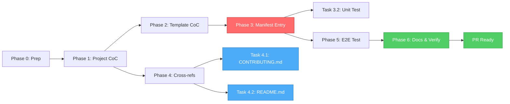
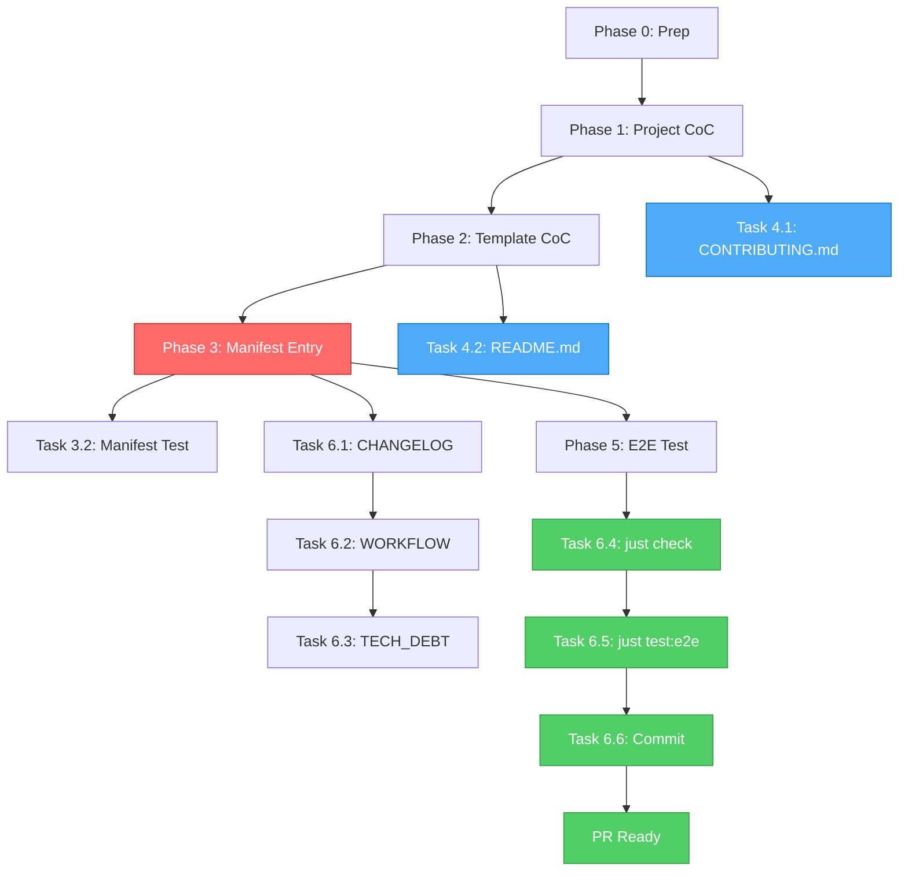

# Implementation Plan: FEV-15 — Community Standards (v1.2 Phase 5)

**Phase:** FEV-15 (v1.2 Phase 5) — 📋 Pendiente
**Issue:** [#55](https://github.com/fisherk2/codice-opencode/issues/55) — Añadir código de conducta
**Spec:** [SPEC.md](../SPEC.md), [docs/WORKFLOW.md](../docs/WORKFLOW.md) §FEV-15, [docs/diagnosis/fix08-v1.2-phase5-community.md](../docs/diagnosis/fix08-v1.2-phase5-community.md)
**Date:** 2026-07-30
**Author:** Moctezuma (Strategic Planner)
**Branch base:** `feat/ux-docs-wiki` (FEV-14 ya mergeado)
**Methodology:** Vertical slicing + Strategy pattern (manifest category) + Additive docs

---

## Overview

Resolver **Issue #55** añadiendo un **Code of Conduct** al proyecto Códice y un **placeholder personalizable** al template de workspace. El CoC del proyecto sigue **Contributor Covenant v2.1** (estándar de la industria usado por React, Rails, Node.js). El CoC del template usa placeholders `[PROJECT_NAME]`, `[CONTACT_EMAIL]`, `[PROJECT_URL]` que el usuario final personaliza al instalarlo en su proyecto.

**Cambio técnico crítico (identificado en `fix08`, omitido en `WORKFLOW.md` §FEV-15):** El template `CODE_OF_CONDUCT.md` **no se copiará al destino** a menos que se registre en `src/domain/entities/FileRuleManifestData.ts` con `category: "standard"`. Sin esta entrada, el CoC queda huérfano en `template/estandar/` y nunca se entrega. El plan lo incluye como **Task 3** (no opcional).

**Restricciones del usuario confirmadas (vía question tool, 2026-07-30):**
- **Alcance:** Completo (8 tareas) — incluye `FileRuleManifestData.ts`
- **Wiki:** Omitir (sin menciones en `Home.md` / `Getting-Started.md`; sync Wiki se hace desde `README.md`)
- **Test E2E:** Extender `tests/e2e/01-clean-install.sh` existente con 2 asserts (no crear scenario nuevo)

**Versión:** Sin bump. v1.2.0 se cierra coordinadamente con FEV-12 ✅ + FEV-13 ✅ + FEV-14 ✅ + FEV-15.

---

## Architecture Decisions

| Decision | Rationale |
|----------|-----------|
| **Contributor Covenant v2.1 para el proyecto** | Estándar de la industria; familiares para contributors; bien mantenido; ~99% compatible con GitHub's "Suggesting code of conduct" feature. |
| **Placeholder con `[BRACKETS]` para el template** | El usuario personaliza su CoC al instalarlo. Mismo enfoque que usan `awesome-opencode` y otros templates. Reduce fricción. |
| **`category: "standard"` en `FileRuleManifestData.ts`** | El CoC NO es obligatorio (no debe sobrescribir CoC existente del usuario), pero sí debe entregarse por defecto. Coincide con la semántica de "Estándar: copied only if missing" del SPEC. |
| **Sección "Code of Conduct" en `CONTRIBUTING.md` antes de "Quick Start"** | El SPEC y la convención GitHub colocan CoC cerca del inicio. Establece expectativas antes de cualquier otra guía. |
| **Sección "## Code of Conduct" en `README.md` antes de "## License"** | Consistente con orden GitHub estándar (Features → Install → Workflow → CoC → License → Acknowledgments). Reduce fricción de discovery. |
| **Sin menciones en Wiki** | Decisión del usuario. La Wiki se sincroniza desde `docs/wiki-source/` que es espejada desde `README.md`/`CONTRIBUTING.md`. La cobertura es transitiva. |
| **Sin nuevo scenario E2E; extender `01-clean-install.sh`** | CoC se entrega como parte de la instalación estándar. Verificarlo en el scenario canónico de Clean Install es la cobertura más natural. Decisión del usuario. |
| **Sin tests unitarios para el contenido del CoC** | Es documentación, no lógica. Verificar que se entrega (E2E) y que el manifest lo conoce (unit test existente) es suficiente. |
| **Sin bump de versión** | Cierre coordinado FEV-12/13/14/15 → todos publican bajo v1.2.0. Mantener consistencia con FEV-14. |
| **Total: ~150 líneas nuevas (1 nuevo en project, 1 nuevo en template, 1 línea en manifest, ~10 en CONTRIBUTING, ~10 en README, ~2 en E2E, ~15 en CHANGELOG, ~10 en WORKFLOW)** | Pequeño y enfocado. Consistente con esfuerzo estimado de 2h. |

---

## Dependency Graph

```
Phase 0: Preparation (sequential, no deps)
└── Task 0.1: Create branch feat/fev15-community from develop
└── Task 0.2: Verify baseline (just check + bun test exit 0)

Phase 1: Project Code of Conduct (sequential, no deps after Phase 0)
└── Task 1.1: Create CODE_OF_CONDUCT.md (Contributor Covenant v2.1)

Phase 2: Template Code of Conduct (depends on Phase 1 for reference)
└── Task 2.1: Create template/estandar/CODE_OF_CONDUCT.md (placeholder)

Phase 3: FileRuleManifestData integration (CRITICAL — depends on Phase 2)
└── Task 3.1: Add CODE_OF_CONDUCT.md entry to FileRuleManifestData.ts
└── Task 3.2: Unit test: manifest includes CODE_OF_CONDUCT.md with category "standard"

Phase 4: Cross-references (parallel, all depend on Phase 1)
├── Task 4.1: Update CONTRIBUTING.md (add "Code of Conduct" section)
└── Task 4.2: Update README.md (add "## Code of Conduct" section)

Phase 5: E2E Test (depends on Phase 3)
└── Task 5.1: Extend tests/e2e/01-clean-install.sh with 2 CoC asserts

Phase 6: Documentation & Verification (depends on all above)
├── Task 6.1: Update CHANGELOG.md (FEV-15 entry under [Unreleased])
├── Task 6.2: Update docs/WORKFLOW.md (mark FEV-15 complete)
├── Task 6.3: Update docs/TECH_DEBT.md (resolve FEV-15 row)
├── Task 6.4: just check + bun test (full suite, ≥809 + new = ≥810)
├── Task 6.5: just test:e2e (19/19 + extended = 19/19 passing)
└── Task 6.6: Commit with trailer Co-Authored-By: Moctezuma

Checkpoint: FEV-15 Complete ✅
└── Issue #55 closed, PR ready for review
```

**Critical path:** Phase 0 → 1 → 2 → 3 → 4 → 5 → 6 (~2h wall-clock)
**Parallelizable:** Phase 4 (CONTRIBUTING.md and README.md can be done in parallel)
**Risk mitigation:** Phase 3 (FileRuleManifestData) is the only place where a bug would silently break template delivery. Unit test in 3.2 catches it pre-E2E.

---

## Mermaid Dependency Diagram


```mermaid
graph LR
    P0[Phase 0: Prep] --> P1[Phase 1: Project CoC]
    P1 --> P2[Phase 2: Template CoC]
    P2 --> P3[Phase 3: Manifest Entry]
    P3 --> P3T[Task 3.2: Unit Test]
    P1 --> P4[Phase 4: Cross-refs]
    P4 --> P4A[Task 4.1: CONTRIBUTING.md]
    P4 --> P4B[Task 4.2: README.md]
    P3 --> P5[Phase 5: E2E Test]
    P5 --> P6[Phase 6: Docs & Verify]
    P6 --> DONE[PR Ready]

    classDef crit fill:#ff6b6b,stroke:#c92a2a,color:#fff
    classDef gate fill:#51cf66,stroke:#2f9e44,color:#fff
    classDef par fill:#4dabf7,stroke:#1971c2,color:#fff

    class P3 crit
    class P6,DONE gate
    class P4A,P4B par
```

**Critical path:** Phase 0 → 1 → 2 → 3 → 5 → 6
**Parallel opportunities:** Task 4.1 and 4.2 (CONTRIBUTING.md + README.md) are independent and can be split between two agents.

---

## Task List

### Phase 0: Preparation

#### Task 0.1: Create branch `feat/fev15-community` from `develop`

**Description:** Create working branch for FEV-15. Branch from `develop` (per CONTRIBUTING.md rules — FEV-14 was already merged to develop after the previous plan; verify with `git log develop --oneline -5`).

**Acceptance criteria:**
- [ ] Branch `feat/fev15-community` created from `develop`
- [ ] `git status` clean (no uncommitted changes)
- [ ] Branch is up-to-date with base (no diverging commits)

**Verification:**
- [ ] `git branch --show-current` shows `feat/fev15-community`
- [ ] `git log develop..feat/fev15-community` is empty
- [ ] `git status` shows "nothing to commit, working tree clean"

**Dependencies:** None

**Files likely touched:** None (git operation only)

**Estimated scope:** XS (1 command)

---

#### Task 0.2: Verify baseline (`just check` + `bun test` exit 0)

**Description:** Run the full quality infrastructure to confirm the baseline is green before any changes. Protects against confusing regressions with new code.

**Acceptance criteria:**
- [ ] `just check` exits 0 (Biome + tsc clean)
- [ ] `just test` exits 0 (≥809 tests, 0 fail)
- [ ] `just test:e2e` exits 0 (19/19 scenarios)

**Verification:**
- [ ] Output of `just check` shows 0 errors
- [ ] Output of `just test` shows all tests passing
- [ ] Output of `just test:e2e` shows 19/19 passing

**Dependencies:** Task 0.1

**Files likely touched:** None (verification only)

**Estimated scope:** XS (3 commands)

---

### Phase 1: Project Code of Conduct

#### Task 1.1: Create `CODE_OF_CONDUCT.md` (Contributor Covenant v2.1)

**Description:** Create the project's Code of Conduct in the repository root. Adapted from [Contributor Covenant v2.1](https://www.contributor-covenant.org/version/2/1/code_of_conduct.html) with project-specific contact info.

**File path:** `CODE_OF_CONDUCT.md` (new)

**File content structure (adapted from diagnosis `fix08` example):**
- Title: `Contributor Covenant Code of Conduct`
- Sections in order: Our Pledge → Our Standards → Enforcement Responsibilities → Scope → Enforcement (with `dev@fisherk2.com`) → Enforcement Guidelines (4 levels: Correction, Warning, Temporary Ban, Permanent Ban) → Attribution (link to v2.1)
- Project contact: `dev@fisherk2.com`
- Project URL: `https://github.com/fisherk2/codice-opencode`

**Acceptance criteria:**
- [ ] `CODE_OF_CONDUCT.md` created in repo root
- [ ] Based on Contributor Covenant v2.1 (verbatim sections: Pledge, Standards, Responsibilities, Scope, Enforcement, Enforcement Guidelines, Attribution)
- [ ] Contact: `dev@fisherk2.com` (not a placeholder)
- [ ] Attribution links to `https://www.contributor-covenant.org/version/2/1/code_of_conduct.html`
- [ ] ~140 lines (matching the diagnosis example)
- [ ] No emojis, no informal language

**Verification:**
- [ ] `ls -la CODE_OF_CONDUCT.md` shows file exists
- [ ] `wc -l CODE_OF_CONDUCT.md` shows ~140 lines
- [ ] `head -3 CODE_OF_CONDUCT.md` shows `# Contributor Covenant Code of Conduct`
- [ ] `grep "dev@fisherk2.com" CODE_OF_CONDUCT.md` shows contact

**Dependencies:** Task 0.2

**Files likely touched:**
- `CODE_OF_CONDUCT.md` (new, ~140 lines)

**Estimated scope:** S (1 new file, content-heavy)

---

### Phase 2: Template Code of Conduct

#### Task 2.1: Create `template/estandar/CODE_OF_CONDUCT.md` (placeholder)

**Description:** Create a customizable placeholder version of the CoC in the template directory. Users replace bracketed placeholders when installing in their own project.

**File path:** `template/estandar/CODE_OF_CONDUCT.md` (new)

**File content requirements:**
- Title: `Code of Conduct` (no "Contributor Covenant" prefix — generic for any project)
- Top note block: `> **Note:** This is a placeholder code of conduct based on the Contributor Covenant. Customize the bracketed placeholders for your project.`
- Placeholders to use:
  - `[PROJECT_NAME]` — users replace with their project name
  - `[CONTACT_EMAIL]` — users replace with their contact email
  - `[PROJECT_URL]` — users replace with their project URL
- Same 7 sections as the project CoC (Pledge, Standards, Responsibilities, Scope, Enforcement, Enforcement Guidelines, Attribution)
- Attribution preserved verbatim (links to v2.1)
- ~120 lines (slightly shorter than project CoC due to placeholder note)

**Acceptance criteria:**
- [ ] `template/estandar/CODE_OF_CONDUCT.md` created
- [ ] Top note: "This is a placeholder code of conduct..."
- [ ] 3 placeholders used: `[PROJECT_NAME]`, `[CONTACT_EMAIL]`, `[PROJECT_URL]`
- [ ] Attribution section preserved (links to v2.1)
- [ ] ~120 lines
- [ ] Same 7 sections as project CoC

**Verification:**
- [ ] `ls -la template/estandar/CODE_OF_CONDUCT.md` shows file exists
- [ ] `wc -l template/estandar/CODE_OF_CONDUCT.md` shows ~120 lines
- [ ] `grep -c "\[PROJECT_NAME\]\|\[CONTACT_EMAIL\]\|\[PROJECT_URL\]"` shows ≥3 matches
- [ ] `head -5 template/estandar/CODE_OF_CONDUCT.md` shows the placeholder note

**Dependencies:** Task 1.1 (for reference structure)

**Files likely touched:**
- `template/estandar/CODE_OF_CONDUCT.md` (new, ~120 lines)

**Estimated scope:** S (1 new file, content-heavy)

---

### Phase 3: FileRuleManifestData Integration (CRITICAL)

#### Task 3.1: Add `CODE_OF_CONDUCT.md` entry to `FileRuleManifestData.ts`

**Description:** Register `CODE_OF_CONDUCT.md` in the `estandar` (standard) category of `FileRuleManifestData.ts`. **Without this entry, the template CoC will never be copied to user destinations** — the FileMergeEngine only stages files declared in the manifest. This is the technical integration point that makes the CoC actually deliverable.

**File path:** `src/domain/entities/FileRuleManifestData.ts`

**Change:** Add a new entry in the `standard` section, after `CONTRIBUTING.md` and before `LICENSE` (alphabetical order maintained):

```typescript
{
  path: "CODE_OF_CONDUCT.md",
  category: "standard",
  isDirectory: false,
  description: "Code of conduct for contributors (placeholder, customize for your project)",
},
```

**Acceptance criteria:**
- [ ] New entry added to `FileRuleManifestData.ts` in the `standard` section
- [ ] Position: after `CONTRIBUTING.md`, before `LICENSE` (alphabetical)
- [ ] `category: "standard"` (not `"mandatory"` — CoC should not overwrite user customizations)
- [ ] `isDirectory: false` (single file)
- [ ] `description` references placeholder + customization
- [ ] No other manifest entries modified

**Verification:**
- [ ] `grep "CODE_OF_CONDUCT.md" src/domain/entities/FileRuleManifestData.ts` shows the new entry
- [ ] `bun run tsc --noEmit` passes
- [ ] `wc -l src/domain/entities/FileRuleManifestData.ts` shows +6 lines

**Dependencies:** Task 2.1 (template file must exist before manifest references it)

**Files likely touched:**
- `src/domain/entities/FileRuleManifestData.ts` (modified, +6 lines)

**Estimated scope:** XS (1 file, 6 lines)

---

#### Task 3.2: Unit test: manifest includes `CODE_OF_CONDUCT.md` with `category: "standard"`

**Description:** Add a unit test that verifies `FileRuleManifest` includes the new `CODE_OF_CONDUCT.md` entry with the correct category. This catches regression if the manifest is reorganized.

**Test file:** `tests/unit/domain/file-rule-manifest.test.ts` (or appropriate manifest test file — verify with `ls tests/unit/domain/`)

**Test scenarios:**
- `manifest.getRule("CODE_OF_CONDUCT.md")` returns a non-null `FileRule`
- `rule.category === "standard"`
- `rule.isDirectory === false`
- `rule.path === "CODE_OF_CONDUCT.md"`

**Acceptance criteria:**
- [ ] New test case added (or new test file created if none exists)
- [ ] Test asserts `CODE_OF_CONDUCT.md` is in the manifest
- [ ] Test asserts category is `"standard"`
- [ ] Test asserts `isDirectory === false`
- [ ] Test passes
- [ ] All existing manifest tests still pass (no regression)

**Verification:**
- [ ] `bun test tests/unit/domain/file-rule-manifest.test.ts` (or relevant test path) passes
- [ ] `grep "CODE_OF_CONDUCT" tests/unit/domain/` shows the new test

**Dependencies:** Task 3.1

**Files likely touched:**
- `tests/unit/domain/file-rule-manifest.test.ts` (modified, +15 lines) — OR new test file if not present

**Estimated scope:** XS (1 test case, ~15 lines)

---

### Phase 4: Cross-references (PARALLEL)

#### Task 4.1: Add "Code of Conduct" section to `CONTRIBUTING.md`

**Description:** Add a `## Code of Conduct` section near the top of `CONTRIBUTING.md` (before `## Quick Start`). Establishes expectations before any other guidance.

**File path:** `CONTRIBUTING.md`

**Insert position:** After the title and intro, before `## Quick Start` (current line 9).

**Content to insert (~5 lines):**
```markdown
## Code of Conduct

This project adheres to the [Contributor Covenant](https://www.contributor-covenant.org/version/2/1/code_of_conduct/). By participating, you are expected to uphold this code. Please read [CODE_OF_CONDUCT.md](CODE_OF_CONDUCT.md) for details.
```

**Acceptance criteria:**
- [ ] New `## Code of Conduct` section added to `CONTRIBUTING.md`
- [ ] Position: before `## Quick Start` (line 9 currently)
- [ ] Links to `CODE_OF_CONDUCT.md` (relative path from repo root)
- [ ] Links to Contributor Covenant v2.1 web page
- [ ] ~5 lines added

**Verification:**
- [ ] `grep -n "## Code of Conduct" CONTRIBUTING.md` shows the new section
- [ ] `grep -n "## Quick Start" CONTRIBUTING.md` shows position preserved
- [ ] `wc -l CONTRIBUTING.md` shows +5 lines (was ~370, now ~375)

**Dependencies:** Task 1.1 (project CoC must exist to link to it)

**Files likely touched:**
- `CONTRIBUTING.md` (modified, +5 lines)

**Estimated scope:** XS (1 section added, 5 lines)

---

#### Task 4.2: Add `## Code of Conduct` section to `README.md`

**Description:** Add a `## Code of Conduct` section to `README.md` before `## License` (current line 276). Consistent with GitHub-standard README order.

**File path:** `README.md`

**Insert position:** Before `## License` (line 276).

**Content to insert (~10 lines):**
```markdown
## Code of Conduct

This project adheres to the [Contributor Covenant](https://www.contributor-covenant.org/version/2/1/code_of_conduct/). By participating, you are expected to uphold this code. Please read [CODE_OF_CONDUCT.md](CODE_OF_CONDUCT.md) before contributing.

For the workspace template, see [the template's Code of Conduct](https://github.com/fisherk2/codice-opencode/blob/main/template/estandar/CODE_OF_CONDUCT.md) — it includes placeholders (`[PROJECT_NAME]`, `[CONTACT_EMAIL]`, `[PROJECT_URL]`) that you can customize for your own project.
```

**Acceptance criteria:**
- [ ] New `## Code of Conduct` section added to `README.md`
- [ ] Position: before `## License` (line 276)
- [ ] Links to `CODE_OF_CONDUCT.md` (relative path)
- [ ] Mentions template CoC and its placeholders
- [ ] ~10 lines added

**Verification:**
- [ ] `grep -n "## Code of Conduct" README.md` shows the new section
- [ ] `grep -n "## License" README.md` shows position preserved
- [ ] `wc -l README.md` shows +10 lines (was ~290, now ~300, still <310 target)

**Dependencies:** Task 1.1, Task 2.1 (both CoC files must exist to link to them)

**Files likely touched:**
- `README.md` (modified, +10 lines)

**Estimated scope:** XS (1 section added, ~10 lines)

---

### Checkpoint: Foundation Complete (Phases 1-4)

- [ ] `CODE_OF_CONDUCT.md` exists in repo root (project CoC)
- [ ] `template/estandar/CODE_OF_CONDUCT.md` exists (template CoC, placeholder)
- [ ] `FileRuleManifestData.ts` includes the new entry with `category: "standard"`
- [ ] Manifest unit test passes
- [ ] `CONTRIBUTING.md` has `## Code of Conduct` section
- [ ] `README.md` has `## Code of Conduct` section
- [ ] `just check` exit 0
- [ ] `bun test` ≥809 tests passing (no regression)
- [ ] Review with human before proceeding to Phase 5

---

### Phase 5: E2E Test

#### Task 5.1: Extend `tests/e2e/01-clean-install.sh` with 2 CoC asserts

**Description:** Add 2 assertions to the existing Clean Install E2E scenario to verify that `CODE_OF_CONDUCT.md` is delivered to the destination directory. This is the integration test that proves end-to-end delivery.

**File path:** `tests/e2e/01-clean-install.sh`

**Asserts to add (after the existing file-existence checks):**
```bash
# FEV-15: Code of Conduct delivery
assert_file_exists "$DEST_DIR/CODE_OF_CONDUCT.md"
assert_contains "$DEST_DIR/CODE_OF_CONDUCT.md" "Our Pledge"
```

**Note:** `assert_contains` is the standard helper used in other scenarios (verify with `grep "assert_contains" tests/e2e/*.sh | head -3`); if not available, use `grep -q "Our Pledge" "$DEST_DIR/CODE_OF_CONDUCT.md"` inline.

**Acceptance criteria:**
- [ ] `tests/e2e/01-clean-install.sh` extended with 2 new asserts
- [ ] Assert 1: `CODE_OF_CONDUCT.md` exists in destination
- [ ] Assert 2: file contains `Our Pledge` (proves it's the real CoC, not a stub)
- [ ] No existing asserts removed or modified
- [ ] Test still passes

**Verification:**
- [ ] `just test:e2e` exit 0 (19/19 — the modified scenario still passes)
- [ ] `grep "CODE_OF_CONDUCT" tests/e2e/01-clean-install.sh` shows new asserts
- [ ] Manual run: `bash tests/e2e/01-clean-install.sh` in a temp dir → `CODE_OF_CONDUCT.md` present

**Dependencies:** Tasks 3.1, 3.2 (manifest must be updated for CoC to deliver)

**Files likely touched:**
- `tests/e2e/01-clean-install.sh` (modified, +2 lines)

**Estimated scope:** XS (2 lines added)

---

### Checkpoint: End-to-End Delivery Verified (Phase 5)

- [ ] `CODE_OF_CONDUCT.md` is delivered in a fresh Clean Install
- [ ] File contains `Our Pledge` (real CoC content, not empty stub)
- [ ] All existing E2E scenarios still pass (19/19)
- [ ] Review with human before proceeding to Phase 6

---

### Phase 6: Documentation & Verification

#### Task 6.1: Update `CHANGELOG.md` with FEV-15 entry under `[Unreleased]`

**Description:** Add a FEV-15 entry to `CHANGELOG.md` under the `[Unreleased]` section. The current `## [Unreleased]` has `_No unreleased changes._` — replace with the FEV-15 entries.

**File path:** `CHANGELOG.md`

**Changes:**
1. Replace `_No unreleased changes._` (line 8) with `### Added` section
2. Add FEV-15 entries:

```markdown
## [Unreleased]

### Added

- **FEV-15 — Project Code of Conduct (Issue #55):** `CODE_OF_CONDUCT.md` added to repo root, adapted from [Contributor Covenant v2.1](https://www.contributor-covenant.org/version/2/1/code_of_conduct.html). Contact: `dev@fisherk2.com`. Sections: Pledge, Standards, Enforcement Responsibilities, Scope, Enforcement, Enforcement Guidelines, Attribution.
- **FEV-15 — Template Code of Conduct:** `template/estandar/CODE_OF_CONDUCT.md` created as a customizable placeholder for workspace users. Includes 3 placeholders (`[PROJECT_NAME]`, `[CONTACT_EMAIL]`, `[PROJECT_URL]`) that users replace when adopting the template.
- **FEV-15 — Manifest integration:** `CODE_OF_CONDUCT.md` registered in `FileRuleManifestData.ts` with `category: "standard"` so the template CoC is delivered to user destinations. Without this entry, the CoC would remain orphaned in `template/estandar/`.
- **FEV-15 — Cross-references:** `CONTRIBUTING.md` gains a `## Code of Conduct` section (before `## Quick Start`); `README.md` gains the same section (before `## License`).
- **FEV-15 — E2E test extension:** `tests/e2e/01-clean-install.sh` asserts `CODE_OF_CONDUCT.md` is delivered and contains `Our Pledge`.

### Changed

- **FEV-15 — FileMergeEngine delivery surface:** 1 new entry in `FileRuleManifestData.ts` (now tracks 18 standard files, was 17).
```

**Acceptance criteria:**
- [ ] `[Unreleased]` section no longer has `_No unreleased changes._`
- [ ] `### Added` section added with 5 FEV-15 bullets
- [ ] `### Changed` section added with 1 FEV-15 bullet
- [ ] Keep a Changelog format preserved
- [ ] ~15 lines added

**Verification:**
- [ ] `grep "FEV-15" CHANGELOG.md` shows ≥5 matches
- [ ] `grep "Issue #55" CHANGELOG.md` shows the issue reference
- [ ] `wc -l CHANGELOG.md` shows +15 lines (was ~580, now ~595, still <600 target)

**Dependencies:** All implementation phases (1-5) — entry must reflect actual changes

**Files likely touched:**
- `CHANGELOG.md` (modified, +15 lines)

**Estimated scope:** XS (1 section added, ~15 lines)

---

#### Task 6.2: Update `docs/WORKFLOW.md` (mark FEV-15 complete)

**Description:** Update `docs/WORKFLOW.md` to mark FEV-15 as complete. Add a results section matching the format of FEV-13/FEV-14.

**File path:** `docs/WORKFLOW.md`

**Changes:**
1. Line 35: `FEV-15` status from `📋 Pendiente` → `✅ Completo`
2. Add a new "### Fase FEV-15 — Community Standards (v1.2 Phase 5) ✅ Completo" section after FEV-14
3. Include: Date, Issue #55, Results (2 CoC files + manifest entry + cross-refs + E2E extension), Metrics (tests count, files count)

**Acceptance criteria:**
- [ ] FEV-15 line status changed from `📋 Pendiente` to `✅ Completo`
- [ ] New "Fase FEV-15" section added with results
- [ ] Metrics: ≥810 tests, 2 CoC files, 1 manifest entry
- [ ] Line count stays <300 lines (per FEV-13 documentation reduction)

**Verification:**
- [ ] `grep "FEV-15" docs/WORKFLOW.md` shows the updated status
- [ ] `wc -l docs/WORKFLOW.md` shows <300 lines

**Dependencies:** Task 6.1 (CHANGELOG must be updated first to reference same metrics)

**Files likely touched:**
- `docs/WORKFLOW.md` (modified, +20 lines)

**Estimated scope:** S (status update + new section, ~20 lines)

---

#### Task 6.3: Update `docs/TECH_DEBT.md` (resolve FEV-15 row)

**Description:** Add a "Resolved" section entry for FEV-15 in `TECH_DEBT.md` to document Issue #55 closure. The current TECH_DEBT.md already has FEV-15 listed in the "v1.2.0" section under §7 Performance & Distribution. Add a new "Resolved" entry following the pattern of FEV-14.

**File path:** `docs/TECH_DEBT.md`

**Changes:**
1. Add a new "### FEV-15 — Community Standards (2026-07-30)" subsection in the "Resolved" section
2. Move the FEV-15 row from "v1.2.0" summary table to the Resolved section

**Section to add (~8 lines):**
```markdown
### FEV-15 — Community Standards (2026-07-30)

| ID | Item | Resolution |
|----|------|------------|
| **Issue #55** | Community standards — project lacks Code of Conduct | ✅ `CODE_OF_CONDUCT.md` created (Contributor Covenant v2.1). `template/estandar/CODE_OF_CONDUCT.md` created as customizable placeholder. Manifest entry added in `FileRuleManifestData.ts`. Cross-references in `CONTRIBUTING.md` and `README.md`. E2E test extended. |
```

**Acceptance criteria:**
- [ ] New "FEV-15 — Community Standards" subsection added to "Resolved"
- [ ] Issue #55 referenced with `✅` resolution
- [ ] Mirrors the format of FEV-14 entries (just above)

**Verification:**
- [ ] `grep "FEV-15" docs/TECH_DEBT.md` shows ≥2 matches (in Resolved + v1.2.0 summary)
- [ ] `grep "Issue #55" docs/TECH_DEBT.md` shows the issue reference

**Dependencies:** Task 6.2 (workflow update confirms scope)

**Files likely touched:**
- `docs/TECH_DEBT.md` (modified, +8 lines)

**Estimated scope:** XS (1 subsection added, ~8 lines)

---

#### Task 6.4: `just check` + `bun test` (full suite)

**Description:** Run full quality infrastructure to confirm no regression.

**Acceptance criteria:**
- [ ] `just check` exit 0
- [ ] `bun test tests/` exit 0
- [ ] ≥809 existing tests pass (no regression)
- [ ] +1 new manifest test = ≥810 tests total, 0 fail

**Verification:**
- [ ] Output of `just check` shows 0 errors
- [ ] Output of `bun test` shows all tests passing
- [ ] Test count = ≥810

**Dependencies:** All prior tasks (Phases 1-5)

**Files likely touched:** None (verification)

**Estimated scope:** XS (verification)

---

#### Task 6.5: `just test:e2e` (19/19 + 1 extended = 19/19 passing)

**Description:** Run full E2E suite to confirm the extended scenario still passes.

**Acceptance criteria:**
- [ ] `just test:e2e` exit 0
- [ ] 19/19 scenarios passing (1 modified, 18 unchanged)
- [ ] `tests/e2e/01-clean-install.sh` new asserts pass

**Verification:**
- [ ] Output shows 19/19 passing
- [ ] Specifically: `01-clean-install.sh` exits 0 with the new CoC asserts

**Dependencies:** Task 6.4

**Files likely touched:** None (verification)

**Estimated scope:** XS (verification)

---

#### Task 6.6: Commit with `Co-Authored-By: Moctezuma` trailer

**Description:** Create atomic commits for FEV-15, following the `git-workflow-and-versioning` skill conventions. Each commit addresses one logical concern; trailer is added per Moctezuma's role.

**Commit structure (suggested, can be grouped):**
- Commit 1: `docs: add Contributor Covenant v2.1 as project Code of Conduct (Issue #55)` — `CODE_OF_CONDUCT.md`
- Commit 2: `feat(template): add customizable Code of Conduct placeholder to standard files` — `template/estandar/CODE_OF_CONDUCT.md`
- Commit 3: `feat(manifest): register CODE_OF_CONDUCT.md in FileRuleManifestData.ts` — manifest entry + unit test
- Commit 4: `docs: cross-reference Code of Conduct in CONTRIBUTING.md and README.md` — both doc updates
- Commit 5: `test(e2e): verify CODE_OF_CONDUCT.md is delivered by Clean Install` — E2E extension
- Commit 6: `docs: FEV-15 entries in CHANGELOG, WORKFLOW, and TECH_DEBT` — all doc updates

**Acceptance criteria:**
- [ ] 5-6 atomic commits (or fewer if logically grouped)
- [ ] Each commit has a descriptive message following Conventional Commits
- [ ] All commits include `Co-Authored-By: Moctezuma <dev@fisherk2.com>` trailer
- [ ] Working tree clean after all commits
- [ ] Branch `feat/fev15-community` ready for PR

**Verification:**
- [ ] `git log --oneline feat/fev15-community ^develop` shows the new commits
- [ ] `git log -1 --format='%B' | grep "Co-Authored-By: Moctezuma"` shows the trailer
- [ ] `git status` shows clean working tree

**Dependencies:** Tasks 6.4, 6.5 (all changes verified before committing)

**Files likely touched:** None (git operations only)

**Estimated scope:** S (5-6 commits with messages and trailers)

---

### Checkpoint: FEV-15 Complete ✅

- [ ] All 14 tasks completed
- [ ] All DoD items satisfied
- [ ] `just check`: 0 errors
- [ ] `bun test`: ≥810 tests, 0 fail
- [ ] `just test:e2e`: 19/19 passing
- [ ] 5-6 atomic commits with `Co-Authored-By: Moctezuma` trailers
- [ ] Branch `feat/fev15-community` ready for PR
- [ ] Issue #55 can be closed

---

## DoD (Definition of Done) — FEV-15

### Functional

- [ ] **Issue #55 resuelto** — Code of Conduct exists for project and template
- [ ] **Project `CODE_OF_CONDUCT.md` creado** (Contributor Covenant v2.1, contact: `dev@fisherk2.com`)
- [ ] **Template `CODE_OF_CONDUCT.md` creado** como placeholder personalizable (3 placeholders: `[PROJECT_NAME]`, `[CONTACT_EMAIL]`, `[PROJECT_URL]`)
- [ ] **`FileRuleManifestData.ts` actualizado** con `category: "standard"` (CRÍTICO — sin esto el CoC del template no se entrega)
- [ ] **`CONTRIBUTING.md` actualizado** con sección `## Code of Conduct` (antes de `## Quick Start`)
- [ ] **`README.md` actualizado** con sección `## Code of Conduct` (antes de `## License`)
- [ ] **E2E test extendido**: `tests/e2e/01-clean-install.sh` verifica que `CODE_OF_CONDUCT.md` se entrega con contenido `Our Pledge`

### Quality

- [ ] `just check`: 0 errors, 0 warnings
- [ ] `bun test`: ≥810 tests, 0 fail (809 baseline + 1 new manifest test)
- [ ] `just test:e2e`: 19/19 scenarios passing
- [ ] Manifest unit test covers new entry
- [ ] No `any` types introduced
- [ ] No code changes outside docs/manifest/test scope (FEV-15 is documentation + 1 manifest line)

### Documentation

- [ ] `CHANGELOG.md`: FEV-15 entry under `[Unreleased]` (Added + Changed)
- [ ] `docs/WORKFLOW.md`: FEV-15 marked `✅ Completo` with results section
- [ ] `docs/TECH_DEBT.md`: FEV-15 row moved to "Resolved" subsection
- [ ] No broken internal links
- [ ] No `template/obligatorio/CODE_OF_CONDUCT.md` (intentionally omitted — CoC is personalizable, not forced overwrite)

### Process

- [ ] 5-6 atomic commits following Conventional Commits
- [ ] All commits include `Co-Authored-By: Moctezuma <dev@fisherk2.com>` trailer
- [ ] Branch `feat/fev15-community` from `develop`
- [ ] No version bump (v1.2.0 closes with FEV-12/13/14/15 coordinated)

---

## File Inventory

### New Files (2)

1. `CODE_OF_CONDUCT.md` (~140 lines) — Project CoC, Contributor Covenant v2.1
2. `template/estandar/CODE_OF_CONDUCT.md` (~120 lines) — Template CoC, customizable placeholder

### Modified Files (6)

1. `src/domain/entities/FileRuleManifestData.ts` (+6 lines) — Manifest entry for CoC delivery
2. `tests/unit/domain/file-rule-manifest.test.ts` (+15 lines) — Unit test for new manifest entry
3. `CONTRIBUTING.md` (+5 lines) — `## Code of Conduct` section
4. `README.md` (+10 lines) — `## Code of Conduct` section
5. `tests/e2e/01-clean-install.sh` (+2 lines) — E2E asserts for CoC delivery
6. `CHANGELOG.md` (+15 lines) — FEV-15 entry under `[Unreleased]`
7. `docs/WORKFLOW.md` (+20 lines) — FEV-15 marked complete with results
8. `docs/TECH_DEBT.md` (+8 lines) — FEV-15 moved to Resolved

**Total:** 10 files (2 new + 8 modified), ~141 lines added

### Files NOT Touched (intentional)

- `template/obligatorio/` — CoC is NOT mandatory (user customization preserved)
- `template/opcional/` — CoC is not a checklist item
- Wiki pages — Omitted per user decision (Wiki syncs from README/CONTRIBUTING)
- `src/` beyond `FileRuleManifestData.ts` — No code logic changes
- `src/cli/`, `src/infrastructure/`, `src/application/` — Out of scope (CoC is documentation only)

---

## Dependency Graph (Mermaid — Final)


```mermaid
graph TD
    P0[Phase 0: Prep] --> P1[Phase 1: Project CoC]
    P1 --> P2[Phase 2: Template CoC]
    P2 --> P3[Phase 3: Manifest Entry]
    P3 --> P3T[Task 3.2: Manifest Test]
    P1 --> P4A[Task 4.1: CONTRIBUTING.md]
    P2 --> P4B[Task 4.2: README.md]
    P3 --> P5[Phase 5: E2E Test]
    P3 --> P6A[Task 6.1: CHANGELOG]
    P6A --> P6B[Task 6.2: WORKFLOW]
    P6B --> P6C[Task 6.3: TECH_DEBT]
    P5 --> P6D[Task 6.4: just check]
    P6D --> P6E[Task 6.5: just test:e2e]
    P6E --> P6F[Task 6.6: Commit]
    P6F --> DONE[PR Ready]

    classDef crit fill:#ff6b6b,stroke:#c92a2a,color:#fff
    classDef gate fill:#51cf66,stroke:#2f9e44,color:#fff
    classDef par fill:#4dabf7,stroke:#1971c2,color:#fff

    class P3 crit
    class P6D,P6E,P6F,DONE gate
    class P4A,P4B par
```

---

## Risks and Mitigations

| Risk | Impact | Mitigation |
|------|--------|------------|
| **Manifest entry missing → template CoC never delivered** | High (silent failure) | Task 3.1 is CRITICAL; Task 3.2 unit test catches it; Task 5.1 E2E verifies end-to-end |
| **Placeholder content left in user project** (user forgets to customize) | Low (user can edit later) | Top note in template CoC says "Customize the bracketed placeholders"; docs/warnings suffice |
| **Wrong CoC version cited** (v2.0 vs v2.1) | Low (typo only) | Use verbatim text from Contributor Covenant website; link to v2.1 explicitly |
| **README.md grows >310 lines** (breaking FEV-13 line budget) | Low | Only +10 lines; target stays <310 (well under FEV-13's <300) |
| **CHANGELOG.md grows >600 lines** (breaking FEV-13 line budget) | Low | Only +15 lines; FEV-13 target was <350 but file already has ~580 lines from FEV-13/14 entries |
| **Wiki out of sync with README** | Low (per user decision) | Wiki sync is manual (`rsync docs/wiki-source/`) and infrequent; documented in CONTRIBUTING.md |
| **CONTRIBUTING.md CoC link 404** (relative path broken) | Low | `CODE_OF_CONDUCT.md` is in repo root, same level as CONTRIBUTING.md — relative path is correct |

---

## Metrics Targets

| Metric | Baseline (post-FEV-14) | Target FEV-15 | Measurement |
|--------|------------------------|---------------|-------------|
| Tests (pass/fail) | 809 / 0 | ≥810 / 0 | `bun test` |
| E2E scenarios | 19 / 19 | 19 / 19 (1 extended) | `just test:e2e` |
| `just check` errors | 0 | 0 | `just check` |
| Coverage (lines) | ≥96.98% | ≥96.98% (no regression) | `bun test --coverage` |
| Files touched | — | 10 (2 new + 8 modified) | `git diff --stat` |
| Lines added | — | ~141 | `git diff --shortstat` |
| Code of Conduct files | 0 | 2 (project + template) | `find . -name "CODE_OF_CONDUCT.md"` |
| Manifest entries | 17 standard | 18 standard | `grep "category: \"standard\"" FileRuleManifestData.ts | wc -l` |
| Issues resolved | — | #55 | GitHub issues |
| Version bump | — | None (v1.2.0 closes coordinated) | `package.json` |

---

## Open Questions

- **None.** All decisions confirmed via `question` tool on 2026-07-30.

---

## Suggested Next Step

> The plan is ready. Run `/build` to start implementing Phase 0 (preparation: create branch and verify baseline).

Or, if you'd like to review the plan further, the dependency graph is visualized in the Mermaid diagram above and the `tasks/todo.md` file mirrors this plan as a checkbox list.

---

*Plan author: Moctezuma (Strategic Planner) — 2026-07-30*
*Co-Authored-By: Moctezuma <dev@fisherk2.com>*
