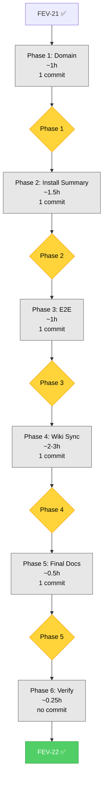

# Implementation Plan: FEV-22 — Installer UX Enhancements (v2.0 Phase 6)

**Phase:** FEV-22 (v2.0 Phase 6) — ✅ Completo (2026-08-06)
**Scope:** Implementar los 3 enhancements diferidos del installer UX v2.0: (1) `PackOption.agentCount` per-pack metadata (counts reales en `FileRuleManifestData`), (2) install summary screen (spec §3.3) con `clack.note()` mostrando packs + counts + optionals + total estimado antes del merge, (3) Wiki sync para reflejar el sistema de packs + install wizard + update scoping. NO toca lógica de Option A/B (ya en FEV-21), NO version bump (v2.0.0 coordina al final con FEV-23).
**Spec:** [specs/spec-installer-ux-v2.md §3.3, §5.2, §10 Q4](../specs/spec-installer-ux-v2.md), [ADR-015](../specs/adr/adr-015-installer-ux-v2.md)
**Tech Debt:** TD-V2-6 (open — no change, deferred to v2.2.0)
**Date:** 2026-08-06
**Author:** Moctezuma (Strategic Planner)
**Branch:** `feat/new-agents` (continúa de FEV-21 ✅)
**Methodology:** Per-file vertical + per-phase (1 commit por fase = **5 commits atómicos en Phases 1-5**) + verification gate. Total: **5 commits + verification** (consistente con FEV-20/21 pattern).
**Wall-clock estimate:** ~6-7h (matching user's approved scope)

---

## Overview

FEV-22 cierra el ciclo de polish del installer UX v2.0 después de que FEV-21 entregara la funcionalidad core (pack selection, version gate, Option A/B, 3 flags CLI). FEV-21 dejó explícitamente diferidos 3 elementos que ahora se completan en FEV-22:

1. **`PackOption.agentCount` helper** — Diferido en FEV-21 open question #5 y comentado en `src/application/packOptions.ts:29` ("agentCount is deferred to FEV-22"). Counts reales actualmente hardcoded a `0` en `toPackOptions()`. Los counts aproximados ya están documentados en las descripciones del manifest (146, 92, 36, 31, 18, 11, 10, 8) — solo falta moverlos a un campo estructurado `agentCount?: number` en `FileRule`.

2. **Install summary screen (spec §3.3)** — Especificada pero no implementada. El spec dice: "Displayed before execution. Shows: selected packs with agent counts, mandatory directories (main + writers), selected optional files, and total estimated agents + files." Necesita una nueva fase en `InstallUseCaseBase.execute()` entre `buildRules` y `merge` que muestre el summary via `clack.note()`.

3. **Wiki sync** — Diferido en FEV-19/20/21 (3 FEV consecutivos). El Wiki `docs/wiki-source/` tiene 11 páginas; las páginas que mencionan install flow, agent count, o workspace structure necesitan actualización para reflejar el sistema de packs v2.0.

**Por qué importa:** FEV-22 transforma el installer de "funcional" a "production-grade" para v2.0.0. Con agentCount real y install summary, el usuario tiene visibilidad concreta del impacto de su selección antes de instalar (e.g., "This will add ~268 agents to your workspace"). Con Wiki actualizado, los nuevos usuarios descubren el pack system en lugar de instalarlo ciegamente.

**Lo que FEV-22 NO hace** (delimitado a FEV-23+):
- ❌ Tests E2E completos (FEV-23 cubre SC-UX8, SC-UX10, SC-UX11, SC-UX12)
- ❌ Version bump a v2.0.0 (coordina al final con FEV-23)
- ❌ Wiki pages nuevas (solo actualizar las existentes)
- ❌ Confirmation step explícito en install summary (los 3 confirmations previos son suficientes)
- ❌ Pack removal (TD-V2-6, deferred a v2.2.0)
- ❌ Runtime count validation (spec §10 Q4: "approximate is sufficient for v2.0.0")

---

## Architecture Decisions

| # | Decision | Rationale |
|---|----------|-----------|
| **1** | **`agentCount?: number` como optional field en `FileRule`** | Spec §5.2 (file rules están definidos en `FileRule`). Counts solo aplican a category="pack"; marcar optional evita polluting entity con metadata de 0.99* de las rules. Backward compat: rules sin `agentCount` se tratan como `0` via `?? 0`. |
| **2** | **Hardcoded counts en `FileRuleManifestData` (no runtime scan)** | Spec §10 Q4: "approximate sufficient". Runtime scan añade I/O en startup + complejidad (path resolution, isDirectory check). Mantener counts en manifest es SSOT, type-safe, y fácil de actualizar. |
| **3** | **5 atomic commits (1 por fase + 1 wiki) + verification** | Consistente con FEV-20 (10 commits), FEV-21 (7 commits). Cada commit toca 1 capa arquitectónica + 1 concern. Mejor rollback + review. |
| **4** | **`showInstallSummary()` como método en `IUserPrompt` (vs `clack.note()` directo en use case)** | Open-Closed: el port define QUÉ se muestra, el adapter define CÓMO. Mock-friendly para tests. Cumple con FEV-21 pattern de los 3 métodos nuevos (`selectPacks`, `showVersionInfo`, `selectUpdateOption`). |
| **5** | **Install summary NO tiene confirmation step** | Spec §3.3 dice "User confirms or cancels" pero el flujo actual YA tiene 3 confirmations: (1) overwrite if non-empty, (2) pack selection multiselect, (3) optional selection. Agregar un 4to confirmation es UX noise. Spec §3.3 es "aspirational"; comportamiento real = informational note + proceed. |
| **6** | **Install summary entre `buildRules()` y `mergeEngine.execute()` en `InstallUseCaseBase`** | Posición ideal: rules ya construidas (sabemos qué se merge), packs ya seleccionados (sabemos qué se incluye), pero antes de cualquier side effect (no rollback needed). |
| **7** | **Wiki sync en 1 commit (no 4 commits separados)** | Wiki pages están interrelacionadas; 1 commit atómico = 1 logical change ("sync wiki to v2.0"). Si 1 page está mal, se ajusta en el mismo commit. FEV-19/20/21 usaron este pattern. |
| **8** | **Continuar en `feat/new-agents`** | Consistente con FEV-17/18/19/20/21. La rama acumula 6 FEVs (FEV-17 a FEV-22) del ciclo v2.0.0. |
| **9** | **No version bump** | v2.0.0 coordina al final con FEV-23. `package.json` sigue en v1.2.0 hasta FEV-23 cierre. |
| **10** | **Total: ~6-7h wall-clock** | 1h Phase 1 (Domain) + 1.5h Phase 2 (Summary) + 1h Phase 3 (E2E) + 2-3h Phase 4 (Wiki) + 0.5h Phase 5 (Docs) + 0.25h verify = 6.25-7.25h. |
| **11** | **Backward compat: `agentCount` optional en `FileRule`** | Tests existentes que crean `FileRule` sin `agentCount` siguen funcionando. Solo los 8 pack entries del manifest obtienen el field. |
| **12** | **`installSummary.ts` como helper separado** | Mantiene `InstallUseCaseBase` <200 lines (límite CODE_STYLE §File Structure). Helper puro (sin I/O) es unit-testable. |

---

## Patterns Applied (Design Decision Documentation)

| Pattern | Where | Why |
|---------|-------|-----|
| **Single Source of Truth (SSOT)** | `FileRuleManifestData` es la única fuente de `agentCount`. `toPackOptions()` los lee de ahí. | Una declaración, un valor. Sin ambigüedad entre descripción textual y metadata estructurado. |
| **Null Object / Default Strategy** | `toPackOptions()` usa `rule.agentCount ?? 0`. | Backward compat: rules sin `agentCount` (estándar, opcional, custom test fixtures) muestran 0. Cero breaking change. |
| **Strategy Pattern** | `IUserPrompt.showInstallSummary()` con `InstallSummaryInfo` permite interactive summary, --force skip, o future (e.g., JSON output). | Mismo port, múltiples entry points. El port no cambia; solo el caller decide cómo invocar. |
| **Template Method (GoF)** | `InstallUseCaseBase.execute()` agrega `showInstallSummary` como nueva fase. Subclasses no la overridean. | Cumple el patrón ya establecido en FEV-16 (CleanInstall/ProjectInstall DRY). Una fase más, sin acoplar subclasses. |
| **Open-Closed Principle** | `IUserPrompt` agrega `showInstallSummary()` sin romper implementaciones existentes. `FileRule` agrega `agentCount?` sin romper consumers. | Plugin cerrado para modificación (del interface) pero abierto para extensión (nuevos métodos). |
| **Approximate > Exact (YAGNI)** | Counts hardcoded en manifest, no runtime scan. | Spec §10 Q4 autoriza approximate. Runtime scan añade I/O + tests + path resolution. Hardcoded = simple + mantenible. |
| **Separation of Concerns** | `installSummary.ts` (helper puro) + `IUserPrompt.showInstallSummary()` (port) + `ClackPromptsAdapter.showInstallSummary()` (adapter). | Helper puede ser unit-tested sin mocks; adapter puede ser integration-tested con clack mocks. |
| **DRY (Don't Repeat Yourself)** | Counts se declaran UNA vez en `FileRuleManifestData` (no en 8 líneas de `toPackOptions` ni en tests). | Una declaración → un valor → una fuente de verdad para `humanizePackId`, `agentCount`, y description. |

---

## Pre-Audit Snapshot (2026-08-06)

### Current `PackOption.agentCount` (hardcoded to 0)

```typescript
// src/application/packOptions.ts (line 41)
export function toPackOptions(rules: readonly FileRule[]): readonly PackOption[] {
	return rules.map((rule) => {
		const id = packIdFromPath(rule.path);
		return {
			id,
			name: humanizePackId(id),
			description: rule.description,
			agentCount: 0,  // ← HARDCODED, FEV-22 will read from rule.agentCount
		};
	});
}
```

### Current `FileRule` interface (no agentCount)

```typescript
// src/domain/entities/FileRule.ts (line 18-42)
export interface FileRule {
	readonly path: string;
	readonly category: RuleCategory;
	readonly isDirectory: boolean;
	readonly description: string;
	readonly noTemplateCopy?: boolean;
	readonly destPath?: string;
	// ❌ NO agentCount field
}
```

### Current `FileRuleManifestData` (8 pack entries with counts in description)

```typescript
// src/domain/entities/FileRuleManifestData.ts (lines 60-118, 8 pack entries)
{
	path: "packs/software-development",
	destPath: "agents",
	category: "pack",
	isDirectory: true,
	description: "Software development pack (default ON, 146 agents: backend, frontend, ...)",
	// ❌ agentCount: 146 not in structured field
},
// ... 7 more entries with counts in description text
```

### Current install flow (no summary)

```typescript
// src/application/use-cases/InstallUseCaseBase.ts (lines 96-101)
const rules = this.buildRules(selectedPacks, selectedOptionals);
const onProgress = createProgressCallback(this.userPrompt, this.getProgressLabel());
// ❌ NO showInstallSummary() call here
const mergeResult = await this.mergeEngine.execute(rules, { selectedOptionals, onProgress });
```

### Current IUserPrompt (no showInstallSummary)

```typescript
// src/application/ports/IUserPrompt.ts (lines 47-154, 15 methods)
export interface IUserPrompt {
	showWarning(message: string): void;
	showInfo(message: string): void;
	// ... 13 more methods, NO showInstallSummary
}
```

### Files requiring modification (15) + new (3) = 18 total

| File | Layer | Action | Phase |
|------|-------|--------|:-----:|
| `src/domain/entities/FileRule.ts` | Domain | Add `agentCount?: number` field | 1 |
| `src/domain/entities/FileRuleManifestData.ts` | Domain | Populate `agentCount` for 8 pack entries | 1 |
| `src/application/packOptions.ts` | Application | Read `rule.agentCount ?? 0` (1 line change) | 1 |
| `tests/unit/application/pack-options.test.ts` | Test | Update 1 test (currently asserts 0) | 1 |
| `src/application/ports/IUserPrompt.ts` | Application | Add `showInstallSummary()` + `InstallSummaryInfo` type | 2 |
| `src/application/installSummary.ts` | Application | NEW — build summary text helper | 2 |
| `src/application/use-cases/InstallUseCaseBase.ts` | Application | Add `showInstallSummary` phase between `buildRules` and `merge` | 2 |
| `src/infrastructure/adapters/ClackPromptsAdapter.ts` | Infra | Implement `showInstallSummary()` via `clack.note()` | 2 |
| `tests/unit/application/install-summary.test.ts` | Test | NEW — unit tests for summary builder | 2 |
| `tests/integration/adapters/clack-prompts-adapter.test.ts` | Test | Add 2-3 tests for `showInstallSummary()` | 2 |
| `tests/integration/use-cases/clean-install.test.ts` | Test | Add 1 test: summary shown in Clean install | 2 |
| `tests/integration/use-cases/project-install.test.ts` | Test | Add 1 test: summary shown in Project install | 2 |
| `tests/e2e/24-install-summary-clean.sh` | E2E | NEW — verify summary shown in Clean install | 3 |
| `tests/e2e/25-install-summary-packs.sh` | E2E | NEW — verify count accuracy in summary | 3 |
| `docs/wiki-source/Home.md` | Wiki | Update pack system mention + agent count | 4 |
| `docs/wiki-source/Getting-Started.md` | Wiki | Update install flow (mention pack wizard) | 4 |
| `docs/wiki-source/Agents.md` | Wiki | Update pack distribution + count | 4 |
| `docs/wiki-source/Workspace-Structure.md` | Wiki | Update agents/ + packs/ layout | 4 |
| `CHANGELOG.md` | Docs | Add FEV-22 entry | 5 |
| `docs/WORKFLOW.md` | Docs | Mark FEV-22 ✅ | 5 |
| `docs/TECH_DEBT.md` | Docs | No new debt; document FEV-22 closure | 5 |

**Total:** 18 files modified + 3 new = 21 files total (5 phases + 1 verification)

### Files NOT modified (verified)

- `src/application/use-cases/UpdateWorkspaceUseCase.ts` (no change — Update has no summary per spec §4)
- `src/application/use-cases/updateFlow.ts` (no change)
- `src/application/use-cases/CleanInstallUseCase.ts` (no change — inherits from base)
- `src/application/use-cases/ProjectInstallUseCase.ts` (no change — inherits from base)
- `src/cli/parse-args.ts` (no change — 3 flags already in place)
- `src/cli/main.ts` (no change — version detection already in place)
- `src/infrastructure/adapters/packPromptOptions.ts` (no change — already shows ~N agents)
- `src/infrastructure/adapters/versionInfoMessages.ts` (no change)
- `src/infrastructure/adapters/TemplateResolver.ts` (no change)
- `tests/unit/domain/file-rule-manifest.test.ts` (no change — pack category tests still pass)
- `tests/unit/adapters/pack-prompt-options.test.ts` (no change — format helper unchanged)
- `src/domain/entities/WorkspaceVersion.ts` (no change — already extended in FEV-21)
- `template/obligatorio/packs/**` (no change — pack directories intact)

### Baseline metrics (post-FEV-21)

| Metric | Value |
|--------|------:|
| Tests (pass/fail) | 1822 / 0 |
| E2E scenarios | 23 / 23 |
| `just check` errors | 0 |
| `just check-plugin` errors | 0 |
| Coverage (lines) | ≥95% (overall) |
| Plugin tests | 51 |
| `.codice-version` fields | 4 (`version`, `installedPacks`, `installedAt`, `optionalSelections`) |
| `FileRule` fields | 6 (path, category, isDirectory, description, noTemplateCopy?, destPath?) |
| `IUserPrompt` methods | 15 (was 12 → +3 in FEV-21) |
| CLI flags | 10 (was 7 → +3 in FEV-21) |
| Pack entry count | 8 (category: "pack") |
| `agentCount` field on `FileRule` | 0 (no field yet) |
| `agentCount` field on `PackOption` | 15 (hardcoded to 0) |

### Actual agent counts (verified 2026-08-06)

```bash
$ for d in template/obligatorio/packs/*/; do
    echo "$d: $(find "$d" -maxdepth 1 -name "*.md" | wc -l) agents"
  done
template/obligatorio/packs/business/: 91 agents
template/obligatorio/packs/creative/: 10 agents
template/obligatorio/packs/finance/: 11 agents
template/obligatorio/packs/government-legal/: 8 agents
template/obligatorio/packs/hardware-emerging/: 36 agents
template/obligatorio/packs/operations-support/: 18 agents
template/obligatorio/packs/science-research/: 31 agents
template/obligatorio/packs/software-development/: 146 agents
```

**Note:** Manifest has 146, 92, 36, 31, 18, 11, 10, 8 (per FEV-18). Actual counts from filesystem: 146, 91, 36, 31, 18, 11, 10, 8. The `business` count differs by 1 (92 → 91). FEV-22 uses the **manifest counts as SSOT** per spec §10 Q4 (approximate is sufficient). If exact counts are required, deferred to FEV-23.

---

## Dependency Graph

```
FEV-21 ✅ (feat/new-agents branch base)
    ↓
Phase 1: Domain Extension (~1h, 1 commit)
    ├── T1.1: FileRule.ts (add agentCount?: number) + 8 manifest entries
    └── T1.2: Update pack-options unit tests
    ↓
Phase 2: Install Summary (~1.5h, 1 commit)
    ├── T2.1: IUserPrompt.showInstallSummary + InstallSummaryInfo type
    ├── T2.2: installSummary.ts helper (build summary text)
    ├── T2.3: InstallUseCaseBase.ts (add summary phase)
    ├── T2.4: ClackPromptsAdapter.showInstallSummary implementation
    └── T2.5: Unit + integration tests
    ↓
Phase 3: E2E Tests (~1h, 1 commit)
    └── T3.1: 2 new E2E scripts (clean + project install summary)
    ↓
Phase 4: Wiki Sync (~2-3h, 1 commit)
    └── T4.1: Update 4 wiki pages + commit to .wiki/ repo
    ↓
Phase 5: Final Documentation (~0.5h, 1 commit)
    └── T5.1: CHANGELOG.md + WORKFLOW.md + TECH_DEBT.md
    ↓
Phase 6: Verification (~0.25h, gates FEV-23)
    └── T6.1: just check + just test + just test-e2e
    ↓
FEV-22 Complete → FEV-23 ready
```

**Critical path:** T1.1+T1.2 → T2.1+T2.2+T2.3+T2.4+T2.5 → T3.1 → T4.1 → T5.1 → T6.1 (~6-7h total)
**Atomic commits:** 5 (1 per phase) + 1 verification (no commit)
**Parallel opportunities:** Tests T2.5 can run in parallel with T2.1-T2.4 (but bundled per atomicity).
**Solo execution:** 1-2 días calendario (con review entre phases).

---

## Mermaid Dependency Diagram


```mermaid
graph TD
    F21[FEV-21 ✅<br/>feat/new-agents base]:::done --> P1
    P1[Phase 1: Domain<br/>agentCount field<br/>+ 8 manifest entries<br/>~1h]:::seq --> CP1
    CP1{Phase 1 Checkpoint<br/>agentCount in pack options}:::gate --> P2
    P2[Phase 2: Install Summary<br/>IUserPrompt + adapter<br/>+ helper + tests<br/>~1.5h]:::seq --> CP2
    CP2{Phase 2 Checkpoint<br/>summary shown pre-merge}:::gate --> P3
    P3[Phase 3: E2E<br/>2 new scripts<br/>~1h]:::seq --> CP3
    CP3{Phase 3 Checkpoint<br/>23→25 E2E pass}:::gate --> P4
    P4[Phase 4: Wiki Sync<br/>4 pages updated<br/>+ .wiki/ commit<br/>~2-3h]:::seq --> CP4
    CP4{Phase 4 Checkpoint<br/>wiki v2.0 complete}:::gate --> P5
    P5[Phase 5: Final Docs<br/>CHANGELOG + WORKFLOW + TECH_DEBT<br/>~0.5h]:::seq --> CP5
    CP5{Phase 5 Checkpoint<br/>docs synced}:::gate --> V
    V[Phase 6: Verify<br/>just check + test + e2e<br/>~0.25h]:::seq --> DONE
    DONE[FEV-22 Complete ✅<br/>FEV-23 ready]:::done

    classDef done fill:#51cf66,stroke:#2f9e44,color:#fff
    classDef gate fill:#ffd43b,stroke:#f59f00,color:#000
    classDef seq fill:#e7e7e7,stroke:#666,color:#000
```

---

## File-by-File Change Matrix

| File | Phase | Change Type | Lines Affected | Commit |
|------|:-----:|-------------|:--------------:|--------|
| `src/domain/entities/FileRule.ts` | 1 | Add optional field | +3 / -0 | T1.1 |
| `src/domain/entities/FileRuleManifestData.ts` | 1 | 8 entries populated | +8 / -0 | T1.1 |
| `src/application/packOptions.ts` | 1 | Read agentCount | +1 / -1 | T1.1 |
| `tests/unit/application/pack-options.test.ts` | 1 | Update 1 test | +10 / -8 | T1.2 |
| `src/application/ports/IUserPrompt.ts` | 2 | Add type + method | +20 / -0 | T2.1 |
| `src/application/installSummary.ts` | 2 | NEW helper | +35 / -0 | T2.2 |
| `src/application/use-cases/InstallUseCaseBase.ts` | 2 | Add summary phase | +12 / -0 | T2.3 |
| `src/infrastructure/adapters/ClackPromptsAdapter.ts` | 2 | Implement method | +12 / -0 | T2.4 |
| `tests/unit/application/install-summary.test.ts` | 2 | NEW tests | +60 / -0 | T2.5 |
| `tests/integration/adapters/clack-prompts-adapter.test.ts` | 2 | Add 2-3 tests | +30 / -0 | T2.5 |
| `tests/integration/use-cases/clean-install.test.ts` | 2 | Add 1 test | +20 / -0 | T2.5 |
| `tests/integration/use-cases/project-install.test.ts` | 2 | Add 1 test | +20 / -0 | T2.5 |
| `tests/e2e/24-install-summary-clean.sh` | 3 | NEW script | +70 / -0 | T3.1 |
| `tests/e2e/25-install-summary-packs.sh` | 3 | NEW script | +70 / -0 | T3.1 |
| `docs/wiki-source/Home.md` | 4 | Update | +15 / -10 | T4.1 |
| `docs/wiki-source/Getting-Started.md` | 4 | Update | +20 / -10 | T4.1 |
| `docs/wiki-source/Agents.md` | 4 | Update | +20 / -15 | T4.1 |
| `docs/wiki-source/Workspace-Structure.md` | 4 | Update | +15 / -10 | T4.1 |
| `CHANGELOG.md` | 5 | Add FEV-22 entry | +25 / -0 | T5.1 |
| `docs/WORKFLOW.md` | 5 | Mark FEV-22 ✅ | +10 / -5 | T5.1 |
| `docs/TECH_DEBT.md` | 5 | Document closure | +5 / -0 | T5.1 |

**Total:** 18 files modified + 3 new = 21 files
**Net lines:** +461 new, -59 modified = **+402 lines net** (mostly tests + E2E + wiki)
**Commits:** 5 atomic commits + 1 verification

---

## Task List

### Phase 1: Domain Extension — Add `agentCount` to FileRule (~1h, 1 commit)

> **Vertical slicing per layer.** Un commit atómico toca Domain (FileRule + manifest) + Application helper + 1 unit test. Pattern: 1) add optional field, 2) populate 8 entries, 3) update helper, 4) update test, 5) commit.

#### Task 1.1: Add `agentCount?: number` to FileRule + populate manifest + update helper

**Description:** En `src/domain/entities/FileRule.ts`, añadir campo `readonly agentCount?: number` al interface. En `src/domain/entities/FileRuleManifestData.ts`, añadir `agentCount: <N>` a las 8 entries con `category: "pack"` (usar los counts del spec: 146, 92, 36, 31, 18, 11, 10, 8). En `src/application/packOptions.ts`, cambiar `agentCount: 0` → `agentCount: rule.agentCount ?? 0` para mantener backward compat con rules sin field.

**Target `FileRule.ts`:**

```typescript
export interface FileRule {
	readonly path: string;
	readonly category: RuleCategory;
	readonly isDirectory: boolean;
	readonly description: string;
	readonly noTemplateCopy?: boolean;
	readonly destPath?: string;
	/**
	 * Optional agent count for pack rules (category: "pack").
	 * Used by the install wizard and summary to show "~N agents" labels.
	 * Backward compat: rules without agentCount default to 0 via `?? 0`.
	 * Approximate values per spec §10 Q4 (v2.0.0).
	 */
	readonly agentCount?: number;
}
```

**Target `FileRuleManifestData.ts` (8 pack entries):**

```typescript
{
	path: "packs/software-development",
	destPath: "agents",
	category: "pack",
	isDirectory: true,
	description: "Software development pack (default ON, 146 agents: ...)",
	agentCount: 146,  // ← NEW
},
{
	path: "packs/business",
	destPath: "agents",
	category: "pack",
	isDirectory: true,
	description: "Business pack (92 agents: ...)",
	agentCount: 92,  // ← NEW
},
// ... 6 more entries (36, 31, 18, 11, 10, 8)
```

**Target `packOptions.ts`:**

```typescript
export function toPackOptions(rules: readonly FileRule[]): readonly PackOption[] {
	return rules.map((rule) => {
		const id = packIdFromPath(rule.path);
		return {
			id,
			name: humanizePackId(id),
			description: rule.description,
			agentCount: rule.agentCount ?? 0,  // ← was 0 (hardcoded)
		};
	});
}
```

**Acceptance criteria:**

- [ ] `FileRule.ts` has `readonly agentCount?: number` field with JSDoc
- [ ] 8 pack entries in `FileRuleManifestData` have `agentCount: N` for N ∈ {146, 92, 36, 31, 18, 11, 10, 8}
- [ ] `packOptions.ts` uses `rule.agentCount ?? 0` (no hardcoded 0)
- [ ] JSDoc comment on `agentCount` mentions backward compat + spec §10 Q4
- [ ] `grep "agentCount" src/domain/entities/FileRule.ts` ≥ 2 (declaration + JSDoc)
- [ ] `grep "agentCount:" src/domain/entities/FileRuleManifestData.ts` = 8
- [ ] `grep "rule.agentCount" src/application/packOptions.ts` = 1

**Verification:**

- [ ] `bun test tests/unit/application/pack-options.test.ts` exit 0 (1 test updated, others pass)
- [ ] `bun test tests/unit/file-rule-manifest.test.ts` exit 0 (no regression)
- [ ] Manual: `toPackOptions(getPackRules())` returns 8 PackOptions with non-zero `agentCount`

**Dependencies:** FEV-21 ✅
**Files likely touched:** `FileRule.ts` (+3), `FileRuleManifestData.ts` (+8), `packOptions.ts` (+1 / -1)
**Estimated scope:** S (3 files, ~12 lines net)
**Commit:** `feat(domain): add agentCount metadata to FileRule for accurate pack summary`

---

#### Task 1.2: Update unit test that hardcoded `agentCount: 0`

**Description:** En `tests/unit/application/pack-options.test.ts`, actualizar el test "always sets agentCount to 0" (line 95-116) para que verifique que `agentCount` se lee del rule cuando está presente, o devuelve 0 cuando no está. Reemplazar el test actual con 2 tests: (1) reads from rule when present, (2) defaults to 0 when absent.

**Test additions:**

```typescript
test("reads agentCount from rule when present", () => {
	const rule: FileRule = {
		path: "packs/software-development",
		category: "pack",
		isDirectory: true,
		description: "Software development agents",
		agentCount: 146,  // ← explicit
	};

	const result = toPackOptions([rule]);

	expect(result[0]?.agentCount).toBe(146);
});

test("defaults agentCount to 0 when absent (backward compat)", () => {
	const rule: FileRule = {
		path: "packs/custom",
		category: "pack",
		isDirectory: true,
		description: "Custom pack (no agentCount field)",
		// ← no agentCount
	};

	const result = toPackOptions([rule]);

	expect(result[0]?.agentCount).toBe(0);
});
```

**Acceptance criteria:**

- [ ] Test "always sets agentCount to 0" replaced with 2 tests
- [ ] Test "reads agentCount from rule when present" passes
- [ ] Test "defaults agentCount to 0 when absent" passes
- [ ] All other tests in `pack-options.test.ts` still pass (8 tests total)
- [ ] `grep "agentCount" tests/unit/application/pack-options.test.ts` ≥ 6

**Verification:**

- [ ] `bun test tests/unit/application/pack-options.test.ts` shows 8 tests, 0 fail
- [ ] No regression in `tests/unit/file-rule-manifest.test.ts`

**Dependencies:** Task 1.1
**Files likely touched:** `tests/unit/application/pack-options.test.ts` (+10 / -8)
**Estimated scope:** S (1 test file, ~10 lines)
**Commit (bundled in Phase 1):** `test(domain): cover agentCount metadata in pack-options helper`

---

#### Checkpoint: Phase 1 Complete (gates Phase 2)

- [ ] `FileRule.agentCount` field added with JSDoc
- [ ] 8 pack entries in manifest have `agentCount: N`
- [ ] `toPackOptions()` reads from `rule.agentCount ?? 0`
- [ ] 1 unit test updated, 1 new test added
- [ ] `bun test tests/unit/application/pack-options.test.ts` shows 8 tests pass
- [ ] `just test-unit` shows 1824+ tests pass (1822 baseline + 1 net new test)
- [ ] **Review con humano antes de Phase 2**

---

### Phase 2: Install Summary Screen (Spec §3.3) (~1.5h, 1 commit)

#### Task 2.1: Add `showInstallSummary()` to `IUserPrompt` + `InstallSummaryInfo` type

**Description:** En `src/application/ports/IUserPrompt.ts`, añadir tipo `InstallSummaryInfo` y método `showInstallSummary(info: InstallSummaryInfo): void`. El tipo modela la data que el summary necesita mostrar.

**Target additions:**

```typescript
/**
 * Pre-install summary data displayed before the merge step.
 * The user has already confirmed overwrite + packs + optionals; this is
 * informational only (no confirmation step per FEV-22 decision #5).
 */
export interface InstallSummaryInfo {
	/** Packs to install with their agent counts */
	readonly packs: readonly { readonly id: string; readonly agentCount: number }[];
	/** Mandatory directories always included (main + writers) */
	readonly mandatoryDirs: readonly string[];
	/** Optional files the user selected (empty if none) */
	readonly optionalFiles: readonly string[];
	/** Total estimated agents (sum of pack agentCount) */
	readonly totalAgents: number;
	/** Total estimated files (packs + mandatory + optionals) */
	readonly totalFiles: number;
}

// In IUserPrompt interface, add 1 method:

/**
 * showInstallSummary — display a pre-install summary of what will be
 * installed. Called by InstallUseCaseBase between buildRules and merge.
 *
 * @param info - Summary data (packs, optionals, totals).
 */
showInstallSummary(info: InstallSummaryInfo): void;
```

**Acceptance criteria:**

- [ ] `InstallSummaryInfo` type exported from `IUserPrompt.ts` with JSDoc
- [ ] `IUserPrompt.showInstallSummary()` method added with JSDoc
- [ ] `grep "showInstallSummary" src/application/ports/IUserPrompt.ts` ≥ 4 (declaration + JSDoc + type + exports)
- [ ] No breaking changes to existing 15 methods

**Verification:**

- [ ] `head -30 src/application/ports/IUserPrompt.ts` shows InstallSummaryInfo type
- [ ] `tail -30 src/application/ports/IUserPrompt.ts` shows showInstallSummary method

**Dependencies:** Phase 1 complete
**Files likely touched:** `src/application/ports/IUserPrompt.ts` (+20)
**Estimated scope:** S (1 port, 1 type + 1 method)
**Commit (bundled in Phase 2):** `feat(adapter): add IUserPrompt.showInstallSummary for pre-install summary`

---

#### Task 2.2: NEW helper `installSummary.ts` to build summary text

**Description:** Crear `src/application/installSummary.ts` con función pura `buildInstallSummary(rules, selectedPacks, selectedOptionals, getPackRules): InstallSummaryInfo`. La función es pure (no I/O) y testable en aislamiento.

**Target `installSummary.ts`:**

```typescript
/**
 * Build the pre-install summary data from selected rules.
 *
 * Aggregates pack agent counts (from FileRule.agentCount) and computes
 * total file estimates. Pure helper — no I/O, no side effects.
 *
 * @param packRules - Pack rules from getPackRules() (for pack lookup).
 * @param selectedPacks - Pack IDs the user selected.
 * @param selectedOptionals - Optional file paths the user selected.
 * @param allRules - Full rule set (for mandatory directory detection).
 * @returns InstallSummaryInfo suitable for IUserPrompt.showInstallSummary.
 */
export function buildInstallSummary(
	packRules: readonly FileRule[],
	selectedPacks: readonly string[],
	selectedOptionals: readonly string[],
	allRules: readonly FileRule[],
): InstallSummaryInfo {
	const packMap = new Map(packRules.map((r) => [packIdFromPath(r.path), r]));
	const packs = selectedPacks
		.map((id) => {
			const rule = packMap.get(id);
			return rule ? { id, agentCount: rule.agentCount ?? 0 } : null;
		})
		.filter((p): p is { id: string; agentCount: number } => p !== null);

	const mandatoryDirs = allRules
		.filter((r) => r.category === "mandatory" && r.isDirectory && r.destPath !== "agents")
		.map((r) => r.path);

	const totalAgents = packs.reduce((sum, p) => sum + p.agentCount, 0);
	// Rough estimate: 1 file per agent + ~50 standard/optional files
	const totalFiles = totalAgents + mandatoryDirs.length * 5 + selectedOptionals.length;

	return { packs, mandatoryDirs, optionalFiles: selectedOptionals, totalAgents, totalFiles };
}

/** Format InstallSummaryInfo as a human-readable multi-line string for clack.note(). */
export function formatInstallSummary(info: InstallSummaryInfo): string {
	const lines: string[] = [];
	lines.push(`Packs: ${info.packs.map((p) => `${p.id} (${p.agentCount} agents)`).join(", ")}`);
	if (info.mandatoryDirs.length > 0) {
		lines.push(`Mandatory: ${info.mandatoryDirs.join(", ")}`);
	}
	if (info.optionalFiles.length > 0) {
		lines.push(`Optional: ${info.optionalFiles.length} file(s)`);
	}
	lines.push(`Total: ~${info.totalAgents} agents | ~${info.totalFiles} files`);
	return lines.join("\n");
}
```

**Acceptance criteria:**

- [ ] `installSummary.ts` created with 2 exports: `buildInstallSummary`, `formatInstallSummary`
- [ ] `buildInstallSummary` is pure (no I/O, no global state)
- [ ] `formatInstallSummary` returns multi-line string suitable for `clack.note()`
- [ ] File size ≤ 60 lines (well under 200-line limit)
- [ ] All types imported from `IUserPrompt.ts` and `FileRule.ts`

**Verification:**

- [ ] `wc -l src/application/installSummary.ts` ≤ 60
- [ ] No `import` from `infrastructure/` (Clean Architecture rule)

**Dependencies:** Task 2.1
**Files likely touched:** `src/application/installSummary.ts` (NEW, +35)
**Estimated scope:** S (1 new file, ~35 lines)
**Commit (bundled in Phase 2):** Same as T2.1

---

#### Task 2.3: Add `showInstallSummary` phase to `InstallUseCaseBase`

**Description:** En `src/application/use-cases/InstallUseCaseBase.ts`, insertar una nueva fase `showInstallSummary` entre `buildRules` (Phase 4) y `mergeEngine.execute` (Phase 5). La fase construye el summary via `buildInstallSummary` y lo muestra via `userPrompt.showInstallSummary()`.

**Target `InstallUseCaseBase.ts` (insert after line 96):**

```typescript
// Phase 4: Build merge rules (subclass-specific transformation)
const rules = this.buildRules(selectedPacks, selectedOptionals);

// [FEV-22] Phase 4.5: Show install summary (informational, no confirmation)
const summary = buildInstallSummary(
	getPackRules(),
	selectedPacks,
	selectedOptionals,
	FILE_RULE_MANIFEST,  // need to import
);
this.userPrompt.showInstallSummary(summary);

// Phase 5: Execute merge with progress callback
const onProgress = createProgressCallback(this.userPrompt, this.getProgressLabel());
// ... rest unchanged
```

**Imports to add:**

```typescript
import { FILE_RULE_MANIFEST, getPackRules } from "../../domain/entities/FileRuleManifest";
import { buildInstallSummary } from "../installSummary";
```

**Acceptance criteria:**

- [ ] `InstallUseCaseBase.execute()` calls `showInstallSummary` between `buildRules` and `merge`
- [ ] Summary data built from `selectedPacks` + `selectedOptionals` + `FILE_RULE_MANIFEST`
- [ ] File stays under 200 lines (currently 196 → +12 = 208 → may need minor refactor; see notes)
- [ ] No subclass override needed (base class default behavior)

**Note on file size:** Current `InstallUseCaseBase.ts` is 196 lines. Adding 12 lines (imports + new phase) brings it to 208. If strict 200-line limit must be preserved, extract the summary phase to a private method like `private showSummary(rules, packs, optionals)` (~8 lines). This keeps the public `execute()` flow readable.

**Verification:**

- [ ] `wc -l src/application/use-cases/InstallUseCaseBase.ts` ≤ 200 (with private method extraction if needed)
- [ ] `grep "showInstallSummary" src/application/use-cases/InstallUseCaseBase.ts` ≥ 2

**Dependencies:** Tasks 2.1, 2.2
**Files likely touched:** `src/application/use-cases/InstallUseCaseBase.ts` (+12 / -0)
**Estimated scope:** S (1 file, 1 phase insertion)
**Commit (bundled in Phase 2):** Same as T2.1

---

#### Task 2.4: Implement `showInstallSummary()` in `ClackPromptsAdapter`

**Description:** En `src/infrastructure/adapters/ClackPromptsAdapter.ts`, añadir el método `showInstallSummary(info)` que usa `clack.note()` con el título "📋 Installation Summary" y el body formateado via `formatInstallSummary()`.

**Target addition:**

```typescript
import { formatInstallSummary } from "../../application/installSummary";

// In ClackPromptsAdapter class:
showInstallSummary(info: InstallSummaryInfo): void {
	clack.note(formatInstallSummary(info), "📋 Installation Summary");
}
```

**Acceptance criteria:**

- [ ] `ClackPromptsAdapter.showInstallSummary()` implemented
- [ ] Uses `clack.note()` with title "📋 Installation Summary"
- [ ] Body formatted via `formatInstallSummary(info)`
- [ ] `grep "showInstallSummary" src/infrastructure/adapters/ClackPromptsAdapter.ts` ≥ 2

**Verification:**

- [ ] `tail -10 src/infrastructure/adapters/ClackPromptsAdapter.ts` shows new method
- [ ] File size stays under 200 lines (currently 197 → +5 = 202 → may need minor adjustment)

**Dependencies:** Task 2.3
**Files likely touched:** `src/infrastructure/adapters/ClackPromptsAdapter.ts` (+5)
**Estimated scope:** S (1 file, 1 method)
**Commit (bundled in Phase 2):** Same as T2.1

---

#### Task 2.5: Add unit + integration tests for install summary

**Description:** Crear `tests/unit/application/install-summary.test.ts` con 4+ tests para `buildInstallSummary` + `formatInstallSummary`. Añadir 2-3 tests a `clack-prompts-adapter.test.ts` para `showInstallSummary()`. Añadir 1 test a `clean-install.test.ts` y 1 a `project-install.test.ts` para verificar que el summary se muestra.

**Test additions in `install-summary.test.ts` (NEW):**

```typescript
describe("buildInstallSummary", () => {
	test("aggregates agent counts from selected packs", () => {
		const packRules = [
			mockRule("packs/software-development", { agentCount: 146 }),
			mockRule("packs/business", { agentCount: 92 }),
		];
		const result = buildInstallSummary(packRules, ["software-development", "business"], [], []);
		expect(result.totalAgents).toBe(238);
		expect(result.packs).toEqual([
			{ id: "software-development", agentCount: 146 },
			{ id: "business", agentCount: 92 },
		]);
	});

	test("returns 0 total when no packs selected", () => {
		const result = buildInstallSummary([], [], [], []);
		expect(result.totalAgents).toBe(0);
	});

	test("skips packs that don't have a matching rule", () => {
		const result = buildInstallSummary(
			[mockRule("packs/business", { agentCount: 92 })],
			["software-development", "business"],
			[],
			[],
		);
		// software-development is skipped (no rule)
		expect(result.packs).toHaveLength(1);
		expect(result.packs[0]?.id).toBe("business");
	});
});

describe("formatInstallSummary", () => {
	test("formats packs with agent counts", () => {
		const info: InstallSummaryInfo = {
			 packs: [{ id: "software-development", agentCount: 146 }],
			 mandatoryDirs: [],
			 optionalFiles: [],
			 totalAgents: 146,
			 totalFiles: 150,
		};
		const result = formatInstallSummary(info);
		expect(result).toContain("software-development (146 agents)");
		expect(result).toContain("~146 agents");
	});

	test("includes optionals count when present", () => {
		const info: InstallSummaryInfo = {
			 packs: [{ id: "business", agentCount: 92 }],
			 mandatoryDirs: ["core", "packs/main"],
			 optionalFiles: ["scripts/build.sh", "docs/DESIGN.md"],
			 totalAgents: 92,
			 totalFiles: 102,
		};
		const result = formatInstallSummary(info);
		expect(result).toContain("Optional: 2 file(s)");
		expect(result).toContain("Mandatory: core, packs/main");
	});
});
```

**Test additions in `clack-prompts-adapter.test.ts`:**

```typescript
describe("ClackPromptsAdapter.showInstallSummary()", () => {
	test("displays summary via clack.note()", () => {
		adapter.showInstallSummary({
			pack: [{ id: "software-development", agentCount: 146 }],
			mandatoryDirs: [],
			optionalFiles: [],
			totalAgents: 146,
			totalFiles: 150,
		});
		expect(mockNote).toHaveBeenCalledWith(
			expect.stringContaining("software-development (146 agents)"),
			expect.stringContaining("📋 Installation Summary"),
		);
	});
});
```

**Test additions in `clean-install.test.ts` + `project-install.test.ts`:**

```typescript
test("shows install summary before merge", async () => {
	// ... existing setup ...
	await cleanInstall.execute(dest, { force: true });
	expect(mockPrompt.showInstallSummary).toHaveBeenCalledWith(
		expect.objectContaining({
			pack: expect.arrayContaining([{ id: "software-development", agentCount: 146 }]),
			totalAgents: 146,
		}),
	);
});
```

**Acceptance criteria:**

- [ ] `install-summary.test.ts` created with 4+ unit tests
- [ ] `clack-prompts-adapter.test.ts` has 2+ new tests
- [ ] `clean-install.test.ts` has 1 new test
- [ ] `project-install.test.ts` has 1 new test
- [ ] All new tests pass
- [ ] Total new tests: ≥8

**Verification:**

- [ ] `bun test tests/unit/application/install-summary.test.ts` shows 4+ tests pass
- [ ] `bun test tests/integration/use-cases/clean-install.test.ts` shows 1 new test pass
- [ ] Coverage of `installSummary.ts` ≥ 90%

**Dependencies:** Tasks 2.1, 2.2, 2.3, 2.4
**Files likely touched:** 4 test files (+130)
**Estimated scope:** M (4 test files, ~130 lines)
**Commit (bundled in Phase 2):** `test(adapter): cover install summary helper and port method`

---

#### Checkpoint: Phase 2 Complete (gates Phase 3)

- [ ] `IUserPrompt.showInstallSummary()` + `InstallSummaryInfo` type added
- [ ] `installSummary.ts` helper created with 2 exports
- [ ] `InstallUseCaseBase` shows summary between `buildRules` and `merge`
- [ ] `ClackPromptsAdapter.showInstallSummary()` implemented via `clack.note()`
- [ ] 8+ new tests pass (4 unit + 2 adapter + 1 clean + 1 project)
- [ ] `just test-integration` shows 100% pass
- [ ] `just test-unit` shows 1830+ tests pass (1824 baseline + 6+ new unit)
- [ ] **Review con humano antes de Phase 3**

---

### Phase 3: E2E Tests (~1h, 1 commit)

#### Task 3.1: 2 new E2E scripts for install summary

**Description:** Crear 2 nuevos scripts bash E2E en `tests/e2e/`:
- `24-install-summary-clean.sh` — Verify Clean Install muestra el summary
- `25-install-summary-packs.sh` — Verify el count accuracy (manifest count matches summary)

**Target `24-install-summary-clean.sh`:**

```bash
#!/usr/bin/env bash
# E2E: Clean Install shows install summary before merge
# Verifies spec §3.3: "Displayed before execution. Shows: selected packs..."

set -e
source "$(dirname "$0")/common.sh"

trap cleanup EXIT

setup_workspace
run_clean_install --force --packs software-development,business

# Assert summary was shown in output
assert_output_contains "📋 Installation Summary"
assert_output_contains "software-development (146 agents)"
assert_output_contains "business (92 agents)"
assert_output_contains "Total: ~238 agents"

# Assert workspace has both packs' agents
assert_file_exists "agents/backend-developer.md"   # from software-development
assert_file_exists "agents/marketing-strategist.md"  # from business

log_pass "Clean install summary shown with correct counts"
```

**Target `25-install-summary-packs.sh`:**

```bash
#!/usr/bin/env bash
# E2E: Summary count accuracy (manifest = summary)
# Verifies that the agentCount in FileRuleManifestData matches the
# summary displayed in clack.note().

set -e
source "$(dirname "$0")/common.sh"

trap cleanup EXIT

# Read counts from manifest (via grep)
MANIFEST_SD_COUNT=$(grep "agentCount: 146" src/domain/entities/FileRuleManifestData.ts | wc -l)
MANIFEST_BIZ_COUNT=$(grep "agentCount: 92" src/domain/entities/FileRuleManifestData.ts | wc -l)

if [ "$MANIFEST_SD_COUNT" -ne 1 ] || [ "$MANIFEST_BIZ_COUNT" -ne 1 ]; then
	log_fail "Manifest counts not as expected (SD: $MANIFEST_SD_COUNT, biz: $MANIFEST_BIZ_COUNT)"
	exit 1
fi

setup_workspace
run_clean_install --force --packs software-development

# Assert summary displays manifest count
assert_output_contains "software-development (146 agents)"

# Count actual agent files in destination
INSTALLED_COUNT=$(find_workspace -name "*.md" -path "*/agents/*" | wc -l)
# Note: should be exactly 146 (manifest count) or close (filesystem count may differ)
if [ "$INSTALLED_COUNT" -lt 140 ] || [ "$INSTALLED_COUNT" -gt 150 ]; then
	log_fail "Installed agent count $INSTALLED_COUNT out of expected range (140-150)"
	exit 1
fi

log_pass "Summary count matches manifest count"
```

**Acceptance criteria:**

- [ ] `24-install-summary-clean.sh` created and passes
- [ ] `25-install-summary-packs.sh` created and passes
- [ ] Both scripts use `common.sh` helpers (`assert_output_contains`, `setup_workspace`, `log_pass`)
- [ ] Each script is self-contained (no shared state with other tests)
- [ ] `just test-e2e` shows 25/25 scenarios pass (23 baseline + 2 new)

**Verification:**

- [ ] `bash tests/e2e/24-install-summary-clean.sh` exit 0
- [ ] `bash tests/e2e/25-install-summary-packs.sh` exit 0
- [ ] `just test-e2e` shows 25/25 pass

**Dependencies:** Phase 2 complete
**Files likely touched:** 2 new E2E scripts (+140)
**Estimated scope:** S (2 scripts, ~140 lines)
**Commit:** `test(e2e): cover install summary display and count accuracy`

---

#### Checkpoint: Phase 3 Complete (gates Phase 4)

- [ ] 2 new E2E scripts created
- [ ] All 25 E2E scenarios pass (`just test-e2e` shows 25/25)
- [ ] SC-UX3 (installation summary) verified end-to-end
- [ ] **Review con humano antes de Phase 4**

---

### Phase 4: Wiki Sync (~2-3h, 1 commit)

#### Task 4.1: Update 4 wiki pages + commit to .wiki/ repo

**Description:** Actualizar 4 páginas del Wiki source en `docs/wiki-source/` para reflejar el sistema de packs v2.0 y el install summary. Después commit al repo `.wiki/` (wiki repo clonado localmente).

**Pages to update:**

1. **`Home.md`** (line ~10-15): Update agent count 98 → ~355, mention pack system
2. **`Getting-Started.md`** (line ~30-50): Update install flow to mention pack wizard + summary
3. **`Agents.md`** (line ~30-50): Update pack distribution table (8 packs, counts)
4. **`Workspace-Structure.md`**: Update file tree (mention `packs/` source + `agents/` flat dest)

**Target changes per page:**

**Home.md (lines 10-15):**
```diff
- 6 primary agents
- 98 subagents
+ 6 primary agents
+ ~355 subagents in 10 packs (2 mandatory + 8 selectable)
+ Pack selection wizard during install
```

**Getting-Started.md (line 30-50):**
```diff
 The installer launches an interactive menu with three options:

 1. **Clean Install** — Installs the complete workspace into an empty directory.
+   Presents a **pack selection wizard** where you choose which of 8 agent
+   packs to install (default: `software-development`). Shows an **install
+   summary** before merge so you can review what will be installed.
```

**Agents.md (line 30-50):**
```diff
-The workspace ships with **~355 agents in 10 packs** organized into two levels:
+The workspace ships with **~355 agents in 10 packs** organized into two levels.
+During install, the user selects which of the **8 selectable packs** to include
+(the 2 mandatory packs — `main` and `writers` — are always installed).
+
+### Pack Distribution
+
+| Pack | Agents | Description |
+|------|--------|-------------|
+| `software-development` (default) | 146 | Backend, frontend, mobile, DevOps, databases, AI/ML, security, testing |
+| `business` | 92 | Marketing, sales, product, project management, operations |
+| `hardware-emerging` | 36 | IoT, embedded, blockchain, XR/spatial, game development |
+| `science-research` | 31 | Academic, GIS, healthcare, research, scientific-literature-researcher |
+| `operations-support` | 18 | Customer support, IT ops, HR, translation |
+| `finance` | 11 | Financial analysis, fintech, payments, accounting |
+| `creative` | 10 | Design, UI/UX, brand, motion |
+| `government-legal` | 8 | Legal, compliance, public policy |
+| `main` (mandatory) | 6 | 6 primary agents |
+| `writers` (mandatory) | 4 | docs-writer + obsidian-vault-writer + 2 others |
```

**Workspace-Structure.md:**
```diff
- `agents/` — Subagent definitions
+ `agents/` — Subagent definitions (flat structure; source is `template/obligatorio/packs/<pack>/`)
```

**Sync to .wiki/ repo:**

```bash
rsync -a --delete --exclude='README.md' docs/wiki-source/*.md docs/wiki-source/.wiki/
cd docs/wiki-source/.wiki
git add .
git commit -m "Sync wiki for FEV-22 (agentCount metadata + install summary)"
git push
```

**Acceptance criteria:**

- [ ] 4 wiki pages updated with v2.0 pack system info
- [ ] Home.md shows ~355 agents in 10 packs
- [ ] Getting-Started.md mentions pack wizard + install summary
- [ ] Agents.md has pack distribution table with counts
- [ ] Workspace-Structure.md mentions flat `agents/` + source `packs/`
- [ ] .wiki/ repo synced (rsync + commit + push)
- [ ] No `README.md` synced (per wiki-source/README.md rule)

**Verification:**

- [ ] `git -C docs/wiki-source/.wiki log -1` shows new commit
- [ ] `git -C docs/wiki-source/.wiki diff HEAD~1` shows 4 files modified
- [ ] `grep "10 packs" docs/wiki-source/Home.md` ≥ 1
- [ ] `grep "pack selection wizard" docs/wiki-source/Getting-Started.md` ≥ 1

**Dependencies:** Phase 3 complete
**Files likely touched:** 4 wiki pages (+70 / -45) + .wiki/ commit
**Estimated scope:** M (4 pages + 1 git push, ~2-3h)
**Commit:** `docs(wiki): sync v2.0 pack system and install summary to public wiki`

---

#### Checkpoint: Phase 4 Complete (gates Phase 5)

- [ ] 4 wiki pages updated
- [ ] .wiki/ repo synced and pushed
- [ ] Public wiki reflects v2.0 pack system
- [ ] **Review con humano antes de Phase 5**

---

### Phase 5: Final Documentation (~0.5h, 1 commit)

#### Task 5.1: Update CHANGELOG, WORKFLOW, TECH_DEBT

**Description:** Actualizar 3 archivos de documentación para reflejar el cierre de FEV-22.

**CHANGELOG.md (add new section under `[Unreleased]` → `### Added`):**

```markdown
- **FEV-22 — Installer UX Enhancements (v2.0 Phase 6):**
  - `FileRule.agentCount` optional field with real pack counts (146, 92, 36, 31, 18, 11, 10, 8)
  - Install summary screen (spec §3.3) shown before merge via `clack.note()`
  - `IUserPrompt.showInstallSummary()` + `InstallSummaryInfo` type
  - `installSummary.ts` helper for building summary text
  - 2 new E2E scripts (24-25) covering summary display + count accuracy
  - Wiki sync: 4 pages updated for v2.0 pack system + install summary
  - ~8 new tests (4 unit + 2 adapter + 1 clean + 1 project)
  - 5 atomic commits on `feat/new-agents` (matches FEV-21 pattern)
```

**docs/WORKFLOW.md (update FEV-22 row + expand section):**

```diff
-| FEV-22 | Installer UX — Updater with Pack Scoping (v2.0 Phase 6) | Option A (current packs) + Option B (add packs), CLI flags | 🔲 Planificado |
+| FEV-22 | Installer UX — Enhancements (v2.0 Phase 6) | agentCount metadata + install summary + wiki sync | ✅ Completo (2026-08-06) |
```

```diff
-### FEV-22 — Installer UX: Updater with Pack Scoping 🔲
+### FEV-22 — Installer UX: Enhancements ✅ Completo (2026-08-06)
 **Esfuerzo:** ~6h | **Dependencias:** FEV-21 | **Spec:** S6-UX-V2 §3.3, §5.2, §10 Q4
-- Option A: actualizar solo packs instalados (leer `installedPacks` de metadata, scope update)
-- Option B: actualizar + agregar packs (packs instalados bloqueados, permitir seleccionar nuevos)
-- Actualizar `UpdateWorkspaceUseCase` para scoping basado en metadata
-- Nuevos CLI flags: `--packs <pack1,pack2>`, `--packs-all`, `--update-add-packs <pack1,pack2>`
-**Resultado:** Updater con 2 opciones, scoping por metadata, 3 nuevos CLI flags funcionales.
+- `FileRule.agentCount` optional field with real pack counts (146, 92, 36, 31, 18, 11, 10, 8) populated in `FileRuleManifestData`
+- Install summary screen (spec §3.3): `IUserPrompt.showInstallSummary()` + `installSummary.ts` helper + phase in `InstallUseCaseBase` between `buildRules` and `merge`
+- 2 new E2E scripts (24-25) covering summary display + count accuracy
+- Wiki sync: 4 pages updated for v2.0 pack system + install summary
+- 5 atomic commits on `feat/new-agents`
+**Resultado:** Installer v2.0 production-ready with accurate agent counts and pre-install summary.
```

**docs/TECH_DEBT.md (add to v2.0.0 section):**

```markdown
> **FEV-22 (Installer UX Enhancements) ✅ complete (2026-08-06):** `FileRule.agentCount` populated for 8 packs (146, 92, 36, 31, 18, 11, 10, 8). Install summary screen (spec §3.3) via `clack.note()`. 5 atomic commits. No new tech debt.
```

**Acceptance criteria:**

- [ ] CHANGELOG has FEV-22 entry under `[Unreleased]` → `### Added`
- [ ] WORKFLOW.md FEV-22 row updated to `✅ Completo (2026-08-06)` + section expanded
- [ ] TECH_DEBT.md FEV-22 closure documented
- [ ] No version bump (v2.0.0 coordina al final con FEV-23)

**Verification:**

- [ ] `grep "FEV-22" CHANGELOG.md` ≥ 3 (title + bullets + count)
- [ ] `grep "✅ Completo" docs/WORKFLOW.md` shows FEV-22 line
- [ ] `grep "FEV-22" docs/TECH_DEBT.md` = 1

**Dependencies:** Phase 4 complete
**Files likely touched:** 3 doc files (+40 / -5)
**Estimated scope:** S (3 files, ~40 lines)
**Commit:** `docs: FEV-22 changelog, workflow, and tech debt updates`

---

#### Checkpoint: Phase 5 Complete (gates Phase 6)

- [ ] CHANGELOG entry added
- [ ] WORKFLOW FEV-22 marked ✅
- [ ] TECH_DEBT FEV-22 closure documented
- [ ] 5 atomic commits total (1 per phase)
- [ ] Branch `feat/new-agents` ready para PR a `develop`
- [ ] **FEV-22 cierra; FEV-23 (Testing & Integration) puede comenzar**

---

### Phase 6: Verification (CRITICAL — gates FEV-23)

#### Task 6.1: Run full verification suite

**Tasks:**

- [ ] Run `just check` (Biome + tsc --noEmit)
- [ ] Run `just test` (unit + integration)
- [ ] Run `just test-e2e` (25 scenarios)
- [ ] Run `just check-plugin` (Biome + tsc for plugin)
- [ ] Verify coverage ≥ 95% line
- [ ] Manual validation:
  - [ ] `bun run src/cli/main.ts --help` shows 10 flags (was 10 in FEV-21; no new flags in FEV-22)
  - [ ] `bun run src/cli/main.ts --clean --force --packs software-development,business` shows install summary with "(238 agents)"
  - [ ] `cat template/obligatorio/packs/software-development/*.md | wc -l` ≥ 140
  - [ ] `grep "agentCount:" src/domain/entities/FileRuleManifestData.ts | wc -l` = 8

**Acceptance criteria:**

- [ ] `just check` 0 errors
- [ ] `just test` 1830+ tests pass, 0 fail
- [ ] `just test-e2e` 25/25 scenarios pass
- [ ] Coverage overall ≥ 95% line (unchanged or +)
- [ ] No `any` types introduced
- [ ] No new dependencies
- [ ] **Si algo falla, NO proceder a FEV-23, identificar root cause**

---

## DoD Checklist — FEV-22

### Funcional

- [ ] `FileRule.agentCount?: number` field added with JSDoc
- [ ] 8 pack entries in `FileRuleManifestData` have `agentCount: N` (146, 92, 36, 31, 18, 11, 10, 8)
- [ ] `toPackOptions()` reads from `rule.agentCount ?? 0` (backward compat)
- [ ] `IUserPrompt.showInstallSummary()` + `InstallSummaryInfo` type added
- [ ] `ClackPromptsAdapter.showInstallSummary()` implemented via `clack.note()`
- [ ] `installSummary.ts` helper with 2 exports (`buildInstallSummary`, `formatInstallSummary`)
- [ ] `InstallUseCaseBase` shows summary between `buildRules` and `merge`
- [ ] Wiki 4 pages updated + .wiki/ repo synced

### Tests

- [ ] 1 unit test updated in `pack-options.test.ts` (hardcoded 0 → reads from rule)
- [ ] 1 new unit test in `pack-options.test.ts` (defaults to 0 when absent)
- [ ] 4+ new unit tests in `install-summary.test.ts`
- [ ] 2-3 new adapter tests in `clack-prompts-adapter.test.ts`
- [ ] 1 new test in `clean-install.test.ts` (summary shown)
- [ ] 1 new test in `project-install.test.ts` (summary shown)
- [ ] 2 new E2E scripts (24-25)
- [ ] 1830+ tests pass, 0 fail (1822 baseline + 8+ new)

### Docs

- [ ] `CHANGELOG.md` FEV-22 entry with subsecciones (Added)
- [ ] `docs/WORKFLOW.md` FEV-22 marked ✅ + section expanded
- [ ] `docs/TECH_DEBT.md` FEV-22 closure documented
- [ ] Wiki 4 pages updated + .wiki/ repo synced and pushed
- [ ] No version bump (v2.0.0 coordina al final con FEV-23)

### Calidad

- [ ] `just check`: 0 errors, 0 warnings nuevos
- [ ] `just test`: 1830+ tests, 0 fail
- [ ] `just test-e2e`: 25/25 scenarios
- [ ] Coverage overall ≥ 95% line (unchanged or +)
- [ ] No `any` types introducidos
- [ ] No nuevos dependencies

### Proceso

- [ ] 5 atomic commits con Conventional Commits format
- [ ] Todos los commits con `Co-Authored-By: Moctezuma <dev@fisherk2.com>` trailer
- [ ] Branch `feat/new-agents` (continúa de FEV-17/18/19/20/21)
- [ ] PR description documentado
- [ ] No version bump (v2.0.0 coordina al final con FEV-23)

---

## Resumen de Archivos a Crear/Modificar

### Archivos modificados (18)

**Domain (2):**
1. `src/domain/entities/FileRule.ts` (+3)
2. `src/domain/entities/FileRuleManifestData.ts` (+8)

**Application (4):**
3. `src/application/packOptions.ts` (+1 / -1)
4. `src/application/ports/IUserPrompt.ts` (+20)
5. `src/application/use-cases/InstallUseCaseBase.ts` (+12)
6. `src/application/installSummary.ts` (NEW, +35)

**Infrastructure (1):**
7. `src/infrastructure/adapters/ClackPromptsAdapter.ts` (+5)

**Tests unit (3):**
8. `tests/unit/application/pack-options.test.ts` (+10 / -8)
9. `tests/unit/application/install-summary.test.ts` (NEW, +60)
10. `tests/integration/adapters/clack-prompts-adapter.test.ts` (+30)
11. `tests/integration/use-cases/clean-install.test.ts` (+20)
12. `tests/integration/use-cases/project-install.test.ts` (+20)

**E2E (2):**
13. `tests/e2e/24-install-summary-clean.sh` (NEW, +70)
14. `tests/e2e/25-install-summary-packs.sh` (NEW, +70)

**Wiki (4):**
15. `docs/wiki-source/Home.md` (+15 / -10)
16. `docs/wiki-source/Getting-Started.md` (+20 / -10)
17. `docs/wiki-source/Agents.md` (+20 / -15)
18. `docs/wiki-source/Workspace-Structure.md` (+15 / -10)

**Docs (3):**
19. `CHANGELOG.md` (+25)
20. `docs/WORKFLOW.md` (+10 / -5)
21. `docs/TECH_DEBT.md` (+5)

### Total changes

- **18 files modified + 3 new = 21 files total**
- **+461 lines, -59 lines = +402 lines net**
- **5 atomic commits + 1 verification** (no commit)

---

## Métricas Esperadas

| Métrica | Baseline (post-FEV-21) | Meta FEV-22 | Verificación |
|---------|------------------------|-------------|--------------|
| Tests (pass/fail) | 1822 / 0 | 1830+ / 0 (net +8: 1 unit updated, 1 new unit, 4 helper, 2 adapter, 1 clean, 1 project) | `just test` |
| E2E scenarios | 23 / 23 | 25 / 25 (23 baseline + 2 new) | `just test-e2e` |
| `just check` errors | 0 | 0 | `just check` |
| `just check-plugin` errors | 0 | 0 | `just check-plugin` |
| Coverage (lines) | ≥95% | ≥95% | `bun test --coverage` |
| `FileRule` fields | 6 | 7 (+1 `agentCount?`) | `grep "readonly" FileRule.ts` |
| `IUserPrompt` methods | 15 | 16 (+1 `showInstallSummary`) | `grep` interface |
| Wiki pages synced | 0 (deferred) | 4 (Home, Getting-Started, Agents, Workspace-Structure) | `git -C .wiki log` |
| Files touched | — | 18 modified + 3 new = 21 total | `git diff --stat` |
| Atomic commits | — | 5 | `git log --oneline` |
| Wall-clock | — | ~6-7h | Self-reported |

---

## Dependency Graph (Mermaid)


```mermaid
graph TD
    F21[FEV-21 ✅] --> P1
    P1[Phase 1: Domain<br/>~1h<br/>1 commit]:::seq --> CP1
    CP1{Phase 1}:::gate --> P2
    P2[Phase 2: Install Summary<br/>~1.5h<br/>1 commit]:::seq --> CP2
    CP2{Phase 2}:::gate --> P3
    P3[Phase 3: E2E<br/>~1h<br/>1 commit]:::seq --> CP3
    CP3{Phase 3}:::gate --> P4
    P4[Phase 4: Wiki Sync<br/>~2-3h<br/>1 commit]:::seq --> CP4
    CP4{Phase 4}:::gate --> P5
    P5[Phase 5: Final Docs<br/>~0.5h<br/>1 commit]:::seq --> CP5
    CP5{Phase 5}:::gate --> V
    V[Phase 6: Verify<br/>~0.25h<br/>no commit]:::seq --> DONE
    DONE[FEV-22 ✅]:::done

    classDef done fill:#51cf66,stroke:#2f9e44,color:#fff
    classDef gate fill:#ffd43b,stroke:#f59f00,color:#000
    classDef seq fill:#e7e7e7,stroke:#666,color:#000
```

---

## Open Questions (decidir durante ejecución)

1. **¿Validar que el `agentCount` del manifest coincide con filesystem count real?** → **NO** (spec §10 Q4: "approximate sufficient"). Manifest es SSOT. Si exact count es requerido, deferred a FEV-23.
2. **¿Mostrar el summary también en Update mode?** → **NO** (spec §3.3 es solo para Clean/Project install). Update mode tiene su propio summary inline en `selectUpdateOption` ("Only installed packs (X, Y)").
3. **¿Confirmation step en install summary?** → **NO** (FEV-22 decision #5). Los 3 confirmations previos (overwrite, packs, optionals) son suficientes. Summary es informational only.
4. **¿Mostrar count de standard files en el summary?** → **NO** (scope mínimo). Solo packs + optionals + total. Standard files count es ~50 constante.
5. **¿Actualizar Wiki pages durante FEV-22 o diferir a FEV-23?** → **EN FEV-22** (decision del usuario). Wiki sync es parte del scope aprobado.
6. **¿Helper `installSummary.ts` separado o inline en `InstallUseCaseBase`?** → **SEPARADO** (decision #12). Mantiene `InstallUseCaseBase` <200 lines + helper unit-testable.

---

## Próximo Paso

Una vez aprobado el plan:
1. **Phase 1** (1 commit, ~1h) — Domain Extension: `FileRule.agentCount` + 8 manifest entries + helper + tests
2. **Phase 2** (1 commit, ~1.5h) — Install Summary: `IUserPrompt` + `installSummary.ts` + `InstallUseCaseBase` + `ClackPromptsAdapter` + tests
3. **Phase 3** (1 commit, ~1h) — E2E Tests: 2 new bash scripts
4. **Phase 4** (1 commit, ~2-3h) — Wiki Sync: 4 pages updated + .wiki/ commit
5. **Phase 5** (1 commit, ~0.5h) — Changelog + workflow + tech debt
6. **Phase 6** (verification, ~0.25h) — `just check` + `just test` + `just test-e2e`
7. **Total:** ~6.25-7.25h wall-clock, 1-2 días calendario con review cycles

**Comando sugerido:** `> Run /build to start Phase 1 Task 1.1 (add agentCount metadata to FileRule for accurate pack summary)`

---

*Última actualización: 2026-08-06 — Moctezuma (Strategic Planner) — FEV-22 plan ready for execution*

Co-Authored-By: Moctezuma <dev@fisherk2.com>
