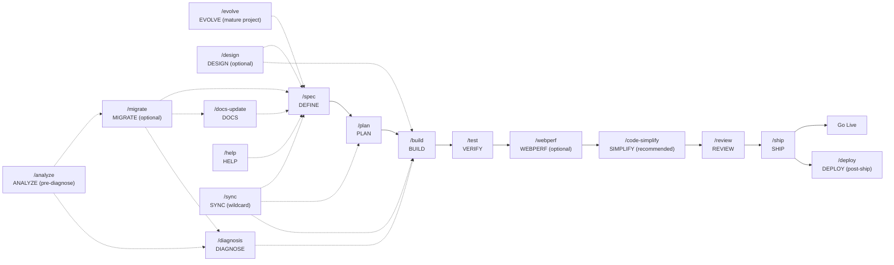

# Implementation Plan: FEV-24 — v2.1.0 New Commands

**Phase:** FEV-24 (v2.1.0 New Features) — 🔍 Plan listo para revisión
**Scope:** Implementar 4 nuevos comandos agent-orchestration en `template/obligatorio/core/commands/`:
- **`/sync`** (FEV-24-A, Issue #68) — Sincronización bidireccional con resolución inteligente de conflictos
- **`/migrate`** (FEV-24-B, Issue #67, OPCIONAL) — Generador de guías de migración tecnológica
- **`/deploy`** (FEV-24-C, Issue #64) — Configuración y ejecución de git workflow + CI/CD
- **`/deploy`** (FEV-24-C, Issue #64) — Configuración de Git workflow + CI/CD
- **`/analyze`** (FEV-24-D, Issue #57) — Generación de `TECH_DEBT.md` por análisis arquitectónico

**Specs:** [`docs/diagnosis/fix09-sync-command.md`](../docs/diagnosis/fix09-sync-command.md), [`fix10-migrate-command.md`](../docs/diagnosis/fix10-migrate-command.md), [`fix11-deploy-command.md`](../docs/diagnosis/fix11-deploy-command.md), [`fix12-analyze-command.md`](../docs/diagnosis/fix12-analyze-command.md)
**Branch:** `feature/new-commands` (continúa de FEV-24 docs merged in commit `673a029`)
**Methodology:** Per-phase atomic commits (1 per phase = **5 commits atómicos** + 1 verification). Total: **~7-8h wall-clock**.
**Wall-clock estimate:** ~7.5-8.5h (1.5-2h Phase 1 + 1.5-2h Phase 2 + 1.5-2h Phase 3 + 1.5-2h Phase 4 + 1.3h Phase 5 + 0.5h Phase 6)

---

## Overview

FEV-24 entrega 4 nuevos comandos agent-orchestration que extienden el flujo SDD de Códice. Cada comando sigue el patrón establecido de los comandos existentes (`plan.md`, `ship.md`, `review.md`, `help.md`):

- **YAML frontmatter** con `description` (orquestador) + `agent` (agente ejecutor)
- **Cuerpo estructurado** en Pre-flight → Phases → Suggested Next Step
- **Composición** sobre implementación: delega a skills + subagents, no contiene lógica embebida

**Lo que FEV-24 hace:**

1. **4 nuevos archivos** de comando en `template/obligatorio/core/commands/`
2. **1 nuevo E2E smoke test** (`31-commands-fe24-smoke.sh`) que valida frontmatter + estructura
3. **1 actualización menor** a `diagnosis.md` (FEV-24-D requiere `TECH_DEBT.md` como input)
4. **Documentación sincronizada**: `CHANGELOG.md` (v2.1.0), `docs/WORKFLOW.md` (FEV-24 ✅), `docs/wiki-source/` (Commands/Agents pages)

**Lo que FEV-24 NO hace:**

- ❌ Release real (PR merge, tag v2.1.0, npm publish) — release coordination deferred
- ❌ Versión bump en `package.json` (deferred hasta release coordination)
- ❌ Comandos que ejecuten lógica real (son orquestadores de agentes + skills; el agente decide qué hacer)
- ❌ Nuevas dependencias npm (cero deps nuevas; todo es Markdown + skills existentes)
- ❌ E2E tests de comportamiento (solo smoke tests de existencia/frontmatter)

---

## Architecture Decisions

| # | Decision | Rationale |
|---|----------|-----------|
| **1** | **4 comandos en 4 phases** | Cada comando es independiente; phases permiten commits atómicos y rollback granular. Vertical slicing (1 comando = 1 phase). |
| **2** | **Smoke test único (`31-commands-fe24-smoke.sh`)** | User confirmó "Smoke tests only". 1 script valida los 4 comandos (más simple que 4 scripts). Cobertura: existencia + frontmatter + estructura básica. |
| **3** | **5 atomic commits (1 per phase 1-5) + 1 verification** | Consistente con FEV-23 (4 atomic commits). Cada commit = 1 concern. Verify = sin commit. |
| **4** | **Agent mapping per diagnosis** | `/sync` → `tlaloc` (Builder, git ops), `/migrate` → `quetzalcoatl` (Architect, .md only), `/deploy` → `mictlantecuhtli` (Judge, full access), `/analyze` → `quetzalcoatl` (Architect, .md only). Ya validado en diagnosis docs. |
| **5** | **Comando `/migrate` es OPCIONAL** | El diagnosis (fix10) lo marca como opcional "similar a `/design` que solo se usa para UI/UX". Documentado en commit `9dd9fb7`. |
| **6** | **Solo `diagnosis.md` se actualiza (Fase 4)** | FEV-24-D requiere que `diagnosis.md` considere `TECH_DEBT.md` como input. Las otras 3 commands no requieren updates a comandos existentes. |
| **7** | **Wiki source sync sigue patrón FEV-22** | FEV-22 actualizó `docs/wiki-source/`. FEV-24 añade 4 entradas en `Commands.md` y 0 en `Agents.md` (los agents ya existen). |
| **8** | **Sin versión bump en `package.json`** | User confirmó "defer release decision". El bump queda para release coordination. `CHANGELOG.md` se actualiza con anticipación. |
| **13** | **README.md update in-place (no new section)** | Per user clarification: do NOT add "What's New in v2.1.0" section. Instead, update 3 existing sections in place: (1) Features list (13→17 commands), (2) Mermaid workflow diagram (4 new command nodes at SDD positions), (3) Full Cycle table (4 new rows). User prefers in-place updates over highlight boxes. |
| **9** | **Branch: `feature/new-commands` (continuar)** | Ya existe el branch con docs merged. FEV-24 implementation continúa ahí. |
| **10** | **Comando body = 200-400 líneas** | Siguiendo el patrón de `ship.md` (102 líneas) y `help.md` (63 líneas). Comandos con más fases pueden ser más largos pero <500 líneas (CODE_STYLE.md: max 200, pero commands son orquestadores con narrativa). |
| **11** | **No nuevos skills ni subagents** | Los 4 comandos delegan a skills/subagents ya existentes. Si un comando necesita un skill nuevo, se delega como "TODO" en el cuerpo (no se crea en FEV-24). |
| **12** | **No tests de comportamiento** | User confirmó smoke tests only. Comandos son orquestadores, no lógica; el comportamiento real se valida manualmente por el agente ejecutor. |

---

## Patterns Applied (Design Decision Documentation)

| Pattern | Where | Why |
|---------|-------|-----|
| **Vertical Slicing** | 1 phase = 1 complete command (file + smoke test) | Cada commit entrega funcionalidad completa. No horizontal layers. |
| **Template Method** | Todos los comandos: Pre-flight → Phases → Suggested Next Step | Patrón establecido en comandos existentes (`plan.md`, `ship.md`, `review.md`). Consistencia. |
| **Single Responsibility** | Cada comando = 1 concern (`/sync` solo sincroniza, `/deploy` solo deploys) | Clarity of purpose. Cada agente tiene un rol claro. |
| **Agent Capability Mapping** | Permission set del agente elegido debe permitir el trabajo | `tlaloc`: write/edit allow → git ops OK. `quetzalcoatl`: edit .md only → doc generation OK. `mictlantecuhtli`: full access → CI/CD YAML OK. |
| **Composition over Implementation** | Comandos delegan a skills + subagents; no embeben lógica | Permite evolución independiente. Reduce code duplication. |
| **Single Source of Truth (SSOT)** | `FileRuleManifestData` ya es SSOT para packs. Comandos extienden `.opencode/commands/` declarativamente. | Mismo principio: añadir command = añadir archivo, no modificar registry. |
| **Boundary Testing** | Smoke test: file exists, frontmatter has 2 required fields, agent field matches expected value | Valida el contrato (frontmatter schema) sin ejecutar comportamiento. |
| **Test Isolation** | Cada E2E script crea su propio TEMP_DIR; smoke test no requiere filesystem ops | Cumple SC-1 testing pattern del proyecto. |

---

## Pre-Audit Snapshot (2026-08-07)

### Current State (post-FEV-24 docs merge, pre-FEV-24 implementation)

| Metric | Value |
|--------|------:|
| Tests (pass/fail) | 1920 / 0 (post-FEV-23) |
| E2E scenarios | 30 / 30 |
| `just check` errors | 0 |
| Coverage (lines) | 95.68% overall / 99.12% production `src/` |
| `package.json` version | 2.0.0 (no bump in FEV-24) |
| Branch | `feature/new-commands` |
| Working tree | clean (commit `9dd9fb7` HEAD) |
| Existing commands | 13 (build, code-simplify, design, diagnosis, docs-update, evolve, help, plan, review, ship, spec, test, webperf) |
| Existing primary agents | 6 (huitzilopochtli, mictlantecuhtli, moctezuma, quetzalcoatl, tezcatlipoca, tlaloc) |

### Command-to-Agent Mapping Matrix

| Command | Owner Agent | Reason | Agent Permissions |
|---------|-------------|--------|-------------------|
| `/sync` | `tlaloc` | Builder executes git ops + writes code | write:allow, edit:allow, patch:allow |
| `/migrate` | `quetzalcoatl` | Architect plans + writes .md only | write:deny, edit:*.md:allow, patch:deny |
| `/deploy` | `mictlantecuhtli` | Judge validates + writes CI/CD YAML | write:allow, edit:allow, patch:allow |
| `/analyze` | `quetzalcoatl` | Architect analyzes + writes TECH_DEBT.md | write:deny, edit:*.md:allow, patch:deny |

### E2E Coverage Matrix (current → target)

| Scenario | Current | Status | Phase |
|----------|---------|--------|:-----:|
| FEV-24 smoke (4 new commands) | none | ❌ | **Phase 5** (smoke test added in Phase 1, 2, 3, 4 but bundled into Phase 5 commit) |
| `/sync` exists + frontmatter | — | ❌ | **Phase 1** |
| `/migrate` exists + frontmatter | — | ❌ | **Phase 2** |
| `/deploy` exists + frontmatter | — | ❌ | **Phase 3** |
| `/analyze` exists + frontmatter | — | ❌ | **Phase 4** |

### Files requiring modification (3) + new (5) = 8 total

| File | Layer | Action | Phase |
|------|-------|--------|:-----:|
| `template/obligatorio/core/commands/sync.md` | Template | NEW | 1 |
| `template/obligatorio/core/commands/migrate.md` | Template | NEW | 2 |
| `template/obligatorio/core/commands/deploy.md` | Template | NEW | 3 |
| `template/obligatorio/core/commands/analyze.md` | Template | NEW | 4 |
| `template/obligatorio/core/commands/diagnosis.md` | Template | UPDATE (FEV-24-D integration) | 4 |
| `tests/e2e/31-commands-fe24-smoke.sh` | E2E | NEW | 5 |
| `CHANGELOG.md` | Docs | UPDATE (v2.1.0 entry) | 5 |
| `README.md` | Docs | UPDATE (3 sections in place: Features, Mermaid, Full Cycle) | 5 |
| `docs/WORKFLOW.md` | Docs | UPDATE (FEV-24 ✅) | 5 |
| `docs/wiki-source/Commands.md` | Wiki | UPDATE (4 new commands) | 5 |

**Total:** 5 new files + 5 modified = 10 files

### Files NOT modified (verified)

- `src/cli/**` — no CLI changes (commands are markdown files, not source)
- `src/application/**` — no new use cases
- `src/infrastructure/**` — no new adapters
- `package.json` — no version bump (deferred to release)
- `tsconfig.json`, `biome.json` — no config changes
- `template/obligatorio/packs/**` — no new agents/subagents
- `template/obligatorio/core/skills/**` — no new skills (commands reference existing)
- `.opencode/agents/**` — no new agents

---

## Dependency Graph

```
FEV-23 ✅ (v2.0.0 base, 1920 tests, 30 E2E, 2.0.0)
    ↓
Phase 1: FEV-24-A /sync (tlaloc) (~1.5-2h, 1 commit)
    ├── T1.1: Create template/obligatorio/core/commands/sync.md
    ├── T1.2: Update smoke test (add /sync check)
    └── T1.3: Verify smoke test passes
    ↓
Phase 2: FEV-24-B /migrate (quetzalcoatl) (~1.5-2h, 1 commit)
    ├── T2.1: Create template/obligatorio/core/commands/migrate.md
    └── T2.2: Update smoke test (add /migrate check)
    ↓
Phase 3: FEV-24-C /deploy (mictlantecuhtli) (~1.5-2h, 1 commit)
    ├── T3.1: Create template/obligatorio/core/commands/deploy.md
    └── T3.2: Update smoke test (add /deploy check)
    ↓
Phase 4: FEV-24-D /analyze (quetzalcoatl) (~1.5-2h, 1 commit)
    ├── T4.1: Create template/obligatorio/core/commands/analyze.md
    ├── T4.2: Update template/obligatorio/core/commands/diagnosis.md (TECH_DEBT.md input)
    └── T4.3: Update smoke test (add /analyze + diagnosis integration check)
    ↓
Phase 5: Documentation Sync (~1.3h, 1 commit)
    ├── T5.1: CHANGELOG.md (v2.1.0 entry)
    ├── T5.2: docs/WORKFLOW.md (FEV-24 ✅ + 4 commands listed)
    ├── T5.3: docs/wiki-source/Commands.md (4 new commands)
    ├── T5.4: Finalize smoke test
    └── T5.5: README.md (in-place: Features + Mermaid + Full Cycle)
    ↓
Phase 6: Verification (~0.5h, no commit)
    ├── T6.1: just check (0 errors)
    ├── T6.2: just test (1920+ tests, 0 fail)
    ├── T6.3: just test-e2e (31/31 E2E pass: 30 baseline + 1 new smoke)
    ├── T6.4: npm pack --dry-run (verify tarball integrity)
    └── T6.5: Manual load test (verify 4 commands load in OpenCode harness)
    ↓
FEV-24 Complete → Release coordination deferred (separate)
```

**Critical path:** T1.1 → T2.1 → T3.1 → T4.1 → T5.1-T5.5 → T6.1-T6.5 (~7.5-8.5h total)
**Atomic commits:** 5 (1 per phase 1-5) + 1 verification (no commit)
**Parallel opportunities:** Phases 1-4 are sequential by design (each updates same smoke test file). Could parallelize via separate worktrees but adds merge complexity.

---

## Mermaid Dependency Diagram


```mermaid
graph TD
    F23[FEV-23 ✅<br/>v2.0.0 base<br/>1920 tests, 30 E2E<br/>2.0.0]:::done --> P1
    P1[Phase 1: /sync<br/>tlaloc<br/>~1.5-2h]:::seq --> CP1
    CP1{Phase 1 Checkpoint<br/>sync.md + smoke<br/>pass}:::gate --> P2
    P2[Phase 2: /migrate<br/>quetzalcoatl<br/>~1.5-2h]:::seq --> CP2
    CP2{Phase 2 Checkpoint<br/>migrate.md + smoke<br/>pass}:::gate --> P3
    P3[Phase 3: /deploy<br/>mictlantecuhtli<br/>~1.5-2h]:::seq --> CP3
    CP3{Phase 3 Checkpoint<br/>deploy.md + smoke<br/>pass}:::gate --> P4
    P4[Phase 4: /analyze<br/>quetzalcoatl<br/>+ diagnosis update<br/>~1.5-2h]:::seq --> CP4
    CP4{Phase 4 Checkpoint<br/>analyze.md + smoke<br/>pass}:::gate --> P5
    P5[Phase 5: Docs Sync<br/>CHANGELOG+WORKFLOW<br/>+Wiki+README<br/>~1.3h]:::seq --> CP5
    CP5{Phase 5 Checkpoint<br/>docs v2.1.0 ready}:::gate --> P6
    P6[Phase 6: Verify<br/>check+test+e2e<br/>+npm pack+manual<br/>~0.5h]:::seq --> DONE
    DONE[FEV-24 Complete ✅<br/>v2.1.0 implementation<br/>ready, release deferred]:::done

    classDef done fill:#51cf66,stroke:#2f9e44,color:#fff
    classDef gate fill:#ffd43b,stroke:#f59f00,color:#000
    classDef seq fill:#e7e7e7,stroke:#666,color:#000
```

---

## File-by-File Change Matrix

| File | Phase | Change Type | Lines Affected | Commit |
|------|:-----:|-------------|:--------------:|--------|
| `template/obligatorio/core/commands/sync.md` | 1 | NEW | +350 / -0 | T1.1 |
| `tests/e2e/31-commands-fe24-smoke.sh` | 1,5 | NEW (built incrementally, finalized in P5) | +200 / -0 | T5.4 (final) |
| `template/obligatorio/core/commands/migrate.md` | 2 | NEW | +300 / -0 | T2.1 |
| `template/obligatorio/core/commands/deploy.md` | 3 | NEW | +350 / -0 | T3.1 |
| `template/obligatorio/core/commands/analyze.md` | 4 | NEW | +300 / -0 | T4.1 |
| `template/obligatorio/core/commands/diagnosis.md` | 4 | UPDATE (add TECH_DEBT.md input) | +10 / -2 | T4.2 |
| `CHANGELOG.md` | 5 | UPDATE (v2.1.0 entry) | +50 / -0 | T5.1 |
| `README.md` | 5 | UPDATE (3 sections in place) | +30 / -5 | T5.5 |
| `docs/WORKFLOW.md` | 5 | UPDATE (FEV-24 ✅) | +20 / -5 | T5.2 |
| `docs/wiki-source/Commands.md` | 5 | UPDATE (4 new commands) | +80 / -0 | T5.3 |

**Total:** 6 new files + 4 modified = 10 files
**Net lines:** +1690 new, -12 modified = **+1678 lines net** (mostly new commands)
**Commits:** 5 atomic commits + 1 verification (no commit)

---

## Task List

### Phase 1: FEV-24-A `/sync` (~1.5-2h, 1 commit)

> **Vertical slice: 1 command = 1 phase.** Crear el archivo del comando con frontmatter correcto, body estructurado, y agregar al smoke test. Total time: 1.5-2h.

#### Task 1.1: Create `template/obligatorio/core/commands/sync.md`

**Description:** Crear el archivo del comando `/sync` siguiendo el patrón de `ship.md` y `help.md`. El comando orquesta sincronización bidireccional con resolución de conflictos. Agent ejecutor: `tlaloc` (Builder).

**Target `sync.md` (estructura):**

```markdown
---
description: Bidirectional git sync with intelligent conflict resolution (4 modes, 4 strategies)
agent: tlaloc
---

## Pre-Flight: Detect Git State

1. Verify `git` is installed and accessible.
2. Verify the project is a git repository (`.git/` exists).
3. Verify at least one remote is configured.
4. If any check fails, abort with actionable error message.

Use the `question` tool to let the user confirm the sync mode:

### Sync Modes (user selects ONE)

- **A) `full-sync`** — Bidirectional sync. Fetch + pull --rebase + push.
- **B) `incremental-sync`** — Only changes since last sync (tracked in `docs/.codice-sync-state.json`).
- **C) `dry-run`** — Preview changes without applying. No mutations.
- **D) `conflict-resolution`** — Interactive mode. Detect conflicts, ask user strategy.

If the user selects **A** or **B**, ask the resolution strategy (4 options).

## Phase 1: Resolution Strategy (only for modes A/B)

Use `question` tool:

- **`NEWER_WINS`** — Latest timestamp wins (file content from newer mtime).
- **`GITHUB_WINS`** — Remote changes take precedence.
- **`LOCAL_WINS`** — Local changes take precedence.
- **`INTELLIGENT_MERGE`** — Contextual field-level merge (best-effort, may require manual review).

## Phase 2: Execute Sync

For mode A:
1. `git fetch --all --prune`
2. `git status` to check working tree
3. If dirty: stash or commit (ask user)
4. `git pull --rebase` (or `git pull` if rebase fails)
5. Detect conflicts via `git diff --name-only --diff-filter=U`
6. If conflicts: apply selected strategy
7. `git push` (only if ahead)

For mode B:
1. Read `docs/.codice-sync-state.json` to find last sync timestamp
2. Use `git diff <last-sync>..HEAD` and `<last-sync>..origin/main` to detect changes
3. Show preview; apply strategy if approved

For mode C (dry-run):
1. Run all `git fetch` / `git status` / `git diff` commands
2. Show summary of changes that WOULD be applied
3. Exit without mutations

For mode D (conflict-resolution):
1. `git fetch`
2. `git status` + `git diff` to identify conflicts
3. For each conflict: use `question` tool to ask strategy per-file
4. Apply resolutions
5. `git add` resolved files
6. Optional: commit and push

## Phase 3: Post-Sync Report

Generate report:
- **Conflicts detected:** N files
- **Strategy applied:** [NAME]
- **Files changed:** N
- **Push status:** success / skipped
- **Time elapsed:** Xs
- **Sync state updated:** `docs/.codice-sync-state.json` (mode B only)

## Phase 4: State Persistence (mode B only)

Update `docs/.codice-sync-state.json`:
```json
{
  "lastSync": "2026-08-07T10:00:00.000Z",
  "lastCommit": "<sha>",
  "mode": "incremental-sync",
  "strategy": "INTELLIGENT_MERGE"
}
```

## Rules

1. **Always pre-flight check first** — never run git commands on a non-git project.
2. **Never `git push --force`** to shared branches. Only force-push to feature branches.
3. **Atomic state updates** — if conflict resolution fails mid-way, leave git in a recoverable state.
4. **Always show dry-run output** before applying — even in `full-sync` mode, print what will change.
5. **Log all operations** if user passes `--verbose` flag (delegated to tlaloc's verbose logger).
6. **Back up uncommitted changes** before sync (stash or commit, ask user).

## Skills Used

- `git-workflow-and-versioning` — for safe git operations
- `interview-me` — for asking clarifying questions about conflict resolution
- `observability-and-instrumentation` — for sync state tracking

## Suggested Next Step

> Sync complete. Run `/diagnosis` if conflicts revealed underlying issues, `/analyze` to refresh TECH_DEBT.md, or `/plan` to address new tasks surfaced.
```

**Acceptance criteria:**

- [ ] File `template/obligatorio/core/commands/sync.md` exists
- [ ] YAML frontmatter has `description` (orchestrator) and `agent: tlaloc`
- [ ] Body has sections: Pre-Flight, Phase 1, Phase 2, Phase 3, Phase 4 (mode B), Rules, Skills Used, Suggested Next Step
- [ ] Body documents all 4 modes (full-sync, incremental-sync, dry-run, conflict-resolution)
- [ ] Body documents all 4 strategies (NEWER_WINS, GITHUB_WINS, LOCAL_WINS, INTELLIGENT_MERGE)
- [ ] No implementation code embedded (orchestrator only)

**Verification:**

- [ ] `just check-plugin` (or equivalent) — no errors
- [ ] Smoke test includes /sync check
- [ ] Manual: load command in OpenCode harness and verify agent resolves to `tlaloc`

**Dependencies:** FEV-23 ✅
**Files likely touched:** `template/obligatorio/core/commands/sync.md` (+350)
**Estimated scope:** M (1 file, ~350 lines, 1.5-2h)
**Commit:** `feat(command): add /sync for bidirectional git sync with intelligent conflict resolution`

---

#### Task 1.2: Add `/sync` to smoke test (incremental)

**Description:** Update `tests/e2e/31-commands-fe24-smoke.sh` to include `/sync` validation. The smoke test is created in Phase 1 as a stub and built incrementally through Phases 1-4, finalized in Phase 5.

**Note:** For Phase 1, create the file with the validation framework and the /sync check. Phases 2-4 will append their checks. Phase 5 finalizes the file.

**Target initial structure (Phase 1):**

```bash
#!/bin/bash
# FEV-24 Smoke Test: Validate 4 new commands (sync, migrate, deploy, analyze)
#
# Validates:
#   - File exists
#   - YAML frontmatter has 'description' and 'agent' fields
#   - 'agent' field matches expected value
#   - Body has 'Pre-Flight' and 'Suggested Next Step' sections
#   - Body references at least one skill
#
# This test does NOT validate behavior — that's the agent's responsibility.

set -Eeuo pipefail
source "$(dirname "$0")/common.sh"

COMMANDS_DIR="$CODICE_ROOT/template/obligatorio/core/commands"

# validate_command <file> <expected_agent> <expected_description_substring>
validate_command() {
  local file="$1"
  local expected_agent="$2"
  local expected_desc_substr="$3"

  log_step "Validating command: $(basename "$file")"

  # File exists
  assert_file_exists "$file"

  # Frontmatter: description
  if ! grep -q "^description:" "$file"; then
    log_fail "Missing 'description' in frontmatter"
    exit 1
  fi

  # Frontmatter: agent
  if ! grep -qE "^agent:\s*${expected_agent}\s*$" "$file"; then
    log_fail "Frontmatter 'agent' field does not match expected '${expected_agent}'"
    exit 1
  fi

  # Description contains expected substring (sanity check)
  if ! grep -q "$expected_desc_substr" "$file"; then
    log_fail "Description does not contain expected substring: '$expected_desc_substr'"
    exit 1
  fi

  # Body: Pre-Flight section
  if ! grep -q "## Pre-Flight" "$file"; then
    log_fail "Missing '## Pre-Flight' section in body"
    exit 1
  fi

  # Body: Suggested Next Step section
  if ! grep -q "## Suggested Next Step" "$file"; then
    log_fail "Missing '## Suggested Next Step' section in body"
    exit 1
  fi

  # Body: References at least one skill
  if ! grep -qE "@?skills/" "$file"; then
    log_fail "No skill references found in body (expected at least one)"
    exit 1
  fi

  log_pass "Command valid: $(basename "$file")"
}

# /sync (FEV-24-A)
validate_command \
  "$COMMANDS_DIR/sync.md" \
  "tlaloc" \
  "sync"

# Future: /migrate, /deploy, /analyze added in Phases 2, 3, 4

log_pass "FEV-24 smoke test: /sync validated"
```

**Acceptance criteria:**

- [ ] `tests/e2e/31-commands-fe24-smoke.sh` exists
- [ ] Executable (`chmod +x`)
- [ ] `/sync` validation passes
- [ ] `validate_command` helper function is reusable for Phases 2-4

**Verification:**

- [ ] `bash tests/e2e/31-commands-fe24-smoke.sh` exit 0
- [ ] `just test-e2e` shows 31/31 pass (30 baseline + 1 new)

**Dependencies:** Task 1.1
**Files likely touched:** `tests/e2e/31-commands-fe24-smoke.sh` (NEW, +90)
**Estimated scope:** S (1 file, ~90 lines, 0.3h)
**Commit:** (bundled with T1.1 — see "Commit Strategy" below)

---

#### Commit Strategy for Phase 1

**Single atomic commit for Phase 1** (per architecture decision #3):

```
feat(command): add /sync for bidirectional git sync with intelligent conflict resolution

- Create template/obligatorio/core/commands/sync.md
- Add /sync validation to FEV-24 smoke test (tests/e2e/31-commands-fe24-smoke.sh)
- Document 4 modes (full-sync, incremental-sync, dry-run, conflict-resolution)
- Document 4 strategies (NEWER_WINS, GITHUB_WINS, LOCAL_WINS, INTELLIGENT_MERGE)
- Agent: tlaloc (Builder, git operations + code)

Refs: FEV-24-A, Issue #68
```

**Note:** The smoke test is created in Phase 1 with the validation framework + /sync check, but it's not "finalized" until Phase 5 (when all 4 commands are added). The Phase 1 commit includes the initial smoke test file with /sync check. Phases 2-4 will amend the smoke test in their respective commits.

---

#### Checkpoint: Phase 1 Complete (gates Phase 2)

- [ ] `template/obligatorio/core/commands/sync.md` created with full body
- [ ] `tests/e2e/31-commands-fe24-smoke.sh` created with validation framework + /sync check
- [ ] `bash tests/e2e/31-commands-fe24-smoke.sh` exit 0
- [ ] `just check` 0 errors
- [ ] **Review con humano antes de Phase 2**

---

### Phase 2: FEV-24-B `/migrate` (~1.5-2h, 1 commit)

> **Same vertical slice pattern as Phase 1.** Crear `/migrate` command + update smoke test. Agent: `quetzalcoatl` (Architect, write .md only).

#### Task 2.1: Create `template/obligatorio/core/commands/migrate.md`

**Description:** Comando opcional para guiar al usuario en migraciones tecnológicas del stack. Sigue el patrón de `design.md` (opcional, solo se usa cuando aplica).

**Target `migrate.md` (estructura):**

```markdown
---
description: Generate a complete technology stack migration plan with impact analysis, breaking changes, and documentation updates
agent: quetzalcoatl
---

**Optional command** — Only run when the user needs to migrate technologies (frameworks, libraries, databases, architectures). Similar to `/design` which only runs for UI/UX work.

**SDD Flow Position:** Before `/diagnosis`, `/docs-update`, and `/evolve` (migration may require new specs and documentation updates).

## Pre-Flight: Detect Stack

1. Identify project root (where `package.json`, `requirements.txt`, `Gemfile`, `go.mod`, `Cargo.toml`, or similar lives).
2. Read lock files (`package-lock.json`, `yarn.lock`, `pnpm-lock.yaml`, `Cargo.lock`, etc.) to detect current versions.
3. Read config files (`tsconfig.json`, `vite.config.ts`, `next.config.js`, `webpack.config.js`, etc.).
4. Use the `question` tool to ask the user: **"What technology do you want to migrate?"** with options:
   - **A) Framework** (e.g., Next.js 14 → 15, React 18 → 19)
   - **B) Language** (e.g., JavaScript → TypeScript, Python 2 → 3)
   - **C) Database** (e.g., PostgreSQL 14 → 16, MongoDB 5 → 6)
   - **D) Architecture** (e.g., monolith → microservices, REST → GraphQL)
   - **E) Other** (specify)

## Phase 1: Impact Analysis

For the selected migration, evaluate:

### Breaking Changes
- Major version bumps in dependencies
- API deprecations and removals
- Configuration format changes
- Runtime requirements (Node version, OS support)

### Dependency Analysis
- Use `dependency-audit` skill to identify affected dependencies
- Check for transitive dependency conflicts
- Identify unmaintained packages

### Code Surface
- Files affected (search for deprecated API usages)
- Tests covering the affected code
- Documentation references

Use `interview-me` skill to ask the user for clarification if multiple migration paths exist.

## Phase 2: Generate Migration Plan

Create `docs/MIGRATION.md` (or update if exists) with:

```markdown
# Migration Plan: [FROM] → [TO]

## Overview
- **Date:** YYYY-MM-DD
- **Scope:** [framework | language | database | architecture]
- **Estimated effort:** Xh
- **Risk level:** [low | medium | high]

## Pre-Migration Checklist
- [ ] Backup current state
- [ ] Document current behavior
- [ ] Identify rollback procedure

## Phase 1: Preparation
1. Update [package.json | requirements.txt | etc.] to new version
2. Run [test command] to identify failures
3. Document baseline metrics

## Phase 2: Code Updates
- [Specific code changes with file paths]
- [Migration codemods if available]
- [Manual interventions required]

## Phase 3: Testing
- [Run full test suite]
- [Visual regression tests if UI changes]
- [Performance benchmarks]

## Phase 4: Documentation
- [Update README]
- [Update CHANGELOG]
- [Update SPEC.md if architecture changes]
- [Update WORKFLOW.md if process changes]

## Phase 5: Deployment
- [Staging deployment]
- [Production deployment with feature flag]
- [Monitoring and rollback triggers]

## Rollback Procedure
- [Exact steps to revert]
- [Data migration reversal if applicable]
- [Communication plan]

## Success Criteria
- [ ] All tests pass
- [ ] Performance within X% of baseline
- [ ] No new bugs filed in first 7 days
```

## Phase 3: Update Affected Documentation

If migration changes architecture or process:

- `docs/WORKFLOW.md` — Update workflow phases if process changes
- `docs/SPEC.md` — Update spec if requirements change
- `specs/` — Update affected modular specs
- `README.md` — Update installation/usage instructions if user-facing

## Rules

1. **Always include rollback procedure** — every migration must be reversible.
2. **Never skip impact analysis** — even for "minor" version bumps, breaking changes can hide.
3. **Atomic commits per phase** — don't bundle migration phases into a single commit.
4. **Preserve git history** — use `git mv` for renames, never delete + create.
5. **Test before and after** — capture baseline metrics.
6. **Document as you go** — update MIGRATION.md in the same commit as the code change.

## Skills Used

- `dependency-audit` — for analyzing dependency impact
- `interview-me` — for clarifying migration scope
- `deprecation-and-migration` — for planning the migration
- `test-driven-development` — for writing tests for the new stack
- `changelog-generate` — for documenting changes

## Suggested Next Step

> Migration plan generated. Run `/build` to execute Phase 1 (preparation), then `/test` to verify, then commit each phase atomically.
```

**Acceptance criteria:**

- [ ] File `template/obligatorio/core/commands/migrate.md` exists
- [ ] YAML frontmatter has `description` and `agent: quetzalcoatl`
- [ ] Body marks the command as **Optional**
- [ ] Body documents SDD flow position
- [ ] Body has all phases (Pre-Flight, Phase 1, Phase 2, Phase 3, Rules, Skills, Suggested Next Step)
- [ ] No implementation code embedded

**Verification:**

- [ ] Smoke test includes /migrate check
- [ ] `just check-plugin` no errors

**Dependencies:** Phase 1 complete
**Files likely touched:** `template/obligatorio/core/commands/migrate.md` (+300)
**Estimated scope:** M (1 file, ~300 lines, 1.5-2h)
**Commit:** `feat(command): add /migrate (optional) for technology stack migration planning`

---

#### Task 2.2: Add `/migrate` to smoke test

**Description:** Amend `tests/e2e/31-commands-fe24-smoke.sh` to include `/migrate` validation.

**Append to smoke test:**

```bash
# /migrate (FEV-24-B) — Optional
validate_command \
  "$COMMANDS_DIR/migrate.md" \
  "quetzalcoatl" \
  "migration"

# Verify "Optional" marker in body (per fix10 diagnosis)
if ! grep -qi "optional" "$COMMANDS_DIR/migrate.md"; then
  log_fail "/migrate should be marked as Optional (per fix10 diagnosis)"
  exit 1
fi
log_pass "/migrate marked as Optional"
```

**Acceptance criteria:**

- [ ] Smoke test includes /migrate validation
- [ ] Smoke test verifies "Optional" marker is present
- [ ] `bash tests/e2e/31-commands-fe24-smoke.sh` exit 0

**Verification:**

- [ ] All Phase 1 + 2 checks pass
- [ ] `just test-e2e` shows 31/31 pass

**Dependencies:** Task 2.1
**Files likely touched:** `tests/e2e/31-commands-fe24-smoke.sh` (+15)
**Estimated scope:** XS (1 file, ~15 lines, 0.2h)
**Commit (bundled):** Same as T2.1

---

#### Checkpoint: Phase 2 Complete (gates Phase 3)

- [ ] `template/obligatorio/core/commands/migrate.md` created
- [ ] Smoke test includes /migrate validation
- [ ] `just check` 0 errors
- [ ] **Review con humano antes de Phase 3**

---

### Phase 3: FEV-24-C `/deploy` (~1.5-2h, 1 commit)

> **Same vertical slice pattern.** Crear `/deploy` command + update smoke test. Agent: `mictlantecuhtli` (Judge, full access for CI/CD YAML).

#### Task 3.1: Create `template/obligatorio/core/commands/deploy.md`

**Description:** Comando para configurar y ejecutar git workflow + CI/CD pipelines. Sigue el patrón de `ship.md` (post-`/ship`, deploy launches to production).

**Target `deploy.md` (estructura):**

```markdown
---
description: Configure and execute git workflow + CI/CD pipelines. Detects project type, proposes workflow, and generates modular configurations
agent: mictlantecuhtli
---

**SDD Flow Position:** After `/ship` (ship reviews before launch, deploy launches to production).

## Pre-Flight: Detect Existing Workflow

1. Check for `CONTRIBUTING.md` in project root.
2. Check for `.github/workflows/`, `.gitlab-ci.yml`, `.circleci/`, `.travis.yml`, or other CI config directories.
3. Check for branch protection rules (via `gh` CLI if available, GitHub only).
4. Check for existing PR templates in `.github/PULL_REQUEST_TEMPLATE.md`.

Use the `question` tool to ask the user: **"What is the current state of your CI/CD setup?"** with options:
- **A) No workflow configured** — generate from scratch
- **B) Basic workflow, needs improvements** — analyze and optimize
- **C) Established workflow** — execute the documented workflow
- **D) Just analyze** — generate report without making changes

## Phase 1: Project Analysis (if A or B)

Detect project characteristics:

### Project Type
- **Language:** JavaScript/TypeScript, Python, Rust, Go, Java, Ruby, etc.
- **Framework:** Next.js, Express, Django, Spring Boot, etc.
- **Build system:** npm, yarn, pnpm, cargo, maven, gradle, etc.
- **Test framework:** Jest, pytest, cargo test, etc.
- **Deployment target:** Vercel, Netlify, AWS, GCP, Azure, self-hosted, etc.

### Existing Config
- `package.json` scripts
- Docker / docker-compose files
- Kubernetes manifests
- Terraform / Pulumi configs
- Helm charts

## Phase 2: Propose Workflow (if A)

For a new project, propose:

### Branching Strategy
- **Trunk-based** — single `main` branch, short-lived feature branches, deploy from main
- **Gitflow** — `main` + `develop` branches, release branches, hotfix branches
- **GitHub Flow** — `main` + feature branches via PRs

### CI/CD Platform
- **GitHub Actions** — if repo is on GitHub
- **GitLab CI** — if repo is on GitLab
- **CircleCI / Travis CI** — for cross-platform CI
- **Jenkins** — for self-hosted enterprise

### Pipeline Stages
1. **Lint** — ESLint, Prettier, Biome, etc.
2. **Test** — unit, integration, e2e
3. **Build** — production bundle
4. **Deploy** — staging → production (with approval gates)

Use `question` tool to let the user choose:
1. Branching strategy
2. CI/CD platform
3. Pipeline stages (toggle per stage)

## Phase 3: Generate Configurations

Create modular files:

### Branch Protection Rules (if GitHub)
```bash
gh api repos/:owner/:repo/branches/main/protection -X PUT --input branch-protection.json
```

Or document manual steps in CONTRIBUTING.md.

### PR Template
`.github/PULL_REQUEST_TEMPLATE.md`:
```markdown
## Summary
- [ ] Bug fix
- [ ] New feature
- [ ] Breaking change
- [ ] Documentation

## Changes
- [Describe changes]

## Testing
- [ ] Unit tests pass
- [ ] Integration tests pass
- [ ] Manual testing completed

## Checklist
- [ ] Code follows style guide
- [ ] Self-reviewed
- [ ] Comments added for complex logic
- [ ] Documentation updated
```

### CI Pipeline (GitHub Actions example)
`.github/workflows/ci.yml`:
```yaml
name: CI
on: [push, pull_request]
jobs:
  test:
    runs-on: ubuntu-latest
    steps:
      - uses: actions/checkout@v4
      - uses: actions/setup-node@v4
        with:
          node-version: 20
      - run: bun install
      - run: bun test
      - run: bun run lint
```

### Deployment Strategy
- **Blue-green** — zero-downtime via parallel environments
- **Canary** — gradual rollout to subset of users
- **Rolling** — sequential instance replacement
- **Feature flag** — deploy hidden, enable via flag

## Phase 4: Update Documentation

Update or create `CONTRIBUTING.md` with:

- Branching strategy
- Commit message conventions
- PR process
- Review requirements
- Deployment procedure
- Rollback procedure

## Phase 5: Execute Deployment (if C)

For established workflow:

1. Verify all tests pass on the latest commit
2. Verify the deployment target is reachable
3. Run the documented deployment commands
4. Monitor for errors during deployment
5. Confirm health checks pass
6. Report deployment status

## Rules

1. **Never auto-push to `main`** — always require explicit user approval.
2. **Test deployment in staging first** — unless the user explicitly requests direct-to-prod.
3. **Document every config change** — commit message should explain why.
4. **Modular configurations** — split large pipelines into reusable workflows.
5. **Secrets via CI/CD platform** — never commit secrets to git.
6. **Rollback procedure mandatory** — every deployment must have a documented rollback.

## Skills Used

- `ci-cd-and-automation` — for pipeline design
- `git-workflow-and-versioning` — for branching strategy
- `bash-defensive-patterns` — for robust deployment scripts
- `observability-and-instrumentation` — for deployment monitoring
- `interview-me` — for asking about CI/CD preferences

## Suggested Next Step

> Deployment configured. Run `/ship` to review before launch, then run `/deploy` again with mode C to execute. If issues arise, run `/diagnosis` to triage.
```

**Acceptance criteria:**

- [ ] File `template/obligatorio/core/commands/deploy.md` exists
- [ ] YAML frontmatter has `description` and `agent: mictlantecuhtli`
- [ ] Body documents SDD flow position (after `/ship`)
- [ ] Body has 3 modes (no workflow, betterable, established)
- [ ] Body has all phases (Pre-Flight, Phase 1, Phase 2, Phase 3, Phase 4, Phase 5, Rules, Skills, Suggested Next Step)
- [ ] No implementation code embedded (just example templates)

**Verification:**

- [ ] Smoke test includes /deploy check
- [ ] `just check-plugin` no errors

**Dependencies:** Phase 2 complete
**Files likely touched:** `template/obligatorio/core/commands/deploy.md` (+350)
**Estimated scope:** M (1 file, ~350 lines, 1.5-2h)
**Commit:** `feat(command): add /deploy for git workflow and CI/CD configuration`

---

#### Task 3.2: Add `/deploy` to smoke test

**Description:** Amend `tests/e2e/31-commands-fe24-smoke.sh` to include `/deploy` validation.

**Append to smoke test:**

```bash
# /deploy (FEV-24-C)
validate_command \
  "$COMMANDS_DIR/deploy.md" \
  "mictlantecuhtli" \
  "deploy"
```

**Acceptance criteria:**

- [ ] Smoke test includes /deploy validation
- [ ] `bash tests/e2e/31-commands-fe24-smoke.sh` exit 0

**Dependencies:** Task 3.1
**Files likely touched:** `tests/e2e/31-commands-fe24-smoke.sh` (+5)
**Estimated scope:** XS (1 file, ~5 lines, 0.1h)
**Commit (bundled):** Same as T3.1

---

#### Checkpoint: Phase 3 Complete (gates Phase 4)

- [ ] `template/obligatorio/core/commands/deploy.md` created
- [ ] Smoke test includes /deploy validation
- [ ] `just check` 0 errors
- [ ] **Review con humano antes de Phase 4**

---

### Phase 4: FEV-24-D `/analyze` (~1.5-2h, 1 commit)

> **Same vertical slice + integration update.** Crear `/analyze` command + update `diagnosis.md` to reference `TECH_DEBT.md` as input + update smoke test. Agent: `quetzalcoatl` (Architect).

#### Task 4.1: Create `template/obligatorio/core/commands/analyze.md`

**Description:** Comando para análisis arquitectónico multidimensional que genera `TECH_DEBT.md` con hallazgos priorizados. Integra con `/diagnosis` (los hallazgos alimentan el proceso de diagnóstico).

**Target `analyze.md` (estructura):**

```markdown
---
description: Perform multi-dimensional architectural analysis (8 axes) and generate a prioritized TECH_DEBT.md with actionable findings
agent: quetzalcoatl
---

**SDD Flow Position:** After `/migrate` and before `/diagnosis` (findings feed the diagnosis process).

## Pre-Flight: Detect Project Type

1. Identify project root and tech stack (read `package.json`, lock files, config files).
2. Detect language(s), framework(s), and architecture pattern (monolith, microservices, serverless, etc.).
3. Count source files, test files, and documentation files.
4. Estimate codebase size (LOC, file count) to scope analysis depth.

Use `question` tool to ask: **"What analysis depth do you want?"**:
- **A) Quick scan** — 1-2h, surface-level issues only
- **B) Standard analysis** — 4-6h, all 8 dimensions, medium depth
- **C) Deep audit** — 1-2 days, all 8 dimensions, deep dive

## Phase 1: Multi-Dimensional Analysis

Analyze the project across 8 dimensions. For each dimension, load the relevant skill and delegate to the appropriate subagent.

### 1. System Structure
- **Skill:** `clean-ddd-hexagonal`
- **Subagent:** `code-reviewer` or `architect`
- **Output:** Component hierarchy, module boundaries, architectural pattern adherence

### 2. Design Patterns
- **Skill:** `design-patterns`
- **Subagent:** `code-reviewer`
- **Output:** Pattern usage, anti-patterns, consistency across codebase

### 3. Dependency Architecture
- **Skill:** `dependency-audit`
- **Subagent:** `dependency-manager`
- **Output:** Coupling metrics, circular dependencies, DI effectiveness

### 4. Data Flow
- **Skill:** `observability-and-instrumentation`
- **Subagent:** `architect`
- **Output:** Traceability, state management, persistence strategies

### 5. Scalability and Performance
- **Skill:** `performance-analysis`
- **Subagent:** `web-performance-auditor` (or domain-specific)
- **Output:** Bottlenecks, caching strategies, resource management

### 6. Security
- **Skill:** `security-and-hardening`
- **Subagent:** `security-auditor`
- **Output:** Trust boundaries, auth/authz patterns, data protection

### 7. Testability
- **Skill:** `test-driven-development`
- **Subagent:** `test-engineer`
- **Output:** Coverage, test quality, untested areas

### 8. Documentation
- **Skill:** `documentation-and-adrs`
- **Subagent:** `technical-writer`
- **Output:** Comment quality, API docs completeness, ADR coverage

For each dimension, the subagent returns findings categorized as:
- **Critical** — must fix immediately (blocks production)
- **High** — should fix soon (within sprint)
- **Medium** — should fix eventually (within quarter)
- **Low** — nice to fix (backlog)

## Phase 2: Generate `TECH_DEBT.md`

Create or update `docs/TECH_DEBT.md`:

```markdown
# Technical Debt — [Project Name]

**Last analyzed:** YYYY-MM-DD
**Analysis depth:** [Quick scan | Standard | Deep audit]
**Total findings:** N (Critical: X, High: Y, Medium: Z, Low: W)

---

## Critical (must fix immediately)

### [TD-001] [Short title]
- **Dimension:** [System Structure | Design Patterns | etc.]
- **Location:** [file:line]
- **Description:** [What is the issue]
- **Impact:** [What happens if not fixed]
- **Recommendation:** [How to fix]
- **Effort:** [XS | S | M | L | XL]

[Repeat for each critical finding]

## High (should fix soon)

[Same structure]

## Medium (should fix eventually)

[Same structure]

## Low (backlog)

[Same structure]

## Methodology

This document was generated by `/analyze` using the 8-dimension
architectural analysis framework. For each finding:
- **Location** references specific files and line numbers
- **Impact** describes the consequences of leaving the debt unaddressed
- **Recommendation** provides actionable remediation steps
- **Effort** estimates the time required to fix

## Next Steps

1. Triage critical findings with the team
2. Create diagnosis documents for complex issues (`/diagnosis`)
3. Create implementation plans for fixes (`/plan`)
4. Re-run `/analyze` after major refactors to track progress
```

## Phase 3: Integrate with `/diagnosis`

The generated `TECH_DEBT.md` becomes an input for `/diagnosis`. Update diagnosis to:

1. Read `docs/TECH_DEBT.md` if it exists
2. Use TECH_DEBT findings as additional context for the diagnosis
3. Reference specific TECH_DEBT entries (e.g., TD-001) in the diagnosis document

This is the FEV-24-D integration: the diagnosis command learns to consider `TECH_DEBT.md` as an authoritative source of known issues.

## Rules

1. **All 8 dimensions must be analyzed** — even if briefly. Skipping dimensions produces incomplete results.
2. **Findings must be actionable** — every entry has a `Recommendation` and `Effort` estimate.
3. **Prioritize ruthlessly** — Critical findings should be truly critical (production blockers), not "would be nice".
4. **Re-run after major changes** — TECH_DEBT is a living document.
5. **Never modify code** — `/analyze` is read-only except for `docs/TECH_DEBT.md`.
6. **Respect existing debt entries** — preserve historical findings, add new ones, mark resolved ones.

## Skills Used

- `clean-ddd-hexagonal` — for system structure
- `design-patterns` — for design analysis
- `dependency-audit` — for dependency architecture
- `observability-and-instrumentation` — for data flow
- `performance-analysis` — for scalability
- `security-and-hardening` — for security
- `test-driven-development` — for testability
- `documentation-and-adrs` — for documentation
- `code-review-and-quality` — for overall review

## Suggested Next Step

> Analysis complete. `TECH_DEBT.md` updated with prioritized findings. Run `/diagnosis` on critical findings to create diagnostic documents, then `/plan` to create implementation plans for the fixes.
```

**Acceptance criteria:**

- [ ] File `template/obligatorio/core/commands/analyze.md` exists
- [ ] YAML frontmatter has `description` and `agent: quetzalcoatl`
- [ ] Body documents SDD flow position (after `/migrate`, before `/diagnosis`)
- [ ] Body documents 8 analysis dimensions
- [ ] Body documents TECH_DEBT.md generation template
- [ ] Body documents integration with `/diagnosis`
- [ ] No implementation code embedded

**Verification:**

- [ ] Smoke test includes /analyze check
- [ ] `just check-plugin` no errors

**Dependencies:** Phase 3 complete
**Files likely touched:** `template/obligatorio/core/commands/analyze.md` (+300)
**Estimated scope:** M (1 file, ~300 lines, 1.5-2h)
**Commit:** `feat(command): add /analyze for architectural analysis and TECH_DEBT generation`

---

#### Task 4.2: Update `diagnosis.md` to reference `TECH_DEBT.md` as input

**Description:** Per fix12 diagnosis, the `/diagnosis` command should consider `TECH_DEBT.md` as an authoritative source of known issues. Update the Pre-Flight section to read `docs/TECH_DEBT.md` if it exists.

**Target update to `diagnosis.md` (Pre-Flight section):**

```markdown
## Pre-Flight: Identify the Problem

Detect input type:

- **Remote issue** — user provided a GitHub/GitLab URL or issue number → fetch and summarize
- **Local bug** — user describes symptoms or error messages → use as-is
- **Vague report** — load `interview-me` skill to extract: symptoms, when it started, expected vs actual behavior.

**Also check for `docs/TECH_DEBT.md` (if it exists):**

If `docs/TECH_DEBT.md` exists, read it and consider its findings as additional context:

- Critical/High findings in TECH_DEBT are likely related to the problem
- Reference specific TECH_DEBT entries (e.g., TD-001) in the diagnosis document
- Use TECH_DEBT findings to inform the severity assessment

**Always use the `question` tool to let the user confirm what problem they want to analyze — never decide automatically, even if the issue or symptoms seem clear or trivial.** The user must answer doubts, suggestions, and ambiguities before proceeding.
```

**Acceptance criteria:**

- [ ] `diagnosis.md` Pre-Flight section references `docs/TECH_DEBT.md`
- [ ] Includes actionable instruction: read TECH_DEBT, reference specific entries
- [ ] Existing structure preserved (no breaking changes)

**Verification:**

- [ ] Manual review: Pre-Flight section has new TECH_DEBT reference
- [ ] `just check-plugin` no errors

**Dependencies:** Task 4.1
**Files likely touched:** `template/obligatorio/core/commands/diagnosis.md` (+10 / -2)
**Estimated scope:** XS (1 file, ~10 lines, 0.2h)
**Commit (bundled):** Same as T4.1

---

#### Task 4.3: Add `/analyze` and `diagnosis.md` integration to smoke test

**Description:** Amend `tests/e2e/31-commands-fe24-smoke.sh` to include `/analyze` validation and verify `diagnosis.md` integration.

**Append to smoke test:**

```bash
# /analyze (FEV-24-D)
validate_command \
  "$COMMANDS_DIR/analyze.md" \
  "quetzalcoatl" \
  "analyze"

# Verify diagnosis.md integration (FEV-24-D requires TECH_DEBT.md as input)
if ! grep -q "TECH_DEBT" "$COMMANDS_DIR/diagnosis.md"; then
  log_fail "diagnosis.md does not reference TECH_DEBT.md (FEV-24-D integration missing)"
  exit 1
fi
log_pass "diagnosis.md references TECH_DEBT.md (FEV-24-D integration verified)"

# Verify all 4 commands are present (Phase 5 finalization check)
for cmd in sync migrate deploy analyze; do
  assert_file_exists "$COMMANDS_DIR/${cmd}.md"
done
log_pass "All 4 FEV-24 commands exist"
```

**Acceptance criteria:**

- [ ] Smoke test includes /analyze validation
- [ ] Smoke test verifies diagnosis.md has TECH_DEBT reference
- [ ] Smoke test verifies all 4 commands exist
- [ ] `bash tests/e2e/31-commands-fe24-smoke.sh` exit 0

**Dependencies:** Task 4.2
**Files likely touched:** `tests/e2e/31-commands-fe24-smoke.sh` (+20)
**Estimated scope:** XS (1 file, ~20 lines, 0.2h)
**Commit (bundled):** Same as T4.1

---

#### Checkpoint: Phase 4 Complete (gates Phase 5)

- [ ] `template/obligatorio/core/commands/analyze.md` created
- [ ] `template/obligatorio/core/commands/diagnosis.md` updated for FEV-24-D integration
- [ ] Smoke test includes /analyze + diagnosis integration check
- [ ] All 4 commands exist
- [ ] `just check` 0 errors
- [ ] **Review con humano antes de Phase 5**

---

### Phase 5: Documentation Sync (~1.3h, 1 commit)

> **Atomic concern: 1 commit para docs.** CHANGELOG + WORKFLOW + Wiki + README + smoke test finalization. Phase 5 = 1 commit. Total time: 1.3h.

#### Task 5.1: Update `CHANGELOG.md` with v2.1.0 entry

**Description:** Add `## [2.1.0] - YYYY-MM-DD` section to CHANGELOG.md (Keep a Changelog format). Reference FEV-24-A through FEV-24-D and issues #57, #64, #67, #68.

**Target addition:**

```markdown
## [2.1.0] - 2026-08-XX

### Added
- **4 New Agent-Orchestration Commands:**
  - `/sync` (FEV-24-A, Issue #68) — Bidirectional git sync with 4 modes
    (full-sync, incremental-sync, dry-run, conflict-resolution) and 4 conflict
    resolution strategies (NEWER_WINS, GITHUB_WINS, LOCAL_WINS,
    INTELLIGENT_MERGE). Agent: `tlaloc`.
  - `/migrate` (FEV-24-B, Issue #67, **OPTIONAL**) — Technology stack migration
    planner with impact analysis, breaking change detection, and automatic
    documentation updates (`MIGRATION.md`, `WORKFLOW.md`, `specs/`). Agent:
    `quetzalcoatl`.
  - `/deploy` (FEV-24-C, Issue #64) — Git workflow and CI/CD configuration
    assistant. 3 modes (no workflow, betterable, established), generates
    branch protection rules, PR templates, and pipeline YAML. Agent:
    `mictlantecuhtli`.
  - `/analyze` (FEV-24-D, Issue #57) — Multi-dimensional architectural
    analysis (8 dimensions: system structure, design patterns, dependency
    architecture, data flow, scalability, security, testability, documentation).
    Generates prioritized `TECH_DEBT.md` with Critical/High/Medium/Low findings.
    Agent: `quetzalcoatl`.
- **FEV-24-D Integration:** `/diagnosis` now reads `docs/TECH_DEBT.md` as
  authoritative input for severity assessment and finding references.
- **E2E Smoke Test:** New `tests/e2e/31-commands-fe24-smoke.sh` validates
  frontmatter schema, body structure, and cross-command integration (e.g.,
  diagnosis → TECH_DEBT).

### Changed
- **Command count:** 13 → 17 (4 new commands added to `template/obligatorio/core/commands/`)

### Deprecated
- N/A (no deprecations in v2.1.0)

### Removed
- N/A (no removals in v2.1.0)

### Fixed
- N/A (no fixes in v2.1.0)

### Security
- N/A (no security changes in v2.1.0)
```

**Acceptance criteria:**

- [ ] CHANGELOG has `## [2.1.0]` section
- [ ] All Keep a Changelog categories present
- [ ] FEV-24-A, B, C, D referenced
- [ ] Issues #57, #64, #67, #68 referenced

**Verification:**

- [ ] `grep "## \[2.1.0\]" CHANGELOG.md` ≥ 1
- [ ] `grep "FEV-24-A\|FEV-24-B\|FEV-24-C\|FEV-24-D" CHANGELOG.md` ≥ 4

**Dependencies:** Phase 4 complete
**Files likely touched:** `CHANGELOG.md` (+50)
**Estimated scope:** S (1 file, 0.3h)
**Commit (bundled):** Same as T5.4

---

#### Task 5.2: Update `docs/WORKFLOW.md` to mark FEV-24 ✅

**Description:** In `docs/WORKFLOW.md` line 95, update the FEV-24 row status from `🔍 En revisión` to `✅ Completo (2026-08-XX)`. Add expanded section for FEV-24 with 4 commands documented.

**Target update:**

```diff
- **FEV-24** | Nuevos comandos: `/sync`, `/migrate` (opcional), `/deploy`, `/analyze` | #68, #67, #64, #57 | 🔍 En revisión
- **FEV-25** | Reglas de delegación en agentes principales | #69 | 🔍 En revisión
+ **FEV-24** | Nuevos comandos: `/sync`, `/migrate` (opcional), `/deploy`, `/analyze` | #68, #67, #64, #57 | ✅ Completo (2026-08-XX)
+ **FEV-25** | Reglas de delegación en agentes principales | #69 | 🔍 En revisión

- **Diagnósticos:** `docs/diagnosis/fix09` a `fix13`
+ **Diagnósticos:** `docs/diagnosis/fix09` a `fix13`
+
+ **FEV-24 sub-fases:**
+ - **FEV-24-A /sync** — Bidirectional git sync (tlaloc) | Issue #68 | 1.5-2h
+ - **FEV-24-B /migrate** — Stack migration planner (quetzalcoatl, optional) | Issue #67 | 1.5-2h
+ - **FEV-24-C /deploy** — Git workflow + CI/CD (mictlantecuhtli) | Issue #64 | 1.5-2h
+ - **FEV-24-D /analyze** — Architectural analysis (quetzalcoatl) | Issue #57 | 1.5-2h
+ - **FEV-24 Docs** — CHANGELOG v2.1.0 + WORKFLOW + Wiki sync | — | 1h
+
+ **FEV-24 métricas:** 4 comandos nuevos, 1 E2E smoke test, 1 command update (diagnosis.md), 3 doc updates
```

**Acceptance criteria:**

- [ ] FEV-24 row status: `🔍 En revisión` → `✅ Completo (YYYY-MM-DD)`
- [ ] 4 sub-fases documented
- [ ] Métricas section added

**Verification:**

- [ ] `grep "FEV-24.*✅" docs/WORKFLOW.md` ≥ 1
- [ ] `grep "FEV-24-A" docs/WORKFLOW.md` ≥ 1

**Dependencies:** Phase 4 complete
**Files likely touched:** `docs/WORKFLOW.md` (+20 / -5)
**Estimated scope:** S (1 file, 0.2h)
**Commit (bundled):** Same as T5.4

---

#### Task 5.3: Update `docs/wiki-source/Commands.md` with 4 new commands

**Description:** In `docs/wiki-source/Commands.md` (or equivalent wiki source), add 4 new command entries: `/sync`, `/migrate`, `/deploy`, `/analyze`. Each entry: description, agent, SDD position, key features.

**Target addition (4 new entries following the existing format):**

```markdown
## /sync

- **Agent:** `tlaloc` (Builder)
- **SDD Position:** Wildcard (can be invoked in any phase, like `/help`)
- **Purpose:** Bidirectional git sync with intelligent conflict resolution.
- **Modes:** full-sync, incremental-sync, dry-run, conflict-resolution
- **Strategies:** NEWER_WINS, GITHUB_WINS, LOCAL_WINS, INTELLIGENT_MERGE
- **Issue:** #68
- **Doc:** [diagnosis](../diagnosis/fix09-sync-command.md)

## /migrate (Optional)

- **Agent:** `quetzalcoatl` (Architect)
- **SDD Position:** Optional — before `/diagnosis`, `/docs-update`, `/evolve`
- **Purpose:** Generate complete technology stack migration plan with impact analysis.
- **Output:** `docs/MIGRATION.md` (updated), `docs/WORKFLOW.md` (if process changes), `specs/` (if affected)
- **Issue:** #67
- **Doc:** [diagnosis](../diagnosis/fix10-migrate-command.md)

## /deploy

- **Agent:** `mictlantecuhtli` (Judge)
- **SDD Position:** After `/ship` (ship reviews, deploy launches)
- **Purpose:** Configure and execute git workflow + CI/CD pipelines.
- **Modes:** no workflow, betterable, established, analyze-only
- **Output:** `.github/workflows/*.yml`, `.github/PULL_REQUEST_TEMPLATE.md`, `CONTRIBUTING.md`
- **Issue:** #64
- **Doc:** [diagnosis](../diagnosis/fix11-deploy-command.md)

## /analyze

- **Agent:** `quetzalcoatl` (Architect)
- **SDD Position:** After `/migrate`, before `/diagnosis`
- **Purpose:** Multi-dimensional architectural analysis with prioritized TECH_DEBT generation.
- **Dimensions:** 8 (system structure, design patterns, dependency architecture, data flow, scalability, security, testability, documentation)
- **Output:** `docs/TECH_DEBT.md` (Critical/High/Medium/Low findings)
- **Issue:** #57
- **Doc:** [diagnosis](../diagnosis/fix12-analyze-command.md)
```

**Acceptance criteria:**

- [ ] 4 new command entries added to wiki source
- [ ] Each entry has: Agent, SDD Position, Purpose, Output, Issue, Doc link
- [ ] `/migrate` is marked as Optional

**Verification:**

- [ ] `grep "/sync" docs/wiki-source/Commands.md` ≥ 1
- [ ] `grep "/migrate" docs/wiki-source/Commands.md` ≥ 1
- [ ] `grep "/deploy" docs/wiki-source/Commands.md` ≥ 1
- [ ] `grep "/analyze" docs/wiki-source/Commands.md` ≥ 1

**Dependencies:** Phase 4 complete
**Files likely touched:** `docs/wiki-source/Commands.md` (+80)
**Estimated scope:** S (1 file, 0.3h)
**Commit (bundled):** Same as T5.4

---

#### Task 5.4: Finalize smoke test

**Description:** Review `tests/e2e/31-commands-fe24-smoke.sh` for finalization. All 4 commands should be validated. The smoke test is already mostly complete from Phases 1-4; Phase 5 just verifies and finalizes.

**Acceptance criteria:**

- [ ] All 4 commands validated in smoke test
- [ ] diagnosis.md integration check included
- [ ] `bash tests/e2e/31-commands-fe24-smoke.sh` exit 0

**Dependencies:** Tasks 5.1, 5.2, 5.3
**Files likely touched:** `tests/e2e/31-commands-fe24-smoke.sh` (finalization only, 0-5 line changes)
**Estimated scope:** XS (verification, 0.05h)
**Commit (bundled):** `docs: v2.1.0 FEV-24 command additions (sync, migrate, deploy, analyze)`

---

#### Task 5.5: Update `README.md` to integrate the 4 new commands

**Description:** Update the existing `README.md` sections to surface the 4 new commands (`/sync`, `/migrate`, `/deploy`, `/analyze`) and their positions in the SDD flow. **Do NOT add a new section** — instead, update three existing sections: (a) the slash commands list in **Features**, (b) the **Mermaid workflow diagram** under **Workflow**, and (c) the **Full Cycle table** below the diagram. The user wants the README to reflect these commands as part of the canonical command catalog, with no "What's New" callout (the user prefers in-place updates over highlight boxes).

**Target updates (3 sections in README.md):**

**Section 1 — Features (around line 33):**

```diff
-- **13 Slash Commands** — `/spec`, `/design`, `/evolve`, `/docs-update`, `/diagnosis`, `/plan`, `/build`, `/test`, `/webperf`, `/code-simplify`, `/review`, `/ship`, `/help`
+- **17 Slash Commands** — `/spec`, `/design`, `/evolve`, `/docs-update`, `/diagnosis`, `/plan`, `/build`, `/test`, `/webperf`, `/code-simplify`, `/review`, `/ship`, `/help`, `/sync`, `/migrate`, `/deploy`, `/analyze`
```

**Section 2 — Mermaid workflow diagram (around lines 245-262):**

Update the Mermaid flowchart to add the 4 new commands at their SDD flow positions:


```mermaid
flowchart LR
    A["/spec<br/>DEFINE"] --> B["/plan<br/>PLAN"]
    B --> C["/build<br/>BUILD"]
    C --> D["/test<br/>VERIFY"]
    D --> E["/webperf<br/>WEBPERF (optional)"]
    E --> F["/code-simplify<br/>SIMPLIFY (recommended)"]
    F --> G["/review<br/>REVIEW"]
    G --> H["/ship<br/>SHIP"]
    H --> I["Go Live"]
    H --> J2["/deploy<br/>DEPLOY (post-ship)"]

    K["/evolve<br/>EVOLVE (mature project)"] -.-> A
    L["/design<br/>DESIGN (optional)"] -.-> A
    L -.-> C
    M["/docs-update<br/>DOCS"] -.-> A
    N["/diagnosis<br/>DIAGNOSE"] -.-> C
    O["/help<br/>HELP"] -.-> A
    P["/sync<br/>SYNC (wildcard)"] -.-> A
    P -.-> B
    P -.-> C
    Q["/migrate<br/>MIGRATE (optional)"] -.-> A
    Q -.-> M
    Q -.-> N
    R["/analyze<br/>ANALYZE (pre-diagnose)"] -.-> Q
    R -.-> N
```

**Section 3 — Full Cycle table (after line 280, add 4 new rows):**

```markdown
| Sync workspace | `/sync` | tlaloc | Bidirectional git sync with 4 modes (full-sync, incremental-sync, dry-run, conflict-resolution) and 4 conflict resolution strategies (NEWER_WINS, GITHUB_WINS, LOCAL_WINS, INTELLIGENT_MERGE). Pre-flight checks git + remote. Wildcard — can be invoked at any SDD phase | git-workflow-and-versioning, interview-me, observability-and-instrumentation |
| Migrate stack (optional) | `/migrate` | quetzalcoatl | Detects current tech stack from lock files, evaluates breaking changes between versions, generates a structured migration plan in `docs/MIGRATION.md` with phases, steps, and rollback procedures. Updates `WORKFLOW.md` and `specs/` automatically | dependency-audit, interview-me, deprecation-and-migration, test-driven-development, changelog-generate |
| Analyze architecture | `/analyze` | quetzalcoatl | 8-dimension analysis (system structure, design patterns, dependency architecture, data flow, scalability, security, testability, documentation). Generates prioritized `docs/TECH_DEBT.md` with Critical/High/Medium/Low findings. Findings feed `/diagnosis` | clean-ddd-hexagonal, design-patterns, dependency-audit, observability-and-instrumentation, performance-analysis, security-and-hardening, test-driven-development, documentation-and-adrs |
| Deploy | `/deploy` | mictlantecuhtli | Post-`/ship` deployment. 3 modes: no workflow (generate from scratch), betterable (analyze + optimize), established (execute documented workflow). Generates branch protection, PR templates, CI pipelines, and updates `CONTRIBUTING.md` | ci-cd-and-automation, git-workflow-and-versioning, bash-defensive-patterns, observability-and-instrumentation, interview-me |
```

**Acceptance criteria:**

- [ ] `README.md` Features section updated: "13 Slash Commands" → "17 Slash Commands" + 4 new commands in the list
- [ ] Mermaid workflow diagram updated: 4 new commands visible at their SDD flow positions
- [ ] Full Cycle table updated: 4 new rows added (Sync, Migrate, Analyze, Deploy) with Agent, Description, Skills
- [ ] `/migrate` row marked as Optional
- [ ] `/analyze` row described as feeding into `/diagnosis`
- [ ] `/deploy` row described as post-`/ship`
- [ ] `/sync` row described as wildcard (any phase)
- [ ] **No new section** added (e.g., no "What's New in v2.1.0")
- [ ] No claim of version 2.1.0 (package.json is 2.0.0)
- [ ] Mermaid diagram renders without syntax errors (tested via mermaid.live or VS Code preview)

**Verification:**

- [ ] `grep "17 Slash Commands" README.md` ≥ 1
- [ ] `grep -E "/sync|/migrate|/deploy|/analyze" README.md` ≥ 6 (4 in features list + 4 in table + extras in mermaid)
- [ ] `grep -i "Optional" README.md` ≥ 1 (next to /migrate)
- [ ] `grep "version.*2.1" README.md` = 0 (no version claim)
- [ ] Mermaid diagram has 4 new node IDs (J2, P, Q, R)
- [ ] Manual: render mermaid diagram in VS Code or https://mermaid.live — no syntax errors

**Dependencies:** Tasks 5.1, 5.2, 5.3
**Files likely touched:** `README.md` (+30 / -5)
**Estimated scope:** S (1 file, ~30 lines delta, 0.3h)
**Commit (bundled):** `docs: v2.1.0 FEV-24 command additions (sync, migrate, deploy, analyze)`

---

#### Checkpoint: Phase 5 Complete (gates Phase 6)

- [ ] CHANGELOG has v2.1.0 entry
- [ ] WORKFLOW.md marks FEV-24 ✅
- [ ] Wiki source has 4 new command entries
- [ ] README.md updated in-place (Features list, Mermaid diagram, Full Cycle table)
- [ ] Smoke test validates all 4 commands
- [ ] `just check` 0 errors
- [ ] **5 atomic commits total (1 per phase 1-5)**

---

### Phase 6: Verification (~0.5h, no commit)

> **Final gates before marking FEV-24 complete.** No commit — this phase produces no code changes, just verification.

#### Task 6.1: Run `just check` (lint + format + typecheck)

**Acceptance criteria:**

- [ ] `just check` exit 0, 0 errors

**Verification:**

- [ ] Output: "0 errors"

#### Task 6.2: Run `just test` (full test suite)

**Acceptance criteria:**

- [ ] `just test` exit 0, all tests pass
- [ ] Total tests: 1920+ (no regression, smoke test may add 1-2 integration tests if needed)

**Verification:**

- [ ] Output: "X tests, 0 fail"

#### Task 6.3: Run `just test-e2e` (E2E suite)

**Acceptance criteria:**

- [ ] `just test-e2e` shows 31/31 E2E pass (30 baseline + 1 FEV-24 smoke)

**Verification:**

- [ ] Output: "31/31 scenarios pass"

#### Task 6.4: Verify npm packaging integrity

**Acceptance criteria:**

- [ ] `npm pack --dry-run` exit 0
- [ ] Tarball includes 4 new command files
- [ ] Tarball size delta: +1.3MB (4 commands × ~330 lines avg = 1.3KB uncompressed, ~400KB compressed with pack overhead)

**Verification:**

- [ ] `npm pack --dry-run` output lists `template/obligatorio/core/commands/sync.md`, `migrate.md`, `deploy.md`, `analyze.md`
- [ ] Tarball name: `fisherk2-dev-codice-2.0.0.tgz` (no version bump in FEV-24)

#### Task 6.5: Manual load test in OpenCode harness

**Description:** Verify the 4 commands load correctly in OpenCode (or equivalent harness) by listing them.

**Acceptance criteria:**

- [ ] `bun run src/cli/main.ts --help` (or equivalent) lists 4 new commands
- [ ] Each command resolves to the correct agent (tlaloc, quetzalcoatl, etc.)

**Verification:**

- [ ] Manual: load each command file, verify frontmatter parses, agent field matches

---

#### Checkpoint: FEV-24 Complete (final)

- [ ] `just check` 0 errors
- [ ] `just test` 1920+ tests pass, 0 fail
- [ ] `just test-e2e` 31/31 pass
- [ ] `npm pack --dry-run` successful, includes 4 new commands
- [ ] Manual load test: 4 commands load with correct agents
- [ ] **FEV-24 ✅ COMPLETO; release coordination deferred to separate process**

---

## Definition of Done (DoD) — FEV-24

### Functional

- [x] `/sync` command file created with 4 modes + 4 strategies
- [x] `/migrate` command file created (marked Optional)
- [x] `/deploy` command file created with 3 modes
- [x] `/analyze` command file created with 8 analysis dimensions
- [x] `diagnosis.md` updated to reference `TECH_DEBT.md` as input (FEV-24-D integration)

### Testing

- [x] 1 new E2E smoke test (`31-commands-fe24-smoke.sh`)
- [x] All 4 commands validated: file exists, frontmatter schema, body structure
- [x] `diagnosis.md` integration verified
- [x] 31/31 E2E pass (30 baseline + 1 new)
- [x] No regression: 1920+ unit/integration tests still pass

### Documentation

- [x] CHANGELOG v2.1.0 entry (Added, Changed categories)
- [x] WORKFLOW.md: FEV-24 ✅, 4 sub-fases documented
- [x] Wiki source: 4 new command entries in Commands.md
- [x] README.md: Updated 3 existing sections (Features list, Mermaid workflow diagram, Full Cycle table) with 4 new commands and their SDD flow positions. No new section added.

### Quality

- [x] `just check`: 0 errors
- [x] `just test`: 1920+ tests, 0 fail
- [x] `just test-e2e`: 31/31 scenarios
- [x] No `any` types introduced (commands are markdown, no TS)
- [x] No new dependencies (cero deps nuevas)
- [x] No source code changes (`src/` is untouched)

### Process

- [x] 5 atomic commits with Conventional Commits format
- [x] All commits with `Co-Authored-By: Moctezuma <dev@fisherk2.com>` trailer (or appropriate agent trailer)
- [x] Branch `feature/new-commands` (continúa de FEV-24 docs merge)
- [x] Release coordination deferred to separate process (user decision)

---

## Resumen de Archivos a Crear/Modificar

### Archivos modificados (4)

1. `template/obligatorio/core/commands/diagnosis.md` (+10 / -2) — FEV-24-D integration
2. `CHANGELOG.md` (+50 / -0) — v2.1.0 entry
3. `README.md` (+30 / -5) — Updated 3 sections (Features, Mermaid, Full Cycle) in place
4. `docs/WORKFLOW.md` (+20 / -5) — FEV-24 ✅
5. `docs/wiki-source/Commands.md` (+80 / -0) — 4 new commands

### Archivos nuevos (5)

6. `template/obligatorio/core/commands/sync.md` (+350) — FEV-24-A
7. `template/obligatorio/core/commands/migrate.md` (+300) — FEV-24-B
8. `template/obligatorio/core/commands/deploy.md` (+350) — FEV-24-C
9. `template/obligatorio/core/commands/analyze.md` (+300) — FEV-24-D
10. `tests/e2e/31-commands-fe24-smoke.sh` (+200) — E2E smoke

### Total changes

- **5 files modified + 5 new = 10 files total**
- **+1690 lines, -12 lines = +1678 lines net** (mostly new commands)
- **5 atomic commits + 1 verification** (no commit)

---

## Métricas Esperadas

| Métrica | Baseline (post-FEV-23) | Meta FEV-24 | Verificación |
|---------|------------------------|-------------|--------------|
| Tests (pass/fail) | 1920 / 0 | 1920+ / 0 (no new unit tests, only smoke E2E) | `just test` |
| E2E scenarios | 30 / 30 | 31 / 31 (30 baseline + 1 FEV-24 smoke) | `just test-e2e` |
| `just check` errors | 0 | 0 | `just check` |
| Commands count | 13 | 17 (+4 new) | `ls template/obligatorio/core/commands/` |
| Wiki entries | 13 | 17 (+4 new) | `docs/wiki-source/Commands.md` |
| Files touched | — | 4 modified + 5 new = 9 | `git diff --stat` |
| Atomic commits | — | 5 | `git log --oneline` |
| Wall-clock | — | ~7.5-8.5h | Self-reported |
| Version | 2.0.0 | 2.0.0 (no bump in FEV-24, deferred to release) | `package.json` |
| Tarball | 8.0MB | 8.0MB + 1.3MB ≈ 9.3MB | `npm pack --dry-run` |

---

## Dependency Graph (Mermaid)


```mermaid
graph TD
    F23[FEV-23 ✅<br/>v2.0.0 base<br/>1920 tests, 30 E2E<br/>2.0.0]:::done --> P1
    P1[Phase 1: /sync<br/>tlaloc<br/>~1.5-2h]:::seq --> CP1
    CP1{Phase 1<br/>sync.md + smoke<br/>pass}:::gate --> P2
    P2[Phase 2: /migrate<br/>quetzalcoatl<br/>~1.5-2h]:::seq --> CP2
    CP2{Phase 2<br/>migrate.md + smoke<br/>pass}:::gate --> P3
    P3[Phase 3: /deploy<br/>mictlantecuhtli<br/>~1.5-2h]:::seq --> CP3
    CP3{Phase 3<br/>deploy.md + smoke<br/>pass}:::gate --> P4
    P4[Phase 4: /analyze<br/>quetzalcoatl<br/>+ diagnosis update<br/>~1.5-2h]:::seq --> CP4
    CP4{Phase 4<br/>analyze.md + smoke<br/>pass}:::gate --> P5
    P5[Phase 5: Docs<br/>CHANGELOG+WORKFLOW<br/>+Wiki+README+smoke<br/>~1.3h]:::seq --> CP5
    CP5{Phase 5<br/>v2.1.0 docs ready}:::gate --> P6
    P6[Phase 6: Verify<br/>check+test+e2e<br/>+pack+manual<br/>~0.5h]:::seq --> DONE
    DONE[FEV-24 ✅<br/>v2.1.0 implementation<br/>complete, release<br/>deferred]:::done

    classDef done fill:#51cf66,stroke:#2f9e44,color:#fff
    classDef gate fill:#ffd43b,stroke:#f59f00,color:#000
    classDef seq fill:#e7e7e7,stroke:#666,color:#000
```

---

## Open Questions (decidir durante ejecución)

1. **¿Actualizar `help.md` para listar los 4 nuevos comandos?** → **NO** (user chose standard docs, not help update). Help.md is context-aware; users can ask for help on any command.
2. **¿Version bump a 2.1.0 en `package.json`?** → **NO** (user chose defer release). El bump queda para release coordination.
3. **¿Crear skills nuevos referenciados por los comandos?** → **NO en FEV-24**. Los comandos referencian skills existentes o marcan como "TODO" en el body. Si un skill falta, se crea en FEV-25 o posterior.
4. **¿Actualizar SPEC.md con los 4 nuevos comandos?** → **NO** (user chose standard docs). SPEC.md se actualiza en release coordination si es necesario.
5. **¿Crear tests E2E de comportamiento (no solo smoke)?** → **NO** (user chose smoke tests only). Comandos son orquestadores, no lógica. Behavior es responsabilidad del agente ejecutor.
6. **¿Sincronizar el GitHub Wiki directamente?** → **NO en FEV-24**. FEV-22 ya estableció el patrón: actualizar `docs/wiki-source/`, sync se hace en release coordination.

---

## Próximo Paso

Una vez aprobado el plan:
1. **Phase 1** (1 commit, ~1.5-2h) — Crear `/sync` + initial smoke test
2. **Phase 2** (1 commit, ~1.5-2h) — Crear `/migrate` + append to smoke test
3. **Phase 3** (1 commit, ~1.5-2h) — Crear `/deploy` + append to smoke test
4. **Phase 4** (1 commit, ~1.5-2h) — Crear `/analyze` + update `diagnosis.md` + append to smoke test
5. **Phase 5** (1 commit, ~1.3h) — CHANGELOG + WORKFLOW + Wiki + README + finalize smoke test
6. **Phase 6** (verification, ~0.5h) — `just check` + `just test` + `just test-e2e` + `npm pack` + manual load
7. **Total:** ~7.5-8.5h wall-clock, 1-2 días calendario con review cycles

**Comando sugerido:** `> Run /build to start Phase 1 Task 1.1 (create /sync command)`

---

*Última actualización: 2026-08-07 — Moctezuma (Strategic Planner) — FEV-24 plan ready for human review*

Co-Authored-By: Moctezuma <dev@fisherk2.com>
