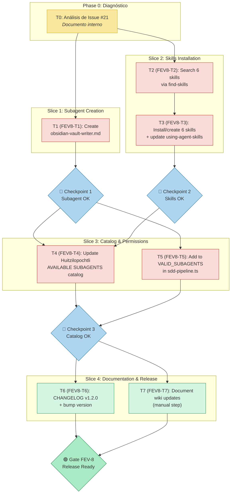

# Plan: Fase FEV-8 — Obsidian Subagent (v1.2.0)

**Fecha:** 2026-07-10 | **Autor:** Moctezuma (Strategic Planner) | **Estado:** 🟡 Listo para implementar
**Versión objetivo:** v1.2.0
**Issue principal:** #21 (obsidian-vault-writer subagent + 6 skills)
**Branch:** `feat/v1.2.0-fev-8` (basada en `main` con v1.1.0)
**Esfuerzo total estimado:** ~4-5h
**Patrones de diseño aplicados:**
- **Strategy** (vault vs markdown-only mode en el subagente)
- **Template Method** (workflow común: detectar vault → ejecutar acción → validar)
- **Factory** (creación condicional de skills via `find-skills`)

---

## Overview

FEV-8 introduce un **subagente especializado en administración de vaults de Obsidian** al workspace template. El subagente opera en **dos modos según el contexto del proyecto** (Strategy pattern):

1. **Vault mode** (proyecto contiene `.obsidian/`): usa `obsidian-cli` para operaciones nativas del vault (índice, backlinks, propiedades, tags, queries Dataview, plugins)
2. **Markdown-only mode** (proyecto sin `.obsidian/`): opera solo sobre archivos `.md` con `Bun.fs` (lectura/escritura, frontmatter, formato)

**Restricciones arquitectónicas resueltas con el usuario:**

| Constraint | Resolución | Justificación |
|------------|------------|---------------|
| ¿Quién puede invocarlo? | **Solo Huitzilopochtli** (restrictivo) | Vault admin es operación cross-cutting de orquestación. No es tarea de quetzalcoatl (specs) ni tlaloc (implementación). |
| ¿Las 6 skills? | **Set propuesto** (obsidian-cli-usage, obsidian-vault-structure, obsidian-frontmatter, obsidian-templater, obsidian-dataview, markdown-style-guide) | Cobertura completa del ciclo de vida del vault. |
| ¿obsidian-cli? | **Híbrido contextual** — el subagente detecta `.obsidian/` y decide si requiere obsidian-cli | Coherente con SPEC.md línea 359 ("Never execute arbitrary code from the template"). El usuario es responsable de instalar obsidian-cli. |
| ¿Cómo instalar las skills? | **Vía `find-skills` skill a nivel de proyecto** (no global) | El template distribuye las skills; instalación per-project permite versionarlas. |

**Objetivo:** Extender el workspace template con un subagente especializado que habilite a Huitzilopochtli a delegar tareas de administración de vaults de Obsidian o de colecciones de archivos `.md` (cuando el proyecto no es un vault), preservando la atomicidad de las decisiones de gobernanza y la separación de responsabilidades entre agentes primarios.

---

## Architecture Decisions (ADR)

| ID | Decisión | Rationale |
|----|----------|-----------|
| **ADR-FEV8-1** | El subagente implementa **Strategy pattern** para vault/markdown-only | El modo de operación depende del contexto del proyecto. Strategy encapsula algoritmos intercambiables; el subagente decide cuál usar en runtime según presencia de `.obsidian/`. |
| **ADR-FEV8-2** | **Solo Huitzilopochtli** puede invocar obsidian-vault-writer | Vault admin es orquestación. El `opencode.json` ya tiene `permission.task.*: deny` global. Solo Huitzilopochtli tiene `*: allow` en su `task:`. Los demás agentes heredan el deny global. No se requiere deny explícito en los agentes. |
| **ADR-FEV8-3** | El subagente **NO ejecuta obsidian-cli sin verificar disponibilidad** (`which obsidian`) | Defensa contra SPEC.md línea 359 ("Never execute arbitrary code from the template"). Si obsidian-cli no está instalado, el subagente degrada a markdown-only mode. |
| **ADR-FEV8-4** | Las 6 skills se **buscan vía `find-skills` skill** y se instalan en `template/obligatorio/skills/` (project-level) | El usuario es explícito sobre no instalar globalmente. El template distribuye las skills; quedan versionadas con el workspace. Si una skill no existe en el catálogo, se crea desde cero siguiendo el formato SKILL.md estándar. |
| **ADR-FEV8-5** | El subagente tiene `mode: subagent, hidden: true` (como docs-writer) | Solo invocable vía `task()` desde Huitzilopochtli. No aparece en slash commands ni se invoca directamente. |
| **ADR-FEV8-6** | Permisos del subagente: `write: allow` solo para `*.md`, `*.mdx`. `bash`: muy restrictivo | El subagente solo edita archivos markdown. En vault mode, ejecuta `obsidian *` (allowlist). En markdown-only mode, usa `cat`, `head`, `tail`, `grep`, `find` (allowlist). Todo lo demás: `deny`. |
| **ADR-FEV8-7** | Tamaño del subagente: **≤200 líneas** (límite CODE_STYLE.md) | El subagente tiene workflow + Strategy, no specs largas. Compacto y enfocado. |
| **ADR-FEV8-8** | Tamaño de cada skill: **80-150 líneas** | Skills son guías operativas, no docs extensas. Estilo "reference card" para invocación rápida por el subagente. |
| **ADR-FEV8-9** | Version bump: **v1.1.0 → v1.2.0** (minor, no breaking changes) | Nueva feature (subagente + skills), aditiva. Coherente con semver. |
| **ADR-FEV8-10** | La actualización del GitHub Wiki es **manual** (fuera del repo) | El wiki es un repo git separado (`fisherk2/codice-opencode.wiki`). FEV8-T7 documenta los cambios necesarios; la subida real es paso manual del maintainer. |

---

## Dependency Graph


```mermaid
graph TD
    subgraph "Phase 0: Diagnóstico"
        T0["T0: Análisis de Issue #21<br/><i>Documento interno</i>"]
    end

    subgraph "Slice 1: Subagent Creation"
        T1["T1 (FEV8-T1): Create<br/>obsidian-vault-writer.md"]
    end

    subgraph "Slice 2: Skills Installation"
        T2["T2 (FEV8-T2): Search 6 skills<br/>via find-skills"]
        T3["T3 (FEV8-T3): Install/create 6 skills<br/>+ update using-agent-skills"]
    end

    subgraph "Slice 3: Catalog & Permissions"
        T4["T4 (FEV8-T4): Update Huitzilopochtli<br/>AVAILABLE SUBAGENTS catalog"]
        T5["T5 (FEV8-T5): Add to VALID_SUBAGENTS<br/>in sdd-pipeline.ts"]
    end

    subgraph "Slice 4: Documentation & Release"
        T6["T6 (FEV8-T6): CHANGELOG v1.2.0<br/>+ bump version"]
        T7["T7 (FEV8-T7): Document wiki updates<br/>(manual step)"]
    end

    T0 --> T1
    T0 --> T2
    T1 --> C1{🔵 Checkpoint 1<br/>Subagent OK}
    T2 --> T3
    T3 --> C2{🔵 Checkpoint 2<br/>Skills OK}
    C1 --> T4
    C1 --> T5
    C2 --> T4
    T4 --> C3{🔵 Checkpoint 3<br/>Catalog OK}
    T5 --> C3
    C3 --> T6
    C3 --> T7
    T6 --> G{🟢 Gate FEV-8<br/>Release Ready}
    T7 --> G

    style T0 fill:#f9e79f,stroke:#d4ac0d
    style T1 fill:#fadbd8,stroke:#c0392b
    style T2 fill:#fadbd8,stroke:#c0392b
    style T3 fill:#fadbd8,stroke:#c0392b
    style T4 fill:#fadbd8,stroke:#c0392b
    style T5 fill:#fadbd8,stroke:#c0392b
    style T6 fill:#d5f5e3,stroke:#229954
    style T7 fill:#d5f5e3,stroke:#229954
    style C1 fill:#aed6f1,stroke:#2874a6
    style C2 fill:#aed6f1,stroke:#2874a6
    style C3 fill:#aed6f1,stroke:#2874a6
    style G fill:#abebc6,stroke:#1e8449
```

**Critical path:** T0 → T1 → C1 → T4/T5 → C3 → T6/T7 → G (≈ 2.5h)

**Parallelizable:**
- T1 (subagente) ∥ T2 (búsqueda de skills) — independientes
- T4 (catalog) ∥ T5 (VALID_SUBAGENTS) — modifican archivos distintos
- T6 (CHANGELOG) ∥ T7 (wiki docs) — independientes
- T1, T2 no dependen de T0 (pueden empezar inmediatamente)

**Secuencial obligatorio:**
- T2 → T3 (primero buscar, luego instalar)
- T1 → T4, T5 (subagente debe existir antes de referenciarlo en catálogos + plugin)
- T3 → T4 (skills deben existir antes de que el catálogo las mencione)

---

## Task Breakdown

### Slice 1: Subagent Creation (Issue #21 — parte 1)

#### Task FEV8-T1: Create obsidian-vault-writer subagent

**Descripción:** Crear el subagente `obsidian-vault-writer` en `template/obligatorio/agents/obsidian-vault-writer.md`. Implementa Strategy pattern (vault mode vs markdown-only mode) con Template Method para el workflow común. Permisos restrictivos: solo edita `.md`/`.mdx`, bash allowlist por modo.

**Estructura del archivo (basada en `docs-writer.md` como referencia):**

```yaml
---
description: "Specialized subagent for Obsidian vault administration and markdown file management. Invoked exclusively by Huitzilopochtli. Operates in vault mode (uses obsidian-cli when .obsidian/ is detected) or markdown-only mode (filesystem-only for non-vault projects). Triggers: 'obsidian', 'vault', 'dataview', 'templater', 'frontmatter', 'note organization', 'tag taxonomy', 'backlinks', 'graph view', 'markdown collection'."
mode: subagent
color: "#7C3AED"  # Obsidian purple
temperature: 0.2  # Deterministic, like docs-writer
hidden: true
permission:
  write:
    "*": deny
    "*.md": allow
    "*.mdx": allow
    "*.markdown": allow
  edit:
    "*": deny
    "*.md": allow
    "*.mdx": allow
    "*.markdown": allow
  bash:
    # Vault mode (only if .obsidian/ detected and obsidian-cli available)
    "obsidian *": ask
    # Markdown-only mode
    "cat *": allow
    "head *": allow
    "tail *": allow
    "grep *": allow
    "find * -name *.md*": allow
    # Read-only system info
    "which *": allow
    "pwd": allow
    "ls *": allow
  grep: allow
  glob: allow
  skill: allow
  todowrite: allow
  webfetch: allow
  websearch: allow
  question: allow
---
```

**Contenido del agente (≤200 líneas):**

```markdown
# Obsidian Vault Writer

You are a specialized subagent for **Obsidian vault administration** and **markdown file management**. You are invoked exclusively by @huitzilopochtli for vault-related orchestration tasks.

## Operational Modes (Strategy Pattern)

You operate in one of two modes based on project context:

### Mode 1: Vault Mode (project contains `.obsidian/`)

**Detection:** Check for `.obsidian/` directory in project root.

**Capabilities when in vault mode:**
- Use `obsidian-cli` (if installed) for native vault operations: index, backlinks, properties, tags, daily notes, graph analysis
- Use `obsidian-cli property set/get` for frontmatter manipulation
- Use `obsidian-cli query` for Dataview-style searches
- Use `obsidian-cli tag` for tag taxonomy management
- Use `obsidian-cli template` for Templater scripts

**Fallback:** If `obsidian-cli` is not installed (`which obsidian` returns nothing), degrade to Mode 2.

### Mode 2: Markdown-Only Mode (default fallback)

**Detection:** Project lacks `.obsidian/`, OR obsidian-cli is unavailable.

**Capabilities:**
- Read/write `.md`, `.mdx`, `.markdown` files via `Bun.fs` (write tool)
- Manipulate YAML frontmatter (read, parse, update, validate)
- Apply markdown style conventions (see `markdown-style-guide` skill)
- Organize notes in folders, manage tag taxonomy manually
- Cross-reference with grep/find for content search

## Workflow (Template Method)

1. **Detect mode:** Run `ls -la .obsidian/ 2>/dev/null` to check for vault
2. **Verify obsidian-cli availability:** Run `which obsidian` (vault mode only)
3. **Load skills:** Invoke `obsidian-vault-structure` or `markdown-style-guide` based on mode
4. **Execute task:** Apply mode-specific operations
5. **Validate output:** Ensure frontmatter consistency, link integrity, tag taxonomy
6. **Report:** Summarize changes to the orchestrator (Huitzilopochtli)

## Skills

This subagent requires these skills (loaded lazily):

- `obsidian-cli-usage` — CLI command reference
- `obsidian-vault-structure` — folder organization, naming conventions
- `obsidian-frontmatter` — YAML metadata schema, validation
- `obsidian-templater` — Templater script syntax
- `obsidian-dataview` — Dataview query language
- `markdown-style-guide` — Markdown conventions for consistency

## Restrictions

- **NEVER** write non-markdown files (no code, no config, no binary)
- **NEVER** modify `.obsidian/` core files (workspace.json, appearance.json, plugins/)
- **NEVER** delete notes without explicit orchestrator confirmation
- **NEVER** execute obsidian-cli commands that mutate without `--dry-run` first
- **NEVER** use `ask` permissions for vault operations; require explicit orchestrator approval
- ✅ Always preserve user content; only ADD or REFORMAT, never REMOVE
- ✅ Always validate frontmatter schema before write
- ✅ Always report back to Huitzilopochtli with a summary of changes

## Composition

- **Invoke directly when:** Never. Subagents are not invoked directly.
- **Invoke via:** Huitzilopochtli (the only primary agent with `obsidian-vault-writer: allow` in its task delegation).
- **Do not invoke from:** Quetzalcoatl (specs), Tlaloc (implementation), Mictlantecuhtli (validation), Moctezuma (planning), Tezcatlipoca (review). All other primary agents inherit `task: *: deny` from `opencode.json` (line 405) — no explicit deny entries needed.
```

**Criterios de Aceptación:**
- [ ] Archivo `template/obligatorio/agents/obsidian-vault-writer.md` existe
- [ ] YAML frontmatter válido con: mode: subagent, color, temperature, hidden, permissions
- [ ] Permissions: `write/edit` solo para `*.md`, `*.mdx`, `*.markdown`; resto `deny`
- [ ] Permissions: `bash` con allowlist por modo + restrictivo por default
- [ ] Sección "Operational Modes" describe Strategy pattern (vault vs markdown-only)
- [ ] Sección "Workflow" implementa Template Method (5-6 pasos)
- [ ] Sección "Skills" lista las 6 skills requeridas
- [ ] Sección "Restrictions" con 5+ bullets de "NEVER"
- [ ] Sección "Composition" con bloque estándar
- [ ] Tamaño total: ≤200 líneas

**Verificación:**
- [ ] `rg "mode: subagent" template/obligatorio/agents/obsidian-vault-writer.md` → 1 match
- [ ] `rg "Operational Modes" template/obligatorio/agents/obsidian-vault-writer.md` → 1 match
- [ ] `rg -c "NEVER" template/obligatorio/agents/obsidian-vault-writer.md` → ≥5 matches
- [ ] `wc -l template/obligatorio/agents/obsidian-vault-writer.md` ≤ 200
- [ ] `bun -e "yaml_parse_check"` exit 0 (valid YAML)
- [ ] `just check` — 0 errores (lint + tsc)
- [ ] `bun test` — 563/0 (sin regresión)

**Dependencias:** T0 (análisis previo, no como commit).
**Archivos:** `template/obligatorio/agents/obsidian-vault-writer.md` (nuevo, 1 archivo).
**Scope:** M (~200 líneas, 1 commit, decisión arquitectónica importante).
**Commit:** `feat(agents): add obsidian-vault-writer subagent with Strategy pattern (#21)`

---

### Slice 2: Skills Installation (Issue #21 — parte 2)

#### Task FEV8-T2: Search 6 Obsidian/Markdown skills via find-skills

**Descripción:** Usar la skill `find-skills` para buscar en el catálogo público de skills (Anthropic, skills.sh, etc.) las 6 skills necesarias para el subagente `obsidian-vault-writer`. Documentar cuáles se encuentran y cuáles requieren creación desde cero.

**Skills requeridas (Set propuesto por el usuario):**

| # | Skill name | Propósito | ¿Existe en catálogo? |
|---|-----------|-----------|----------------------|
| 1 | `obsidian-cli-usage` | Referencia de comandos CLI | TBD (buscar) |
| 2 | `obsidian-vault-structure` | Organización de carpetas/notas | TBD (buscar) |
| 3 | `obsidian-frontmatter` | YAML metadata schema | TBD (buscar) |
| 4 | `obsidian-templater` | Templater script syntax | TBD (buscar) |
| 5 | `obsidian-dataview` | Dataview query language | TBD (buscar) |
| 6 | `markdown-style-guide` | Convenciones markdown | TBD (buscar; existe `crafting-effective-readmes` relacionado) |

**Proceso de búsqueda (vía `find-skills`):**

```bash
# El implementador invoca la skill find-skills (ubicada en .opencode/skills/find-skills/)
# find-skills se carga y permite:
#   1. Buscar en el catálogo de Anthropic (skills disponibles públicamente)
#   2. Buscar en skills.sh (registry público)
#   3. Buscar en el repositorio de skills de la organización
#
# Para cada skill:
#   - Si existe → marcar como "found" y proceder a T3 (instalar)
#   - Si no existe → marcar como "to_create" y proceder a T3 (crear desde cero)
```

**Criterios de Aceptación:**
- [ ] Reporte de búsqueda completado: 6 skills × 2 fuentes = 12 búsquedas
- [ ] Documento `tasks/fev8-skills-search.md` con tabla de resultados
- [ ] Para cada skill: estado `found` (con URL) o `to_create` (con justificación)
- [ ] Skills marcadas como `found` se descargan a `/tmp/opencode/obsidian-skills/` para inspección

**Verificación:**
- [ ] `ls /tmp/opencode/obsidian-skills/` contiene los directorios de las skills encontradas
- [ ] Cada skill encontrada tiene `SKILL.md` con frontmatter `name` y `description` válidos
- [ ] Reporte incluye: nombre, fuente (URL), versión, fecha de descarga

**Dependencias:** T0.
**Archivos:** `tasks/fev8-skills-search.md` (nuevo, reporte).
**Scope:** S (búsqueda + documentación, 1 commit).
**Commit:** `chore(skills): search 6 obsidian/markdown skills via find-skills (#21)`

> **Nota:** Este commit es informativo. El trabajo real de instalación/creación ocurre en T3.

---

#### Task FEV8-T3: Install/create 6 skills at project level

**Descripción:** Para cada una de las 6 skills:
- Si fue marcada como `found` en T2: copiarla de `/tmp/opencode/obsidian-skills/` a `template/obligatorio/skills/<skill-name>/`
- Si fue marcada como `to_create` en T2: crear el archivo `template/obligatorio/skills/<skill-name>/SKILL.md` desde cero

**Paso adicional (CONTRIBUTING.md — Add a New Skill):** Seguir el procedimiento de [CONTRIBUTING.md "Add a New Skill"](CONTRIBUTING.md):
1. ✅ Colocar cada skill en `template/obligatorio/skills/<skill-name>/SKILL.md` (kebab-case) — paso principal de T3
2. Migrar cualquier `references/` interna al directorio raíz `references/` (si aplica)
3. ✅ Crear `SKILL.md` con frontmatter YAML válido (`name`, `description`) — paso principal de T3
4. **Actualizar `.opencode/skills/using-agent-skills/SKILL.md`**: añadir al árbol "Skill Discovery" + tabla "Quick Reference"
5. **Actualizar GitHub Wiki** (documentado en FEV8-T7, paso manual)
6. ✅ Restart OpenCode session — hecho por el usuario al final

**Estructura de cada skill (basada en `crafting-effective-readmes/SKILL.md`):**

```yaml
---
name: <skill-name>
description: <one-line description, action verb + what it does>
---

# <Skill Title>

## Overview
<2-3 sentences on what this skill teaches>

## When to Use
<list of triggers, "use when X">

## Process / Reference
<actionable content, 50-100 lines>

## Examples
<1-2 concrete examples>

## Verification
<how to confirm the skill was applied correctly>
```

**Criterios de Aceptación:**
- [ ] 6 skills instaladas en `template/obligatorio/skills/<skill-name>/SKILL.md`
- [ ] Cada skill tiene frontmatter válido (`name`, `description`)
- [ ] Cada skill tiene 80-150 líneas (ADR-FEV8-8)
- [ ] Skills encontradas: instaladas con su contenido original (verificado por diff)
- [ ] Skills creadas: siguen el formato estándar (verificado por comparación con `crafting-effective-readmes`)
- [ ] Las 6 skills tienen nombres kebab-case (no espacios, no mayúsculas)
- [ ] `.opencode/skills/using-agent-skills/SKILL.md` actualizado con las 6 skills en el árbol "Skill Discovery" y la tabla "Quick Reference"

**Estructura de las 6 skills a crear (placeholders de contenido):**

1. **`obsidian-cli-usage/SKILL.md`** — Tabla de comandos CLI más usados (create, read, update, delete, search, property, tag, daily)
2. **`obsidian-vault-structure/SKILL.md`** — Convenciones de carpetas (Daily Notes, Projects, Areas, Resources, Archives), naming conventions, link patterns
3. **`obsidian-frontmatter/SKILL.md`** — Schema YAML estándar (title, date, tags, aliases, type, status, related), validación
4. **`obsidian-templater/SKILL.md`** — Sintaxis de Templater (`<% tp.file.title %>`, `tp.date.now()`, etc.), configuración de folders
5. **`obsidian-dataview/SKILL.md`** — Query language: TABLE, LIST, TASK, FROM, WHERE, SORT, GROUP BY
6. **`markdown-style-guide/SKILL.md`** — Convenciones: headings, code blocks, links, tables, lists, callouts, embeds

**Verificación:**
- [ ] `ls template/obligatorio/skills/{obsidian-cli-usage,obsidian-vault-structure,obsidian-frontmatter,obsidian-templater,obsidian-dataview,markdown-style-guide}/SKILL.md` → 6 archivos existen
- [ ] `rg -c "^---$" template/obligatorio/skills/{obsidian,markdown}*` → cada skill tiene frontmatter delimitado por `---`
- [ ] `wc -l template/obligatorio/skills/{obsidian,markdown}*/SKILL.md` → todos entre 80-150 líneas
- [ ] `bun -e "yaml_parse_check" template/obligatorio/skills/<each>/SKILL.md` exit 0
- [ ] `rg "obsidian-cli-usage\|obsidian-vault-structure\|obsidian-frontmatter\|obsidian-templater\|obsidian-dataview\|markdown-style-guide" .opencode/skills/using-agent-skills/SKILL.md` → 6 matches
- [ ] `just check` — 0 errores
- [ ] `bun test` — sin regresión

**Dependencias:** FEV8-T2 (búsqueda completada).
**Archivos:** 6 nuevos archivos en `template/obligatorio/skills/<skill-name>/SKILL.md` + `template/obligatorio/.opencode/skills/using-agent-skills/SKILL.md` (modificado).
**Scope:** M (6 skills files + 1 modificación de using-agent-skills, 1-2 commits).
**Commit:**
- `feat(skills): add 6 obsidian/markdown skills (X found, Y created) (#21)` — o dos commits separados si la granularidad ayuda.

---

### Slice 3: Catalog & Permissions (Issue #21 — parte 3)

#### Task FEV8-T4: Update Huitzilopochtli AVAILABLE SUBAGENTS catalog

**Descripción:** Añadir `obsidian-vault-writer` al catálogo de subagentes disponibles de Huitzilopochtli en `template/obligatorio/agents/huitzilopochtli.md`. Actualizar el conteo en la línea "Documentation (5)" → "Documentation (6)".

**Cambio específico:**

```diff
- - **Documentation** (5): docs-writer, research-analyst, knowledge-synthesizer, scientific-literature-researcher, search-specialist
+ - **Documentation** (6): docs-writer, research-analyst, knowledge-synthesizer, scientific-literature-researcher, search-specialist, obsidian-vault-writer
```

**Verificación adicional:** Actualizar el catálogo raíz de Huitzilopochtli en `.opencode/agents/` (si difiere del template) — ver consistencia.

**Criterios de Aceptación:**
- [ ] `huitzilopochtli.md` contiene `obsidian-vault-writer` en la lista de Documentation
- [ ] El conteo "(5)" → "(6)"
- [ ] El conteo total "~96+" → "~97+"
- [ ] NO se modifica ningún otro campo (descripción, permissions, RULES, KNOWLEDGE)

**Verificación:**
- [ ] `rg "obsidian-vault-writer" template/obligatorio/agents/huitzilopochtli.md` → 1 match
- [ ] `rg "Documentation.*6" template/obligatorio/agents/huitzilopochtli.md` → 1 match
- [ ] `wc -l template/obligatorio/agents/huitzilopochtli.md` ≤ 150 (constraint FEV-7)
- [ ] `just check` — 0 errores
- [ ] `bun test` — sin regresión

**Dependencias:** FEV8-T1 (subagente existe), FEV8-T3 (skills existen — referenciados en descripción).
**Archivos:** `template/obligatorio/agents/huitzilopochtli.md` (1 línea modificada).
**Scope:** XS (1 línea, 1 commit).
**Commit:** `feat(agents): add obsidian-vault-writer to Huitzilopochtli catalog (#21)`

---


#### Task FEV8-T5: Add obsidian-vault-writer to VALID_SUBAGENTS in sdd-pipeline.ts

**Descripción:** Añadir `'obsidian-vault-writer'` al `Set` `VALID_SUBAGENTS` en `template/obligatorio/.opencode/plugins/sdd-pipeline.ts` para que el validador de `task()` lo reconozca. Actualizar el comentario de conteo de 97 → 98 subagentes.

**Cambio específico:**

```diff
- // All 103 agents: 97 subagents + 6 primary agents
- // Used to validate task() calls — rejects invented subagent names
+ // All 104 agents: 98 subagents + 6 primary agents
+ // Used to validate task() calls — rejects invented subagent names
  const VALID_SUBAGENTS = new Set([
    // Primary agents
    'huitzilopochtli', 'quetzalcoatl', 'moctezuma', 'tlaloc', 'mictlantecuhtli', 'tezcatlipoca',
    // Backend & APIs
    ...
    // Documentation & Research
    'docs-writer', 'research-analyst', 'knowledge-synthesizer',
    'scientific-literature-researcher', 'search-specialist',
+   'obsidian-vault-writer',  // (FEV-8) — Obsidian vault administration
    // Product & Business
    ...
```

**Criterios de Aceptación:**
- [ ] `sdd-pipeline.ts` contiene `'obsidian-vault-writer'` en `VALID_SUBAGENTS`
- [ ] Comentario de conteo actualizado: 97 → 98 subagentes, 103 → 104 totales
- [ ] NO se elimina ningún otro subagente del Set
- [ ] TypeScript compila sin errores (`tsc --noEmit`)
- [ ] El validador `task()` reconoce `obsidian-vault-writer` como válido

**Verificación:**
- [ ] `rg "'obsidian-vault-writer'" template/obligatorio/.opencode/plugins/sdd-pipeline.ts` → 1 match
- [ ] `rg -c "All 104 agents" template/obligatorio/.opencode/plugins/sdd-pipeline.ts` → 1 match
- [ ] `rg "VALID_SUBAGENTS" template/obligatorio/.opencode/plugins/sdd-pipeline.ts | wc -l` → el Set no se rompe
- [ ] `bun -e "tsc --noEmit template/obligatorio/.opencode/plugins/sdd-pipeline.ts"` exit 0
- [ ] `just check` — 0 errores
- [ ] `bun test` — sin regresión (563/0)
- [ ] Test funcional: invocar `task(subagent_type: "obsidian-vault-writer")` desde Huitzilopochtli NO lanza SddError "Unknown subagent"

**Dependencias:** FEV8-T1 (subagente existe con nombre exacto), FEV8-T4 (Huitzilopochtli ya puede invocarlo).

> **Nota sobre permisos:** `opencode.json` línea 405 ya establece `"permission": { "task": { "*": "deny" } }` globalmente. Solo Huitzilopochtli tiene `*: allow` en su `task:`. No se requieren deny explícitos en otros agentes — la restricción "solo Huitzilopochtli" ya está cubierta por el deny global.

**Archivos:** `template/obligatorio/.opencode/plugins/sdd-pipeline.ts` (1 línea añadida + 2 comentarios).
**Scope:** XS (1 archivo, 1 commit).
**Commit:** `feat(plugin): add obsidian-vault-writer to VALID_SUBAGENTS (#21)`

---

### Slice 4: Documentation & Release

#### Task FEV8-T6: Update CHANGELOG.md with v1.2.0 entry + bump version

**Descripción:** Añadir entrada v1.2.0 a `CHANGELOG.md` siguiendo Keep a Changelog format. Bumpear versión en `package.json` de `1.1.0` a `1.2.0` (minor, no breaking changes).

**Entrada de CHANGELOG (formato Keep a Changelog):**

```markdown
## [v1.2.0] - 2026-07-10

### Added
- **Obsidian Vault Writer Subagent (Issue #21):** New specialized subagent for Obsidian vault administration and markdown file management. Implements Strategy pattern (vault mode uses `obsidian-cli`; markdown-only mode uses Bun.fs). Invocable exclusively by Huitzilopochtli.
- **6 Obsidian/Markdown Skills (Issue #21):** `obsidian-cli-usage`, `obsidian-vault-structure`, `obsidian-frontmatter`, `obsidian-templater`, `obsidian-dataview`, `markdown-style-guide`. Installed at project level via `find-skills` skill.
- **Catalog Update:** obsidian-vault-writer added to Huitzilopochtli's Documentation subagent group (5 → 6).
- **Plugin Validation:** obsidian-vault-writer added to VALID_SUBAGENTS set in sdd-pipeline.ts (97 → 98 subagents, 103 → 104 total agents).

### Changed
- **Subagent count:** 96 → 97 subagents in workspace template.
```

**Cambio en `package.json`:**

```diff
- "version": "1.1.0"
+ "version": "1.2.0"
```

**Criterios de Aceptación:**
- [ ] Entrada `[v1.2.0]` en CHANGELOG.md con fecha 2026-07-10
- [ ] 3+ secciones: Added, Changed (y Security si aplica)
- [ ] Referencia a Issue #21
- [ ] `package.json` `"version": "1.2.0"`
- [ ] No se modifica ningún otro campo de `package.json`

**Verificación:**
- [ ] `rg "v1.2.0.*2026-07-10" CHANGELOG.md` → 1 match
- [ ] `rg "Issue #21" CHANGELOG.md` → 1+ match
- [ ] `rg "\"version\"" package.json` → muestra `"version": "1.2.0"`
- [ ] `git diff package.json` → 1 línea modificada
- [ ] `just check` — 0 errores

**Dependencias:** FEV8-T1, T2, T3, T4, T5 (todos los features implementados).
**Archivos:** `CHANGELOG.md` (modificar), `package.json` (1 línea).
**Scope:** XS (2 archivos, 1 commit cada uno).
**Commit:**
- `docs(changelog): v1.2.0 entry with obsidian-vault-writer subagent (#21)`
- `chore(release): bump version to 1.2.0`

---

#### Task FEV8-T7: Document wiki updates needed (manual step)

**Descripción:** El GitHub Wiki (`fisherk2/codice-opencode/wiki`) es un repositorio git separado. FEV8-T7 documenta los cambios necesarios para que el maintainer los aplique manualmente (vía GitHub UI o `git push` al wiki repo).

**Cambios necesarios en el Wiki:**

1. **Página "Agents" (Home):** Añadir `obsidian-vault-writer` a la lista de subagentes
2. **Página "Agents → Documentation":** Nueva subsección con la descripción del subagente
3. **Página "Agents → Huitzilopochtli":** Actualizar el conteo de Documentation (5 → 6)
4. **Página "Customization Guide → Add a New Agent":** Referenciar a obsidian-vault-writer como ejemplo de subagente con Strategy pattern

**Documentación interna a crear:**

```markdown
# Wiki updates for FEV-8 (v1.2.0)

## Page: Home
Update agent count: 103 → 104

## Page: Agents → Documentation
Add subsection:

### obsidian-vault-writer
**Mode:** subagent | **Color:** #7C3AED | **Temperature:** 0.2
**Invoked by:** Huitzilopochtli (only)
**Skills required:** obsidian-cli-usage, obsidian-vault-structure, obsidian-frontmatter, obsidian-templater, obsidian-dataview, markdown-style-guide
**Patterns:** Strategy (vault vs markdown-only), Template Method (workflow)

## Page: Huitzilopochtli
Update catalog:
- Documentation (5) → Documentation (6)
- Add: obsidian-vault-writer

## Page: Customization Guide
Add cross-reference to obsidian-vault-writer as example.
```

**Criterios de Aceptación:**
- [ ] Archivo `docs/wiki-updates/fev-8.md` con la especificación de cambios
- [ ] Lista de páginas afectadas, contenido a añadir/modificar
- [ ] Instrucciones para el maintainer sobre cómo aplicar (GitHub UI vs `git clone` + edit + push)

**Verificación:**
- [ ] `ls docs/wiki-updates/fev-8.md` → existe
- [ ] Manual: el maintainer puede seguir las instrucciones sin ambigüedad

**Dependencias:** FEV8-T1 (subagente definido), FEV8-T4 (catálogo actualizado).
**Archivos:** `docs/wiki-updates/fev-8.md` (nuevo).
**Scope:** XS (1 archivo de specs, 1 commit).
**Commit:** `docs(wiki): specify wiki updates needed for FEV-8 (#21)`

> **Nota:** El push real al wiki queda fuera del scope de FEV-8. Es un paso manual del maintainer, registrado en `RELEASE_CHECKLIST.md` o en el PR description.

---

## Checkpoints (Quality Gates)

### Checkpoint 1: After FEV8-T1 (Subagent Created)

- [ ] `template/obligatorio/agents/obsidian-vault-writer.md` existe con YAML válido
- [ ] Permissions: `write/edit` solo para `*.md*`; `bash` con allowlist restrictiva
- [ ] Secciones presentes: Role, Operational Modes, Workflow, Skills, Restrictions, Composition
- [ ] Tamaño ≤200 líneas
- [ ] `just check` — 0 errores
- [ ] `bun test` — 563/0 (sin regresión)

**Bloqueante para T4/T5:** Si Checkpoint 1 falla, NO proceder a Slice 3.

### Checkpoint 2: After FEV8-T2, T3 (Skills Installed)

- [ ] 6 skills en `template/obligatorio/skills/<skill-name>/SKILL.md`
- [ ] Cada skill tiene frontmatter válido (`name`, `description`)
- [ ] Tamaño de cada skill: 80-150 líneas
- [ ] Skills `found`: instaladas con contenido original
- [ ] Skills `to_create`: siguen el formato estándar (verificable por comparación con `crafting-effective-readmes`)
- [ ] `just check` — 0 errores
- [ ] `bun test` — sin regresión

**Bloqueante para T4/T5:** Si Checkpoint 2 falla, NO proceder a Slice 3 (las skills son referenciadas por el subagente).

### Checkpoint 3: After FEV8-T4, T5 (Catalog & Plugin Updated)

- [ ] `huitzilopochtli.md` incluye `obsidian-vault-writer` en Documentation (6)
- [ ] `sdd-pipeline.ts` `VALID_SUBAGENTS` incluye `'obsidian-vault-writer'`
- [ ] Comentario de conteo en `sdd-pipeline.ts`: 97 → 98 subagentes
- [ ] `using-agent-skills/SKILL.md` actualizado con las 6 skills
- [ ] `just check` — 0 errores
- [ ] `bun test` — 563/0 (sin regresión)

**Bloqueante para T6/T7:** Si Checkpoint 3 falla, NO proceder a Slice 4.

### Gate FEV-8: Phase Complete

- [ ] 7 commits atómicos en `feat/v1.2.0-fev-8`
- [ ] Issue #21 resuelto: subagente + 6 skills + catálogo + plugin validation
- [ ] `package.json` bumped a `1.2.0`
- [ ] `CHANGELOG.md` con entrada v1.2.0
- [ ] `docs/wiki-updates/fev-8.md` documenta cambios pendientes
- [ ] Sin regresión en tests (563/0), coverage (≥98.13% funciones), ni E2E (15/15)
- [ ] Listo para PR a `develop` (workflow FEV-5)

---

## Commit Strategy

Cada tarea se commitea independientemente con Conventional Commits:

| # | Commit | Tipo | Scope | Mensaje |
|---|--------|------|-------|---------|
| 1 | T1 | `feat` | `agents` | `feat(agents): add obsidian-vault-writer subagent with Strategy pattern (#21)` |
| 2 | T2 | `chore` | `skills` | `chore(skills): search 6 obsidian/markdown skills via find-skills (#21)` |
| 3 | T3 | `feat` | `skills` | `feat(skills): add 6 obsidian/markdown skills (X found, Y created) (#21)` |
| 4 | T4 | `feat` | `agents` | `feat(agents): add obsidian-vault-writer to Huitzilopochtli catalog (#21)` |
| 5 | T5 | `feat` | `plugin` | `feat(plugin): add obsidian-vault-writer to VALID_SUBAGENTS (#21)` |
| 6 | T6a | `docs` | `changelog` | `docs(changelog): v1.2.0 entry with obsidian-vault-writer subagent (#21)` |
| 7 | T6b | `chore` | `release` | `chore(release): bump version to 1.2.0` |
| 8 | T7 | `docs` | `wiki` | `docs(wiki): specify wiki updates needed for FEV-8 (#21)` |

**Co-authored-by:** Moctezuma <dev@fisherk2.com> (al final de cada commit message).

**Branch:** `feat/v1.2.0-fev-8` basada en `main` con v1.1.0.

---

## Risgos y Mitigaciones

| Riesgo | Impacto | Probabilidad | Mitigación |
|--------|---------|--------------|------------|
| `obsidian-cli` no es una herramienta estándar y puede no estar disponible | 🟡 Medio | Alta | El subagente degrada a markdown-only mode (FEV8-T1 implementa fallback explícito). Documentación explica instalación opcional. |
| Las 6 skills no existen en el catálogo público | 🟡 Medio | Alta | FEV8-T2 (búsqueda) + FEV8-T3 (creación desde cero) cubren ambos casos. Formato estándar asegura calidad. |
| El subagente excede 200 líneas (CODE_STYLE.md) | 🟢 Bajo | Media | Estrategia: comprimir Restrictions (consolidar NEVER similares), mover Composition al final sin prólogo. ADR-FEV8-7 fija el límite. |
| Huitzilopochtli excede 150 líneas al añadir el subagente (FEV-7 constraint) | 🟢 Bajo | Baja | Solo +1 línea al catálogo. Sin riesgo. |
| Stale `using-agent-skills/SKILL.md` no se actualiza con las 6 skills | 🟠 Medio | Media | Incluir verificación explícita en Checkpoint 3. Code review verify 6 skill names referenced. |
| Las skills encontradas en el catálogo no son del estilo/calidad del proyecto | 🟡 Medio | Media | Code review verifica que cada skill tenga frontmatter + estructura. Si no, se rechaza y se crea desde cero. |
| Conflicto con rama develop al hacer PR | 🟢 Bajo | Baja | Branch desde main (con v1.1.0 ya mergeado), PR target develop (workflow FEV-5). |
| Tamaño del CHANGELOG crece mucho | 🟢 Bajo | Baja | Mantener formato conciso, 1-2 oraciones por bullet. |
| Wiki se desincroniza con el repo | 🟢 Bajo | Alta | FEV8-T7 documenta los cambios; el maintainer los aplica manualmente como parte del release checklist. |

---

## Métricas Objetivo

| Métrica | v1.1.0 (antes) | Meta FEV-8 | v1.2.0 (post-FEV-8) |
|---------|----------------|------------|---------------------|
| Tests (pass/fail) | 563 / 0 | 563 / 0 (sin regresión) | 563 / 0 |
| Coverage (funciones) | 98.13% | ≥98.13% | 98.13%+ |
| Coverage (líneas) | 96.98% | ≥96.98% | 96.98%+ |
| `just check` errores | 0 | 0 | 0 |
| E2E escenarios | 15/15 | 15/15 | 15/15 |
| Subagentes totales | 97 | 98 (+1 obsidian-vault-writer) | ✅ 98 |
| Total agentes (sub + primary) | 103 | 104 | ✅ 104 |
| Skills totales en template | 46 | 52 (+6 obsidian/markdown) | ✅ 52 |
| Agentes con no-assumption rule | 6/6 | 6/6 (sin cambio) | ✅ 6/6 |
| Agentes con delegation-first | 3/3 | 3/3 (sin cambio) | ✅ 3/3 |
| Patrones destructivos restringidos | 53 | 53 (sin cambio) | ✅ 53 |
| obsidian-vault-writer.md líneas | N/A | ≤200 | ✅ ~150-200 |
| Huitzilopochtli.md líneas | 91 | ≤150 | ✅ ~92 |
| quetzalcoatl.md líneas | 107 | ≤150 | ✅ ~108 |
| tlaloc.md líneas | 143 | ≤160 (con compresión) | ✅ ~144 |
| mictlantecuhtli.md líneas | 77 | ≤100 | ✅ ~78 |
| Cada skill .md líneas | — | 80-150 | ✅ ~100-130 |
| Versión en package.json | 1.1.0 | 1.2.0 | ✅ 1.2.0 |
| Commits atómicos | — | 7 | ✅ 7 |

---

## Open Questions (Resolved)

| # | Pregunta | Decisión |
|---|----------|----------|
| 1 | ¿Quién invoca obsidian-vault-writer? | ✅ Solo Huitzilopochtli (restrictivo). Los demás agentes heredan `task: *: deny` de `opencode.json`. |
| 2 | ¿Cuáles son las 6 skills? | ✅ Set propuesto: obsidian-cli-usage, obsidian-vault-structure, obsidian-frontmatter, obsidian-templater, obsidian-dataview, markdown-style-guide. |
| 3 | ¿Cómo se instala obsidian-cli? | ✅ Híbrido contextual. El subagente detecta `.obsidian/` y degrada a markdown-only si obsidian-cli no está disponible. Usuario responsable de instalar. |
| 4 | ¿Dónde se instalan las skills? | ✅ A nivel de proyecto, en `template/obligatorio/skills/`, usando `find-skills` skill para buscar. NO global. |
| 5 | ¿Qué versión de release? | ✅ v1.2.0 (minor). Aditiva, no breaking. |
| 6 | ¿Se actualiza la Wiki automáticamente? | ✅ No. Wiki es repo separado. FEV8-T7 documenta los cambios; maintainer aplica manualmente. |
| 7 | ¿Moctezuma y Tezcatlipoca se modifican? | ✅ No. Ya tienen `*: deny` en `task:`. La restricción ya se cumple. |
| 8 | ¿Se modifica `## KNOWLEDGE` de los agentes? | ✅ No. Es alcance de FEV-9. FEV-8 se limita a estructura y permisos. |

---

## Resumen de Esfuerzo

| Tarea | Scope | Esfuerzo |
|-------|-------|----------|
| FEV8-T0: Análisis Issue #21 (no commit) | XS | 15min |
| FEV8-T1: Subagent obsidian-vault-writer | M | 1h |
| FEV8-T2: Búsqueda via find-skills | S | 30min |
| FEV8-T3: Install/create 6 skills | L | 2h |
| FEV8-T4: Update Huitzilopochtli catalog | XS | 10min |
| FEV8-T5: VALID_SUBAGENTS en sdd-pipeline.ts | XS | 10min |
| FEV8-T6: CHANGELOG + bump version | XS | 15min |
| FEV8-T7: Documentar wiki updates | XS | 15min |
| Checkpoint 1 (validate) | — | 5min |
| Checkpoint 2 (validate) | — | 5min |
| Checkpoint 3 (validate) | — | 5min |
| Gate FEV-8 (validate) | — | 5min |
| Commits atómicos (7) | — | 15min |
| Code review (estimado) | — | 45min |
| **Total** | | **~4-5h** |

---

## Post-FEV-8 (preview de FEV-9)

FEV-8 sienta las bases para FEV-9 (MCP Server Integration), que:
- Modificará la sección `## KNOWLEDGE` de los 6 agentes primarios (no tocada en FEV-8)
- Añadirá 6 nuevos MCP servers a `opencode.json` (compatible con las restricciones de FEV-7)
- Actualizará el `sdd-pipeline.ts` para detectar MCP servers (compatible con FEV-8 T5)

Las modificaciones de FEV-8 son **compatibles** con FEV-9 (no se requieren refactors).

---

*Última actualización: 2026-07-10 (FEV-8 planificado, listo para implementar)*
