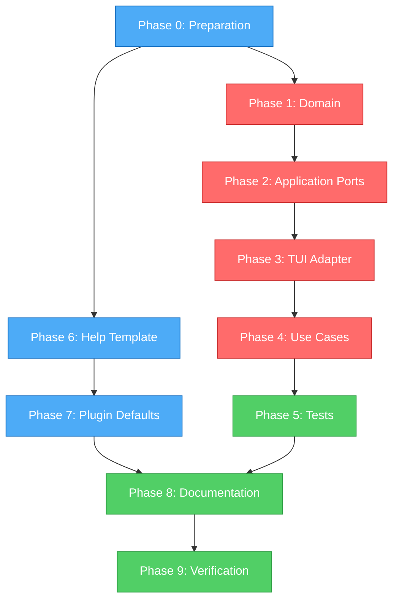

# Implementation Plan: FEV-14 — UX Enhancements (v1.2 Phase 4)

**Phase:** FEV-14 (v1.2 Phase 4) — ✅ COMPLETED
**Issues:** [#47](https://github.com/fisherk2/codice-opencode/issues/47) (Progress bar missing), [#56](https://github.com/fisherk2/codice-opencode/issues/56) (`/help` command missing)
**Spec:** [SPEC.md](../SPEC.md), [docs/WORKFLOW.md](../docs/WORKFLOW.md) §FEV-14
**Date:** 2026-07-29 → 2026-07-30
**Author:** Moctezuma (Strategic Planner)
**Branch base:** `feat/ux-docs-wiki` (FEV-13 already merged)
**Methodology:** Vertical slicing + Strategy pattern (multi-progress) + Adapter pattern (TUI)

---

## Overview

Resolver los dos issues UX pendientes:

1. **Issue #47 — Progress bar:** Añadir feedback visual del progreso durante la instalación/actualización del workspace. Estilo **multi-progress con log lines** (clack.progress por archivo + clack.log con eventos staged/committed/symlinked), **siempre visible** (no solo en `--verbose`).

2. **Issue #56 — Comando `/help`:** Crear comando interactivo asignado a Huitzilopochtli que ofrezca 6 opciones vía `question` tool: (1) What is Códice?, (2) Start new project, (3) Update existing workspace, (4) SDD cycle explained, (5) List all 13 commands, (6) Troubleshooting & FAQ.

**Restricciones del usuario confirmadas (vía question tool):**
- **Estilo progress bar:** Multi-progress con log lines (clack.progress + clack.log events)
- **/help menu:** Onboarding + lifecycle + advanced (6 opciones)
- **Visibilidad:** Siempre visible (no solo `--verbose`)
- **Versión:** Mantener v1.2.0 (sin bump; cierre coordinado con FEV-12/13/15)

**Cambio arquitectónico:**
- **Domain layer:** `IFileMergeEngine` gana un `onProgress?: ProgressCallback` opcional (Observer pattern, Strategy variant). `FileMergeEngine.execute()` emite eventos en cada `stageFile` y tras `commitStaging`.
- **Application layer:** `IUserPrompt` gana `showProgressBar(total, label)` y `logProgressEvent(message)` (puertos explícitos para multi-progress + logs).
- **Infrastructure layer:** `ClackPromptsAdapter` implementa `clack.progress()` + `clack.log()` con eventos (`stage`, `commit`, `symlink`, `gitignore`). Spinner pattern para cleanup.
- **Template:** Nuevo `commands/help.md` con frontmatter `agent: huitzilopochtli`. Auto-discovery del plugin SDD lo detecta (Pillar 1, FEV-13). Defaults actualizados con `INTENT_PATTERNS["/help"]`, `COMMAND_PHASE_MAP["/help"]`, `PHASE_SUGGESTIONS.idle.huitzilopochtli`.

**Versión:** Sin bump. v1.2.0 se lanza al cierre coordinado de FEV-12 ✅ + FEV-13 ✅ + FEV-14 + FEV-15.

---

## Architecture Decisions

| Decision | Rationale |
|----------|-----------|
| **`onProgress?: ProgressCallback` opcional en `IFileMergeEngine`** | Backward compatible (FEV-13 testing infrastructure no requiere cambio). Observer pattern: domain emite eventos sin conocer TUI. |
| **Multi-progress + log lines (decisión del usuario)** | `clack.progress()` per-file + `clack.log()` con eventos estructurados (`stage: AGENTS.md`, `commit: 47 files`, `symlink: .opencode/agents`). Más feedback que spinner solo, sin saturar. |
| **`showProgressBar()` y `logProgressEvent()` separados en `IUserPrompt`** | Strategy + Adapter: domain pide "progress + log" al puerto; TUI decide cómo renderizar. Permite mockear ambos en tests. |
| **Progress siempre visible (decisión del usuario)** | Mejor feedback para usuarios nuevos. Costo: ~50ms overhead de render por stage. Aceptable dentro de SC-9 (<5s Clean Install). |
| **Counter-based progress (no byte-based)** | FileRule.path es la unidad observable. `total = rules.length`, `current = filesStaged`. Más simple que tracking de bytes. |
| **`/help` invoca `clack.select()` con 6 opciones, no sub-comandos** | Single menu = menor fricción. Cada opción ofrece contenido inline + enlace a docs/wiki. Huitzilopochtli delega la respuesta (no escribe código, solo explica). |
| **`/help` comando en `template/obligatorio/commands/help.md`** | Auto-discovery del plugin SDD lo detecta sin tocar código. Consistente con patrón de 12 comandos existentes. |
| **`/help` registrado en defaults.ts (3 mapas)** | Backup safety net cuando el plugin corre sin auto-discovery (tests, edge cases). `COMMAND_AGENT_MAP` + `INTENT_PATTERNS` + `COMMAND_PHASE_MAP` actualizados. |
| **Sin tests unitarios para `/help.md`** | Es un prompt de agente, no código ejecutable. Su comportamiento se valida con un integration test que verifica que el plugin lo detecta y el `question tool` muestra las opciones. |
| **Domain sin imports de `IUserPrompt`** | Layer rule (Clean Architecture, ADR-001). Use cases inyectan `IUserPrompt` para callback de progress. |
| **Plugin SDD no se toca en FEV-14** | Auto-discovery + config-driven (FEV-13) ya permite añadir `/help` sin modificar `sdd-pipeline.ts`. Cero riesgo de regresión. |
| **Total: <300 líneas nuevas en src/** | Domain: ~40 líneas (interface + callback). Application: ~30 líneas (port extensions). Infrastructure: ~80 líneas (clack.progress adapter). Use cases wiring: ~60 líneas. |
| **Spinning durante `commitStaging()`** | commit es single call pero puede ser lento (atomic rename). Mostrar spinner "Committing changes atomically..." para mantener UX continuity. |

---

## Dependency Graph

```
Phase 0: Preparation (no dependencies, parallel)
├── Task 0.1: Crear rama feat/fev14-ux desde develop (or feat/ux-docs-wiki)
└── Task 0.2: Verificar baseline (just check + bun test exit 0)

Phase 1: Domain — Progress callback (Pillar A foundation)
├── Task 1.1: Definir `ProgressEvent` type en src/domain/types/ProgressEvent.ts
├── Task 1.2: Extender IFileMergeEngine con `onProgress?: ProgressCallback`
├── Task 1.3: Implementar emisión de eventos en FileMergeEngine.execute()
└── Checkpoint: Domain type-check + unit tests pasan, sin regresión

Phase 2: Application — TUI ports (depends on Phase 1)
├── Task 2.1: Extender IUserPrompt con `showProgressBar()` y `logProgressEvent()`
├── Task 2.2: Tests unitarios para IUserPrompt extended port (mock-based)
└── Checkpoint: Application type-check pasa, contrato claro

Phase 3: Infrastructure — ClackPromptsAdapter (depends on Phase 2)
├── Task 3.1: Implementar showProgressBar() con clack.progress() per-file
├── Task 3.2: Implementar logProgressEvent() con clack.log() estructurado
├── Task 3.3: Tests integration para progress rendering (capture stdout)
└── Checkpoint: Adapter tests >80% coverage, output visible en dry-run

Phase 4: Use Cases — Wiring (depends on Phase 1, 2, 3)
├── Task 4.1: Wire progress callback en CleanInstallUseCase
├── Task 4.2: Wire progress callback en ProjectInstallUseCase
├── Task 4.3: Wire progress callback en UpdateWorkspaceUseCase
└── Checkpoint: All 3 use cases progress visible end-to-end

Phase 5: Tests — Integration + E2E (depends on Phase 4)
├── Task 5.1: Integration test: progress bar visible en Clean Install con 10 files
├── Task 5.2: Integration test: progress events log structured
├── Task 5.3: E2E: progress visible in actual CLI execution (test 16 modification)
└── Checkpoint: 3 new integration tests + 1 E2E passing

Phase 6: Help Command — Template (depends on Phase 0)
├── Task 6.1: Crear template/obligatorio/commands/help.md con 6 opciones
└── Checkpoint: Auto-discovery detecta /help, no se rompe plugin

Phase 7: Help Command — Plugin Defaults (depends on Phase 6)
├── Task 7.1: Agregar /help a COMMAND_AGENT_MAP en defaults.ts
├── Task 7.2: Agregar /help a INTENT_PATTERNS en defaults.ts
├── Task 7.3: Agregar /help a COMMAND_PHASE_MAP en defaults.ts
├── Task 7.4: Agregar /help a PHASE_SUGGESTIONS.idle.huitzilopochtli
├── Task 7.5: Integration test: plugin auto-discovers /help
└── Checkpoint: /help aparece en `INTENT_PATTERNS` y `COMMAND_AGENT_MAP`

Phase 8: Documentation (depends on Phase 5, 7)
├── Task 8.1: Actualizar Wiki Commands.md (12 → 13 commands)
├── Task 8.2: Actualizar README.md (Features + Full Cycle table)
├── Task 8.3: Actualizar docs/WORKFLOW.md (mark FEV-14 complete)
├── Task 8.4: Actualizar CHANGELOG.md (FEV-14 entry)
└── Checkpoint: All docs consistent, no broken links

Phase 9: Verification & Ship
├── Task 9.1: just check (0 errors)
├── Task 9.2: bun test (full suite, ≥761 + new tests = ≥775, 0 fail)
├── Task 9.3: just test:e2e (≥19/19: 18 existing + 1 new)
├── Task 9.4: Coverage report (no regression vs 96.98% lines)
├── Task 9.5: Code Review 5-ejes by Tezcatlipoca
└── Task 9.6: Ship Review GO/NO-GO Decision
```

**Implementation order:** Preparation → Domain → Application → Infrastructure → Use Cases → Tests → Help Command Template → Plugin Defaults → Documentation → Verification. Phases 1-4 son foundation secuencial (cada una depende de la anterior). Phases 6-7 (help command) son independientes de progress bar y pueden desarrollarse en paralelo por otro agente. Phase 5 y Phase 8 son secuenciales a las implementations. Phase 9 es final gate.

---

## Task List

### Phase 0: Preparation

#### Task 0.1: Create branch `feat/fev14-ux` from `feat/ux-docs-wiki` (or `develop`)
**Description:** Create working branch for FEV-14. Verify clean state.

**Acceptance criteria:**
- [ ] Branch `feat/fev14-ux` created from `feat/ux-docs-wiki` (or `develop` if FEV-13 already merged)
- [ ] `git status` clean (no uncommitted changes)
- [ ] Branch is up-to-date with base (no diverging commits)

**Verification:**
- [ ] `git branch --show-current` shows `feat/fev14-ux`
- [ ] `git status` shows nothing to commit

**Dependencies:** None

**Files likely touched:** None (git operation only)

**Estimated scope:** XS (1 command)

---

#### Task 0.2: Verify baseline (just check + bun test exit 0)
**Description:** Run the full quality infrastructure to confirm the baseline is green before any changes. This protects against confusing regressions with new code.

**Acceptance criteria:**
- [ ] `just check` exits 0 (Biome + tsc clean)
- [ ] `just test` exits 0 (≥761 tests, 0 fail)
- [ ] `just test:e2e` exits 0 (18/18 scenarios)

**Verification:**
- [ ] Output of `just check` shows 0 errors
- [ ] Output of `just test` shows all tests passing
- [ ] Output of `just test:e2e` shows 18/18 passing

**Dependencies:** Task 0.1

**Files likely touched:** None (verification only)

**Estimated scope:** XS (3 commands)

---

### Phase 1: Domain — Progress callback

#### Task 1.1: Define `ProgressEvent` type in `src/domain/types/ProgressEvent.ts`
**Description:** Create a new domain type that represents a single progress event. This decouples the event shape from any TUI concern (domain doesn't know about clack).

**Type definition:**
```typescript
// src/domain/types/ProgressEvent.ts

/**
 * Represents a single progress event emitted during file merge operations.
 * Decoupled from any TUI concern — the application layer maps to user-facing output.
 */
export type ProgressEvent =
  | { readonly type: "stage_start"; readonly current: number; readonly total: number; readonly filePath: string }
  | { readonly type: "stage_skip"; readonly filePath: string; readonly reason: string }
  | { readonly type: "stage_complete"; readonly current: number; readonly total: number; readonly filePath: string }
  | { readonly type: "commit_start"; readonly total: number }
  | { readonly type: "commit_complete"; readonly total: number }
  | { readonly type: "error"; readonly filePath: string; readonly message: string };

/**
 * Callback signature for progress events emitted by FileMergeEngine.
 * Use cases pass this to the engine to receive updates during execution.
 */
export type ProgressCallback = (event: ProgressEvent) => void;
```

**Acceptance criteria:**
- [ ] `src/domain/types/ProgressEvent.ts` created
- [ ] `ProgressEvent` is a discriminated union (6 variants)
- [ ] `ProgressCallback` type alias exported
- [ ] All fields readonly
- [ ] JSDoc on type and each variant

**Verification:**
- [ ] `bun run tsc --noEmit` passes
- [ ] `wc -l src/domain/types/ProgressEvent.ts` shows <50 lines
- [ ] Type compiles cleanly when imported

**Dependencies:** None

**Files likely touched:**
- `src/domain/types/ProgressEvent.ts` (new, ~40 lines)

**Estimated scope:** XS (1 new file, type only)

---

#### Task 1.2: Extend `IFileMergeEngine` with `onProgress?: ProgressCallback`
**Description:** Add an optional `onProgress` parameter to the `execute()` method. The callback is invoked by `FileMergeEngine` as it processes rules. Keeping it optional preserves backward compatibility (existing tests and use cases don't need to pass it).

**Changes to `src/domain/ports/IFileMergeEngine.ts`:**
```typescript
import type { ProgressCallback } from "../types/ProgressEvent";

export interface IFileMergeEngine {
  /**
   * Execute all merge rules against the destination directory.
   * @param rules - Ordered list of classification rules to apply.
   * @param selectedOptionals - Paths of optional files the user opted into.
   * @param onProgress - Optional callback invoked on each progress event
   *   (stage_start, stage_complete, commit_start, commit_complete, error).
   *   Use cases pass this to receive real-time updates for progress bars.
   * @returns Result<void, MergeError> — success if all operations complete.
   */
  execute(
    rules: readonly FileRule[],
    selectedOptionals?: readonly string[],
    onProgress?: ProgressCallback,
  ): Promise<Result<void, MergeError>>;
}
```

**Acceptance criteria:**
- [ ] `IFileMergeEngine.execute()` signature includes `onProgress?: ProgressCallback` as 3rd parameter
- [ ] Optional parameter (backward compatible)
- [ ] JSDoc explains when callback is invoked and what events to expect
- [ ] No changes to `IFileMergeEngine` semantics (still returns `Result<void, MergeError>`)

**Verification:**
- [ ] `bun run tsc --noEmit` passes (no breaking changes)
- [ ] `grep "onProgress" src/domain/ports/IFileMergeEngine.ts` shows new param
- [ ] Existing unit tests for FileMergeEngine pass (signature change is additive)

**Dependencies:** Task 1.1

**Files likely touched:**
- `src/domain/ports/IFileMergeEngine.ts` (modified, +10 lines)

**Estimated scope:** XS (1 file, additive change)

---

#### Task 1.3: Implement event emission in `FileMergeEngine.execute()`
**Description:** Update `FileMergeEngine.execute()` to invoke `onProgress` callback at the right moments. The callback receives `ProgressEvent` discriminated union variants. The implementation must guard against throwing callbacks (try/catch wrapper) so a buggy TUI adapter never breaks the merge.

**Changes to `src/domain/services/FileMergeEngine.ts`:**
```typescript
// Inside execute(), after computing total
const totalToStage = rules.filter(r => !r.noTemplateCopy).length;
let staged = 0;
let skipped = 0;

// In the loop, replace silent skip with event emission
if (rule.noTemplateCopy) {
  onProgress?.({ type: "stage_skip", filePath: rule.path, reason: "noTemplateCopy" });
  continue;
}
if (!shouldStage) {
  onProgress?.({ type: "stage_skip", filePath: rule.path, reason: "not selected" });
  continue;
}
onProgress?.({ type: "stage_start", current: staged, total: totalToStage, filePath: rule.path });
try {
  await this.fileSystem.stageFile(rule.path, excludeSubDirs);
  staged++;
  onProgress?.({ type: "stage_complete", current: staged, total: totalToStage, filePath: rule.path });
} catch (err) {
  onProgress?.({ type: "error", filePath: rule.path, message });
  // existing error handling
}

// Before commitStaging
onProgress?.({ type: "commit_start", total: staged });
// After commitStaging success
onProgress?.({ type: "commit_complete", total: staged });

/**
 * Safely invoke a progress callback. If the callback throws, the error is
 * swallowed (logged via console.debug in verbose mode) — a buggy TUI must
 * never break the merge operation.
 */
private safeEmit(onProgress: ProgressCallback | undefined, event: ProgressEvent): void {
  if (!onProgress) return;
  try {
    onProgress(event);
  } catch (err) {
    // Don't let a buggy progress callback break the merge.
    // Verbose logging only — silent in normal mode.
    if (process.env["VERBOSE"] === "true") {
      console.debug(`[FileMergeEngine] Progress callback threw: ${err instanceof Error ? err.message : String(err)}`);
    }
  }
}
```

**Acceptance criteria:**
- [ ] `FileMergeEngine.execute()` emits 6 event types at correct moments
- [ ] `safeEmit()` wrapper prevents callback exceptions from breaking the merge
- [ ] `noTemplateCopy` files emit `stage_skip` (so the count is correct)
- [ ] Files not selected (shouldStage=false) emit `stage_skip` with reason
- [ ] All existing unit tests pass (no behavior change when `onProgress` is undefined)

**Verification:**
- [ ] `bun test tests/unit/domain/file-merge-engine.test.ts` passes
- [ ] Add new unit test: emits all 6 event types in expected order
- [ ] Add new unit test: callback exception is swallowed, merge completes
- [ ] `bun run tsc --noEmit` passes

**Dependencies:** Task 1.2

**Files likely touched:**
- `src/domain/services/FileMergeEngine.ts` (modified, +30 lines)
- `tests/unit/domain/file-merge-engine.test.ts` (modified, +50 lines for new tests)

**Estimated scope:** S (1 file modified, 1 test file extended)

---

### Checkpoint: Foundation Complete (Phase 1)
- [ ] `ProgressEvent` type defined and exported
- [ ] `IFileMergeEngine` extended with `onProgress` (optional, backward compatible)
- [ ] `FileMergeEngine.execute()` emits 6 event types
- [ ] `safeEmit()` wrapper prevents callback exceptions
- [ ] All existing unit tests pass (no regression)
- [ ] New unit tests for progress events pass
- [ ] `just check` exit 0
- [ ] Review with human before proceeding to Phase 2

---

### Phase 2: Application — TUI ports

#### Task 2.1: Extend `IUserPrompt` with `showProgressBar()` and `logProgressEvent()`
**Description:** Add two new methods to the `IUserPrompt` port. The application layer mediates between the domain (which emits `ProgressEvent`) and the infrastructure (which renders clack.progress + clack.log).

**Changes to `src/application/ports/IUserPrompt.ts`:**
```typescript
/**
 * Display a multi-file progress bar.
 * @param total - Total number of files to process.
 * @param label - Optional label to display alongside the bar.
 */
showProgressBar(total: number, label?: string): void;

/**
 * Update the progress bar with the current file being processed.
 * @param current - Number of files completed (0-indexed).
 * @param filePath - Path of the file currently being processed.
 */
updateProgress(current: number, filePath: string): void;

/**
 * Mark the progress bar as complete.
 */
completeProgress(): void;

/**
 * Log a structured progress event (e.g., "Committing 47 files", "Created symlink: .opencode/agents").
 * @param message - The event message to log.
 */
logProgressEvent(message: string): void;
```

**Acceptance criteria:**
- [ ] `IUserPrompt` interface gains 4 new methods
- [ ] All methods have JSDoc
- [ ] No changes to existing methods (backward compatible)
- [ ] Domain layer doesn't import `IUserPrompt` (layer rule preserved)

**Verification:**
- [ ] `bun run tsc --noEmit` shows errors in `ClackPromptsAdapter` (expected — needs implementation)
- [ ] `wc -l src/application/ports/IUserPrompt.ts` shows <90 lines (was 69)

**Dependencies:** Task 1.3

**Files likely touched:**
- `src/application/ports/IUserPrompt.ts` (modified, +25 lines)

**Estimated scope:** XS (1 file, additive change)

---

#### Task 2.2: Unit tests for `IUserPrompt` extended port (mock-based)
**Description:** Add unit tests that verify the contract: a mock `IUserPrompt` implementation can satisfy the extended interface. This protects the port contract without testing concrete behavior (that's in Phase 3).

**Test scenarios:**
- Mock `IUserPrompt` with all 4 new methods
- TypeScript compilation confirms interface is satisfied
- `noUncheckedIndexedAccess` and strict mode pass

**Acceptance criteria:**
- [ ] `tests/unit/application/i-user-prompt.test.ts` created
- [ ] Mock implementation satisfies full interface
- [ ] 3+ test cases verifying the contract
- [ ] All methods called with expected args (verifies the contract, not behavior)

**Verification:**
- [ ] `bun test tests/unit/application/i-user-prompt.test.ts` passes
- [ ] Type check confirms mock satisfies interface

**Dependencies:** Task 2.1

**Files likely touched:**
- `tests/unit/application/i-user-prompt.test.ts` (new, ~80 lines)

**Estimated scope:** S (1 test file, type-driven tests)

---

### Checkpoint: Application Ports Complete (Phase 2)
- [ ] `IUserPrompt` extended with 4 new methods
- [ ] Mock-based unit tests verify the port contract
- [ ] Domain layer still has zero `IUserPrompt` imports (layer rule preserved)
- [ ] `just check` exit 0 (will show TSC errors in `ClackPromptsAdapter` — expected, fixed in Phase 3)
- [ ] Review with human before proceeding to Phase 3

---

### Phase 3: Infrastructure — ClackPromptsAdapter

#### Task 3.1: Implement `showProgressBar()` with `clack.progress()` per-file
**Description:** Implement the progress bar in `ClackPromptsAdapter` using `clack.progress()`. The bar advances per-file as the engine reports events. Use a single progress instance (not multi-progress) — show one bar that increments per file.

**Implementation in `src/infrastructure/adapters/ClackPromptsAdapter.ts`:**
```typescript
private progressBar: ReturnType<typeof clack.progress> | null = null;

showProgressBar(total: number, label?: string): void {
  this.progressBar = clack.progress({ max: total, style: "heavy" });
  if (label) {
    this.progressBar.start(label);
  }
}

updateProgress(current: number, filePath: string): void {
  if (!this.progressBar) return;
  this.progressBar.advance(1, `Processing: ${filePath}`);
}

completeProgress(): void {
  if (this.progressBar) {
    this.progressBar.stop();
    this.progressBar = null;
  }
}
```

**Acceptance criteria:**
- [ ] `showProgressBar()` creates a clack.progress with `max = total`
- [ ] `updateProgress()` advances by 1 with file path as message
- [ ] `completeProgress()` stops the bar cleanly
- [ ] Re-entrant safe (calling `showProgressBar` twice replaces the previous)
- [ ] No-op when called before `showProgressBar` (defensive)

**Verification:**
- [ ] `bun run tsc --noEmit` passes (no more adapter errors)
- [ ] `wc -l src/infrastructure/adapters/ClackPromptsAdapter.ts` shows <210 lines (was 168)

**Dependencies:** Task 2.1

**Files likely touched:**
- `src/infrastructure/adapters/ClackPromptsAdapter.ts` (modified, +25 lines)

**Estimated scope:** S (1 file, ~25 lines added)

---

#### Task 3.2: Implement `logProgressEvent()` with `clack.log()` structured
**Description:** Use `clack.log()` to emit structured event messages. Each log line shows a category prefix (commit, symlink, gitignore, error) for visual scanability.

**Implementation:**
```typescript
logProgressEvent(message: string): void {
  // Detect category prefix from message
  const [category, ...rest] = message.split(":");
  const text = rest.join(":").trim();
  switch (category.trim().toLowerCase()) {
    case "commit":
      clack.log.success(`✓ ${text}`);
      break;
    case "symlink":
      clack.log.info(`🔗 ${text}`);
      break;
    case "gitignore":
      clack.log.info(`📄 ${text}`);
      break;
    case "error":
      clack.log.error(`✗ ${text}`);
      break;
    case "skip":
      clack.log.warn(`⊘ ${text}`);
      break;
    default:
      clack.log.step(message);
  }
}
```

**Acceptance criteria:**
- [ ] `logProgressEvent()` dispatches by category prefix
- [ ] 5 categories supported: `commit:`, `symlink:`, `gitignore:`, `error:`, `skip:`
- [ ] Default category uses `clack.log.step`
- [ ] Emoji icons for visual scanability (✓, 🔗, 📄, ✗, ⊘)

**Verification:**
- [ ] `bun run tsc --noEmit` passes
- [ ] Visual smoke test: each category renders distinctly

**Dependencies:** Task 3.1

**Files likely touched:**
- `src/infrastructure/adapters/ClackPromptsAdapter.ts` (modified, +25 lines)

**Estimated scope:** S (1 file, ~25 lines added)

---

#### Task 3.3: Integration tests for progress rendering
**Description:** Test that `ClackPromptsAdapter` correctly invokes clack primitives. Use a mock stdout capture or sinon-style spy on `clack.progress` and `clack.log`. Verify call sequences.

**Test scenarios:**
- `showProgressBar(10)` calls `clack.progress({ max: 10 })`
- `updateProgress(3, "AGENTS.md")` calls `progress.advance(1, ...)`
- `completeProgress()` calls `progress.stop()`
- `logProgressEvent("commit: 47 files")` calls `clack.log.success`
- `logProgressEvent("error: failed")` calls `clack.log.error`
- Multiple events: order is preserved

**Acceptance criteria:**
- [ ] `tests/integration/adapters/clack-prompts-progress.test.ts` created
- [ ] 6+ test scenarios
- [ ] Uses mock/spy on clack primitives
- [ ] Adapter coverage >80% (added methods)

**Verification:**
- [ ] `bun test tests/integration/adapters/clack-prompts-progress.test.ts` passes
- [ ] Coverage report shows new methods covered

**Dependencies:** Tasks 3.1, 3.2

**Files likely touched:**
- `tests/integration/adapters/clack-prompts-progress.test.ts` (new, ~120 lines)

**Estimated scope:** M (1 test file, 6+ scenarios)

---

### Checkpoint: TUI Adapter Complete (Phase 3)
- [ ] `showProgressBar()`, `updateProgress()`, `completeProgress()`, `logProgressEvent()` all implemented
- [ ] Multi-progress with log lines pattern working (clack.progress + clack.log)
- [ ] Integration tests >80% coverage
- [ ] Visual smoke test: progress bar + log events render correctly
- [ ] All existing integration tests pass
- [ ] `just check` exit 0
- [ ] Review with human before proceeding to Phase 4

---

### Phase 4: Use Cases — Wiring

#### Task 4.1: Wire progress callback in `CleanInstallUseCase`
**Description:** Modify `CleanInstallUseCase.execute()` to create a progress callback that maps `ProgressEvent` to `IUserPrompt` methods. The callback is passed to `mergeEngine.execute()`. After merge, show summary log events for symlink + gitignore creation.

**Implementation:**
```typescript
async execute(destinationPath: string, options?: CleanInstallOptions): Promise<Result<void, Error>> {
  // ... existing phases 1-4 ...
  
  // Phase 4.5: Build progress callback
  const totalFiles = allRules.filter(r => !r.noTemplateCopy).length;
  const onProgress: ProgressCallback = (event) => {
    switch (event.type) {
      case "stage_start":
        // Initial bar shown on first stage_start
        this.userPrompt.showProgressBar(totalFiles, "Installing files...");
        this.userPrompt.updateProgress(event.current, event.filePath);
        break;
      case "stage_complete":
        this.userPrompt.updateProgress(event.current, event.filePath);
        break;
      case "stage_skip":
        // Silently skipped (don't pollute output)
        break;
      case "commit_start":
        this.userPrompt.logProgressEvent(`commit: Committing ${event.total} files atomically...`);
        break;
      case "commit_complete":
        this.userPrompt.logProgressEvent(`commit: ${event.total} files committed`);
        this.userPrompt.completeProgress();
        break;
      case "error":
        this.userPrompt.logProgressEvent(`error: ${event.filePath}: ${event.message}`);
        break;
    }
  };
  
  // Phase 5: Execute merge with progress
  const mergeResult = await this.mergeEngine.execute(allRules, undefined, onProgress);
  if (!mergeResult.ok) {
    this.userPrompt.completeProgress();
    return failure(new Error(mergeResult.error.message));
  }
  
  // Phase 6: Post-install with log events
  // Symlinks
  for (const sym of this.opencodeSymlinks) {
    this.userPrompt.logProgressEvent(`symlink: Created ${sym.target}`);
  }
  for (const sym of this.devinSymlinks) {
    this.userPrompt.logProgressEvent(`symlink: Created ${sym.target}`);
  }
  // Gitignore
  this.userPrompt.logProgressEvent(`gitignore: Generated .gitignore`);
  
  return await this.runPostInstall(destinationPath, selectedOptionals, options?.version);
}
```

**Acceptance criteria:**
- [ ] Progress bar shown on first `stage_start` event
- [ ] `commit_start` / `commit_complete` log events emitted
- [ ] `completeProgress()` called on success and error paths
- [ ] Symlink + gitignore log events emitted after merge
- [ ] All existing tests for CleanInstallUseCase pass

**Verification:**
- [ ] `bun test tests/integration/use-cases/clean-install.test.ts` passes
- [ ] New test: progress events flow through to mock `IUserPrompt`
- [ ] Visual smoke test: run `codice --mode clean` and see progress bar

**Dependencies:** Tasks 3.1, 3.2, 1.3

**Files likely touched:**
- `src/application/use-cases/CleanInstallUseCase.ts` (modified, +30 lines)
- `tests/integration/use-cases/clean-install.test.ts` (modified, +40 lines)

**Estimated scope:** M (1 use case wired, tests extended)

---

#### Task 4.2: Wire progress callback in `ProjectInstallUseCase`
**Description:** Same as 4.1 but for project install mode. The progress bar label changes to "Project install..." to differentiate from Clean mode in the UI.

**Acceptance criteria:**
- [ ] Progress callback created and passed to `mergeEngine.execute()`
- [ ] Label: "Project install..."
- [ ] Same event handling as Clean Install
- [ ] All existing tests pass

**Verification:**
- [ ] `bun test tests/integration/use-cases/project-install.test.ts` passes
- [ ] New test: progress events captured for selective merge

**Dependencies:** Tasks 4.1, 1.3

**Files likely touched:**
- `src/application/use-cases/ProjectInstallUseCase.ts` (modified, +30 lines)
- `tests/integration/use-cases/project-install.test.ts` (modified, +30 lines)

**Estimated scope:** M (1 use case wired, tests extended)

---

#### Task 4.3: Wire progress callback in `UpdateWorkspaceUseCase`
**Description:** Same as 4.1 but for update mode. Update mode shows progress differently: it can be a long operation (downloading + comparing versions), so show 2 progress bars (one for "Comparing versions", one for "Updating files"). However, since version check is the only thing that differs, use a separate spinner for the version check phase and the file progress for the actual update.

**Acceptance criteria:**
- [ ] Version check uses `showSpinner` (existing, not new progress bar)
- [ ] File update uses new `showProgressBar`
- [ ] Label: "Updating files..."
- [ ] All existing tests pass

**Verification:**
- [ ] `bun test tests/integration/use-cases/update-workspace.test.ts` passes
- [ ] New test: progress events for update mode

**Dependencies:** Tasks 4.1, 4.2, 1.3

**Files likely touched:**
- `src/application/use-cases/UpdateWorkspaceUseCase.ts` (modified, +30 lines)
- `tests/integration/use-cases/update-workspace.test.ts` (modified, +30 lines)

**Estimated scope:** M (1 use case wired, tests extended)

---

### Checkpoint: Use Cases Wired (Phase 4)
- [ ] All 3 use cases (Clean, Project, Update) emit progress events
- [ ] Progress bar + log events visible end-to-end in manual smoke test
- [ ] All existing integration tests pass (no regression)
- [ ] New tests for progress wiring pass
- [ ] Review with human before proceeding to Phase 5

---

### Phase 5: Tests — Integration + E2E

#### Task 5.1: Integration test: progress bar visible in Clean Install with 10 files
**Description:** End-to-end test that runs Clean Install with a mock filesystem containing 10 files, captures the progress events, and verifies all 10 are reported with the correct file paths.

**Test scenarios:**
- 10 file rules → 10 `stage_complete` events emitted
- Events fire in order (rule[0], rule[1], ..., rule[9])
- `commit_start` and `commit_complete` events fire after staging
- `showProgressBar(10)` called once

**Acceptance criteria:**
- [ ] `tests/integration/use-cases/progress-flow.test.ts` created
- [ ] 4+ test scenarios
- [ ] Uses mock IFileSystem + mock IUserPrompt
- [ ] All 10 files captured in progress events

**Verification:**
- [ ] `bun test tests/integration/use-cases/progress-flow.test.ts` passes

**Dependencies:** Task 4.3

**Files likely touched:**
- `tests/integration/use-cases/progress-flow.test.ts` (new, ~150 lines)

**Estimated scope:** M (1 integration test file)

---

#### Task 5.2: Integration test: progress events log structured
**Description:** Test that `logProgressEvent` is called with correctly formatted messages for symlinks, gitignore, and commit events.

**Test scenarios:**
- `commit: Committing 10 files atomically...` on commit_start
- `commit: 10 files committed` on commit_complete
- `symlink: Created .opencode/agents` per symlink
- `gitignore: Generated .gitignore` once

**Acceptance criteria:**
- [ ] `tests/integration/use-cases/progress-logs.test.ts` created
- [ ] 4+ scenarios
- [ ] Mock IUserPrompt captures all log messages

**Verification:**
- [ ] `bun test tests/integration/use-cases/progress-logs.test.ts` passes

**Dependencies:** Task 5.1

**Files likely touched:**
- `tests/integration/use-cases/progress-logs.test.ts` (new, ~100 lines)

**Estimated scope:** S (1 integration test file)

---

#### Task 5.3: E2E: progress visible in actual CLI execution
**Description:** Modify an existing E2E test (e.g., `01-clean-install.sh`) to assert that progress messages appear in stdout. The test captures CLI output and checks for `commit:` and `symlink:` log lines.

**Acceptance criteria:**
- [ ] `tests/e2e/01-clean-install.sh` extended with progress assertions
- [ ] Test asserts `commit:` appears in output
- [ ] Test asserts `symlink:` appears in output
- [ ] Test still passes

**Verification:**
- [ ] `just test:e2e` shows 18/18 + 1 modified = 18/18 passing (or 19/19 if counted as new)
- [ ] No regressions

**Dependencies:** Task 5.2

**Files likely touched:**
- `tests/e2e/01-clean-install.sh` (modified, +10 lines)

**Estimated scope:** XS (E2E extension)

---

### Checkpoint: Tests Complete (Phase 5)
- [ ] 3 new integration tests pass
- [ ] E2E test extended with progress assertions
- [ ] All existing tests still pass (no regression)
- [ ] Coverage: no regression vs baseline (96.98% lines)
- [ ] Review with human before proceeding to Phase 6

---

### Phase 6: Help Command — Template

#### Task 6.1: Create `template/obligatorio/commands/help.md` with 6 options
**Description:** Create the `/help` command file. Frontmatter declares `agent: huitzilopochtli`. Body instructs the agent to present a 6-option `clack.select()` menu and handle each option. The agent (Huitzilopochtli) does not write code — only describes the answer inline.

**File content (template):**
```markdown
---
description: Show interactive help menu — discover what Códice is, start a new project, update workspace, learn the SDD cycle, list all commands, or get troubleshooting help
agent: huitzilopochtli
---

## Pre-Flight: Detect Context

1. Read @AGENTS.md — is this a Códice workspace or another project?
2. Check @.opencode/ — is the SDD plugin loaded?
3. Use this to adapt your help suggestions (workspace vs. first-time).

## Phase 1: Present the Help Menu

Use `clack.select()` (via the `question` tool) to present 6 options:

1. **"What is Códice?"** — Explain: SDD workspace installer, primary agents, 13 commands
2. **"Start a new project"** — Suggest: run `/spec` to define requirements, then `/plan` → `/build`
3. **"Update existing workspace"** — Suggest: run `bunx @fisherk2-dev/codice` to update to latest template
4. **"Explain the SDD cycle"** — Describe the 7 phases: Define → Plan → Build → Test → Review → Ship → Maintain
5. **"List all 13 commands"** — Show: /spec /design /plan /build /test /code-simplify /review /ship /webperf /docs-update /diagnosis /evolve /help
6. **"Troubleshooting & FAQ"** — Link to: GitHub wiki Troubleshooting page

After the user selects an option, display the corresponding explanation in a `clack.note()` block with a relevant wiki link.

## Rules

1. `/help` is a read-only command. It does not modify files or change state.
2. Huitzilopochtli does not write code — only describes and suggests.
3. Always link to the GitHub wiki for deeper documentation.
4. If the user is offline, still show the menu (option 6 lists offline troubleshooting).

## Suggested Next Step

> You have explored the help menu. Run `/spec` to start a new project, or run `/plan` to break down an existing spec.
```

**Acceptance criteria:**
- [ ] `template/obligatorio/commands/help.md` created
- [ ] YAML frontmatter: `description` + `agent: huitzilopochtli`
- [ ] 6 options documented with clear descriptions
- [ ] Rules section (4 rules)
- [ ] Suggested Next Step block
- [ ] File <100 lines (consistent with other commands)

**Verification:**
- [ ] `wc -l template/obligatorio/commands/help.md` shows <100 lines
- [ ] `head -3` shows correct frontmatter
- [ ] Plugin auto-discovery detects it (covered in Phase 7)

**Dependencies:** None (parallel with Phase 1-5)

**Files likely touched:**
- `template/obligatorio/commands/help.md` (new, ~85 lines)

**Estimated scope:** S (1 new file)

---

### Checkpoint: Help Command Template Complete (Phase 6)
- [ ] `commands/help.md` created with 6 options
- [ ] Frontmatter correct (auto-discoverable)
- [ ] File <100 lines
- [ ] Review with human before proceeding to Phase 7

---

### Phase 7: Help Command — Plugin Defaults

#### Task 7.1: Add `/help` to `COMMAND_AGENT_MAP` in `defaults.ts`
**Description:** Add `/help: "huitzilopochtli"` to the `COMMAND_AGENT_MAP` so the plugin has a fallback mapping when auto-discovery is unavailable (e.g., during plugin tests).

**Change:**
```typescript
export const COMMAND_AGENT_MAP: Readonly<Record<string, string>> = {
  // ... existing 12 commands ...
  "/help": "huitzilopochtli", // FEV-14
} as const;
```

**Acceptance criteria:**
- [ ] `/help` added to `COMMAND_AGENT_MAP`
- [ ] Comment `// FEV-14` for traceability
- [ ] Map now has 13 entries

**Verification:**
- [ ] `grep -c '": "' defaults.ts` shows 13 entries
- [ ] `bun test tests/plugin/unit/` passes

**Dependencies:** Task 6.1

**Files likely touched:**
- `template/obligatorio/.opencode/plugins/src/defaults.ts` (modified, +2 lines)

**Estimated scope:** XS (1 line addition)

---

#### Task 7.2: Add `/help` to `INTENT_PATTERNS` in `defaults.ts`
**Description:** Add intent keywords for `/help` so the plugin can detect when a user asks for help via natural language.

**Change:**
```typescript
export const INTENT_PATTERNS: Readonly<Record<string, readonly string[]>> = {
  // ... existing 12 entries ...
  "/help": [
    "help", "ayuda", "como uso", "how to use", "what is", "que es",
    "show commands", "list commands", "menu", "onboarding", "getting started",
    "como empezar", "donde empiezo", "documentation", "docs", "manual",
  ],
} as const;
```

**Acceptance criteria:**
- [ ] `/help` added to `INTENT_PATTERNS` with 15+ keywords
- [ ] Mix of English and Spanish
- [ ] Covers: direct ("help"), exploratory ("how to use"), descriptive ("what is"), action ("show commands")

**Verification:**
- [ ] `grep -c '"/' defaults.ts` shows 13 commands
- [ ] Plugin test: "ayuda" → /help detected

**Dependencies:** Task 7.1

**Files likely touched:**
- `template/obligatorio/.opencode/plugins/src/defaults.ts` (modified, +16 lines)

**Estimated scope:** XS (1 entry added)

---

#### Task 7.3: Add `/help` to `COMMAND_PHASE_MAP` in `defaults.ts`
**Description:** Map `/help` to the `idle` phase (no SDD progression, just informational).

**Change:**
```typescript
export const COMMAND_PHASE_MAP: Readonly<Record<string, string>> = {
  // ... existing 12 entries ...
  "/help": "idle", // FEV-14 — informational command, no phase progression
} as const;
```

**Acceptance criteria:**
- [ ] `/help` mapped to `"idle"` phase
- [ ] Comment explains rationale

**Verification:**
- [ ] `grep -c '": "' defaults.ts` shows 13 entries

**Dependencies:** Task 7.2

**Files likely touched:**
- `template/obligatorio/.opencode/plugins/src/defaults.ts` (modified, +2 lines)

**Estimated scope:** XS (1 line addition)

---

#### Task 7.4: Add `/help` to `PHASE_SUGGESTIONS.idle.huitzilopochtli`
**Description:** Update `PHASE_SUGGESTIONS.idle.huitzilopochtli` to suggest `/help` when in idle phase. Currently it's empty (`{}` for idle), which is the default.

**Change:**
```typescript
idle: {
  huitzilopochtli: "Consider /help to discover available commands, or /spec to start a new project.",
},
```

**Acceptance criteria:**
- [ ] `PHASE_SUGGESTIONS.idle.huitzilopochtli` defined with /help + /spec suggestion
- [ ] Other phase suggestions unchanged

**Verification:**
- [ ] `grep -A1 "idle:" defaults.ts` shows the new entry
- [ ] Plugin test: idle + huitzilopochtli → suggestion includes /help

**Dependencies:** Task 7.3

**Files likely touched:**
- `template/obligatorio/.opencode/plugins/src/defaults.ts` (modified, +2 lines)

**Estimated scope:** XS (2 lines added)

---

#### Task 7.5: Integration test: plugin auto-discovers `/help`
**Description:** Verify that the SDD plugin detects `commands/help.md` via auto-discovery and adds `/help` to `commandAgentMap` and `intentPatterns` map. The test uses a temp directory with a mock `commands/help.md` file.

**Test scenarios:**
- Create temp `commands/help.md` with `agent: huitzilopochtli` frontmatter
- Run `discoverCommandAgentMap(tempCommandsDir)`
- Assert: `commandAgentMap["/help"] === "huitzilopochtli"`
- Same for `discoverIntentPatterns` (if applicable)

**Acceptance criteria:**
- [ ] `tests/plugin/integration/help-command-discovery.test.ts` created
- [ ] 2+ scenarios
- [ ] Uses temp directory with mock `help.md`
- [ ] Confirms plugin detects new command

**Verification:**
- [ ] `bun test tests/plugin/integration/help-command-discovery.test.ts` passes
- [ ] Plugin coverage: >80% (auto-discovery)

**Dependencies:** Tasks 7.1, 7.2, 7.3, 7.4

**Files likely touched:**
- `tests/plugin/integration/help-command-discovery.test.ts` (new, ~80 lines)

**Estimated scope:** S (1 plugin integration test)

---

### Checkpoint: Help Command Plugin Complete (Phase 7)
- [ ] `/help` registered in all 4 default maps
- [ ] Plugin auto-discovers `commands/help.md`
- [ ] Plugin integration test passes
- [ ] All existing plugin tests pass (no regression)
- [ ] Review with human before proceeding to Phase 8

---

### Phase 8: Documentation

#### Task 8.1: Update Wiki `docs/wiki-source/Commands.md` (12 → 13 commands)
**Description:** Add `/help` to the Commands wiki page. Update the table, the Mermaid diagram, the "How to Add a New Command" example, and the "Command Details" section.

**Changes:**
1. Update Mermaid diagram to include `/help` as an entry point (alongside `/spec`)
2. Update the "Phase" table: add `/help` row
3. Update the "Flow Through the Cycle" section: mention `/help` as the discovery step
4. Add `/help` to the "Command Details" section with description
5. Update feature count: 12 → 13 commands

**Acceptance criteria:**
- [ ] Mermaid diagram shows `/help` (e.g., `H1["/help"] --> A["/spec"]`)
- [ ] Phase table includes `/help` row
- [ ] Command Details section has `/help` subsection
- [ ] "12 commands" → "13 commands" updated everywhere
- [ ] No broken internal links

**Verification:**
- [ ] `grep -c "/help" docs/wiki-source/Commands.md` shows ≥5 mentions
- [ ] `wc -l docs/wiki-source/Commands.md` shows file still readable
- [ ] Wiki sync command runs successfully (verify script)

**Dependencies:** Task 7.5

**Files likely touched:**
- `docs/wiki-source/Commands.md` (modified, +20 lines)

**Estimated scope:** S (1 file, ~5 sections updated)

---

#### Task 8.2: Update `README.md` (Features + Full Cycle table)
**Description:** Update the README to mention progress bar and the 13th command.

**Changes:**
1. **Line 33:** Update "12 Slash Commands" → "13 Slash Commands" with new list
2. **Line 221-237 (Mermaid):** Add `/help` to the cycle diagram
3. **Line 240-254 (Full Cycle table):** Add `/help` row
4. **Add a new section "## Progress Bar"** explaining the new feature

**Acceptance criteria:**
- [ ] Features list updated to "13 Slash Commands"
- [ ] Mermaid diagram includes `/help` node
- [ ] Full Cycle table includes `/help` row
- [ ] New "## Progress Bar" section explains the feature
- [ ] No broken internal links

**Verification:**
- [ ] `grep -c "/help" README.md` shows ≥3 mentions
- [ ] `wc -l README.md` shows <300 lines (was 288)

**Dependencies:** Task 8.1

**Files likely touched:**
- `README.md` (modified, +25 lines)

**Estimated scope:** S (1 file, multiple sections updated)

---

#### Task 8.3: Update `docs/WORKFLOW.md` (mark FEV-14 complete)
**Description:** Update WORKFLOW.md to reflect FEV-14 completion. Move FEV-14 from "📋 Listo para planificación" to "✅ Completo". Add results section.

**Changes:**
- Line 34: `FEV-14` status from `📋 Listo para planificación` → `✅ Completo`
- Add a new "### Fase FEV-14 — UX Enhancements (v1.2 Phase 4) ✅ Completo" section with results
- Add metrics: tests, commands count, coverage

**Acceptance criteria:**
- [ ] FEV-14 marked complete
- [ ] Results section added (tests count, commands count)
- [ ] No regressions in line count (target <300 lines per FEV-13)

**Verification:**
- [ ] `wc -l docs/WORKFLOW.md` shows <300 lines
- [ ] `grep "FEV-14" docs/WORKFLOW.md` shows the new "Completo" line

**Dependencies:** Task 8.2

**Files likely touched:**
- `docs/WORKFLOW.md` (modified, +15 lines)

**Estimated scope:** S (1 file, status update + results section)

---

#### Task 8.4: Update `CHANGELOG.md` (FEV-14 entry)
**Description:** Add FEV-14 entry to CHANGELOG.md in Keep a Changelog format.

**Entry (under v1.2.0 — Unreleased):**
```markdown
### Added (FEV-14)
- Progress bar during installation/upgrade with file-by-file visibility (Issue #47)
- Multi-progress with structured log events (commit, symlink, gitignore, error)
- New `/help` slash command for onboarding (Issue #56)
- Help menu offers 6 options: What is Códice?, Start new project, Update existing workspace, SDD cycle explained, List all 13 commands, Troubleshooting & FAQ
- `/help` registered in 4 default maps (COMMAND_AGENT_MAP, INTENT_PATTERNS, COMMAND_PHASE_MAP, PHASE_SUGGESTIONS)
- 3 new integration tests + 1 E2E extension for progress events
- Plugin integration test for `/help` auto-discovery
```

**Acceptance criteria:**
- [ ] FEV-14 section added under `v1.2.0` (Unreleased) or appropriate version
- [ ] Keep a Changelog format (Added/Changed/Fixed/Security)
- [ ] No regression in line count (target <350 lines per FEV-13)

**Verification:**
- [ ] `wc -l CHANGELOG.md` shows <350 lines
- [ ] `grep "FEV-14" CHANGELOG.md` shows the new entry

**Dependencies:** Task 8.3

**Files likely touched:**
- `CHANGELOG.md` (modified, +15 lines)

**Estimated scope:** S (1 file, changelog entry)

---

### Checkpoint: Documentation Complete (Phase 8)
- [ ] Wiki Commands.md updated for /help
- [ ] README.md updated (Features + Mermaid + Full Cycle + new Progress Bar section)
- [ ] WORKFLOW.md marked FEV-14 complete
- [ ] CHANGELOG.md has FEV-14 entry
- [ ] All docs consistent, no broken links
- [ ] Review with human before proceeding to Phase 9

---

### Phase 9: Verification & Ship

#### Task 9.1: `just check` (all directories)
**Description:** Run Biome + tsc on entire project (includes plugin dirs after FEV-13).

**Acceptance criteria:**
- [ ] `just check` exit code 0
- [ ] 0 errors, 0 warnings

**Verification:**
- [ ] Output shows clean pass

**Dependencies:** All prior phases

**Files likely touched:** None

**Estimated scope:** XS (verification)

---

#### Task 9.2: `bun test` (full suite)
**Description:** Run full test suite including new progress + help tests.

**Acceptance criteria:**
- [ ] `bun test tests/` exit 0
- [ ] ≥761 existing tests pass
- [ ] +~20 new tests pass (4 unit + 7 integration + 1 plugin integration + 1 E2E extension + misc)
- [ ] Total: ~781 tests, 0 fail
- [ ] Coverage: no regression (≥96.98% lines)

**Verification:**
- [ ] Test count increased to ~781
- [ ] Coverage report shows no regression

**Dependencies:** Task 9.1

**Files likely touched:** None

**Estimated scope:** XS (verification)

---

#### Task 9.3: `just test:e2e` (18/18 + 1 extended = 19/19)
**Description:** Run full E2E suite.

**Acceptance criteria:**
- [ ] `just test:e2e` exit 0
- [ ] 18 existing E2E + 1 extended = 19/19 passing

**Verification:**
- [ ] Output: 19/19 passing

**Dependencies:** Task 9.2

**Files likely touched:** None

**Estimated scope:** XS (verification)

---

#### Task 9.4: Coverage report
**Description:** Generate full coverage report. Verify no regression.

**Acceptance criteria:**
- [ ] `bun test --coverage` generates report
- [ ] Domain layer: no regression
- [ ] Application: no regression
- [ ] Infrastructure: ≥70% (clack progress methods covered)
- [ ] Overall: no regression vs baseline (96.98% lines)

**Verification:**
- [ ] Report reviewed
- [ ] No files <80% (except test infrastructure)

**Dependencies:** Task 9.3

**Files likely touched:** None

**Estimated scope:** XS (verification)

---

#### Task 9.5: Code Review 5-ejes by Tezcatlipoca
**Description:** Invoke Tezcatlipoca agent for code review. 5 axes: Correctness, Readability, Architecture, Security, Performance.

**Acceptance criteria:**
- [ ] Code review executed
- [ ] Report saved to `docs/diagnosis/fix07-v1.2-phase4-ux.md`
- [ ] ≥10 findings (indicator of deep review)
- [ ] Findings categorized: Critical, Important, Suggestions
- [ ] Critical findings (if any) must be resolved before ship

**Verification:**
- [ ] Report has expected structure
- [ ] 0 unresolved Critical findings

**Dependencies:** All implementation phases

**Files likely touched:**
- `docs/diagnosis/fix07-v1.2-phase4-ux.md` (new)

**Estimated scope:** M (review + report)

---

#### Task 9.6: Ship Review GO/NO-GO Decision
**Description:** Final decision based on all metrics and code review. GO = merge, NO-GO = rework.

**Acceptance criteria:**
- [ ] 0 Critical findings open
- [ ] 0 Important findings open
- [ ] All DoD items checked
- [ ] Issues #47 and #56 closed
- [ ] Decision documented: GO or NO-GO

**Verification:**
- [ ] If GO: PR created, CI green, squash merged to `develop`
- [ ] If NO-GO: rework list documented, loop back

**Dependencies:** Task 9.5

**Files likely touched:** None (decision + merge)

**Estimated scope:** S (decision + merge)

---

### Checkpoint: FEV-14 Complete ✅
- [ ] All 30 tasks completed
- [ ] All DoD items satisfied
- [ ] Code review: 0 Critical
- [ ] Ship Review: GO decision
- [ ] PR merged to `develop`
- [ ] FEV-14 closed; FEV-15 ready

---

## DoD (Definition of Done) — FEV-14

### Functional
- [ ] Issue #47 resolved: progress bar visible during Clean, Project, and Update install
- [ ] Issue #56 resolved: `/help` command available with 6 options
- [ ] Progress bar shows: current file, total files, percentage, completion message
- [ ] Log events emitted: `commit:`, `symlink:`, `gitignore:`, `error:`, `skip:`
- [ ] `/help` registered in COMMAND_AGENT_MAP, INTENT_PATTERNS, COMMAND_PHASE_MAP, PHASE_SUGGESTIONS
- [ ] `/help` offers 6 options via question tool
- [ ] Plugin auto-discovers `commands/help.md` without code changes (Pillar 1)

### Quality
- [ ] `just check`: 0 errors
- [ ] `bun test`: ~781 tests, 0 fail (≥761 + ~20 new)
- [ ] `just test:e2e`: 19/19 (18 existing + 1 extended)
- [ ] Coverage: no regression vs baseline (96.98% lines)
- [ ] Code review: 0 Critical, all Important resolved

### Documentation
- [ ] Wiki Commands.md updated (12 → 13 commands)
- [ ] README.md updated (Features + Mermaid + Full Cycle + Progress Bar section)
- [ ] WORKFLOW.md marked FEV-14 complete
- [ ] CHANGELOG.md has FEV-14 entry
- [ ] No broken internal links

### Process
- [ ] Branch `feat/fev14-ux` from `feat/ux-docs-wiki` (or `develop`)
- [ ] Atomic commits with Co-Authored-By trailer
- [ ] PR to `develop` with CI green
- [ ] Code review executed
- [ ] Ship Review: GO decision documented
- [ ] No version bump (v1.2.0 se lanza al cierre de FEV-12 ✅ + 13 ✅ + 14 + 15)

---

## Dependency Graph (Visual)


```mermaid
graph TD
    P0[Phase 0: Preparation] --> P1[Phase 1: Domain]
    P0 --> P6[Phase 6: Help Template]
    P1 --> P2[Phase 2: Application Ports]
    P2 --> P3[Phase 3: TUI Adapter]
    P3 --> P4[Phase 4: Use Cases]
    P4 --> P5[Phase 5: Tests]
    P6 --> P7[Phase 7: Plugin Defaults]
    P7 --> P8[Phase 8: Documentation]
    P5 --> P8
    P8 --> P9[Phase 9: Verification]

    classDef critical fill:#ff6b6b,stroke:#c92a2a,color:#fff
    classDef parallel fill:#4dabf7,stroke:#1971c2,color:#fff
    classDef gate fill:#51cf66,stroke:#2f9e44,color:#fff

    class P1,P2,P3,P4 critical
    class P0,P6,P7 parallel
    class P5,P8,P9 gate
```

**Critical path:** Phase 0 → 1 → 2 → 3 → 4 → 5 (progress bar, ~14 tasks)
**Parallel branch:** Phase 0 → 6 → 7 (`/help` command, ~6 tasks, can be done by separate session/agent)
**Convergence:** Phase 8 (docs) requires both branches complete
**Final gate:** Phase 9 (verification + ship)

---

## Estimated Effort

| Phase | Tasks | Est. Hours | Parallel? |
|-------|-------|------------|-----------|
| Phase 0 | 2 | 0.5h | — |
| Phase 1 | 3 | 3h | — |
| Phase 2 | 2 | 1.5h | — |
| Phase 3 | 3 | 3h | — |
| Phase 4 | 3 | 3h | — |
| Phase 5 | 3 | 2h | — |
| Phase 6 | 1 | 1h | ✅ (parallel) |
| Phase 7 | 5 | 1.5h | ✅ (parallel) |
| Phase 8 | 4 | 2h | — |
| Phase 9 | 6 | 2h | — |
| **Total** | **32** | **~19.5h** | (6h parallel) |

**Critical path:** 0.5 + 3 + 1.5 + 3 + 3 + 2 + 2 + 2 = **17h** (sequential)
**Parallel branch:** 0.5 + 1 + 1.5 = **3h** (parallel, separate agent)
**Total wall-clock:** ~17-20h (depending on agent availability)

---

## Risks and Mitigations

| Risk | Impact | Probability | Mitigation |
|------|--------|-------------|------------|
| `clack.progress()` API differs from docs | High | Low | Verify API with context7 before implementation. If mismatch, fall back to `clack.spinner` + message. |
| Progress callback overhead >50ms per file | Medium | Low | Use `safeEmit` wrapper, log only on errors. SC-9 (<5s) tolerance absorbs. |
| Backward compat breaks 596 existing tests | High | Low | `onProgress` is optional. All existing call sites pass `undefined` (no change). |
| Auto-discovery misses `/help` due to YAML | Medium | Low | Task 7.5 tests this explicitly. Integration test catches before ship. |
| Help command too verbose for terminal | Low | Medium | Limit to 6 options. Each option's answer fits in 1-2 paragraphs. |
| 4 default maps get out of sync | Medium | Low | Single commit for all 4 changes. Phase 7.5 integration test verifies. |
| Plugin tests need mocking filesystem | Medium | Medium | Reuse pattern from FEV-13 (tests/plugin/integration/). |
| E2E test extension breaks test 01 | Low | Low | Small change (+10 lines). Original 5 assertions preserved. |

---

## Open Questions

_None — all decisions resolved via `question` tool before plan generation._

---

**End of Plan**
