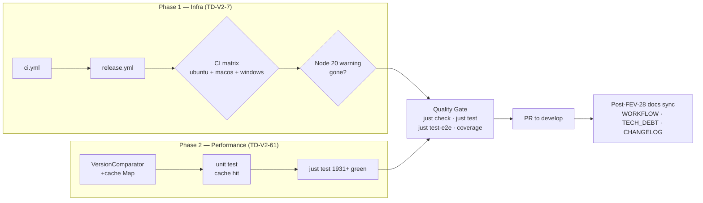

# Implementation Plan: FEV-28 — Infrastructure & Performance

**Phase:** FEV-28 (v2.1.1) — ⏳ Pendiente
**Issues/TD:** [TD-V2-7](https://github.com/Fisherk2/codice-opencode/blob/main/docs/TECH_DEBT.md), [TD-V2-61](https://github.com/Fisherk2/codice-opencode/blob/main/docs/TECH_DEBT.md)
**Diagnósticos:** [`docs/diagnosis/fix23`](../docs/diagnosis/fix23-action-sha-pins-node24.md), [`docs/diagnosis/fix22`](../docs/diagnosis/fix22-no-caching-version-comparison.md)
**Date:** 2026-08-21
**Author:** Moctezuma (Strategic Planner)
**Branch:** `fix/fev-28-infrastructure-performance` (from `develop`)
**Todo list:** [todo.md](./todo.md)
**Methodology:** Vertical slicing (1 item = 1 slice completo) · commits atómicos por fase · TDD donde aplique · checkpoint quality gates
**Wall-clock estimate:** ~2-3h (Phase 1: 1-1.5h · Phase 2: 1h)

---

## Overview

FEV-28 cierra el ciclo de **Infrastructure & Performance** antes del release v2.1.1. Resuelve los 2 items restantes del backlog v2.1.1 identificados en el deep audit (2026-08-19):

1. **TD-V2-7** — Actualizar SHA-pins de GitHub Actions (`actions/checkout`, `actions/cache`, `extractions/setup-just`, `oven-sh/setup-bun`) a las últimas majors compatibles con Node 24, eliminando los warnings de deprecación "Node.js 20 actions are deprecated" en los logs de CI/CD.
2. **TD-V2-61** — Añadir caché de objetos semver parseados dentro de `VersionComparator` para evitar re-parsear los mismos strings en comparaciones repetidas (mismo uso en tests y operaciones batch).

**Lo que FEV-28 hace:**

1. Bumpa los SHA-pins en `.github/workflows/ci.yml` y `.github/workflows/release.yml` a las últimas majors Node 24-compatible (checkout v7, cache v6, setup-just v4, oven-sh/setup-bun v2.2 ya está al día).
2. Introduce un `Map<string, SemVer>` privado dentro de `VersionComparator` que cachea el resultado de `semver.valid()` por string de versión. Sin estado global, sin nuevas dependencias, sin cambios en el port `IVersionComparator`.

**Lo que FEV-28 NO hace (out-of-scope):**

- No toca `WorkspaceVersion` (que también usa `semver.valid()` directamente) — está fuera del alcance del diagnóstico y agregar acoplamiento.
- No toca `GitHubRestClient` por la misma razón.
- No introduce un módulo de caché compartido ni WeakMap.
- No cambia los tags mutables — se mantiene SHA-pinning por ADR-019.
- No hace release v2.1.1 — eso ocurre después de merge a `develop`.

---

## Dependency Graph

```
                    ┌──────────────────────────────────────────┐
                    │  develop (clean, post-FEV-27 merged)     │
                    └─────────────┬────────────────────────────┘
                                  │
                  checkout branch fix/fev-28-infrastructure-performance
                                  │
        ┌─────────────────────────┴─────────────────────────┐
        │                                                   │
        ▼                                                   ▼
 ┌──────────────────────────────┐            ┌──────────────────────────────┐
 │ Phase 1 — TD-V2-7            │            │ Phase 2 — TD-V2-61           │
 │ Bump SHA-pins (Node 24)      │  ── indep ──▶ │ Add semver cache in          │
 │                              │            │ VersionComparator           │
 │ ci.yml + release.yml (2)     │            │ + unit test                  │
 │ Acceptance: CI 3 OS green,   │            │ Acceptance: cache hit on 2nd │
 │ no Node 20 deprecation warn  │            │ call, parsing once           │
 └──────────────┬───────────────┘            └──────────────┬───────────────┘
                │                                           │
                └─────────────┬─────────────────────────────┘
                              ▼
                   ┌──────────────────────────┐
                   │ Quality Gate Checkpoint  │
                   │ just check · just test   │
                   │ just test-e2e · coverage │
                   └──────────────┬───────────┘
                                  ▼
                   ┌──────────────────────────┐
                   │ Commit + push + PR to    │
                   │ develop → post-FEV-28    │
                   │ docs sync (CHANGELOG,    │
                   │ TECH_DEBT, WORKFLOW)     │
                   └──────────────────────────┘
```

**Why independent:** Las dos fases no comparten archivos. Se pueden implementar y commitear por separado (una fase = un commit atómico). Sin embargo, ambas se ejecutan en la misma rama para mantener una única PR pequeña y revisable.

---

## Identified SHAs (validados contra `/git/commits/` API)

| Acción | Repo | Tag | Commit SHA (validado) | Estado actual | Acción |
|--------|------|-----|----------------------|---------------|--------|
| `actions/checkout` | actions/checkout | v7.0.1 | `3d3c42e5aac5ba805825da76410c181273ba90b1` | `11d5960a326750d5838078e36cf38b85af677262` (v4) | **bump** |
| `actions/cache` | actions/cache | v6.1.0 | `55cc8345863c7cc4c66a329aec7e433d2d1c52a9` | `0057852bfaa89a56745cba8c7296529d2fc39830` (v4) | **bump** |
| `extractions/setup-just` | extractions/setup-just | v4 | `53165ef7e734c5c07cb06b3c8e7b647c5aa16db3` | `dd310ad5a97d8e7b41793f8ef055398d51ad4de6` (v3) | **bump** |
| `oven-sh/setup-bun` | oven-sh/setup-bun | v2.2.0 | `0c5077e51419868618aeaa5fe8019c62421857d6` | `0c5077e51419868618aeaa5fe8019c62421857d6` (v2.2.0) | **no change** (ya actualizado) |

> **Validación:** Cada SHA fue confirmado vía `GET /repos/{owner}/{repo}/git/commits/{sha}` retornando HTTP 200 (commit SHA real, no SHA de annotated tag). Fuente: GitHub REST API, 2026-08-21.

---

## Phase 1 — TD-V2-7: SHA-pins → Node 24-compatible

### Task 1.1: Bump SHA-pins in ci.yml and release.yml

**Description:** Reemplazar los 3 SHA-pins obsoletos (checkout v4 → v7.0.1, cache v4 → v6.1.0, setup-just v3 → v4) en ambos workflows. `oven-sh/setup-bun` ya está al día (v2.2.0) y no requiere cambio. Después del bump, los warnings "Node.js 20 actions are deprecated" deben desaparecer en los logs de CI/CD.

**Acceptance criteria:**
- [ ] `ci.yml` línea 38: `actions/checkout@3d3c42e5aac5ba805825da76410c181273ba90b1`
- [ ] `ci.yml` línea 49: `actions/cache@55cc8345863c7cc4c66a329aec7e433d2d1c52a9`
- [ ] `ci.yml` línea 46: `extractions/setup-just@53165ef7e734c5c07cb06b3c8e7b647c5aa16db3`
- [ ] `release.yml` línea 32: `actions/checkout@3d3c42e5aac5ba805825da76410c181273ba90b1`
- [ ] `oven-sh/setup-bun` se mantiene sin cambios (ya está en v2.2.0)
- [ ] Workflow syntax válido (GitHub Actions parser no rechaza)

**Verification:**
- [ ] Push a la rama activa dispara CI; el job `quality` corre en ubuntu/macos/windows sin warnings de Node 20.
- [ ] `grep -n "Node.js 20 actions" <(gh run view --log)` retorna 0 líneas en el último run.
- [ ] `just check` y `just test` siguen verdes localmente (workflows no afectan código).

**Dependencies:** None.

**Files likely touched:**
- `.github/workflows/ci.yml` (3 líneas modificadas)
- `.github/workflows/release.yml` (1 línea modificada)

**Estimated scope:** XS (1 commit, 4 líneas modificadas, sin código).

**Commit message (Conventional Commits):**
```
chore(ci): bump GitHub Actions SHA-pins to Node 24-compatible majors

- actions/checkout v4 → v7.0.1 (SHA 3d3c42e5...)
- actions/cache v4 → v6.1.0 (SHA 55cc8345863c...)
- extractions/setup-just v3 → v4 (SHA 53165ef7e734...)
- oven-sh/setup-bun ya está en v2.2.0 (no change)

Resuelve warnings "Node.js 20 actions are deprecated" en CI logs.
Verificado vía curl /repos/{owner}/{repo}/git/commits/{sha} → HTTP 200.

Refs: TD-V2-7, fix23
Co-Authored-By: Moctezuma <dev@fisherk2.com>
```

---

## Phase 2 — TD-V2-61: VersionComparator semi-cache

### Task 2.1: Add parsed-semver cache + unit test (TDD)

**Description:** Añadir un `Map<string, SemVer>` privado dentro de `VersionComparator` que cachea el resultado de `semver.valid(version)` por string de versión. Esto evita re-parsear los mismos strings en comparaciones repetidas (escenario común en tests y en operaciones batch que comparan versiones múltiples veces).

**Decisión de diseño:**
- **Alcance:** Cache solo dentro de `VersionComparator`. `WorkspaceVersion` y `GitHubRestClient` también usan `semver.valid()` pero están fuera del alcance (acoplamiento no justificado).
- **Invalidación:** No es necesaria — el cache crece con la cantidad de versiones distintas vistas, acotado al cardinal del input (no hay leak unbounded porque los strings son inmutables y el cache muere con la instancia).
- **No cambia el port `IVersionComparator`:** La interfaz pública `compare()` mantiene el mismo contrato. El cache es detalle de implementación.
- **No afecta cobertura:** Tests existentes siguen pasando. Test nuevo cubre el comportamiento.

**Acceptance criteria:**
- [ ] `VersionComparator` tiene un campo privado `readonly cache: Map<string, SemVer>` inicializado en el constructor.
- [ ] `compare()` consulta el cache antes de llamar a `semver.valid()`; si está, reutiliza; si no, parsea y cachea.
- [ ] Test nuevo: `tests/unit/domain/version-comparator.test.ts` — describe `VersionComparator cache` valida que 2 llamadas con el mismo string no invocan `semver.valid()` dos veces (verificable mockeando o con spy). Alternativa: assert que el cache se llena con la entrada esperada.
- [ ] `validateVersion()` (función pura exportada) NO usa cache — se mantiene determinista y side-effect-free como función pura del módulo. (Solo la clase lo usa.)
- [ ] Tests existentes (147 líneas en `version-comparator.test.ts`) siguen pasando.

**Verification:**
- [ ] `just check` 0 errores.
- [ ] `just test` 1931+ tests pasando (1931 base + al menos 2 nuevos del cache).
- [ ] Coverage de `VersionComparator.ts` ≥ 95% (ya lo es; nuevo código cubierto).
- [ ] `just test-coverage` overall ≥ 95%.

**Dependencies:** None (independiente de Phase 1).

**Files likely touched:**
- `src/domain/services/VersionComparator.ts` (modificar clase, ~10 líneas añadidas)
- `tests/unit/domain/version-comparator.test.ts` (nuevo `describe` block, ~25 líneas)

**Estimated scope:** S (1 commit, 2 archivos).

**Commit message (Conventional Commits):**
```
perf(domain): cache parsed semver objects in VersionComparator

VersionComparator re-parseaba los mismos strings en cada llamada
a compare()/validateVersions(). Añade Map<string, SemVer> privado
a la clase para memoizar el resultado de semver.valid().

- Sin cambios en port IVersionComparator (detalle de implementación)
- validateVersion() (función pura) no usa cache — side-effect-free
- Sin tocar WorkspaceVersion ni GitHubRestClient (fuera de alcance)

Test nuevo: describe block valida cache hit en 2da llamada idéntica.
Refs: TD-V2-61, fix22
Co-Authored-By: Moctezuma <dev@fisherk2.com>
```

---

## Quality Gate Checkpoint (post Phase 2)

- [ ] `just check` — 0 errores (biome ci + tsc --noEmit)
- [ ] `just test` — 1931+ tests, 0 fail
- [ ] `just test-e2e` — 31/31 escenarios (Linux)
- [ ] `just test-packaging` — 5/5 escenarios
- [ ] `just test-coverage` — ≥95% lines, ≥95% funcs en production `src/`
- [ ] CI matrix (ubuntu + macos + windows) sin warnings de Node 20 deprecation
- [ ] `just lint` y `just format` limpios
- [ ] Sin tipos `any` introducidos en código de producción
- [ ] Comentarios explican el *porqué* (no el *qué*)

---

## Post-FEV-28 (no parte del plan, solo contexto)

Una vez ambas fases mergeadas a `develop`:

1. `docs/WORKFLOW.md` → mover FEV-28 de "⏳ Pendiente" a "✅ Completo" con fecha.
2. `docs/TECH_DEBT.md` → marcar TD-V2-7 y TD-V2-61 como resueltos en sección v2.1.1.
3. `CHANGELOG.md` → entrada v2.1.1 con los 2 items de FEV-28.
4. PR `develop` → `main` → tag → `bun publish` con dist-tag `beta`.

Esos pasos los cubre el release manager con `/plan` + `/ship` posterior, NO FEV-28.

---

## Risks and Mitigations

| Risk | Impact | Likelihood | Mitigation |
|------|--------|------------|------------|
| GitHub Action v7/v6 introduce breaking change no documentado | Medium | Low | Phase 1 solo toca ci.yml/release.yml, reversible con un revert. CI matrix cubre los 3 OS antes de merge. |
| Cache rompe determinismo en tests (orden de inserción, map iteration) | Low | Low | Cache es detalle privado; compare() retorna el mismo valor. Tests assertan comportamiento, no orden interno. |
| Múltiples instancias de `VersionComparator` crean caches duplicados | Low | High | Aceptado: el proyecto instancia 1 sola vez por CLI run (vía DI container). No hay caso de uso de instancias múltiples. Si surge, refactorizar a WeakMap (futuro). |
| `oven-sh/setup-bun` SHA-pinning podría no estar al día | Low | Low | Verificado vía API: v2.2.0 ya coincide con el SHA actual. No requiere cambio. |

---

## Open Questions

Ninguna pendiente — todas las decisiones fueron confirmadas vía `question` tool:
- Alcance del caché: solo `VersionComparator` (no módulo compartido).
- Estrategia SHA: investigar y actualizar a últimas Node 24-compatible majors.

---

## Architecture Diagram (Mermaid)


```mermaid
graph LR
    subgraph "Phase 1 — Infra (TD-V2-7)"
        A1[ci.yml] --> A2[release.yml]
        A2 --> A3{CI matrix<br/>ubuntu + macos + windows}
        A3 --> A4{Node 20 warning<br/>gone?}
    end

    subgraph "Phase 2 — Performance (TD-V2-61)"
        B1[VersionComparator<br/>+cache Map] --> B2[unit test<br/>cache hit]
        B2 --> B3[just test 1931+ green]
    end

    A4 --> C[Quality Gate<br/>just check · just test<br/>just test-e2e · coverage]
    B3 --> C
    C --> D[PR to develop]
    D --> E[Post-FEV-28 docs sync<br/>WORKFLOW · TECH_DEBT · CHANGELOG]
```

---

*Plan created by Moctezuma. Update when phases complete or scope changes.*
*Last revised: 2026-08-21*
