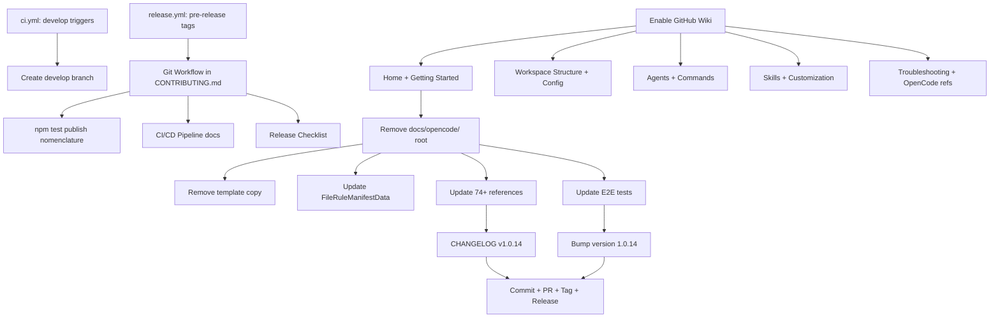

# Plan: Fase FEV-5 — CI/CD Workflow + GitHub Wiki (v1.0.14)

**Fecha:** 2026-07-09 | **Autor:** Moctezuma (Strategic Planner) | **Estado:** 🟡 Plan Aprobado
**Versión objetivo:** v1.0.14
**Issues principales:** #23 (CI/CD Workflow) + #25 (GitHub Wiki)
**Branch:** `feat/ci-cd-wiki` (basada en `main`, con 4 commits previos de docs/diagnosis)

---

## Overview

FEV-5 resuelve dos issues complementarios que afectan la sostenibilidad del proyecto:

1. **Issue #23** — Estandarizar el flujo CI/CD con un proceso de 3 etapas (develop → test publish → main) que requiere tanto infraestructura (workflows) como documentación (CONTRIBUTING.md).
2. **Issue #25** — Migrar la documentación del workspace a GitHub Wiki (customization guide basada en `template/obligatorio/`), eliminar `docs/opencode/` (24 archivos en 2 ubicaciones), y actualizar 74+ referencias internas.

**Objetivo:** Publicar v1.0.14 con CI/CD estandarizado, Wiki poblada, y `docs/opencode/` completamente eliminado sin regresión.

---

## Architecture Decisions (ADR)

| Decisión | Rationale |
|----------|-----------|
| **ADR-FEV5-1**: `release.yml` usa Strategy implícita en YAML para `npm dist-tag` | El tag determina si se publica como `latest`, `beta`, o `rc` con `prerelease: true` en GitHub. Validación regex pre-publish evita errores. |
| **ADR-FEV5-2**: Wiki es customization guide, no copia de OpenCode docs | Cada página se basa en archivos reales de `template/obligatorio/`. Enlaza a `opencode.ai/docs` para referencia oficial, nunca duplica. |
| **ADR-FEV5-3**: Wiki content se almacena en `docs/wiki-source/` del repo principal | Los 9 archivos `.md` pasan por PR/review como cualquier cambio. Tras merge, se sincronizan al wiki repo. Source of truth en el repo principal. |
| **ADR-FEV5-4**: Rama `develop` se crea desde `main` antes de modificar `ci.yml` | GitHub Actions solo triggerea en branches existentes. T3 debe ejecutarse antes o inmediatamente después de T1. |
| **ADR-FEV5-5**: `docs/opencode/` se elimina en 4 commits granulares (root, template, manifest, refs) | Cada commit es reversible individualmente. Verificación post-cada paso. |
| **ADR-FEV5-6**: Tag `v1.0.14-beta.1` se usa para test real del release pipeline | Valida `--tag beta`, `prerelease: true`, y `make_latest: false` antes del release de producción. |
| **ADR-FEV5-7**: Eliminación de `docs/opencode/` se hace DESPUÉS de Wiki poblada | Evita periodo sin documentación. La Wiki es el replacement; debe existir antes de eliminar el original. |

---

## Dependency Graph


```mermaid
graph TD
    %% Phase 1: CI/CD Infrastructure
    FEV5-T1[ci.yml: develop triggers] --> FEV5-T3[Create develop branch]
    FEV5-T2[release.yml: pre-release tags] --> FEV5-T4[Git Workflow in CONTRIBUTING.md]

    %% Phase 2: CI/CD Documentation
    FEV5-T4 --> FEV5-T5[npm test publish nomenclature]
    FEV5-T4 --> FEV5-T6[CI/CD Pipeline docs]
    FEV5-T4 --> FEV5-T7[Release Checklist]

    %% Phase 3: Wiki Content (parallel with Phase 1+2)
    FEV5-T8[Enable GitHub Wiki] --> FEV5-T9[Home + Getting Started]
    FEV5-T8 --> FEV5-T10[Workspace Structure + Config]
    FEV5-T8 --> FEV5-T11[Agents + Commands]
    FEV5-T8 --> FEV5-T12[Skills + Customization]
    FEV5-T8 --> FEV5-T13[Troubleshooting + OpenCode refs]

    %% Phase 4: docs/opencode/ Removal (depends on Phase 3)
    FEV5-T9 --> FEV5-T14[Remove docs/opencode/ root]
    FEV5-T14 --> FEV5-T15[Remove template copy]
    FEV5-T14 --> FEV5-T16[Update FileRuleManifestData]
    FEV5-T14 --> FEV5-T17[Update 74+ references]
    FEV5-T14 --> FEV5-T18[Update E2E tests]

    %% Phase 5: Release
    FEV5-T17 --> FEV5-T19[CHANGELOG v1.0.14]
    FEV5-T18 --> FEV5-T20[Bump version 1.0.14]
    FEV5-T19 --> FEV5-T21[Commit + PR + Tag + Release]
    FEV5-T20 --> FEV5-T21
```

**Critical path:** T1 → T4 → T17 → T19 → T21 (≈ 4h)
**Parallelizable:** Phase 1+2 (T1-T7) puede ejecutarse en paralelo con Phase 3 (T8-T13) → 4-5h ahorrados.

---

## Task Breakdown

### Phase 1: CI/CD Infrastructure (Issue #23 Track A)

#### Task FEV5-T1: Modify `ci.yml` — Add `develop` branch support

**Descripción:** Añadir `develop` a los triggers de `ci.yml` (push y pull_request) para que el CI corra en PRs contra la rama de integración.

**Criterios de Aceptación:**
- [ ] `on.push.branches` incluye `main` Y `develop`
- [ ] `on.pull_request.branches` incluye `main` Y `develop`
- [ ] Tags `v*` siguen triggereando
- [ ] Comentario explica la estrategia de 2 branches

**Verificación:**
- [ ] `just check` — 0 errores
- [ ] Push de un commit a `develop` triggerea CI
- [ ] PR contra `develop` triggerea CI

**Dependencias:** Ninguna.
**Archivos:**
- `.github/workflows/ci.yml` (modificar líneas 3-8)

**Scope:** S (15min).

---

#### Task FEV5-T2: Modify `release.yml` — Pre-release tag support

**Descripción:** Detectar pre-release tags (`vX.Y.Z-beta.N` o `vX.Y.Z-rc.N`) y publicar con `npm publish --tag beta|rc` + `prerelease: true` en GitHub. Tags de producción (`vX.Y.Z`) publican como `latest` con Release completo.

**Criterios de Aceptación:**
- [ ] Step `Publish to npm` detecta el sufijo del tag y selecciona el `--tag` correcto
- [ ] Step `Create Release` configura `prerelease: true` para beta/rc
- [ ] `make_latest: true` solo para tags sin sufijo
- [ ] Validación regex impide publicar tags con formato inválido
- [ ] Logging explícito de qué tipo de release se está creando

**Verificación:**
- [ ] `just check` — 0 errores
- [ ] Test con tag real `v1.0.14-beta.1` (push + verify en npm y GitHub)
- [ ] Cleanup: eliminar tag de prueba después de validar

**Dependencias:** Ninguna.
**Archivos:**
- `.github/workflows/release.yml` (modificar pasos 126-154)

**Scope:** S (30min).

---

#### Task FEV5-T3: Create `develop` branch in repository

**Descripción:** Crear la rama `develop` desde `main` para que los triggers de `ci.yml` la reconozcan. GitHub Actions solo triggerea en branches existentes.

**Criterios de Aceptación:**
- [ ] Rama `develop` existe localmente
- [ ] Rama `develop` pusheada a `origin`
- [ ] Apunta al mismo commit que `main` (no diverge)
- [ ] Branch protection configurada (opcional, según prefieras)

**Verificación:**
- [ ] `git branch -r` muestra `origin/develop`
- [ ] `git log origin/develop..origin/main` está vacío

**Dependencias:** FEV5-T1 (puede hacerse antes o junto con T1).
**Archivos:** (ninguno — solo git operations).

**Scope:** XS (5min).

---

### Phase 2: CI/CD Documentation (Issue #23 Track B)

#### Task FEV5-T4: Document Git Workflow in CONTRIBUTING.md

**Descripción:** Añadir sección "Git Workflow" a `CONTRIBUTING.md` con la estrategia de branches, el proceso de 3 etapas, y convenciones de naming.

**Criterios de Aceptación:**
- [ ] Sección "Git Workflow" añadida a `CONTRIBUTING.md`
- [ ] Documenta: `main` (producción), `develop` (integración), `feat/*` y `fix/*` (PR a develop), `release/*` (PR a develop → main)
- [ ] Proceso de 3 etapas explícito: feature → develop → release (test) → main (prod)
- [ ] Tabla de convenciones de naming (feat/, fix/, release/, hotfix/)
- [ ] Sección "PR Requirements" con checklist
- [ ] Link a Issue #23 y a `docs/diagnosis/fix01-cicd-workflow-standardization.md`

**Verificación:**
- [ ] `just check` — 0 errores
- [ ] Manual: leer la sección y verificar que es autoexplicativa

**Dependencias:** FEV5-T1, FEV5-T2 (el workflow debe estar implementado para documentarlo).
**Archivos:**
- `CONTRIBUTING.md` (modificar)

**Scope:** M (45min).

---

#### Task FEV5-T5: Document npm test publish nomenclature in CONTRIBUTING.md

**Descripción:** Documentar la convención de versiones para test publishes y cómo verificarlos.

**Criterios de Aceptación:**
- [ ] Tabla de nomenclatura: `vX.Y.Z-beta.N`, `vX.Y.Z-rc.N`, `vX.Y.Z`
- [ ] Comandos para crear tag de prueba:
  ```bash
  git tag v1.0.14-beta.1
  git push origin v1.0.14-beta.1
  ```
- [ ] Comandos para verificar el paquete:
  ```bash
  npm view @fisherk2-dev/codice@beta
  bunx @fisherk2-dev/codice@beta --version
  ```
- [ ] Advertencia: pre-release tags pueden sobrescribirse; `latest` no
- [ ] Sección "How to consume a test package"

**Verificación:**
- [ ] `just check` — 0 errores
- [ ] Manual: la tabla es correcta y los comandos son copy-paste ready

**Dependencias:** FEV5-T4.
**Archivos:**
- `CONTRIBUTING.md` (añadir sección)

**Scope:** S (20min).

---

#### Task FEV5-T6: Document CI/CD Pipeline + troubleshooting in CONTRIBUTING.md

**Descripción:** Documentar cada workflow (ci.yml, release.yml), sus triggers, y una sección de troubleshooting para problemas comunes.

**Criterios de Aceptación:**
- [ ] Sección "CI/CD Pipeline" con subsecciones:
  - `ci.yml` — triggers, jobs (quality, build, e2e, smoke), artifacts
  - `release.yml` — triggers, jobs (build, release), artifacts, secrets requeridos
- [ ] Tabla de triggers (qué evento ejecuta qué workflow)
- [ ] Sección "Troubleshooting CI/CD" con casos comunes:
  - CI falla solo en una plataforma
  - npm publish falla con "cannot publish over previously published version"
  - Release workflow no se ejecuta después de push de tag
  - Build de Windows falla por paths con backslash
- [ ] Link a logs y a `actions/setup-bun` docs si aplica

**Verificación:**
- [ ] `just check` — 0 errores
- [ ] Manual: la sección troubleshooting cubre ≥4 casos comunes

**Dependencias:** FEV5-T4.
**Archivos:**
- `CONTRIBUTING.md` (añadir sección)

**Scope:** M (30min).

---

#### Task FEV5-T7: Add Release Checklist template in CONTRIBUTING.md

**Descripción:** Crear un checklist pre-release, release, y post-release que los mantenedores deben seguir.

**Criterios de Aceptación:**
- [ ] Sección "Release Checklist" con 3 subsecciones:
  - **Pre-release:** tests pass, coverage maintained, CHANGELOG updated, version bumped, branch protection verified
  - **Release:** create tag, push tag, verify CI, verify npm package, verify GitHub Release
  - **Post-release:** verify on npm, smoke test binary, update documentation if needed, sync `develop` with `main`
- [ ] Checklist con checkboxes Markdown (`- [ ]`)
- [ ] Ejemplo concreto: cómo hacer un release `v1.0.14` con tag `v1.0.14-beta.1` previo

**Verificación:**
- [ ] `just check` — 0 errores
- [ ] Manual: el checklist es ejecutable paso a paso

**Dependencias:** FEV5-T4.
**Archivos:**
- `CONTRIBUTING.md` (añadir sección)

**Scope:** S (20min).

---

### Phase 3: Wiki Content Creation (Issue #25 Track C — content)

#### Task FEV5-T8: Clone wiki repo + create `docs/wiki-source/` directory

**Descripción:** Verificar que la Wiki está habilitada (ya lo está), clonar el wiki repo para conocer su estructura, y crear el directorio `docs/wiki-source/` en el repo principal como source of truth para las 9 páginas.

**Criterios de Aceptación:**
- [ ] Wiki de GitHub habilitada y accesible en `https://github.com/fisherk2/codice-opencode/wiki`
- [ ] Wiki repo clonado localmente en `/tmp/codice-opencode.wiki` (verificar URL)
- [ ] Directorio `docs/wiki-source/` creado en el repo principal
- [ ] `docs/wiki-source/README.md` con instrucciones de sincronización:
  ```bash
  # Sync wiki source to wiki repo
  git clone https://github.com/fisherk2/codice-opencode.wiki.git /tmp/wiki
  cp docs/wiki-source/*.md /tmp/wiki/
  cd /tmp/wiki && git add . && git commit -m "Sync wiki" && git push
  rm -rf /tmp/wiki
  ```

**Verificación:**
- [ ] `ls docs/wiki-source/README.md` existe
- [ ] `git clone https://github.com/fisherk2/codice-opencode.wiki.git /tmp/test-wiki` funciona (luego borrar)
- [ ] Wiki visible en GitHub repo sidebar

**Dependencias:** Ninguna.
**Archivos:**
- `docs/wiki-source/` (nuevo directorio)
- `docs/wiki-source/README.md` (instrucciones de sync)

**Scope:** S (15min).

---

#### Task FEV5-T9: Create Home + Getting Started Wiki pages

**Descripción:** Escribir las 2 primeras páginas orientadas a nuevos usuarios en `docs/wiki-source/`.

**Criterios de Aceptación:**
- [ ] `docs/wiki-source/Home.md`:
  - Qué es el workspace (1 párrafo)
  - Qué problema resuelve
  - Quick links a las otras 8 páginas
  - Link a [opencode.ai/docs](https://opencode.ai/docs/)
- [ ] `docs/wiki-source/Getting-Started.md`:
  - Prerequisites (link a OpenCode installation)
  - Cómo instalar vía `bunx @fisherk2-dev/codice`
  - Qué pasa después de la instalación (file tree overview)
  - Primeros pasos: verificar comandos, ejecutar `/spec`
  - Link a [opencode.ai/docs/installation](https://opencode.ai/docs/installation)
- [ ] Ambos archivos siguen el principio: **template-driven, no copy**

**Verificación:**
- [ ] Manual: los archivos se leen fluidamente
- [ ] No hay duplicación de OpenCode docs (solo enlaces)

**Dependencias:** FEV5-T8.
**Archivos:**
- `docs/wiki-source/Home.md` (nuevo)
- `docs/wiki-source/Getting-Started.md` (nuevo)

**Scope:** M (45min).

---

#### Task FEV5-T10: Create Workspace Structure + Configuration Wiki pages

**Descripción:** Escribir las páginas sobre la estructura física del workspace y cómo configurar `opencode.json` en `docs/wiki-source/`.

**Criterios de Aceptación:**
- [ ] `docs/wiki-source/Workspace-Structure.md`:
  - Basada en el árbol real instalado por Códice
  - Cada directorio explicado: propósito, archivos, opciones de customización
  - Explica los **patrones** (por qué root files vs. agents/ vs. commands/ vs. skills/)
  - Link a [opencode.ai/docs/workspace](https://opencode.ai/docs/workspace)
- [ ] `docs/wiki-source/Configuration.md`:
  - Basada en `template/obligatorio/opencode.json`
  - Explica cada sección: `model`, `small_model`, `compaction`, `provider`, `permissions`
  - Customizaciones comunes: cambiar modelos, ajustar token budgets, añadir providers
  - Ejemplo: switching de NVIDIA a Anthropic Claude
  - Link a [opencode.ai/docs/configuration](https://opencode.ai/docs/configuration)

**Verificación:**
- [ ] Manual: la estructura explicada coincide con el árbol real
- [ ] El ejemplo de configuración es ejecutable

**Dependencias:** FEV5-T8.
**Archivos:**
- `docs/wiki-source/Workspace-Structure.md` (nuevo)
- `docs/wiki-source/Configuration.md` (nuevo)

**Scope:** M (45min).

---

#### Task FEV5-T11: Create Agents + Commands Wiki pages (with end-user guides)

**Descripción:** Escribir las páginas sobre agents y commands, **incluyendo guías paso a paso para usuarios finales** sobre cómo añadir nuevos. Archivos en `docs/wiki-source/`.

**Criterios de Aceptación:**
- [ ] `docs/wiki-source/Agents.md`:
  - Basada en `template/obligatorio/agents/` (103 files: 6 primary + 97 subagents)
  - Explica arquitectura de 2 niveles: Primary vs. Subagents
  - Muestra el patrón de un agent file (frontmatter, composition block)
  - **Guía paso a paso: Cómo añadir un nuevo agent** (end-user focused):
    1. Elegir tipo: subagent (domain expert) o primary (entry point)
    2. Crear el archivo en `agents/` con frontmatter apropiado
    3. Añadir `## Composition` block
    4. Para subagents: registrar en `VALID_SUBAGENTS`
    5. Para primary: añadir SDD plugin hooks
    6. Restart OpenCode session
  - **Ejemplo funcional:** crear un subagent custom paso a paso
  - Link a [opencode.ai/docs/agents](https://opencode.ai/docs/agents)
- [ ] `docs/wiki-source/Commands.md`:
  - Basada en `template/obligatorio/commands/` (12 files)
  - Explica el ciclo SDD y cómo cada comando mapea a una fase
  - Muestra el patrón de frontmatter (`description` + `agent`)
  - **Guía paso a paso: Cómo añadir un nuevo command** (end-user focused):
    1. Crear el archivo en `commands/` con YAML frontmatter
    2. Escribir los pasos numerados
    3. Registrar en `COMMAND_AGENT_MAP`
    4. Si introduce nueva fase, añadir sugerencia en el plugin
    5. Restart OpenCode session
  - **Ejemplo funcional:** crear un command custom paso a paso
  - Link a [opencode.ai/docs/commands](https://opencode.ai/docs/commands)

**Verificación:**
- [ ] Manual: la guía de "añadir agent" es ejecutable por un usuario no técnico
- [ ] El ejemplo se compila y funciona

**Dependencias:** FEV5-T8.
**Archivos:**
- `docs/wiki-source/Agents.md` (nuevo)
- `docs/wiki-source/Commands.md` (nuevo)

**Scope:** L (1h).

---

#### Task FEV5-T12: Create Skills + Customization Guide Wiki pages

**Descripción:** Escribir las páginas sobre skills y la guía de customización con recetas prácticas en `docs/wiki-source/`.

**Criterios de Aceptación:**
- [ ] `docs/wiki-source/Skills.md`:
  - Basada en `template/obligatorio/skills/` (46 directorios)
  - Explica el patrón de skill (SKILL.md con frontmatter + pasos numerados)
  - **Guía paso a paso: Cómo añadir un nuevo skill** (end-user focused):
    1. Crear `skills/<skill-name>/SKILL.md`
    2. Añadir YAML frontmatter con `name` y `description`
    3. Escribir pasos numerados (specific, verifiable, battle-tested, minimal)
    4. Si tiene `references/`, migrar al root `references/`
    5. Actualizar `skills/using-agent-skills/SKILL.md`
    6. Restart OpenCode session
  - **Ejemplo funcional:** crear un skill custom
  - Link a [opencode.ai/docs/skills](https://opencode.ai/docs/skills)
- [ ] `docs/wiki-source/Customization-Guide.md`:
  - Recetas prácticas para modificaciones comunes:
    - "Quiero usar un modelo AI diferente" → modificar `opencode.json`
    - "No necesito el skill architecture-diagrams" → eliminar de `skills/`
    - "Quiero añadir un command custom" → crear en `commands/`
    - "Quiero renombrar mi proyecto" → actualizar `README.md`, `package.json`
    - "Quiero cambiar permisos de agents" → modificar `opencode.json`
    - "Quiero añadir un nuevo provider" → añadir config en `opencode.json`
  - Cada receta: qué modificar, dónde está el archivo, qué hace el cambio

**Verificación:**
- [ ] Manual: la guía de skills es ejecutable
- [ ] Las recetas de customización son copy-paste listas

**Dependencias:** FEV5-T8.
**Archivos:**
- `docs/wiki-source/Skills.md` (nuevo)
- `docs/wiki-source/Customization-Guide.md` (nuevo)

**Scope:** L (1h).

---

#### Task FEV5-T13: Create Troubleshooting Wiki page + verify all 9 pages

**Descripción:** Escribir la página final de troubleshooting en `docs/wiki-source/` y verificar que todas las páginas enlazan correctamente a OpenCode docs.

**Criterios de Aceptación:**
- [ ] `docs/wiki-source/Troubleshooting.md`:
  - **5+ problemas comunes** con soluciones accionables:
    1. "Template file not found" → causas y soluciones (bunx, symlinks, gitignore)
    2. "GitHub version check falla con 404" → verificar repo name, network
    3. "Permiso denegado al escribir archivos" → permisos, sudo, bind mounts
    4. "Clean Install en directorio no vacío" → confirmación necesaria
    5. "Update Workspace no actualiza archivos" → standard vs. mandatory rules
  - Cada issue: síntoma, causa, solución (en ese orden)
  - Link a [opencode.ai/docs/faq](https://opencode.ai/docs/faq)
  - Link a [GitHub Issues](https://github.com/fisherk2/codice-opencode/issues)
- [ ] Verificación cruzada: cada una de las 8 páginas anteriores tiene al menos 1 link a `opencode.ai/docs/`
- [ ] Página `_Sidebar.md` (opcional): navegación lateral de la Wiki
- [ ] Verificar las 9 páginas en `docs/wiki-source/`:
  - `Home.md`, `Getting-Started.md`, `Workspace-Structure.md`, `Configuration.md`
  - `Agents.md`, `Commands.md`, `Skills.md`, `Customization-Guide.md`
  - `Troubleshooting.md`

**Verificación:**
- [ ] `rg "opencode.ai/docs" docs/wiki-source/` muestra ≥8 matches
- [ ] `rg "TODO|FIXME" docs/wiki-source/` → 0 matches
- [ ] Manual: la página de troubleshooting cubre ≥5 problemas comunes
- [ ] 9 archivos `.md` existen en `docs/wiki-source/`

**Dependencias:** FEV5-T9, T10, T11, T12.
**Archivos:**
- `docs/wiki-source/Troubleshooting.md` (nuevo)
- `docs/wiki-source/` (verify todas)

**Scope:** M (45min).

---

### Phase 4: docs/opencode/ Elimination (Issue #25 Track C — removal)

#### Task FEV5-T14: Remove `docs/opencode/` from project root

**Descripción:** Eliminar el directorio `docs/opencode/` (12 archivos) del proyecto root.

**Criterios de Aceptación:**
- [ ] `docs/opencode/` eliminado completamente
- [ ] `git status` muestra 12 archivos eliminados
- [ ] Commit dedicado: `chore(docs): remove docs/opencode/ from project root`
- [ ] Backup: copia de seguridad en `~/.cache/codice-backup/docs-opencode-root-$(date)/` antes de eliminar

**Verificación:**
- [ ] `ls docs/opencode/ 2>&1` → "No such file or directory"
- [ ] `git log --diff-filter=D --name-only` muestra los 12 archivos

**Dependencias:** FEV5-T9, FEV5-T10, FEV5-T11, FEV5-T12, FEV5-T13 (Wiki debe existir antes).
**Archivos:**
- `docs/opencode/` (eliminar)

**Scope:** XS (5min).

---

#### Task FEV5-T15: Remove `template/opcional/docs/opencode/`

**Descripción:** Eliminar el directorio `template/opcional/docs/opencode/` (12 archivos) del template.

**Criterios de Aceptación:**
- [ ] `template/opcional/docs/opencode/` eliminado completamente
- [ ] `git status` muestra 12 archivos eliminados
- [ ] Commit dedicado: `chore(template): remove docs/opencode/ from template opcional`
- [ ] Backup antes de eliminar

**Verificación:**
- [ ] `ls template/opcional/docs/opencode/ 2>&1` → "No such file or directory"
- [ ] `git log --diff-filter=D --name-only` muestra los 12 archivos

**Dependencias:** FEV5-T14.
**Archivos:**
- `template/opcional/docs/opencode/` (eliminar)

**Scope:** XS (5min).

---

#### Task FEV5-T16: Remove `docs/opencode` entry from `FileRuleManifestData.ts`

**Descripción:** Eliminar la entrada del manifest que clasificaba `docs/opencode` como `opcional`.

**Criterios de Aceptación:**
- [ ] Líneas 167-171 de `src/domain/entities/FileRuleManifestData.ts` eliminadas
- [ ] `bun test` sigue pasando
- [ ] `just check` sin errores
- [ ] Commit dedicado: `chore(manifest): remove docs/opencode from FileRuleManifestData`

**Verificación:**
- [ ] `rg "docs/opencode" src/` → 0 matches
- [ ] `bun test` — sin regresión (481/0)

**Dependencias:** FEV5-T14, FEV5-T15.
**Archivos:**
- `src/domain/entities/FileRuleManifestData.ts` (modificar)

**Scope:** XS (5min).

---

#### Task FEV5-T17: Update 74+ internal references

**Descripción:** Actualizar todas las referencias a `docs/opencode/` en CONTRIBUTING.md, README.md, comandos, specs, y código fuente.

**Criterios de Aceptación:**
- [ ] `rg "docs/opencode" CONTRIBUTING.md README.md specs/ docs/ template/obligatorio/commands/ template/obligatorio/agents/ src/ tests/` → 0 matches
- [ ] Referencias reemplazadas con:
  - Links a Wiki: `https://github.com/fisherk2/codice-opencode/wiki/[Page]`
  - Links a OpenCode docs: `https://opencode.ai/docs/`
- [ ] Commit dedicado: `docs(refs): replace docs/opencode/ references with Wiki links`
- [ ] Reporte de cambios: `git diff --stat HEAD~1` muestra archivos modificados

**Verificación:**
- [ ] `rg "docs/opencode" .` (excluyendo `.git/`, `dist/`, `docs/wiki-source/`, `docs/diagnosis/`) → 0 matches
- [ ] `rg "opencode.ai/docs" .` → ≥10 matches (cross-references añadidas)

**Dependencias:** FEV5-T14, FEV5-T15, FEV5-T16.
**Archivos:**
- `CONTRIBUTING.md` (modificar)
- `README.md` (modificar)
- `specs/spec-file-rules.md` (modificar)
- `template/obligatorio/commands/*.md` (modificar donde aplique)
- `src/**/*.ts` (modificar comentarios donde aplique)

**Scope:** M (45min).

---

#### Task FEV5-T18: Update E2E tests to reflect docs/opencode/ removal

**Descripción:** Los E2E tests verifican que el template se instala correctamente. Tras eliminar `docs/opencode/`, los tests deben actualizarse para no esperar esos archivos.

**Criterios de Aceptación:**
- [ ] `tests/e2e/*.sh` actualizado para no verificar existencia de `docs/opencode/` en el destino
- [ ] `tests/fixtures/` limpiado de fixtures que dependan de `docs/opencode/`
- [ ] `just test-e2e` sigue pasando con 15/15 escenarios
- [ ] Commit dedicado: `test(e2e): remove docs/opencode/ assertions`

**Verificación:**
- [ ] `rg "docs/opencode" tests/` → 0 matches
- [ ] `just test-e2e` — 15/15 pasando
- [ ] `bun test` — sin regresión (481/0)

**Dependencias:** FEV5-T14, FEV5-T15, FEV5-T16.
**Archivos:**
- `tests/e2e/*.sh` (modificar donde aplique)
- `tests/fixtures/` (modificar donde aplique)

**Scope:** M (30min).

---

### Phase 5: Release (v1.0.14)

#### Task FEV5-T19: Update CHANGELOG.md with v1.0.14 section

**Descripción:** Añadir sección `[1.0.14]` al CHANGELOG con Added/Changed/Fixed/Removed.

**Criterios de Aceptación:**
- [ ] Sección `## [1.0.14] - 2026-07-XX` añadida
- [ ] Subsecciones:
  - `### Added`:
    - "GitHub Wiki for workspace documentation"
    - "Pre-release tag support in release.yml (beta/rc)"
    - "Git Workflow section in CONTRIBUTING.md"
    - "Release Checklist template"
  - `### Changed`:
    - "ci.yml now triggers on develop branch"
    - "release.yml detects pre-release tags"
    - "CONTRIBUTING.md expanded with CI/CD docs"
  - `### Removed`:
    - "docs/opencode/ from project root"
    - "docs/opencode/ from template opcional"
    - "docs/opencode entry from FileRuleManifestData"
  - `### Fixed`:
    - "Issue #23: CI/CD workflow standardization"
    - "Issue #25: GitHub Wiki + docs duplication"

**Verificación:**
- [ ] `head -50 CHANGELOG.md` muestra la nueva sección
- [ ] Formato Keep a Changelog respetado

**Dependencias:** FEV5-T17, FEV5-T18.
**Archivos:**
- `CHANGELOG.md` (modificar)

**Scope:** S (10min).

---

#### Task FEV5-T20: Bump version to 1.0.14 in package.json

**Descripción:** Actualizar `package.json` de `1.0.13` a `1.0.14`.

**Criterios de Aceptación:**
- [ ] `package.json` → `"version": "1.0.14"`
- [ ] `just check` sin errores
- [ ] `bun test` sin regresión

**Verificación:**
- [ ] `grep "1.0.14" package.json` → match
- [ ] `bun pm pkg get version` → `1.0.14`

**Dependencias:** FEV5-T17, FEV5-T18.
**Archivos:**
- `package.json` (modificar)

**Scope:** XS (5min).

---

#### Task FEV5-T21: Commit + PR + Tag + Release

**Descripción:** Crear PRs, ejecutar test publish con `v1.0.14-beta.1`, validar pipeline, crear release de producción con `v1.0.14`.

**Criterios de Aceptación:**
- [ ] **Test publish:** tag `v1.0.14-beta.1` pusheado → release pipeline ejecuta → npm package publicado con `--tag beta` → GitHub Pre-release creado → validar con `npm view @fisherk2-dev/codice@beta`
- [ ] Cleanup del tag beta después de validar
- [ ] **Production release:** PR `feat/ci-cd-wiki` → `develop` → CI pasa → squash merge
- [ ] PR `develop` → `main` → CI pasa → squash merge
- [ ] Tag `v1.0.14` creado y pusheado → release pipeline ejecuta → npm `latest` actualizado → GitHub Release con assets
- [ ] Rama `feat/ci-cd-wiki` eliminada localmente tras merge
- [ ] `develop` sincronizado con `main`

**Verificación:**
- [ ] `npm view @fisherk2-dev/codice version` → `1.0.14`
- [ ] `npm view @fisherk2-dev/codice dist-tags` → `{ latest: '1.0.14' }`
- [ ] GitHub Release v1.0.14 visible con 3 binarios + checksums
- [ ] Wiki poblada y visible en repo

**Dependencias:** FEV5-T19, FEV5-T20.
**Archivos:** (ninguno — solo git + GitHub UI).

**Scope:** S (30min).

---

## Checkpoints (Quality Gates)

### Checkpoint 1: After T1, T2, T3 (CI/CD Infrastructure)
- [ ] `ci.yml` triggerea en PRs a `develop`
- [ ] `release.yml` parsea correctamente tag `v1.0.14-beta.1` (test real ejecutado en T21)
- [ ] Rama `develop` existe en `origin`
- [ ] `just check` — 0 errores

### Checkpoint 2: After T4, T5, T6, T7 (CI/CD Documentation)
- [ ] `CONTRIBUTING.md` tiene 4 secciones nuevas: Git Workflow, npm nomenclature, CI/CD Pipeline, Release Checklist
- [ ] Cada sección es ejecutable (copy-paste ready)
- [ ] Links a OpenCode docs presentes
- [ ] `just check` — 0 errores

### Checkpoint 3: After T8-T13 (Wiki Content - docs/wiki-source/)
- [ ] `docs/wiki-source/` con 9 archivos `.md` listos para sync a la Wiki
- [ ] Cada página sigue el principio: template-driven, no duplication
- [ ] ≥8 referencias a `opencode.ai/docs/` en docs/wiki-source/
- [ ] Wiki repo clonado y accesible (`git clone https://github.com/fisherk2/codice-opencode.wiki.git`)
- [ ] `docs/wiki-source/README.md` con instrucciones de sync
- [ ] Wiki visible en GitHub repo sidebar (ya habilitada)

### Checkpoint 4: After T14-T18 (docs/opencode/ Removal)
- [ ] `docs/opencode/` eliminado de root y template
- [ ] `FileRuleManifestData.ts` sin entrada `docs/opencode`
- [ ] `rg "docs/opencode" .` → 0 matches (excluyendo diagnosis backups)
- [ ] `bun test` — 481/0 sin regresión
- [ ] `just test-e2e` — 15/15 pasando

### Gate FEV-5: After T19, T20, T21 (Release Published)
- [ ] `npm view @fisherk2-dev/codice version` → `1.0.14`
- [ ] GitHub Release v1.0.14 con 3 binarios + checksums
- [ ] CHANGELOG actualizado con sección v1.0.14
- [ ] `main` y `develop` sincronizados
- [ ] Wiki importada y visible

---

## Risgos y Mitigaciones

| Riesgo | Impacto | Mitigación |
|--------|---------|------------|
| `release.yml` publica accidentalmente con `--tag latest` cuando es beta | 🔴 Crítico | Validación regex en step pre-publish. Test con `v1.0.14-beta.1` antes del release de producción. |
| 74+ referencias internas no actualizadas completamente | 🟡 Medio | Script `rg` antes de commit. Verificación post-commit con `rg "docs/opencode" .` → 0. |
| Branch protection en `main` bloquea creación de `develop` | 🟡 Medio | Documentar pasos manuales en T3 (GitHub UI: Settings → Branches → Add rule para develop). |
| E2E tests dependen de `docs/opencode/` | 🟡 Medio | T18 actualiza tests en paralelo con T14-T15. Ejecutar `just test-e2e` antes de commit. |
| Wiki content creation es subjetivo (9 páginas, contenido extenso) | 🟢 Bajo | Dividir en 5 sub-tareas (T9-T13) para review incremental. Cada commit revisable. |
| `npm publish` falla por "cannot publish over previously published version" | 🟡 Medio | Ya manejado en `release.yml` actual con check de error específico. |
| Tag de prueba `v1.0.14-beta.1` queda en `origin` accidentalmente | 🟢 Bajo | Cleanup explícito en T21 después de validar. |

---

## Métricas Objetivo

| Métrica | v1.0.13 (actual) | Meta v1.0.14 |
|---------|------------------|--------------|
| Tests (pass/fail) | 481 / 0 | ≥481 / 0 |
| Coverage (funciones) | 97.66% | ≥97.66% |
| Coverage (líneas) | 96.52% | ≥96.52% |
| E2E escenarios | 15/15 | 15/15 |
| `just check` errores | 0 | 0 |
| Issues críticos abiertos | 0 | 0 |
| CI branches soportadas | 1 (`main`) | 2 (`main` + `develop`) |
| npm dist-tags | 1 (`latest`) | 3 (`latest`, `beta`, `rc`) |
| docs/opencode/ archivos | 24 (12+12) | 0 |
| Referencias rotas a docs/opencode/ | 74+ | 0 |
| Wiki pages | 0 | 9 |
| ADRs nuevos | 10 | 11 (+ADR-011 si se decide documentar FEV-5) |

---

## Resumen de Esfuerzo

| Tarea | Scope | Esfuerzo |
|-------|-------|----------|
| FEV5-T1: ci.yml develop triggers | S | 15min |
| FEV5-T2: release.yml pre-release tags | S | 30min |
| FEV5-T3: Create develop branch | XS | 5min |
| FEV5-T4: Git Workflow docs | M | 45min |
| FEV5-T5: npm nomenclature docs | S | 20min |
| FEV5-T6: CI/CD Pipeline docs | M | 30min |
| FEV5-T7: Release Checklist | S | 20min |
| FEV5-T8: Clone wiki repo + create docs/wiki-source/ | S | 15min |
| FEV5-T9: Home + Getting Started | M | 45min |
| FEV5-T10: Workspace + Config | M | 45min |
| FEV5-T11: Agents + Commands | L | 1h |
| FEV5-T12: Skills + Customization | L | 1h |
| FEV5-T13: Troubleshooting + refs | S | 30min |
| FEV5-T14: Remove root docs/opencode/ | XS | 5min |
| FEV5-T15: Remove template docs/opencode/ | XS | 5min |
| FEV5-T16: Update FileRuleManifestData | XS | 5min |
| FEV5-T17: Update 74+ references | M | 45min |
| FEV5-T18: Update E2E tests | M | 30min |
| FEV5-T19: CHANGELOG v1.0.14 | S | 10min |
| FEV5-T20: Bump version 1.0.14 | XS | 5min |
| FEV5-T21: Commit + PR + Tag + Release | S | 30min |
| **Total** | | **~12h** |

---

## Open Questions (Resolved)

| # | Pregunta | Decisión |
|---|----------|----------|
| 1 | ¿Wiki content commiteado o manual? | ✅ Commiteado en `docs/wiki-source/` del repo principal, sincronizado a Wiki vía git push al wiki repo |
| 2 | ¿Test con tag real o dry-run? | ✅ Test real con `v1.0.14-beta.1` |
| 3 | ¿Orden de Phase 1+2 vs Phase 3? | ✅ Phase 1+2 primero (foundation), Phase 3 paralelo, Phase 4 después de Phase 3 |

---

*Última actualización: 2026-07-09*
