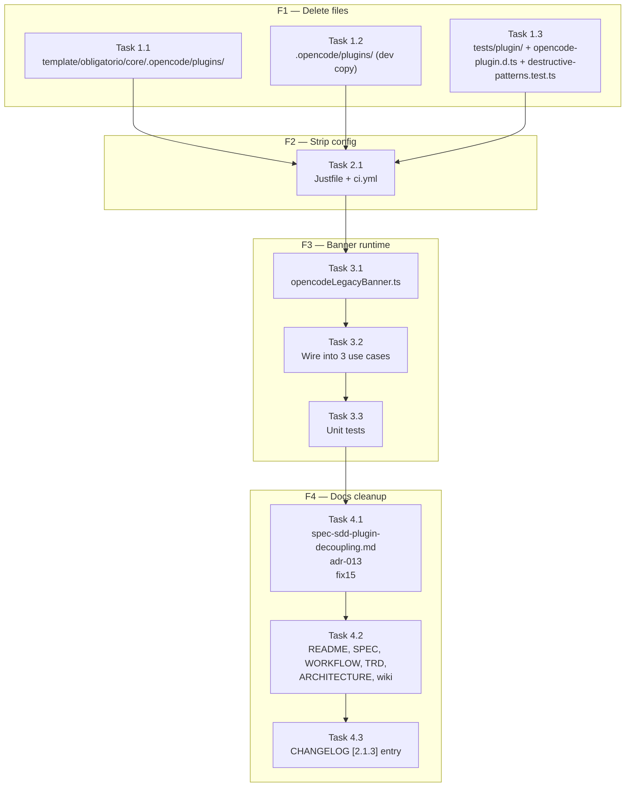
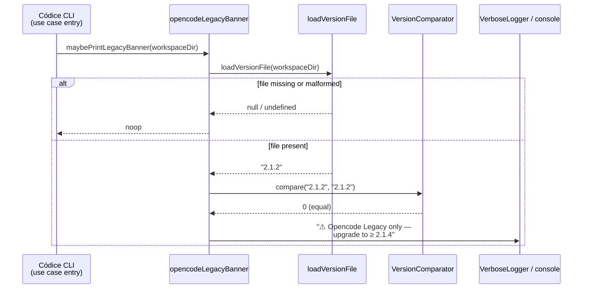

# Implementation Plan: FEV-30 — Remove SDD Plugin + Opencode Legacy Deprecation Banner (Issue #90)

> **COMPLETADO 2026-09-22.** FEV-30 cerrado en `hotfix/opencode-v2-migrate` —
> 10 commits atómicos (F1 deletes, F2 CI strip, F3 banner TDD, F4 docs),
> gates verdes (`just check` 0, `just test` 1848/0, coverage 96.19%,
> e2e 31/31). Issue #90. Este plan queda como historia; no ejecutar.
> Siguiente: preparar release v2.1.3.

> **Estado:** listo para ejecutar en rama `hotfix/opencode-v2-migrate` (target release **v2.1.3**).
> **Issue:** [#90](https://github.com/Fisherk2/codice-opencode/issues/90)
> **Diagnóstico:** [`docs/diagnosis/fix27-sdd-plugin-removal-v2-incompatibility.md`](../docs/diagnosis/fix27-sdd-plugin-removal-v2-incompatibility.md)
> **Dependencias:** Ninguna — FEV-29 ya completó la migración a `permissions:` nativo V2 (2026-09-22).
>
> **Política de commits:** 8 commits atómicos por concern (uno por concern lógico, no por archivo).
> **Política de tests:** TDD para el banner runtime; los demás tasks son deletes/refactors con verificación por ausencia + gates.

---

## Overview

El plugin SDD (`sdd-pipeline.ts`, 45 líneas + 2 módulos: `destructivePatterns.ts` + `normalizeBash.ts`) desplegado a hosts Opencode V2 falla en cada startup con "Plugin must export a default definition with an id and an effect or setup function". Después de FEV-27 (#80) el plugin quedó reducido a **única función valiosa**: bloqueo de comandos destructivos como red de seguridad. Esa red ya está duplicada y endurecida en `template/obligatorio/core/opencode.json` (`permission.bash` deny-lists). La decisión del maintainer (vía `docs/diagnosis/fix27`) es **eliminar** el plugin en lugar de portarlo, y agregar un banner de deprecación para usuarios en ≤ 2.1.2.

**Resultado esperado:**
1. Cero archivos `sdd-pipeline*`, `destructivePatterns*`, `normalizeBash*` en el repo tras FEV-30.
2. Cero tests `tests/plugin/`, `tests/types/opencode-plugin.d.ts`, ni recipes de CI asociados al plugin.
3. `opencode.json` mantiene `permission.bash` deny-lists como defensa en profundidad (ya existente).
4. Banner runtime imprime `⚠ Opencode Legacy only — upgrade to ≥ 2.1.4` cuando la versión instalada (`.codice-version`) ≤ 2.1.2.
5. Docs/specs/ADRs que documentan el plugin se eliminan completamente (sin banners "superseded").

---

## Architecture Decisions

- **D1 — Eliminación total, no port.** El plugin sólo aportaba bloqueo destructivo; `opencode.json` ya tiene `permission.bash` deny-lists equivalentes + más extensos (FEV-27 revisión). Portar costaría más que el valor residual; el maintainer decide remover.
- **D2 — Banner vía `.codice-version` (offline).** Sin red. Reutiliza `loadVersionFile()` / `updateStatusCheck()` ya existentes en `src/application/useCases/`. La comparación `installedVersion ≤ 2.1.2` se hace con `VersionComparator` (ya implementado en `src/domain/services/VersionComparator.ts`).
- **D3 — Sin nueva release menor.** FEV-30 se incorpora a **v2.1.3** (mismo hotfix que FEV-29) porque la remoción es interna del instalador y no rompe la API pública para usuarios V2; los usuarios V1 que aún usan el plugin obtendrán el banner al actualizar.
- **D4 — Historia documental eliminada, no archivada.** Por decisión del usuario: borrar `specs/spec-sdd-plugin-decoupling.md`, `specs/adr/adr-013-plugin-auto-discovery.md`, `docs/diagnosis/fix15-plugin-cleanup.md`, `docs/diagnosis/fix06-v1.2-phase3-documentation.md` (referencias plugin), todas las menciones de "55/55 plugin integration" en CHANGELOG/WORKFLOW/SPEC. El CHANGELOG v2.1.1/v2.1.2 conserva las menciones históricas del plugin (registro inmutable de releases pasados) pero el `README.md` y `docs/WORKFLOW.md` se actualizan al estado actual.
- **D5 — Commits por concern, no por archivo.** 8 commits atómicos siguiendo el principio "un commit, un concern lógico" de la skill `git-workflow-and-versioning`. Esto preserva reversibilidad granular.
- **D6 — FileRuleManifestData limpia entrada opcional.** La entrada `optional(".opencode/plugins/sdd-workflow-test.md", ...)` deja de existir (el archivo nunca existió como entrega útil; verificado por `find`).
- **D7 — Biome.json sin exclusiones plugin.** El blanket `!!**/template` nunca estuvo en biome.json; las exclusiones `template/obligatorio/core/skills` + `template/opcional/skills` se mantienen (código de skills externos con sus propios deps).

---

## Task List

### Phase 1 — Eliminación de archivos (F1)

**Concern:** el plugin deja de existir en disco en todos los lugares donde vive.

- [x] **Task 1.1 — Delete template plugin directory.** `git rm -r template/obligatorio/core/.opencode/plugins/` (elimina `sdd-pipeline.ts`, `destructivePatterns.ts`, `normalizeBash.ts`, `package.json`, `README.md`, `tsconfig.json`, `.gitignore`). Commit `chore(plugin): remove SDD plugin from template (FEV-30)`. Subagents: `backend-developer`, `git-workflow-manager`.
- [x] **Task 1.2 — Delete dev plugin copy.** `git rm -r .opencode/plugins/` (elimina `sdd-pipeline.ts` + `src/` con 16 módulos + `__tests__/`). El `.sdd-audit.log` es gitignored. Commit `chore(plugin): remove dev plugin copy (FEV-30)`. Subagents: `git-workflow-manager`.
- [x] **Task 1.3 — Delete plugin test suites.** `git rm -r tests/plugin/` (integration + e2e + 3 bash scripts) + `git rm tests/types/opencode-plugin.d.ts` + `git rm tests/unit/config/destructive-patterns.test.ts`. Commit `test(plugin): drop plugin test suites (FEV-30)`. Subagents: `qa-automation`.

**Checkpoint F1:**
- `find . -path '*/.opencode/plugins*' -not -path '*/node_modules/*' -not -path '*/fixtures/*'` retorna **0 paths** en `template/` y `.opencode/` raíz.
- `grep -rln 'sdd-pipeline\|DestructiveCommandBlock\|destructivePatterns\|tests/plugin\|tests/types/opencode-plugin' src/ scripts/ tests/ template/` retorna **0 matches**.
- `just check` 0 errores (los archivos eliminados no estaban en `src/` ni `tests/` activos).

---

### Phase 2 — Cleanup de recipes de CI + Biome + Justfile + Manifest (F2)

**Concern:** el plugin ya no existe, pero los archivos de configuración aún lo invocan.

- [x] **Task 2.1 — Strip Justfile plugin targets + ci.yml qa-plugin job.** Eliminar de `Justfile` líneas 60-80 (targets `check-plugin`, `test-plugin-unit`, `test-plugin-integration`, `test-plugin-e2e`); eliminar de `.github/workflows/ci.yml` el job `qa-plugin` (líneas 78-112) y la invocación `just check-plugin` que aparezca en otros targets. Commit `chore(ci): remove plugin recipes and CI job (FEV-30)`. Subagents: `devops-engineer`, `code-reviewer`.

**Checkpoint F2:**
- `grep -n 'check-plugin\|test-plugin\|qa-plugin\|tests/plugin' Justfile .github/workflows/ci.yml biome.json` retorna **0 matches**.
- `just check` 0 errores.
- `just test` (non-Linux) y `just coverage-check 95` (Linux) no invocan nada relativo al plugin.

---

### Phase 3 — Banner runtime "Opencode Legacy only" (F3)

**Concern:** usuarios en ≤ 2.1.2 deben saber al instalar que su versión es Legacy y deben actualizar.

- [x] **Task 3.1 — Implement Opencode Legacy banner.** Crear helper `src/application/helpers/opencodeLegacyBanner.ts` que: (a) lee `.codice-version` desde el workspace (`loadVersionFile` de `src/application/useCases/helpers/versionFile.ts` o equivalente); (b) compara con `2.1.2` usando `VersionComparator`; (c) si `installed ≤ 2.1.2`, imprime via `VerboseLogger.log()` (o `console.warn` si no hay logger contextual) el mensaje `⚠ Opencode Legacy only — upgrade to ≥ 2.1.4 for native Opencode V2 support`. Banner NO bloqueante. Commit `feat(installer): warn on Opencode Legacy installs ≤ 2.1.2 (FEV-30)`. Subagents: `backend-developer`, `test-engineer`.
- [x] **Task 3.2 — Wire banner into all use cases.** Llamar `maybePrintLegacyBanner()` desde `CleanInstallUseCase`, `ProjectInstallUseCase`, `UpdateWorkspaceUseCase` antes del primer prompt interactivo (en `--verbose` siempre; sin `--verbose` solo si `.codice-version` existe y es ≤ 2.1.2). Commit `feat(installer): wire legacy banner into install flows (FEV-30)`. Subagents: `backend-developer`.
- [x] **Task 3.3 — TDD: unit tests for legacy banner.** Crear `tests/unit/application/helpers/opencodeLegacyBanner.test.ts` cubriendo: (a) sin `.codice-version` → no imprime; (b) versión `2.1.0`, `2.1.1`, `2.1.2` → imprime; (c) versión `2.1.3`, `2.1.4`, `3.0.0` → no imprime; (d) versión inválida (`abc`) → no imprime + no rompe; (e) sin `loadVersionFile` disponible → graceful no-op. Commit `test(installer): add legacy banner unit tests (FEV-30)`. Subagents: `qa-automation`.

**Desviaciones aceptadas del plan (Tasks 3.1–3.3):**
- (a) Banner se emite via `IUserPrompt.showWarning` (no `VerboseLogger`/`console.warn`) — feedback visible en todos los flujos, no atado a `--verbose`.
- (b) Sin gating `--verbose` en Task 3.2: el banner se evalúa siempre (fail-open → no-op silencioso si no aplica), espejo del contrato de `src/cli/versionContext.ts`.
- (c) Helper reubicado a `src/application/legacyBanner.ts` (el plan original apuntaba a `src/application/helpers/opencodeLegacyBanner.ts`).
- (d) Security follow-up del review (Fase 1): permissions de bash endurecidas + validación de strings en `installedPacks` — commits `078d85d`, `d54db7a`.

**Checkpoint F3:**
- `just test` 0 fallos; nuevos tests pasan.
- `just check` 0 errores.
- Banner visible en `--verbose` con un fixture que tenga `.codice-version` = `2.1.2`.
- Banner NO aparece con `.codice-version` = `2.1.3`.

---

### Phase 4 — Limpieza documental completa + release (F4)

**Concern:** la historia del plugin se elimina de la documentación activa (no archivada, por decisión D4).

- [x] **Task 4.1 — Delete plugin specs/ADRs/diagnoses.** `git rm specs/spec-sdd-plugin-decoupling.md specs/adr/adr-013-plugin-auto-discovery.md docs/diagnosis/fix15-plugin-cleanup.md`. Commit `docs(workflow): retire plugin specs and ADRs (FEV-30)`. Subagents: `docs-writer`.
- [x] **Task 4.2 — Update README/SPEC/WORKFLOW/TRD/ARCHITECTURE to current state.** Quitar referencias al plugin en `README.md`, `SPEC.md`, `docs/WORKFLOW.md`, `docs/TRD.md`, `docs/ARCHITECTURE.md` (tabla de ADRs), `docs/wiki-source/.wiki/SDD-Pipeline.md`, `docs/wiki-source/.wiki/Commands.md`, `docs/wiki-source/.wiki/Configuration.md`. Reemplazar todas las menciones "55/55 plugin integration" por la métrica actual (e.g., "1935 unit/integration tests"). Commit `docs(workflow): scrub plugin references from active docs (FEV-30)`. Subagents: `docs-writer`, `technical-writer`.
- [x] **Task 4.3 — Update CHANGELOG Unreleased + v2.1.3 entry.** Añadir bloque `[2.1.3]` con FEV-30 marcado completo (remoción plugin + banner runtime). Mantener las menciones históricas en `[2.1.1]` (FEV-27) intactas (registro de release pasado). Commit `docs(changelog): FEV-30 release entry v2.1.3 (FEV-30)`. Subagents: `technical-writer`.

**Checkpoint F4 (final):**
- `grep -rln 'plugin\|sdd-pipeline\|sddPipeline\|DestructiveCommandBlock\|destructivePatterns\|tests/plugin\|qa-plugin' docs/ specs/ wiki-source/ README.md SPEC.md 2>/dev/null` retorna **0 matches** (excepto menciones históricas en CHANGELOG v2.1.1/v2.1.2 que documentan releases pasados).
- `docs/ARCHITECTURE.md` tabla ADRs: ADR-013 ausente.
- `docs/wiki-source/.wiki/SDD-Pipeline.md` ausente (o reemplazado por un redirect "removed in v2.1.3").
- `git status --porcelain` limpio.

---

## Risks and Mitigations

| Risk | Impact | Mitigation |
|------|--------|------------|
| Banner runtime rompe installs V1 que aún esperan el plugin | Medium | Banner es informativo, no bloqueante. CHANGELOG + release notes anuncian el cambio. Documentar en `docs/MIGRATION.md` la rampa de salida. |
| Algún agente/command referencia destructivo patterns via import | High | F1 checkpoint verifica `grep` 0 matches antes de F2. La lógica de seguridad pasa a `permission.bash` deny-lists que ya están en `template/obligatorio/core/opencode.json` (FEV-27 review). |
| Tests fixture workspace tiene `.opencode/plugins/` residual | Low | El fixture es gitignored y se regenera por `just dev`. Verificar manualmente antes de `just test-e2e`. |
| Pérdida de cobertura por remoción de `destructive-patterns.test.ts` | Low | Los patterns ya no existen; la lógica equivalente está en `opencode.json` que se valida por `tests/unit/quality/source-hygiene.test.ts` y por el validator de permisos V2 (`tests/unit/domain/agent-frontmatter-validation.test.ts`). |
| Wiki pages referencian plugin en prosa histórica | Low | F4 task 4.2 hace scrubbing masivo; verificar `grep` final en checkpoint F4. |

---

## Verification (run after each phase)

```bash
# after F1
find . -path '*/.opencode/plugins*' -not -path '*/node_modules/*' -not -path '*/fixtures/*' | wc -l   # expect 0
grep -rln 'sdd-pipeline\|DestructiveCommandBlock\|destructivePatterns' src/ scripts/ tests/ template/ | wc -l   # expect 0
just check

# after F2
grep -n 'check-plugin\|test-plugin\|qa-plugin' Justfile .github/workflows/ci.yml biome.json | wc -l   # expect 0
just check

# after F3
just test
just check

# after F4 (final)
grep -rln 'plugin\|sdd-pipeline\|sddPipeline\|DestructiveCommandBlock\|destructivePatterns\|tests/plugin\|qa-plugin' docs/ specs/ wiki-source/ README.md SPEC.md 2>/dev/null | wc -l   # expect 0 (except CHANGELOG history)
git status --porcelain   # expect empty

# final gates (Linux)
just test-coverage
just coverage-check 95
just test-e2e

# final gates (non-Linux)
just test
```

---

## Subagent Delegation Matrix

Tareas mecánicas (deletes, grep verificadores) → `git-workflow-manager`. Tareas con lógica (banner) → `backend-developer` + `test-engineer`. Tareas documentales → `docs-writer` + `technical-writer`. Review → `code-reviewer`.

> Exigencia `template/obligatorio/core/commands/plan.md` paso 6: tabla `task | subagent | skill(s)` con skills reales de `skills/`.

| Task | Subagents | Skills + justificación |
|------|-----------|------------------------|
| 1.1 | `backend-developer`, `git-workflow-manager` | `git-workflow-and-versioning` — commit atómico `chore(plugin)` por concern delete; `bash-defensive-patterns` — verificación segura `find`/`grep` 0-matches sin globs destructivos |
| 1.2 | `git-workflow-manager` | `git-workflow-and-versioning` — `git rm -r` dev copy con mensaje convencional reversible; `bash-defensive-patterns` — confirma 0 paths residuales excluyendo `node_modules`/`fixtures` |
| 1.3 | `qa-automation`, `git-workflow-manager` | `git-workflow-and-versioning` — commit `test(plugin)` que aísla el drop de suites; `test-driven-development` — gate rojo/verde: `just test` sigue en verde tras eliminar `tests/plugin/` |
| 2.1 | `devops-engineer`, `code-reviewer` | `ci-cd-and-automation` — strip del job `qa-plugin` y targets `check/test-plugin` sin romper el DAG de CI; `code-review-and-quality` — review de `Justfile`+`ci.yml` post-strip; `git-workflow-and-versioning` — commit `chore(ci)` atómico |
| 3.1 | `backend-developer`, `test-engineer` | `test-driven-development` — helper `opencodeLegacyBanner.ts` guiado por casos rojo→verde; `clean-code` — helper pequeño, no bloqueante, sin side-effects ocultos; `clean-ddd-hexagonal` — ubica el banner en `application/helpers` reutilizando `VersionComparator`/`loadVersionFile` (solo referencia, no implementación) |
| 3.2 | `backend-developer` | `clean-ddd-hexagonal` — cablea `maybePrintLegacyBanner()` vía use cases sin saltarse la capa application (solo referencia); `refactoring-patterns` — inserta la llamada antes del primer prompt con el cambio mínimo seguro |
| 3.3 | `qa-automation` | `test-driven-development` — 5 casos TDD (ausente / ≤2.1.2 imprime / ≥2.1.3 no imprime / inválida / sin loader); `debugging-and-error-recovery` — versión `abc` y loader ausente degradan a no-op sin romper el install |
| 4.1 | `docs-writer`, `git-workflow-manager` | `documentation-and-adrs` — retira `spec-sdd-plugin-decoupling` + ADR-013 con trazabilidad D4 (eliminación, no archivo); `git-workflow-and-versioning` — commit `docs(workflow)` atómico de deletes |
| 4.2 | `docs-writer`, `technical-writer` | `documentation-and-adrs` — scrub de refs plugin en SPEC/WORKFLOW/TRD/ARCHITECTURE/wiki manteniendo consistencia; `crafting-effective-readmes` — reescribe `README.md` al estado actual sin métrica legacy "55/55" |
| 4.3 | `technical-writer` | `changelog-generate` — entrada `[2.1.3]` en formato Keep a Changelog (remoción + banner); `documentation-and-adrs` — preserva historia inmutable v2.1.1/v2.1.2 mientras documenta el cambio |

---

## Diagram — File Touch Map


```mermaid
graph TB
    subgraph "F1 — Delete files"
        T1["Task 1.1<br/>template/obligatorio/core/.opencode/plugins/"]
        T2["Task 1.2<br/>.opencode/plugins/ (dev copy)"]
        T3["Task 1.3<br/>tests/plugin/ + opencode-plugin.d.ts + destructive-patterns.test.ts"]
    end

    subgraph "F2 — Strip config"
        R1["Task 2.1<br/>Justfile + ci.yml"]
    end

    subgraph "F3 — Banner runtime"
        B1["Task 3.1<br/>opencodeLegacyBanner.ts"]
        B2["Task 3.2<br/>Wire into 3 use cases"]
        B3["Task 3.3<br/>Unit tests"]
    end

    subgraph "F4 — Docs cleanup"
        D1["Task 4.1<br/>spec-sdd-plugin-decoupling.md<br/>adr-013<br/>fix15"]
        D2["Task 4.2<br/>README, SPEC, WORKFLOW, TRD,<br/>ARCHITECTURE, wiki"]
        D3["Task 4.3<br/>CHANGELOG [2.1.3] entry"]
    end

    T1 --> R1
    T2 --> R1
    T3 --> R1
    R1 --> B1
    B1 --> B2
    B2 --> B3
    B3 --> D1
    D1 --> D2
    D2 --> D3
```

---

## Diagram — Banner runtime flow


```mermaid
sequenceDiagram
    participant CLI as Códice CLI<br/>(use case entry)
    participant Banner as opencodeLegacyBanner
    participant VF as loadVersionFile
    participant VC as VersionComparator
    participant Log as VerboseLogger / console

    CLI->>Banner: maybePrintLegacyBanner(workspaceDir)
    Banner->>VF: loadVersionFile(workspaceDir)
    alt file missing or malformed
        VF-->>Banner: null / undefined
        Banner-->>CLI: noop
    else file present
        VF-->>Banner: "2.1.2"
        Banner->>VC: compare("2.1.2", "2.1.2")
        VC-->>Banner: 0 (equal)
        Banner->>Log: "⚠ Opencode Legacy only —<br/>upgrade to ≥ 2.1.4"
    end
```

---

## Out of Scope

- Portar el plugin a la API V2 (decisión del maintainer en `fix27`).
- Reemplazar el plugin por un módulo nativo (`src/`) — su valor es residual y ya está duplicado en `opencode.json`.
- Actualizar el threshold de `coverage-check` (sigue en 95%; la remoción no baja la cobertura de `src/`).
- Cambiar la versión de `package.json` manualmente — bumping a 2.1.3 ocurre en el release, no en FEV-30.
- Reemplazar el wiki `SDD-Pipeline.md` por documentación de `permission.bash` deny-lists (ya cubierto por `wiki-source/.wiki/Security-Hardening.md` o equivalente).

---

## Open Questions

None — todas las decisiones confirmadas con el usuario antes de planificar:

- ✅ Cobertura objetivo = **mínimo viable + banner + auto-update hint**.
- ✅ Historia documental = **eliminada completamente** (no banners, no archive).
- ✅ Métrica legacy "55/55 plugin integration" = **retirada** de docs activas.
- ✅ Target release = **v2.1.3** (mismo hotfix que FEV-29).
- ✅ Banner runtime = **detección vía `.codice-version`** (sin red).
- ✅ Granularidad = **8 commits por concern**.

---

*End of plan — see `tasks/todo.md` for the live checklist.*