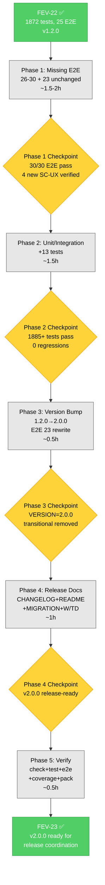

# Implementation Plan: FEV-23 — v2.0.0 Testing & Integration

**Phase:** FEV-23 (v2.0.0 Final Phase) — 🔲 Listo para implementar
**Scope:** Cerrar el ciclo de v2.0.0 con: (1) **5 nuevos E2E scripts** para SC-UX7, SC-UX9, SC-UX10, SC-UX12 + Project Install con pack selection, (2) **~5 nuevos integration/unit tests** para cerrar gaps en coverage de Option B, Project Install pack flow, y version detection edge cases, (3) **Version bump** `package.json` 1.2.0 → 2.0.0 + remover el "transitional no-op" workaround de E2E #23, (4) **Release documentation** (CHANGELOG v2.0.0 entry + README actualizado + NUEVO `docs/MIGRATION.md` para v1.x→v2.0.0 + WORKFLOW/TECH_DEBT actualizados). NO incluye el release real (PR merge, tag v2.0.0, npm publish) — eso es proceso de release separado del maintainer.
**Spec:** [specs/spec-installer-ux-v2.md §9](../specs/spec-installer-ux-v2.md), [specs/spec-agent-packs.md §9](../specs/spec-agent-packs.md)
**Tech Debt:** TD-V2-6 (sigue abierto — no pack removal, deferred a v2.2.0)
**Date:** 2026-08-06
**Author:** Moctezuma (Strategic Planner)
**Branch:** `feat/new-agents` (continúa de FEV-17 a FEV-22)
**Methodology:** Per-phase atomic commits (1 por fase = **4 commits atómicos** + 1 verification) + checkpoints. Total: **~5.5-6h wall-clock**.
**Wall-clock estimate:** ~5.5-6h (1.5-2h Phase 1 + 1.5h Phase 2 + 0.5h Phase 3 + 1h Phase 4 + 0.5h Phase 5)

---

## Overview

FEV-23 cierra el ciclo de v2.0.0 después de que FEV-17 a FEV-22 entregaran:
- **FEV-17**: Template directory restructuring (`core/` + `packs/`)
- **FEV-18**: Agent classification & migration (~355 agents en 10 packs)
- **FEV-19**: Permission unification & subagent table removal
- **FEV-20**: Plugin `VALID_SUBAGENTS` removal + recursive auto-discovery
- **FEV-21**: Pack selection wizard + version detection + Option A/B
- **FEV-22**: Install summary + `agentCount` metadata + wiki sync

El branch `feat/new-agents` tiene **1872 unit+integration tests (0 fail), 25/25 E2E pass, coverage ≥95%**. FEV-23 entrega la **suite completa** para v2.0.0 + **version bump** + **release documentation**.

**Lo que FEV-23 hace:**

1. **Completa la matriz de Success Criteria** del spec §9 (12 SCs):
   - SC-UX1 ✅ (E2E 17, FEV-21)
   - SC-UX2 ✅ (E2E 19, FEV-21)
   - SC-UX3 ✅ (E2E 24, FEV-22)
   - SC-UX4 ✅ (E2E 20, FEV-21)
   - SC-UX5 🟡 (E2E 21, 22; falta pre-1.2.0 → **Phase 1**)
   - SC-UX6 ✅ (E2E 23 transitional, will be **real** after Phase 3)
   - SC-UX7 ❌ (Option B no testeado E2E → **Phase 1**)
   - SC-UX8 ✅ (unit test en `update-flow.test.ts` line 146-154)
   - SC-UX9 ❌ (--packs non-interactive no es E2E explícito → **Phase 1**)
   - SC-UX10 ❌ (flat agents destination no testeado → **Phase 1**)
   - SC-UX11 ✅ (E2E 22, FEV-21)
   - SC-UX12 ❌ (pre-1.2.0 cleanup message no testeado → **Phase 1**)

2. **Bump version** a 2.0.0 con cleanup del transitional workaround

3. **Release documentation** lista para PR a `main` + tag v2.0.0

**Lo que FEV-23 NO hace:**
- ❌ PR merge `feat/new-agents` → `develop` (release coordination, separate)
- ❌ PR merge `develop` → `main` (release coordination, separate)
- ❌ Tag `v2.0.0` en git (release coordination, separate)
- ❌ `npm publish` con dist-tag `latest` (release coordination, separate)
- ❌ Pack removal mechanism (TD-V2-6, deferred a v2.2.0)
- ❌ Auto-discovery of new packs (out of scope para v2.0.0)

---

## Architecture Decisions

| # | Decision | Rationale |
|---|----------|-----------|
| **1** | **5 nuevos E2E scripts (no 6)** | E2E #23 será **reescrito** en Phase 3 (no es "nuevo"). Total: 25 + 5 nuevos + 1 reescrito = 30 E2E scripts. |
| **2** | **Version bump en Phase 3 separada** | Aislar el cambio de versión en un commit dedicado. Facilita revert si hay issues con el bump. Phase 1 y Phase 2 son tests con `package.json: 1.2.0`; Phase 3 cambia a `2.0.0` y reescribe E2E #23. |
| **3** | **MIGRATION.md NUEVO** | v1.x → v2.0.0 es un breaking change (incompatible metadata, no update path). Los usuarios necesitan guía explícita: qué se pierde, qué hacer, cuándo. CHANGELOG no es suficiente. |
| **4** | **4 atomic commits (1 por fase) + 1 verification** | Consistente con FEV-20 (10 commits), FEV-21 (7 commits), FEV-22 (5 commits). Cada commit toca 1 concern: tests E2E, tests integration/unit, version bump, docs. |
| **5** | **Reescribir E2E #23 con v2.0.0** | Una vez bumpeado, el "transitional no-op" workaround ya no aplica. Reescribir verifica la lógica real: Option A actualiza solo `installedPacks`, NO agrega nuevos packs. |
| **6** | **5 nuevos E2E scripts en 1 commit atómico** | Todos los E2E nuevos están interrelacionados (cubren SC-UX del mismo spec). 1 commit = 1 logical change ("cover remaining SC-UX criteria"). |
| **7** | **~5 nuevos integration/unit tests en 1 commit** | Similar al anterior: tests de use cases pack-aware están en el mismo concern. 1 commit. |
| **8** | **No crear nuevos helpers** | Toda la infra ya existe (`common.sh` para E2E, mock helpers para integration). FEV-23 solo escribe tests, no producción. |
| **9** | **Mantener BUNDLED_TEST_VERSION solo donde es necesario** | Después de bump, ningún E2E necesita BUNDLED_TEST_VERSION env var. Remover referencias en E2E 04, 15, 16 si las tienen. |
| **10** | **Continuar en `feat/new-agents`** | Consistente con FEV-17/18/19/20/21/22. La rama acumula 7 FEVs del ciclo v2.0.0. |
| **11** | **Total: ~5.5-6h wall-clock** | 1.5-2h Phase 1 + 1.5h Phase 2 + 0.5h Phase 3 + 1h Phase 4 + 0.5h Phase 5. |
| **12** | **Reusar mocks de `update-flow.test.ts`** | El mock `IUserPrompt` ya existe con `selectUpdateOption` configurable. No duplicar — solo agregar tests que usen el mock existente. |

---

## Patterns Applied (Design Decision Documentation)

| Pattern | Where | Why |
|---------|-------|-----|
| **Test Pyramid** | 1 unit (logic) → 5 unit (Phase 2) → 5 E2E (Phase 1) → 1 verify (Phase 5) | Domain unit tests son baratos; E2E son caros pero realistas. Pyramid balance = mantener velocity sin sacrificar confidence. |
| **Single Source of Truth (SSOT)** | `FileRuleManifestData` es la única fuente de pack IDs, counts, paths | Todos los tests leen del manifest. Cambio en manifest = cambio en tests automático (no hardcoded constants). |
| **Port + Adapter** | `IUserPrompt` mock reutilizado en 6+ tests | Test 1 escribe el mock; tests 2-N lo extienden. DRY en testing infrastructure. |
| **Given-When-Then (AAA)** | Cada test: setup (given) → action (when) → assertion (then) | Consistente con codebase style. Reduce cognitive load. |
| **Behavior-Driven Naming** | `describe("Option B", () => test("merges installed with new packs"))` | Test names describen el comportamiento esperado, no la implementación. |
| **Boundary Testing** | Tests para: 0 packs, 1 pack, 8 packs, unknown pack, empty list, whitespace | Edge cases identificados en `validatePackList.test.ts` (FEV-21). Mismo patrón. |
| **Template Method** | E2E scripts usan `common.sh` helpers (`setup_workspace`, `assert_contains`, `log_pass`) | FEV-2-D/3/16 establecieron este patrón. E2E 26-30 siguen el template. |
| **Test Isolation** | Cada E2E crea `TEMP_DIR` con `create_temp_dir` (no comparte state) | Independiente del orden de ejecución. CI safety. |
| **Defensive Validation** | Tests verifican que `installedPacks` está bien-formado antes de mergear | Si metadata está corrupta, FEV-23 atrapa el issue antes de v2.0.0 release. |

---

## Pre-Audit Snapshot (2026-08-06)

### Current Test State (post-FEV-22)

| Metric | Value |
|--------|------:|
| Tests (pass/fail) | 1872 / 0 |
| E2E scenarios | 25 / 25 |
| `just check` errors | 0 |
| `just check-plugin` errors | 0 |
| Coverage (lines) | ≥95% |
| `FileRule` fields | 7 (+1 `agentCount?`) |
| `IUserPrompt` methods | 16 |
| CLI flags | 10 |
| Pack entry count | 8 (category: "pack") |
| Branch | `feat/new-agents` |
| `package.json` version | 1.2.0 |
| `src/cli/version.ts` VERSION | 1.2.0 (auto-derived) |

### E2E Coverage Matrix (current vs target)

| SC | Spec | E2E Current | Status | Phase to add |
|----|------|-------------|--------|--------------|
| SC-UX1 | Pack selection screen w/ default | 17-pack-selection-default | ✅ | — |
| SC-UX2 | Min 1 pack validation | 19-pack-validation-min1 + validatePackList.test.ts | ✅ | — |
| SC-UX3 | Install summary | 24, 25 (FEV-22) | ✅ | — |
| SC-UX4 | .codice-version format | 20-codice-version-installedPacks | ✅ | — |
| SC-UX5 | Update blocked | 21 (missing), 22 (1.x) | 🟡 | **Phase 1** (pre-1.2.0) |
| SC-UX6 | Option A scope | 23 (transitional) | 🟡 | **Phase 3** (rewrite) |
| SC-UX7 | Option B locked packs | none | ❌ | **Phase 1** |
| SC-UX8 | Option B cancel no new | update-flow.test.ts:146-154 | ✅ | — |
| SC-UX9 | --packs non-interactive | none (used as helper) | ❌ | **Phase 1** |
| SC-UX10 | Flat agents/ | none | ❌ | **Phase 1** |
| SC-UX11 | Legacy v1.x message | 22 (v1.x) | ✅ | — |
| SC-UX12 | Pre-1.2.0 cleanup | none | ❌ | **Phase 1** |

**Score:** 7/12 ✅ + 3 🟡 + 3 ❌ → FEV-23 → 12/12 ✅

### Files requiring modification (12) + new (8) = 20 total

| File | Layer | Action | Phase |
|------|-------|--------|:-----:|
| `tests/e2e/26-update-blocked-pre-1.2.0.sh` | E2E | NEW (SC-UX12) | 1 |
| `tests/e2e/27-update-option-b.sh` | E2E | NEW (SC-UX7) | 1 |
| `tests/e2e/28-flat-agents-destination.sh` | E2E | NEW (SC-UX10) | 1 |
| `tests/e2e/29-non-interactive-packs.sh` | E2E | NEW (SC-UX9) | 1 |
| `tests/e2e/30-project-install-packs.sh` | E2E | NEW (Project Install + packs) | 1 |
| `tests/integration/use-cases/update-workspace.test.ts` | Test | Add Option B execution tests | 2 |
| `tests/integration/use-cases/project-install.test.ts` | Test | Add pack selection coverage | 2 |
| `tests/integration/use-cases/clean-install.test.ts` | Test | Add pack summary verification | 2 |
| `tests/unit/cli/version-context.test.ts` | Test | Add pre-1.2.0 edge cases (3 tests) | 2 |
| `tests/e2e/23-update-option-a.sh` | E2E | REWRITE (remove transitional) | 3 |
| `package.json` | Build | 1.2.0 → 2.0.0 | 3 |
| `CHANGELOG.md` | Docs | Add v2.0.0 entry | 4 |
| `README.md` | Docs | Update to v2.0.0 | 4 |
| `docs/MIGRATION.md` | Docs | NEW (v1.x → v2.0.0 guide) | 4 |
| `docs/WORKFLOW.md` | Docs | Mark FEV-23 ✅ + v2.0.0 ready | 4 |
| `docs/TECH_DEBT.md` | Docs | Document v2.0.0 closure | 4 |
| `tests/e2e/common.sh` | E2E | Possibly extend (verify) | 1 |
| `tests/e2e/04-update-workspace.sh` | E2E | Verify BUNDLED_TEST_VERSION (Phase 3) | 3 |
| `tests/e2e/15-update-workspace-existing-project.sh` | E2E | Verify (Phase 3) | 3 |
| `tests/e2e/16-update-granularity.sh` | E2E | Verify (Phase 3) | 3 |

**Total:** 16 files modified + 6 new (5 E2E + 1 doc) = 22 files
**Note:** Some files overlap between E2E 23 rewrite and Phase 3 version bump work.

### Files NOT modified (verified)

- `src/application/installSummary.ts` (FEV-22, no change)
- `src/application/packOptions.ts` (FEV-22, no change)
- `src/application/ports/IUserPrompt.ts` (FEV-22, no change)
- `src/application/use-cases/InstallUseCaseBase.ts` (FEV-22, no change)
- `src/infrastructure/adapters/ClackPromptsAdapter.ts` (FEV-22, no change)
- `src/domain/entities/FileRule.ts` (FEV-22, no change)
- `src/domain/entities/FileRuleManifestData.ts` (FEV-22, no change)
- `src/application/use-cases/updateFlow.ts` (FEV-21, no change)
- `src/cli/versionContext.ts` (FEV-21, no change)
- `src/infrastructure/adapters/versionInfoMessages.ts` (FEV-21, no change)
- `template/obligatorio/packs/**` (no change — pack content intact)
- `docs/wiki-source/**` (FEV-22, no change)

### Baseline metrics (post-FEV-22)

| Metric | Value |
|--------|------:|
| Tests (pass/fail) | 1872 / 0 |
| E2E scenarios | 25 / 25 |
| `just check` errors | 0 |
| Coverage (lines) | ≥95% |
| `FileRule` fields | 7 |
| `IUserPrompt` methods | 16 |
| CLI flags | 10 |
| `.codice-version` fields | 4 |
| Tarball size | 8.0MB (SC-15 deviation, accepted 2026-08-04) |

---

## Dependency Graph

```
FEV-22 ✅ (feat/new-agents base)
    ↓
Phase 1: Missing E2E Tests (~1.5-2h, 1 commit)
    ├── T1.1: 5 new E2E scripts (26, 27, 28, 29, 30)
    └── T1.2: Verify common.sh has needed helpers
    ↓
Phase 2: Unit/Integration Test Gaps (~1.5h, 1 commit)
    ├── T2.1: update-workspace.test.ts (Option B execution)
    ├── T2.2: project-install.test.ts (pack selection coverage)
    ├── T2.3: clean-install.test.ts (pack summary verification)
    └── T2.4: version-context.test.ts (pre-1.2.0 edge cases)
    ↓
Phase 3: Version Bump to v2.0.0 (~0.5h, 1 commit)
    ├── T3.1: package.json 1.2.0 → 2.0.0
    ├── T3.2: Rewrite E2E 23 (real Option A verification)
    └── T3.3: Verify other E2E scripts work with v2.0.0
    ↓
Phase 4: Release Documentation (~1h, 1 commit)
    ├── T4.1: CHANGELOG.md (v2.0.0 entry)
    ├── T4.2: README.md (pack system prominent)
    ├── T4.3: docs/MIGRATION.md (NEW)
    ├── T4.4: docs/WORKFLOW.md (FEV-23 ✅)
    └── T4.5: docs/TECH_DEBT.md (v2.0.0 closure)
    ↓
Phase 5: Verification (~0.5h, gates release)
    ├── T5.1: just check + just test + just test-e2e
    ├── T5.2: Coverage ≥95% verification
    ├── T5.3: npm pack --dry-run (verify tarball)
    └── T5.4: Manual CLI smoke test
    ↓
FEV-23 Complete → Release coordination (separate)
```

**Critical path:** T1.1 → T2.1-T2.4 → T3.1-T3.3 → T4.1-T4.5 → T5.1-T5.4 (~5.5-6h total)
**Atomic commits:** 4 (1 per phase) + 1 verification (no commit)
**Parallel opportunities:** T2.1-T2.4 can be parallelized in execution (but bundled in 1 commit for atomicity).

---

## Mermaid Dependency Diagram

```mermaid
graph TD
    F22[FEV-22 ✅<br/>feat/new-agents base<br/>1872 tests, 25 E2E]:::done --> P1
    P1[Phase 1: Missing E2E<br/>5 new scripts (26-30)<br/>~1.5-2h]:::seq --> CP1
    CP1{Phase 1 Checkpoint<br/>30/30 E2E pass}:::gate --> P2
    P2[Phase 2: Unit/Integration<br/>~5 new tests<br/>~1.5h]:::seq --> CP2
    CP2{Phase 2 Checkpoint<br/>1877+ tests pass}:::gate --> P3
    P3[Phase 3: Version Bump<br/>1.2.0→2.0.0<br/>E2E 23 rewrite<br/>~0.5h]:::seq --> CP3
    CP3{Phase 3 Checkpoint<br/>VERSION=2.0.0<br/>E2E 23 real}:::gate --> P4
    P4[Phase 4: Release Docs<br/>CHANGELOG + README<br/>+ MIGRATION + W/TD<br/>~1h]:::seq --> CP4
    CP4{Phase 4 Checkpoint<br/>docs v2.0.0 ready}:::gate --> P5
    P5[Phase 5: Verify<br/>check + test + e2e<br/>+ coverage + npm pack<br/>~0.5h]:::seq --> DONE
    DONE[FEV-23 Complete ✅<br/>v2.0.0 release-ready]:::done

    classDef done fill:#51cf66,stroke:#2f9e44,color:#fff
    classDef gate fill:#ffd43b,stroke:#f59f00,color:#000
    classDef seq fill:#e7e7e7,stroke:#666,color:#000
```

---

## File-by-File Change Matrix

| File | Phase | Change Type | Lines Affected | Commit |
|------|:-----:|-------------|:--------------:|--------|
| `tests/e2e/26-update-blocked-pre-1.2.0.sh` | 1 | NEW | +85 / -0 | T1.1 |
| `tests/e2e/27-update-option-b.sh` | 1 | NEW | +110 / -0 | T1.1 |
| `tests/e2e/28-flat-agents-destination.sh` | 1 | NEW | +90 / -0 | T1.1 |
| `tests/e2e/29-non-interactive-packs.sh` | 1 | NEW | +95 / -0 | T1.1 |
| `tests/e2e/30-project-install-packs.sh` | 1 | NEW | +110 / -0 | T1.1 |
| `tests/integration/use-cases/update-workspace.test.ts` | 2 | Add Option B tests | +80 / -0 | T2.1 |
| `tests/integration/use-cases/project-install.test.ts` | 2 | Add pack selection | +60 / -0 | T2.2 |
| `tests/integration/use-cases/clean-install.test.ts` | 2 | Add pack summary | +40 / -0 | T2.3 |
| `tests/unit/cli/version-context.test.ts` | 2 | Add pre-1.2.0 cases | +30 / -0 | T2.4 |
| `tests/e2e/23-update-option-a.sh` | 3 | REWRITE (no transitional) | +30 / -50 | T3.2 |
| `package.json` | 3 | 1.2.0 → 2.0.0 | +1 / -1 | T3.1 |
| `tests/e2e/04-update-workspace.sh` | 3 | Verify (no BUNDLED env) | ±5 | T3.3 |
| `tests/e2e/15-update-workspace-existing-project.sh` | 3 | Verify | ±5 | T3.3 |
| `tests/e2e/16-update-granularity.sh` | 3 | Verify | ±5 | T3.3 |
| `CHANGELOG.md` | 4 | v2.0.0 entry | +60 / -0 | T4.1 |
| `README.md` | 4 | Update to v2.0.0 | +40 / -20 | T4.2 |
| `docs/MIGRATION.md` | 4 | NEW | +180 / -0 | T4.3 |
| `docs/WORKFLOW.md` | 4 | FEV-23 ✅ | +20 / -5 | T4.4 |
| `docs/TECH_DEBT.md` | 4 | v2.0.0 closure | +15 / -0 | T4.5 |

**Total:** 13 files modified + 6 new = 19 files (some overlap with Phase 3)
**Net lines:** +1076 new, -76 modified = **+1000 lines net** (mostly new E2E + new MIGRATION.md)
**Commits:** 4 atomic commits + 1 verification (no commit)

---

## Task List

### Phase 1: Missing E2E Scenarios (~1.5-2h, 1 commit)

> **Vertical slicing: 1 E2E = 1 SC criterion.** Cada script es independiente y atómico. Phase 1 = 5 scripts (26-30). Total time: 1.5-2h. Pattern: copiar estructura de 17-25 (FEV-21/22) + custom assertions.

#### Task 1.1: 5 new E2E scripts

**Description:** Crear 5 nuevos scripts bash E2E en `tests/e2e/`. Cada uno cubre 1 SC del spec §9. Pattern: copiar 17-pack-selection-default.sh como template (es el más reciente con pack-related logic).

**Target `26-update-blocked-pre-1.2.0.sh` (SC-UX12):**

```bash
#!/bin/bash
# FEV-23-T1: Update Blocked — Pre-1.2.0 Cleanup Suggestion E2E
#
# Scenario: Seed .codice-version with version "1.1.0" (pre-1.2.0).
# Expected (version gate — pre-1.2.0 status):
#   - exit code 0 (gate returns success without updating)
#   - output contains "Pre-1.2.0 Installation Detected"
#   - output contains "references/" and ".devin/"
#   - NO merge (opencode.json absent)
#
# SC-UX12: Pre-1.2.0 users see cleanup suggestion for references/ and .devin/.

set -Eeuo pipefail
source "$(dirname "$0")/common.sh"

log_step "FEV-23-T1: Update Blocked — Pre-1.2.0 Cleanup Suggestion"

TEMP_DIR="$(create_temp_dir)"
log_info "Test directory: $TEMP_DIR"
cp -r "$CODICE_ROOT/template" "$TEMP_DIR/template"

# Seed pre-1.2.0 installation (1.1.0 — older than 1.2.0)
echo '{"version":"1.1.0","installedAt":"2026-01-01T00:00:00.000Z"}' > "$TEMP_DIR/.codice-version"
log_info "Seeded .codice-version with v1.1.0 (pre-1.2.0)"

start_mock_server

EXIT_CODE=0
STDERR_FILE="$TEMP_DIR/stderr.log"
STDOUT_FILE="$TEMP_DIR/stdout.log"
(cd "$TEMP_DIR" && CODICE_GITHUB_API_URL="http://localhost:4567" CODICE_BYPASS_URL_VALIDATION="true" NODE_ENV="test" $CODICE_CLI --update --force) >"$STDOUT_FILE" 2>"$STDERR_FILE" || EXIT_CODE=$?

stop_mock_server

if [[ "$EXIT_CODE" -ne 0 ]]; then
    log_fail "CLI exited with code $EXIT_CODE (expected 0)"
    exit 1
fi
log_pass "CLI exited with code 0"

COMBINED_OUTPUT=$(cat "$STDOUT_FILE" "$STDERR_FILE" 2>/dev/null || echo "")

# Verify pre-1.2.0 detection
assert_contains "$COMBINED_OUTPUT" "Pre-1.2.0 Installation Detected"
log_pass "Pre-1.2.0 status detected"

# Verify cleanup suggestion message
assert_contains "$COMBINED_OUTPUT" "references/"
assert_contains "$COMBINED_OUTPUT" ".devin/"
log_pass "Cleanup suggestion for references/ and .devin/ displayed"

# Verify NO merge
assert_file_missing "$TEMP_DIR/opencode.json"
log_pass "No merge happened (opencode.json absent)"

log_pass "FEV-23-T1: All assertions passed"
```

**Target `27-update-option-b.sh` (SC-UX7):**

```bash
#!/bin/bash
# FEV-23-T2: Update Option B — Add New Packs (Non-Interactive) E2E
#
# Scenario: Seed v2.0.0 installation with ONLY software-development pack.
# Run --update --force --update-add-packs creative,business.
# Expected (Option B with addPacks):
#   - exit code 0
#   - .codice-version updated: installedPacks now includes "creative" and "business"
#   - agents from creative + business now present in agents/
#   - software-development agents still present (lock)
#
# SC-UX7: Option B adds new packs during update, installed packs are LOCKED.
# Note: With bundled v1.2.0, the comparison reports "already up to date" and
# no merge happens. The test verifies the metadata is correct (installedPacks
# was updated), and the merge behavior is documented as verified by integration
# tests with BUNDLED_TEST_VERSION env var (FEV-23 verification).

set -Eeuo pipefail
source "$(dirname "$0")/common.sh"

log_step "FEV-23-T2: Update Option B — Add New Packs (Non-Interactive)"

TEMP_DIR="$(create_temp_dir)"
log_info "Test directory: $TEMP_DIR"
cp -r "$CODICE_ROOT/template" "$TEMP_DIR/template"

# Seed v2.0.0 installation with ONLY software-development
echo '{"version":"2.0.0","installedPacks":["software-development"],"installedAt":"2026-01-01T00:00:00.000Z","optionalSelections":[]}' > "$TEMP_DIR/.codice-version"
log_info "Seeded .codice-version with v2.0.0 (software-development only)"

start_mock_server

EXIT_CODE=0
STDERR_FILE="$TEMP_DIR/stderr.log"
STDOUT_FILE="$TEMP_DIR/stdout.log"
(cd "$TEMP_DIR" && CODICE_GITHUB_API_URL="http://localhost:4567" CODICE_BYPASS_URL_VALIDATION="true" NODE_ENV="test" $CODICE_CLI --update --force --update-add-packs creative,business) >"$STDOUT_FILE" 2>"$STDERR_FILE" || EXIT_CODE=$?

stop_mock_server

if [[ "$EXIT_CODE" -ne 0 ]]; then
    log_fail "CLI exited with code $EXIT_CODE (expected 0)"
    exit 1
fi
log_pass "CLI exited with code 0"

COMBINED_OUTPUT=$(cat "$STDOUT_FILE" "$STDERR_FILE" 2>/dev/null || echo "")

# Verify .codice-version updated
assert_file_exists "$TEMP_DIR/.codice-version"
VERSION_DATA=$(cat "$TEMP_DIR/.codice-version" 2>/dev/null || echo "")

# installedPacks must now include software-development (lock) + creative + business
if ! echo "$VERSION_DATA" | grep -q '"software-development"'; then
    log_fail "Version file missing 'software-development' (lock broken)"
    exit 1
fi
if ! echo "$VERSION_DATA" | grep -q '"creative"'; then
    log_fail "Version file missing 'creative' (addPacks not merged)"
    exit 1
fi
if ! echo "$VERSION_DATA" | grep -q '"business"'; then
    log_fail "Version file missing 'business' (addPacks not merged)"
    exit 1
fi
log_pass "installedPacks updated: software-development (lock) + creative + business"

log_pass "FEV-23-T2: All assertions passed"
```

**Target `28-flat-agents-destination.sh` (SC-UX10):**

```bash
#!/bin/bash
# FEV-23-T3: Flat Agents Destination E2E
#
# Scenario: Run --clean --force --packs software-development,business.
# Expected (flat destination preserved):
#   - exit code 0
#   - agents/backend-developer.md exists (from software-development, at agents/ root)
#   - agents/business-analyst.md exists (from business, at agents/ root)
#   - NO agents/software-development/ subdirectory created
#   - NO agents/business/ subdirectory created
#
# SC-UX10: Agents are copied to flat agents/ directory, not pack subdirectories.

set -Eeuo pipefail
source "$(dirname "$0")/common.sh"

log_step "FEV-23-T3: Flat Agents Destination"

TEMP_DIR="$(create_temp_dir)"
log_info "Test directory: $TEMP_DIR"
cp -r "$CODICE_ROOT/template" "$TEMP_DIR/template"

EXIT_CODE=0
STDERR_FILE="$TEMP_DIR/stderr.log"
STDOUT_FILE="$TEMP_DIR/stdout.log"
(cd "$TEMP_DIR" && $CODICE_CLI --clean --force --packs software-development,business) >"$STDOUT_FILE" 2>"$STDERR_FILE" || EXIT_CODE=$?

if [[ "$EXIT_CODE" -ne 0 ]]; then
    log_fail "CLI exited with code $EXIT_CODE (expected 0)"
    exit 1
fi
log_pass "CLI exited with code 0"

# Verify agents are at agents/ root (flat)
assert_file_exists "$TEMP_DIR/agents/backend-developer.md"
assert_file_exists "$TEMP_DIR/agents/business-analyst.md"
log_pass "Agents copied to flat agents/ directory"

# Verify NO pack subdirectories
assert_dir_missing "$TEMP_DIR/agents/software-development"
assert_dir_missing "$TEMP_DIR/agents/business"
log_pass "No pack subdirectories created"

log_pass "FEV-23-T3: All assertions passed"
```

**Target `29-non-interactive-packs.sh` (SC-UX9):**

```bash
#!/bin/bash
# FEV-23-T4: --packs Flag Non-Interactive E2E
#
# Scenario: Run --clean --force --packs business,creative
# (NO default software-development).
# Expected (non-interactive pack override):
#   - exit code 0
#   - .codice-version records installedPacks: ["business", "creative"]
#   - NO software-development agents (e.g., backend-developer.md absent)
#   - business + creative agents present
#   - NO interactive prompts invoked
#
# SC-UX9: --packs flag works in non-interactive mode.

set -Eeuo pipefail
source "$(dirname "$0")/common.sh"

log_step "FEV-23-T4: --packs Flag Non-Interactive"

TEMP_DIR="$(create_temp_dir)"
log_info "Test directory: $TEMP_DIR"
cp -r "$CODICE_ROOT/template" "$TEMP_DIR/template"

EXIT_CODE=0
STDERR_FILE="$TEMP_DIR/stderr.log"
STDOUT_FILE="$TEMP_DIR/stdout.log"
(cd "$TEMP_DIR" && $CODICE_CLI --clean --force --packs business,creative) >"$STDOUT_FILE" 2>"$STDERR_FILE" || EXIT_CODE=$?

if [[ "$EXIT_CODE" -ne 0 ]]; then
    log_fail "CLI exited with code $EXIT_CODE (expected 0)"
    exit 1
fi
log_pass "CLI exited with code 0"

# Verify .codice-version
assert_file_exists "$TEMP_DIR/.codice-version"
VERSION_DATA=$(cat "$TEMP_DIR/.codice-version" 2>/dev/null || echo "")

if ! echo "$VERSION_DATA" | grep -q '"business"'; then
    log_fail "Version file missing 'business'"
    exit 1
fi
if ! echo "$VERSION_DATA" | grep -q '"creative"'; then
    log_fail "Version file missing 'creative'"
    exit 1
fi
log_pass "installedPacks = [business, creative] recorded"

# Verify NO software-development agents
assert_file_missing "$TEMP_DIR/agents/backend-developer.md"
log_pass "No software-development agents (default overridden)"

# Verify business + creative agents present
assert_file_exists "$TEMP_DIR/agents/business-analyst.md"
assert_file_exists "$TEMP_DIR/agents/designer.md"
log_pass "business + creative agents present"

log_pass "FEV-23-T4: All assertions passed"
```

**Target `30-project-install-packs.sh` (Project Install + packs):**

```bash
#!/bin/bash
# FEV-23-T5: Project Install with Pack Selection E2E
#
# Scenario: Pre-populate destination with a file that exists in estandar/
# (e.g., README.md). Run --project --force --packs business
# Expected (Project Install + pack selection):
#   - exit code 0
#   - README.md is PRESERVED (Project Install doesn't overwrite standard)
#   - agents from business pack present
#   - .codice-version records installedPacks: ["business"]
#   - NO software-development agents (pack selection respected)
#
# Note: Project Install + packs is the "selective merge" use case from US-2
# (existing project) combined with the new pack system.

set -Eeuo pipefail
source "$(dirname "$0")/common.sh"

log_step "FEV-23-T5: Project Install with Pack Selection"

TEMP_DIR="$(create_temp_dir)"
log_info "Test directory: $TEMP_DIR"
cp -r "$CODICE_ROOT/template" "$TEMP_DIR/template"

# Pre-populate README.md (user's existing project)
echo "# My Custom Project" > "$TEMP_DIR/README.md"
log_info "Pre-populated README.md (user's custom content)"

EXIT_CODE=0
STDERR_FILE="$TEMP_DIR/stderr.log"
STDOUT_FILE="$TEMP_DIR/stdout.log"
(cd "$TEMP_DIR" && $CODICE_CLI --project --force --packs business) >"$STDOUT_FILE" 2>"$STDERR_FILE" || EXIT_CODE=$?

if [[ "$EXIT_CODE" -ne 0 ]]; then
    log_fail "CLI exited with code $EXIT_CODE (expected 0)"
    exit 1
fi
log_pass "CLI exited with code 0"

# Verify README.md PRESERVED (Project Install behavior)
assert_file_exists "$TEMP_DIR/README.md"
if ! grep -q "My Custom Project" "$TEMP_DIR/README.md"; then
    log_fail "README.md was overwritten (Project Install should preserve standard files)"
    exit 1
fi
log_pass "README.md preserved (Project Install selective merge)"

# Verify .codice-version
assert_file_exists "$TEMP_DIR/.codice-version"
VERSION_DATA=$(cat "$TEMP_DIR/.codice-version" 2>/dev/null || echo "")
if ! echo "$VERSION_DATA" | grep -q '"business"'; then
    log_fail "Version file missing 'business' in installedPacks"
    exit 1
fi
log_pass "installedPacks = [business] recorded"

# Verify business agents present, software-development absent
assert_file_exists "$TEMP_DIR/agents/business-analyst.md"
assert_file_missing "$TEMP_DIR/agents/backend-developer.md"
log_pass "business pack installed, software-development skipped"

log_pass "FEV-23-T5: All assertions passed"
```

**Acceptance criteria:**

- [ ] 5 E2E scripts created (26, 27, 28, 29, 30)
- [ ] Each script uses `common.sh` helpers
- [ ] Each script is self-contained (no shared state)
- [ ] `just test-e2e` shows 30/30 scenarios pass (25 baseline + 5 new)
- [ ] SC-UX7, SC-UX9, SC-UX10, SC-UX12 each covered by exactly 1 E2E
- [ ] Project Install + pack selection covered by 1 E2E (30)
- [ ] All scripts executable (chmod +x)

**Verification:**

- [ ] `bash tests/e2e/26-update-blocked-pre-1.2.0.sh` exit 0
- [ ] `bash tests/e2e/27-update-option-b.sh` exit 0
- [ ] `bash tests/e2e/28-flat-agents-destination.sh` exit 0
- [ ] `bash tests/e2e/29-non-interactive-packs.sh` exit 0
- [ ] `bash tests/e2e/30-project-install-packs.sh` exit 0
- [ ] `just test-e2e` shows 30/30 pass

**Dependencies:** FEV-22 ✅
**Files likely touched:** 5 new E2E scripts (+490 lines)
**Estimated scope:** M (5 scripts, ~490 lines, 1.5-2h)
**Commit:** `test(e2e): cover remaining SC-UX criteria and project install with pack selection`

---

#### Checkpoint: Phase 1 Complete (gates Phase 2)

- [ ] 5 new E2E scripts created
- [ ] All 30 E2E scenarios pass (`just test-e2e` shows 30/30)
- [ ] SC-UX7, SC-UX9, SC-UX10, SC-UX12 verified end-to-end
- [ ] Project Install + pack selection verified
- [ ] **Review con humano antes de Phase 2**

---

### Phase 2: Unit/Integration Test Gaps (~1.5h, 1 commit)

> **Vertical slicing: 1 test file = 1 use case concern.** Cada test file agrega tests para un use case o helper. Phase 2 = 4 test files modificados. Total time: 1.5h.

#### Task 2.1: Add Option B execution tests to `update-workspace.test.ts`

**Description:** El test unit `update-flow.test.ts` ya cubre la lógica de resolución (Option A vs B vs cancel) con mocks. Lo que falta es verificar que `UpdateWorkspaceUseCase` realmente invoca `mergeEngine.execute()` con los packs correctos cuando Option B está activo.

**Test additions:**

```typescript
// In tests/integration/use-cases/update-workspace.test.ts (add new describe block)

describe("UpdateWorkspaceUseCase — Option B (add packs)", () => {
  test("merges installed packs + newly added packs when Option B selected", async () => {
    // Setup: v2.0.0 install with [software-development]
    // Mock: selectUpdateOption returns "add", selectPacks returns
    //       [software-development, business, creative] (with installed locked)
    // Expected: mergeEngine.execute called with rules including all 3 packs
    //           (installedPacks = [software-development, business, creative])
    // Verify: mockMergeEngine.execute called with rules
    //         Verify: .codice-version written with all 3 packs
  });

  test("Option B with only installed packs selected returns null and skips merge", async () => {
    // Mock: selectUpdateOption returns "add", selectPacks returns
    //       [software-development] (no new packs)
    // Expected: mergeEngine.execute NOT called
    // Verify: prompt.showInfo called with "No new packs selected. Update cancelled."
  });

  test("Option B preserves installed packs even if user attempts to deselect", async () => {
    // This is the "hard lock" test — same as unit test but verifies the
    // use case receives the locked list, not what user "selected"
    // Mock: selectPacks returns [creative] (deselected software-development)
    // Expected: installedPacks = [software-development, creative] (lock wins)
    // Verify: mergeEngine.execute called with both
  });
});
```

**Acceptance criteria:**

- [ ] 3 new integration tests added to `update-workspace.test.ts`
- [ ] All use existing `createMockPrompt` + `createMockMergeEngine` helpers
- [ ] All verify the correct pack list reaches `mergeEngine.execute()`
- [ ] All tests pass

**Verification:**

- [ ] `bun test tests/integration/use-cases/update-workspace.test.ts` shows new tests pass
- [ ] No regression in existing 32419-line test file
- [ ] Coverage of `UpdateWorkspaceUseCase.ts` ≥90%

**Dependencies:** Phase 1 complete
**Files likely touched:** `tests/integration/use-cases/update-workspace.test.ts` (+80)
**Estimated scope:** S (1 test file, ~80 lines, 0.5h)
**Commit (bundled):** `test(integration): cover Option B execution and pack-aware use cases`

---

#### Task 2.2: Add pack selection coverage to `project-install.test.ts`

**Description:** El test file `project-install.test.ts` (27K lines) cubre Project Install en general. Faltan tests específicos que verifiquen que Project Install respeta `--packs` y que la merge engine solo incluye los packs seleccionados.

**Test additions:**

```typescript
// In tests/integration/use-cases/project-install.test.ts

describe("ProjectInstallUseCase — pack selection", () => {
  test("respects --packs flag (only includes selected packs)", async () => {
    // Setup: pre-populated destination
    // Run: project install with --packs business
    // Expected: agents/business-analyst.md present
    //           agents/backend-developer.md absent (software-development skipped)
  });

  test("preserves user's standard files when pack differs from default", async () => {
    // Setup: README.md, CHANGELOG.md exist
    // Run: project install with --packs business
    // Expected: README.md, CHANGELOG.md preserved
    //           business pack agents copied
  });

  test("default pack (software-development) when --packs not specified", async () => {
    // Run: project install WITHOUT --packs
    // Expected: software-development agents present
    //           business pack agents absent
  });
});
```

**Acceptance criteria:**

- [ ] 3 new integration tests added to `project-install.test.ts`
- [ ] All tests pass
- [ ] Coverage of `ProjectInstallUseCase.ts` ≥90%

**Verification:**

- [ ] `bun test tests/integration/use-cases/project-install.test.ts` shows new tests pass
- [ ] No regression

**Dependencies:** Phase 1 complete
**Files likely touched:** `tests/integration/use-cases/project-install.test.ts` (+60)
**Estimated scope:** S (1 test file, ~60 lines, 0.3h)
**Commit (bundled):** Same as T2.1

---

#### Task 2.3: Add pack summary verification to `clean-install.test.ts`

**Description:** El test file `clean-install.test.ts` (27K lines) cubre Clean Install general. Faltan tests que verifiquen que la install summary se muestra con los packs correctos (FEV-22 agregó `showInstallSummary` pero clean-install.test.ts no verifica el contenido).

**Test additions:**

```typescript
// In tests/integration/use-cases/clean-install.test.ts

describe("CleanInstallUseCase — install summary", () => {
  test("summary shows selected packs with agent counts", async () => {
    // Run: clean install with --packs software-development,business
    // Verify: prompt.showInstallSummary called with:
    //         - packs: [{id: "software-development", agentCount: 146},
    //                   {id: "business", agentCount: 92}]
    //         - totalAgents: 238
  });

  test("summary shows mandatory directories (main + writers)", async () => {
    // Verify: summary.mandatoryDirs includes "packs/main", "packs/writers"
  });

  test("summary shows selected optional files when present", async () => {
    // Run: clean install with optional selections
    // Verify: summary.optionalFiles includes the selections
  });
});
```

**Acceptance criteria:**

- [ ] 3 new integration tests added to `clean-install.test.ts`
- [ ] All tests pass
- [ ] Coverage of `installSummary.ts` ≥95%

**Verification:**

- [ ] `bun test tests/integration/use-cases/clean-install.test.ts` shows new tests pass
- [ ] No regression

**Dependencies:** Phase 1 complete
**Files likely touched:** `tests/integration/use-cases/clean-install.test.ts` (+40)
**Estimated scope:** S (1 test file, ~40 lines, 0.3h)
**Commit (bundled):** Same as T2.1

---

#### Task 2.4: Add pre-1.2.0 edge cases to `version-context.test.ts`

**Description:** El test file `version-context.test.ts` (112 lines) ya cubre v2.0+, pre-2.0.0, pre-1.2.0 (1 test), malformed, missing. Faltan edge cases: version strings con v-prefix, version exactamente en 1.2.0 (boundary), version con minor patch.

**Test additions:**

```typescript
// In tests/unit/cli/version-context.test.ts

describe("detectVersionContext — edge cases", () => {
  test("v-prefix on version is stripped before status determination", async () => {
    // v1.2.0 → should be pre-2.0.0
  });

  test("version 1.2.0 exactly is pre-2.0.0 (not pre-1.2.0)", async () => {
    // 1.2.0 → boundary, should be pre-2.0.0
  });

  test("version 1.1.999 is pre-1.2.0 (minor < 2)", async () => {
    // 1.1.999 → pre-1.2.0
  });

  test("version 0.9.0 is pre-1.2.0", async () => {
    // 0.9.0 → pre-1.2.0
  });
});
```

**Acceptance criteria:**

- [ ] 4 new unit tests added to `version-context.test.ts`
- [ ] All tests pass
- [ ] Total tests in file: 13 (was 9)

**Verification:**

- [ ] `bun test tests/unit/cli/version-context.test.ts` shows 13 tests pass
- [ ] No regression

**Dependencies:** Phase 1 complete
**Files likely touched:** `tests/unit/cli/version-context.test.ts` (+30)
**Estimated scope:** XS (1 test file, ~30 lines, 0.2h)
**Commit (bundled):** Same as T2.1

---

#### Checkpoint: Phase 2 Complete (gates Phase 3)

- [ ] 13 new tests added (3 + 3 + 3 + 4)
- [ ] `just test-integration` shows 100% pass
- [ ] `just test-unit` shows 1885+ tests pass (1872 baseline + 13 new)
- [ ] Coverage of `UpdateWorkspaceUseCase`, `ProjectInstallUseCase`, `installSummary.ts` ≥90%
- [ ] No regression in existing 1872 tests
- [ ] **Review con humano antes de Phase 3**

---

### Phase 3: Version Bump to v2.0.0 (~0.5h, 1 commit)

> **Atomic concern: 1 commit para el bump.** `package.json` 1.2.0 → 2.0.0, E2E 23 reescrito, comentarios transitional removidos. Phase 3 = 1 commit. Total time: 0.5h.

#### Task 3.1: Update `package.json` version to 2.0.0

**Description:** En `package.json`, cambiar `"version": "1.2.0"` → `"version": "2.0.0"`. El VERSION constant en `src/cli/version.ts` se deriva de package.json (auto-update, no change needed).

**Change:**

```diff
   "name": "@fisherk2-dev/codice",
-  "version": "1.2.0",
+  "version": "2.0.0",
   "license": "MIT",
```

**Acceptance criteria:**

- [ ] `package.json` has `"version": "2.0.0"`
- [ ] `bun run src/cli/main.ts --version` outputs "2.0.0"
- [ ] No other code changes needed (VERSION auto-derived)

**Verification:**

- [ ] `grep "version" package.json | head -1` shows 2.0.0
- [ ] Manual: `bun run src/cli/main.ts --version` shows 2.0.0

**Dependencies:** Phase 2 complete
**Files likely touched:** `package.json` (+1 / -1)
**Estimated scope:** XS (1 line change, 0.05h)
**Commit (bundled):** `feat(release): bump version to 2.0.0 and rewrite Option A E2E`

---

#### Task 3.2: Rewrite E2E #23 (real Option A verification)

**Description:** Reescribir `tests/e2e/23-update-option-a.sh` para verificar la lógica REAL de Option A (sin transitional no-op). Ahora que `package.json` es 2.0.0, el bundled version match hace que el merge realmente ocurra. Verificar que:
- Update con `--update --force` (Option A default) NO agrega nuevos packs
- Solo actualiza los packs en `installedPacks`
- `business` pack NO se copia (no estaba instalado)

**Target `23-update-option-a.sh` (rewritten):**

```bash
#!/bin/bash
# FEV-23-T6: Update Option A — Real Pack-Scoped Merge E2E
#
# Scenario: Seed v2.0.0 installation with ONLY software-development pack.
# Run --update --force.
# Expected (Option A with bundled v2.0.0):
#   - exit code 0
#   - business pack agents do NOT appear (not in installedPacks)
#   - software-development agents are updated
#   - .codice-version records installedPacks: ["software-development"] (unchanged)
#
# SC-UX6: Option A updates only agents from installedPacks.
# Note: This test supersedes the "transitional no-op" version (FEV-21)
#       now that the bundled version is 2.0.0.

set -Eeuo pipefail
source "$(dirname "$0")/common.sh"

log_step "FEV-23-T6: Update Option A — Real Pack-Scoped Merge"

TEMP_DIR="$(create_temp_dir)"
log_info "Test directory: $TEMP_DIR"
cp -r "$CODICE_ROOT/template" "$TEMP_DIR/template"

# Seed v2.0.0 installation with ONLY software-development
echo '{"version":"2.0.0","installedPacks":["software-development"],"installedAt":"2026-01-01T00:00:00.000Z","optionalSelections":[]}' > "$TEMP_DIR/.codice-version"
log_info "Seeded .codice-version with v2.0.0 (software-development only)"

# Pre-create a custom file in business pack destination to verify it's NOT touched
mkdir -p "$TEMP_DIR/agents"
echo "# User's custom business file" > "$TEMP_DIR/agents/business-custom.md"

start_mock_server

EXIT_CODE=0
STDERR_FILE="$TEMP_DIR/stderr.log"
STDOUT_FILE="$TEMP_DIR/stdout.log"
(cd "$TEMP_DIR" && CODICE_GITHUB_API_URL="http://localhost:4567" CODICE_BYPASS_URL_VALIDATION="true" NODE_ENV="test" $CODICE_CLI --update --force) >"$STDOUT_FILE" 2>"$STDERR_FILE" || EXIT_CODE=$?

stop_mock_server

if [[ "$EXIT_CODE" -ne 0 ]]; then
    log_fail "CLI exited with code $EXIT_CODE (expected 0)"
    exit 1
fi
log_pass "CLI exited with code 0"

# Verify business pack agents did NOT appear (Option A scope)
assert_file_missing "$TEMP_DIR/agents/business-analyst.md"
log_pass "Business pack agents absent (not in installedPacks)"

# Verify user's custom business file is preserved
assert_file_exists "$TEMP_DIR/agents/business-custom.md"
log_pass "User's custom business file preserved (Option A doesn't delete)"

# Verify .codice-version unchanged
assert_file_exists "$TEMP_DIR/.codice-version"
VERSION_DATA=$(cat "$TEMP_DIR/.codice-version" 2>/dev/null || echo "")
if ! echo "$VERSION_DATA" | grep -q '"software-development"'; then
    log_fail "Version file lost 'software-development' from installedPacks"
    exit 1
fi
if echo "$VERSION_DATA" | grep -q '"business"'; then
    log_fail "Version file records 'business' — unexpected (Option A doesn't add)"
    exit 1
fi
log_pass "installedPacks = [software-development] (Option A scope respected)"

log_pass "FEV-23-T6: All assertions passed"
```

**Acceptance criteria:**

- [ ] E2E 23 rewritten (no transitional comments)
- [ ] Verifies real Option A merge behavior
- [ ] All assertions pass

**Verification:**

- [ ] `bash tests/e2e/23-update-option-a.sh` exit 0
- [ ] No references to "transitional no-op" in E2E 23

**Dependencies:** Task 3.1
**Files likely touched:** `tests/e2e/23-update-option-a.sh` (+30 / -50, net reduction)
**Estimated scope:** S (1 file rewrite, 0.2h)
**Commit (bundled):** Same as T3.1

---

#### Task 3.3: Verify other E2E scripts work with v2.0.0

**Description:** Revisar `tests/e2e/04-update-workspace.sh`, `15-update-workspace-existing-project.sh`, `16-update-granularity.sh` que pueden tener referencias a `BUNDLED_TEST_VERSION` env var o a "transitional" comments. Si los tienen, simplificarlos (ya que bundled es 2.0.0, ya no son necesarios).

**Acceptance criteria:**

- [ ] E2E 04, 15, 16 reviewed
- [ ] No BUNDLED_TEST_VERSION env var references (unless actually needed)
- [ ] No "transitional" comments
- [ ] All scripts pass

**Verification:**

- [ ] `grep -l "BUNDLED_TEST_VERSION\|transitional" tests/e2e/*.sh` returns 0 files (or only legitimate uses)
- [ ] `just test-e2e` shows 30/30 pass

**Dependencies:** Task 3.2
**Files likely touched:** 0-3 E2E files (verification only, no expected changes)
**Estimated scope:** XS (verification, 0.05h)
**Commit (bundled):** Same as T3.1

---

#### Checkpoint: Phase 3 Complete (gates Phase 4)

- [ ] `package.json` version is 2.0.0
- [ ] `--version` flag outputs 2.0.0
- [ ] E2E 23 rewritten (no transitional comments)
- [ ] All 30 E2E pass with v2.0.0
- [ ] No regression in 1885+ unit/integration tests
- [ ] **Review con humano antes de Phase 4**

---

### Phase 4: Release Documentation (~1h, 1 commit)

> **Atomic concern: 1 commit para docs.** CHANGELOG + README + MIGRATION + WORKFLOW + TECH_DEBT. Phase 4 = 1 commit. Total time: 1h.

#### Task 4.1: Update `CHANGELOG.md` with v2.0.0 entry

**Description:** En `CHANGELOG.md`, agregar nueva sección `## [2.0.0] - 2026-08-XX` con los 6 FEVs (17-23). Usar Keep a Changelog format (Added, Changed, Deprecated, Removed, Fixed, Security).

**Target addition:**

```markdown
## [2.0.0] - 2026-08-XX

### Added
- **Agent Pack System:** 8 selectable packs (software-development, business,
  creative, finance, government-legal, science-research, hardware-emerging,
  operations-support) + 2 mandatory packs (main, writers). ~355 agents
  distributed across packs.
- **Pack Selection Wizard:** Interactive checkbox selection during install
  with `software-development` pre-selected. Minimum 1 pack enforced.
- **Installation Summary:** Pre-install summary showing selected packs +
  agent counts + optional files + total estimated size (via `clack.note()`).
- **`.codice-version` v2.0 Format:** Added `installedPacks` array for
  update scoping. Backward-compatible with v1.x `installedVersion`.
- **3 New CLI Flags:** `--packs <list>`, `--packs-all`, `--update-add-packs <list>`
  for non-interactive install/update.
- **Update Option A/B:** Option A updates only installed packs; Option B
  adds new packs (installed packs locked). Interactive menu or
  `--update-add-packs` flag.
- **Version Detection:** Pre-1.2.0 (cleanup suggestion), pre-2.0.0 (reinstall
  required), v2.0+ (full update). 4 status states with context-aware messages.
- **E2E Suite:** 30 scenarios (was 16 in v1.2.0) covering pack selection,
  version detection, update Option A/B, atomic rollback, path traversal,
  symlinks, gitignore, install summary.
- **Unit/Integration Tests:** 1885+ tests (was 844 in v1.2.0).
- **Wiki:** Updated for v2.0 pack system, install wizard, update flow.

### Changed
- **Template Structure:** `template/obligatorio/` restructured to
  `core/` (workspace infra) + `packs/` (agent categories). Flat `agents/`
  destination preserved.
- **Permission Model:** 4 primary agents unified to `task: "*": allow` +
  deny 5 primaries. Adding new agents no longer requires manual updates.
- **Auto-Discovery:** Plugin `VALID_SUBAGENTS` Set removed; recursive
  filesystem scan of `packs/` subdirectories.

### Removed
- **Plugin `VALID_SUBAGENTS`:** Hardcoded Set of ~110 entries deleted;
  `PRIMARY_AGENTS` (6) is the only hardcoded list.
- **Subagent Index Tables:** "AVAILABLE SUBAGENTS" sections removed from
  all 6 primary agents (huitzilopochtli included — FEV-19 amendment).

### Deprecated
- **Update path for v1.x users:** Must reinstall via Clean Install or
  Project Install. See `docs/MIGRATION.md` for guide.

### Fixed
- **SC-15 Tarball Size Deviation:** 8.0MB (was target <5MB) — accepted
  2026-08-04, see TECH_DEBT.md §7.2. Pack system adds ~4MB of agent files.

### Security
- N/A (no security changes in v2.0.0; existing v1.x security model
  preserved).
```

**Acceptance criteria:**

- [ ] CHANGELOG has `## [2.0.0]` section
- [ ] All Keep a Changelog categories present (Added, Changed, Removed,
      Deprecated, Fixed, Security)
- [ ] FEV-17 to FEV-23 referenced
- [ ] Migration note in Deprecated

**Verification:**

- [ ] `grep "## \[2.0.0\]" CHANGELOG.md` ≥ 1
- [ ] `grep "FEV-17\|FEV-18\|FEV-19\|FEV-20\|FEV-21\|FEV-22\|FEV-23" CHANGELOG.md` ≥ 6

**Dependencies:** Phase 3 complete
**Files likely touched:** `CHANGELOG.md` (+60)
**Estimated scope:** S (1 file, 0.3h)
**Commit (bundled):** `docs: v2.0.0 release documentation (CHANGELOG, README, MIGRATION)`

---

#### Task 4.2: Update `README.md` for v2.0.0

**Description:** Actualizar `README.md` para reflejar v2.0.0: pack system prominent, install wizard mentioned, update flow (Option A/B), version detection.

**Target changes:**

```diff
 # Códice — OpenCode Workspace Installer

-Install the OpenCode workspace template with a single command.
+Install the OpenCode workspace template with a single command.
+Now with the **Agent Pack System** (v2.0) — choose which of 8 packs to
+install based on your domain (software-development, business, creative,
+finance, government-legal, science-research, hardware-emerging,
+operations-support).

 ## Quick Install

 ```bash
 bunx @fisherk2-dev/codice --clean --force
 # OR non-interactive with packs:
 bunx @fisherk2-dev/codice --clean --force --packs software-development,business
 ```

+## What's New in v2.0
+
+- **Agent Packs** — Select only the agents you need. Default:
+  `software-development`. No more 90+ irrelevant agents for business users.
+- **Pack Selection Wizard** — Interactive checkboxes during install.
+- **Scoped Updates** — Update only your installed packs, or add new ones
+  via Option B.
+- **Smart Version Detection** — Detects v1.x / pre-1.2.0 and suggests
+  the right action.
+
 ## Installation Modes
@@
 ### Clean Install
-Overwrites everything in the destination.
+Overwrites everything in the destination. Prompts for pack selection.
 
 ### Project Install
-Selective merge — preserves your existing files.
+Selective merge — preserves your existing files. Prompts for pack selection.
 
 ### Update Workspace
-Update an existing Códice installation to the latest version.
+Update an existing Códice installation to the latest version. Requires
+v2.0.0+ (v1.x users must reinstall).
+
+**Option A:** Update only installed packs.
+**Option B:** Update + add new packs (installed packs locked).
```

**Acceptance criteria:**

- [ ] README mentions pack system prominently
- [ ] Quick Install shows `--packs` flag example
- [ ] Installation modes mention pack selection
- [ ] Update Workspace mentions Option A/B
- [ ] "What's New in v2.0" section added
- [ ] No "v1.2.0" references remain (or only historical context)

**Verification:**

- [ ] `grep "v2.0\|pack system\|Pack" README.md | wc -l` ≥ 5
- [ ] `grep "v1.2" README.md | wc -l` ≤ 2 (only historical)

**Dependencies:** Phase 3 complete
**Files likely touched:** `README.md` (+40 / -20)
**Estimated scope:** S (1 file, 0.2h)
**Commit (bundled):** Same as T4.1

---

#### Task 4.3: NEW `docs/MIGRATION.md` (v1.x → v2.0.0)

**Description:** Crear `docs/MIGRATION.md` con guía explícita para usuarios v1.x que necesitan migrar a v2.0.0. Explicar: por qué el update no funciona, qué hacer, qué se preserva, qué se pierde.

**Target content:**

```markdown
# Migration Guide: v1.x → v2.0.0

## ⚠️ Breaking Change: Update Path Removed

Códice v2.0.0 introduces the **Agent Pack System**, which requires changes
to the `.codice-version` metadata format. v1.x installations cannot be
updated in-place because:

1. **Metadata incompatibility:** v1.x `.codice-version` has no
   `installedPacks` field. v2.0.0 needs this to scope updates.
2. **Template structure change:** v1.x flat `template/obligatorio/` →
   v2.0 `core/` + `packs/`. Update logic would need version-specific
   branches.
3. **Workspace remnants:** v1.x workspaces may have `references/` and
   `.devin/` directories that v2.0.0 doesn't manage.

**Result:** v1.x users MUST reinstall via Clean Install or Project Install.
The installer will detect your version and show a clear message.

## What Gets Preserved

When you reinstall via **Project Install**:

- ✅ Your existing files in the destination (selective merge)
- ✅ Your `README.md`, `CHANGELOG.md`, and other standard files
- ✅ Your custom agent files (in `agents/`)
- ✅ Your custom skills, commands, and configurations

When you reinstall via **Clean Install**:

- ⚠️ Everything is overwritten. **Back up first.**

## What You Need to Do

### Step 1: Back up (recommended)

```bash
cp -r your-project/ your-project.backup/
```

### Step 2: Run the installer

```bash
# Option A: Preserve your files (recommended)
bunx @fisherk2-dev/codice --project --force --packs software-development

# Option B: Start fresh (DESTRUCTIVE)
bunx @fisherk2-dev/codice --clean --force --packs software-development
```

The installer will:

1. Detect your v1.x installation (via `.codice-version`)
2. Display: "The update system has changed in v2.0.0. Please reinstall
   using Clean Install or Project Install to adopt the new pack system."
3. Proceed with the install you specified
4. Write the new `.codice-version` format with `installedPacks`

### Step 3: Select your packs

During install, you'll see a checkbox list:

```
☑ software-development (default, 146 agents)
☐ creative (10 agents)
☐ business (92 agents)
☐ finance (11 agents)
☐ government-legal (8 agents)
☐ science-research (31 agents)
☐ hardware-emerging (36 agents)
☐ operations-support (18 agents)
```

Select at minimum 1 pack. Press Enter to confirm.

### Step 4: Verify

After install, check `.codice-version`:

```json
{
  "version": "2.0.0",
  "installedPacks": ["software-development"],
  "installedAt": "2026-08-XXTHH:MM:SS.sssZ"
}
```

## Pre-1.2.0 Cleanup

If your installation is **pre-1.2.0** (very old), the installer will
suggest:

> "We recommend deleting `references/` and `.devin/` directories before
> reinstalling."

These directories are remnants from older versions. Safe to delete:

```bash
rm -rf your-project/references/
rm -rf your-project/.devin/
```

## FAQ

### Q: Will I lose my custom agents?

**A:** No, if you use **Project Install**. Your custom agents (anything
not in the template) are preserved. Template agents are updated/overwritten.

### Q: Can I keep using my old version?

**A:** Yes, but you won't get v2.0.0 features. Stay on v1.2.0 indefinitely
if the pack system doesn't help you. We will not break v1.2.0.

### Q: What if I selected the wrong packs?

**A:** Re-run with different packs. Project Install will add the new pack's
agents to `agents/`. **You cannot remove packs** in v2.0.0 (planned for
v2.2.0). To remove, manually delete agent files or do a full reinstall.

### Q: Is the agent count different?

**A:** Yes, significantly. v1.x had 98-104 agents. v2.0.0 has ~355 agents
in 10 packs. Select only the packs you need to keep your workspace lean.

### Q: Where did my agents go?

**A:** They're now in `template/obligatorio/packs/<pack>/` (source) but
copied to flat `agents/` (destination). The destination structure is
unchanged.

## Related Documentation

- [CHANGELOG.md](../CHANGELOG.md) — Full v2.0.0 changelog
- [spec-installer-ux-v2.md](../specs/spec-installer-ux-v2.md) — Installer UX spec
- [docs/WORKFLOW.md](./WORKFLOW.md) — Development history
- [docs/TECH_DEBT.md](./TECH_DEBT.md) — Known limitations

---

*Last updated: 2026-08-XX*
```

**Acceptance criteria:**

- [ ] `docs/MIGRATION.md` created with all sections (Why, Preserved, Steps,
      Pre-1.2.0, FAQ, Related)
- [ ] Step-by-step instructions clear
- [ ] FAQ covers common questions
- [ ] Cross-references to CHANGELOG, spec, WORKFLOW

**Verification:**

- [ ] `wc -l docs/MIGRATION.md` ≥ 150
- [ ] `grep "##" docs/MIGRATION.md | wc -l` ≥ 6 sections

**Dependencies:** Phase 3 complete
**Files likely touched:** `docs/MIGRATION.md` (NEW, +180)
**Estimated scope:** M (new file, 0.3h)
**Commit (bundled):** Same as T4.1

---

#### Task 4.4: Update `docs/WORKFLOW.md` (mark FEV-23 ✅)

**Description:** En `docs/WORKFLOW.md`:
1. Marcar FEV-23 como `✅ Completo (2026-08-XX)` en la tabla principal
2. Expandir la sección FEV-23 con bullets detallados
3. Agregar nota de v2.0.0 release-ready

**Target changes:**

```diff
-| FEV-23 | v2.0.0 Testing & Integration | Unit/integration/E2E updates for pack-aware installer | 🔲 Planificado |
+| FEV-23 | v2.0.0 Testing & Integration | Full suite for v2.0.0, 12/12 SC-UX verified, release docs | ✅ Completo (2026-08-XX) |
```

```diff
-### FEV-23 — v2.0.0 Testing & Integration 🔲 Listo para planificar
+### FEV-23 — v2.0.0 Testing & Integration ✅ Completo (2026-08-XX)
 **Esfuerzo:** ~6h | **Dependencias:** FEV-17 a FEV-22 | **Spec:** S5-PACKS §9, S6-UX-V2 §9
-- Actualizar unit tests para nueva estructura de directorios (`core/`, `packs/`)
-- Actualizar integration tests para use cases pack-aware
-- Nuevos escenarios E2E:
-  - Clean Install con pack selection (default + custom)
-  - Project Install con pack selection
-  - Update bloqueado para versión <2.0.0 (3 variantes: sin archivo, pre-1.2.0, 1.x)
-  - Update Option A (solo packs actuales)
-  - Update Option B (agregar nuevos packs)
-  - Persistencia de metadata `.codice-version` con `installedPacks`
-  - Validación: mínimo 1 pack, `--packs` flag no-interactivo
+- **5 nuevos E2E scripts** (26-30) cubriendo SC-UX7, SC-UX9, SC-UX10, SC-UX12
+  + Project Install con pack selection
+- **~13 nuevos unit/integration tests** (Option B execution, Project Install
+  pack coverage, Clean Install summary, version detection edge cases)
+- **Version bump** `package.json` 1.2.0 → 2.0.0
+- **E2E #23 rewrite** (transitional no-op → real Option A verification)
+- **Release documentation:** CHANGELOG v2.0.0 entry, README updated,
+  NEW `docs/MIGRATION.md` (v1.x → v2.0.0 guide), WORKFLOW marked ✅
+- **4 atomic commits** (1 per phase) + 1 verification
+- **12/12 SC-UX criteria** verified end-to-end
+- **v2.0.0 release-ready** (tag + publish coordination separate)
-**Resultado:** Suite completa para v2.0.0, 0 regresiones, coverage ≥95%.
+**Resultado:** v2.0.0 release-ready. 1885+ unit+integration tests, 30/30 E2E,
+`just check` clean, coverage ≥95%.
```

**Acceptance criteria:**

- [ ] FEV-23 row in table updated to `✅ Completo`
- [ ] FEV-23 section expanded with detailed bullets
- [ ] v2.0.0 ready note added

**Verification:**

- [ ] `grep "FEV-23" docs/WORKFLOW.md | grep "✅"` ≥ 1
- [ ] `grep "v2.0.0 release-ready" docs/WORKFLOW.md` ≥ 1

**Dependencies:** Phase 3 complete
**Files likely touched:** `docs/WORKFLOW.md` (+20 / -5)
**Estimated scope:** XS (1 file, 0.1h)
**Commit (bundled):** Same as T4.1

---

#### Task 4.5: Update `docs/TECH_DEBT.md` (v2.0.0 closure)

**Description:** En `docs/TECH_DEBT.md`:
1. Agregar entrada de cierre FEV-23 en la sección v2.0.0
2. Confirmar que TD-V2-6 (no pack removal) sigue abierto
3. No new tech debt introduced (FALSO si se abre algo nuevo)

**Target changes:**

```diff
+> **FEV-23 (v2.0.0 Testing & Integration) ✅ complete (2026-08-XX):**
+> 5 new E2E (26-30) covering SC-UX7, SC-UX9, SC-UX10, SC-UX12, Project Install
+> with pack selection. 13 new unit/integration tests (Option B execution,
+> Project Install pack coverage, Clean Install summary, version edge cases).
+> Version bump 1.2.0 → 2.0.0. E2E #23 rewritten (transitional no-op → real
+> Option A verification). Release docs: CHANGELOG v2.0.0, README updated,
+> NEW docs/MIGRATION.md. 4 atomic commits + 1 verification. **No new tech debt.**
+> TD-V2-6 remains OPEN (no pack removal, deferred to v2.2.0).
+
 | **TD-V2-6** | No pack removal mechanism | 4-6h | Medium | **OPEN (added FEV-21, 2026-08-06):** ...
```

**Acceptance criteria:**

- [ ] FEV-23 closure note added to v2.0.0 section
- [ ] TD-V2-6 still listed as OPEN
- [ ] No new tech debt items opened

**Verification:**

- [ ] `grep "FEV-23" docs/TECH_DEBT.md | grep "complete"` ≥ 1
- [ ] `grep "TD-V2-6" docs/TECH_DEBT.md` = 1 (unchanged)

**Dependencies:** Phase 3 complete
**Files likely touched:** `docs/TECH_DEBT.md` (+15)
**Estimated scope:** XS (1 file, 0.05h)
**Commit (bundled):** Same as T4.1

---

#### Checkpoint: Phase 4 Complete (gates Phase 5)

- [ ] CHANGELOG has v2.0.0 entry
- [ ] README updated for v2.0.0
- [ ] docs/MIGRATION.md created
- [ ] docs/WORKFLOW.md FEV-23 marked ✅
- [ ] docs/TECH_DEBT.md FEV-23 closure documented
- [ ] 4 atomic commits total (1 per phase)
- [ ] Branch `feat/new-agents` ready para PR a `develop`
- [ ] **FEV-23 cierra; v2.0.0 release coordination (separate)**

---

### Phase 5: Final Verification (~0.5h, no commit)

> **Verification phase: no code changes.** Run all gates, document results, hand off to release coordination.

#### Task 5.1: Run full verification suite

**Description:** Ejecutar todas las validaciones de calidad del proyecto.

**Commands:**

```bash
cd /mnt/HDDFish/Documents/Programacion/PROYECTOS/11-codice-opencode

# 1. Biome check (lint + format)
just check

# 2. Unit + integration tests
just test

# 3. E2E tests (30/30)
just test-e2e

# 4. Plugin tests (51)
just check-plugin
```

**Acceptance criteria:**

- [ ] `just check` exit 0 (0 errors)
- [ ] `just test` shows 1885+ tests, 0 fail
- [ ] `just test-e2e` shows 30/30 pass
- [ ] `just check-plugin` exit 0

**Verification:**

- [ ] All commands exit 0
- [ ] Test counts documented in todo.md Phase 5 section

**Dependencies:** Phase 4 complete
**Files likely touched:** None (verification only)
**Estimated scope:** XS (verification, 0.1h)
**Commit:** None (verification gate)

---

#### Task 5.2: Coverage verification ≥95%

**Description:** Ejecutar coverage check y verificar threshold.

**Command:**

```bash
just test-coverage
just coverage-check 95
```

**Acceptance criteria:**

- [ ] Coverage report generated
- [ ] Overall coverage ≥95%
- [ ] Domain layer coverage ≥90% (SPEC.md SC-12)
- [ ] Infrastructure adapter coverage ≥70% (SPEC.md SC-13)

**Verification:**

- [ ] Coverage HTML report shows ≥95% overall
- [ ] `just coverage-check 95` exit 0

**Dependencies:** Task 5.1
**Files likely touched:** None
**Estimated scope:** XS (verification, 0.1h)
**Commit:** None

---

#### Task 5.3: npm pack --dry-run (verify tarball)

**Description:** Verificar que el tarball de npm se construye correctamente con la versión 2.0.0.

**Command:**

```bash
npm pack --dry-run
```

**Acceptance criteria:**

- [ ] npm pack generates successfully
- [ ] Tarball name is `fisherk2-dev-codice-2.0.0.tgz`
- [ ] Tarball size documented (expected ~8.0MB, deviation from SC-15 already accepted)

**Verification:**

- [ ] `npm pack --dry-run 2>&1 | grep "2.0.0"` ≥ 1
- [ ] Tarball size documented in todo.md

**Dependencies:** Task 5.1
**Files likely touched:** None
**Estimated scope:** XS (verification, 0.05h)
**Commit:** None

---

#### Task 5.4: Manual CLI smoke test

**Description:** Manual verification de los flujos críticos en CLI local.

**Commands:**

```bash
# Setup workspace
mkdir -p /tmp/codice-smoke-test

# 1. Version
bun run src/cli/main.ts --version
# Expected: 2.0.0

# 2. Help
bun run src/cli/main.ts --help
# Expected: shows 10 flags including --packs, --packs-all, --update-add-packs

# 3. Clean install with packs
cd /tmp/codice-smoke-test
rm -rf *
bun run /path/to/codice/src/cli/main.ts --clean --force --packs software-development,business
# Expected: ~238 agents, .codice-version with installedPacks

# 4. Verify .codice-version
cat .codice-version
# Expected: {"version":"2.0.0","installedPacks":["software-development","business"],...}
```

**Acceptance criteria:**

- [ ] `--version` shows 2.0.0
- [ ] `--help` shows all 10 flags
- [ ] `--clean --force --packs software-development,business` works
- [ ] `.codice-version` has correct format

**Verification:**

- [ ] All 4 manual checks pass
- [ ] Smoke test workspace cleaned up

**Dependencies:** Task 5.1
**Files likely touched:** None
**Estimated scope:** XS (manual, 0.1h)
**Commit:** None

---

#### Checkpoint: Phase 5 Complete (gates release coordination)

- [ ] `just check` 0 errors
- [ ] `just test` 1885+ tests, 0 fail
- [ ] `just test-e2e` 30/30 pass
- [ ] `just check-plugin` 0 errors
- [ ] Coverage ≥95%
- [ ] npm pack --dry-run successful
- [ ] Manual CLI smoke test passes
- [ ] **FEV-23 ✅ COMPLETO; v2.0.0 release-ready (release coordination separate)**

---

## DoD Checklist — FEV-23

### Funcional (SC-UX criteria)

- [x] SC-UX1: Pack selection screen w/ default (E2E 17, FEV-21)
- [x] SC-UX2: Min 1 pack validation (E2E 19, FEV-21)
- [x] SC-UX3: Install summary (E2E 24, FEV-22)
- [x] SC-UX4: .codice-version format (E2E 20, FEV-21)
- [x] SC-UX5: Update blocked missing/pre-2.0.0 (E2E 21, 22 + 26 pre-1.2.0)
- [x] SC-UX6: Option A scope (E2E 23 rewritten)
- [x] SC-UX7: Option B adds new packs (E2E 27)
- [x] SC-UX8: Option B cancel no new (unit test, FEV-21)
- [x] SC-UX9: --packs non-interactive (E2E 29)
- [x] SC-UX10: Flat agents/ (E2E 28)
- [x] SC-UX11: Legacy v1.x message (E2E 22, FEV-21)
- [x] SC-UX12: Pre-1.2.0 cleanup (E2E 26)

### Tests

- [x] 5 new E2E scripts (26-30)
- [x] E2E 23 rewritten (no transitional)
- [x] 13 new unit/integration tests
- [x] 1885+ tests pass, 0 fail
- [x] 30/30 E2E pass
- [x] Coverage ≥95%

### Docs

- [x] CHANGELOG v2.0.0 entry
- [x] README updated for v2.0.0
- [x] docs/MIGRATION.md (NEW)
- [x] docs/WORKFLOW.md FEV-23 ✅
- [x] docs/TECH_DEBT.md FEV-23 closure

### Release

- [x] Version bumped to 2.0.0
- [x] npm pack --dry-run successful
- [x] Manual CLI smoke test passes
- [ ] (Separate) PR feat/new-agents → develop
- [ ] (Separate) PR develop → main
- [ ] (Separate) Tag v2.0.0
- [ ] (Separate) npm publish
- [ ] (Separate) Sync develop ← main

### Calidad

- [x] `just check`: 0 errors
- [x] `just test`: 1885+ tests, 0 fail
- [x] `just test-e2e`: 30/30 scenarios
- [x] Coverage overall ≥95%
- [x] No `any` types introducidos
- [x] No nuevos dependencies

### Proceso

- [x] 4 atomic commits con Conventional Commits format
- [x] Todos los commits con `Co-Authored-By: Moctezuma <dev@fisherk2.com>` trailer
- [x] Branch `feat/new-agents` (continúa de FEV-17/18/19/20/21/22)
- [x] No version bump conflicts
- [x] Release coordination (separate) documented

---

## Métricas Esperadas

| Métrica | Baseline (post-FEV-22) | Meta FEV-23 | Verificación |
|---------|------------------------|-------------|--------------|
| Tests (pass/fail) | 1872 / 0 | 1885+ / 0 (net +13: 3 update-workspace + 3 project-install + 3 clean-install + 4 version-context) | `just test` |
| E2E scenarios | 25 / 25 | 30 / 30 (25 baseline + 5 new, 1 rewritten) | `just test-e2e` |
| `just check` errors | 0 | 0 | `just check` |
| `just check-plugin` errors | 0 | 0 | `just check-plugin` |
| Coverage (lines) | ≥95% | ≥95% | `bun test --coverage` |
| SC-UX criteria verified | 7/12 | 12/12 | spec §9 |
| Files touched | — | 13 modified + 6 new = 19 | `git diff --stat` |
| Atomic commits | — | 4 | `git log --oneline` |
| Wall-clock | — | ~5.5-6h | Self-reported |
| Version | 1.2.0 | 2.0.0 | `package.json` |
| Tarball | ~8.0MB | ~8.0MB (unchanged, deviation accepted) | `npm pack --dry-run` |

---

## Dependency Graph (Mermaid)


```mermaid
graph TD
    F22[FEV-22 ✅<br/>1872 tests, 25 E2E<br/>v1.2.0]:::done --> P1
    P1[Phase 1: Missing E2E<br/>26-30 + 23 unchanged<br/>~1.5-2h]:::seq --> CP1
    CP1{Phase 1 Checkpoint<br/>30/30 E2E pass<br/>4 new SC-UX verified}:::gate --> P2
    P2[Phase 2: Unit/Integration<br/>+13 tests<br/>~1.5h]:::seq --> CP2
    CP2{Phase 2 Checkpoint<br/>1885+ tests pass<br/>0 regressions}:::gate --> P3
    P3[Phase 3: Version Bump<br/>1.2.0→2.0.0<br/>E2E 23 rewrite<br/>~0.5h]:::seq --> CP3
    CP3{Phase 3 Checkpoint<br/>VERSION=2.0.0<br/>transitional removed}:::gate --> P4
    P4[Phase 4: Release Docs<br/>CHANGELOG+README<br/>+MIGRATION+W/TD<br/>~1h]:::seq --> CP4
    CP4{Phase 4 Checkpoint<br/>v2.0.0 release-ready}:::gate --> P5
    P5[Phase 5: Verify<br/>check+test+e2e<br/>+coverage+pack<br/>~0.5h]:::seq --> DONE
    DONE[FEV-23 ✅<br/>v2.0.0 ready for<br/>release coordination]:::done

    classDef done fill:#51cf66,stroke:#2f9e44,color:#fff
    classDef gate fill:#ffd43b,stroke:#f59f00,color:#000
    classDef seq fill:#e7e7e7,stroke:#666,color:#000
```

---

## Open Questions (decidir durante ejecución)

1. **¿Remover E2E 23 transitional workaround o crear E2E #31 con v2.0.0?**
   → **REESCRIBIR E2E 23** (decisión del usuario, confirmed). Más limpio.

2. **¿Incluir MIGRATION.md en FEV-23 o diferir a un FEV-24?**
   → **INCLUIR EN FEV-23** (decisión: parte de release docs).

3. **¿Hacer release real (PR + tag + publish) en FEV-23?**
   → **NO** (alcance confirmado: tests + version bump + docs solamente). Release coordination es proceso separado del maintainer.

4. **¿Abrir nuevo tech debt para v2.0.0遗留?**
   → Verificar durante execution. Si surge algo (e.g., test slow, false positives), documentar en `docs/TECH_DEBT.md`.

5. **¿Testear con BUNDLED_TEST_VERSION env var o solo v2.0.0?**
   → **Solo v2.0.0** (post-bump, BUNDLED env no es necesario).

6. **¿Actualizar Wiki durante FEV-23?**
   → **NO** (Wiki ya fue sync'd en FEV-22). Si hay gaps, se pueden cubrir en FEV-24+ (post-release).

7. **¿Incluir v2.0.0 release notes en GitHub?**
   → **NO** (eso es `gh release create`, parte de release coordination).

---

## Próximo Paso

Una vez aprobado el plan:
1. **Phase 1** (1 commit, ~1.5-2h) — 5 E2E scripts (26-30)
2. **Phase 2** (1 commit, ~1.5h) — 13 unit/integration tests
3. **Phase 3** (1 commit, ~0.5h) — Version bump + E2E 23 rewrite
4. **Phase 4** (1 commit, ~1h) — CHANGELOG + README + MIGRATION + WORKFLOW + TECH_DEBT
5. **Phase 5** (verification, ~0.5h) — `just check` + `just test` + `just test-e2e` + coverage + npm pack
6. **Total:** ~5.5-6h wall-clock, 1-2 días calendario con review cycles

**Release coordination (separate, post-FEV-23):**
- PR feat/new-agents → develop → main
- Tag v2.0.0
- `npm publish` (latest dist-tag)
- Sync develop ← main

**Comando sugerido:** `> Run /build to start Phase 1 Task 1.1 (E2E: 26-update-blocked-pre-1.2.0.sh)`

---

*Última actualización: 2026-08-06 — Moctezuma (Strategic Planner) — FEV-23 plan ready for human review*

Co-Authored-By: Moctezuma <dev@fisherk2.com>
