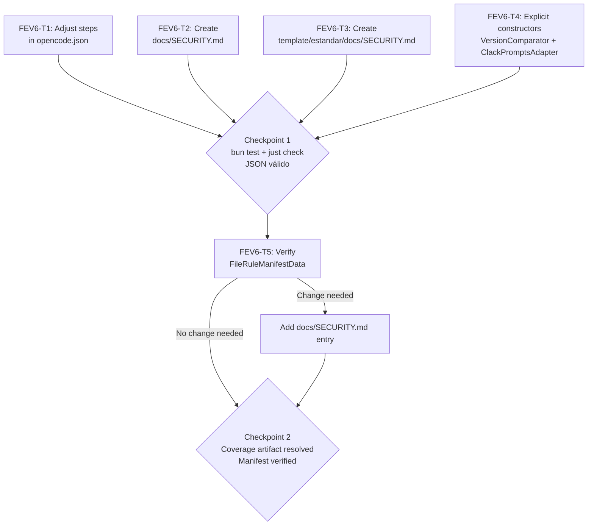

# Plan: Fase FEV-6 — Quick Configuration + Documentation (v1.1.0)

**Fecha:** 2026-07-10 | **Autor:** Moctezuma (Strategic Planner) | **Estado:** 🟡 Plan Aprobado
**Versión objetivo:** v1.1.0
**Issues principales:** #27 (steps configuration) + #28 (SECURITY.md)
**Tech Debt:** TD-1.2 (coverage artifact in VersionComparator + ClackPromptsAdapter)
**Branch:** `feat/v1.1.0-fev-6` (basada en `main`)
**Esfuerzo total estimado:** ~1.5h

---

## Overview

FEV-6 es la primera fase de v1.1.0. Contiene los items de menor esfuerzo y riesgo de toda la versión:

1. **Issue #27** — Ajustar el número de `steps` para los 6 agentes primarios (huitzilopochtli, quetzalcoatl, moctezuma, tlaloc, mictlantecuhtli, tezcatlipoca) en `template/obligatorio/opencode.json`.
2. **Issue #28** — Crear `docs/SECURITY.md` para el proyecto Códice y `template/estandar/docs/SECURITY.md` como placeholder para los usuarios del workspace.
3. **TD-1.2** — Añadir constructores explícitos a `VersionComparator` y `ClackPromptsAdapter` para resolver el artifact de coverage de Bun (funciones implícitas contadas como funciones separadas).

**Objetivo:** Cerrar 2 issues de baja/media complejidad + 1 item de tech debt sin riesgo de regresión, sentando las bases para FEV-7 (governance) y siguientes.

---

## Architecture Decisions (ADR)

| ID | Decisión | Rationale |
|----|----------|-----------|
| **ADR-FEV6-1** | T1 modifica solo el campo `steps` de cada agente | Issue #27 es explícito: "no modificar los otros parámetros, solo `steps`" |
| **ADR-FEV6-2** | T2 usa formato estándar de GitHub SECURITY.md | El template más reconocido por la comunidad (Supported Versions, Reporting, Response Process, Disclosure Policy) |
| **ADR-FEV6-3** | T3 es un placeholder que referencia al SECURITY.md del proyecto | Los usuarios personalizan el suyo propio; el placeholder indica dónde encontrar el template canónico |
| **ADR-FEV6-4** | T4 añade constructores explícitos vacíos (`constructor() {}`) | Bun cuenta constructores implícitos como funciones separadas. El constructor explícito sin lógica silencia el artifact sin cambiar comportamiento. |
| **ADR-FEV6-5** | T5 es verificación, no modificación | `docs/` ya es entrada standard con `isDirectory: true` (líneas 120-124 de `FileRuleManifestData.ts`). SECURITY.md queda automáticamente cubierto. |
| **ADR-FEV6-6** | Cada task se commitea atómicamente con Conventional Commits | Trazabilidad granular + rollback independiente. 4 commits esperados (T1-T4) + 1 commit opcional T5. |

---

## Dependency Graph


```mermaid
graph TD
    T1[FEV6-T1: Adjust steps<br/>in opencode.json] --> C1[Checkpoint 1]
    T2[FEV6-T2: Create<br/>docs/SECURITY.md] --> C1
    T3[FEV6-T3: Create<br/>template/estandar/docs/SECURITY.md] --> C1
    T4[FEV6-T4: Explicit constructors<br/>VersionComparator + ClackPromptsAdapter] --> C1
    C1{Checkpoint 1<br/>bun test + just check<br/>JSON válido} --> T5[FEV6-T5: Verify<br/>FileRuleManifestData]
    T5 -->|No change needed| C2[Checkpoint 2]
    T5 -->|Change needed| T5b[Add docs/SECURITY.md entry] --> C2
    C2{Checkpoint 2<br/>Coverage artifact resolved<br/>Manifest verified}
```

**Critical path:** T1 → Checkpoint 1 → T5 → Checkpoint 2 (≈ 30min)
**Parallelizable:** T1, T2, T3, T4 son completamente independientes — pueden ejecutarse en cualquier orden o en paralelo (4 commits atómicos).

---

## Task Breakdown

### Phase 1: Configuration (Issue #27)

#### Task FEV6-T1: Adjust `steps` for 6 primary agents in `opencode.json`

**Descripción:** Modificar el campo `steps` de los 6 agentes primarios en `template/obligatorio/opencode.json` según los valores propuestos en Issue #27. No modificar ningún otro parámetro (model, color, temperature).

**Valores actuales vs. objetivo:**

| Agente | Steps actual | Steps objetivo | Δ |
|--------|--------------|----------------|---|
| huitzilopochtli | 20 | 25 | +5 |
| quetzalcoatl | 15 | 60 | +45 |
| moctezuma | 20 | 20 | 0 |
| tlaloc | 40 | 90 | +50 |
| mictlantecuhtli | 40 | 60 | +20 |
| tezcatlipoca | 15 | 50 | +35 |

**Criterios de Aceptación:**
- [ ] `huitzilopochtli.steps` = 25
- [ ] `quetzalcoatl.steps` = 60
- [ ] `moctezuma.steps` = 20 (sin cambio, verificar)
- [ ] `tlaloc.steps` = 90
- [ ] `mictlantecuhtli.steps` = 60
- [ ] `tezcatlipoca.steps` = 50
- [ ] Ningún otro campo modificado (`model`, `color`, `temperature` intactos)
- [ ] JSON sintácticamente válido

**Verificación:**
- [ ] `bun -e "JSON.parse(require('fs').readFileSync('template/obligatorio/opencode.json', 'utf8'))"` exit code 0
- [ ] `rg "\"steps\":" template/obligatorio/opencode.json` muestra los 6 valores esperados
- [ ] `just check` — 0 errores
- [ ] `git diff template/obligatorio/opencode.json` muestra solo 6 líneas modificadas (1 por agente)

**Dependencias:** Ninguna.
**Archivos:**
- `template/obligatorio/opencode.json` (modificar líneas 348, 354, 360, 364, 372, 378)

**Scope:** XS (10min).

---

### Phase 2: Documentation (Issue #28)

#### Task FEV6-T2: Create `docs/SECURITY.md` for the Códice project

**Descripción:** Crear el archivo `docs/SECURITY.md` con la política de seguridad del proyecto Códice. Sigue el formato estándar de GitHub SECURITY.md con secciones de Supported Versions, Reporting a Vulnerability, Response Process, y Disclosure Policy.

**Estructura del archivo:**

```markdown
# Security Policy — Códice

## Supported Versions

| Version | Supported          |
| ------- | ------------------ |
| 1.1.x   | :white_check_mark: |
| 1.0.x   | :white_check_mark: |
| < 1.0   | :x:                |

## Reporting a Vulnerability

**Please do not report security vulnerabilities through public GitHub issues.**

Instead, please report them via email to: **<security-email>**

You should receive a response within 48 hours. If for some reason you do not, please follow up via email to ensure we received your original message.

## Response Process

1. **Acknowledgment** — within 48 hours
2. **Triage** — within 5 business days
3. **Fix and Disclosure** — coordinated with reporter

## Disclosure Policy

- We follow [coordinated disclosure](https://en.wikipedia.org/wiki/Coordinated_vulnerability_disclosure)
- Critical fixes are released as patch versions
- Security advisories published via GitHub Security Advisories
```

**Criterios de Aceptación:**
- [ ] Archivo `docs/SECURITY.md` existe
- [ ] Contiene secciones: Supported Versions, Reporting a Vulnerability, Response Process, Disclosure Policy
- [ ] Formato Markdown válido
- [ ] Sigue convención Keep a Changelog-style headers
- [ ] Tabla de Supported Versions con `v1.1.x` y `v1.0.x` marcadas como soportadas

**Verificación:**
- [ ] `test -f docs/SECURITY.md` exit code 0
- [ ] `rg "^## " docs/SECURITY.md` muestra 4 secciones
- [ ] `rg "Reporting a Vulnerability|Supported Versions|Response Process|Disclosure Policy" docs/SECURITY.md` → 4 matches
- [ ] Manual: el archivo es legible y accionable

**Dependencias:** Ninguna.
**Archivos:**
- `docs/SECURITY.md` (nuevo)

**Scope:** S (20min).

---

#### Task FEV6-T3: Create `template/estandar/docs/SECURITY.md` placeholder

**Descripción:** Crear el archivo `template/estandar/docs/SECURITY.md` como placeholder para los usuarios del workspace. Es un archivo estándar (categoría: standard) que se copia a `<dest>/docs/SECURITY.md` durante Clean Install y Project Install (solo si está ausente).

**Contenido del archivo:**

```markdown
# Security Policy

This is a placeholder. Replace this file with your project's security policy.

For a complete template, see: https://github.com/fisherk2/codice-opencode/blob/main/docs/SECURITY.md

## Quick Start

1. Copy the [official SECURITY.md template](https://github.com/fisherk2/codice-opencode/blob/main/docs/SECURITY.md)
2. Customize for your project (supported versions, contact email, response process)
3. Commit to your repository

## Minimum Sections

- **Supported Versions** — which versions receive security updates
- **Reporting a Vulnerability** — how to privately report issues
- **Response Process** — expected timeline
- **Disclosure Policy** — coordinated disclosure practices
```

**Criterios de Aceptación:**
- [ ] Archivo `template/estandar/docs/SECURITY.md` existe
- [ ] Contiene enlace al SECURITY.md canónico de Códice
- [ ] Contiene 4 secciones mínimas recomendadas
- [ ] Formato Markdown válido
- [ ] Longitud < 30 líneas (es un placeholder)

**Verificación:**
- [ ] `test -f template/estandar/docs/SECURITY.md` exit code 0
- [ ] `wc -l template/estandar/docs/SECURITY.md` < 30
- [ ] `rg "github.com/fisherk2/codice-opencode/blob/main/docs/SECURITY.md" template/estandar/docs/SECURITY.md` → 1 match
- [ ] Manual: el placeholder es claro y útil

**Dependencias:** Ninguna.
**Archivos:**
- `template/estandar/docs/SECURITY.md` (nuevo)

**Scope:** XS (15min).

---

### Phase 3: Code Quality (TD-1.2)

#### Task FEV6-T4: Add explicit constructors to resolve coverage artifact

**Descripción:** Añadir constructores explícitos vacíos a `VersionComparator` y `ClackPromptsAdapter`. Bun cuenta los constructores implícitos como funciones separadas en el reporte de coverage (83.33% y 93.75% respectivamente), aunque tienen 100% de line coverage. El constructor explícito sin lógica silencia el artifact.

**Código a añadir en `VersionComparator.ts`** (después de la declaración de clase, antes del primer método):

```typescript
	/**
	 * Explicit empty constructor.
	 * Present to avoid Bun's coverage tool counting an implicit constructor
	 * as an uncovered function. (REF: TECH_DEBT.md TD-1.2)
	 */
	constructor() {}
```

**Código a añadir en `ClackPromptsAdapter.ts`** (después de la declaración de clase, antes de `private spinner`):

```typescript
	/**
	 * Explicit empty constructor.
	 * Present to avoid Bun's coverage tool counting an implicit constructor
	 * as an uncovered function. (REF: TECH_DEBT.md TD-1.2)
	 */
	constructor() {}
```

**Criterios de Aceptación:**
- [ ] Constructor explícito añadido a `VersionComparator`
- [ ] Constructor explícito añadido a `ClackPromptsAdapter`
- [ ] Ambos constructores tienen JSDoc explicando el propósito
- [ ] Ningún cambio de comportamiento
- [ ] `bun test --coverage` muestra 100% functions en ambas clases

**Verificación:**
- [ ] `rg "constructor\(\) \{\}" src/domain/services/VersionComparator.ts src/infrastructure/adapters/ClackPromptsAdapter.ts` → 2 matches
- [ ] `bun test` — sin regresión (500/0)
- [ ] `bun test --coverage src/domain/services/VersionComparator.ts` → 100% functions
- [ ] `bun test --coverage src/infrastructure/adapters/ClackPromptsAdapter.ts` → 100% functions
- [ ] `just check` — 0 errores

**Dependencias:** Ninguna.
**Archivos:**
- `src/domain/services/VersionComparator.ts` (modificar — añadir constructor)
- `src/infrastructure/adapters/ClackPromptsAdapter.ts` (modificar — añadir constructor)

**Scope:** XS (15min).

---

### Phase 4: Verification (TD-1.2 + Manifest)

#### Task FEV6-T5: Verify `FileRuleManifestData` covers `docs/SECURITY.md`

**Descripción:** Verificar si la entrada `docs/` en `FileRuleManifestData.ts` (líneas 120-124) ya cubre el archivo `template/estandar/docs/SECURITY.md` creado en T3. Si SÍ (esperado), no se requiere cambio. Si NO, añadir una entrada explícita.

**Verificación de cobertura:**

```bash
# Entry actual en FileRuleManifestData.ts
rg -B 1 -A 3 "path: \"docs\"" src/domain/entities/FileRuleManifestData.ts
```

Expected output:
```typescript
{
    path: "docs",
    category: "standard",
    isDirectory: true,
    description: "Documentation directory — standard by default, with optional exceptions",
},
```

**Análisis:**
- `path: "docs"` con `isDirectory: true` → FileMergeEngine stagea todo el árbol `docs/` del template
- `template/estandar/docs/SECURITY.md` está DENTRO de `docs/` → cubierto automáticamente
- La entrada es type `standard` → comportamiento: "copy only if absent" (correcto para SECURITY.md)

**Criterios de Aceptación:**
- [ ] Verificación ejecutada: `rg "path: \"docs\"" src/domain/entities/FileRuleManifestData.ts` retorna 1 match
- [ ] Análisis documentado en el commit message
- [ ] Si NO está cubierto: entrada añadida con `path: "docs/SECURITY.md"`, `category: "standard"`, `isDirectory: false`
- [ ] Si SÍ está cubierto: solo commit de verificación, sin código

**Verificación (caso "no change needed"):**
- [ ] `bun test` — sin regresión (500/0)
- [ ] `just check` — 0 errores
- [ ] `git diff src/domain/entities/FileRuleManifestData.ts` → empty

**Verificación (caso "change needed"):**
- [ ] Nueva entrada añadida en sección "ESTÁNDAR (Standard)"
- [ ] `bun test` — sin regresión
- [ ] `just check` — 0 errores
- [ ] `rg "SECURITY" src/domain/entities/FileRuleManifestData.ts` → 1 match

**Dependencias:** FEV6-T2, FEV6-T3.
**Archivos:**
- `src/domain/entities/FileRuleManifestData.ts` (modificar condicionalmente)

**Scope:** XS (10min).

---

## Checkpoints (Quality Gates)

### Checkpoint 1: After T1, T2, T3, T4 (Configuration + Documentation + Code Quality)

- [ ] 4 commits atómicos creados (1 por task)
- [ ] `bun test` — 500 pass, 0 fail (sin regresión)
- [ ] `just check` — 0 errores (biome ci + tsc --noEmit)
- [ ] `template/obligatorio/opencode.json` JSON válido
- [ ] `docs/SECURITY.md` existe con 4 secciones
- [ ] `template/estandar/docs/SECURITY.md` existe con placeholder
- [ ] Constructores explícitos en `VersionComparator` y `ClackPromptsAdapter`
- [ ] `bun test --coverage` muestra 100% functions en ambas clases

**Bloqueante para T5:** Si Checkpoint 1 falla, NO proceder a T5.

### Checkpoint 2: After T5 (Manifest Verification)

- [ ] Análisis de cobertura del manifest documentado
- [ ] Si se requirió cambio: entrada añadida con formato correcto
- [ ] Si no se requirió cambio: commit vacío de verificación (o skip del commit)
- [ ] `bun test` — 500/0 (sin regresión)
- [ ] `just check` — 0 errores

### Gate FEV-6: Phase Complete

- [ ] 4-5 commits atómicos en `feat/v1.1.0-fev-6`
- [ ] Issue #27 resuelto: steps ajustados en 6 agentes
- [ ] Issue #28 resuelto: SECURITY.md en `docs/` y `template/estandar/docs/`
- [ ] TD-1.2 resuelto: coverage artifact eliminado
- [ ] Manifest verificado/cubierto
- [ ] Sin regresión en tests, coverage, ni `just check`

---

## Commit Strategy

Cada task se commitea independientemente con Conventional Commits:

| Commit | Tipo | Scope | Mensaje |
|--------|------|-------|---------|
| 1 | `chore` | `config` | `chore(config): adjust steps for 6 primary agents (#27)` |
| 2 | `docs` | `security` | `docs(security): add SECURITY.md to project root (#28)` |
| 3 | `docs` | `template` | `docs(template): add SECURITY.md placeholder to standard docs (#28)` |
| 4 | `refactor` | `domain` | `refactor(domain): add explicit constructors to resolve coverage artifact (TD-1.2)` |
| 5 (opcional) | `chore` | `manifest` | `chore(manifest): verify docs/SECURITY.md is covered by docs/ standard entry` |

**Co-authored-by:** Claude <noreply@anthropic.com> en cada commit.

---

## Risgos y Mitigaciones

| Riesgo | Impacto | Mitigación |
|--------|---------|------------|
| Cambio de `steps` rompe comportamiento de agentes | 🟡 Medio | Solo modificamos el campo `steps` (Issue #27 explícito). Tests verifican JSON válido. Sin lógica condicional afectada. |
| SECURITY.md placeholder se copia a proyectos sin entender | 🟢 Bajo | El placeholder es claro: "Replace this file with your project's security policy". Enlace al template canónico. |
| Constructor explícito cambia firma o comportamiento | 🟢 Bajo | Constructor vacío `constructor() {}` es funcionalmente idéntico al implícito. Sin parámetros, sin lógica. |
| T5 requiere cambio en manifest no anticipado | 🟢 Bajo | Análisis previo confirma que `docs/` ya es standard entry. Si no, cambio es trivial (1 entrada). |
| Conflicto con rama develop al hacer PR | 🟢 Bajo | Branch desde `main`, no `develop`. PR target: `develop` (FEV-5 estableció este workflow). |

---

## Métricas Objetivo

| Métrica | v1.0.14 (actual) | Meta v1.1.0 (FEV-6) |
|---------|------------------|---------------------|
| Tests (pass/fail) | 500 / 0 | 500 / 0 (sin regresión) |
| Coverage (funciones) | ~98% | ~98% (artifact resuelto) |
| Coverage (líneas) | ~97% | ~97% |
| `just check` errores | 0 | 0 |
| Steps de agentes | desbalanceados | ajustados por capacidad real |
| SECURITY.md en proyecto | no existe | existe |
| SECURITY.md en template | no existe | placeholder existe |
| Coverage artifact en VersionComparator | 83.33% | 100% |
| Coverage artifact en ClackPromptsAdapter | 93.75% | 100% |
| Commits atómicos | — | 4-5 |

---

## Resumen de Esfuerzo

| Tarea | Scope | Esfuerzo |
|-------|-------|----------|
| FEV6-T1: steps opencode.json | XS | 10min |
| FEV6-T2: docs/SECURITY.md | S | 20min |
| FEV6-T3: template SECURITY.md | XS | 15min |
| FEV6-T4: Constructores explícitos | XS | 15min |
| FEV6-T5: Verificar manifest | XS | 10min |
| Checkpoint 1 (validate) | — | 10min |
| Checkpoint 2 (validate) | — | 5min |
| Commits atómicos (4-5) | — | 10min |
| **Total** | | **~1.5h** |

---

## Open Questions (Resolved)

| # | Pregunta | Decisión |
|---|----------|----------|
| 1 | ¿T5 modifica código o solo verifica? | ✅ Solo verifica. `docs/` ya es standard entry (líneas 120-124). Si no, se añade entrada. |
| 2 | ¿SECURITY.md usa email de contacto real? | ⚠️ Pendiente: usar placeholder `<security-email>` hasta que el maintainer decida el email real. |
| 3 | ¿T2 y T3 son 1 commit o 2? | ✅ 2 commits separados (T2 y T3 son archivos independientes en ubicaciones distintas). |
| 4 | ¿T4 afecta otros lugares? | ✅ No. Constructores vacíos sin parámetros. Cambio puramente cosmético para coverage. |

---

## Post-FEV-6 (preview de FEV-7)

FEV-6 sienta las bases para FEV-7 (Agent Governance & Security Hardening), que:
- Modificará los 6 agentes primarios (Issue #26) — los mismos cuyos `steps` acabamos de ajustar
- Añadirá restricciones de comandos destructivos (Issue #30) — relacionado con el SECURITY.md que acabamos de crear

Ambos phases (FEV-6 + FEV-7) son **complementarios y secuenciales**: config → governance.

---

*Última actualización: 2026-07-10*
