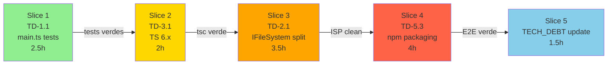

# Plan: Fase FEV-10 — Code Quality + Dependency Upgrades (v1.1.0)

**Fecha:** 2026-07-10 | **Autor:** Moctezuma (Strategic Planner) | **Estado:** 🟢 Aprobado
**Versión objetivo:** v1.1.0 (cierre de fase)
**Items TECH_DEBT cubiertos:** TD-1.1, TD-2.1, TD-3.1, TD-3.2, TD-5.3
**Branch:** `feat/v1.1.0-fev-10`

## Resumen

Última fase de v1.1.0. Contiene los items de mayor esfuerzo y riesgo del catálogo TECH_DEBT: cobertura de `main.ts`, upgrade de TypeScript 6.x, split del port `IFileSystem` para cumplir ISP, y test de integración para empaquetado npm.

**Decisiones arquitectónicas confirmadas:**
- **Orden por riesgo creciente:** foundation → upgrade → refactor → e2e.
- **TD-2.1 split scope:** Opción A — solo 4 métodos de staging migran a `IStagingSystem`.

---

## Estado Actual (línea base verificada)

| Métrica | Valor | Fuente |
|---|---|---|
| Tests | 563 pass, 0 fail, 1204 expects | `bun test tests/` |
| Coverage (funciones) | 98.89% | `bun test --coverage` |
| Coverage (líneas) | 96.98% | `bun test --coverage` |
| `src/cli/main.ts` coverage | 33.04% (líneas 85, 93-165) | idem |
| `IFileSystem` port | 10 métodos | `src/domain/ports/IFileSystem.ts` |
| TypeScript | `^5.9.3` | `package.json` |
| Biome | `^2.5.3` (schema `2.5.0`) | `package.json` + `biome.json` |

**Items ya completados antes de FEV-10:**
- ✅ **TD-3.2** Biome 1.x → 2.x — `package.json: @biomejs/biome: ^2.5.3`, schema `2.5.0`
- 🟡 **TD-1.1** (parcial) — `tests/integration/cli/main.test.ts` (166 líneas) cubre `runMode`, `createDependencies`, `promptForMode`; **faltan**: flag handling, parse failure, SIGINT, interactive mode, error path

---

## Restricciones

- **Clean Architecture:** `infrastructure → application → domain`. Domain no importa nada de application o infrastructure.
- **ISP compliance:** Ningún port debe tener > 6 métodos cohesivos.
- **Sin regresión:** 563/0 tests, 98.89% funciones, 15/15 E2E.
- **Coverage artifact:** `main.ts` ≥ 95% lines al cierre.
- **Conventional Commits** con `Co-Authored-By: <Agente> <dev@fisherk2.com>`.

---

## Dependency Graph


```mermaid
graph LR
    S1["Slice 1<br/>TD-1.1<br/>main.ts tests<br/>2.5h"]
    S2["Slice 2<br/>TD-3.1<br/>TS 6.x<br/>2h"]
    S3["Slice 3<br/>TD-2.1<br/>IFileSystem split<br/>3.5h"]
    S4["Slice 4<br/>TD-5.3<br/>npm packaging<br/>4h"]
    S5["Slice 5<br/>TECH_DEBT update<br/>1.5h"]

    S1 -->|tests verdes| S2
    S2 -->|tsc verde| S3
    S3 -->|ISP clean| S4
    S4 -->|E2E verde| S5

    style S1 fill:#90EE90
    style S2 fill:#FFD700
    style S3 fill:#FFA500
    style S4 fill:#FF6347
    style S5 fill:#87CEEB
```

**Total esfuerzo:** ~13.5h distribuidas en 4-5 sesiones.

---

## Descomposición de Tareas (4 Vertical Slices + Cierre)

### Slice 1 — TD-1.1: main.ts Integration Tests (Foundation, riesgo bajo)

**Patrón:** TDD (cubrir lo que existe, no cambiar producción).
**Criterio:** Llevar `src/cli/main.ts` de 33.04% → ≥95% line coverage.

#### Task 1.1: Cubrir flag handling `--version`/`-V` y `--help`/`-h`
**Acceptance criteria:**
- [ ] Test cubre `args.includes("--version") || args.includes("-V")` → `printVersion()` + `process.exit(EXIT_SUCCESS)`
- [ ] Test cubre `args.includes("--help") || args.includes("-h")` → `printHelp()` + `process.exit(EXIT_SUCCESS)`
- [ ] Test verifica que `parseArgs` NO se llama cuando flag terminal está presente
**Verification:** `bun test tests/integration/cli/main.test.ts` — nuevo test verde
**Files:** `tests/integration/cli/main.test.ts`
**Estimated scope:** XS (~30min)

#### Task 1.2: Cubrir parse failure
**Acceptance criteria:**
- [ ] Test cubre `parseArgs(args) === null` → `console.error("Usage error...")` + `process.exit(EXIT_USAGE)`
- [ ] Test verifica que el mensaje de error es accionable
**Verification:** idem
**Files:** `tests/integration/cli/main.test.ts`
**Estimated scope:** XS (~20min)

#### Task 1.3: Cubrir SIGINT handler
**Acceptance criteria:**
- [ ] Test cubre `process.on("SIGINT", handleSigint)` setup + `handleSigint()` invocation
- [ ] Test cubre doble SIGINT (idempotente: `if (interrupted) return`)
- [ ] Test cubre `process.exit(EXIT_INTERRUPT)` después del primer SIGINT
**Verification:** idem
**Files:** `tests/integration/cli/main.test.ts`
**Estimated scope:** S (~30min)

#### Task 1.4: Cubrir interactive mode flow
**Acceptance criteria:**
- [ ] Test cubre `mode === "interactive"` → `showIntro()` + `promptForMode()`
- [ ] Test cubre `selected === null` → `showCancel("Installation cancelled.")` + `process.exit(EXIT_INTERRUPT)`
- [ ] Test cubre selección válida (`"clean"`, `"project"`, `"update"`) → resolución a `executionMode`
**Verification:** idem
**Files:** `tests/integration/cli/main.test.ts`
**Estimated scope:** S (~30min)

#### Task 1.5: Cubrir success/error path
**Acceptance criteria:**
- [ ] Test cubre `result.ok === false` → `showError(result.error.message)` + `process.exit(EXIT_ERROR)`
- [ ] Test cubre `result.ok === true` → `process.exit(EXIT_SUCCESS)` (sin showError)
**Verification:** idem
**Files:** `tests/integration/cli/main.test.ts`
**Estimated scope:** XS (~20min)

#### Task 1.6: Cubrir catch + finally
**Acceptance criteria:**
- [ ] Test cubre throw de un error unexpected → `console.error("Fatal error: ...")` + `process.exit(EXIT_ERROR)`
- [ ] Test cubre `finally` block: `process.off("SIGINT", handleSigint)` se ejecuta siempre
**Verification:** idem
**Files:** `tests/integration/cli/main.test.ts`
**Estimated scope:** XS (~20min)

#### Task 1.7: Verificación Checkpoint A
**Acceptance:**
- [ ] `src/cli/main.ts` coverage ≥ 95% lines
- [ ] 0 regresión en tests (563 → ≥575)
- [ ] `just check` exit 0
**Verification commands:**
```bash
bun test tests/integration/cli/main.test.ts
bun test --coverage src/cli/main.ts    # ≥95% lines
just check                             # 0 errors
```

---

### Slice 2 — TD-3.1: TypeScript 6.x Upgrade (Foundation, riesgo medio)

**Patrón:** Aditivo (cambiar range en `package.json`, verificar compilación).
**Criterio:** Compilación limpia con TypeScript 6.x, 0 breaking changes sin resolver.

#### Task 2.1: Verificar versión actual disponible de TS 6.x
**Acceptance criteria:**
- [ ] Confirmar que TS 6.x es estable y apropiado para producción
- [ ] Identificar breaking changes principales (decorators, module resolution, type inference)
**Verification:** docs oficiales + `npm view typescript versions`
**Files:** (n/a)
**Estimated scope:** XS (~10min)

#### Task 2.2: Bump version en package.json
**Acceptance criteria:**
- [ ] `"typescript": "^5.9.3"` → `"^6"`
- [ ] Commit con mensaje: `chore(deps): upgrade typescript to v6.x`
**Verification:** `git diff package.json`
**Files:** `package.json`
**Estimated scope:** XS (~5min)

#### Task 2.3: `bun install` + `just check` para detectar breaking changes
**Acceptance criteria:**
- [ ] `bun install` exit 0
- [ ] `just check` exit 0 (sin errores de tipo introducidos)
- [ ] Si hay errores: documentar en `docs/diagnosis/` y resolver en Task 2.4
**Verification:** comandos arriba
**Files:** (varios si hay fixes)
**Estimated scope:** S (~30min)

#### Task 2.4: Resolver errores de tipo introducidos por TS 6.x
**Acceptance criteria:**
- [ ] 0 errores de `tsc --noEmit`
- [ ] Si hay cambios no triviales, documentar en `docs/diagnosis/fixTS6-migration.md`
**Verification:** `just check` exit 0
**Files:** (varios según errores)
**Estimated scope:** M (~60min)

#### Task 2.5: Verificar suite completa
**Acceptance criteria:**
- [ ] `bun test tests/` 563/0 pass
- [ ] E2E 15/15 passing (`just test-e2e`)
**Verification:** comandos arriba
**Files:** (n/a)
**Estimated scope:** XS (~10min)

#### Task 2.6: Verificación Checkpoint B
**Acceptance:**
- [ ] `tsc --version` ≥ 6.0
- [ ] `just check` exit 0
- [ ] Tests sin regresión (563/0)

---

### Slice 3 — TD-2.1: IFileSystem → IFileSystem + IStagingSystem (Architectural, riesgo medio)

**Patrón aplicado (de `design-patterns/SKILL.md` + `clean-ddd-hexagonal/SKILL.md`):**
- **Interface Segregation Principle (ISP):** separar concerns cohesivos en ports distintos
- **Facade:** `BunFileSystem` se mantiene como fachada que implementa ambos ports
- **Composition:** `BunFileSystem` ya compone `AtomicStager`; expone 2 caras (IFileSystem + IStagingSystem)

**Decisión arquitectónica confirmada (Opción A):** Solo los 4 métodos que **mutan via staging** migran a `IStagingSystem`. `destinationExists()` se queda en `IFileSystem` (lee estado del destino, no escribe).

#### Task 3.1: Crear `IStagingSystem` port en domain
**Acceptance criteria:**
- [ ] Archivo `src/domain/ports/IStagingSystem.ts` con 4 métodos:
  - `getStagingPath(relativePath: string): string`
  - `stageFile(relativePath: string, excludeSubDirs?: Set<string>): Promise<void>`
  - `commitStaging(): Promise<void>`
  - `cleanStaging(): Promise<void>`
- [ ] JSDoc por método con `@param`, `@returns`, descripción de uso
- [ ] Cohesión 100%: los 4 métodos son sobre el ciclo de vida del staging
**Verification:** `tsc --noEmit` exit 0
**Files:** `src/domain/ports/IStagingSystem.ts` (nuevo)
**Estimated scope:** S (~20min)

#### Task 3.2: Reducir `IFileSystem` a 6 métodos
**Acceptance criteria:**
- [ ] `IFileSystem` queda con: `readTemplateFile`, `destinationExists`, `isWritable`, `isEmpty`, `writeVersionFile`, `readVersionFile`
- [ ] Eliminar los 4 métodos de staging
- [ ] JSDoc actualizado
**Verification:** `tsc --noEmit` reportará errores en `BunFileSystem` (esperado) hasta T3.3
**Files:** `src/domain/ports/IFileSystem.ts`
**Estimated scope:** XS (~10min)

#### Task 3.3: `BunFileSystem implements IFileSystem, IStagingSystem`
**Acceptance criteria:**
- [ ] Agregar `implements IFileSystem, IStagingSystem` a la declaración de clase
- [ ] Verificar que los 4 métodos de staging ya existen como delegates a `atomicStager`
- [ ] `tsc --noEmit` exit 0
**Verification:** `just check` exit 0
**Files:** `src/infrastructure/adapters/BunFileSystem.ts`
**Estimated scope:** S (~20min)

#### Task 3.4: Cambiar firma de `FileMergeEngine` y `helpers.ts`
**Acceptance criteria:**
- [ ] `FileMergeEngine` constructor acepta `IFileSystem & IStagingSystem` (intersection type)
- [ ] `helpers.ts` (función que llama `cleanStaging()`) acepta `IStagingSystem`
- [ ] `tsc --noEmit` exit 0
**Verification:** idem
**Files:**
- `src/domain/services/FileMergeEngine.ts`
- `src/application/helpers.ts`
**Estimated scope:** S (~30min)

#### Task 3.5: Cambiar constructores de los 3 use cases
**Acceptance criteria:**
- [ ] `CleanInstallUseCase`, `ProjectInstallUseCase`, `UpdateWorkspaceUseCase` aceptan `IFileSystem & IStagingSystem` (o solo `IStagingSystem` si solo usan staging)
- [ ] Para Clean/Project: ambos ports (usan `fileSystem` para queries + `stagingSystem` para mutaciones)
- [ ] Para Update: solo `IStagingSystem` (Update solo muta, no lee template)
- [ ] `tsc --noEmit` exit 0
**Verification:** idem
**Files:**
- `src/application/use-cases/CleanInstallUseCase.ts`
- `src/application/use-cases/ProjectInstallUseCase.ts`
- `src/application/use-cases/UpdateWorkspaceUseCase.ts`
**Estimated scope:** S (~30min)

#### Task 3.6: Actualizar `container.ts`
**Acceptance criteria:**
- [ ] `createDependencies` pasa la misma instancia `BunFileSystem` casteada a `IStagingSystem` a los use cases que lo necesitan
- [ ] No se cambia la firma pública de `createDependencies` (no rompe consumidores)
- [ ] `tsc --noEmit` exit 0
**Verification:** idem
**Files:** `src/cli/container.ts`
**Estimated scope:** S (~15min)

#### Task 3.7: Tests: `bun-file-system.test.ts` — verificar IStagingSystem conformance
**Acceptance criteria:**
- [ ] Agregar test que verifica `BunFileSystem` satisface `IStagingSystem` (compile-time check + runtime)
- [ ] Tests existentes sin regresión
**Verification:** `bun test tests/integration/adapters/bun-file-system.test.ts` 100% pass
**Files:** `tests/integration/adapters/bun-file-system.test.ts`
**Estimated scope:** XS (~20min)

#### Task 3.8: Tests: `main.test.ts` mock — añadir IStagingSystem
**Acceptance criteria:**
- [ ] `createMockDeps` ahora devuelve un objeto con `fileSystem: IFileSystem & IStagingSystem` (o dos propiedades separadas según cómo se decida en T3.6)
- [ ] Tests existentes sin regresión
**Verification:** `bun test tests/integration/cli/main.test.ts` 100% pass
**Files:** `tests/integration/cli/main.test.ts`
**Estimated scope:** XS (~15min)

#### Task 3.9: Verificación Checkpoint C
**Acceptance:**
- [ ] `just check` exit 0
- [ ] `bun test tests/` ≥563/0 pass
- [ ] `just test-e2e` 15/15 passing
- [ ] ADR-011 creado: `specs/adr/adr-011-ifilesystem-split.md`
**Verification commands:**
```bash
just check
bun test tests/
just test-e2e
rg "interface IFileSystem" src/domain/ports/IFileSystem.ts -A 20 | grep -c "^\s*\w*("   # ≤6 métodos
```

#### Task 3.10: ADR-011: Split IFileSystem
**Acceptance criteria:**
- [ ] Documento `specs/adr/adr-011-ifilesystem-split.md` con:
  - **Contexto:** IFileSystem tiene 10 métodos (umbral ISP: 5)
  - **Decisión:** Split en IFileSystem (6 métodos) + IStagingSystem (4 métodos)
  - **Consecuencias:** BunFileSystem implementa ambos; use cases inyectan según necesidad
  - **Alternativas consideradas:** Opción B (incluir destinationExists), Opción C (diferir)
- [ ] CHANGELOG entry en v1.1.0
**Verification:** commit con `docs(adr): add ADR-011 for IFileSystem split`
**Files:**
- `specs/adr/adr-011-ifilesystem-split.md` (nuevo)
- `CHANGELOG.md`
**Estimated scope:** S (~30min)

---

### Slice 4 — TD-5.3: npm Packaging Integration Test (Quality gate, riesgo medio-alto)

**Patrón aplicado:** **Template Method** (build → install → run → assert) + **Fixture Pattern** (tarball pre-empaquetado como fallback offline).

**Criterio:** Test automatizado que valida el comportamiento del paquete npm después de empaquetar (catches FEV-2-B y FEV-2-C bugs **antes** del release).

#### Task 4.1: Setup: helper `packTarball()`
**Acceptance criteria:**
- [ ] Función helper que ejecuta `bun pm pack` o `npm pack` en temp dir
- [ ] Captura el path del tarball generado
- [ ] Skip automático si `SKIP_NETWORK_TESTS=1`
**Verification:** helper testeable independientemente
**Files:** `tests/integration/packaging/packaging-helpers.ts` (nuevo)
**Estimated scope:** S (~30min)

#### Task 4.2: Setup: helper `extractAndInspect()`
**Acceptance criteria:**
- [ ] Extrae tarball a temp dir
- [ ] Verifica estructura mínima esperada: `template/`, `package.json`, `bin`
- [ ] Retorna metadata para los tests
**Verification:** idem
**Files:** `tests/integration/packaging/packaging-helpers.ts`
**Estimated scope:** S (~30min)

#### Task 4.3: Test A — `npm pack --dry-run` lista archivos esperados
**Acceptance criteria:**
- [ ] Test verifica que el tarball incluye: `template/obligatorio/opencode.json`, `template/obligatorio/agents/`, `template/obligatorio/commands/`, `template/estandar/gitignore` (renombrado para evitar exclusion de npm)
- [ ] Test verifica que NO incluye: `template/estandar/.gitignore`, `template/obligatorio/.opencode/.gitignore`
**Verification:** test verde
**Files:** `tests/integration/packaging/npm-pack.test.ts` (nuevo)
**Estimated scope:** S (~30min)

#### Task 4.4: Test B — Install tarball + ejecutar binary `--version`
**Acceptance criteria:**
- [ ] Test instala tarball en `node_modules/@fisherk2-dev/codice-test/`
- [ ] Test ejecuta `node node_modules/@fisherk2-dev/codice-test/dist/codice-linux --version` (o `bun run src/cli/bin.js --version`)
- [ ] Test verifica exit code 0 y output esperado
**Verification:** test verde
**Files:** `tests/integration/packaging/npm-pack.test.ts`
**Estimated scope:** M (~60min)

#### Task 4.5: Test C — Ejecutar modo `clean` desde paquete instalado
**Acceptance criteria:**
- [ ] Test ejecuta `clean` mode en temp dir
- [ ] Verifica que template resolution funciona (no `Template file not found`)
- [ ] Verifica que `.gitignore` se genera post-installation
- [ ] Verifica que symlinks se generan post-installation
**Verification:** test verde
**Files:** `tests/integration/packaging/npm-pack.test.ts`
**Estimated scope:** M (~60min)

#### Task 4.6: Test D — Verificar que symlinks NO están en el tarball
**Acceptance criteria:**
- [ ] Test verifica que el tarball NO contiene symlinks en `template/`
- [ ] Documenta que los symlinks se generan post-installation (per ADR-008)
**Verification:** test verde
**Files:** `tests/integration/packaging/npm-pack.test.ts`
**Estimated scope:** XS (~20min)

#### Task 4.7: Test E — Verificar que `.gitignore` no está en el tarball
**Acceptance criteria:**
- [ ] Test verifica que el tarball NO contiene `template/estandar/.gitignore` (npm lo excluye)
- [ ] Verifica que SÍ contiene `template/estandar/gitignore` (renombrado, sin dot)
- [ ] Documenta que `.gitignore` se genera post-installation (per ADR-009)
**Verification:** test verde
**Files:** `tests/integration/packaging/npm-pack.test.ts`
**Estimated scope:** XS (~20min)

#### Task 4.8: Wire-up CI — nuevo job en `ci.yml`
**Acceptance criteria:**
- [ ] Job `test-packaging` en `.github/workflows/ci.yml`
- [ ] Ejecuta solo en Linux (más rápido, evita flakiness de macOS/Windows en tarball extraction)
- [ ] Setup: `bun install` + ejecutar `bun test tests/integration/packaging/`
- [ ] Timeout: 5min (los tests de packaging son lentos)
**Verification:** CI pasa
**Files:** `.github/workflows/ci.yml`
**Estimated scope:** S (~20min)

#### Task 4.9: Documentación en CONTRIBUTING.md
**Acceptance criteria:**
- [ ] Sección "Packaging tests" añadida en `CONTRIBUTING.md`
- [ ] Documenta: cómo correr localmente, cuándo se skip (`SKIP_NETWORK_TESTS=1`), interpretación de fallos
**Verification:** `rg "Packaging tests" CONTRIBUTING.md` → 1 match
**Files:** `CONTRIBUTING.md`
**Estimated scope:** XS (~15min)

#### Task 4.10: Verificación Checkpoint D
**Acceptance:**
- [ ] 5 nuevos tests pasan localmente
- [ ] Job CI agregado
- [ ] Coverage de Slices 1-4 sin regresión
**Verification commands:**
```bash
bun test tests/integration/packaging/   # 5/5 passing
just check                              # 0 errors
just test-e2e                           # 15/15
```

---

### Slice 5 — TECH_DEBT.md Update + Release Prep (Cierre, riesgo bajo)

#### Task 5.1: Mover TD-3.2 a "Resolved"
**Acceptance criteria:**
- [ ] Sección `## Resolved` con TD-3.2 fechada 2026-07-10
**Files:** `docs/TECH_DEBT.md`
**Estimated scope:** XS (~5min)

#### Task 5.2: Mover TD-1.1, TD-2.1, TD-3.1, TD-5.3 a "Resolved"
**Acceptance criteria:**
- [ ] 4 items con fecha, commit ref, métricas verificadas
**Files:** `docs/TECH_DEBT.md`
**Estimated scope:** XS (~10min)

#### Task 5.3: Actualizar `docs/WORKFLOW.md` con resumen FEV-10
**Acceptance criteria:**
- [ ] Sección FEV-10 marcada ✅ Completo
- [ ] Métricas finales, commits, code review findings
**Files:** `docs/WORKFLOW.md`
**Estimated scope:** S (~20min)

#### Task 5.4: CHANGELOG entries v1.1.0 FEV-10
**Acceptance criteria:**
- [ ] Sección `v1.1.0` con entries de FEV-10
- [ ] Categorías: Added, Changed, Fixed
**Files:** `CHANGELOG.md`
**Estimated scope:** XS (~15min)

#### Task 5.5: Tag + release v1.1.0
**Acceptance criteria:**
- [ ] PR `feat/v1.1.0-fev-10` → `develop` (squash merge)
- [ ] PR `develop` → `main` (squash merge)
- [ ] Tag `v1.1.0` creado y pusheado
- [ ] Release workflow publica binarios + npm
- [ ] `npm view @fisherk2-dev/codice@latest version` → `1.1.0`
**Files:** (git + npm)
**Estimated scope:** S (~20min)

#### Task 5.6: Verificación Checkpoint E (cierre v1.1.0)
**Acceptance:**
- [ ] `git tag v1.1.0 && git push --tags` exit 0
- [ ] `npm view @fisherk2-dev/codice@latest version` → `1.1.0`
- [ ] GitHub Release visible con 3 binarios
**Verification commands:**
```bash
git tag v1.1.0 && git push --tags
npm view @fisherk2-dev/codice@latest version
```

---

## Quality Gates Summary

### Checkpoint A (post Slice 1)
```bash
bun test tests/integration/cli/main.test.ts   # 100% pass
bun test --coverage src/cli/main.ts            # ≥95% lines
just check                                      # 0 errors
```

### Checkpoint B (post Slice 2)
```bash
tsc --version                                   # ≥ 6.0
just check                                      # 0 errors
bun test tests/                                  # 563/0 pass
```

### Checkpoint C (post Slice 3)
```bash
just check                                      # 0 errors
bun test tests/                                  # ≥563/0 pass
just test-e2e                                    # 15/15 passing
rg -c "^\s*\w*(\w*\(|\w*):" src/domain/ports/IFileSystem.ts   # ≤6
```

### Checkpoint D (post Slice 4)
```bash
bun test tests/integration/packaging/           # 5/5 passing
just check                                       # 0 errors
just test-e2e                                    # 15/15
```

### Checkpoint E (post Slice 5, cierre v1.1.0)
```bash
git tag v1.1.0 && git push --tags                # exit 0
npm view @fisherk2-dev/codice@latest version     # 1.1.0
```

---

## Métricas Finales Esperadas

| Métrica | Actual (v1.1.0-FEV-9) | Meta FEV-10 | v1.1.0 Final |
|---|---|---|---|
| Tests (pass/fail) | 563 / 0 | ≥580 / 0 | ≥580 / 0 |
| main.ts coverage (lines) | 33.04% | ≥95% | ≥95% |
| Coverage (funciones) | 98.89% | ≥98.5% | ≥98.5% |
| Coverage (líneas) | 96.98% | ≥97% | ≥97% |
| IFileSystem métodos | 10 | ≤6 | ≤6 |
| IStagingSystem métodos | (no existe) | 4 | 4 |
| TypeScript | 5.9.x | 6.x | 6.x |
| Biome | 2.5.x | 2.5.x (mantener) | 2.5.x |
| E2E escenarios | 15/15 | 15/15 | 15/15 |
| Packaging tests | 0 | 5 | 5 |
| `just check` errores | 0 | 0 | 0 |
| TECH_DEBT items abiertos | 5 | 0 | 0 |

---

## Patrones de Diseño Aplicados

| Patrón | Slice | Aplicación |
|---|---|---|
| **TDD / Mock Injection** | S1 | Cobertura de `main.ts` con mocks de `Dependencies` |
| **Template Method** | S4 | Packaging test: build → install → run → assert |
| **Facade** | S3 | `BunFileSystem` implementa ambos ports (IFileSystem + IStagingSystem) |
| **Interface Segregation** | S3 | 4 métodos de staging cohesionan en `IStagingSystem` |
| **Composition Over Inheritance** | S3 | `BunFileSystem` compone `AtomicStager` y `TemplateResolver` (sin herencia) |
| **Dependency Injection** | S3 | `container.ts` wires ambos ports a los use cases |
| **Fixture Pattern** | S4 | Tarball pre-empaquetado como fallback offline |
| **Strategy** | S3 | Los 4 métodos de staging forman una estrategia cohesiva |
| **Repository per Aggregate** | S3 | Análogo: "one port per aggregate cohesion" (clean-ddd-hexagonal) |

---

## Riesgos y Mitigaciones

| Riesgo | Probabilidad | Impacto | Mitigación |
|---|---|---|---|
| TS 6.x introduce breaking changes no detectadas | Media | Alto | Slice 2 aislado, ANTES del refactor TD-2.1 |
| IFileSystem split rompe 3 use cases (constructor signatures) | Media | Medio | T3.4-T3.6 en una sola sesión con `tsc --noEmit` continuo |
| `BunFileSystem implements IFileSystem, IStagingSystem` requiere sintaxis TS válida para intersection types | Baja | Bajo | Verificar con `tsc --noEmit` antes de continuar |
| npm packaging test es lento (>60s) | Media | Bajo | Marcar como `@slow`; ejecutar solo en CI, no local por default |
| `bun pm pack` o `npm pack` no disponible offline | Baja | Medio | Usar fixture local de tarball si network falla |
| `BunFileSystem` cambios rompen E2E tests | Baja | Alto | E2E en Checkpoint C; rollback si falla |
| Tests de packaging flaky en CI | Media | Medio | Solo Linux; timeout 5min; retry policy |

---

## Out of Scope (explícitamente NO en este plan)

- ❌ Cambios en `template/` (FEV-9 ya consolidó el template)
- ❌ Nuevos MCP servers (cubierto por FEV-9)
- ❌ Binary size reduction (TECH_DEBT 7.1 — futuro v1.2.0+)
- ❌ E2E coverage instrumentation (TECH_DEBT 5.1 — futuro v1.2.0+)
- ❌ Performance benchmarks (TECH_DEBT 5.2 — futuro v1.2.0+)
- ❌ Estandar directory tree-diffing (TECH_DEBT 6.2 — futuro v1.2.0+)
- ❌ Refactor de otros ports (IUserPrompt, IGitHubClient, etc.) — no en TECH_DEBT

---

## Orden de Ejecución y Dependencias

```
T1.1 (flag handling)
T1.2 (parse failure)         ─┐
T1.3 (SIGINT)                │ paralelizables
T1.4 (interactive mode)      │ en la misma sesión
T1.5 (success/error)         │
T1.6 (catch + finally)       ─┘
 ↓
T1.7 (Checkpoint A verification)
 ↓
T2.1 (verificar TS 6.x)
T2.2 (bump version)          ──── Slice 2 completo antes de Slice 3
T2.3 (bun install + check)
T2.4 (resolver breaking changes)
T2.5 (verificar tests)
 ↓
T2.6 (Checkpoint B verification)
 ↓
T3.1 (IStagingSystem nuevo)
T3.2 (reducir IFileSystem)
T3.3 (BunFileSystem implements)     ──── Slice 3 completo antes de Slice 4
T3.4 (FileMergeEngine + helpers)
T3.5 (3 use cases)
T3.6 (container)
T3.7 (bun-file-system test)
T3.8 (main.test mock)
 ↓
T3.9 (Checkpoint C verification)
 ↓
T3.10 (ADR-011 + CHANGELOG)
 ↓
T4.1 (packTarball helper)
T4.2 (extractAndInspect helper)
T4.3 (Test A: dry-run)
T4.4 (Test B: install + --version)  ──── Slice 4 completo antes de Slice 5
T4.5 (Test C: clean mode)
T4.6 (Test D: no symlinks in tarball)
T4.7 (Test E: no .gitignore in tarball)
T4.8 (CI job)
T4.9 (CONTRIBUTING.md)
 ↓
T4.10 (Checkpoint D verification)
 ↓
T5.1 (TECH_DEBT TD-3.2)
T5.2 (TECH_DEBT otros 4)
T5.3 (WORKFLOW.md)
T5.4 (CHANGELOG)
T5.5 (tag + release)
 ↓
T5.6 (Checkpoint E verification)
```

---

## Verificación Post-Implementación

| Check | Comando | Criterio |
|---|---|---|
| Tests sin regresión | `bun test tests/` | ≥580 / 0 |
| main.ts coverage | `bun test --coverage src/cli/main.ts` | ≥95% lines |
| Coverage global | `bun test --coverage` | ≥98.5% funciones, ≥97% líneas |
| IFileSystem methods | `rg -c "^\s*[a-z]\w*\s*\(" src/domain/ports/IFileSystem.ts` | ≤6 |
| IStagingSystem methods | `rg -c "^\s*[a-z]\w*\s*\(" src/domain/ports/IStagingSystem.ts` | =4 |
| BunFileSystem implements | `rg "implements" src/infrastructure/adapters/BunFileSystem.ts` | `IFileSystem, IStagingSystem` |
| TypeScript version | `tsc --version` | ≥ 6.0 |
| Packaging tests | `bun test tests/integration/packaging/` | 5/5 |
| E2E | `just test-e2e` | 15/15 |
| Biome lint | `just lint` | 0 errors |
| Tech debt open | `rg "^\|" docs/TECH_DEBT.md \| grep -c "🟡\|🔴"` | 0 |
| ADRs documentados | `ls specs/adr/adr-011*` | existe |
| Release tag | `git tag -l "v1.1.0"` | existe |
| npm latest | `npm view @fisherk2-dev/codice@latest version` | `1.1.0` |

---

## Progreso (a llenar durante implementación)

| Slice | Tarea | Estado | Commit |
|---|---|---|---|
| 1 | T1.1 — flag handling | 🟡 Pendiente | — |
| 1 | T1.2 — parse failure | 🟡 Pendiente | — |
| 1 | T1.3 — SIGINT | 🟡 Pendiente | — |
| 1 | T1.4 — interactive mode | 🟡 Pendiente | — |
| 1 | T1.5 — success/error | 🟡 Pendiente | — |
| 1 | T1.6 — catch + finally | 🟡 Pendiente | — |
| 1 | T1.7 — Checkpoint A | 🟡 Pendiente | — |
| 2 | T2.1 — verify TS 6.x | 🟡 Pendiente | — |
| 2 | T2.2 — bump version | 🟡 Pendiente | — |
| 2 | T2.3 — bun install + check | 🟡 Pendiente | — |
| 2 | T2.4 — resolve breaking | 🟡 Pendiente | — |
| 2 | T2.5 — verify tests | 🟡 Pendiente | — |
| 2 | T2.6 — Checkpoint B | 🟡 Pendiente | — |
| 3 | T3.1 — IStagingSystem port | 🟡 Pendiente | — |
| 3 | T3.2 — reducir IFileSystem | 🟡 Pendiente | — |
| 3 | T3.3 — BunFileSystem implements | 🟡 Pendiente | — |
| 3 | T3.4 — FileMergeEngine + helpers | 🟡 Pendiente | — |
| 3 | T3.5 — 3 use cases | 🟡 Pendiente | — |
| 3 | T3.6 — container | 🟡 Pendiente | — |
| 3 | T3.7 — bun-file-system test | 🟡 Pendiente | — |
| 3 | T3.8 — main.test mock | 🟡 Pendiente | — |
| 3 | T3.9 — Checkpoint C | 🟡 Pendiente | — |
| 3 | T3.10 — ADR-011 + CHANGELOG | 🟡 Pendiente | — |
| 4 | T4.1 — packTarball helper | 🟡 Pendiente | — |
| 4 | T4.2 — extractAndInspect helper | 🟡 Pendiente | — |
| 4 | T4.3 — Test A: dry-run | 🟡 Pendiente | — |
| 4 | T4.4 — Test B: install + --version | 🟡 Pendiente | — |
| 4 | T4.5 — Test C: clean mode | 🟡 Pendiente | — |
| 4 | T4.6 — Test D: no symlinks | 🟡 Pendiente | — |
| 4 | T4.7 — Test E: no .gitignore | 🟡 Pendiente | — |
| 4 | T4.8 — CI job | 🟡 Pendiente | — |
| 4 | T4.9 — CONTRIBUTING.md | 🟡 Pendiente | — |
| 4 | T4.10 — Checkpoint D | 🟡 Pendiente | — |
| 5 | T5.1 — TECH_DEBT TD-3.2 | 🟡 Pendiente | — |
| 5 | T5.2 — TECH_DEBT otros 4 | 🟡 Pendiente | — |
| 5 | T5.3 — WORKFLOW.md | 🟡 Pendiente | — |
| 5 | T5.4 — CHANGELOG entries | 🟡 Pendiente | — |
| 5 | T5.5 — tag + release | 🟡 Pendiente | — |
| 5 | T5.6 — Checkpoint E | 🟡 Pendiente | — |

---

## Suggested Next Step

> El plan está listo. Run `/build` para iniciar la implementación del Slice 1 (Task 1.1: flag handling en `main.test.ts`).
