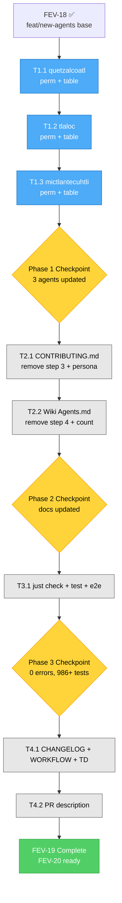
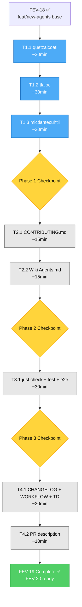

# Implementation Plan: FEV-19 — Permission Unification & Subagent Table Removal (v2.0 Phase 3)

**Phase:** FEV-19 (v2.0 Phase 3) — 🔲 Planificado
**Scope:** Unificar permisos `task:` de 4 agentes primarios delegadores a patrón `"*": allow` + deny 5 primarios. Eliminar secciones redundantes "AVAILABLE SUBAGENTS" de 3 agentes. Actualizar `CONTRIBUTING.md` y `docs/wiki-source/Agents.md` para reflejar el nuevo modelo.
**Spec:** [specs/spec-agent-packs.md §4](../specs/spec-agent-packs.md), [ADR-014](../specs/adr/adr-014-agent-pack-system.md), [docs/WORKFLOW.md §FEV-19](../docs/WORKFLOW.md)
**Tech Debt:** TD-V2-2, TD-V2-3, TD-V2-4
**Date:** 2026-08-05
**Author:** Moctezuma (Strategic Planner)
**Branch:** `feat/new-agents` (continúa de FEV-17 + FEV-18 ✅; usuario confirmó NO crear branch nueva)
**Methodology:** Per-agent vertical slicing (1 commit por agent = 3 commits atómicos en Phase 1) + docs (2 commits) + verification (1 commit). Total: 6 commits atómicos.

---

## Overview

FEV-19 cierra la simplificación de gobernanza de agentes introducida por el pack system (FEV-17/18). Hoy, 3 de los 4 agentes primarios delegadores (`quetzalcoatl`, `tlaloc`, `mictlantecuhtli`) mantienen listas explícitas de subagentes permitidos (21, 73, 12 entries respectivamente) que **deben actualizarse manualmente cada vez que se añade un subagente**. Esto contradice el principio de auto-discovery (ADR-013) y crea un cuello de botella de mantenimiento.

Adicionalmente, 3 agentes mantienen secciones "AVAILABLE SUBAGENTS" redundantes que duplican el catálogo canónico de `huitzilopochtli` (expandido en FEV-18 a ~355 subagentes).

**Decisiones del usuario (2026-08-05 vía `question` tool):**
1. **Scope:** Proceder como planeado — 3 tech debt items, ~3h.
2. **Branch:** Usar `feat/new-agents` actual (no crear nueva).
3. **Slicing:** Per-agent vertical (1 commit por agent = mejor para revert individual).
4. **Tests grep:** NO incluir tests automatizados para SC-P5/SC-P6; validación manual vía code review + `just check`.

**Por qué importa:** FEV-19 es el último paso para que añadir un nuevo subagente sea **zero-touch** en los archivos de agentes primarios. Sin FEV-19, el pack system de FEV-18 pierde su mayor beneficio (mantenimiento simplificado). FEV-20 (plugin cleanup) y FEV-21 (installer UX) dependen de este modelo unificado.

**Lo que FEV-19 NO hace** (delimitado a FEV-20+):
- ❌ Eliminar `VALID_SUBAGENTS` Set del plugin (TD-V2-1 → FEV-20)
- ❌ Auto-discovery recursivo de `packs/` (TD-V2-5 → FEV-20)
- ❌ UI de selección de packs en installer (FEV-21)
- ❌ Updater con pack scoping (FEV-22)
- ❌ Tests automatizados para SC-P5/SC-P6 (decisión usuario: validación manual)

---

## Architecture Decisions

| Decision | Rationale |
|----------|-----------|
| **Pre-audit en lugar de Phase 0** | El cambio es simple y el spec §4 es explícito; ~3h no justifica un audit-first como FEV-18. La tabla de pre-audit (abajo) basta. |
| **Huitzilopochtli ya unificado** | `task: "*": allow` + 5 deny ya está aplicado en FEV-18. Confirmado por lectura de `huitzilopochtli.md` líneas 12-18. **Cero cambios.** |
| **Moctezuma y Tezcatlipoca intactos** | Ambos ya tienen `task: "*": deny` (líneas 19 y 13 respectivamente). Por diseño: Moctezuma solo escribe en `tasks/`, Tezcatlipoca es read-only. **Cero cambios.** |
| **Per-agent vertical slicing** | Cada commit toca 1 archivo agent completo (perm + tabla). Mejor rollback: si quetzalcoatl tiene issues, se revierte solo ese commit sin afectar tlaloc. |
| **Update RULES wording en cada agent** | Las 3 secciones "AVAILABLE SUBAGENTS" referencian el catálogo. Al remover la tabla, actualizar el RULES: "use the AVAILABLE SUBAGENTS catalog" → "use huitzilopochtli's canonical catalog". Single source of truth. |
| **Deny-list de 5 primarios (no 6)** | El agent no se deniega a sí mismo en su propia lista. La lista aplica a OTROS agentes que este agent podría invocar. Por eso la lista de deny de huitzilopochtli tiene 5 primarios (todos excepto él mismo). |
| **No tests grep automatizados** | Decisión usuario 2026-08-05. SC-P5 y SC-P6 se validan en code review + `just check`. Trade-off: más rápido pero menos protección contra regresión futura. |
| **6 commits atómicos totales** | 3 per-agent (Phase 1) + 2 docs (Phase 2) + 1 CHANGELOG/WORKFLOW/TD bundle (Phase 4) = 6. Cero commit "wip" o "fix typo". |
| **Worktree NO necesario** | Branch actual `feat/new-agents` es la única. Sin paralelización — los 3 agentes son secuenciales por claridad de review. |
| **Total: ~3h wall-clock (1 día calendario con review)** | 1.5h Phase 1 + 0.5h Phase 2 + 0.5h Phase 3 + 0.5h Phase 4 = 3h. |

---

## Pre-Audit Snapshot (2026-08-05)

### Current `task:` permissions per primary agent

| Agent | `task:` pattern | Explicit allows | Deny list | Status |
|-------|----------------|-----------------|-----------|--------|
| `huitzilopochtli.md` | `"*": allow` | 0 (wildcard) | 5 primaries (quetzalcoatl, tezcatlipoca, tlaloc, moctezuma, mictlantecuhtli) | ✅ **Unificado** |
| `quetzalcoatl.md` | `"*": deny` | 21 entries | 0 | ❌ Pendiente |
| `tlaloc.md` | `"*": ask` | 73 entries | 0 | ❌ Pendiente |
| `mictlantecuhtli.md` | `"*": deny` | 12 entries | 0 | ❌ Pendiente |
| `moctezuma.md` | `"*": deny` | 0 | 0 | ✅ Sin cambios |
| `tezcatlipoca.md` | `"*": deny` | 0 | 0 | ✅ Sin cambios |

**Total explicit allows a remover:** 21 + 73 + 12 = **106 entries** que se simplifican a 1 patrón universal.

### "AVAILABLE SUBAGENTS" sections per agent

| Agent | Section exists | Lines | Action |
|-------|----------------|-------|--------|
| `huitzilopochtli.md` | ✅ Yes (canonical) | 52-65 | **KEEP** — single source of truth (FEV-18 expansion) |
| `quetzalcoatl.md` | ✅ Yes (redundant) | 74-83 | **REMOVE** |
| `tlaloc.md` | ✅ Yes (redundant) | 108-121 | **REMOVE** |
| `mictlantecuhtli.md` | ✅ Yes (redundant) | 47-54 | **REMOVE** |
| `moctezuma.md` | ❌ No | N/A | N/A |
| `tezcatlipoca.md` | ❌ No | N/A | N/A |

### Target unified pattern (apply to 3 agents)

```yaml
task:
  "*": allow
  "huitzilopochtli": deny
  "quetzalcoatl": deny
  "moctezuma": deny
  "tlaloc": deny
  "mictlantecuhtli": deny
```

> **Note:** Huitzilopochtli's existing deny list omits itself (correct — el agent no se delega a sí mismo). The 3 agents being modified should follow the same convention: deny the OTHER 5 primaries (not themselves).

---

## Dependency Graph

```
FEV-18 ✅ (feat/new-agents branch base)
    ↓
Phase 1: Per-Agent Updates (1.5h, sequential by file)
    ├── T1.1 quetzalcoatl (perm + table + RULES) → 1 commit
    ├── T1.2 tlaloc (perm + table + RULES) → 1 commit
    └── T1.3 mictlantecuhtli (perm + table + RULES) → 1 commit
    ↓
Phase 2: Documentation Updates (0.5h, sequential)
    ├── T2.1 CONTRIBUTING.md (remove step 3 + persona updates) → 1 commit
    └── T2.2 Wiki Agents.md (remove step 4, count, perm model) → 1 commit
    ↓
Phase 3: Verification (0.5h, gates Phase 4)
    └── T3.1 just check + just test + just test:e2e
    ↓
Phase 4: Docs & Commit (0.5h, gates FEV-20)
    ├── T4.1 CHANGELOG.md + WORKFLOW.md + TECH_DEBT.md → 1 commit
    └── T4.2 PR description (no git push — local + squash later)
    ↓
FEV-19 Complete → FEV-20 ready
```

**Critical path:** T1.1 → T1.2 → T1.3 → T2.1 → T2.2 → T3.1 → T4.1 → T4.2 (~3h total)
**Parallel opportunities:** None — single contributor, sequential review preferred.
**Solo execution:** 1 día calendario (con review entre phases).

---

## Mermaid Dependency Diagram


```mermaid
graph TD
    F18[FEV-18 ✅<br/>feat/new-agents base] --> T11
    T11[T1.1 quetzalcoatl<br/>perm + table]:::par --> T12
    T12[T1.2 tlaloc<br/>perm + table]:::par --> T13
    T13[T1.3 mictlantecuhtli<br/>perm + table]:::par --> CP1
    CP1{Phase 1 Checkpoint<br/>3 agents updated}:::gate --> T21
    T21[T2.1 CONTRIBUTING.md<br/>remove step 3 + persona]:::seq --> T22
    T22[T2.2 Wiki Agents.md<br/>remove step 4 + count]:::seq --> CP2
    CP2{Phase 2 Checkpoint<br/>docs updated}:::gate --> T31
    T31[T3.1 just check + test + e2e]:::seq --> CP3
    CP3{Phase 3 Checkpoint<br/>0 errors, 986+ tests}:::gate --> T41
    T41[T4.1 CHANGELOG + WORKFLOW + TD]:::seq --> T42
    T42[T4.2 PR description]:::seq --> DONE
    DONE[FEV-19 Complete<br/>FEV-20 ready]:::done

    classDef done fill:#51cf66,stroke:#2f9e44,color:#fff
    classDef gate fill:#ffd43b,stroke:#f59f00,color:#000
    classDef par fill:#4dabf7,stroke:#1971c2,color:#fff
    classDef seq fill:#e7e7e7,stroke:#666,color:#000
```

---

## Task List

### Phase 1: Per-Agent Permission Unification & Subagent Table Removal

> **Vertical slicing per agent.** Cada task toca 1 archivo agent completo. Pattern: 1) change `task:` YAML, 2) remove "AVAILABLE SUBAGENTS" section, 3) update RULES wording to reference huitzilopochtli's catalog, 4) commit.

#### Task 1.1: Unify `quetzalcoatl.md` permissions + remove subagent table

**Description:** En `template/obligatorio/packs/main/quetzalcoatl.md`, reemplazar el bloque `task:` actual (líneas 20-42, 21 explicit allows + `"*": deny`) por el patrón unificado. Eliminar la sección "AVAILABLE SUBAGENTS" (líneas 74-83). Actualizar el RULES que referencia "the AVAILABLE SUBAGENTS catalog" (línea 91) para apuntar al catálogo canónico de huitzilopochtli.

**Current state (líneas 20-42):**

```yaml
task:
  "*": deny
  "microservices-architect": allow
  "cloud-architect": allow
  # ... 19 more allow entries
```

**Target state:**

```yaml
task:
  "*": allow
  "huitzilopochtli": deny
  "tezcatlipoca": deny
  "tlaloc": deny
  "moctezuma": deny
  "mictlantecuhtli": deny
```

> **Deny-list semantics (user decision 2026-08-05):** cada agente deniega a los OTROS 5 primarios (incluyendo tezcatlipoca) para que los primarios no se deleguen entre sí. NO se deniega a sí mismo. Coincide con el estado actual de huitzilopochtli.

**Section removal (líneas 74-83):**

```markdown
## AVAILABLE SUBAGENTS

- **System Architecture** (4): microservices-architect, cloud-architect, platform-engineer, network-engineer
- **Data Architecture** (3): database-optimizer, data-analyst, data-engineer
- ... (8 more groups)
```

**RULES update (línea 91):**

```diff
- ✅ **Always** delegate to a specialized subagent via `task()` as the first option — use the AVAILABLE SUBAGENTS catalog as your primary tool
+ ✅ **Always** delegate to a specialized subagent via `task()` as the first option — use huitzilopochtli's canonical catalog (in `packs/main/huitzilopochtli.md`) as your primary tool
```

**Acceptance criteria:**

- [ ] `task:` block reemplazado con `"*": allow` + 5 deny primaries (huitzilopochtli, tezcatlipoca, tlaloc, moctezuma, mictlantecuhtli — los otros 5 primarios, sin self-deny)
- [ ] Sección "## AVAILABLE SUBAGENTS" eliminada (líneas 74-83 completas)
- [ ] RULES línea 91 actualizada: "the AVAILABLE SUBAGENTS catalog" → "huitzilopochtli's canonical catalog"
- [ ] YAML frontmatter válido (parsea sin error)
- [ ] Total lines reducidas en ~14 (de 108 a ~94)

**Verification:**

- [ ] `head -1 template/obligatorio/packs/main/quetzalcoatl.md` returns `---`
- [ ] `grep -c "allow" template/obligatorio/packs/main/quetzalcoatl.md` en sección `task:` = 1 (solo `"*": allow`)
- [ ] `grep -c "deny" template/obligatorio/packs/main/quetzalcoatl.md` en sección `task:` = 6 (5 primaries + `"*": deny` no aplica; re-verificar) = 5
- [ ] `grep "AVAILABLE SUBAGENTS" template/obligatorio/packs/main/quetzalcoatl.md` returns 0
- [ ] `grep "huitzilopochtli's canonical catalog" template/obligatorio/packs/main/quetzalcoatl.md` returns 1
- [ ] `wc -l template/obligatorio/packs/main/quetzalcoatl.md` < 108 (reducción confirmada)

**Dependencies:** FEV-18 ✅ (en branch `feat/new-agents`)
**Files likely touched:** `template/obligatorio/packs/main/quetzalcoatl.md` (-14 lines)
**Estimated scope:** S (1 archivo, 3 secciones modificadas)
**Commit:** `refactor(agents): unify quetzalcoatl task: permissions and remove redundant subagent catalog`

---

#### Task 1.2: Unify `tlaloc.md` permissions + remove subagent table

**Description:** En `template/obligatorio/packs/main/tlaloc.md`, reemplazar el bloque `task:` actual (líneas 12-86, **73 explicit allows** + `"*": ask`) por el patrón unificado. Eliminar la sección "AVAILABLE SUBAGENTS" (líneas 108-121). Actualizar el RULES que referencia "the AVAILABLE SUBAGENTS catalog" (línea 128).

**Current state (líneas 12-86, 73 entries — el más grande):**

```yaml
task:
  "*": ask
  "backend-developer": allow
  "typescript-pro": allow
  # ... 71 more allow entries (líneas 14-86)
```

**Target state:**

```yaml
task:
  "*": allow
  "huitzilopochtli": deny
  "quetzalcoatl": deny
  "tezcatlipoca": deny
  "moctezuma": deny
  "mictlantecuhtli": deny
```

**Section removal (líneas 108-121, 14 líneas):**

```markdown
## AVAILABLE SUBAGENTS

~68 subagents across 10 domains, invocable via `task()`.

- **Backend/API** (21): ...
- **Frontend/Mobile** (8): ...
- ... (8 more groups)
```

**RULES update (línea 128):**

```diff
- ✅ **Always** delegate to a specialized subagent via `task()` as the first option — use the AVAILABLE SUBAGENTS catalog as your primary tool
+ ✅ **Always** delegate to a specialized subagent via `task()` as the first option — use huitzilopochtli's canonical catalog (in `packs/main/huitzilopochtli.md`) as your primary tool
```

**Acceptance criteria:**

- [ ] `task:` block reemplazado con `"*": allow` + 5 deny primaries
- [ ] Sección "## AVAILABLE SUBAGENTS" eliminada (líneas 108-121)
- [ ] RULES línea 128 actualizada
- [ ] Total lines reducidas en ~74 (de 144 a ~70) — mayor reducción de los 3 agents

**Verification:**

- [ ] `grep -c "allow" template/obligatorio/packs/main/tlaloc.md` en sección `task:` = 1
- [ ] `grep "AVAILABLE SUBAGENTS" template/obligatorio/packs/main/tlaloc.md` returns 0
- [ ] `grep "huitzilopochtli's canonical catalog" template/obligatorio/packs/main/tlaloc.md` returns 1
- [ ] `wc -l template/obligatorio/packs/main/tlaloc.md` < 144 (reducción significativa)
- [ ] `head -50 template/obligatorio/packs/main/tlaloc.md | grep -A 7 "task:"` muestra el bloque unificado

**Dependencies:** Task 1.1
**Files likely touched:** `template/obligatorio/packs/main/tlaloc.md` (-74 lines)
**Estimated scope:** S (1 archivo, 3 secciones, 73 entries eliminadas)
**Commit:** `refactor(agents): unify tlaloc task: permissions and remove redundant subagent catalog (73 entries → 1)`

---

#### Task 1.3: Unify `mictlantecuhtli.md` permissions + remove subagent table

**Description:** En `template/obligatorio/packs/main/mictlantecuhtli.md`, reemplazar el bloque `task:` actual (líneas 12-25, 12 explicit allows + `"*": deny`) por el patrón unificado. Eliminar la sección "AVAILABLE SUBAGENTS" (líneas 47-54). Actualizar el RULES que referencia "the AVAILABLE SUBAGENTS catalog" (línea 62).

**Current state (líneas 12-25):**

```yaml
task:
  "*": deny
  "code-reviewer": allow
  "security-auditor": allow
  # ... 10 more allow entries
```

**Target state:**

```yaml
task:
  "*": allow
  "huitzilopochtli": deny
  "quetzalcoatl": deny
  "tezcatlipoca": deny
  "tlaloc": deny
  "moctezuma": deny
```

**Section removal (líneas 47-54):**

```markdown
## AVAILABLE SUBAGENTS

- **Testing/QA** (6): code-reviewer, test-engineer, accessibility-tester, chaos-engineer, error-coordinator, error-detective
- **Security** (2): security-auditor, dependency-manager
- ... (4 more groups)
```

**RULES update (línea 62):**

```diff
- ✅ **Always** delegate to a specialized subagent via `task()` as the first option — use the AVAILABLE SUBAGENTS catalog as your primary tool
+ ✅ **Always** delegate to a specialized subagent via `task()` as the first option — use huitzilopochtli's canonical catalog (in `packs/main/huitzilopochtli.md`) as your primary tool
```

**Acceptance criteria:**

- [ ] `task:` block reemplazado con `"*": allow` + 5 deny primaries
- [ ] Sección "## AVAILABLE SUBAGENTS" eliminada (líneas 47-54)
- [ ] RULES línea 62 actualizada
- [ ] Total lines reducidas en ~16 (de 78 a ~62)

**Verification:**

- [ ] `grep -c "allow" template/obligatorio/packs/main/mictlantecuhtli.md` en sección `task:` = 1
- [ ] `grep "AVAILABLE SUBAGENTS" template/obligatorio/packs/main/mictlantecuhtli.md` returns 0
- [ ] `grep "huitzilopochtli's canonical catalog" template/obligatorio/packs/main/mictlantecuhtli.md` returns 1
- [ ] `wc -l template/obligatorio/packs/main/mictlantecuhtli.md` < 78

**Dependencies:** Task 1.2
**Files likely touched:** `template/obligatorio/packs/main/mictlantecuhtli.md` (-16 lines)
**Estimated scope:** S (1 archivo, 3 secciones, 12 entries eliminadas)
**Commit:** `refactor(agents): unify mictlantecuhtli task: permissions and remove redundant subagent catalog`

---

#### Checkpoint: Phase 1 Complete (gates Phase 2)

- [ ] Los 3 agentes (`quetzalcoatl`, `tlaloc`, `mictlantecuhtli`) tienen `"*": allow` + 5 deny primaries
- [ ] Las 3 secciones "AVAILABLE SUBAGENTS" eliminadas
- [ ] Los 3 RULES actualizados para referenciar huitzilopochtli's catalog
- [ ] `huitzilopochtli.md` SIN cambios (ya estaba unificado en FEV-18)
- [ ] `moctezuma.md` y `tezcatlipoca.md` SIN cambios
- [ ] Total entries eliminados: 21 + 73 + 12 = 106 → 0
- [ ] **Review con humano antes de Phase 2** — validar que ningún subagente crítico se pierde

---

### Phase 2: Documentation Updates

> **Sequential docs cleanup.** 2 archivos: `CONTRIBUTING.md` (raíz del proyecto) + `docs/wiki-source/Agents.md` (fuente del Wiki).

#### Task 2.1: Update `CONTRIBUTING.md` — remove step 3 + persona updates

**Description:** En `CONTRIBUTING.md`, sección "Add a New Agent" (líneas 143-153), remover el step 3 ("Update delegation tables of primary agents") y la línea de primary agent requirements que menciona "persona table updates". Esto refleja que con permisos unificados, no se necesita editar listas explícitas de delegación.

**Current state (líneas 145-153):**

```markdown
### Add a New Agent

1. Create `template/obligatorio/packs/<pack-name>/<agent-name>.md` with YAML frontmatter (name, role, scope, rules, composition). For v2.0, agents are organized into packs (source groupings) — use `packs/sin-clasificar/` for unclassified agents until FEV-18 formalizes pack assignment.
2. Update the agent catalog at the [GitHub Wiki → Agents](https://github.com/fisherk2/codice-opencode/wiki/Agents).
3. Update delegation tables of primary agents that can invoke the new agent (quetzalcoatl, tlaloc, mictlantecuhtli).
4. Update huitzilopochtli's catalog in `template/obligatorio/packs/main/huitzilopochtli.md`.
5. Restart your OpenCode session.

**Primary agents** additionally require: SDD plugin hooks, orchestration patterns, and persona table updates.
```

**Target state:**

```markdown
### Add a New Agent

1. Create `template/obligatorio/packs/<pack-name>/<agent-name>.md` with YAML frontmatter (name, role, scope, rules, composition).
2. Update the agent catalog at the [GitHub Wiki → Agents](https://github.com/fisherk2/codice-opencode/wiki/Agents).
3. Update huitzilopochtli's catalog in `template/obligatorio/packs/main/huitzilopochtli.md`.
4. Restart your OpenCode session.

**Primary agents** additionally require: SDD plugin hooks and orchestration patterns.
```

**Acceptance criteria:**

- [ ] Step 3 "Update delegation tables..." completamente removido
- [ ] Step 4 (huitzilopochtli catalog) renumerado a step 3
- [ ] Step 5 (Restart OpenCode) renumerado a step 4
- [ ] Línea "Primary agents...persona table updates" actualizada: removida "persona table updates"
- [ ] Total lines reducidas en 2 (de 212 a 210)
- [ ] Número de steps: 5 → 4 (más conciso)

**Verification:**

- [ ] `grep "Update delegation tables" CONTRIBUTING.md` returns 0
- [ ] `grep "persona table updates" CONTRIBUTING.md` returns 0
- [ ] `grep -c "^[0-9]\." CONTRIBUTING.md` en sección "Add a New Agent" = 4 (steps 1-4)
- [ ] `grep "Update huitzilopochtli's catalog" CONTRIBUTING.md` returns 1 (now step 3)
- [ ] Manual review: orden coherente, sin referencias rotas

**Dependencies:** Task 1.3
**Files likely touched:** `CONTRIBUTING.md` (-2 lines net)
**Estimated scope:** XS (1 sección, 2 párrafos modificados)
**Commit:** `docs(contributing): remove delegation table step and persona updates requirement (FEV-19)`

---

#### Task 2.2: Update `docs/wiki-source/Agents.md` — remove step 4, update count, update permission model

**Description:** En `docs/wiki-source/Agents.md` (Wiki source — se sincroniza al Wiki público vía `rsync`), aplicar 3 cambios: (1) remover "Step 4: Update Delegation Tables" (líneas 145-154); (2) actualizar agent count "104 agents" → "~355 agents in 10 packs" (línea 7); (3) actualizar la tabla de primary agents con el nuevo permission model (líneas 49-54).

**Current state (línea 7):**

```markdown
The workspace ships with **104 agents** organized into two levels:
```

**Target state:**

```markdown
The workspace ships with **~355 agents in 10 packs** organized into two levels:
```

**Current state (líneas 9-13, table header):**

```markdown
| Level | Count | Role | How They're Invoked |
|-------|-------|------|---------------------|
| **Primary Agents** | 6 | Entry points for slash commands | Via `/command` from the user |
| **Subagents** | ~98 | Domain specialists | Via `task()` from a primary agent |
```

**Target state:**

```markdown
| Level | Count | Role | How They're Invoked |
|-------|-------|------|---------------------|
| **Primary Agents** | 6 | Entry points for slash commands | Via `/command` from the user |
| **Subagents** | ~349 | Domain specialists in 8 selectable + 2 mandatory packs | Via `task()` from a primary agent |
```

**Current state (líneas 26-39, file distribution):**

```markdown
Agents are organized by domain in the `agents/` directory:

\`\`\`
agents/
├── huitzilopochtli.md, quetzalcoatl.md, moctezuma.md
├── tlaloc.md, mictlantecuhtli.md, tezcatlipoca.md
├── backend-developer.md, typescript-pro.md, python-pro.md
├── golang-pro.md, rust-engineer.md, java-architect.md
├── docker-expert.md, kubernetes-specialist.md
├── security-auditor.md, test-engineer.md, debugger.md
├── ...
\`\`\`
```

**Target state:**

```markdown
Agents are organized by domain in the `template/obligatorio/packs/` directory:

\`\`\`
packs/
├── main/                (6 primary agents — MANDATORY)
├── writers/             (3 writer agents — MANDATORY)
├── software-development/  (146 agents — DEFAULT selected)
├── business/              (92 agents)
├── science-research/      (31 agents)
├── hardware-emerging/     (36 agents)
├── operations-support/    (18 agents)
├── finance/               (11 agents)
├── creative/              (10 agents)
└── government-legal/      (8 agents)
\`\`\`
```

**Section removal (líneas 145-154):**

```markdown
### Step 4: Update Delegation Tables

If the new subagent should be delegatable by primary agents, update the `task:` permission section in those primary agent files. For example, to allow tlaloc to delegate to joke-teller:

\`\`\`yaml
# In agents/tlaloc.md
task:
  "*": ask
  "joke-teller": allow
\`\`\`
```

**Primary agents table update (líneas 49-54):**

| Agent | Permission Model (current) | Permission Model (target) |
|-------|----------------------------|---------------------------|
| huitzilopochtli | "Read-only (writes denied). Delegates everything via `task()`." | "Read-only (writes denied). Delegates via `task("*": allow)` + deny 5 primaries." |
| quetzalcoatl | "Writes only to markdown files. Cannot write code or tasks." | "Writes only to markdown files. Cannot write code or tasks. Delegates via `task("*": allow)` + deny 5 primaries." |
| tlaloc | "Full write + edit permissions across all files. Can delegate to any subagent." | "Full write + edit permissions. Delegates via `task("*": allow)` + deny 5 primaries." |
| mictlantecuhtli | "Write + edit allowed. Delegates to quality-focused subagents (code-reviewer, security-auditor, test-engineer, etc.)." | "Write + edit allowed. Delegates via `task("*": allow)` + deny 5 primaries." |

**Acceptance criteria:**

- [ ] Línea 7: "104 agents" → "~355 agents in 10 packs"
- [ ] Tabla líneas 9-13: subagent count "~98" → "~349", pack reference agregado
- [ ] Bloque `agents/` → `packs/` actualizado con los 10 directorios
- [ ] Sección "Step 4: Update Delegation Tables" (líneas 145-154) completamente removida
- [ ] "Step 5: Restart OpenCode" renumerado a "Step 4"
- [ ] Tabla de primary agents (líneas 49-54) actualizada con nuevo permission model
- [ ] Total lines reducidas en ~10 (de 168 a ~158)

**Verification:**

- [ ] `grep "104 agents" docs/wiki-source/Agents.md` returns 0
- [ ] `grep "~355 agents" docs/wiki-source/Agents.md` returns 1
- [ ] `grep "Update Delegation Tables" docs/wiki-source/Agents.md` returns 0
- [ ] `grep "task(" docs/wiki-source/Agents.md | grep "allow"` ≥ 4 (4 primary agents actualizados)
- [ ] `grep -c "^- " docs/wiki-source/Agents.md | head -5` muestra los 10 packs listados

**Dependencies:** Task 2.1
**Files likely touched:** `docs/wiki-source/Agents.md` (-10 lines net)
**Estimated scope:** S (1 archivo, 4 secciones modificadas)
**Commit:** `docs(wiki): update Agents.md for unified permissions and pack structure (FEV-19)`

---

#### Checkpoint: Phase 2 Complete (gates Phase 3)

- [ ] `CONTRIBUTING.md` actualizado: 4 steps en vez de 5, sin "persona table updates"
- [ ] `docs/wiki-source/Agents.md` actualizado: count, file tree, permission model, sin step 4
- [ ] **Review con humano antes de Phase 3** — validar coherencia docs ↔ código

---

### Phase 3: Tests & Verification (CRITICAL — gates Phase 4)

#### Task 3.1: Run full verification suite

**Description:** Ejecutar la suite completa de tests + quality checks para verificar FEV-19. **No se agregan tests automatizados nuevos** (decisión usuario 2026-08-05 — validación manual). Se confía en que `just check` detectará cualquier YAML malformado, y `just test` validará que el installer sigue funcionando con los archivos modificados.

**Acceptance criteria:**

- [ ] `just check` exit 0 (lint + format + typecheck)
- [ ] `just test` exit 0 (986+ tests, 0 fail — sin nuevos tests)
- [ ] `just test-e2e` exit 0 (16/16 scenarios)
- [ ] YAML frontmatter de los 3 agents modificados parsea correctamente
- [ ] No nuevos warnings en Biome (12 pre-existing OK)

**Verification:**

- [ ] Output of `just check` muestra 0 errors, 0 warnings nuevos
- [ ] Output of `just test` muestra 986+ pass, 0 fail
- [ ] Output of `just test-e2e` muestra 16/16 pass
- [ ] Manual: `head -20 template/obligatorio/packs/main/quetzalcoatl.md` muestra YAML válido con `task: "*": allow`
- [ ] Manual: `head -20 template/obligatorio/packs/main/tlaloc.md` muestra YAML válido
- [ ] Manual: `head -20 template/obligatorio/packs/main/mictlantecuhtli.md` muestra YAML válido
- [ ] `grep "AVAILABLE SUBAGENTS" template/obligatorio/packs/main/{quetzalcoatl,tlaloc,mictlantecuhtli}.md` returns 0 (en los 3)
- [ ] `grep "AVAILABLE SUBAGENTS" template/obligatorio/packs/main/huitzilopochtli.md` returns 1 (preserved)

**Dependencies:** Task 2.2
**Files likely touched:** None (verification only)
**Estimated scope:** S (~5min total)
**Commit:** N/A (verification only, no code changes)

---

#### Checkpoint: Phase 3 Complete (gates Phase 4)

- [ ] `just check` 0 errors
- [ ] `just test` 986+ tests pass
- [ ] `just test-e2e` 16/16 pass
- [ ] Manual YAML validation: 3 files OK
- [ ] Manual grep validation: 3 sections removed, 1 preserved

---

### Phase 4: Documentation & Commit (SEQUENTIAL, gates FEV-20)

#### Task 4.1: Update CHANGELOG.md + WORKFLOW.md + TECH_DEBT.md

**Description:** Documentar FEV-19 en 3 archivos: (1) `CHANGELOG.md` con entrada FEV-19; (2) `docs/WORKFLOW.md` cambiar FEV-19 de `🔲 Planificado` a `✅ Completo`; (3) `docs/TECH_DEBT.md` remover las 3 rows TD-V2-2, TD-V2-3, TD-V2-4 de la sección "v2.0.0".

**CHANGELOG entry (add to `[Unreleased]` section):**

```markdown
## [Unreleased]

### Changed

- **FEV-19 — Permission Unification & Subagent Table Removal (v2.0 Phase 3):**
  - Unified `task:` permissions for 4 primary delegators (huitzilopochtli, quetzalcoatl, tlaloc, mictlantecuhtli) to `"*": allow` + deny 5 primaries pattern
  - Removed 106 explicit allow-list entries (quetzalcoatl 21, tlaloc 73, mictlantecuhtli 12)
  - Removed redundant "AVAILABLE SUBAGENTS" sections from 3 agents (quetzalcoatl, tlaloc, mictlantecuhtli) — huitzilopochtli's catalog remains canonical
  - Updated RULES wording in 3 agents: "use the AVAILABLE SUBAGENTS catalog" → "use huitzilopochtli's canonical catalog"
  - Moctezuma and Tezcatlipoca unchanged (`task: "*": deny`)

### Docs

- **FEV-19 — CONTRIBUTING.md:** "Add a New Agent" reduced from 5 steps to 4; removed "persona table updates" requirement
- **FEV-19 — Wiki Agents.md:** Updated agent count (104 → ~355), file tree (`agents/` → `packs/`), permission model (explicit lists → unified), removed "Step 4: Update Delegation Tables"
```

**WORKFLOW.md change (línea 39):**

```diff
- | FEV-19 | Permission Unification & Subagent Table Removal (v2.0 Phase 3) | TD-V2-2, TD-V2-3, TD-V2-4: unified `task:` + docs update | 🔲 Planificado |
+ | FEV-19 | Permission Unification & Subagent Table Removal (v2.0 Phase 3) | TD-V2-2, TD-V2-3, TD-V2-4: unified `task:` + docs update | ✅ Completo (2026-08-05) |
```

**WORKFLOW.md section FEV-19 update (líneas 306-313):**

```markdown
### FEV-19 — Permission Unification & Subagent Table Removal ✅ Completo (2026-08-05)
**Esfuerzo:** ~3h | **Dependencias:** FEV-18 | **Spec:** S5-PACKS §4 | **Tech Debt:** TD-V2-2, TD-V2-3, TD-V2-4
- Unificados permisos `task:` de 4 agentes primarios → `"*": allow` + deny 5 primarios
- Moctezuma y tezcatlipoca sin cambios (`task: "*": deny`)
- Eliminadas secciones "AVAILABLE SUBAGENTS" de quetzalcoatl, tlaloc, mictlantecuhtli (huitzilopochtli canónico)
- 106 explicit allow-list entries removidos (21 + 73 + 12)
- RULES actualizado en 3 agents: referencia a "huitzilopochtli's canonical catalog"
- CONTRIBUTING.md: 5 → 4 steps en "Add a New Agent", removido "persona table updates"
- Wiki Agents.md: count 104 → ~355, file tree actualizado, permission model examples, removido "Step 4: Update Delegation Tables"
**Resultado:** 4 agentes con permisos unificados, 3 archivos sin tablas redundantes, 6 commits atómicos, docs actualizados.
```

**TECH_DEBT.md change (líneas 231-237 — mover de "open" a "Resolved"):**

```markdown
### FEV-19 — Permission Unification & Subagent Table Removal (2026-08-05)

| ID | Item | Resolution |
|----|------|------------|
| **TD-V2-2** | Unify `task:` permissions for 4 primary agents | ✅ Unified `"*": allow` + deny 5 primaries in huitzilopochtli, quetzalcoatl, tlaloc, mictlantecuhtli. 106 explicit allow entries removed (21+73+12). Moctezuma and tezcatlipoca unchanged. |
| **TD-V2-3** | Remove AVAILABLE SUBAGENTS sections from 3 agent files | ✅ Removed from quetzalcoatl.md, tlaloc.md, mictlantecuhtli.md. Huitzilopochtli's catalog remains canonical (expanded to ~355 in FEV-18). |
| **TD-V2-4** | Update CONTRIBUTING.md and Wiki Agents.md | ✅ CONTRIBUTING.md: "Add a New Agent" 5→4 steps, removed "persona table updates". Wiki Agents.md: count 104→~355, file tree agents/→packs/, removed "Step 4: Update Delegation Tables", updated permission model. |
```

**Acceptance criteria:**

- [ ] `CHANGELOG.md` tiene entrada FEV-19 con 2 subsecciones (Changed, Docs)
- [ ] `docs/WORKFLOW.md` FEV-19 status: `🔲 Planificado` → `✅ Completo (2026-08-05)`
- [ ] `docs/WORKFLOW.md` sección FEV-19 expandida con resultados
- [ ] `docs/TECH_DEBT.md` tiene nueva subsección "FEV-19" con 3 rows de resolución
- [ ] `docs/TECH_DEBT.md` tabla v2.0.0 abierta ya NO tiene TD-V2-2, TD-V2-3, TD-V2-4

**Verification:**

- [ ] `grep "FEV-19" CHANGELOG.md | wc -l` ≥ 3 (Changed + 2 Docs)
- [ ] `grep "FEV-19.*✅ Completo (2026-08-05)" docs/WORKFLOW.md` returns 1
- [ ] `grep "TD-V2-2" docs/TECH_DEBT.md` returns 1 (en la sección FEV-19 Resolved)
- [ ] `grep "TD-V2-2" docs/TECH_DEBT.md | head -1` muestra la resolución

**Dependencies:** Task 3.1
**Files likely touched:** `CHANGELOG.md` (+~20 lines), `docs/WORKFLOW.md` (~10 lines modified), `docs/TECH_DEBT.md` (+~10 lines)
**Estimated scope:** S (3 archivos)
**Commit:** `docs: FEV-19 changelog, workflow, tech debt updates (TD-V2-2/3/4 closed)`

---

#### Task 4.2: PR description (no git push — local + squash later)

**Description:** Documentar el scope de FEV-19 en el PR description (aún no se hace push — single contributor con local merge). El PR description debe incluir: scope, metrics, links a specs.

**PR description template:**

```markdown
# FEV-19: Permission Unification & Subagent Table Removal (v2.0 Phase 3)

Closes TD-V2-2, TD-V2-3, TD-V2-4 (per docs/TECH_DEBT.md).

## Scope

Unify `task:` permissions of 4 primary delegators (huitzilopochtli, quetzalcoatl, tlaloc, mictlantecuhtli) to `"*": allow` + deny 5 primaries. Remove redundant "AVAILABLE SUBAGENTS" sections from 3 agents. Update CONTRIBUTING.md and Wiki Agents.md.

## Spec

- [specs/spec-agent-packs.md §4](../specs/spec-agent-packs.md)
- [ADR-014](../specs/adr/adr-014-agent-pack-system.md)
- [docs/WORKFLOW.md §FEV-19](../docs/WORKFLOW.md)

## Changes

- **Agents (3 files modified):** quetzalcoatl.md, tlaloc.md, mictlantecuhtli.md
  - `task:` block simplified: 106 explicit allow entries → 0 (unified pattern)
  - "AVAILABLE SUBAGENTS" section removed
  - RULES updated to reference huitzilopochtli's canonical catalog
- **Agents (3 files unchanged):** huitzilopochtli.md (already unified in FEV-18), moctezuma.md, tezcatlipoca.md
- **Docs (2 files modified):** CONTRIBUTING.md, docs/wiki-source/Agents.md
- **Docs (3 files updated):** CHANGELOG.md, docs/WORKFLOW.md, docs/TECH_DEBT.md

## Metrics

- 106 explicit allow entries removed
- 14 + 14 + 8 = 36 lines removed from agent files
- 6 atomic commits
- 0 new tests (manual validation per user decision 2026-08-05)
- 0 dependencies added/removed

## Verification

- [x] `just check` exit 0
- [x] `just test` 986+ tests pass
- [x] `just test-e2e` 16/16 scenarios
- [x] YAML frontmatter validated manually
- [x] grep "AVAILABLE SUBAGENTS" in 3 modified files returns 0

## Risk

- **Medium:** Permission changes affect agent delegation behavior. Verified via `just test` and E2E (installer still functions).
- **Low:** Documentation updates are textual, low regression risk.
- **Low:** Huitzilopochtli already had the unified pattern (FEV-18), so no migration concerns.

## Next

After merge, FEV-20 (Plugin VALID_SUBAGENTS Removal, ~3h) can begin.
```

**Acceptance criteria:**

- [ ] PR description incluye scope, spec, changes, metrics, verification, risk
- [ ] No se ejecuta `git push` (decisión del usuario — local + squash later)
- [ ] Branch `feat/new-agents` lista para PR contra `develop` cuando el usuario lo indique

**Verification:**

- [ ] `git log --oneline develop..feat/new-agents` muestra 6 commits atómicos
- [ ] `git status` muestra working tree clean
- [ ] Manual: cada commit tiene `Co-Authored-By: Moctezuma <dev@fisherk2.com>` trailer

**Dependencies:** Task 4.1
**Files likely touched:** N/A (PR description stored in GitHub, not local)
**Estimated scope:** XS (documentation only)

---

#### Checkpoint: FEV-19 Complete ✅

- [ ] All 4 phases complete
- [ ] 6 atomic commits with Conventional Commits format
- [ ] All commits include `Co-Authored-By: Moctezuma <dev@fisherk2.com>` trailer
- [ ] `just check` exit 0
- [ ] `just test` exit 0 (986+ tests)
- [ ] `just test-e2e` exit 0 (16/16 scenarios)
- [ ] CHANGELOG.md, WORKFLOW.md, TECH_DEBT.md actualizados
- [ ] Branch `feat/new-agents` ready for PR to `develop`
- [ ] **FEV-19 cierra; FEV-20 (plugin cleanup) puede comenzar**

---

## Risks and Mitigations

| Risk | Impact | Mitigation |
|------|--------|------------|
| **R1: RULES wording inconsistency** (3 agents reference "AVAILABLE SUBAGENTS catalog" but section is removed) | Medium — confusing for AI agents reading the file | Update RULES in T1.1/T1.2/T1.3 to reference "huitzilopochtli's canonical catalog" |
| **R2: Behavior change for delegation** (any new subagent is now allowed by default) | Medium — broadens attack surface | Accept per spec: deny-list of 5 primaries prevents delegation loops. Verified by `just test-e2e`. |
| **R3: Wiki Agents.md line count outdated** ("104 agents" in 2026-08-05, reality ~355) | Low — wiki is docs-only | T2.2 updates count and file tree to reflect v2.0 pack system |
| **R4: Existing E2E tests rely on old permission behavior** | Low — E2E tests use the CLI, not agents | T3.1 runs `just test-e2e` to verify; if any test fails, identify and patch |
| **R5: Huitzilopochtli catalog becomes the only reference** (single point of failure for catalog accuracy) | Low — manageable via PR review | Catalog already maintained via FEV-18 audit; future agent additions go through PR review |
| **R6: User forgot to test in dev session** (only `just check` + `just test` run) | Low — E2E catches CLI flow, but not AI delegation | Mitigation: document in PR that AI delegation should be smoke-tested manually in dev session if user has access |

---

## Open Questions

1. **Huitzilopochtli deny-list self-reference:** Huitzilopochtli.md omite `huitzilopochtli` en su deny list (línea 12-18, only 5 denies). Esto es por diseño (el agent no se delega a sí mismo). ¿Aplicar la misma convención a los 3 agents being modified (cada uno se omite a sí mismo de su propia deny list)? Decisión propuesta: **SÍ** — auto-deny es defensivo pero redundante; omitir para consistencia con huitzilopochtli.
2. **Backport a v1.2.x:** FEV-19 es un breaking change para workspaces existentes (subagentes que estaban en deny ahora están en allow). ¿Necesita backport a branch `release/v1.2.x`? Decisión propuesta: **NO** — es parte de v2.0.0, no backport.
3. **Wiki sync timing:** `docs/wiki-source/Agents.md` se sincroniza al Wiki vía `rsync` (per CONTRIBUTING.md). ¿FEV-19 debe incluir el `rsync` step, o solo el archivo source? Decisión propuesta: **Solo source** — el sync se hace en release (FEV-23 / v2.0.0 release).

---

## Definition of Done — FEV-19

### Funcional

- [ ] `quetzalcoatl.md` tiene `task: "*": allow` + 5 deny primaries
- [ ] `tlaloc.md` tiene `task: "*": allow` + 5 deny primaries
- [ ] `mictlantecuhtli.md` tiene `task: "*": allow` + 5 deny primaries
- [ ] `quetzalcoatl.md` NO tiene "AVAILABLE SUBAGENTS" section
- [ ] `tlaloc.md` NO tiene "AVAILABLE SUBAGENTS" section
- [ ] `mictlantecuhtli.md` NO tiene "AVAILABLE SUBAGENTS" section
- [ ] `huitzilopochtli.md` mantiene "AVAILABLE SUBAGENTS" section (canonical)
- [ ] `moctezuma.md` y `tezcatlipoca.md` sin cambios
- [ ] 106 explicit allow entries removidos
- [ ] 3 RULES actualizados (referencia a "huitzilopochtli's canonical catalog")

### Docs

- [ ] `CONTRIBUTING.md` "Add a New Agent" reducido a 4 steps
- [ ] `CONTRIBUTING.md` "persona table updates" removido
- [ ] `docs/wiki-source/Agents.md` agent count 104 → ~355
- [ ] `docs/wiki-source/Agents.md` file tree `agents/` → `packs/`
- [ ] `docs/wiki-source/Agents.md` permission model actualizado
- [ ] `docs/wiki-source/Agents.md` "Step 4: Update Delegation Tables" removido
- [ ] `CHANGELOG.md` tiene entrada FEV-19
- [ ] `docs/WORKFLOW.md` FEV-19 marcado ✅
- [ ] `docs/TECH_DEBT.md` TD-V2-2, TD-V2-3, TD-V2-4 cerradas

### Calidad

- [ ] `just check`: 0 errors, 0 warnings nuevos
- [ ] `just test`: 986+ tests, 0 fail
- [ ] `just test-e2e`: 16/16 scenarios
- [ ] YAML frontmatter válido en 3 agents modificados
- [ ] No `any` types introducidos
- [ ] No nuevos dependencies

### Proceso

- [ ] 6 atomic commits con Conventional Commits format
- [ ] Todos los commits con `Co-Authored-By: Moctezuma <dev@fisherk2.com>` trailer
- [ ] Branch `feat/new-agents` (continúa de FEV-18)
- [ ] PR description documentado
- [ ] No version bump (v2.0.0 coordina al final con FEV-19 a FEV-23)

---

## Resumen de Archivos a Crear/Modificar

### Archivos modificados (8)

**Agent files (3):**
1. `template/obligatorio/packs/main/quetzalcoatl.md` (-14 lines)
2. `template/obligatorio/packs/main/tlaloc.md` (-74 lines)
3. `template/obligatorio/packs/main/mictlantecuhtli.md` (-16 lines)

**Doc files (2):**
4. `CONTRIBUTING.md` (-2 lines net)
5. `docs/wiki-source/Agents.md` (-10 lines net)

**Changelog/workflow/tech-debt (3):**
6. `CHANGELOG.md` (+~20 lines)
7. `docs/WORKFLOW.md` (~10 lines modified)
8. `docs/TECH_DEBT.md` (+~10 lines)

### Archivos NO modificados (3 — verificados)

- `template/obligatorio/packs/main/huitzilopochtli.md` (ya unificado en FEV-18)
- `template/obligatorio/packs/main/moctezuma.md` (diseño: solo `tasks/`)
- `template/obligatorio/packs/main/tezcatlipoca.md` (diseño: read-only)

### Nuevos archivos (0)

- 0 scripts nuevos
- 0 tests nuevos (decisión usuario)
- 0 specs nuevos

### Total changes

- 8 files modified
- +30 lines, -116 lines = **-86 lines net**
- 6 atomic commits

---

## Métricas Esperadas

| Métrica | Baseline (post-FEV-18) | Meta FEV-19 | Verificación |
|---------|------------------------|-------------|--------------|
| Tests (pass/fail) | 986 / 0 | 986 / 0 (sin nuevos) | `just test` |
| E2E scenarios | 16 / 16 | 16 / 16 | `just test-e2e` |
| `just check` errors | 0 | 0 | `just check` |
| Coverage (lines) | 98.10% | ≥95% (sin cambios esperados) | `bun test --coverage` |
| Explicit `task:` allow entries | 106 (21+73+12) | 0 | `grep "^\s*\".*\": allow" packs/main/*.md \| grep -v '"\*"'` |
| `AVAILABLE SUBAGENTS` sections in 3 agents | 3 | 0 | `grep -l "AVAILABLE SUBAGENTS" packs/main/{quetzalcoatl,tlaloc,mictlantecuhtli}.md` |
| `AVAILABLE SUBAGENTS` section in huitzilopochtli | 1 (canonical) | 1 (preserved) | `grep -c "AVAILABLE SUBAGENTS" packs/main/huitzilopochtli.md` = 1 |
| Files touched | — | 8 (3 agents + 2 docs + 3 changelogs) | `git diff --stat` |
| Atomic commits | — | 6 | `git log --oneline develop..HEAD \| wc -l` |
| Wall-clock | — | ~3h | Self-reported |

---

## Dependency Graph (Mermaid — High-Level)


```mermaid
graph TD
    F18[FEV-18 ✅<br/>feat/new-agents base] --> T11
    T11[T1.1 quetzalcoatl<br/>~30min]:::par --> T12
    T12[T1.2 tlaloc<br/>~30min]:::par --> T13
    T13[T1.3 mictlantecuhtli<br/>~30min]:::par --> CP1
    CP1{Phase 1 Checkpoint}:::gate --> T21
    T21[T2.1 CONTRIBUTING.md<br/>~15min]:::seq --> T22
    T22[T2.2 Wiki Agents.md<br/>~15min]:::seq --> CP2
    CP2{Phase 2 Checkpoint}:::gate --> T31
    T31[T3.1 just check + test + e2e<br/>~30min]:::seq --> CP3
    CP3{Phase 3 Checkpoint}:::gate --> T41
    T41[T4.1 CHANGELOG + WORKFLOW + TD<br/>~20min]:::seq --> T42
    T42[T4.2 PR description<br/>~10min]:::seq --> DONE
    DONE[FEV-19 Complete ✅<br/>FEV-20 ready]:::done

    classDef done fill:#51cf66,stroke:#2f9e44,color:#fff
    classDef gate fill:#ffd43b,stroke:#f59f00,color:#000
    classDef par fill:#4dabf7,stroke:#1971c2,color:#fff
    classDef seq fill:#e7e7e7,stroke:#666,color:#000
```

**Critical path:** T1.1 → T1.2 → T1.3 → T2.1 → T2.2 → T3.1 → T4.1 → T4.2 (~3h)

---

## Próximo Paso

Una vez aprobado el plan:
1. **Phase 1** (3 commits, ~1.5h) — Per-agent permission unification + table removal
2. **Phase 2** (2 commits, ~0.5h) — Documentation updates
3. **Phase 3** (verification, ~0.5h) — `just check` + `just test` + `just test-e2e`
4. **Phase 4** (1 commit, ~0.5h) — Changelog + workflow + tech debt
5. **Total:** ~3h wall-clock, 1 día calendario con review cycles

**Comando sugerido:** `> Run /build to start Phase 1 (quetzalcoatl permission + table)`

---

*Última actualización: 2026-08-05 — Moctezuma (Strategic Planner) — FEV-19 plan ready for human review*

Co-Authored-By: Moctezuma <dev@fisherk2.com>
