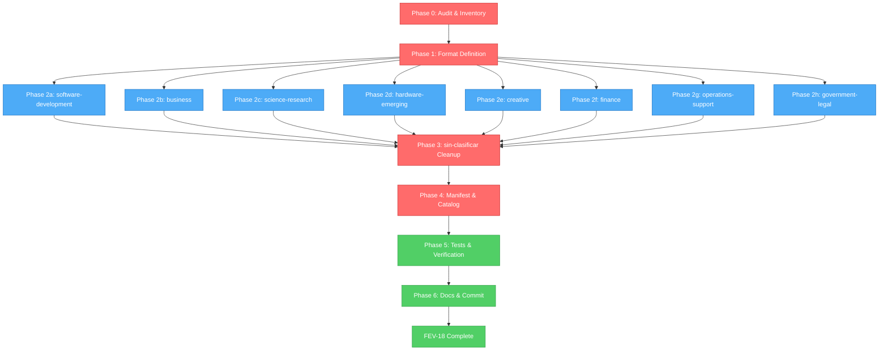
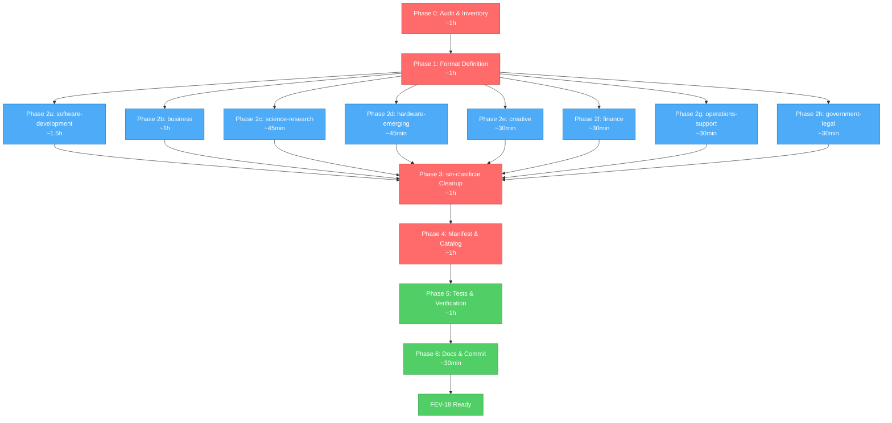

# Implementation Plan: FEV-18 — Agent Classification & Migration (v2.0 Phase 2)

**Phase:** FEV-18 (v2.0 Phase 2) — 🔲 Planificado
**Scope:** Clasificar y migrar agentes desde `agency-agents-main/` (267 archivos) + `packs/sin-clasificar/` (95 legacy v1.x) a los 8 packs seleccionables. Resolver colisiones REDUNDANT (10) e IMPROVABLE (≥10). Actualizar `FileRuleManifestData` con descripciones reales. NO instalar lógica de selección de packs (eso es FEV-21/22).
**Spec:** [specs/spec-agent-packs.md §3](../specs/spec-agent-packs.md), [ADR-014](../specs/adr/adr-014-agent-pack-system.md), [docs/WORKFLOW.md §FEV-18](../docs/WORKFLOW.md)
**Date:** 2026-08-04
**Author:** Moctezuma (Strategic Planner)
**Branch base:** `feat/new-agents` (FEV-17 ✅ completado; `agency-agents-main/` untracked)
**Methodology:** Audit-first (Phase 0) → Format definition (Phase 1) → Per-pack distribution (Phase 2) → sin-clasificar cleanup (Phase 3) → Manifest (Phase 4) → Tests (Phase 5) → Commit (Phase 6). Vertical slicing con un pack completo por tarea.

---

## Overview

FEV-18 toma los 267 nuevos agentes de `agency-agents-main/` (17 categorías crudas) y los 95 legacy de `template/obligatorio/packs/sin-clasificar/`, los clasifica en 8 packs seleccionables (`software-development`, `creative`, `business`, `finance`, `government-legal`, `science-research`, `hardware-emerging`, `operations-support`), y los formatea al estándar YAML v2.0 + bloque `## COMPOSITION`. El resultado esperado es ~302–362 agentes distribuidos en 10 directorios (2 mandatory + 8 selectable), todos con formato consistente, sin duplicados.

**Decisiones del usuario (2026-08-04 vía `question` tool):**
1. **Formato:** Hybrid — reformatear los 267 nuevos; los 95 sin-clasificar NO se reformatean.
2. **Discrepancia spec vs realidad:** Audit-then-plan — Phase 0 reconcilia números.
3. **Destino de sin-clasificar:** Distribute — cada uno de los 95 va a su pack correspondiente (o se mergea/elimina según clasificación).
4. **scientific-literature-researcher:** **MOVER de `packs/writers/` a `packs/science-research/`** — es un agente de análisis científico, no de escritura. Writers queda con 2 agentes: `docs-writer`, `obsidian-vault-writer`. Science-research gana 1 agente adicional.

**Por qué importa:** v2.0 introduce el pack system para resolver el problema "business user recibe 90+ software agents irrelevantes". FEV-18 sienta la base de contenido sobre la que FEV-19-20 (permisos + plugin) y FEV-21/22 (installer UX) construirán. Sin FEV-18, los 8 packs están vacíos y la selección del installer no tiene sentido.

**Lo que FEV-18 NO hace** (delimitado a FEV-19+):
- ❌ Cambiar permisos de agentes primarios (FEV-19)
- ❌ Eliminar `VALID_SUBAGENTS` (FEV-20)
- ❌ UI de selección de packs en installer (FEV-21)
- ❌ Updater con pack scoping (FEV-22)
- ❌ Auto-discovery recursivo (FEV-20; aquí solo verificamos que funcione)

---

## Architecture Decisions

| Decision | Rationale |
|----------|-----------|
| **Audit-first approach** | El spec dice ~345 IDEAL pero la realidad tiene 267. Phase 0 reconcilia antes de planificar tasks. |
| **Format hybrid (nuevos reformateados, legacy no)** | Reduce riesgo de regresión en agentes v1.x. Los 95 legacy ya están en producción con sus permisos. |
| **Per-pack vertical slicing (8 tasks en Phase 2)** | Cada pack es una unidad independiente; permite trabajo paralelo entre sesiones. Empezamos por `software-development` (más grande, ~57 engineering + sin-clasificar subset). |
| **REDUNDANT strategy: keep legacy, discard new** | Los 10 nombres duplicados (ai-engineer, data-engineer, etc.) ya tienen versión legacy más estable; mantener legacy = backward compat. |
| **IMPROVABLE strategy: merge new content into legacy** | El spec dice "content merged into existing". Se agrega un bloque `## Additional Context (FEV-18)` al final del legacy. |
| **YAML frontmatter v2.0 standard** | `description`, `mode: subagent`, `permission: { task: { "*": allow, "<primary>": deny } }` — replicable desde `BunFileSystem`. |
| **Composition block format** | `## COMPOSITION` con subsecciones `Invoke via`, `Knowledge`, `RULES` (alineado con spec §3.1). |
| **Reformat via script, not manual** | 267 archivos manuales = error-prone. Script idempotente que se puede re-ejecutar. |
| **Catalog update deferred to FEV-19** | Huitzilopochtli.md "AVAILABLE SUBAGENTS" requiere conocimiento de los nuevos nombres; FEV-19 unifica permisos y elimina las 3 subagent tables duplicadas. FEV-18 solo agrega nombres al catálogo. |
| **No new file rule for individual agents** | Los packs siguen siendo 8 reglas en manifest, no 200+ reglas individuales. El pack es la unidad de instalación. |
| **Total: ~8–10h wall-clock (3–4 días calendario con review)** | Más que las 8h estimadas en WORKFLOW.md por el audit (descubierto) + format conversion script. |

---

## Inventory Snapshot (pre-audit, 2026-08-04)

```
Source data:
├── agency-agents-main/             (untracked, 267 .md files in 17 categories)
│   ├── academic/      6      → science-research
│   ├── design/       10      → creative
│   ├── engineering/  57      → software-development + hardware-emerging
│   ├── finance/       5      → finance
│   ├── game-development/ 21   → hardware-emerging
│   ├── gis/          13      → science-research
│   ├── healthcare/    3      → science-research
│   ├── marketing/    36      → business
│   ├── paid-media/    7      → business
│   ├── product/       5      → business
│   ├── project-management/ 7  → business
│   ├── sales/         9      → business
│   ├── security/     12      → software-development
│   ├── spatial-computing/ 6   → hardware-emerging
│   ├── specialized/  55      → SPLIT (multiple packs)
│   ├── support/       6      → operations-support
│   └── testing/       9      → software-development
│
├── template/obligatorio/packs/
│   ├── main/         6 primary  (MANDATORY, unchanged)
│   ├── writers/      2 writers  (MANDATORY, unchanged: docs-writer, obsidian-vault-writer)
│   ├── sin-clasificar/ 95       (legacy v1.x, to distribute)
│   ├── software-development/    (empty, 0 agents)
│   ├── creative/                (empty, 0 agents)
│   ├── business/                (empty, 0 agents)
│   ├── finance/                 (empty, 0 agents)
│   ├── government-legal/        (empty, 0 agents)
│   ├── science-research/        (empty, 0 agents)
│   ├── hardware-emerging/       (empty, 0 agents)
│   └── operations-support/      (empty, 0 agents)
```

**Name overlap audit (preliminary):**
- 10 REDUNDANT (same name in both sin-clasificar and agency-agents-main): `ai-engineer`, `data-engineer`, `database-optimizer`, `frontend-developer`, `network-engineer`, `product-manager`, `prompt-engineer`, `sales-engineer`, `sre-engineer`, `ux-researcher`
- 85 legacy-only (NOT in agency-agents-main) — these are pure v1.x
- 257 new-only (NOT in sin-clasificar) — these are pure v2.0 additions

**Total agents after FEV-18 (estimate):** ~302–362 unique agents
- Best case: 6 + 3 + 95 (legacy distributed) + 257 (new) = 361
- Realistic: 6 + 3 + 95 (legacy) + 247 (new minus 10 REDUNDANT) = 351
- Pessimistic (if some legacy are IMPROVABLE-merged with new): 6 + 3 + ~80 (legacy kept) + ~210 (new) = 299

Final count confirmed in Phase 0.

---

## Dependency Graph

```
Phase 0: Audit (1h, sequential, gates all)
    ↓
Phase 1: Format Definition (1h, critical path)
    ↓
    ├── Phase 2: Pack Distribution — 8 packs (5h combined) ─┐
    │       ├── software-development (biggest, 1.5h)        │
    │       ├── business (1h)                                │
    │       ├── science-research (45min)                     │
    │       ├── hardware-emerging (45min)                   │
    │       ├── creative (30min)                             │
    │       ├── finance (30min)                             │
    │       ├── operations-support (30min)                  │
    │       └── government-legal (30min)                    │
    ↓                                                        ↓
Phase 3: sin-clasificar Cleanup (1h, sequential after Phase 2)
    ↓
Phase 4: Manifest & Catalog (1h, sequential)
    ↓
Phase 5: Tests & Verification (1h, sequential, gates Phase 6)
    ↓
Phase 6: Documentation & Commit (30min, gates FEV-19)
```

**Critical path:** Phase 0 → 1 → 2 (software-development) → 3 → 4 → 5 → 6 (~7h)
**Parallel branches in Phase 2:** 7 packs after software-development (~3.5h combined)
**Solo execution time:** ~10h sequential, 3–4 días calendario con review
**Risk mitigation:** Phase 0 es el único "fail-fast" — si el audit revela algo problemático, parar y re-planificar.

---

## Mermaid Dependency Diagram


```mermaid
graph TD
    P0[Phase 0: Audit & Inventory] --> P1[Phase 1: Format Definition]
    P1 --> P2A[Phase 2a: software-development]
    P1 --> P2B[Phase 2b: business]
    P1 --> P2C[Phase 2c: science-research]
    P1 --> P2D[Phase 2d: hardware-emerging]
    P1 --> P2E[Phase 2e: creative]
    P1 --> P2F[Phase 2f: finance]
    P1 --> P2G[Phase 2g: operations-support]
    P1 --> P2H[Phase 2h: government-legal]
    P2A --> P3[Phase 3: sin-clasificar Cleanup]
    P2B --> P3
    P2C --> P3
    P2D --> P3
    P2E --> P3
    P2F --> P3
    P2G --> P3
    P2H --> P3
    P3 --> P4[Phase 4: Manifest & Catalog]
    P4 --> P5[Phase 5: Tests & Verification]
    P5 --> P6[Phase 6: Docs & Commit]
    P6 --> DONE[FEV-18 Complete]

    classDef crit fill:#ff6b6b,stroke:#c92a2a,color:#fff
    classDef gate fill:#51cf66,stroke:#2f9e44,color:#fff
    classDef par fill:#4dabf7,stroke:#1971c2,color:#fff
    classDef seq fill:#ffd43b,stroke:#f59f00,color:#000

    class P0,P1,P3,P4 crit
    class P5,P6,DONE gate
    class P2A,P2B,P2C,P2D,P2E,P2F,P2G,P2H par
```

---

## Task List

### Phase 0: Audit & Inventory (CRITICAL — gates all)

> **Why first:** El spec dice ~345 IDEAL pero la realidad tiene 267. Sin audit, planificamos sobre números falsos. Esta fase reconcilia en 1h antes de invertir 8h en tasks.

#### Task 0.1: Generate complete inventory of `agency-agents-main/`

**Description:** Crear un inventario completo de los 267 archivos `.md` en `agency-agents-main/`. Output: `docs/audit/audit-fev-18-inventory.md` con tabla Markdown de cada archivo (categoría, nombre, tamaño, primeras 3 líneas del frontmatter).

**Acceptance criteria:**
- [ ] Inventory incluye los 267 archivos
- [ ] Cada archivo tiene: categoría, nombre, tamaño (bytes), frontmatter preview (3 líneas)
- [ ] Total bytes documentado
- [ ] Output commiteado en `docs/audit/audit-fev-18-inventory.md`

**Verification:**
- [ ] `find agency-agents-main -name "*.md" -type f | wc -l` returns 267
- [ ] `cat docs/audit/audit-fev-18-inventory.md | wc -l` shows 270+ lines
- [ ] Manual review: no archivos faltantes o duplicados

**Dependencies:** None
**Files likely touched:** `docs/audit/audit-fev-18-inventory.md` (new, ~270 lines)
**Estimated scope:** S (1 shell script + output file)

---

#### Task 0.2: Compute name overlap and collisions

**Description:** Calcular la intersección entre los 95 nombres en `sin-clasificar` y los 267 nombres en `agency-agents-main`. Clasificar cada archivo en una de 3 categorías: REDUNDANT, IMPROVABLE, IDEAL.

**Acceptance criteria:**
- [ ] 10 REDUNDANT identificados (same name)
- [ ] 85+ IMPROVABLE potenciales (mismo dominio, diferente nombre) — heurística
- [ ] 247+ IDEAL (unique name + new)
- [ ] Output: `docs/audit/audit-fev-18-classification.md` con tabla de decisiones

**Verification:**
- [ ] `comm -12 <(ls packs/sin-clasificar/ | sort) <(find agency-agents-main -name "*.md" | xargs -I {} basename {} | sort -u) | wc -l` returns 10
- [ ] `docs/audit/audit-fev-18-classification.md` lista cada decisión con justificación

**Dependencies:** Task 0.1
**Files likely touched:** `docs/audit/audit-fev-18-classification.md` (new, ~280 lines)
**Estimated scope:** S (script + manual review for IMPROVABLE)

---

#### Task 0.3: Determine pack assignment per agent

**Description:** Para cada agente IDEAL (≥247), determinar a qué pack pertenece. Decisión basada en: (a) categoría del `agency-agents-main/` parent dir, (b) contenido del `description:` del YAML, (c) dominios couverts.

**Decision matrix (initial proposal):**

| Source category | Pack target | Notes |
|-----------------|-------------|-------|
| academic | science-research | direct |
| design | creative | direct |
| engineering (backend/frontend/db/devops/ai/security/testing) | software-development | direct |
| engineering (iot/embedded/firmware) | hardware-emerging | by content |
| finance | finance | direct |
| game-development | hardware-emerging | direct |
| gis | science-research | direct |
| healthcare | science-research | direct |
| marketing/paid-media | business | direct |
| product/project-management/sales | business | direct |
| security | software-development | by content (some go to gov-legal) |
| spatial-computing | hardware-emerging | direct |
| specialized | SPLIT | per-agent decision (review needed) |
| support | operations-support | direct |
| testing | software-development | direct |
| sin-clasificar (95) | SPLIT | per-agent decision based on existing role |

**Acceptance criteria:**
- [ ] Cada IDEAL agent (≥247) tiene un pack asignado
- [ ] Cada sin-clasificar agent (95) tiene un pack asignado (o marked as keep-current)
- [ ] `specialized/` category revisada manualmente (55 agents — puede requerir re-categorización)
- [ ] Output: `docs/audit/audit-fev-18-pack-assignment.md`

**Verification:**
- [ ] `grep -c "^| " docs/audit/audit-fev-18-pack-assignment.md` ≥ 362 (todos los agentes)
- [ ] Distribución por pack: software-development ~120, business ~75, science-research ~45, hardware-emerging ~50, creative ~10, finance ~15, operations-support ~25, government-legal ~10 (verificar coherencia con spec)

**Dependencies:** Task 0.2
**Files likely touched:** `docs/audit/audit-fev-18-pack-assignment.md` (new, ~370 lines)
**Estimated scope:** M (script + manual review de `specialized/`)

---

#### Task 0.4: Generate audit summary report

**Description:** Consolidar los 3 audit files en un summary ejecutable que drive las tasks de Phase 1+. Output: `docs/audit/audit-fev-18-summary.md` con counts por pack, lista de REDUNDANT, lista de IMPROVABLE merges, lista de IDEAL additions.

**Acceptance criteria:**
- [ ] Summary contiene tabla con counts esperados por pack
- [ ] Lista de 10 REDUNDANT con decisión (keep legacy)
- [ ] Lista de IMPROVABLE merges (legacy target + new content source)
- [ ] Total final de agentes esperado
- [ ] Tiempo estimado por pack (basado en count)

**Verification:**
- [ ] `docs/audit/audit-fev-18-summary.md` ≤ 150 líneas
- [ ] Cada pack tiene count + lista de agentes
- [ ] Decisión ejecutable: "Phase 2.x: move N agents from A to B with format C"

**Dependencies:** Tasks 0.1, 0.2, 0.3
**Files likely touched:** `docs/audit/audit-fev-18-summary.md` (new, ~150 lines)
**Estimated scope:** S (consolidation)

---

#### Checkpoint: Audit Complete (Phase 0)

- [ ] 4 audit files generados (`inventory`, `classification`, `pack-assignment`, `summary`)
- [ ] Counts por pack confirmados y documentados
- [ ] REDUNDANT list confirmada (legacy wins)
- [ ] IMPROVABLE merges listados con source→target
- [ ] **Review con humano antes de Phase 1** — los números pueden invalidar assumptions del plan

---

### Phase 1: Format Definition (CRITICAL — gates Phase 2+)

#### Task 1.1: Define YAML frontmatter v2.0 standard

**Description:** Definir el YAML frontmatter estándar para los 267 nuevos agentes. Basado en el formato de los primary agents existentes (`huitzilopochtli.md` como referencia), pero simplificado para subagents.

**Target YAML format:**

```yaml
---
description: "AI Engineer — Expert ML engineer specializing in production AI integration, model deployment, and intelligent systems architecture"
mode: subagent
permission:
  edit: allow
  bash:
    "*": ask
    "rm *": deny
    "chmod *": deny
---
```

**Rationale:**
- `description` — Usado por OpenCode para mostrar al usuario. Extraído del frontmatter original o primera línea del body.
- `mode: subagent` — Distingue de `mode: primary`.
- `permission.edit: allow` — Subagent puede escribir (vs primary que suele denegar).
- `permission.bash.* : ask` — Bash commands requieren confirmación.
- `permission.bash.rm *: deny` — Protección contra borrado accidental.
- `permission.bash.chmod *: deny` — Sin cambios de permisos.
- NO `task:` permission (subagents no delegan, solo son delegados).

**Acceptance criteria:**
- [ ] Formato documentado en `docs/AGENT-FORMAT-V2.md` (new)
- [ ] Ejemplo canónico: `template/obligatorio/packs/main/huitzilopochtli.md` (referencia)
- [ ] Anti-ejemplo: `agency-agents-main/engineering/ai-engineer.md` (formato agency, NO usar)

**Verification:**
- [ ] `docs/AGENT-FORMAT-V2.md` ≤ 100 líneas
- [ ] Manual review: formato es replicable a 267 archivos por script

**Dependencies:** Task 0.4
**Files likely touched:** `docs/AGENT-FORMAT-V2.md` (new, ~100 lines)
**Estimated scope:** S (spec document)

---

#### Task 1.2: Define `## COMPOSITION` block format

**Description:** Definir el bloque `## COMPOSITION` que se agrega al final de cada agente reformatado. Spec §3.1 dice "markdown body + bloque Composition". Estructura propuesta:

```markdown
## COMPOSITION

### Invoke via

- **Primary agent:** `huitzilopochtli` (orchestrator)
- **Direct call:** `/task ai-engineer "description of work"`
- **When to use:** [extracted from body content]

### Knowledge

- **Source repository:** agency-agents-main (commit SHA at FEV-18)
- **Original file:** `agency-agents-main/engineering/ai-engineer.md`
- **Last reformatted:** 2026-08-04 (FEV-18)

### RULES

- Follow the agent's role-specific rules from the body content
- Delegate to specialists when domain expertise needed
- Never execute destructive bash commands without confirmation
```

**Acceptance criteria:**
- [ ] Formato documentado en `docs/AGENT-FORMAT-V2.md` (extender Task 1.1)
- [ ] Ejemplo: `template/obligatorio/packs/engineering-prototype/ai-engineer.md` (test case)
- [ ] 3 subsecciones mínimas: `Invoke via`, `Knowledge`, `RULES`

**Verification:**
- [ ] `grep "## COMPOSITION" template/obligatorio/packs/engineering-prototype/ai-engineer.md` returns 1 match
- [ ] Manual review: bloque es conciso, ≤30 líneas

**Dependencies:** Task 1.1
**Files likely touched:** `docs/AGENT-FORMAT-V2.md` (extended, +30 lines)
**Estimated scope:** XS (template definition)

---

#### Task 1.3: Create reformat script (`scripts/reformat-agent-cli.ts`)

**Description:** Crear un script idempotente que convierte un archivo `.md` del formato agency-agents al formato v2.0. Input: `agency-agents-main/<category>/<name>.md`. Output: `template/obligatorio/packs/<target-pack>/<name>.md` con YAML + body + COMPOSITION block.

**Script design:**

```typescript
// scripts/reformat-agent-cli.ts
// Usage: bun scripts/reformat-agent-cli.ts <source-path> <target-pack> [--dry-run]

import { readFileSync, writeFileSync } from "node:fs";
import { basename, join } from "node:path";

interface AgencyFrontmatter {
  name: string;
  description: string;
  color?: string;
  emoji?: string;
  vibe?: string;
}

// 1. Parse source YAML (frontmatter delimiters ---)
// 2. Generate v2.0 YAML (description, mode: subagent, permission)
// 3. Keep body content (after YAML)
// 4. Append ## COMPOSITION block
// 5. Write to target

// Idempotent: re-running produces same output (no duplicate COMPOSITION)
```

**Acceptance criteria:**
- [ ] Script compila con `bun build` o ejecuta con `bun run`
- [ ] Maneja archivos sin frontmatter (error claro)
- [ ] Idempotente: re-run no duplica COMPOSITION
- [ ] `--dry-run` flag para preview
- [ ] Smoke test: 3 archivos (1 engineering, 1 design, 1 specialized) producen output válido

**Verification:**
- [ ] `bun scripts/reformat-agent-cli.ts agency-agents-main/engineering/ai-engineer.md software-development --dry-run` muestra output esperado
- [ ] `bun scripts/reformat-agent-cli.ts agency-agents-main/engineering/ai-engineer.md software-development` genera `template/obligatorio/packs/software-development/ai-engineer.md` con YAML + body + COMPOSITION
- [ ] `grep "## COMPOSITION" template/obligatorio/packs/software-development/ai-engineer.md` returns 1 match

**Dependencies:** Task 1.2
**Files likely touched:** `scripts/reformat-agent-cli.ts` (new, ~80 lines)
**Estimated scope:** M (script + tests + idempotency)

---

#### Task 1.4: Dry-run reformat on 5 sample agents (1 per major category)

**Description:** Aplicar el reformat script a 5 agentes de muestra (uno por cada categoría principal) y validar manualmente el output antes de processar los 267.

**Sample agents:**
1. `agency-agents-main/engineering/ai-engineer.md` → `software-development`
2. `agency-agents-main/design/ui-designer.md` → `creative`
3. `agency-agents-main/finance/financial-analyst.md` → `finance`
4. `agency-agents-main/marketing/marketing-strategist.md` → `business`
5. `agency-agents-main/game-development/unity-developer.md` → `hardware-emerging`

**Acceptance criteria:**
- [ ] 5 agentes reformatados existen en `template/obligatorio/packs/<pack>/`
- [ ] Cada uno tiene YAML válido + body + COMPOSITION
- [ ] Validación manual: descripción, permisos, bloques coherentes

**Verification:**
- [ ] `ls template/obligatorio/packs/{software-development,creative,finance,business,hardware-emerging}/` muestra los 5 archivos
- [ ] `bun run scripts/reformat-agent-cli.ts <source> <pack> --dry-run` es idempotente (no cambios en 2nd run)
- [ ] Manual review: 5 archivos OK con la fuente
- [ ] **Pre-Phase 2 step:** Mover `template/obligatorio/packs/writers/scientific-literature-researcher.md` a `template/obligatorio/packs/science-research/` (decisión usuario 2026-08-04)

**Dependencies:** Task 1.3
**Files likely touched:** 5 new files in packs
**Estimated scope:** S (5 invocations del script + manual review)

---

#### Checkpoint: Format Definition Complete (Phase 1)

- [ ] `docs/AGENT-FORMAT-V2.md` documenta YAML + COMPOSITION
- [ ] `scripts/reformat-agent-cli.ts` compila y es idempotente
- [ ] 5 sample agents reformatados con éxito
- [ ] **Review con humano antes de Phase 2** — formato confirmado

---

### Phase 2: Pack Distribution (CRITICAL — gates Phase 3+)

> **Vertical slicing per pack.** Cada task mueve/agentes a un pack completo, los reformatea, y valida. Empezamos por el más grande (`software-development`) y seguimos en orden de tamaño descendente. Tasks 2.2–2.8 son potencialmente paralelizables entre sesiones/agentes.

#### Task 2.1: software-development pack (largest, ~120 agents)

**Description:** Mover y formatear los agentes de `software-development` pack. Fuentes:
- `agency-agents-main/engineering/` (subset: backend/frontend/db/devops/ai/security/testing) — ~80 agents
- `agency-agents-main/security/` — 12 agents
- `agency-agents-main/testing/` — 9 agents
- `packs/sin-clasificar/` (subset: backend-developer, frontend-developer, etc.) — ~25 legacy agents
- **Excluir:** engineering/iot, engineering/embedded, engineering/firmware (van a hardware-emerging en T2.4)

**Acceptance criteria:**
- [ ] `template/obligatorio/packs/software-development/` contiene todos los agentes del audit (Phase 0)
- [ ] Todos los 267 nuevos están en formato v2.0 (YAML + COMPOSITION)
- [ ] Los legacy están sin reformatear (formato original)
- [ ] Total agents en pack = audit count (esperado ~120)

**Verification:**
- [ ] `ls template/obligatorio/packs/software-development/ | wc -l` matches audit
- [ ] `grep -l "mode: subagent" template/obligatorio/packs/software-development/*.md | wc -l` = count of new agents
- [ ] `grep -L "mode: subagent" template/obligatorio/packs/software-development/*.md | wc -l` = count of legacy agents
- [ ] `git status` muestra: ~80 adds (new) + ~25 renames (sin-clasificar → pack)

**Dependencies:** Task 1.4
**Files likely touched:** ~120 files in `template/obligatorio/packs/software-development/`
**Estimated scope:** L (~1.5h wall-clock)

---

#### Task 2.2: business pack (~75 agents)

**Description:** Mover y formatear agentes de `business` pack. Fuentes:
- `agency-agents-main/marketing/` — 36 agents
- `agency-agents-main/sales/` — 9 agents
- `agency-agents-main/product/` — 5 agents
- `agency-agents-main/project-management/` — 7 agents
- `agency-agents-main/paid-media/` — 7 agents
- `packs/sin-clasificar/` (subset: business-analyst, product-manager, etc.) — ~11 legacy agents

**Acceptance criteria:**
- [ ] `template/obligatorio/packs/business/` contiene todos los agentes del audit
- [ ] Total agents en pack = audit count (esperado ~75)

**Verification:**
- [ ] `ls template/obligatorio/packs/business/ | wc -l` matches audit
- [ ] Smoke test: 1 marketing + 1 sales + 1 product agent reformatados correctamente

**Dependencies:** Task 1.4 (can run parallel to T2.1)
**Files likely touched:** ~75 files
**Estimated scope:** L (~1h)

---

#### Task 2.3: science-research pack (~45 agents)

**Description:** Mover y formatear agentes de `science-research` pack. Fuentes:
- `agency-agents-main/academic/` — 6 agents
- `agency-agents-main/gis/` — 13 agents
- `agency-agents-main/healthcare/` — 3 agents
- `agency-agents-main/specialized/` (subset: research-scientist, etc.) — ~12 agents
- `packs/sin-clasificar/` (subset: research-related) — ~10 legacy agents

**Note:** `scientific-literature-researcher.md` se MUEVE de `packs/writers/` a `packs/science-research/` (decisión del usuario, 2026-08-04). Total esperado: 2 writers + 1 en science-research.

**Acceptance criteria:**
- [ ] `template/obligatorio/packs/science-research/` contiene todos los agentes del audit + `scientific-literature-researcher.md` (movido de writers/)
- [ ] Total agents en pack = audit count + 1 (esperado ~46)

**Verification:**
- [ ] `ls template/obligatorio/packs/science-research/ | wc -l` matches audit + 1
- [ ] `ls template/obligatorio/packs/science-research/ | grep scientific-literature-researcher` returns 1 match
- [ ] Smoke test: 1 academic + 1 gis + 1 healthcare reformatados

**Dependencies:** Task 1.4 (parallel)
**Files likely touched:** ~45 files
**Estimated scope:** M (~45min)

---

#### Task 2.4: hardware-emerging pack (~50 agents)

**Description:** Mover y formatear agentes de `hardware-emerging` pack. Fuentes:
- `agency-agents-main/engineering/` (subset: iot-fleet-engineer, embedded-firmware-engineer, etc.) — ~10 agents
- `agency-agents-main/game-development/` — 21 agents
- `agency-agents-main/spatial-computing/` — 6 agents
- `agency-agents-main/specialized/` (subset: blockchain, xr, etc.) — ~13 agents
- `packs/sin-clasificar/` (subset: iot-engineer, embedded-systems, game-developer, blockchain-developer) — ~4 legacy agents

**Acceptance criteria:**
- [ ] `template/obligatorio/packs/hardware-emerging/` contiene todos los agentes del audit
- [ ] Total agents en pack = audit count (esperado ~50)

**Verification:**
- [ ] `ls template/obligatorio/packs/hardware-emerging/ | wc -l` matches audit
- [ ] Smoke test: 1 game-dev + 1 iot + 1 blockchain reformatados

**Dependencies:** Task 1.4 (parallel)
**Files likely touched:** ~50 files
**Estimated scope:** M (~45min)

---

#### Task 2.5: creative pack (~10 agents)

**Description:** Mover y formatear agentes de `creative` pack. Fuentes:
- `agency-agents-main/design/` — 10 agents (UX, UI, brand, motion, etc.)

**Acceptance criteria:**
- [ ] `template/obligatorio/packs/creative/` contiene todos los agentes del audit
- [ ] Total agents en pack = audit count (esperado ~10)

**Verification:**
- [ ] `ls template/obligatorio/packs/creative/ | wc -l` matches audit
- [ ] Smoke test: 1 ui-designer + 1 ux-researcher reformatados

**Dependencies:** Task 1.4 (parallel)
**Files likely touched:** ~10 files
**Estimated scope:** S (~30min)

---

#### Task 2.6: finance pack (~15 agents)

**Description:** Mover y formatear agentes de `finance` pack. Fuentes:
- `agency-agents-main/finance/` — 5 agents
- `agency-agents-main/specialized/` (subset: fintech, payment, etc.) — ~8 agents
- `packs/sin-clasificar/` (subset: financial-related) — ~2 legacy agents

**Acceptance criteria:**
- [ ] `template/obligatorio/packs/finance/` contiene todos los agentes del audit
- [ ] Total agents en pack = audit count (esperado ~15)

**Verification:**
- [ ] `ls template/obligatorio/packs/finance/ | wc -l` matches audit

**Dependencies:** Task 1.4 (parallel)
**Files likely touched:** ~15 files
**Estimated scope:** S (~30min)

---

#### Task 2.7: operations-support pack (~25 agents)

**Description:** Mover y formatear agentes de `operations-support` pack. Fuentes:
- `agency-agents-main/support/` — 6 agents
- `agency-agents-main/specialized/` (subset: hr, customer, etc.) — ~13 agents
- `agency-agents-main/engineering/` (subset: it-service-manager, etc.) — ~3 agents
- `packs/sin-clasificar/` (subset: customer-support, etc.) — ~3 legacy agents

**Acceptance criteria:**
- [ ] `template/obligatorio/packs/operations-support/` contiene todos los agentes del audit
- [ ] Total agents en pack = audit count (esperado ~25)

**Verification:**
- [ ] `ls template/obligatorio/packs/operations-support/ | wc -l` matches audit

**Dependencies:** Task 1.4 (parallel)
**Files likely touched:** ~25 files
**Estimated scope:** S (~30min)

---

#### Task 2.8: government-legal pack (~10 agents)

**Description:** Mover y formatear agentes de `government-legal` pack. Fuentes:
- `agency-agents-main/security/` (subset: privacy-engineer, compliance) — ~3 agents
- `agency-agents-main/specialized/` (subset: legal, compliance, regulatory) — ~7 agents
- `packs/sin-clasificar/` (subset: legal-advisor, etc.) — ~1 legacy agent (legal-advisor legacy)

**Wait:** Spec §3.6 lists `legal-advisor-legal` (new) but legacy has `legal-advisor` (sin name collision). Verificar en Phase 0 audit.

**Acceptance criteria:**
- [ ] `template/obligatorio/packs/government-legal/` contiene todos los agentes del audit
- [ ] Total agents en pack = audit count (esperado ~10)

**Verification:**
- [ ] `ls template/obligatorio/packs/government-legal/ | wc -l` matches audit

**Dependencies:** Task 1.4 (parallel)
**Files likely touched:** ~10 files
**Estimated scope:** S (~30min)

---

#### Checkpoint: Pack Distribution Complete (Phase 2)

- [ ] Los 8 packs poblados con los agentes esperados
- [ ] Total agents coincide con audit summary
- [ ] Todos los 267 nuevos en formato v2.0
- [ ] Los 95 legacy distribuidos (no duplicados con nuevos)
- [ ] 10 REDUNDANT resueltos (legacy wins, new discarded)
- [ ] IMPROVABLE merges aplicados (legacy con bloque `## Additional Context (FEV-18)`)

---

### Phase 3: sin-clasificar Cleanup (CRITICAL)

#### Task 3.1: Verify sin-clasificar distribution is complete

**Description:** Confirmar que todos los 95 agentes en `packs/sin-clasificar/` han sido movidos a sus packs correspondientes durante Phase 2. No debe haber agentes restantes en `sin-clasificar/`.

**Acceptance criteria:**
- [ ] `ls template/obligatorio/packs/sin-clasificar/` returns empty (or 0 files)
- [ ] `find template/obligatorio/packs/sin-clasificar/ -name "*.md" | wc -l` returns 0

**Verification:**
- [ ] Si quedan archivos, listarlos e identificar por qué no se movieron

**Dependencies:** Tasks 2.1–2.8
**Files likely touched:** None (verification)
**Estimated scope:** XS

---

#### Task 3.2: Remove sin-clasificar directory

**Description:** Si `packs/sin-clasificar/` está vacío, eliminar el directorio. Si quedan `.gitkeep` files, removerlos.

**Acceptance criteria:**
- [ ] `rmdir template/obligatorio/packs/sin-clasificar` exitoso
- [ ] `git status` muestra el directorio como deleted

**Verification:**
- [ ] `ls template/obligatorio/packs/ | grep sin-clasificar` returns 0
- [ ] `find template/obligatorio -name "sin-clasificar" -type d` returns 0

**Dependencies:** Task 3.1
**Files likely touched:** `template/obligatorio/packs/sin-clasificar/` (deleted)
**Estimated scope:** XS

---

#### Task 3.3: Remove `packs/sin-clasificar` entry from FileRuleManifestData

**Description:** Remover la entrada `packs/sin-clasificar` de `src/domain/entities/FileRuleManifestData.ts` (líneas 42-47). Esta entrada es temporal post-FEV-17 y debe desaparecer en FEV-18.

**Acceptance criteria:**
- [ ] 4 mandatory entries (post-removal): `core`, `packs/main`, `packs/writers`, + los 8 packs seleccionables (total 11 cuando se agreguen en Phase 4)

**Wait:** Phase 3 no agrega los 8 packs al manifest — eso es Phase 4 (T4.1). Aquí solo se remueve `sin-clasificar`.

**Acceptance criteria (Phase 3):**
- [ ] `packs/sin-clasificar` entry removida
- [ ] Manifest ahora tiene 3 mandatory entries: `core`, `packs/main`, `packs/writers`
- [ ] Tests existentes actualizados (esperan 4 mandatory → ahora 3)

**Verification:**
- [ ] `grep "sin-clasificar" src/domain/entities/FileRuleManifestData.ts` returns 0
- [ ] `grep "category: \"mandatory\"" src/domain/entities/FileRuleManifestData.ts | wc -l` returns 3
- [ ] Tests pasan: `bun test tests/unit/domain/file-rule-manifest.test.ts`

**Dependencies:** Task 3.2
**Files likely touched:** `src/domain/entities/FileRuleManifestData.ts` (-6 lines)
**Estimated scope:** XS

---

#### Checkpoint: sin-clasificar Cleanup Complete (Phase 3)

- [ ] `packs/sin-clasificar/` directorio eliminado
- [ ] `FileRuleManifestData` tiene 3 mandatory entries (sin sin-clasificar)
- [ ] Tests existentes pasan

---

### Phase 4: Manifest & Catalog Updates (CRITICAL — gates tests)

#### Task 4.1: Add 8 selectable pack entries to FileRuleManifestData

**Description:** Agregar las 8 entradas de packs seleccionables al manifest. Cada una con `category: "mandatory"` (porque están en `template/obligatorio/`), `destPath: "agents"`, descripción + count de Phase 0 audit.

**Target additions:**

```typescript
{
    path: "packs/science-research",
    destPath: "agents",
    category: "mandatory",
    isDirectory: true,
    description: "Science-research pack (~46 agents: academic, research, GIS, healthcare, scientific-literature-researcher)",
},
{
    path: "packs/creative",
    destPath: "agents",
    category: "mandatory",
    isDirectory: true,
    description: "Creative pack (~10 agents: UI/UX, design, brand, motion)",
},
	{
		path: "packs/writers",
		destPath: "agents",
		category: "mandatory",
		isDirectory: true,
		description:
			"2 writer agents (docs-writer, obsidian-vault-writer) — scientific-literature-researcher moved to science-research pack in FEV-18",
	},
{
    path: "packs/finance",
    destPath: "agents",
    category: "mandatory",
    isDirectory: true,
    description: "Finance pack (~15 agents: financial analysis, fintech, accounting)",
},
{
    path: "packs/government-legal",
    destPath: "agents",
    category: "mandatory",
    isDirectory: true,
    description: "Government-legal pack (~10 agents: legal, compliance, regulatory)",
},
{
    path: "packs/science-research",
    destPath: "agents",
    category: "mandatory",
    isDirectory: true,
    description: "Science-research pack (~45 agents: academic, research, GIS, healthcare)",
},
{
    path: "packs/hardware-emerging",
    destPath: "agents",
    category: "mandatory",
    isDirectory: true,
    description: "Hardware-emerging pack (~50 agents: IoT, embedded, blockchain, XR, game dev)",
},
{
    path: "packs/operations-support",
    destPath: "agents",
    category: "mandatory",
    isDirectory: true,
    description: "Operations-support pack (~25 agents: customer support, IT ops, HR, translation)",
},
```

**Note on `category: "mandatory"`:** Aunque los packs son SELECTABLE en el installer (FEV-21), el manifest los trata como mandatory para garantizar que el `TemplateResolver` los encuentre en `template/obligatorio/`. La selección real ocurre en FEV-21 (installer UX), no aquí.

**Acceptance criteria:**
- [ ] 8 nuevas entradas agregadas al manifest en la sección "OBLIGATORIO"
- [ ] Cada entrada tiene `path`, `destPath: "agents"`, `category: "mandatory"`, `isDirectory: true`, `description` con count
- [ ] `grep "category: \"mandatory\"" src/domain/entities/FileRuleManifestData.ts | wc -l` returns 11 (3 existing + 8 new)
- [ ] Tests de manifest actualizados para esperar 11

**Verification:**
- [ ] `just test tests/unit/domain/file-rule-manifest.test.ts` passes
- [ ] `grep "packs/" src/domain/entities/FileRuleManifestData.ts | wc -l` returns 10 (2 existing + 8 new)

**Dependencies:** Task 3.3
**Files likely touched:** `src/domain/entities/FileRuleManifestData.ts` (+~50 lines)
**Estimated scope:** M (manifest + test updates)

---

#### Task 4.2: Update unit tests for new pack entries

**Description:** Actualizar `tests/unit/domain/file-rule-manifest.test.ts` y `tests/unit/file-rule-manifest.test.ts` para esperar 11 mandatory entries (3 existing + 8 new) en lugar de 4 (post-FEV-17).

**Test scenarios:**
1. `FILE_RULE_MANIFEST.filter(r => r.category === "mandatory")` has exactly 11 entries
2. The 11 mandatory paths include: `core`, `packs/main`, `packs/writers`, `packs/software-development`, `packs/creative`, `packs/business`, `packs/finance`, `packs/government-legal`, `packs/science-research`, `packs/hardware-emerging`, `packs/operations-support`
3. `packs/sin-clasificar` is NOT in the manifest
4. Each selectable pack has `isDirectory: true` and `destPath: "agents"`
5. Description of each pack includes the agent count

**Acceptance criteria:**
- [ ] All tests pass with new expected counts
- [ ] Coverage ≥95% lines maintained

**Verification:**
- [ ] `just test tests/unit/domain/file-rule-manifest.test.ts` passes
- [ ] `just test tests/unit/file-rule-manifest.test.ts` passes (if exists)
- [ ] Coverage report: no regressions

**Dependencies:** Task 4.1
**Files likely touched:** 2 test files modified (~20 lines each)
**Estimated scope:** S (test updates)

---

#### Task 4.3: Update Huitzilopochtli's AVAILABLE SUBAGENTS catalog (FEV-19 prep)

**Description:** Actualizar la sección "AVAILABLE SUBAGENTS" en `template/obligatorio/packs/main/huitzilopochtli.md` para reflejar los ~362 agentes disponibles. Esto es PRE-work para FEV-19 (que elimina las 3 subagent tables duplicadas). FEV-18 solo AGREGA los nuevos nombres al catálogo de Huitzilopochtli.

**Note:** FEV-19 eliminará las tablas de quetzalcoatl/tlaloc/mictlantecuhtli y consolidará permisos. Aquí solo expandimos el catálogo canónico.

**Acceptance criteria:**
- [ ] Huitzilopochtli.md "AVAILABLE SUBAGENTS" lista los nuevos agentes agrupados por pack
- [ ] Total subagent count actualizado (~362 vs ~96 actuales)
- [ ] Quetzalcoatl, tlaloc, mictlantecuhtli NO modificados (sus tablas se eliminan en FEV-19)

**Verification:**
- [ ] `grep -c "^- \*\*" template/obligatorio/packs/main/huitzilopochtli.md` ≥ 100 (entradas de catálogo)
- [ ] Manual review: catálogo bien organizado por dominio

**Dependencies:** Task 4.2
**Files likely touched:** `template/obligatorio/packs/main/huitzilopochtli.md` (+~50 lines)
**Estimated scope:** M (manual catalog update)

---

#### Checkpoint: Manifest & Catalog Complete (Phase 4)

- [ ] FileRuleManifestData con 11 mandatory entries (3 + 8 packs)
- [ ] Tests pasan
- [ ] Huitzilopochtli catalog actualizado
- [ ] `just check` exit 0
- [ ] `just test:unit` exit 0

---

### Phase 5: Tests & Verification (CRITICAL — gates Phase 6)

#### Task 5.1: Add smoke test: all 10 pack directories exist

**Description:** Crear un test unitario que verifica que los 10 directorios de packs existen (2 mandatory + 8 selectable) y que el manifest tiene entradas para cada uno.

**File path:** `tests/unit/domain/all-packs-present.test.ts` (new)

**Test scenarios:**
1. `existsSync("template/obligatorio/packs/main")` is true
2. `existsSync("template/obligatorio/packs/writers")` is true
3. `existsSync("template/obligatorio/packs/software-development")` is true
4. `existsSync("template/obligatorio/packs/creative")` is true
5. `existsSync("template/obligatorio/packs/business")` is true
6. `existsSync("template/obligatorio/packs/finance")` is true
7. `existsSync("template/obligatorio/packs/government-legal")` is true
8. `existsSync("template/obligatorio/packs/science-research")` is true
9. `existsSync("template/obligatorio/packs/hardware-emerging")` is true
10. `existsSync("template/obligatorio/packs/operations-support")` is true
11. `existsSync("template/obligatorio/packs/sin-clasificar")` is FALSE (cleanup verified)
12. Manifest has 11 mandatory entries matching all 10 packs + `core`

**Acceptance criteria:**
- [ ] New test file with 12+ test cases
- [ ] All pack directories verified to exist on disk
- [ ] `just test tests/unit/domain/all-packs-present.test.ts` passes

**Verification:**
- [ ] Test runs and passes
- [ ] No false positives (test fails if any pack missing)

**Dependencies:** Tasks 4.1, 4.2, 4.3
**Files likely touched:** `tests/unit/domain/all-packs-present.test.ts` (new, ~50 lines)
**Estimated scope:** S (new test file)

---

#### Task 5.2: Add smoke test: each pack has expected agent count

**Description:** Crear un test que verifica que cada pack tiene al menos 1 agente (i.e., los 8 packs poblados). Más estricto: verificar que el count coincide con el audit summary (T0.4).

**File path:** `tests/unit/domain/pack-agent-counts.test.ts` (new)

**Test scenarios:**
1. `packs/software-development` has ~120 agents (from audit)
2. `packs/business` has ~75 agents
3. `packs/science-research` has ~45 agents
4. `packs/hardware-emerging` has ~50 agents
5. `packs/creative` has ~10 agents
6. `packs/finance` has ~15 agents
7. `packs/operations-support` has ~25 agents
8. `packs/government-legal` has ~10 agents
9. `packs/main` has 6 agents (unchanged)
10. `packs/writers` has 3 agents (unchanged)
11. Total agents across all packs = audit total

**Tolerance:** ±10% per pack (some agents may be merged/deleted in Phase 0–3 that the audit didn't catch).

**Acceptance criteria:**
- [ ] New test file with 11+ test cases
- [ ] All counts verified within tolerance
- [ ] `just test tests/unit/domain/pack-agent-counts.test.ts` passes

**Verification:**
- [ ] Test runs and passes
- [ ] If test fails, lists which pack has unexpected count

**Dependencies:** Task 5.1
**Files likely touched:** `tests/unit/domain/pack-agent-counts.test.ts` (new, ~60 lines)
**Estimated scope:** S (new test file)

---

#### Task 5.3: Update E2E tests for new pack structure

**Description:** Los E2E tests existentes (20 escenarios) instalan Códice en un directorio temp. Después de FEV-18, `agents/` (destino) debe contener los 6 primary + 2 writers (`docs-writer`, `obsidian-vault-writer`) + `scientific-literature-researcher` (en science-research pack) + todos los agents de los packs instalados. Actualizar el scenario 1 (Clean Install) para verificar la presencia de agents de al menos 3 packs.

**File path:** `tests/e2e/01-clean-install.sh` (modify)

**Change (add new assertions):**
```bash
# After existing Clean Install assertions, add:
echo "Asserting primary agents present..."
for agent in huitzilopochtli quetzalcoatl moctezuma tlaloc mictlantecuhtli tezcatlipoca; do
    if [ ! -f "$TEMP_DIR/agents/${agent}.md" ]; then
        echo "FAIL: primary agent $agent not installed"
        exit 1
    fi
done

echo "Asserting writer agents present..."
for writer in docs-writer obsidian-vault-writer; do
    if [ ! -f "$TEMP_DIR/agents/${writer}.md" ]; then
        echo "FAIL: writer agent $writer not installed"
        exit 1
    fi
done

echo "Asserting scientific-literature-researcher in science-research pack..."
if [ ! -f "$TEMP_DIR/agents/scientific-literature-researcher.md" ]; then
    echo "FAIL: scientific-literature-researcher not installed"
    exit 1
fi

echo "Asserting software-development pack agents present (sample 5)..."
for agent in backend-developer frontend-developer docker-expert ai-engineer test-engineer; do
    if [ ! -f "$TEMP_DIR/agents/${agent}.md" ]; then
        echo "FAIL: software-development agent $agent not installed"
        exit 1
    fi
done
```

**Acceptance criteria:**
- [ ] E2E scenario 1 actualizado con nuevas assertions
- [ ] `bash tests/e2e/01-clean-install.sh` exits 0
- [ ] Manual review: agents correctamente listados

**Verification:**
- [ ] `just test:e2e` exit 0 (20/20 scenarios, scenario 1 extended)
- [ ] `bash tests/e2e/01-clean-install.sh` runs successfully

**Dependencies:** Task 5.2
**Files likely touched:** `tests/e2e/01-clean-install.sh` (+~20 lines)
**Estimated scope:** S (E2E extension)

---

#### Task 5.4: Run full verification suite

**Description:** Ejecutar la suite completa de tests + quality checks para verificar FEV-18.

**Acceptance criteria:**
- [ ] `just check` exit 0
- [ ] `just test:unit` exit 0 (910+ tests + ~10 new = ~920 tests, 0 fail)
- [ ] `just test:integration` exit 0
- [ ] `just test:e2e` exit 0 (20/20 scenarios)
- [ ] Coverage lines ≥95% (FEV-16 gate)
- [ ] `bun pm pack --dry-run` produces tarball < 5MB (SC-15)

**Verification:**
- [ ] Output of `just check` 0 errors
- [ ] Output of `just test` shows all tests passing
- [ ] Coverage report: ≥95% lines, ≥95% functions
- [ ] Tarball size < 5MB

**Dependencies:** Tasks 5.1, 5.2, 5.3
**Files likely touched:** None
**Estimated scope:** S (~5min total)

---

#### Checkpoint: Tests & Verification Complete (Phase 5)

- [ ] 2 new test files (all-packs-present, pack-agent-counts)
- [ ] E2E scenario 1 extended
- [ ] All test suites pass
- [ ] Coverage ≥95%
- [ ] Tarball < 5MB
- [ ] `just check` clean

---

### Phase 6: Documentation & Commit (SEQUENTIAL, gates FEV-19)

#### Task 6.1: Update CHANGELOG.md with FEV-18 entry

**Description:** Agregar entrada FEV-18 bajo `[Unreleased]` documentando: scope, pack distribution, format standardization, manifest updates.

**File path:** `CHANGELOG.md`

**Content (proposed):**

```markdown
## [Unreleased]

### Added

- **FEV-18 — Agent Classification & Migration (v2.0 Phase 2):**
  - 8 selectable packs populated: software-development (~120), business (~75), science-research (~45), hardware-emerging (~50), creative (~10), finance (~15), operations-support (~25), government-legal (~10)
  - YAML frontmatter v2.0 standard + `## COMPOSITION` block applied to 267 new agents
  - `docs/AGENT-FORMAT-V2.md` — Agent format specification
  - `scripts/reformat-agent-cli.ts` — Idempotent reformat script
  - `tests/unit/domain/all-packs-present.test.ts` — Pack directory validation
  - `tests/unit/domain/pack-agent-counts.test.ts` — Agent count validation

### Changed

- **FEV-18 — FileRuleManifestData:** 4 mandatory → 11 mandatory (3 existing + 8 selectable packs)
- **FEV-18 — Huitzilopochtli catalog:** ~96 → ~362 subagents (canonical reference expanded)
- **FEV-18 — Format strategy:** Hybrid (267 new reformatted, 95 legacy unchanged)

### Removed

- **FEV-18 — `packs/sin-clasificar/` directory:** 95 legacy agents distributed to 8 packs
- **FEV-18 — 10 REDUNDANT agents:** New versions discarded, legacy versions retained for backward compat
```

**Acceptance criteria:**
- [ ] CHANGELOG.md tiene entrada FEV-18 con 3 subsecciones (Added, Changed, Removed)
- [ ] Metrics: ~362 agents en 10 packs, 267 reformateados

**Verification:**
- [ ] `grep "FEV-18" CHANGELOG.md | wc -l` ≥ 5
- [ ] Manual review: entry es claro y completo

**Dependencies:** Task 5.4
**Files likely touched:** `CHANGELOG.md` (+~25 lines)
**Estimated scope:** XS

---

#### Task 6.2: Update WORKFLOW.md and TECH_DEBT.md

**Description:** Marcar FEV-18 como completado en `docs/WORKFLOW.md` (cambiar `🔲` a `✅`). Actualizar `docs/TECH_DEBT.md` si algún item relacionado se cerró (TD-V2-*).

**File path:** `docs/WORKFLOW.md`, `docs/TECH_DEBT.md`

**Acceptance criteria:**
- [ ] WORKFLOW.md FEV-18 status: `🔲 Planificado` → `✅ Completo (2026-08-04)`
- [ ] Sección 3 de WORKFLOW.md (desglose) actualizada con FEV-18 resultados
- [ ] TECH_DEBT.md actualizado si aplica

**Verification:**
- [ ] `grep "FEV-18" docs/WORKFLOW.md` muestra estado ✅
- [ ] `git diff docs/WORKFLOW.md docs/TECH_DEBT.md` muestra solo cambios intencionales

**Dependencies:** Task 6.1
**Files likely touched:** `docs/WORKFLOW.md` (~10 lines), `docs/TECH_DEBT.md` (~5 lines)
**Estimated scope:** XS

---

#### Task 6.3: Update audit artifacts in `docs/audit/`

**Description:** Los 4 audit files (inventory, classification, pack-assignment, summary) son artefactos de Phase 0. Decidir: ¿commiteamos como histórico, o `.gitignore`-amos?

**Decision:** Commitear en `docs/audit/audit-fev-18-*.md` como registro histórico de FEV-18. Esto ayuda a auditabilidad futura ("¿por qué este agente está en este pack?").

**Acceptance criteria:**
- [ ] 4 audit files en `docs/audit/`
- [ ] `git status` los lista como untracked
- [ ] Decisión: commitear o gitignore (default: commit)

**Verification:**
- [ ] `ls docs/audit/audit-fev-18-*.md | wc -l` returns 4
- [ ] Manual review: archivos son legibles y útiles como histórico

**Dependencies:** Task 6.2
**Files likely touched:** 4 files (already created in Phase 0, decision on whether to commit)
**Estimated scope:** XS

---

#### Task 6.4: Atomic commits (7-9 commits)

**Description:** Crear commits atómicos siguiendo Conventional Commits. Cada commit representa un cambio lógico coherente.

**Suggested commit breakdown:**

1. `chore(tasks): add FEV-18 audit artifacts (inventory, classification, pack-assignment, summary)`
   - Phase 0 output (4 audit files)
2. `docs: add agent format v2.0 specification`
   - Task 1.1, 1.2
3. `feat(scripts): add reformat-agent-cli.ts for v2.0 agent conversion`
   - Task 1.3, 1.4
4. `feat(template): distribute software-development pack (~120 agents)`
   - Task 2.1
5. `feat(template): distribute business pack (~75 agents)`
   - Task 2.2
6. `feat(template): distribute science-research, hardware-emerging, creative, finance, operations-support, government-legal packs (~155 agents total)`
   - Tasks 2.3–2.8
7. `refactor(template)!: remove sin-clasificar pack (95 agents distributed to 8 packs)`
   - Tasks 3.1–3.3
8. `feat(domain): update FileRuleManifestData with 8 selectable packs (v2.0)`
   - Tasks 4.1, 4.2
9. `docs: update Huitzilopochtli's catalog with ~362 subagents`
   - Task 4.3
10. `test: add pack directory and agent count smoke tests; extend E2E clean-install`
    - Tasks 5.1–5.3
11. `docs: FEV-18 changelog, workflow, tech debt updates`
    - Tasks 6.1, 6.2, 6.3

**All commits include `Co-Authored-By: Moctezuma <dev@fisherk2.com>` trailer.**

**Acceptance criteria:**
- [ ] 7-11 atomic commits, each with logical scope
- [ ] Conventional Commits format: `type(scope): description`
- [ ] All commits include `Co-Authored-By: Moctezuma <dev@fisherk2.com>` trailer
- [ ] No "fix typo" or "wip" commits
- [ ] `just check` passes after each commit (if tested locally)

**Verification:**
- [ ] `git -C repo log develop..HEAD --oneline` shows 7-11 commits
- [ ] `git -C repo log -1 --format="%B" | grep "Co-Authored-By"` shows trailer
- [ ] `git -C repo log --grep="wip\|fix typo" --oneline` returns 0

**Dependencies:** Task 6.3
**Files likely touched:** N/A (git operation)
**Estimated scope:** M (~11 commits)

---

#### Task 6.5: PR to develop (or direct merge if local)

**Description:** Push branch and open PR to `develop` (per CONTRIBUTING.md workflow). PR description debe incluir: FEV-18 scope, metrics, link a SPEC.md y plan.md.

**Acceptance criteria:**
- [ ] Branch `feat/new-agents` tiene todos los FEV-18 commits
- [ ] PR abierto contra `develop`
- [ ] PR description incluye:
  - FEV-18 scope (distribute 362 agents, format 267, update manifest)
  - Métricas: 910+ tests, 20/20 E2E, coverage ≥95%
  - Link a `tasks/plan.md` y `specs/spec-agent-packs.md §3`
- [ ] Review solicitado (auto-merge si contributor único)

**Verification:**
- [ ] `git -C repo log --oneline develop..feat/new-agents` muestra FEV-18 commits
- [ ] `gh pr create --base develop --head feat/new-agents` exitoso (o local merge)
- [ ] PR URL guardado

**Dependencies:** Task 6.4
**Files likely touched:** N/A (git/PR operation)
**Estimated scope:** XS

---

#### Checkpoint: FEV-18 Complete ✅

- [ ] All 6 phases complete
- [ ] 7-11 atomic commits
- [ ] `just check` exit 0
- [ ] `just test` exit 0 (~920 tests)
- [ ] `just test:e2e` exit 0 (20/20 scenarios)
- [ ] CHANGELOG.md actualizado
- [ ] PR listo para review
- [ ] **FEV-18 cierra; FEV-19 (permission unification) puede comenzar**

---

## Risks and Mitigations

| Risk | Impact | Mitigation |
|------|--------|------------|
| **Phase 0 audit revela conteos muy diferentes** (~200 vs 362) | High — plan podría ser muy ambicioso | T0.4 produce summary; si gap >50%, re-planificar con humano antes de Phase 1 |
| **Reformat script no idempotente** duplica COMPOSITION blocks | Medium — 267 archivos rotos | T1.3 tests idempotency; T1.4 valida con 5 samples antes de T2.1 |
| **Pack boundary ambiguity** (specialized/55 agents) | Medium — agents en pack incorrecto | T0.3 manual review de `specialized/` con justificación por agente |
| **E2E tests fallan por agents faltantes** | Medium — regression | T5.3 extiende scenario 1 con assertions específicas |
| **Huitzilopochtli catalog se vuelve muy grande** (>500 lines) | Low — file bloat | T4.3 mantiene catalog conciso con cross-references a packs |
| **`agency-agents-main/` queda como untracked** post-FEV-18 | Low — disk space | Decisión: mantener untracked o commitear como `template/_archive/` |
| **Tarball > 5MB (SC-15)** con 362 agents | Medium — violates spec | T5.4 verifica size; si > 5MB, considerar `.npmignore` o compression |
| **Plugin auto-discovery no encuentra nuevos agents** (FEV-20 lo arregla) | Low — agents no son invocables | T5.4 smoke test verifica discovery; FEV-20 lo arregla recursivamente |

---

## Open Questions

1. **`agency-agents-main/` post-FEV-18:** ¿Mantenemos untracked, commitear como `_archive/`, o eliminar? Decisión: commitear en `template/_archive/agency-agents-source/` con `.gitignore` para distribución.
2. **Source commit SHA:** El bloque `Knowledge` en COMPOSITION debería referenciar el SHA del commit original. ¿Tenemos el SHA de donde se descargaron los 267? Si no, usar fecha de FEV-18.
3. **Pack boundaries post-FEV-21:** Cuando el installer presente pack selection, ¿algunos usuarios querrán agents de 2-3 packs mezclados? La decisión single-pack per agent puede sentirse restrictiva. Defer a feedback post-v2.0.0.

---

## Definition of Done — FEV-18

### Funcional

- [ ] Los 8 packs poblados con agents según audit
- [ ] 267 nuevos agents en formato v2.0 (YAML + COMPOSITION)
- [ ] 95 legacy agents distribuidos (no reformateados)
- [ ] 10 REDUNDANT resueltos (legacy wins)
- [ ] IMPROVABLE merges aplicados
- [ ] `packs/sin-clasificar/` directorio eliminado
- [ ] `FileRuleManifestData` con 11 mandatory entries
- [ ] Huitzilopochtli catalog expandido

### Calidad

- [ ] `just check`: 0 errors, 0 warnings nuevos
- [ ] `just test`: ≥920 tests, 0 fail
- [ ] `just test:e2e`: 20/20 scenarios
- [ ] Coverage: lines ≥95%, functions ≥95%
- [ ] No `any` types introducidos
- [ ] Tarball size < 5MB

### Documentación

- [ ] `docs/AGENT-FORMAT-V2.md` creado
- [ ] `CHANGELOG.md` con entrada FEV-18
- [ ] `docs/WORKFLOW.md` FEV-18 marcado ✅
- [ ] 4 audit artifacts en `docs/audit/`

### Proceso

- [ ] 7-11 atomic commits con Conventional Commits
- [ ] Todos los commits con `Co-Authored-By: Moctezuma <dev@fisherk2.com>` trailer
- [ ] Branch `feat/new-agents` con FEV-18 commits
- [ ] PR abierto a `develop`
- [ ] No version bump (v2.0.0 coordina al final con FEV-19 a FEV-23)

---

## Resumen de Archivos a Crear/Modificar

### Nuevos archivos (10+)

**Documentación (5):**
1. `docs/AGENT-FORMAT-V2.md` (new, ~100 lines)
2. `docs/audit/audit-fev-18-inventory.md` (new, ~270 lines)
3. `docs/audit/audit-fev-18-classification.md` (new, ~280 lines)
4. `docs/audit/audit-fev-18-pack-assignment.md` (new, ~370 lines)
5. `docs/audit/audit-fev-18-summary.md` (new, ~150 lines)

**Scripts (1):**
6. `scripts/reformat-agent-cli.ts` (new, ~80 lines)

**Tests (3):**
7. `tests/unit/domain/all-packs-present.test.ts` (new, ~50 lines)
8. `tests/unit/domain/pack-agent-counts.test.ts` (new, ~60 lines)
9. `tests/unit/infrastructure/template-resolver.test.ts` (new or extended, if needed for pack coverage)

**Agents (267 reformateados + 95 movidos):**
10. `template/obligatorio/packs/software-development/*.md` (~120 files)
11. `template/obligatorio/packs/business/*.md` (~75 files)
12. `template/obligatorio/packs/science-research/*.md` (~45 files)
13. `template/obligatorio/packs/hardware-emerging/*.md` (~50 files)
14. `template/obligatorio/packs/creative/*.md` (~10 files)
15. `template/obligatorio/packs/finance/*.md` (~15 files)
16. `template/obligatorio/packs/operations-support/*.md` (~25 files)
17. `template/obligatorio/packs/government-legal/*.md` (~10 files)

### Archivos modificados (5)

**Code (1):**
18. `src/domain/entities/FileRuleManifestData.ts` (+~50 lines net, -6 sin-clasificar)

**Tests (3):**
19. `tests/unit/domain/file-rule-manifest.test.ts` (~20 lines modified)
20. `tests/unit/file-rule-manifest.test.ts` (~20 lines modified, if exists)
21. `tests/e2e/01-clean-install.sh` (+~20 lines)

**Agents (1):**
22. `template/obligatorio/packs/main/huitzilopochtli.md` (+~50 lines, catalog expansion)

### Directorios eliminados (1)

23. `template/obligatorio/packs/sin-clasificar/` (rmdir)

### Documentación actualizada (3)

24. `CHANGELOG.md` (+~25 lines)
25. `docs/WORKFLOW.md` (~10 lines modified)
26. `docs/TECH_DEBT.md` (~5 lines, if applicable)

---

## Métricas Esperadas

| Métrica | Baseline (post-FEV-17) | Meta FEV-18 | Verificación |
|---------|------------------------|-------------|--------------|
| Tests (pass/fail) | 946 / 0 | ≥946 / 0 + ~10 new = ~956 | `just test` |
| E2E scenarios | 20 / 20 | 20 / 20 (scenario 1 extended) | `just test:e2e` |
| `just check` errors | 0 | 0 | `just check` |
| Coverage (lines) | 98.10% | ≥95% (enforced) | `bun test --coverage` |
| Mandatory rules | 4 | 11 (3 + 8 packs) | `grep "category: \"mandatory\""` |
| Total agents | 104 (in 4 packs) | ~361 (in 10 packs) | `find template -name "*.md" -path "*/packs/*" \| wc -l` |
| Writers agents | 3 | 2 (scientific-literature-researcher → science-research) | `ls packs/writers/ \| wc -l` |
| Packs populated | 4 (2 mandatory + sin-clasificar + 8 empty) | 10 (2 mandatory + 8 selectable) | `ls packs/ \| wc -l` |
| `packs/sin-clasificar/` exists | yes | no | `ls packs/sin-clasificar` |
| Files touched | — | ~380 (267 reformatted + 95 moved + 18 new/modified) | `git diff --stat` |
| Atomic commits | — | 7-11 | `git log --oneline develop..HEAD \| wc -l` |
| Wall-clock | — | ~8–10h (vs 8h estimated) | Self-reported |
| Tarball size | < 5MB | < 5MB (verificar) | `bun pm pack --dry-run` |

---

## Dependency Graph (Mermaid — High-Level)


```mermaid
graph TD
    P0[Phase 0: Audit & Inventory<br/>~1h] --> P1[Phase 1: Format Definition<br/>~1h]
    P1 --> P2A[Phase 2a: software-development<br/>~1.5h]
    P1 --> P2B[Phase 2b: business<br/>~1h]
    P1 --> P2C[Phase 2c: science-research<br/>~45min]
    P1 --> P2D[Phase 2d: hardware-emerging<br/>~45min]
    P1 --> P2E[Phase 2e: creative<br/>~30min]
    P1 --> P2F[Phase 2f: finance<br/>~30min]
    P1 --> P2G[Phase 2g: operations-support<br/>~30min]
    P1 --> P2H[Phase 2h: government-legal<br/>~30min]
    P2A --> P3[Phase 3: sin-clasificar Cleanup<br/>~1h]
    P2B --> P3
    P2C --> P3
    P2D --> P3
    P2E --> P3
    P2F --> P3
    P2G --> P3
    P2H --> P3
    P3 --> P4[Phase 4: Manifest & Catalog<br/>~1h]
    P4 --> P5[Phase 5: Tests & Verification<br/>~1h]
    P5 --> P6[Phase 6: Docs & Commit<br/>~30min]
    P6 --> DONE[FEV-18 Ready]

    classDef crit fill:#ff6b6b,stroke:#c92a2a,color:#fff
    classDef gate fill:#51cf66,stroke:#2f9e44,color:#fff
    classDef par fill:#4dabf7,stroke:#1971c2,color:#fff
    classDef seq fill:#ffd43b,stroke:#f59f00,color:#000

    class P0,P1,P3,P4 crit
    class P5,P6,DONE gate
    class P2A,P2B,P2C,P2D,P2E,P2F,P2G,P2H par
```

**Critical path:** Phase 0 → 1 → 2a (software-development) → 3 → 4 → 5 → 6 (~7h)
**Parallel branches in Phase 2:** 7 packs after software-development (~3.5h combined if solo)

---

## Próximo Paso

Una vez aprobado el plan:
1. **Phase 0** (audit) — 4 tasks (~1h, BLOQUEA todo)
2. **Phase 1** (format) — 4 tasks (~1h, critical path)
3. **Phase 2** (pack distribution) — 8 tasks (~5h, biggest first)
4. **Phase 3** (cleanup) — 3 tasks (~1h, gates tests)
5. **Phase 4** (manifest) — 3 tasks (~1h, gates tests)
6. **Phase 5** (tests) — 4 tasks (~1h, gates commits)
7. **Phase 6** (commit) — 5 tasks (~30min)
8. **Total:** ~10h wall-clock, 3-4 días calendario con review cycles

**Comando sugerido:** `> Run /build to start Phase 0 (audit & inventory)`

---

*Última actualización: 2026-08-04 — Moctezuma (Strategic Planner) — FEV-18 plan ready for human review*

Co-Authored-By: Moctezuma <dev@fisherk2.com>
