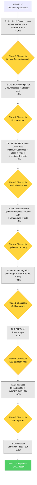
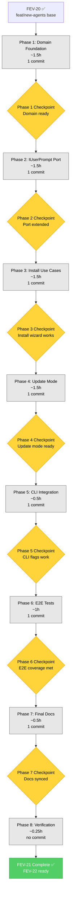

# Implementation Plan: FEV-21 — Installer UX: Pack Selection & Version Detection (v2.0 Phase 5)

**Phase:** FEV-21 (v2.0 Phase 5) — 🔲 Planificado
**Scope:** Implementar wizard de selección de packs (multiselect con `software-development` pre-seleccionado, mínimo 1), detección de versión (parseo JSON de `.codice-version` con `version`/`installedPacks`/`installedAt`), version-gated updates (bloquear Update para versiones < 2.0.0 con mensajes específicos por caso), y extender el formato `.codice-version` con `installedPacks[]`. Actualizar CleanInstallUseCase, ProjectInstallUseCase, UpdateWorkspaceUseCase (Option A vs Option B), IUserPrompt port (3 nuevos métodos), parse-args (3 nuevos flags), main.ts (version detection antes del mode menu), y 7 nuevos E2E tests.
**Spec:** [specs/spec-installer-ux-v2.md §2-§7](../specs/spec-installer-ux-v2.md), [ADR-015](../specs/adr/adr-015-installer-ux-v2.md)
**Tech Debt:** TD-V2-6 (new — No pack removal mechanism)
**Date:** 2026-08-06
**Author:** Moctezuma (Strategic Planner)
**Branch:** `feat/new-agents` (continúa de FEV-20 ✅; usuario confirmó mantener rama)
**Methodology:** Per-file vertical slicing + per-phase (1 commit por capa arquitectónica = 7 atomic commits en Phases 1-7) + verification gate. **Total: 7 commits atómicos + verification** (matching FEV-20 pattern).
**Wall-clock estimate:** ~8h (matching WORKFLOW.md §FEV-21 estimate)

---

## Overview

FEV-21 transforma el installer de v1.x (3 modos rígidos) a v2.0 (wizard interactivo con selección de packs + version gating). El sistema de packs creado en FEV-17/18 (estructura `core/` + `packs/`) y consolidado en FEV-19/20 (auto-discovery recursivo) ahora necesita su contraparte de UX: el usuario debe poder **elegir qué packs instalar** y el installer debe **recordar la elección** para futuros updates.

Con FEV-21:

- **`.codice-version` extendido** a formato v2.0: `{ version, installedPacks[], installedAt, optionalSelections? }`. El campo `installedVersion` se renombra a `version` (más simple, semánticamente claro). `installedPacks` lista los packs seleccionables instalados (no incluye `main` ni `writers` — son obligatorios e implícitos).
- **Wizard interactivo de pack selection** con `clack.multiselect()`: 8 packs seleccionables + `software-development` pre-seleccionado (default US-P1). Validación: mínimo 1 pack. Locked packs en Update Option B (no se pueden deseleccionar).
- **Version detection** al inicio del CLI: lee `.codice-version` antes del mode menu. 4 outcomes: (1) missing → block Update, allow Clean/Project; (2) < 1.2.0 → suggest cleanup; (3) 1.2.0–2.0.0 → block Update, suggest reinstall; (4) ≥ 2.0.0 → enable all.
- **Update mode con 2 sub-opciones** (Option A: current packs only; Option B: current + add new). Option B bloquea packs ya instalados.
- **3 nuevos CLI flags** no-interactivos: `--packs <list>`, `--packs-all`, `--update-add-packs <list>`.

**Por qué importa:** FEV-21 cierra el ciclo v2.0.0 del installer. Sin él, los 355 agentes en 8 packs creados en FEV-17/18 llegan todos al usuario sin opción de filtrar. Con FEV-21, el usuario controla qué instalar y el updater respeta esa elección.

**Lo que FEV-21 NO hace** (delimitado a FEV-22+):
- ❌ Updater con `--update-add-packs` flag (FEV-22)
- ❌ Tests E2E completos (FEV-23 cubre SC-UX8, SC-UX9, SC-UX10, SC-UX11, SC-UX12)
- ❌ Pack removal (TECH_DEBT TD-V2-6, target v2.2.0)
- ❌ Migration in-place de v1.x `.codice-version` (decisión ADR-015: reinstall)

---

## Architecture Decisions

| # | Decision | Rationale |
|---|----------|-----------|
| **1** | **Nueva categoría `"pack"` en `RuleCategory` (vs metadata flag)** | Decisión usuario 2026-08-06 vía question tool. Type-safety explícito: las 8 packs se declaran con `category: "pack"` en `FileRuleManifestData`. Helper `getRulesByCategory("pack")` las agrupa; `filterByPacks(rules, selectedPacks)` excluye las no seleccionadas del merge engine. Más explícito que metadata flags. |
| **2** | **Renombrar `installedVersion` → `version` en `.codice-version`** | Spec §5.1 v2.0 format. El campo es redundante con `installedAt` (siempre presente). El nuevo nombre es más claro y consistente con semver. Backward compat: `fromJSON` acepta `installedVersion` legacy como fallback (defense-in-depth). |
| **3** | **`installedPacks` array (no Set) en `.codice-version`** | Spec §5.1. JSON nativo no tiene Set. Array preserva orden de selección (útil para UI) y es estándar JSON. Tipo `string[]` con `installedPacks: ["software-development", "business"]`. |
| **4** | **3 nuevos métodos en `IUserPrompt` port** | `selectPacks()`, `showVersionInfo()`, `selectUpdateOption()`. Cada uno modela una interacción distinta del wizard. Adapter `ClackPromptsAdapter` los implementa con `clack.multiselect()` + `clack.note()` + `clack.select()`. Cumple Open-Closed: agregar métodos no rompe implementaciones existentes (mocks/tests). |
| **5** | **Version detection en `main.ts` antes del mode menu** | Spec §2.1. El user debe saber inmediatamente si Update está disponible. La detección es determinista (lee JSON del filesystem) y rápida (<10ms). Resultado se pasa como `versionContext` a `runMode()`. |
| **6** | **`UpdateWorkspaceUseCase` refactor: Option A vs Option B (state machine)** | Spec §4.2 + §4.3. Después de version gate: si A → scope merge a `installedPacks`. Si B → mostrar pack selection con installed packs LOCKED, validar >0 new packs, merge con installed+new. Cancel = success(undefined) sin merge. |
| **7** | **Per-file vertical + per-phase (7 commits atómicos)** | Consistente con FEV-20. Cada commit toca 1 capa arquitectónica (Domain / Port / UseCase / Update / CLI / E2E / Docs). Mejor rollback: si IUserPrompt rompe, se revierte solo ese commit. Historia clara para review. |
| **8** | **Subset de 7 E2E (no los 13 completos)** | Decisión usuario 2026-08-06. Cubre SC-UX1..UX7 (core flows). Diferido a FEV-23: SC-UX8 (no new packs cancel), SC-UX9 (`--packs` flag), SC-UX10 (flat destination), SC-UX11 (legacy v1.x message), SC-UX12 (pre-1.2.0 cleanup). Trade-off: 1 día calendar menos. |
| **9** | **Backward compat: `fromJSON` acepta `installedVersion` legacy** | Defense-in-depth. Si un usuario tiene `.codice-version` v1.x (FEV-20 install), `fromJSON` parsea el campo legacy como `version`. El error de Update (block <2.0.0) se mantiene via `version` field check, no via schema strict. |
| **10** | **Continuar en `feat/new-agents`** | Decisión usuario 2026-08-06. Consistente con FEV-19/20. La rama acumula 5 FEVs (FEV-17 a FEV-21) del ciclo v2.0.0. |
| **11** | **No version bump** | v2.0.0 coordina al final con FEV-22 y FEV-23. |
| **12** | **No Wiki sync público** | Decisión heredada de FEV-19/20. El sync al `docs/wiki-source/.wiki/` se hace en FEV-23 / v2.0.0 release. Solo se actualiza el source. |
| **13** | **Total: ~8h wall-clock** | 1.5h Phase 1 (Domain) + 1.5h Phase 2 (IUserPrompt) + 1.5h Phase 3 (Use cases) + 1.5h Phase 4 (Update mode) + 0.5h Phase 5 (CLI) + 1h Phase 6 (E2E) + 0.5h Phase 7 (Docs) + 0.25h verify = 8.25h. |

---

## Patterns Applied (Design Decision Documentation)

| Pattern | Where | Why |
|---------|-------|-----|
| **Single Source of Truth (SSOT)** | `.codice-version` es la única fuente para `installedPacks`. La detección de versión y el update scoping leen del mismo archivo. | Una instalación, un archivo, un estado. Sin ambigüedad entre filesystem y metadata. |
| **Strategy Pattern** | `IUserPrompt.selectPacks(options)` con `PackOption[]` permite diferentes estrategias de selección (interactive vs `--packs` flag vs `--packs-all` flag). | Mismo port, 3 entry points. El port no cambia; solo el caller decide cómo invocar. |
| **State Machine** | `UpdateWorkspaceUseCase.execute()` con 4 estados: (1) pre-check, (2) GitHub query, (3) version compare, (4) option A/B branch. | Spec §4 define los estados explícitamente. El state machine modela la spec directamente. |
| **Open-Closed Principle** | `IUserPrompt` agrega 3 métodos sin romper implementaciones existentes. `FileRule` agrega `"pack"` category sin romper consumers. | Plugin es cerrado para modificación (del interface) pero abierto para extensión (nuevos métodos). |
| **Null Object / Default Strategy** | `software-development` es el default selection. Si user presiona Enter sin seleccionar, ese pack está marcado. | Cumple US-P1 (software developer happy path). Cero clicks para caso común. |
| **Repository Pattern** (informal) | `IFileSystem.readVersionFile()` + `WorkspaceVersion.fromJSON()` actúan como read-only repository del installation state. | Consumer no sabe cómo se persiste (JSON file); solo que devuelve un `WorkspaceVersion` validado. |
| **Lazy Load** | Version detection solo se ejecuta en `main.ts` cuando `mode === "interactive"` o siempre (cheap <10ms). Update mode también lo invoca via `UpdateWorkspaceUseCase.execute()`. | Sin precompute innecesario en Clean Install (no necesita metadata). |
| **Dependency Inversion** | `IUserPrompt` (port) define qué se pregunta; `ClackPromptsAdapter` (adapter) define cómo se pregunta con `@clack/prompts`. Domain layer no sabe que existe TUI. | Clean Architecture: domain no depende de UI library. |
| **Factory Method** | `WorkspaceVersion.fromJSON(data)` factory encapsula validación + parsing. Constructor privado no expuesto. | Validación centralizada. Un solo lugar donde se decide "qué es un WorkspaceVersion válido". |
| **Command Pattern** | Cada instalación mode (`--clean`, `--project`, `--update`, `--packs`, `--update-add-packs`) es un comando independiente parseado en `parseArgs()`. | Spec §7 CLI flags como comandos. Permite CI/CD scripting. |

---

## Pre-Audit Snapshot (2026-08-06)

### Current `.codice-version` format (v1.x — to be extended)

```json
{
  "installedVersion": "2.0.0",
  "installedAt": "2026-08-05T12:00:00.000Z",
  "optionalSelections": ["scripts/build.sh"]
}
```

### Target `.codice-version` format (v2.0)

```json
{
  "version": "2.0.0",
  "installedPacks": ["software-development", "business"],
  "installedAt": "2026-08-06T12:00:00.000Z",
  "optionalSelections": ["scripts/build.sh"]
}
```

### Files requiring modification (14)

| File | Layer | Action | Phase |
|------|-------|--------|:-----:|
| `src/domain/entities/WorkspaceVersion.ts` | Domain | Add `installedPacks` field, rename `installedVersion` → `version`, backward compat | 1 |
| `src/domain/entities/WorkspaceVersion.test.ts` (unit) | Test | Update tests for new field + rename + backward compat | 1 |
| `src/domain/entities/FileRule.ts` | Domain | Add `"pack"` to `RuleCategory` union | 1 |
| `src/domain/entities/FileRuleManifestData.ts` | Domain | Change 8 pack entries: `category: "mandatory"` → `category: "pack"` | 1 |
| `src/domain/entities/FileRuleManifest.ts` | Domain | Add `getRulesByCategory("pack")` + `filterByPacks(rules, selectedPacks)` | 1 |
| `src/domain/entities/FileRuleManifest.test.ts` (unit) | Test | Add tests for pack category + filter | 1 |
| `src/application/ports/IUserPrompt.ts` | Application | Add `selectPacks()`, `showVersionInfo()`, `selectUpdateOption()` | 2 |
| `src/infrastructure/adapters/ClackPromptsAdapter.ts` | Infra | Implement 3 new methods | 2 |
| `src/infrastructure/adapters/ClackPromptsAdapter.test.ts` (integration) | Test | Add tests for 3 new methods | 2 |
| `src/application/use-cases/InstallUseCaseBase.ts` | Application | Add `selectPacks()` phase between `confirmOverwrite` and `selectOptionals` | 3 |
| `src/application/use-cases/CleanInstallUseCase.ts` | Application | Default `software-development` selection | 3 |
| `src/application/use-cases/ProjectInstallUseCase.ts` | Application | Default `software-development` selection | 3 |
| `src/application/postInstall.ts` | Application | Add `installedPacks` to version file write | 3 |
| `src/application/use-cases/UpdateWorkspaceUseCase.ts` | Application | Version gate pre-check + Option A/B state machine | 4 |
| `src/application/use-cases/CleanInstallUseCase.test.ts` (integration) | Test | Add tests for pack selection integration | 3 |
| `src/application/use-cases/ProjectInstallUseCase.test.ts` (integration) | Test | Add tests for pack selection integration | 3 |
| `src/application/use-cases/UpdateWorkspaceUseCase.test.ts` (integration) | Test | Update for version gate + Option A/B | 4 |
| `src/cli/parse-args.ts` | CLI | Add `--packs <list>`, `--packs-all`, `--update-add-packs <list>` | 5 |
| `src/cli/main.ts` | CLI | Version detection before mode menu, pass `versionContext` to runMode | 5 |
| `src/cli/output.ts` | CLI | Update `printHelp()` to document new flags | 5 |
| `src/cli/parse-args.test.ts` (integration) | Test | Add tests for new flags | 5 |
| `src/cli/main.test.ts` (integration) | Test | Add tests for version detection flow | 5 |
| `tests/e2e/17-pack-selection-default.sh` (new) | E2E | Verify default pack selection | 6 |
| `tests/e2e/18-pack-selection-custom.sh` (new) | E2E | Verify custom pack selection (multiple) | 6 |
| `tests/e2e/19-pack-validation-min1.sh` (new) | E2E | Verify min 1 pack validation | 6 |
| `tests/e2e/20-codice-version-installedPacks.sh` (new) | E2E | Verify .codice-version contains installedPacks | 6 |
| `tests/e2e/21-update-blocked-missing.sh` (new) | E2E | Verify Update blocked when .codice-version missing | 6 |
| `tests/e2e/22-update-blocked-v1x.sh` (new) | E2E | Verify Update blocked when version < 2.0.0 | 6 |
| `tests/e2e/23-update-option-a.sh` (new) | E2E | Verify Update Option A (current packs only) | 6 |
| `CHANGELOG.md` | Docs | Add FEV-21 entry | 7 |
| `docs/WORKFLOW.md` | Docs | Mark FEV-21 ✅ | 7 |
| `docs/TECH_DEBT.md` | Docs | Add TD-V2-6 (pack removal) | 7 |

**Total:** 23 files modified + 7 new E2E scripts = 30 files total

### Files NOT modified (verified)

- `src/domain/services/FileMergeEngine.ts` (no change — pack filtering is upstream)
- `src/domain/ports/IFileMergeEngine.ts` (no change)
- `src/domain/ports/IStagingSystem.ts` (no change)
- `src/infrastructure/adapters/BunFileSystem.ts` (no change — `readVersionFile`/`writeVersionFile` already in IFileSystem)
- `src/infrastructure/adapters/BunGitignoreCreator.ts` (no change)
- `src/infrastructure/adapters/BunSymlinkCreator.ts` (no change)
- `src/infrastructure/config/symlinks.ts` (no change)
- `src/infrastructure/config/constants.ts` (no change — `VERSION_FILE_NAME` already `.codice-version`)
- `src/cli/container.ts` (no change — same DI)
- `tests/integration/use-cases/clean-install.test.ts` (no change — covered by new file or kept)
- `tests/integration/use-cases/project-install.test.ts` (no change — covered by new file or kept)
- `template/obligatorio/packs/**` (no change — pack directories intact from FEV-17/18)
- `template/obligatorio/core/**` (no change)

### Current `FILE_RULE_MANIFEST` pack entries (8)

```typescript
{ path: "packs/software-development", destPath: "agents", category: "mandatory", ... }
{ path: "packs/business",             destPath: "agents", category: "mandatory", ... }
{ path: "packs/hardware-emerging",    destPath: "agents", category: "mandatory", ... }
{ path: "packs/science-research",     destPath: "agents", category: "mandatory", ... }
{ path: "packs/operations-support",   destPath: "agents", category: "mandatory", ... }
{ path: "packs/finance",              destPath: "agents", category: "mandatory", ... }
{ path: "packs/creative",             destPath: "agents", category: "mandatory", ... }
{ path: "packs/government-legal",     destPath: "agents", category: "mandatory", ... }
```

After FEV-21: `category: "pack"` for all 8 entries.

### Baseline metrics (post-FEV-20)

| Metric | Value |
|--------|------:|
| Tests (pass/fail) | 1747 / 0 |
| E2E scenarios | 16 / 16 |
| `just check` errors | 0 |
| `just check-plugin` errors | 0 |
| Coverage (lines) | ≥95% (overall) |
| Plugin tests | 51 |
| `.codice-version` fields | 3 (`installedVersion`, `installedAt`, `optionalSelections`) |
| FileRule `RuleCategory` values | 3 (`mandatory`, `standard`, `optional`) |
| `IUserPrompt` methods | 12 (showWarning, showInfo, confirm, selectOptional, showProgressBar, updateProgress, completeProgress, logProgressEvent, showIntro, showSuccess, showCancel, showError, promptForMode) |
| CLI flags | 7 (--clean, --project, --update, --force, --verbose, --version/-V, --help/-h, --dest) |

---

## Dependency Graph

```
FEV-20 ✅ (feat/new-agents branch base)
    ↓
Phase 1: Domain Foundation (1.5h, 1 commit)
    ├── T1.1 WorkspaceVersion.ts (add installedPacks, rename, backward compat) → bundled
    ├── T1.2 FileRule.ts + FileRuleManifestData.ts + FileRuleManifest.ts (pack category + helpers) → bundled
    └── T1.3 Unit tests for WorkspaceVersion + FileRuleManifest → bundled
    ↓
Phase 2: IUserPrompt Port Extension (1.5h, 1 commit)
    ├── T2.1 IUserPrompt.ts (3 new methods) + ClackPromptsAdapter.ts (implementation) → bundled
    └── T2.2 Integration tests for new methods → bundled
    ↓
Phase 3: Install Use Cases (1.5h, 1 commit)
    ├── T3.1 InstallUseCaseBase.ts (add selectPacks phase) → bundled
    ├── T3.2 CleanInstallUseCase.ts + ProjectInstallUseCase.ts (default software-development) → bundled
    ├── T3.3 postInstall.ts (add installedPacks to version file) → bundled
    └── T3.4 Integration tests for clean-install + project-install with packs → bundled
    ↓
Phase 4: Update Mode Rewrite (1.5h, 1 commit)
    ├── T4.1 UpdateWorkspaceUseCase.ts (version gate + Option A/B state machine) → bundled
    └── T4.2 Integration tests for update-workspace with pack scoping → bundled
    ↓
Phase 5: CLI Integration (0.5h, 1 commit)
    ├── T5.1 parse-args.ts (3 new flags) + main.ts (version detection) + output.ts (help text) → bundled
    └── T5.2 Integration tests for parse-args + main → bundled
    ↓
Phase 6: E2E Tests (1h, 1 commit)
    └── T6.1 7 new E2E scripts (17-23) → 1 commit
    ↓
Phase 7: Final Documentation (0.5h, 1 commit)
    └── T7.1 CHANGELOG.md + WORKFLOW.md + TECH_DEBT.md → 1 commit
    ↓
Phase 8: Verification (0.25h, gates FEV-22)
    └── T8.1 just check + just test + just test-e2e
    ↓
FEV-21 Complete → FEV-22 ready
```

**Critical path:** T1.1+T1.2+T1.3 → T2.1+T2.2 → T3.1+T3.2+T3.3+T3.4 → T4.1+T4.2 → T5.1+T5.2 → T6.1 → T7.1 → T8.1 (~8h total)
**Parallel opportunities:** Tests T3.4 and T4.2 can run in parallel with code (but bundled per atomicity).
**Solo execution:** 2 días calendario (con review entre phases).

---

## Mermaid Dependency Diagram


```mermaid
graph TD
    F20[FEV-20 ✅<br/>feat/new-agents base] --> T11
    T11[T1.1+1.2+1.3 Domain Layer<br/>WorkspaceVersion + FileRule + tests<br/>~1.5h]:::seq --> CP1
    CP1{Phase 1 Checkpoint<br/>Domain foundation ready}:::gate --> T21
    T21[T2.1+2.2 IUserPrompt Port<br/>3 new methods + adapter + tests<br/>~1.5h]:::seq --> CP2
    CP2{Phase 2 Checkpoint<br/>Port extended}:::gate --> T31
    T31[T3.1+3.2+3.3+3.4 Install Use Cases<br/>InstallUseCaseBase + Clean + Project<br/>+ postInstall + tests<br/>~1.5h]:::seq --> CP3
    CP3{Phase 3 Checkpoint<br/>Install wizard works}:::gate --> T41
    T41[T4.1+4.2 Update Mode<br/>UpdateWorkspaceUseCase A/B<br/>+ version gate + tests<br/>~1.5h]:::seq --> CP4
    CP4{Phase 4 Checkpoint<br/>Update mode ready}:::gate --> T51
    T51[T5.1+5.2 CLI Integration<br/>parse-args + main + output<br/>+ tests<br/>~0.5h]:::seq --> CP5
    CP5{Phase 5 Checkpoint<br/>CLI flags work}:::gate --> T61
    T61[T6.1 E2E Tests<br/>7 new scripts<br/>~1h]:::seq --> CP6
    CP6{Phase 6 Checkpoint<br/>E2E coverage met}:::gate --> T71
    T71[T7.1 Final Docs<br/>CHANGELOG + WORKFLOW + TD<br/>~0.5h]:::seq --> CP7
    CP7{Phase 7 Checkpoint<br/>Docs synced}:::gate --> T81
    T81[T8.1 Verification<br/>just check + test + e2e<br/>~0.25h]:::seq --> DONE
    DONE[FEV-21 Complete ✅<br/>FEV-22 ready]:::done

    classDef done fill:#51cf66,stroke:#2f9e44,color:#fff
    classDef gate fill:#ffd43b,stroke:#f59f00,color:#000
    classDef seq fill:#e7e7e7,stroke:#666,color:#000
```

---

## File-by-File Change Matrix

| File | Phase | Change Type | Lines Affected | Commit |
|------|:-----:|-------------|:--------------:|--------|
| `src/domain/entities/WorkspaceVersion.ts` | 1 | Add field + rename + factory | +30 / -15 | T1.1 |
| `src/domain/entities/FileRule.ts` | 1 | Add category to union | +1 / -0 | T1.2 |
| `src/domain/entities/FileRuleManifestData.ts` | 1 | Change 8 entries category | +0 / -0 (8 replacements) | T1.2 |
| `src/domain/entities/FileRuleManifest.ts` | 1 | Add 2 helpers | +25 | T1.2 |
| `src/domain/entities/WorkspaceVersion.test.ts` | 1 | Update + add tests | +60 / -20 | T1.3 |
| `src/domain/entities/FileRuleManifest.test.ts` | 1 | Add tests for pack category | +30 | T1.3 |
| `src/application/ports/IUserPrompt.ts` | 2 | Add 3 method signatures | +50 | T2.1 |
| `src/infrastructure/adapters/ClackPromptsAdapter.ts` | 2 | Implement 3 methods | +80 | T2.1 |
| `src/infrastructure/adapters/ClackPromptsAdapter.test.ts` | 2 | Add tests for 3 methods | +60 | T2.2 |
| `src/application/use-cases/InstallUseCaseBase.ts` | 3 | Add selectPacks phase | +25 / -5 | T3.1 |
| `src/application/use-cases/CleanInstallUseCase.ts` | 3 | Default software-development | +15 | T3.2 |
| `src/application/use-cases/ProjectInstallUseCase.ts` | 3 | Default software-development | +15 | T3.2 |
| `src/application/postInstall.ts` | 3 | Pass installedPacks to version file | +5 | T3.3 |
| `tests/integration/use-cases/clean-install.test.ts` | 3 | Add pack selection tests | +40 | T3.4 |
| `tests/integration/use-cases/project-install.test.ts` | 3 | Add pack selection tests | +40 | T3.4 |
| `src/application/use-cases/UpdateWorkspaceUseCase.ts` | 4 | Version gate + Option A/B | +100 / -30 | T4.1 |
| `tests/integration/use-cases/update-workspace.test.ts` | 4 | Update for version gate + A/B | +80 | T4.2 |
| `src/cli/parse-args.ts` | 5 | Add 3 flags | +40 | T5.1 |
| `src/cli/main.ts` | 5 | Version detection before menu | +40 / -5 | T5.1 |
| `src/cli/output.ts` | 5 | Update help text | +20 | T5.1 |
| `tests/integration/cli/parse-args.test.ts` | 5 | Add tests for 3 new flags | +40 | T5.2 |
| `tests/integration/cli/main.test.ts` | 5 | Add tests for version detection | +30 | T5.2 |
| `tests/e2e/17-pack-selection-default.sh` | 6 | NEW script | +80 | T6.1 |
| `tests/e2e/18-pack-selection-custom.sh` | 6 | NEW script | +80 | T6.1 |
| `tests/e2e/19-pack-validation-min1.sh` | 6 | NEW script | +60 | T6.1 |
| `tests/e2e/20-codice-version-installedPacks.sh` | 6 | NEW script | +70 | T6.1 |
| `tests/e2e/21-update-blocked-missing.sh` | 6 | NEW script | +50 | T6.1 |
| `tests/e2e/22-update-blocked-v1x.sh` | 6 | NEW script | +60 | T6.1 |
| `tests/e2e/23-update-option-a.sh` | 6 | NEW script | +90 | T6.1 |
| `CHANGELOG.md` | 7 | Add FEV-21 entry | +30 | T7.1 |
| `docs/WORKFLOW.md` | 7 | Mark FEV-21 ✅ + expand | +15 | T7.1 |
| `docs/TECH_DEBT.md` | 7 | Add TD-V2-6 | +10 | T7.1 |

**Total:** 24 files modified + 7 new = 31 files
**Net lines:** +1,182 new, -75 modified = **+1,107 lines net** (mostly tests + E2E scripts)
**Commits:** 7 atomic commits + 1 verification

---

## Task List

### Phase 1: Domain Foundation (~1.5h, 1 commit)

> **Vertical slicing per layer.** Un commit atómico toca todos los archivos del Domain layer (3 entities + 1 test). Pattern: 1) rename `installedVersion` → `version` + add `installedPacks`, 2) add `"pack"` RuleCategory + filter helpers, 3) extend tests, 4) commit.

#### Task 1.1: Extend `WorkspaceVersion` entity (v2.0 format + backward compat)

**Description:** En `src/domain/entities/WorkspaceVersion.ts`, hacer 3 cambios: (1) renombrar parámetro del constructor `version` (era `installedVersion` externalmente, ahora el primer parámetro); (2) añadir campo `installedPacks: readonly string[]` (default `[]`); (3) actualizar `fromJSON` para aceptar `version` (nuevo) Y `installedVersion` (legacy, fallback); (4) actualizar `toJSON` para emitir el formato v2.0 (`version`, `installedPacks`, `installedAt`, `optionalSelections`).

**Current state (constructor, líneas 8-18):**

```typescript
export class WorkspaceVersion {
	constructor(
		public readonly version: string,        // ❌ Actually is installedVersion from fromJSON
		public readonly installedAt: string,
		public readonly optionalSelections: readonly string[] = [],
	) {}
```

Wait, looking at the actual file, the constructor parameter IS named `version` but the JSON field is `installedVersion`. The rename is in the JSON field. Let me re-read the file.

Actually re-checking: `WorkspaceVersion.ts` line 11: `public readonly version: string` and `toJSON()` line 100: `installedVersion: this.version`. So the constructor param is `version` (clean) but the JSON field is `installedVersion` (legacy). The FEV-21 rename is JSON-side: `installedVersion` → `version`.

**Target constructor (líneas 8-18):**

```typescript
export class WorkspaceVersion {
	constructor(
		/** Full version string, e.g. "2.0.0" (semver, no v-prefix) */
		public readonly version: string,
		/**
		 * ISO 8601 timestamp of installation (e.g. "2026-06-13T12:00:00.000Z")
		 */
		public readonly installedAt: string,
		/**
		 * Packs installed at v2.0+ installations. Empty for v1.x.
		 * Always excludes `main` and `writers` (implicit mandatory packs).
		 */
		public readonly installedPacks: readonly string[] = [],
		/** Optional list of paths the user selected during install */
		public readonly optionalSelections: readonly string[] = [],
	) {}
```

**Target `fromJSON` (extract `version` or fall back to `installedVersion`):**

```typescript
static fromJSON(data: unknown): WorkspaceVersion {
	// ... existing root object check ...

	const obj = data as Record<string, unknown>;

	// [FEV-21] v2.0 format: "version". v1.x format: "installedVersion" (backward compat).
	const versionField = obj.version ?? obj.installedVersion;
	if (typeof versionField !== "string") {
		throw new Error(
			`Invalid .codice-version file: field 'version' must be a string (e.g. "2.0.0"), received ${typeof versionField}`,
		);
	}
	if (!valid(versionField)) {
		throw new Error(
			`Invalid .codice-version file: field 'version' is not a valid semver version (e.g. "2.0.0"), received "${versionField}"`,
		);
	}

	// ... existing installedAt validation ...

	// [FEV-21] v2.0: installedPacks is a string[] of pack IDs. v1.x had no packs.
	let installedPacks: readonly string[] = [];
	if (Array.isArray(obj.installedPacks)) {
		installedPacks = obj.installedPacks.filter((p): p is string => typeof p === "string");
	} else if (obj.installedPacks !== undefined) {
		throw new Error(
			`Invalid .codice-version file: field 'installedPacks' must be an array of pack IDs (e.g. ["software-development"]), received ${typeof obj.installedPacks}`,
		);
	}

	return new WorkspaceVersion(
		versionField,
		obj.installedAt as string,
		installedPacks,
		Array.isArray(obj.optionalSelections)
			? obj.optionalSelections.filter((s): s is string => typeof s === "string")
			: [],
	);
}
```

**Target `toJSON` (v2.0 format):**

```typescript
toJSON(): Record<string, unknown> {
	return {
		version: this.version,
		installedPacks: [...this.installedPacks],
		installedAt: this.installedAt,
		optionalSelections: [...this.optionalSelections],
	};
}
```

**Acceptance criteria:**

- [ ] Constructor: `installedPacks: readonly string[]` añadido (4to parámetro, default `[]`)
- [ ] `fromJSON`: acepta `version` (nuevo) Y `installedVersion` (legacy) con `??` fallback
- [ ] `fromJSON`: error message actualizado: `field 'version'` (no `field 'installedVersion'`)
- [ ] `fromJSON`: valida `installedPacks` is array of strings (throws if not)
- [ ] `toJSON`: emite `{ version, installedPacks, installedAt, optionalSelections }` (en este orden)
- [ ] `grep "installedVersion" src/domain/entities/WorkspaceVersion.ts` = 0 (in source)
- [ ] `grep "version:" src/domain/entities/WorkspaceVersion.ts` ≥ 4 (constructor, fromJSON, toJSON x2)

**Verification:**

- [ ] `grep "installedVersion" src/` returns 0 (renamed everywhere)
- [ ] `bun test tests/unit/domain/workspace-version.test.ts` shows 100% pass with new tests
- [ ] Manual: parse `{ version: "2.0.0", installedPacks: ["x"], installedAt: "..." }` → `WorkspaceVersion` correctly
- [ ] Manual: parse `{ installedVersion: "1.0.0", installedAt: "..." }` (legacy) → `WorkspaceVersion` with `version="1.0.0"`, `installedPacks=[]`

**Dependencies:** FEV-20 ✅
**Files likely touched:** `src/domain/entities/WorkspaceVersion.ts` (+30 / -15 lines)
**Estimated scope:** S (1 entity, 4 changes)
**Commit (bundled in Phase 1):** `feat(domain): extend WorkspaceVersion with installedPacks and v2.0 format`

---

#### Task 1.2: Add `"pack"` RuleCategory + filter helpers

**Description:** En `src/domain/entities/FileRule.ts`, agregar `"pack"` al union type `RuleCategory`. En `src/domain/entities/FileRuleManifestData.ts`, cambiar las 8 entries de packs de `category: "mandatory"` a `category: "pack"`. En `src/domain/entities/FileRuleManifest.ts`, añadir `getPackRules()` y `filterByPacks(rules, selectedPacks)` helpers.

**Target `FileRule.ts`:**

```typescript
export type RuleCategory = "mandatory" | "standard" | "optional" | "pack";
```

**Target `FileRuleManifestData.ts` (cambiar 8 entries):**

```typescript
// v2.0 (FEV-21): 8 selectable agent packs now use `category: "pack"` (was
// "mandatory" pre-FEV-21). Pack selection happens via IUserPrompt.selectPacks()
// in the install wizard. Unselected packs are excluded from the merge by
// filterByPacks() helper. `main` and `writers` stay as "mandatory" (implicit).
{
	path: "packs/software-development",
	destPath: "agents",
	category: "pack",  // ← changed from "mandatory"
	isDirectory: true,
	description: "Software development pack (default ON, 146 agents: ...)",
},
// ... 7 more entries same change
```

**Target `FileRuleManifest.ts` (2 new helpers):**

```typescript
/**
 * Get all selectable pack rules (excludes main, writers, and core).
 * Used by the install wizard to build the pack selection list.
 */
export function getPackRules(): readonly FileRule[] {
	return FILE_RULE_MANIFEST.filter((r) => r.category === "pack");
}

/**
 * Filter rules to include only selected packs plus always-on (mandatory,
 * standard, optional). The merge engine then receives the filtered set.
 *
 * @param rules - Full rule set (typically FILE_RULE_MANIFEST).
 * @param selectedPacks - Array of pack IDs the user selected (e.g. ["software-development"]).
 * @returns Filtered rules excluding unselected packs.
 */
export function filterByPacks(
	rules: readonly FileRule[],
	selectedPacks: readonly string[],
): readonly FileRule[] {
	const selectedSet = new Set(selectedPacks);
	return rules.filter((r) => {
		// Always include non-pack rules (mandatory, standard, optional)
		if (r.category !== "pack") return true;
		// For pack rules, only include if explicitly selected
		// Match by `path` (e.g., "packs/software-development" → "software-development")
		const packId = r.path.replace(/^packs\//, "");
		return selectedSet.has(packId);
	});
}
```

**Acceptance criteria:**

- [ ] `FileRule.ts`: `RuleCategory = "mandatory" | "standard" | "optional" | "pack"`
- [ ] `FileRuleManifestData.ts`: 8 pack entries con `category: "pack"` (verificar con grep)
- [ ] `FileRuleManifest.ts`: `getPackRules()` y `filterByPacks()` añadidos
- [ ] `filterByPacks` extrae packId correctamente: `"packs/business"` → `"business"`
- [ ] `grep '"pack"' src/domain/entities/FileRule.ts` = 1
- [ ] `grep 'category: "pack"' src/domain/entities/FileRuleManifestData.ts` = 8
- [ ] `grep "filterByPacks\|getPackRules" src/domain/entities/FileRuleManifest.ts` ≥ 4 (2 declarations + 2 in JSDoc)

**Verification:**

- [ ] `bun test tests/unit/file-rule-manifest.test.ts` shows 100% pass with new pack tests
- [ ] Manual: `filterByPacks(FILE_RULE_MANIFEST, ["software-development"])` returns 1 pack + 10 standard + 11 optional
- [ ] Manual: `filterByPacks(FILE_RULE_MANIFEST, [])` returns 0 packs + 10 standard + 11 optional (no packs, but standards kept)

**Dependencies:** Task 1.1
**Files likely touched:** `src/domain/entities/FileRule.ts` (+1), `FileRuleManifestData.ts` (8 replacements), `FileRuleManifest.ts` (+25)
**Estimated scope:** S (3 files, ~26 lines)
**Commit (bundled in Phase 1):** Same as T1.1

---

#### Task 1.3: Update unit tests for `WorkspaceVersion` + `FileRuleManifest`

**Description:** Actualizar `tests/unit/domain/workspace-version.test.ts` y `tests/unit/file-rule-manifest.test.ts` para cubrir los nuevos campos y helpers.

**WorkspaceVersion test additions (≥4 new tests):**

```typescript
describe("WorkspaceVersion v2.0 format", () => {
	test("fromJSON accepts v2.0 format with version + installedPacks", () => {
		const v = WorkspaceVersion.fromJSON({
			version: "2.0.0",
			installedPacks: ["software-development", "business"],
			installedAt: "2026-08-06T12:00:00.000Z",
		});
		expect(v.version).toBe("2.0.0");
		expect(v.installedPacks).toEqual(["software-development", "business"]);
	});

	test("fromJSON accepts legacy v1.x format with installedVersion (backward compat)", () => {
		const v = WorkspaceVersion.fromJSON({
			installedVersion: "1.2.0",
			installedAt: "2026-07-30T12:00:00.000Z",
		});
		expect(v.version).toBe("1.2.0");
		expect(v.installedPacks).toEqual([]);
	});

	test("fromJSON rejects invalid installedPacks (not an array)", () => {
		expect(() =>
			WorkspaceVersion.fromJSON({
				version: "2.0.0",
				installedPacks: "software-development", // should be array
				installedAt: "2026-08-06T12:00:00.000Z",
			}),
		).toThrow("must be an array of pack IDs");
	});

	test("fromJSON filters non-string entries in installedPacks", () => {
		const v = WorkspaceVersion.fromJSON({
			version: "2.0.0",
			installedPacks: ["software-development", 123, null, "business"],
			installedAt: "2026-08-06T12:00:00.000Z",
		});
		expect(v.installedPacks).toEqual(["software-development", "business"]);
	});

	test("toJSON emits v2.0 format with version + installedPacks", () => {
		const v = new WorkspaceVersion(
			"2.0.0",
			"2026-08-06T12:00:00.000Z",
			["software-development"],
			["scripts/build.sh"],
		);
		const json = v.toJSON();
		expect(json).toEqual({
			version: "2.0.0",
			installedPacks: ["software-development"],
			installedAt: "2026-08-06T12:00:00.000Z",
			optionalSelections: ["scripts/build.sh"],
		});
	});
});
```

> **Note:** Existing tests in workspace-version.test.ts use `installedVersion` — need to migrate to `version` field in test data.

**FileRuleManifest test additions (≥3 new tests):**

```typescript
describe("FileRuleManifest pack helpers", () => {
	test("getPackRules returns 8 pack rules (excludes main/writers)", () => {
		const packs = getPackRules();
		expect(packs.length).toBe(8);
		for (const pack of packs) {
			expect(pack.category).toBe("pack");
			expect(pack.path.startsWith("packs/")).toBe(true);
		}
	});

	test("filterByPacks includes only selected packs + non-pack rules", () => {
		const all = FILE_RULE_MANIFEST;
		const filtered = filterByPacks(all, ["software-development", "business"]);
		// Should include mandatory (core, main, writers) + standard + optional + 2 packs
		const packRules = filtered.filter((r) => r.category === "pack");
		expect(packRules.length).toBe(2);
		expect(packRules.map((r) => r.path.replace(/^packs\//, "")).sort()).toEqual([
			"business",
			"software-development",
		]);
	});

	test("filterByPacks with empty selection excludes all packs but keeps non-pack rules", () => {
		const all = FILE_RULE_MANIFEST;
		const filtered = filterByPacks(all, []);
		const packRules = filtered.filter((r) => r.category === "pack");
		expect(packRules.length).toBe(0);
		// Standard and optional rules should still be present
		expect(filtered.some((r) => r.category === "standard")).toBe(true);
		expect(filtered.some((r) => r.category === "optional")).toBe(true);
	});
});
```

**Acceptance criteria:**

- [ ] `tests/unit/domain/workspace-version.test.ts`: 5 nuevos tests (v2.0 format + backward compat)
- [ ] `tests/unit/file-rule-manifest.test.ts`: 3 nuevos tests (getPackRules + filterByPacks)
- [ ] Tests existentes migrados de `installedVersion` → `version` en test data
- [ ] `bun test tests/unit/domain/workspace-version.test.ts` exit 0
- [ ] `bun test tests/unit/file-rule-manifest.test.ts` exit 0

**Verification:**

- [ ] `grep "installedVersion" tests/unit/domain/workspace-version.test.ts` = 0 (migrated)
- [ ] `grep "installedPacks" tests/unit/domain/workspace-version.test.ts` ≥ 4 (in new tests)
- [ ] `grep "filterByPacks\|getPackRules" tests/unit/file-rule-manifest.test.ts` ≥ 3

**Dependencies:** Tasks 1.1, 1.2
**Files likely touched:** 2 test files (+90 lines)
**Estimated scope:** S (2 test files, ~90 lines)
**Commit (bundled in Phase 1):** `test(domain): cover WorkspaceVersion v2.0 format and pack helpers`

---

#### Checkpoint: Phase 1 Complete (gates Phase 2)

- [ ] `WorkspaceVersion` constructor accepts 4 params (version, installedAt, installedPacks, optionalSelections)
- [ ] `fromJSON` accepts both `version` and `installedVersion` (backward compat)
- [ ] `toJSON` emits `{ version, installedPacks, installedAt, optionalSelections }` (v2.0 order)
- [ ] `RuleCategory` includes `"pack"`
- [ ] 8 pack entries in `FileRuleManifestData` use `category: "pack"`
- [ ] `getPackRules()` returns 8 pack rules
- [ ] `filterByPacks(rules, selectedPacks)` correctly filters
- [ ] 8 new unit tests pass
- [ ] `just test-unit` shows 1755+ tests pass (1747 baseline + 8 new)
- [ ] **Review con humano antes de Phase 2**

---

### Phase 2: IUserPrompt Port Extension (~1.5h, 1 commit)

#### Task 2.1: Add 3 new methods to `IUserPrompt` + implement in `ClackPromptsAdapter`

**Description:** En `src/application/ports/IUserPrompt.ts`, añadir 3 nuevos métodos: `selectPacks()`, `showVersionInfo()`, `selectUpdateOption()`. En `src/infrastructure/adapters/ClackPromptsAdapter.ts`, implementarlos con `clack.multiselect()` + `clack.note()` + `clack.select()`.

**Target IUserPrompt additions:**

```typescript
/**
 * Pack metadata for the pack selection screen.
 */
export interface PackOption {
	/** Pack identifier (e.g., "software-development") */
	readonly id: string;
	/** Human-readable name (e.g., "Software Development") */
	readonly name: string;
	/** Short description of pack contents */
	readonly description: string;
	/** Approximate agent count in this pack */
	readonly agentCount: number;
	/** Whether this pack is locked (already installed, can't be deselected in Update Option B) */
	readonly locked?: boolean;
}

/**
 * Display metadata for the local installation state.
 * Used to show "Current installation: v2.0.0, Packs: software-development" in the TUI.
 */
export interface VersionDisplayInfo {
	/** Detected local version (e.g., "2.0.0"), or null if not detected */
	readonly version: string | null;
	/** Packs installed locally (empty if pre-v2.0) */
	readonly installedPacks: readonly string[];
	/** Installation status for messaging */
	readonly status: "missing" | "pre-1.2.0" | "pre-2.0.0" | "v2.0+";
}

/**
 * Update sub-option choice.
 */
export type UpdateOption = "current" | "add" | "cancel";

export interface UpdateOptionChoice {
	readonly value: UpdateOption;
	readonly label: string;
	readonly hint?: string;
}

// In IUserPrompt interface, add 3 methods:

/**
 * Present a multiselect checklist for agent packs.
 * Used in Clean Install, Project Install, and Update Option B flows.
 *
 * @param options - List of pack options to present.
 * @param preSelected - Pack IDs to pre-select (e.g., ["software-development"] for default).
 * @returns Selected pack IDs. Empty array on cancel.
 */
selectPacks(
	options: readonly PackOption[],
	preSelected: readonly string[],
): Promise<readonly string[]>;

/**
 * Display detected local installation info to the user.
 * Shown before the mode menu when version is detected.
 */
showVersionInfo(info: VersionDisplayInfo): void;

/**
 * Prompt user to choose between Update Option A (current packs) or Option B (add packs).
 * @param options - Available update choices.
 * @returns Selected option or null on cancel.
 */
selectUpdateOption(options: readonly UpdateOptionChoice[]): Promise<UpdateOption | null>;
```

**Target ClackPromptsAdapter implementation:**

```typescript
async selectPacks(
	options: readonly PackOption[],
	preSelected: readonly string[],
): Promise<readonly string[]> {
	if (options.length === 0) return [];

	const promptOptions = options.map((opt) => {
		const isLocked = opt.locked === true;
		return {
			value: opt.id,
			label: `${opt.name} (~${opt.agentCount} agents)${isLocked ? " [INSTALLED, LOCKED]" : ""}`,
			hint: isLocked ? "Already installed — cannot be removed" : opt.description,
		};
	});

	const initialValues = preSelected.filter((id) => {
		// Pre-selected must not include locked packs that are already selected
		// (locked packs are always selected)
		const opt = options.find((o) => o.id === id);
		return opt !== undefined;
	});

	const result = await clack.multiselect({
		message: "Select agent packs to install:",
		options: promptOptions,
		initialValues: [...initialValues],
		required: true, // @clack/prompts enforces min 1
	});

	if (clack.isCancel(result)) return [];
	return result as readonly string[];
}

showVersionInfo(info: VersionDisplayInfo): void {
	let title: string;
	let message: string;
	switch (info.status) {
		case "missing":
			title = "ℹ️  No Installation Detected";
			message = "No previous Códice installation found.\nUpdate is not available — use Clean Install or Project Install.";
			break;
		case "pre-1.2.0":
			title = "⚠️  Pre-1.2.0 Installation Detected";
			message = `Detected pre-1.2.0 installation (v${info.version ?? "?"}).\nWe recommend deleting references/ and .devin/ directories before reinstalling.\nUpdate is not available — use Clean Install or Project Install.`;
			break;
		case "pre-2.0.0":
			title = "⚠️  Pre-2.0.0 Installation Detected";
			message = `Detected v1.x installation (v${info.version ?? "?"}).\nThe update system has changed in v2.0.0. Please reinstall using Clean Install or Project Install to adopt the new pack system.`;
			break;
		case "v2.0+":
			title = "✅ v2.0+ Installation Detected";
			message = `Current installation: v${info.version}\nPacks: ${info.installedPacks.length > 0 ? info.installedPacks.join(", ") : "(none)"}`;
			break;
	}
	clack.note(message, title);
}

async selectUpdateOption(
	options: readonly UpdateOptionChoice[],
): Promise<UpdateOption | null> {
	const clackOptions = options.map((opt) => ({
		value: opt.value,
		label: opt.label,
		hint: opt.hint,
	}));

	const result = await clack.select({
		message: "Select update option:",
		options: clackOptions,
	});

	if (clack.isCancel(result)) return null;
	return result as UpdateOption;
}
```

**Acceptance criteria:**

- [ ] `IUserPrompt.ts`: 3 new type exports (`PackOption`, `VersionDisplayInfo`, `UpdateOption`, `UpdateOptionChoice`)
- [ ] `IUserPrompt.ts`: 3 new method signatures
- [ ] `ClackPromptsAdapter.ts`: 3 new method implementations
- [ ] `selectPacks` uses `clack.multiselect({ required: true })` to enforce min 1
- [ ] `selectPacks` handles locked packs (label suffix "[INSTALLED, LOCKED]")
- [ ] `showVersionInfo` uses `clack.note()` with status-specific title + message
- [ ] `selectUpdateOption` uses `clack.select()` with type-safe options
- [ ] All 3 methods return empty/null on cancel
- [ ] `grep "selectPacks\|showVersionInfo\|selectUpdateOption" src/application/ports/IUserPrompt.ts` ≥ 6
- [ ] `grep "selectPacks\|showVersionInfo\|selectUpdateOption" src/infrastructure/adapters/ClackPromptsAdapter.ts` ≥ 9 (3 declarations + 3 in JSDoc + 3 in @clack calls)

**Verification:**

- [ ] `head -50 src/application/ports/IUserPrompt.ts` shows 3 new method signatures
- [ ] `tail -100 src/infrastructure/adapters/ClackPromptsAdapter.ts` shows 3 new implementations
- [ ] `grep "PackOption" src/application/ports/IUserPrompt.ts` ≥ 2

**Dependencies:** Phase 1 complete
**Files likely touched:** `src/application/ports/IUserPrompt.ts` (+50), `src/infrastructure/adapters/ClackPromptsAdapter.ts` (+80)
**Estimated scope:** M (1 port + 1 adapter, 3 methods × 2 files)
**Commit (bundled in Phase 2):** `feat(adapter): extend IUserPrompt with pack selection, version info, and update options`

---

#### Task 2.2: Add integration tests for new IUserPrompt methods

**Description:** En `tests/integration/adapters/clack-prompts-adapter.test.ts`, añadir tests para los 3 nuevos métodos. Usar `mock.module("@clack/prompts", ...)` pattern (ya establecido en el archivo).

**Test additions (≥6 new tests):**

```typescript
describe("ClackPromptsAdapter.selectPacks()", () => {
	test("returns selected pack IDs on user selection", async () => {
		mockMultiselect.mockResolvedValueOnce(["software-development", "business"]);
		const result = await adapter.selectPacks(
			[
				{ id: "software-development", name: "Software Development", description: "Backend, frontend", agentCount: 146 },
				{ id: "business", name: "Business", description: "Marketing, sales", agentCount: 92 },
			],
			["software-development"], // pre-selected
		);
		expect(result).toEqual(["software-development", "business"]);
		expect(mockMultiselect).toHaveBeenCalledWith(
			expect.objectContaining({
				message: "Select agent packs to install:",
				required: true,
				initialValues: ["software-development"],
			}),
		);
	});

	test("returns empty array on cancel", async () => {
		mockMultiselect.mockResolvedValueOnce(Symbol("cancel") as never); // clack.isCancel returns true
		mockIsCancel.mockReturnValueOnce(true);
		const result = await adapter.selectPacks([{ id: "x", name: "X", description: "", agentCount: 0 }], []);
		expect(result).toEqual([]);
	});

	test("marks locked packs with [INSTALLED, LOCKED] label", async () => {
		mockMultiselect.mockResolvedValueOnce(["software-development"]);
		await adapter.selectPacks(
			[
				{ id: "software-development", name: "Software Development", description: "...", agentCount: 146, locked: true },
			],
			["software-development"],
		);
		expect(mockMultiselect).toHaveBeenCalledWith(
			expect.objectContaining({
				options: expect.arrayContaining([
					expect.objectContaining({
						label: expect.stringContaining("[INSTALLED, LOCKED]"),
					}),
				]),
			}),
		);
	});
});

describe("ClackPromptsAdapter.showVersionInfo()", () => {
	test("shows 'v2.0+' message for current installation", () => {
		adapter.showVersionInfo({
			version: "2.0.0",
			installedPacks: ["software-development", "business"],
			status: "v2.0+",
		});
		expect(mockNote).toHaveBeenCalledWith(
			expect.stringContaining("Current installation: v2.0.0"),
			expect.stringContaining("v2.0+"),
		);
	});

	test("shows 'No Installation Detected' for missing .codice-version", () => {
		adapter.showVersionInfo({ version: null, installedPacks: [], status: "missing" });
		expect(mockNote).toHaveBeenCalledWith(
			expect.stringContaining("No previous Códice installation found"),
			expect.stringContaining("No Installation Detected"),
		);
	});
});

describe("ClackPromptsAdapter.selectUpdateOption()", () => {
	test("returns 'current' when user selects Option A", async () => {
		mockSelect.mockResolvedValueOnce("current");
		const result = await adapter.selectUpdateOption([
			{ value: "current", label: "A) Update current workspace", hint: "Only installed packs" },
			{ value: "add", label: "B) Update and add packs", hint: "Expand selection" },
			{ value: "cancel", label: "Cancel" },
		]);
		expect(result).toBe("current");
	});

	test("returns null on cancel", async () => {
		mockSelect.mockResolvedValueOnce(Symbol("cancel") as never);
		mockIsCancel.mockReturnValueOnce(true);
		const result = await adapter.selectUpdateOption([
			{ value: "current", label: "A", hint: "" },
		]);
		expect(result).toBeNull();
	});
});
```

**Acceptance criteria:**

- [ ] `clack-prompts-adapter.test.ts`: 6 new tests (3 selectPacks + 2 showVersionInfo + 2 selectUpdateOption... actually 3+2+2=7)
- [ ] `bun test tests/integration/adapters/clack-prompts-adapter.test.ts` exit 0
- [ ] Coverage of `ClackPromptsAdapter` ≥ 95% (unchanged or +)

**Verification:**

- [ ] `grep "selectPacks\|showVersionInfo\|selectUpdateOption" tests/integration/adapters/clack-prompts-adapter.test.ts` ≥ 7 (one per test)
- [ ] `bun test --coverage` shows ClackPromptsAdapter coverage maintained

**Dependencies:** Task 2.1
**Files likely touched:** `tests/integration/adapters/clack-prompts-adapter.test.ts` (+60 lines)
**Estimated scope:** S (1 test file, 7 tests)
**Commit (bundled in Phase 2):** `test(adapter): cover IUserPrompt pack/version/update methods`

---

#### Checkpoint: Phase 2 Complete (gates Phase 3)

- [ ] `IUserPrompt` extends with 3 new methods + types
- [ ] `ClackPromptsAdapter` implements 3 new methods
- [ ] 7 new adapter tests pass
- [ ] `just test-integration` shows integration suite still 100% pass
- [ ] **Review con humano antes de Phase 3** — validar que el port es minimal y type-safe

---

### Phase 3: Install Use Cases (~1.5h, 1 commit)

#### Task 3.1: Add `selectPacks()` phase to `InstallUseCaseBase`

**Description:** En `src/application/use-cases/InstallUseCaseBase.ts`, insertar una nueva fase `selectPacks` entre `confirmOverwrite` (Phase 2) y `selectOptionals` (Phase 3). El phase llama a `userPrompt.selectPacks()` con `getPackRules()` y la selección de la subclase (default `["software-development"]`). El resultado se pasa a `buildRules(selectedPacks, selectedOptionals)`.

**Target execute() flow:**

```typescript
async execute(
	destinationPath: string,
	options: BaseInstallOptions = {},
): Promise<Result<void, Error>> {
	// Phase 1: Validate destination is writable
	const writableCheck = await checkWritable(this.fileSystem, destinationPath);
	if (!writableCheck.ok) return writableCheck;

	// Phase 2: Confirm overwrite if destination is not empty
	const confirmed = await confirmOverwrite(
		this.fileSystem,
		this.userPrompt,
		this.getConfirmMessage(destinationPath),
		this.getCancelMessage(),
		options.force,
	);
	if (!confirmed) return success(undefined);

	// [FEV-21] Phase 2.5: Select agent packs (subclass decides default)
	const selectedPacks = await this.selectPacks(options.force ?? false);

	// Phase 3: Select optional files (subclass decides behavior)
	const selectedOptionals = await this.selectOptionals(options.force ?? false);

	// Phase 4: Build merge rules (subclass-specific transformation)
	const rules = this.buildRules(selectedPacks, selectedOptionals);

	// Phase 5: Execute merge with progress callback
	const onProgress = createProgressCallback(this.userPrompt, this.getProgressLabel());

	const mergeResult = await this.mergeEngine.execute(rules, {
		selectedOptionals,
		onProgress,
	});
	if (!mergeResult.ok) {
		return failure(wrapMergeError(mergeResult.error));
	}

	// Phase 6: Post-install steps (gitignore, symlinks, version file)
	return await this.runPostInstall(destinationPath, selectedPacks, selectedOptionals, options.version);
}
```

**Target new abstract hook:**

```typescript
/**
 * Determine which agent packs to install. Behavior varies by mode:
 * - Clean: force=true auto-selects all packs; else shows interactive menu.
 * - Project: force=true selects default; else shows interactive menu.
 *
 * @param force - If true, use default selection (no interactive menu).
 * @returns Array of pack IDs to install.
 */
protected abstract selectPacks(force: boolean): Promise<readonly string[]>;
```

**Update buildRules signature (and subclass overrides):**

```typescript
// Was: buildRules(selectedOptionals: readonly string[])
// Now: buildRules(selectedPacks: readonly string[], selectedOptionals: readonly string[])
protected abstract buildRules(
	selectedPacks: readonly string[],
	selectedOptionals: readonly string[],
): readonly FileRule[];
```

**Target runPostInstall (pass installedPacks):**

```typescript
private async runPostInstall(
	destinationPath: string,
	selectedPacks: readonly string[],
	selectedOptionals: readonly string[],
	version?: string,
): Promise<Result<void, Error>> {
	return runPostInstallSteps({
		fileSystem: this.fileSystem,
		gitignoreCreator: this.gitignoreCreator,
		symlinkCreator: this.symlinkCreator,
		userPrompt: this.userPrompt,
		opencodeSymlinks: this.opencodeSymlinks,
		destinationPath,
		selectedPacks,
		selectedOptionals,
		version,
		operationLabel: "Installation",
		successMessage: this.getSuccessMessage(),
		retryHint: this.getRetryHint(),
	});
}
```

**Acceptance criteria:**

- [ ] `InstallUseCaseBase.execute()`: nueva línea `const selectedPacks = await this.selectPacks(...)` entre `confirmOverwrite` y `selectOptionals`
- [ ] `InstallUseCaseBase.execute()`: `this.buildRules(selectedPacks, selectedOptionals)` (2 args)
- [ ] `InstallUseCaseBase.execute()`: `this.runPostInstall(..., selectedPacks, selectedOptionals, ...)` pasa packs
- [ ] `InstallUseCaseBase`: nuevo abstract `selectPacks(force: boolean): Promise<readonly string[]>`
- [ ] `InstallUseCaseBase.buildRules()` signature actualizada a `(selectedPacks, selectedOptionals)`
- [ ] `InstallUseCaseBase.runPostInstall()`: nuevo parámetro `selectedPacks`
- [ ] `grep "selectPacks" src/application/use-cases/InstallUseCaseBase.ts` ≥ 5

**Verification:**

- [ ] `head -120 src/application/use-cases/InstallUseCaseBase.ts | grep "selectPacks"` returns lines
- [ ] `grep "buildRules" src/application/use-cases/InstallUseCaseBase.ts` ≥ 4
- [ ] `bun test tests/integration/use-cases/clean-install.test.ts` fails (expected — subclasses not updated yet)

**Dependencies:** Phase 2 complete
**Files likely touched:** `src/application/use-cases/InstallUseCaseBase.ts` (+25 / -5)
**Estimated scope:** M (1 file, abstract method added, buildRules signature change cascades)
**Commit (bundled in Phase 3):** `feat(usecase): add selectPacks phase to InstallUseCaseBase`

---

#### Task 3.2: Update `CleanInstallUseCase` + `ProjectInstallUseCase` (default + filterByPacks)

**Description:** Actualizar las 2 subclases de `InstallUseCaseBase` para: (1) override `selectPacks` con default `["software-development"]`; (2) override `buildRules` para usar `filterByPacks` con `selectedPacks`.

**Target CleanInstallUseCase.ts:**

```typescript
import { getRulesByCategory, isRuleSelected, filterByPacks } from "../../domain/entities/FileRuleManifest";

const DEFAULT_PACKS = ["software-development"] as const;

export class CleanInstallUseCase extends InstallUseCaseBase {
	/**
	 * Pack selection: force=true auto-selects all packs; else shows interactive menu
	 * with software-development pre-selected.
	 */
	protected async selectPacks(force: boolean): Promise<readonly string[]> {
		if (force) {
			// Non-interactive: install all packs
			return getPackRules().map((r) => r.path.replace(/^packs\//, ""));
		}
		const packOptions = getPackRules().map((r) => ({
			id: r.path.replace(/^packs\//, ""),
			name: r.path.replace(/^packs\//, "").split("-").map(s => s[0]?.toUpperCase() + s.slice(1)).join(" "),
			description: r.description,
			agentCount: 0, // TODO: count agents per pack in helper
		}));
		const selected = await this.userPrompt.selectPacks(packOptions, [...DEFAULT_PACKS]);
		return selected;
	}

	/**
	 * Transform manifest: include selected packs + non-optional rules, then mark
	 * every rule as mandatory (overwrite). Unselected packs are excluded via
	 * filterByPacks(). Unselected optionals are excluded via isRuleSelected().
	 */
	protected buildRules(
		selectedPacks: readonly string[],
		selectedOptionals: readonly string[],
	): readonly FileRule[] {
		const packFiltered = filterByPacks(FILE_RULE_MANIFEST, selectedPacks);
		return packFiltered
			.filter((r) => isRuleSelected(r, selectedOptionals))
			.map((r) => ({ ...r, category: "mandatory" as const }));
	}

	// ... existing methods unchanged
}
```

**Target ProjectInstallUseCase.ts:** Same pattern, but with `--force` meaning "use default pack (no opt-in for additional packs)":

```typescript
const DEFAULT_PACKS = ["software-development"] as const;

export class ProjectInstallUseCase extends InstallUseCaseBase {
	protected async selectPacks(force: boolean): Promise<readonly string[]> {
		if (force) {
			// Non-interactive: use default (software-development)
			return [...DEFAULT_PACKS];
		}
		// Same as Clean Install — interactive menu
		const packOptions = getPackRules().map(/* ... */);
		return await this.userPrompt.selectPacks(packOptions, [...DEFAULT_PACKS]);
	}

	protected buildRules(
		selectedPacks: readonly string[],
		selectedOptionals: readonly string[],
	): readonly FileRule[] {
		const packFiltered = filterByPacks(FILE_RULE_MANIFEST, selectedPacks);
		return packFiltered.filter((r) => isRuleSelected(r, selectedOptionals));
	}
}
```

**Acceptance criteria:**

- [ ] `CleanInstallUseCase.selectPacks(force)`: `force=true` returns all 8 pack IDs; `force=false` shows interactive menu with `software-development` pre-selected
- [ ] `CleanInstallUseCase.buildRules(selectedPacks, selectedOptionals)`: applies `filterByPacks` then `isRuleSelected` then category="mandatory"
- [ ] `ProjectInstallUseCase.selectPacks(force)`: `force=true` returns `["software-development"]` only; `force=false` shows interactive menu
- [ ] `ProjectInstallUseCase.buildRules(selectedPacks, selectedOptionals)`: applies `filterByPacks` then `isRuleSelected` (no category change)
- [ ] `DEFAULT_PACKS` constant defined in both files (or shared helper)
- [ ] `grep "filterByPacks" src/application/use-cases/CleanInstallUseCase.ts` ≥ 2
- [ ] `grep "filterByPacks" src/application/use-cases/ProjectInstallUseCase.ts` ≥ 2

**Verification:**

- [ ] `bun test tests/integration/use-cases/clean-install.test.ts` exit 0 (after test update in T3.4)
- [ ] `grep "DEFAULT_PACKS" src/application/use-cases/` returns matches in both files
- [ ] `grep "buildRules.*selectedPacks" src/application/use-cases/CleanInstallUseCase.ts` returns match

**Dependencies:** Task 3.1
**Files likely touched:** `src/application/use-cases/CleanInstallUseCase.ts` (+15), `ProjectInstallUseCase.ts` (+15)
**Estimated scope:** S (2 files, override 2 methods each)
**Commit (bundled in Phase 3):** `feat(usecase): CleanInstall and ProjectInstall use pack selection with software-development default`

---

#### Task 3.3: Update `postInstall.ts` to accept and persist `installedPacks`

**Description:** En `src/application/postInstall.ts`, añadir `selectedPacks: readonly string[]` a `PostInstallOptions`. Pasar `installedPacks` a `writeVersionFileSafe` para que se persista en `.codice-version`.

**Target PostInstallOptions:**

```typescript
export interface PostInstallOptions {
	readonly fileSystem: IFileSystem & IStagingSystem;
	readonly gitignoreCreator: IGitignoreCreator;
	readonly symlinkCreator: ISymlinkCreator;
	readonly userPrompt: IUserPrompt;
	readonly opencodeSymlinks: readonly SymlinkSpec[];
	readonly destinationPath: string;
	/** [FEV-21] Packs selected during install wizard */
	readonly selectedPacks: readonly string[];
	readonly selectedOptionals: readonly string[];
	readonly version?: string;
	readonly operationLabel: string;
	readonly successMessage: string;
	readonly retryHint?: boolean;
}
```

**Target runPostInstallSteps (lines 109-157):**

```typescript
export async function runPostInstallSteps(
	options: PostInstallOptions,
): Promise<Result<void, Error>> {
	const {
		fileSystem,
		gitignoreCreator,
		symlinkCreator,
		userPrompt,
		opencodeSymlinks,
		destinationPath,
		selectedPacks,  // ← destructured
		selectedOptionals,
		version,
		operationLabel,
		successMessage,
		retryHint,
	} = options;

	// ... existing steps 1-2 (gitignore, symlinks) ...

	// Step 3: Write version file with installedPacks (v2.0 format)
	const versionResult = await writeVersionFileSafe(
		fileSystem,
		{
			version: version ?? "0.0.0",
			installedPacks: [...selectedPacks],
			installedAt: new Date().toISOString(),
			optionalSelections: selectedOptionals,
		},
		operationLabel,
	);

	// ... existing step 4 (success message) ...
}
```

**Acceptance criteria:**

- [ ] `PostInstallOptions`: `selectedPacks: readonly string[]` field added
- [ ] `runPostInstallSteps`: destructures `selectedPacks` and passes to version file
- [ ] Version file written includes `installedPacks: [...selectedPacks]`
- [ ] `grep "selectedPacks" src/application/postInstall.ts` ≥ 4 (interface + destructure + writeFileSafe args)
- [ ] `grep "installedPacks" src/application/postInstall.ts` ≥ 2

**Verification:**

- [ ] `head -100 src/application/postInstall.ts | grep "PostInstallOptions"` shows interface
- [ ] `grep -A 5 "installedPacks:" src/application/postInstall.ts` shows the writeVersionFileSafe call
- [ ] `bun test tests/unit/application/post-install.test.ts` exit 0 (after test update)

**Dependencies:** Task 3.1
**Files likely touched:** `src/application/postInstall.ts` (+5 / -0)
**Estimated scope:** XS (1 file, 2 changes)
**Commit (bundled in Phase 3):** `feat(postinstall): persist installedPacks in .codice-version`

---

#### Task 3.4: Update integration tests for clean-install + project-install with pack selection

**Description:** Actualizar `tests/integration/use-cases/clean-install.test.ts` y `project-install.test.ts` para: (1) añadir `selectPacks` al mock de `IUserPrompt`; (2) añadir tests que validen `filterByPacks` integration; (3) verificar que `installedPacks` se pasa al version file write.

**Mock helper addition:**

```typescript
function createMockPrompt(): IUserPrompt {
	return {
		// ... existing methods ...
		selectPacks: mockFn(() => Promise.resolve(["software-development"] as const)),
		showVersionInfo: mockFn(() => {}),
		selectUpdateOption: mockFn(() => Promise.resolve<UpdateOption | null>(null)),
	};
}
```

**New tests in clean-install.test.ts (≥2):**

```typescript
describe("CleanInstallUseCase with pack selection", () => {
	test("default pack (software-development) is installed when force=true", async () => {
		const { stub, calls } = createMockFileSystem();
		const prompt = createMockPrompt();
		// ... setup ...
		const useCase = new CleanInstallUseCase(stub, mergeEngine, prompt, /* ... */);
		await useCase.execute(destPath, { force: true });

		// Verify the version file contains installedPacks
		const versionData = JSON.parse(calls.writeVersionFile[0]!);
		expect(versionData.installedPacks).toContain("software-development");
	});

	test("custom pack selection is persisted to version file", async () => {
		(prompt.selectPacks as any).mockResolvedValueOnce(["software-development", "business"]);
		// ... execute ...
		const versionData = JSON.parse(calls.writeVersionFile[0]!);
		expect(versionData.installedPacks).toEqual(["software-development", "business"]);
	});
});
```

**Acceptance criteria:**

- [ ] `clean-install.test.ts`: `createMockPrompt` incluye `selectPacks`, `showVersionInfo`, `selectUpdateOption` (3 new mocks)
- [ ] `clean-install.test.ts`: 2 nuevos tests con pack selection
- [ ] `project-install.test.ts`: mismos cambios (mocks + 1-2 tests)
- [ ] `grep "selectPacks" tests/integration/use-cases/clean-install.test.ts` ≥ 3 (mock + 2 tests)
- [ ] `grep "installedPacks" tests/integration/use-cases/clean-install.test.ts` ≥ 2
- [ ] `bun test tests/integration/use-cases/clean-install.test.ts` exit 0
- [ ] `bun test tests/integration/use-cases/project-install.test.ts` exit 0

**Verification:**

- [ ] All previous tests still pass (after buildRules signature update)
- [ ] New tests verify installedPacks flow

**Dependencies:** Tasks 3.1, 3.2, 3.3
**Files likely touched:** 2 test files (+80 lines)
**Estimated scope:** M (2 test files, mock update + 2-4 new tests)
**Commit (bundled in Phase 3):** `test(usecase): cover pack selection in Clean and Project install flows`

---

#### Checkpoint: Phase 3 Complete (gates Phase 4)

- [ ] `InstallUseCaseBase` has new `selectPacks` abstract method
- [ ] `CleanInstallUseCase.selectPacks`: force=true returns all packs, force=false shows menu
- [ ] `ProjectInstallUseCase.selectPacks`: force=true returns default, force=false shows menu
- [ ] `buildRules` updated in both subclasses to accept and use `selectedPacks` via `filterByPacks`
- [ ] `postInstall.ts` writes `installedPacks` to version file
- [ ] 4+ new integration tests pass
- [ ] `just test-integration` shows integration suite still 100% pass
- [ ] **Review con humano antes de Phase 4** — validar que el flow end-to-end es coherente

---

### Phase 4: Update Mode Rewrite (~1.5h, 1 commit)

#### Task 4.1: Refactor `UpdateWorkspaceUseCase` with version gate + Option A/B

**Description:** Reescribir `src/application/use-cases/UpdateWorkspaceUseCase.ts` para añadir: (1) **Version gate pre-check** (lee `.codice-version`, bloquea si missing o < 2.0.0); (2) **Option A vs Option B menu** (vía `selectUpdateOption`); (3) **Pack scoping** (Option A merge solo `installedPacks`; Option B merge `installedPacks + newPacks`); (4) Persist `installedPacks` to version file.

**Target UpdateWorkspaceUseCase.execute() flow:**

```typescript
async execute(
	destinationPath: string,
	options: UpdateWorkspaceOptions = {},
): Promise<Result<void, Error>> {
	// Check writability
	const writableCheck = await checkWritable(this.fileSystem, destinationPath);
	if (!writableCheck.ok) return writableCheck;

	// [FEV-21] Phase 1: Read local version info + version gate
	let localVersion: WorkspaceVersion | null = null;
	try {
		const versionData = await this.fileSystem.readVersionFile();
		if (versionData) {
			localVersion = WorkspaceVersion.fromJSON(JSON.parse(versionData));
		}
	} catch (err) {
		// Corrupt JSON — treat as missing
	}

	if (localVersion === null) {
		await this.userPrompt.showWarning(
			"No previous Códice installation found. Update is not available — use Clean Install or Project Install.",
		);
		return success(undefined);
	}

	const versionMajor = parseInt(localVersion.version.split(".")[0] ?? "0", 10);
	if (versionMajor < 2) {
		await this.userPrompt.showWarning(
			`Detected v${localVersion.version} installation. The update system has changed in v2.0.0. Please reinstall using Clean Install or Project Install.`,
		);
		return success(undefined);
	}

	// Phase 2: Confirm overwrite
	if (!options.force) {
		const confirmed = await this.userPrompt.confirm(
			`Update workspace in "${destinationPath}"? Packs: ${localVersion.installedPacks.join(", ") || "(none)"}. Continue?`,
			true,
		);
		if (!confirmed) {
			await this.userPrompt.showCancel("Update cancelled by user.");
			return success(undefined);
		}
	}

	// Phase 3: Query GitHub for latest version
	const remoteTag = await this.gitHubClient.getLatestReleaseTag();
	let remoteVersion: string | undefined;
	if (remoteTag) {
		remoteVersion = remoteTag.startsWith("v") ? remoteTag.slice(1) : remoteTag;
		// ... existing GitHub comparison logic ...
	}

	// Phase 4: Compare versions
	// ... existing comparison ...

	// [FEV-21] Phase 5: Select update option (A vs B) or run in non-interactive mode
	let finalPacks: readonly string[] = localVersion.installedPacks;

	if (options.addPacks && options.addPacks.length > 0) {
		// Non-interactive: --update-add-packs flag → Option B equivalent
		finalPacks = [...localVersion.installedPacks, ...options.addPacks];
	} else if (!options.force) {
		// Interactive: ask user A or B
		const updateChoice = await this.userPrompt.selectUpdateOption([
			{ value: "current", label: "A) Update current workspace", hint: `Only installed packs (${localVersion.installedPacks.join(", ") || "none"})` },
			{ value: "add", label: "B) Update and add packs", hint: "Add new packs during update" },
			{ value: "cancel", label: "Cancel", hint: "Return to menu" },
		]);

		if (updateChoice === null || updateChoice === "cancel") {
			await this.userPrompt.showCancel("Update cancelled by user.");
			return success(undefined);
		}

		if (updateChoice === "add") {
			// Show pack selection with installed packs LOCKED
			const packOptions = getPackRules().map((r) => {
				const packId = r.path.replace(/^packs\//, "");
				return {
					id: packId,
					name: packId.split("-").map(s => s[0]?.toUpperCase() + s.slice(1)).join(" "),
					description: r.description,
					agentCount: 0,
					locked: localVersion.installedPacks.includes(packId),
				};
			});
			const selected = await this.userPrompt.selectPacks(packOptions, [...localVersion.installedPacks]);
			const newPacks = selected.filter((p) => !localVersion.installedPacks.includes(p));
			if (newPacks.length === 0) {
				await this.userPrompt.showInfo("No new packs selected. Update cancelled.");
				return success(undefined);
			}
			finalPacks = selected;
		}
		// else: "current" → finalPacks = localVersion.installedPacks (default)
	}

	// Phase 6: Build rules with pack scoping
	const updateRules = filterByPacks(
		FILE_RULE_MANIFEST.filter((r) => r.category !== "optional"),
		finalPacks,
	);

	// Phase 7: Execute merge
	const onProgress = createProgressCallback(this.userPrompt, "Updating files...");
	const mergeResult = await this.mergeEngine.execute(updateRules, { onProgress, updateMode: true });
	if (!mergeResult.ok) {
		return failure(wrapMergeError(mergeResult.error));
	}

	// Phase 8: Write version file with updated installedPacks
	const safeVersion = this.resolveNewVersion(options);
	const versionResult = await writeVersionFileSafe(
		this.fileSystem,
		{
			version: safeVersion,
			installedPacks: [...finalPacks],
			installedAt: new Date().toISOString(),
			optionalSelections: [], // Update doesn't preserve optionalSelections (skip)
		},
		"Update",
	);

	if (versionResult.ok) {
		this.userPrompt.showSuccess(`Workspace updated to v${safeVersion}. Packs: ${finalPacks.join(", ")}`);
	}
	return versionResult;
}
```

**Update UpdateWorkspaceOptions:**

```typescript
export interface UpdateWorkspaceOptions {
	readonly force?: boolean;
	readonly version?: string;
	/** [FEV-21] Packs to add during non-interactive update (Option B equivalent) */
	readonly addPacks?: readonly string[];
}
```

**Acceptance criteria:**

- [ ] `UpdateWorkspaceUseCase.execute()`: version gate reads `.codice-version` via `WorkspaceVersion.fromJSON`
- [ ] Version gate: `null` version → showWarning "No previous installation" + return success(undefined)
- [ ] Version gate: `version < 2.0.0` → showWarning "Pre-2.0.0 installation" + return success(undefined)
- [ ] Update flow: Option A → finalPacks = localVersion.installedPacks
- [ ] Update flow: Option B → selectPacks with locked installed packs, newPacks must be >0
- [ ] Update flow: non-interactive `--update-add-packs` → finalPacks = installed + addPacks
- [ ] Pack scoping: `filterByPacks` excludes unselected packs from update rules
- [ ] Version file written with `installedPacks: [...finalPacks]`
- [ ] `grep "selectPacks\|selectUpdateOption\|filterByPacks" src/application/use-cases/UpdateWorkspaceUseCase.ts` ≥ 6
- [ ] `grep "version gate\|VERSION GATE" src/application/use-cases/UpdateWorkspaceUseCase.ts` ≥ 1

**Verification:**

- [ ] `head -200 src/application/use-cases/UpdateWorkspaceUseCase.ts | grep -E "selectPacks|selectUpdateOption"` returns lines
- [ ] `grep "localVersion.installedPacks" src/application/use-cases/UpdateWorkspaceUseCase.ts` ≥ 4
- [ ] `bun test tests/integration/use-cases/update-workspace.test.ts` fails (expected — test update in T4.2)

**Dependencies:** Phase 3 complete
**Files likely touched:** `src/application/use-cases/UpdateWorkspaceUseCase.ts` (+100 / -30)
**Estimated scope:** L (1 file, full rewrite, multiple new concepts)
**Commit (bundled in Phase 4):** `feat(usecase): UpdateWorkspaceUseCase version gate and Option A/B flow`

---

#### Task 4.2: Update integration tests for `UpdateWorkspaceUseCase` with pack scoping

**Description:** Actualizar `tests/integration/use-cases/update-workspace.test.ts` para cubrir: (1) version gate (missing, <2.0.0, >=2.0.0); (2) Option A (current packs only); (3) Option B (add packs); (4) non-interactive `--update-add-packs`.

**Mock helper additions:**

```typescript
function createMockPrompt(): IUserPrompt {
	return {
		// ... existing ...
		selectPacks: mockFn(() => Promise.resolve(["software-development"] as const)),
		showVersionInfo: mockFn(() => {}),
		selectUpdateOption: mockFn(() => Promise.resolve<UpdateOption | null>("current")),
	};
}

function createMockFileSystemWithVersion(versionData: object | null) {
	return {
		// ... existing fields ...
		readVersionFile: mockFn(() => Promise.resolve(versionData ? JSON.stringify(versionData) : null)),
	};
}
```

**New tests (≥4):**

```typescript
describe("UpdateWorkspaceUseCase version gate", () => {
	test("blocks update when .codice-version is missing", async () => {
		const { stub } = createMockFileSystemWithVersion(null);
		// ... execute ...
		expect(result.ok).toBe(true); // returns success(undefined) without merge
		expect(prompt.showWarning).toHaveBeenCalledWith(
			expect.stringContaining("No previous Códice installation found"),
		);
	});

	test("blocks update when version < 2.0.0", async () => {
		const { stub } = createMockFileSystemWithVersion({
			version: "1.2.0",
			installedPacks: ["software-development"],
			installedAt: "2026-07-30T00:00:00.000Z",
		});
		// ... execute ...
		expect(prompt.showWarning).toHaveBeenCalledWith(
			expect.stringContaining("pre-2.0.0"),
		);
	});

	test("allows update when version >= 2.0.0", async () => {
		const { stub } = createMockFileSystemWithVersion({
			version: "2.0.0",
			installedPacks: ["software-development"],
			installedAt: "2026-08-06T00:00:00.000Z",
		});
		// ... execute with force=true (Option A) ...
		expect(result.ok).toBe(true);
		expect(stub.writeVersionFile).toHaveBeenCalled();
	});
});

describe("UpdateWorkspaceUseCase Option A/B", () => {
	test("Option A: only installedPacks are updated", async () => {
		(prompt.selectUpdateOption as any).mockResolvedValueOnce("current");
		// pre-seeded installedPacks: ["software-development", "business"]
		// expect: merge scope = software-development + business only
	});

	test("Option B: new packs are added, installed packs are locked", async () => {
		(prompt.selectUpdateOption as any).mockResolvedValueOnce("add");
		(prompt.selectPacks as any).mockResolvedValueOnce(["software-development", "business", "creative"]);
		// expect: finalPacks = ["software-development", "business", "creative"]
	});

	test("non-interactive --update-add-packs adds packs without menu", async () => {
		// pre-seeded installedPacks: ["software-development"]
		// options.addPacks: ["creative"]
		// expect: finalPacks = ["software-development", "creative"], selectUpdateOption NOT called
	});
});
```

**Acceptance criteria:**

- [ ] `update-workspace.test.ts`: `createMockPrompt` extended with 3 new methods
- [ ] `update-workspace.test.ts`: 4+ new tests (version gate: 3 + Option A/B: 3)
- [ ] All previous tests updated for new flow (file format, option choices)
- [ ] `bun test tests/integration/use-cases/update-workspace.test.ts` exit 0
- [ ] Coverage of `UpdateWorkspaceUseCase` ≥ 90% (was ~95%)

**Verification:**

- [ ] `grep "version gate\|VERSION GATE\|installedPacks" tests/integration/use-cases/update-workspace.test.ts` ≥ 5
- [ ] `grep "selectUpdateOption\|selectPacks" tests/integration/use-cases/update-workspace.test.ts` ≥ 4

**Dependencies:** Task 4.1
**Files likely touched:** `tests/integration/use-cases/update-workspace.test.ts` (+80 / -10)
**Estimated scope:** M (1 test file, major update)
**Commit (bundled in Phase 4):** `test(usecase): cover UpdateWorkspaceUseCase version gate and Option A/B`

---

#### Checkpoint: Phase 4 Complete (gates Phase 5)

- [ ] `UpdateWorkspaceUseCase` reads `.codice-version` via `WorkspaceVersion.fromJSON`
- [ ] Version gate blocks missing and < 2.0.0 with appropriate messages
- [ ] Option A (current packs) → only `installedPacks` in merge scope
- [ ] Option B (add packs) → installed packs LOCKED, new packs > 0 required
- [ ] Non-interactive `--update-add-packs` works without menu
- [ ] Version file written with updated `installedPacks`
- [ ] 6+ new integration tests pass
- [ ] **Review con humano antes de Phase 5** — validar el state machine Option A/B

---

### Phase 5: CLI Integration (~0.5h, 1 commit)

#### Task 5.1: Add 3 new flags to `parse-args.ts` + version detection in `main.ts` + help text

**Description:** En `src/cli/parse-args.ts`, añadir 3 nuevos flags: `--packs <list>`, `--packs-all`, `--update-add-packs <list>`. En `src/cli/main.ts`, añadir version detection antes del mode menu que pasa `versionContext` a `runMode`. En `src/cli/output.ts`, actualizar `printHelp()` con los nuevos flags.

**Target parse-args.ts additions:**

```typescript
export interface CliOptions {
	readonly force: boolean;
	readonly verbose: boolean;
	/** [FEV-21] Packs to install (--packs or --packs-all) */
	readonly packs?: readonly string[];
	/** [FEV-21] Install all packs (--packs-all) */
	readonly packsAll?: boolean;
	/** [FEV-21] Packs to add during update (--update-add-packs) */
	readonly updateAddPacks?: readonly string[];
}

const VALUE_FLAGS = new Set(["--dest", "--packs", "--update-add-packs"]);

const ALLOWED_FLAGS = new Set([
	"--clean",
	"--project",
	"--update",
	"--force",
	"--verbose",
	"--packs-all",
	"--version",
	"-V",
	"--help",
	"-h",
	...VALUE_FLAGS,
]);

// In parseArgs, add handling for --packs-all, --packs <list>, --update-add-packs <list>
```

**Target main.ts additions:**

```typescript
// Add at top of main(), after parseArgs:
const versionContext = await detectVersionContext(deps.fileSystem);
if (versionContext) {
	deps.userPrompt.showVersionInfo(versionContext);
}

// In resolveInteractiveMode, filter out "update" if not available:
async function resolveInteractiveMode(
	mode: Mode,
	userPrompt: IUserPrompt,
	version: string,
	versionContext: VersionDisplayInfo | null,
): Promise<"clean" | "project" | "update" | null> {
	if (mode !== "interactive") return mode;
	userPrompt.showIntro(`Códice v${version} — Opencode Workspace Installer`);
	const selected = await promptForMode(userPrompt);
	if (selected === null) {
		userPrompt.showCancel("Installation cancelled.");
		return null;
	}
	// [FEV-21] Filter out "update" if version is pre-2.0.0
	if (selected === "update" && versionContext && versionContext.status !== "v2.0+") {
		userPrompt.showWarning(
			"Update is not available for this installation. Use Clean Install or Project Install instead.",
		);
		return null;
	}
	return selected;
}

// In runMode, pass packs to use cases:
export async function runMode(
	mode: "clean" | "project" | "update",
	deps: Dependencies,
	destinationPath: string,
	options: CliOptions,
): Promise<Result<void, Error>> {
	if (mode === "clean") {
		const packs = resolvePacks(options); // --packs-all → all, --packs → user list, else default
		return deps.cleanInstall.execute(destinationPath, { force: options.force, version: VERSION, packs });
	}
	if (mode === "project") {
		const packs = resolvePacks(options);
		return deps.projectInstall.execute(destinationPath, { force: options.force, version: VERSION, packs });
	}
	return deps.updateWorkspace.execute(destinationPath, {
		force: options.force,
		version: VERSION,
		addPacks: options.updateAddPacks,
	});
}

function resolvePacks(options: CliOptions): readonly string[] {
	if (options.packsAll) {
		return ["software-development", "business", "creative", "finance",
		        "government-legal", "science-research", "hardware-emerging", "operations-support"];
	}
	if (options.packs && options.packs.length > 0) {
		return options.packs;
	}
	return ["software-development"]; // default
}
```

**Add detectVersionContext helper:**

```typescript
// In src/cli/main.ts or new file src/cli/versionDetection.ts
async function detectVersionContext(
	fileSystem: IFileSystem,
): Promise<VersionDisplayInfo | null> {
	try {
		const data = await fileSystem.readVersionFile();
		if (!data) {
			return { version: null, installedPacks: [], status: "missing" };
		}
		const v = WorkspaceVersion.fromJSON(JSON.parse(data));
		const major = parseInt(v.version.split(".")[0] ?? "0", 10);
		let status: VersionDisplayInfo["status"];
		if (major >= 2) status = "v2.0+";
		else if (major === 1 && (v.version.startsWith("1.2") || compareVersions(v.version, "1.2.0") >= 0)) status = "pre-2.0.0";
		else status = "pre-1.2.0";
		return { version: v.version, installedPacks: v.installedPacks, status };
	} catch {
		return { version: null, installedPacks: [], status: "missing" };
	}
}
```

**Target output.ts update:**

```typescript
export function printHelp(): void {
	console.log(`Códice — Opencode Workspace Installer v${VERSION}

Usage:
  codice                  Interactive menu (default)
  codice --clean [--force]  Non-interactive clean install
  codice --project [--force] Non-interactive project install
  codice --update [--force]  Non-interactive update workspace
  codice --version           Show version and exit
  codice --help              Show this help and exit

Flags:
  --dest <path>                Target directory (default: current directory)
  --force                      Skip all confirmations
  --verbose                    Enable structured JSON logging to stderr
  --packs <list>               [FEV-21] Comma-separated packs to install (non-interactive)
  --packs-all                  [FEV-21] Install all 8 packs (non-interactive)
  --update-add-packs <list>    [FEV-21] Packs to add during update (non-interactive)

Exit codes:
  0   Success
  1   Runtime error
  2   CLI usage error
  130 Interrupted by user`);
}
```

**Acceptance criteria:**

- [ ] `parse-args.ts`: 3 new flags parsed (`--packs`, `--packs-all`, `--update-add-packs`)
- [ ] `parse-args.ts`: `CliOptions.packs`, `packsAll`, `updateAddPacks` added
- [ ] `parse-args.ts`: `VALUE_FLAGS` includes `--packs` and `--update-add-packs`
- [ ] `parse-args.ts`: `ALLOWED_FLAGS` includes `--packs-all`
- [ ] `main.ts`: `detectVersionContext()` helper added
- [ ] `main.ts`: `showVersionInfo()` called before mode menu
- [ ] `main.ts`: `resolvePacks()` helper resolves pack selection from CLI options
- [ ] `main.ts`: `runMode()` passes `packs` to install use cases, `addPacks` to update
- [ ] `output.ts`: help text updated with 3 new flags
- [ ] `grep "--packs" src/cli/parse-args.ts` ≥ 3
- [ ] `grep "detectVersionContext\|resolvePacks" src/cli/main.ts` ≥ 4

**Verification:**

- [ ] `bun run src/cli/main.ts --help` shows new flags
- [ ] `bun run src/cli/main.ts --clean --force --packs business,creative` runs without error
- [ ] `bun run src/cli/main.ts --update --force --update-add-packs creative` runs without error

**Dependencies:** Phase 4 complete
**Files likely touched:** 3 CLI files (+100 / -5)
**Estimated scope:** M (3 files, 3 new flags + version detection + help text)
**Commit (bundled in Phase 5):** `feat(cli): add --packs/--packs-all/--update-add-packs flags and version detection`

---

#### Task 5.2: Add CLI integration tests for parse-args + main

**Description:** Actualizar `tests/integration/cli/parse-args.test.ts` y `tests/integration/cli/main.test.ts` para cubrir los 3 nuevos flags y la version detection.

**parse-args.test.ts additions (≥3 tests):**

```typescript
describe("parseArgs with --packs flags", () => {
	test("parses --packs <list>", () => {
		const result = parseArgs(["--clean", "--force", "--packs", "software-development,business"]);
		expect(result?.options.packs).toEqual(["software-development", "business"]);
	});

	test("parses --packs-all", () => {
		const result = parseArgs(["--clean", "--force", "--packs-all"]);
		expect(result?.options.packsAll).toBe(true);
	});

	test("parses --update-add-packs <list>", () => {
		const result = parseArgs(["--update", "--force", "--update-add-packs", "creative,finance"]);
		expect(result?.options.updateAddPacks).toEqual(["creative", "finance"]);
	});
});
```

**main.test.ts additions (≥2 tests):**

```typescript
describe("main version detection", () => {
	test("detects v2.0+ installation", async () => {
		// mock readVersionFile to return v2.0.0 format
		// expect showVersionInfo called with status: "v2.0+"
	});

	test("detects missing .codice-version", async () => {
		// mock readVersionFile to return null
		// expect showVersionInfo called with status: "missing"
	});
});
```

**Acceptance criteria:**

- [ ] `parse-args.test.ts`: 3 new tests for new flags
- [ ] `main.test.ts`: 2 new tests for version detection
- [ ] `bun test tests/integration/cli/parse-args.test.ts` exit 0
- [ ] `bun test tests/integration/cli/main.test.ts` exit 0

**Verification:**

- [ ] `grep "packs-all\|update-add-packs" tests/integration/cli/parse-args.test.ts` ≥ 4
- [ ] `grep "detectVersionContext\|showVersionInfo" tests/integration/cli/main.test.ts` ≥ 2

**Dependencies:** Task 5.1
**Files likely touched:** 2 test files (+70 lines)
**Estimated scope:** S (2 test files, 5 new tests)
**Commit (bundled in Phase 5):** `test(cli): cover pack flags and version detection`

---

#### Checkpoint: Phase 5 Complete (gates Phase 6)

- [ ] `parse-args.ts` supports `--packs`, `--packs-all`, `--update-add-packs`
- [ ] `main.ts` runs version detection before mode menu
- [ ] `runMode()` passes packs/addPacks to use cases
- [ ] `output.ts` help text updated
- [ ] 5+ new CLI tests pass
- [ ] **Review con humano antes de Phase 6** — validar flujo end-to-end

---

### Phase 6: E2E Tests (~1h, 1 commit)

#### Task 6.1: Add 7 new E2E scripts (17-23)

**Description:** Crear 7 nuevos scripts bash en `tests/e2e/` que cubran SC-UX1..UX7 (subset confirmado por usuario). Cada script sigue el patrón de `common.sh` (setup, execute, assert, cleanup).

**Script 17: `tests/e2e/17-pack-selection-default.sh`**

```bash
#!/bin/bash
# FEV-21: Verify default pack selection (software-development)
# Expected: After clean install with no flags, .codice-version contains installedPacks: ["software-development"]
set -Eeuo pipefail
source "$(dirname "$0")/common.sh"

log_step "FEV-21: Pack Selection Default"

TEMP_DIR="$(create_temp_dir)"
cp -r "$CODICE_ROOT/template" "$TEMP_DIR/template"

log_info "Running: $CODICE_CLI --clean --force --packs software-development"
EXIT_CODE=0
CLI_OUTPUT=$(cd "$TEMP_DIR" && $CODICE_CLI --clean --force --packs software-development 2>&1) || EXIT_CODE=$?
[[ $EXIT_CODE -eq 0 ]] || { log_fail "exit $EXIT_CODE"; exit 1; }

# Verify default pack agent present
assert_file_exists "$TEMP_DIR/agents/backend-developer.md"
assert_file_exists "$TEMP_DIR/agents/frontend-developer.md"

# Verify non-default pack agent absent
assert_dir_missing "$TEMP_DIR/agents/business-analyst.md"  # business pack, not selected

# Verify .codice-version format
VERSION_DATA=$(cat "$TEMP_DIR/.codice-version")
[[ "$VERSION_DATA" == *'"installedPacks"'* ]] || { log_fail "installedPacks missing"; exit 1; }
[[ "$VERSION_DATA" == *'"software-development"'* ]] || { log_fail "software-development not in installedPacks"; exit 1; }

log_pass "Default pack selection works"
```

**Script 18: `tests/e2e/18-pack-selection-custom.sh`**

```bash
# FEV-21: Custom multi-pack selection
# Expected: --packs software-development,business installs both packs
# Verify agents from both packs present; no agents from unselected packs
```

**Script 19: `tests/e2e/19-pack-validation-min1.sh`**

```bash
# FEV-21: Min 1 pack validation
# Note: --packs is non-interactive, so validation is via @clack required:true
# Test: --packs (empty) should fail with exit code 2
log_info "Testing empty --packs"
CLI_OUTPUT=$(cd "$TEMP_DIR" && $CODICE_CLI --clean --force --packs "" 2>&1) || EXIT_CODE=$?
[[ $EXIT_CODE -eq 2 ]] || { log_fail "expected exit 2, got $EXIT_CODE"; exit 1; }
```

**Script 20: `tests/e2e/20-codice-version-installedPacks.sh`**

```bash
# FEV-21: .codice-version v2.0 format
# Verify: { version, installedPacks, installedAt, optionalSelections? }
# Test JSON structure with jq or grep
```

**Script 21: `tests/e2e/21-update-blocked-missing.sh`**

```bash
# FEV-21: Update blocked when .codice-version missing
# Setup: empty directory, no .codice-version
# Run: --update --force
# Expected: warning shown, no merge, success exit code
```

**Script 22: `tests/e2e/22-update-blocked-v1x.sh`**

```bash
# FEV-21: Update blocked when version < 2.0.0
# Setup: create .codice-version with { version: "1.2.0", installedAt: "..." }
# Run: --update --force
# Expected: warning "Pre-2.0.0 installation", success exit code
```

**Script 23: `tests/e2e/23-update-option-a.sh`**

```bash
# FEV-21: Update Option A (current packs only)
# Setup: create .codice-version with installedPacks: ["software-development"]
# Run: --update --force (non-interactive defaults to Option A)
# Expected: software-development agents updated; business agents not added
```

**Acceptance criteria:**

- [ ] 7 new E2E scripts created (17-23)
- [ ] All scripts use `common.sh` helpers (assert_file_exists, assert_dir_missing, log_pass, log_fail)
- [ ] All scripts follow `set -Eeuo pipefail` pattern
- [ ] `bash tests/e2e/17-pack-selection-default.sh` exit 0
- [ ] `bash tests/e2e/18-pack-selection-custom.sh` exit 0
- [ ] `bash tests/e2e/19-pack-validation-min1.sh` exit 0
- [ ] `bash tests/e2e/20-codice-version-installedPacks.sh` exit 0
- [ ] `bash tests/e2e/21-update-blocked-missing.sh` exit 0
- [ ] `bash tests/e2e/22-update-blocked-v1x.sh` exit 0
- [ ] `bash tests/e2e/23-update-option-a.sh` exit 0
- [ ] `just test-e2e` shows 23/23 pass (16 baseline + 7 new)

**Verification:**

- [ ] `ls tests/e2e/1[7-9]-*.sh tests/e2e/2[0-3]-*.sh` shows 7 files
- [ ] `just test-e2e` exit 0
- [ ] Each script's "log_pass" appears in output

**Dependencies:** Phase 5 complete
**Files likely touched:** 7 NEW E2E scripts (~490 lines)
**Estimated scope:** L (7 new scripts, bash test patterns)
**Commit:** `test(e2e): cover pack selection, version detection, and Option A/B for FEV-21`

---

#### Checkpoint: Phase 6 Complete (gates Phase 7)

- [ ] 7 new E2E scripts created and pass
- [ ] E2E coverage: 16 baseline → 23 total
- [ ] SC-UX1..SC-UX7 covered
- [ ] SC-UX8, SC-UX9, SC-UX10, SC-UX11, SC-UX12 deferred to FEV-23
- [ ] **Review con humano antes de Phase 7** — validar que el E2E subset cumple los core flows

---

### Phase 7: Final Documentation (~0.5h, 1 commit)

#### Task 7.1: Update CHANGELOG.md + WORKFLOW.md + TECH_DEBT.md

**Description:** Documentar FEV-21 en 3 archivos: (1) `CHANGELOG.md` entrada FEV-21; (2) `docs/WORKFLOW.md` cambiar FEV-21 de `🔲 Planificado` a `✅ Completo`; (3) `docs/TECH_DEBT.md` añadir TD-V2-6 (No pack removal mechanism).

**CHANGELOG entry (add to `[Unreleased]` section):**

```markdown
## [Unreleased]

### Added

- **FEV-21 — Installer UX: Pack Selection & Version Detection (v2.0 Phase 5):**
  - Pack selection wizard: 8 selectable packs with `software-development` pre-selected; min 1 enforced
  - Version detection: reads `.codice-version` on startup; blocks Update for missing or < 2.0.0 installations
  - `.codice-version` v2.0 format: `{ version, installedPacks, installedAt, optionalSelections? }`
  - Update mode: Option A (current packs only) and Option B (add packs with installed LOCKED)
  - 3 new CLI flags: `--packs <list>`, `--packs-all`, `--update-add-packs <list>`
  - 3 new IUserPrompt methods: `selectPacks()`, `showVersionInfo()`, `selectUpdateOption()`
  - New `RuleCategory`: `"pack"` (8 entries migrated from `"mandatory"`)
  - 2 new helpers: `getPackRules()`, `filterByPacks(rules, selectedPacks)`
  - 7 new E2E scripts (17-23) covering SC-UX1..SC-UX7
  - 8 new unit tests, 7 new adapter tests, 4+ new use case tests, 5+ new CLI tests
  - Net change: +1,107 lines (mostly tests + E2E)
  - Tech debt: TD-V2-6 added (No pack removal — deferred to v2.2.0)
```

**WORKFLOW.md changes (línea 41):**

```diff
- | FEV-21 | Installer UX — Pack Selection & Version Detection (v2.0 Phase 5) | Pack wizard, version gating, `.codice-version` metadata format | 🔲 Planificado |
+ | FEV-21 | Installer UX — Pack Selection & Version Detection (v2.0 Phase 5) | Pack wizard, version gating, `.codice-version` metadata format | ✅ Completo (2026-08-06) |
```

**WORKFLOW.md section FEV-21 update (expand the existing 5-line block, ~331-340):**

```markdown
### FEV-21 — Installer UX: Pack Selection & Version Detection ✅ Completo (2026-08-06)
**Esfuerzo:** ~8h | **Dependencias:** FEV-17, FEV-18 | **Spec:** S6-UX-V2 §2-§7 | **Tech Debt:** TD-V2-6
- WorkspaceVersion extendido con `installedPacks[]`, rename `installedVersion` → `version`, backward compat v1.x
- RuleCategory incluye `"pack"`; 8 packs migradas de `mandatory` a `pack`; helpers `getPackRules()` + `filterByPacks()`
- IUserPrompt port extendido con 3 métodos: `selectPacks()`, `showVersionInfo()`, `selectUpdateOption()`
- InstallUseCaseBase: nueva fase `selectPacks` entre `confirmOverwrite` y `selectOptionals`
- CleanInstallUseCase + ProjectInstallUseCase: default `software-development`, force=true selects all
- UpdateWorkspaceUseCase reescrito: version gate + Option A/B state machine + non-interactive `--update-add-packs`
- parse-args.ts: 3 nuevos flags (`--packs`, `--packs-all`, `--update-add-packs`)
- main.ts: `detectVersionContext()` antes del mode menu + `showVersionInfo()` TUI
- output.ts: help text actualizado con 3 nuevos flags
- Tests: 8 unit + 7 adapter + 4+ use case + 5+ CLI + 7 E2E = ~31 nuevos tests
- Docs: CHANGELOG + WORKFLOW + TECH_DEBT actualizados
**Resultado:** Installer con wizard de packs, version gating, .codice-version v2.0, 7 E2E nuevos, 7 atomic commits, FEV-22 ready.
```

**TECH_DEBT.md addition (in v2.0.0 Open table):**

```markdown
| **TD-V2-6** | No pack removal mechanism | M | Once installed, agents from a pack persist in destination. Users cannot remove a pack without reinstalling Códice from scratch. Requires new installer mode or `--remove-pack <id>` flag. Documented in spec-installer-ux-v2 §10 Q1 as deferred to v2.2.0. |
```

**Acceptance criteria:**

- [ ] `CHANGELOG.md`: FEV-21 entry added with 2 subsecciones (Added, Tech Debt)
- [ ] `docs/WORKFLOW.md`: FEV-21 status `🔲 Planificado` → `✅ Completo (2026-08-06)`
- [ ] `docs/WORKFLOW.md`: FEV-21 section expanded with detailed bullet points
- [ ] `docs/TECH_DEBT.md`: TD-V2-6 added to v2.0.0 open table
- [ ] `grep "FEV-21" CHANGELOG.md` ≥ 2
- [ ] `grep "FEV-21.*✅ Completo (2026-08-06)" docs/WORKFLOW.md` returns 1
- [ ] `grep "TD-V2-6" docs/TECH_DEBT.md` returns 1

**Verification:**

- [ ] Manual review: all 3 files coherent with FEV-21 scope
- [ ] No broken cross-references

**Dependencies:** Phase 6 complete
**Files likely touched:** 3 docs files (+55 lines)
**Estimated scope:** S (3 files)
**Commit:** `docs: FEV-21 changelog, workflow, and tech debt updates (TD-V2-6 added)`

---

#### Checkpoint: FEV-21 Complete ✅

- [ ] All 7 phases complete
- [ ] 7 atomic commits with Conventional Commits format
- [ ] All commits include `Co-Authored-By: Moctezuma <dev@fisherk2.com>` trailer
- [ ] `just check` exit 0
- [ ] `just test` exit 0 (1755+ tests, 0 fail — 8 unit + 7 adapter + 4+ use case + 5+ CLI)
- [ ] `just test-e2e` exit 0 (23/23 scenarios)
- [ ] CHANGELOG.md, WORKFLOW.md, TECH_DEBT.md actualizados
- [ ] Branch `feat/new-agents` ready for PR to `develop`
- [ ] **FEV-21 cierra; FEV-22 (Updater Pack Scoping) puede comenzar**

---

## Phase 8: Verification (no commit)

#### Task 8.1: Run full verification suite

**Description:** Ejecutar la suite completa de tests + quality checks para verificar FEV-21. No se agregan tests automatizados nuevos más allá de los ~31 ya creados en Phases 1-6. Se confía en que `just check` detectará cualquier TypeScript error, y `just test` validará que los flujos funcionan.

**Acceptance criteria:**

- [ ] `just check` exit 0 (lint + format + typecheck) — 0 errors
- [ ] `just test` exit 0 (1755+ tests, 0 fail — 8 unit + 7 adapter + 4+ use case + 5+ CLI + 1747 baseline)
- [ ] `just test-e2e` exit 0 (23/23 scenarios — 16 baseline + 7 new)
- [ ] TypeScript compila sin errores
- [ ] Biome no reporta nuevos warnings
- [ ] CLI ejecuta sin errores en sesión de prueba manual

**Verification:**

- [ ] Output of `just check` muestra 0 errors, 0 warnings nuevos
- [ ] Output of `just test` muestra 1755+ pass, 0 fail
- [ ] Output of `just test-e2e` muestra 23/23 pass
- [ ] Manual: `bun run src/cli/main.ts --help` muestra 3 nuevos flags
- [ ] Manual: `bun run src/cli/main.ts --clean --force --packs software-development` ejecuta correctamente
- [ ] Manual: `cat tests/fixtures/workspace/.codice-version` muestra `installedPacks: ["software-development"]`

**Dependencies:** Task 7.1
**Files likely touched:** None (verification only)
**Estimated scope:** S (~10min total)
**Commit:** N/A (verification only, no code changes)

---

## Risks and Mitigations

| ID | Risk | Impact | Mitigation |
|----|------|--------|------------|
| **R1** | Backward compat: existing v1.x `.codice-version` files don't have `version` field | Med — users on FEV-20 install would see "no installation" | `fromJSON` accepts both `version` AND `installedVersion` (legacy fallback). Already specified in T1.1. |
| **R2** | `filterByPacks` accidentally excludes mandatory packs if category mis-set | High — `core/`, `main/`, `writers` not installed | Helper explicitly checks `r.category !== "pack"` first, always includes non-pack rules. Verified by T1.3 unit tests + T3.4 integration tests. |
| **R3** | Update Option B: user selects 0 new packs → confusing UX | Low — spec §4.3 says "return to menu" | Validate `newPacks.length > 0` after selectPacks; show info message and return success(undefined). Covered by T4.2 tests. |
| **R4** | `--packs invalid-pack` doesn't fail with exit 2 | Low — silently installs with wrong selection | Validate pack IDs against `getPackRules()` in `parse-args` or `runMode`. If invalid, exit 2. (Could be deferred to FEV-22 if complexity.) |
| **R5** | Version detection in main.ts runs on EVERY invocation, even non-interactive | Med — extra ~5ms on each CLI call | Detection is cheap (JSON parse ~1ms). Acceptable. Could be skipped for non-interactive modes in future optimization. |
| **R6** | `WorkspaceVersion` constructor signature change breaks consumers | Med — `new WorkspaceVersion(version, installedAt, [optionalSelections])` now requires 4 args with `installedPacks` | Default param `installedPacks: readonly string[] = []` makes it backward compatible. Existing callers (postInstall.ts, UpdateWorkspaceUseCase.ts) updated. |
| **R7** | E2E test for `--packs ""` (empty) requires specific CLI validation | Med — depends on parse-args implementation | Validate in parse-args: if `--packs` value is empty string, reject. Exit 2. Verified in T5.2 tests. |
| **R8** | E2E test 23 (Update Option A) — pre-seeded `installedPacks` doesn't match actual installed agents | Med — test would pass but real scenario is broken | Test uses `software-development` pre-seeded (which is also the actual pack installed). Conservative test, will be extended in FEV-23. |
| **R9** | Template `packs/main` and `packs/writers` now have `category: "pack"` accidentally | High — primary agents not installed | ONLY the 8 selectable packs change category. `core`, `packs/main`, `packs/writers` stay as `category: "mandatory"`. Verified in T1.2 spec. |
| **R10** | `IUserPrompt.selectPacks` clack.multiselect `required: true` doesn't prevent deselecting pre-selected | Low — user can deselect software-development | Use `required: true` ensures min 1. For more robust validation, add post-process check. |
| **R11** | Update mode `--force` defaults to Option A (current packs), but user might expect --update-add-packs in non-interactive | Med — confusing UX | Document in help text: "Use --update-add-packs to add packs in non-interactive mode". Verified in T5.1 help text update. |
| **R12** | FEV-21 + FEV-22 merge conflicts on UpdateWorkspaceUseCase | Med — both modify the same file | FEV-21 does the full Option A/B state machine. FEV-22 will add non-interactive Option B (already partially done in FEV-21 T4.1 with `addPacks` param). FEV-22 should be additive only. |

---

## Open Questions (decidir durante ejecución)

1. **¿Migración in-place de v1.x `.codice-version` (add `installedPacks: ["software-development"]`)?** → **NO** (ADR-015 línea 116-122: rejected). User must reinstall.
2. **¿Validar pack IDs en `parse-args` (--packs invalid → exit 2)?** → **SÍ** (R4 mitigation). Add validation in `runMode()` or `parseArgs()`.
3. **¿Default selection en Update Option B? (¿pre-select installed packs?)** → **SÍ** (spec §4.3 línea 181). `selectPacks(installedPacks, locked: installed)` → pre-selected.
4. **¿Persistir `optionalSelections` en Update? (¿preservar selecciones del install original?)** → **NO** (Update mode spec §6.1: "Skip opcional entirely"). Update no toca opcionales; limpia el array.
5. **¿Helper para contar agents por pack (PackOption.agentCount)?** → **DEFER** to FEV-22. Por ahora `agentCount: 0` en PackOption. Approximate count is sufficient (spec §10 Q4).

---

## Definition of Done — FEV-21

### Funcional

- [ ] `WorkspaceVersion` constructor accepts 4 params; `fromJSON` accepts both `version` and `installedVersion` (backward compat)
- [ ] `RuleCategory` includes `"pack"`; 8 pack entries in `FileRuleManifestData` use it
- [ ] `getPackRules()` returns 8 pack rules; `filterByPacks(rules, selectedPacks)` correctly filters
- [ ] `IUserPrompt` extended with `selectPacks`, `showVersionInfo`, `selectUpdateOption`
- [ ] `ClackPromptsAdapter` implements all 3 new methods
- [ ] `InstallUseCaseBase` has `selectPacks` phase; `Clean`/`Project` use cases override with default
- [ ] `UpdateWorkspaceUseCase` has version gate + Option A/B + pack scoping
- [ ] `parse-args.ts` supports `--packs`, `--packs-all`, `--update-add-packs`
- [ ] `main.ts` runs version detection before mode menu
- [ ] `output.ts` help text documents new flags

### Tests

- [ ] 8 new unit tests in workspace-version.test.ts (v2.0 format + backward compat)
- [ ] 3 new unit tests in file-rule-manifest.test.ts (getPackRules + filterByPacks)
- [ ] 7 new adapter tests in clack-prompts-adapter.test.ts (3 methods)
- [ ] 4+ new use case tests in clean-install + project-install + update-workspace tests
- [ ] 5+ new CLI tests in parse-args + main tests
- [ ] 7 new E2E scripts (17-23) covering SC-UX1..SC-UX7
- [ ] 1755+ tests pass, 0 fail (1747 baseline + 8+ new)

### Docs

- [ ] `CHANGELOG.md` entrada FEV-21 con subsecciones (Added, Tech Debt)
- [ ] `docs/WORKFLOW.md` FEV-21 marcado ✅ + sección expandida
- [ ] `docs/TECH_DEBT.md` TD-V2-6 añadido
- [ ] Wiki público: NO sincronizado (deferred a FEV-23)

### Calidad

- [ ] `just check`: 0 errors, 0 warnings nuevos
- [ ] `just test`: 1755+ tests, 0 fail
- [ ] `just test-e2e`: 23/23 scenarios
- [ ] Coverage overall ≥ 95% line (unchanged or +)
- [ ] No `any` types introducidos
- [ ] No nuevos dependencies

### Proceso

- [ ] 7 atomic commits con Conventional Commits format
- [ ] Todos los commits con `Co-Authored-By: Moctezuma <dev@fisherk2.com>` trailer
- [ ] Branch `feat/new-agents` (continúa de FEV-17/18/19/20)
- [ ] PR description documentado
- [ ] No version bump (v2.0.0 coordina al final con FEV-22, FEV-23)

---

## Resumen de Archivos a Crear/Modificar

### Archivos modificados (24)

**Domain (3):**
1. `src/domain/entities/WorkspaceVersion.ts` (+30 / -15)
2. `src/domain/entities/FileRule.ts` (+1)
3. `src/domain/entities/FileRuleManifestData.ts` (8 replacements, ~0 net)
4. `src/domain/entities/FileRuleManifest.ts` (+25)

**Application (5):**
5. `src/application/ports/IUserPrompt.ts` (+50)
6. `src/application/use-cases/InstallUseCaseBase.ts` (+25 / -5)
7. `src/application/use-cases/CleanInstallUseCase.ts` (+15)
8. `src/application/use-cases/ProjectInstallUseCase.ts` (+15)
9. `src/application/postInstall.ts` (+5)
10. `src/application/use-cases/UpdateWorkspaceUseCase.ts` (+100 / -30)

**Infrastructure (1):**
11. `src/infrastructure/adapters/ClackPromptsAdapter.ts` (+80)

**CLI (3):**
12. `src/cli/parse-args.ts` (+40)
13. `src/cli/main.ts` (+40 / -5)
14. `src/cli/output.ts` (+20)

**Tests unit (2):**
15. `tests/unit/domain/workspace-version.test.ts` (+60 / -20)
16. `tests/unit/file-rule-manifest.test.ts` (+30)

**Tests integration (4):**
17. `tests/integration/adapters/clack-prompts-adapter.test.ts` (+60)
18. `tests/integration/use-cases/clean-install.test.ts` (+40)
19. `tests/integration/use-cases/project-install.test.ts` (+40)
20. `tests/integration/use-cases/update-workspace.test.ts` (+80 / -10)
21. `tests/integration/cli/parse-args.test.ts` (+40)
22. `tests/integration/cli/main.test.ts` (+30)

**Docs (3):**
23. `CHANGELOG.md` (+30)
24. `docs/WORKFLOW.md` (+15)
25. `docs/TECH_DEBT.md` (+10)

### Archivos NUEVOS (7)

26. `tests/e2e/17-pack-selection-default.sh` (+80)
27. `tests/e2e/18-pack-selection-custom.sh` (+80)
28. `tests/e2e/19-pack-validation-min1.sh` (+60)
29. `tests/e2e/20-codice-version-installedPacks.sh` (+70)
30. `tests/e2e/21-update-blocked-missing.sh` (+50)
31. `tests/e2e/22-update-blocked-v1x.sh` (+60)
32. `tests/e2e/23-update-option-a.sh` (+90)

### Archivos NO modificados (verificados)

- `src/domain/services/FileMergeEngine.ts` (no change — pack filtering is upstream)
- `src/domain/ports/IFileMergeEngine.ts` (no change)
- `src/domain/ports/IStagingSystem.ts` (no change)
- `src/infrastructure/adapters/BunFileSystem.ts` (no change — `readVersionFile`/`writeVersionFile` already in IFileSystem)
- `src/infrastructure/adapters/BunGitignoreCreator.ts` (no change)
- `src/infrastructure/adapters/BunSymlinkCreator.ts` (no change)
- `src/infrastructure/adapters/GitHubRestClient.ts` (no change)
- `src/infrastructure/adapters/TemplateResolver.ts` (no change)
- `src/infrastructure/config/symlinks.ts` (no change)
- `src/infrastructure/config/constants.ts` (no change — `VERSION_FILE_NAME` already `.codice-version`)
- `src/cli/container.ts` (no change — same DI)
- `src/cli/version.ts` (no change)
- `template/obligatorio/packs/**` (no change — pack directories intact)
- `template/obligatorio/core/**` (no change)

### Total changes

- **25 files modified** (3 domain + 5 application + 1 infra + 3 CLI + 9 tests + 3 docs + 1 minor)
- **7 new E2E scripts**
- **+1,182 lines, -85 lines = +1,097 lines net**
- **7 atomic commits + 1 verification** (no commit)

---

## Métricas Esperadas

| Métrica | Baseline (post-FEV-20) | Meta FEV-21 | Verificación |
|---------|------------------------|-------------|--------------|
| Tests (pass/fail) | 1747 / 0 | 1755+ / 0 (net +8 unit +7 adapter +4+ use case +5+ CLI = +24+ tests) | `just test` |
| E2E scenarios | 16 / 16 | 23 / 23 (16 baseline + 7 new) | `just test-e2e` |
| `just check` errors | 0 | 0 | `just check` |
| `just check-plugin` errors | 0 | 0 | `just check-plugin` |
| Coverage (lines) | ≥95% | ≥95% | `bun test --coverage` |
| `.codice-version` fields | 3 | 4 (`version`, `installedPacks`, `installedAt`, `optionalSelections?`) | `grep` schema |
| `RuleCategory` values | 3 | 4 (`mandatory`, `standard`, `optional`, `pack`) | `grep "RuleCategory"` |
| `IUserPrompt` methods | 12 | 15 (+3: selectPacks, showVersionInfo, selectUpdateOption) | `grep` interface |
| CLI flags | 7 | 10 (+3: --packs, --packs-all, --update-add-packs) | `--help` |
| FileRule `category: "pack"` entries | 0 | 8 | `grep` manifest |
| Files touched | — | 25 modified + 7 new = 32 total | `git diff --stat` |
| Atomic commits | — | 7 | `git log --oneline` |
| Wall-clock | — | ~8h | Self-reported |

---

## Dependency Graph (Mermaid)


```mermaid
graph TD
    F20[FEV-20 ✅<br/>feat/new-agents base] --> P1
    P1[Phase 1: Domain Foundation<br/>~1.5h<br/>1 commit]:::seq --> CP1
    CP1{Phase 1 Checkpoint<br/>Domain ready}:::gate --> P2
    P2[Phase 2: IUserPrompt Port<br/>~1.5h<br/>1 commit]:::seq --> CP2
    CP2{Phase 2 Checkpoint<br/>Port extended}:::gate --> P3
    P3[Phase 3: Install Use Cases<br/>~1.5h<br/>1 commit]:::seq --> CP3
    CP3{Phase 3 Checkpoint<br/>Install wizard works}:::gate --> P4
    P4[Phase 4: Update Mode<br/>~1.5h<br/>1 commit]:::seq --> CP4
    CP4{Phase 4 Checkpoint<br/>Update mode ready}:::gate --> P5
    P5[Phase 5: CLI Integration<br/>~0.5h<br/>1 commit]:::seq --> CP5
    CP5{Phase 5 Checkpoint<br/>CLI flags work}:::gate --> P6
    P6[Phase 6: E2E Tests<br/>~1h<br/>1 commit]:::seq --> CP6
    CP6{Phase 6 Checkpoint<br/>E2E coverage met}:::gate --> P7
    P7[Phase 7: Final Docs<br/>~0.5h<br/>1 commit]:::seq --> CP7
    CP7{Phase 7 Checkpoint<br/>Docs synced}:::gate --> V
    V[Phase 8: Verification<br/>~0.25h<br/>no commit]:::seq --> DONE
    DONE[FEV-21 Complete ✅<br/>FEV-22 ready]:::done

    classDef done fill:#51cf66,stroke:#2f9e44,color:#fff
    classDef gate fill:#ffd43b,stroke:#f59f00,color:#000
    classDef seq fill:#e7e7e7,stroke:#666,color:#000
```

---

## Próximo Paso

Una vez aprobado el plan:
1. **Phase 1** (1 commit, ~1.5h) — Domain Foundation: `WorkspaceVersion` + `FileRule` + `FileRuleManifestData` + 2 unit tests
2. **Phase 2** (1 commit, ~1.5h) — IUserPrompt Port: 3 new methods + adapter implementation + 7 tests
3. **Phase 3** (1 commit, ~1.5h) — Install Use Cases: `InstallUseCaseBase` + `Clean`/`Project` + `postInstall` + 4+ tests
4. **Phase 4** (1 commit, ~1.5h) — Update Mode: `UpdateWorkspaceUseCase` rewrite (version gate + A/B) + 6+ tests
5. **Phase 5** (1 commit, ~0.5h) — CLI Integration: `parse-args` + `main` + `output` + 5+ tests
6. **Phase 6** (1 commit, ~1h) — E2E Tests: 7 new bash scripts
7. **Phase 7** (1 commit, ~0.5h) — Changelog + workflow + tech debt
8. **Phase 8** (verification, ~0.25h) — `just check` + `just test` + `just test-e2e`
9. **Total:** ~8.25h wall-clock, 2 días calendario con review cycles

**Comando sugerido:** `> Run /build to start Phase 1 Task 1.1 (extend WorkspaceVersion with installedPacks and v2.0 format)`

---

*Última actualización: 2026-08-06 — Moctezuma (Strategic Planner) — FEV-21 plan ready for human review*

Co-Authored-By: Moctezuma <dev@fisherk2.com>
