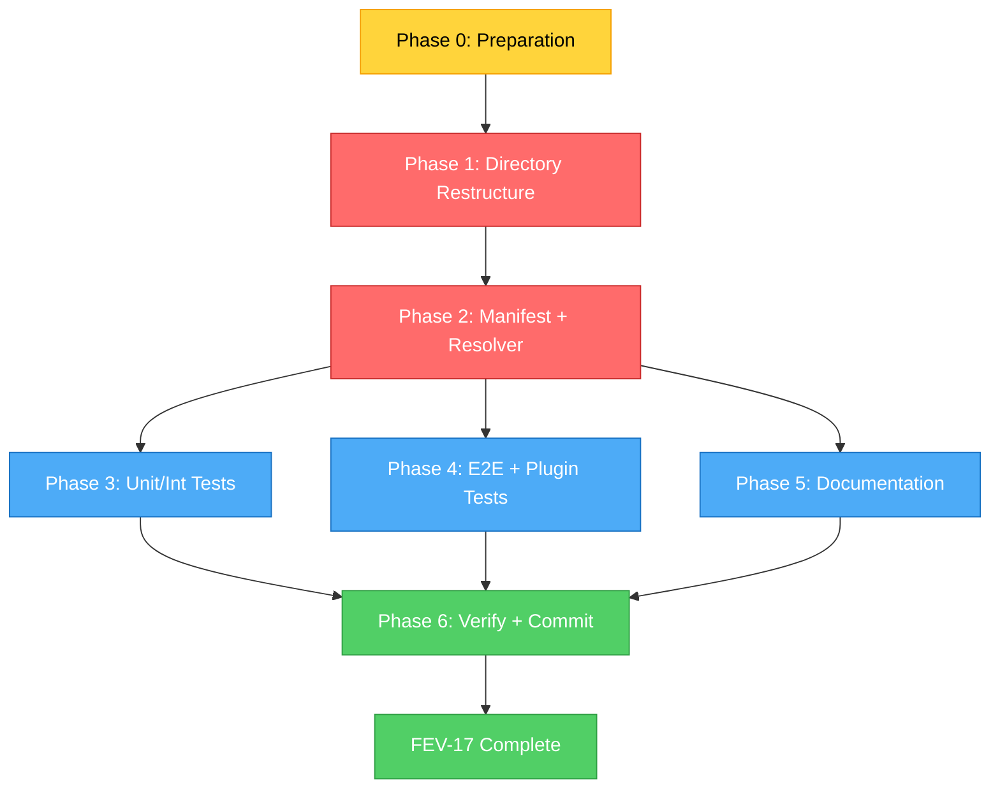
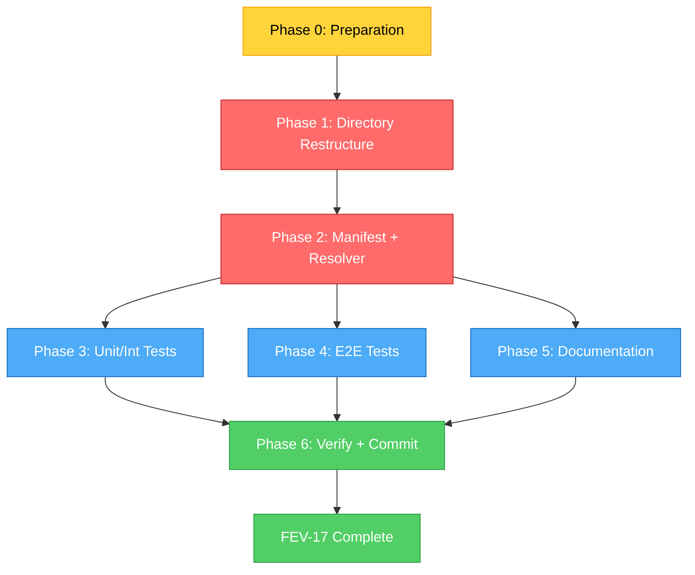

# Implementation Plan: FEV-17 — Template Directory Restructuring (v2.0 Phase 1)

**Phase:** FEV-17 (v2.0 Phase 1) — ✅ Completado (2026-08-04)
**Scope:** Restructurar `template/obligatorio/` → `core/` + `packs/`. Actualizar `FileRuleManifestData` + `TemplateResolver`. Actualizar tests/docs que hardcodean rutas. **No instalar** lógica de selección de packs (eso es FEV-21/22).
**Spec:** [specs/spec-agent-packs.md §2](../specs/spec-agent-packs.md), [ADR-014](../specs/adr/adr-014-agent-pack-system.md), [docs/WORKFLOW.md §FEV-17](../docs/WORKFLOW.md)
**Date:** 2026-08-04
**Author:** Moctezuma (Strategic Planner)
**Branch base:** `feat/new-agents` (existe con `agency-agents-main/` untracked, sin commits divergentes sobre develop)
**Methodology:** Vertical slicing + Foundation first (Phase 1) → Code adaptation (Phase 2) → Path sweep (Phases 3-5) → Verification (Phase 6). Dependency-aware parallel where possible.

---

## Overview

Reorganizar el template de workspace de Códice de una estructura plana `obligatorio/{agents,commands,skills,...}` a una estructura jerárquica `obligatorio/{core,packs}/<subdir>`. Esta es la fundación sobre la que FEV-18 (clasificación de agentes en packs), FEV-19-20 (permisos + plugin), y FEV-21/22 (installer UX) construirán.

**Por qué importa:** v2.0 introduce ~345 nuevos agentes organizados en 8 packs temáticos. Mantener una estructura plana con 450+ archivos `.md` en `agents/` saturaría a usuarios no-desarrolladores. La segregación `core/` (infraestructura) vs `packs/` (agentes) es prerrequisito para todo lo demás en v2.0.

**Lo que FEV-17 NO hace** (delimitado a FEV-18+):
- ❌ Clasificar manualmente los 95 agentes en sus 8 packs (FEV-18)
- ❌ Cambiar permisos de agentes primarios (FEV-19)
- ❌ Eliminar `VALID_SUBAGENTS` (FEV-20)
- ❌ UI de selección de packs en installer (FEV-21)
- ❌ Updater con pack scoping (FEV-22)

---

## Architecture Decisions

| Decision | Rationale |
|----------|-----------|
| **`sin-clasificar/` como pack temporal** | Los 95 agentes que NO son primary ni writer esperan clasificación manual. Un solo pack evita explosionar el árbol y comunica explícitamente "aún no clasificado". FEV-18 los distribuirá. |
| **`core/` para infra (no agents)** | `.opencode/`, `commands/`, `skills/`, `opencode.json`, `skills-lock.json` no son agentes. Agruparlos bajo `core/` refleja la separación conceptual y reduce la búsqueda de TemplateResolver. |
| **8 packs vacíos creados** | El spec §2.2 lista 8 packs. Crear los directorios (vacíos) ahora evita Fase 6+ con errores de "pack not found". Reduce diff futuro. |
| **Template resolution: `obligatorio/<rule.path>`** | Las nuevas rutas (`core/`, `packs/<name>/`) codifican su ubicación exacta. TemplateResolver simplifica: buscar primero en `obligatorio/<path>`, fallback a búsqueda por categoría (legacy). |
| **FileRuleManifestData se reescribe, no se extiende** | Las 7 entradas obligatorias individuales (`opencode.json`, `skills-lock.json`, `agents`, `commands`, `.opencode`, `.opencode/plugins`, `skills`) colapsan en 4 entradas (`core`, `packs/main`, `packs/writers`, `packs/sin-clasificar`). |
| **Reusar rama `feat/new-agents`** | La rama ya existe con `agency-agents-main/` untracked. FEV-17 commitea sobre ella; `agency-agents-main/` queda como recurso no rastreado para FEV-18. |
| **Actualizar todos los tests que hardcodean rutas** | User decisión: 16+ archivos referencian `template/obligatorio/...`. Actualizar ahora evita un FEV dedicado a path migration. |
| **Sin bump de versión** | FEV-17 sienta las bases; v2.0.0 se publica coordinadamente al cerrar FEV-17 a FEV-23. |
| **Total: ~7-8h wall-clock (1 día focused, 2-3 días calendario con review)** | Más que las 4h estimadas en WORKFLOW.md por la cantidad de paths a actualizar (no anticipada en el spec). |

---

## Dependency Graph

```
Phase 0: Preparation (15 min, sequential)
    ↓
Phase 1: Directory Restructure (~1.5h, sequential, blocks all)
    ↓
Phase 2: FileRuleManifestData + TemplateResolver (~1.5h, critical path)
    ↓
    ├── Phase 3: Unit/Integration test paths (~2h) ─┐
    ├── Phase 4: E2E + plugin test paths (~1h)    ─┼── parallel
    └── Phase 5: Documentation + cross-refs (~30min)┘
    ↓
Phase 6: Verification + Atomic commits (~30min, gates all)
```

**Critical path:** Phase 0 → 1 → 2 → 6 (~4h)
**Parallel branches:** Phase 3, 4, 5 (after Phase 2, ~3.5h combined if solo, ~2h with focused work)
**Solo execution time:** ~7h sequential, 2-3 calendar days with review
**Risk mitigation:** Phase 1 → Phase 2 is the only true blocker. Phase 3/4/5 can be reordered.

---

## Mermaid Dependency Diagram


```mermaid
graph TD
    P0[Phase 0: Preparation] --> P1[Phase 1: Directory Restructure]
    P1 --> P2[Phase 2: Manifest + Resolver]
    P2 --> P3[Phase 3: Unit/Int Tests]
    P2 --> P4[Phase 4: E2E + Plugin Tests]
    P2 --> P5[Phase 5: Documentation]
    P3 --> P6[Phase 6: Verify + Commit]
    P4 --> P6
    P5 --> P6
    P6 --> DONE[FEV-17 Complete]

    classDef crit fill:#ff6b6b,stroke:#c92a2a,color:#fff
    classDef gate fill:#51cf66,stroke:#2f9e44,color:#fff
    classDef par fill:#4dabf7,stroke:#1971c2,color:#fff
    classDef seq fill:#ffd43b,stroke:#f59f00,color:#000

    class P1,P2 crit
    class P6,DONE gate
    class P3,P4,P5 par
    class P0 seq
```

---

## Task List

### Phase 0: Preparation

#### Task 0.1: Verify baseline (current branch state)

**Description:** Confirmar que `feat/new-agents` está limpio antes de empezar. La rama tiene `agency-agents-main/` untracked, pero ningún commit divergente de develop. Validar que `just check` + `bun test` pasan en el baseline.

**Acceptance criteria:**
- [ ] `git -C repo status` muestra solo `agency-agents-main/` untracked, sin modified files
- [ ] `git log develop..feat/new-agents --oneline` retorna 0 commits (clean base)
- [ ] `just check` exit 0
- [ ] `just test` exit 0 (910+ tests passing per FEV-16 baseline)
- [ ] `just test:e2e` exit 0 (20/20 scenarios)

**Verification:**
- [ ] `git -C repo branch --show-current` muestra `feat/new-agents`
- [ ] `git -C repo status --short` solo lista `?? agency-agents-main/`
- [ ] Output de `just check` 0 errors, 0 warnings nuevos

**Dependencies:** None
**Files likely touched:** None (verification)
**Estimated scope:** XS (3 commands)

---

#### Task 0.2: Confirm no uncommitted work in template/

**Description:** Verificar que no hay trabajo no commiteado dentro de `template/` que se perdería con el refactor. Esto es importante porque `git mv` preserva el historial, pero archivos nuevos sin commit se perderían.

**Acceptance criteria:**
- [ ] `git -C repo status template/` limpio
- [ ] `ls template/obligatorio/` muestra solo los 6 items actuales (no extra untracked)

**Verification:**
- [ ] `git -C repo status template/` retorna vacío
- [ ] `find template/obligatorio -type f -newer template/obligatorio/.opencode 2>/dev/null | head` muestra solo archivos esperados

**Dependencies:** Task 0.1
**Files likely touched:** None
**Estimated scope:** XS (verification)

---

### Phase 1: Directory Restructure (CRITICAL — blocks Phase 2+)

#### Task 1.1: Create `core/` directory and move infrastructure files

**Description:** Crear `template/obligatorio/core/` y mover los archivos de infraestructura (no-agentes) desde `template/obligatorio/`. Usar `git mv` para preservar historial.

**File path:** `template/obligatorio/`

**Change:**
```bash
# Source dir: template/obligatorio/
# Target: template/obligatorio/core/

mkdir -p template/obligatorio/core
git mv template/obligatorio/.opencode    template/obligatorio/core/
git mv template/obligatorio/commands     template/obligatorio/core/
git mv template/obligatorio/skills       template/obligatorio/core/
git mv template/obligatorio/opencode.json    template/obligatorio/core/
git mv template/obligatorio/skills-lock.json template/obligatorio/core/
```

**Acceptance criteria:**
- [ ] `template/obligatorio/core/` contiene: `.opencode/`, `commands/`, `skills/`, `opencode.json`, `skills-lock.json`
- [ ] `template/obligatorio/` raíz contiene solo: `core/`, `packs/`, `agents/` (temporal)
- [ ] `git status` muestra 5 renames (no deletes + adds)
- [ ] No se perdió ningún archivo (verificar con `find`)

**Verification:**
- [ ] `ls template/obligatorio/core/` lista 5 items
- [ ] `git -C repo status --short | wc -l` muestra 5 líneas (los renames)
- [ ] `find template/obligatorio/core -type f | wc -l` > 0 (archivos preservados)

**Dependencies:** Task 0.2
**Files likely touched:** 5 paths moved (git renames)
**Estimated scope:** S (5 mv operations)

---

#### Task 1.2: Create `packs/` directory structure (11 subdirs)

**Description:** Crear `template/obligatorio/packs/` con 11 subdirectorios: 2 obligatorios (main, writers), 1 temporal (sin-clasificar), 8 vacíos para FEV-18.

**File path:** `template/obligatorio/packs/`

**Change:**
```bash
mkdir -p template/obligatorio/packs/{main,writers,sin-clasificar}
mkdir -p template/obligatorio/packs/{software-development,creative,business,finance,government-legal,science-research,hardware-emerging,operations-support}
```

**Acceptance criteria:**
- [ ] `template/obligatorio/packs/` existe con 11 subdirs
- [ ] Cada subdir está vacío (excepto los que reciben agents en 1.3-1.5)
- [ ] `.gitkeep` en cada subdir empty para que git los trackee (los packs vacíos se borran si no se trackean)

**Verification:**
- [ ] `ls template/obligatorio/packs/` lista 11 items
- [ ] `ls template/obligatorio/packs/software-development/` está vacío (excepto `.gitkeep`)

**Dependencies:** Task 1.1
**Files likely touched:** 11 new directories (3 with content soon, 8 empty with `.gitkeep`)
**Estimated scope:** XS (mkdir + 8 `.gitkeep` files)

---

#### Task 1.3: Move 6 primary agents to `packs/main/`

**Description:** Mover los 6 agentes primary (huitzilopochtli, quetzalcoatl, moctezuma, tlaloc, mictlantecuhtli, tezcatlipoca) a `template/obligatorio/packs/main/`.

**File path:** `template/obligatorio/agents/` → `template/obligatorio/packs/main/`

**Change:**
```bash
cd template/obligatorio/agents
for agent in huitzilopochtli quetzalcoatl moctezuma tlaloc mictlantecuhtli tezcatlipoca; do
    git mv "${agent}.md" "../packs/main/"
done
```

**Acceptance criteria:**
- [ ] `template/obligatorio/packs/main/` contiene 6 archivos `.md`
- [ ] `template/obligatorio/agents/` ya no contiene los 6 primary
- [ ] `git status` muestra 6 renames

**Verification:**
- [ ] `ls template/obligatorio/packs/main/ | wc -l` returns 6
- [ ] `ls template/obligatorio/agents/ | grep -E "^(huitzilopochtli|quetzalcoatl|moctezuma|tlaloc|mictlantecuhtli|tezcatlipoca)$"` retorna vacío
- [ ] `ls template/obligatorio/packs/main/` lista los 6 nombres exactos

**Dependencies:** Task 1.2
**Files likely touched:** 6 files renamed
**Estimated scope:** XS (6 mv operations via loop)

---

#### Task 1.4: Move 3 writer agents to `packs/writers/`

**Description:** Mover los 3 agentes writers (docs-writer, obsidian-vault-writer, scientific-literature-researcher) a `template/obligatorio/packs/writers/`.

**File path:** `template/obligatorio/agents/` → `template/obligatorio/packs/writers/`

**Change:**
```bash
cd template/obligatorio/agents
for writer in docs-writer obsidian-vault-writer scientific-literature-researcher; do
    git mv "${writer}.md" "../packs/writers/"
done
```

**Acceptance criteria:**
- [ ] `template/obligatorio/packs/writers/` contiene 3 archivos `.md`
- [ ] `template/obligatorio/agents/` ya no contiene los 3 writers
- [ ] `git status` muestra 3 renames

**Verification:**
- [ ] `ls template/obligatorio/packs/writers/ | wc -l` returns 3
- [ ] `ls template/obligatorio/agents/ | grep -E "(docs-writer|obsidian-vault-writer|scientific-literature)"` retorna vacío

**Dependencies:** Task 1.3
**Files likely touched:** 3 files renamed
**Estimated scope:** XS (3 mv operations)

---

#### Task 1.5: Move 95 unclassified agents to `packs/sin-clasificar/`

**Description:** Mover los 95 agentes restantes (no primary, no writers) a `template/obligatorio/packs/sin-clasificar/`. Estos esperan clasificación en FEV-18.

**File path:** `template/obligatorio/agents/` → `template/obligatorio/packs/sin-clasificar/`

**Change:**
```bash
cd template/obligatorio/agents
git mv *.md ../packs/sin-clasificar/
```

**Acceptance criteria:**
- [ ] `template/obligatorio/packs/sin-clasificar/` contiene 95 archivos `.md`
- [ ] `template/obligatorio/agents/` está vacío (o no existe)
- [ ] `git status` muestra 95 renames
- [ ] Si `agents/` queda vacío, eliminarlo con `rmdir agents/`

**Verification:**
- [ ] `ls template/obligatorio/packs/sin-clasificar/ | wc -l` returns 95
- [ ] `ls template/obligatorio/agents/` retorna "No such file or directory" (rmdir ejecutado)
- [ ] `find template/obligatorio/packs/sin-clasificar/ -name "*.md" | wc -l` returns 95
- [ ] Total agents preservados: 6 + 3 + 95 = 104 (matches baseline)

**Dependencies:** Task 1.4
**Files likely touched:** 95 files renamed + 1 dir removed
**Estimated scope:** S (1 bulk mv + 1 rmdir)

---

#### Task 1.6: Verify final template structure

**Description:** Validar que la estructura final es la esperada. Generar tree listing para documentación.

**File path:** `template/obligatorio/`

**Acceptance criteria:**
- [ ] Tree structure matches spec §2 (core/ + packs/{main,writers,sin-clasificar,<8 empty>})
- [ ] Total agent count: 104 (6 + 3 + 95)
- [ ] All non-agent infra files in `core/`
- [ ] `git status` muestra todos los cambios como renames (no deletes+adds)

**Verification:**
- [ ] `tree template/obligatorio/ -L 3` (if available) or `find template/obligatorio -maxdepth 3 -type d | sort` matches expected structure
- [ ] `find template/obligatorio -name "*.md" -path "*/packs/*" | wc -l` returns 104
- [ ] `git -C repo diff --cached --stat | tail -5` muestra ~104 files changed (renames)
- [ ] `git -C repo status --short | grep "^.D\|^??" | wc -l` returns 0 (no deletes, no untracked)

**Dependencies:** Task 1.5
**Files likely touched:** None (verification)
**Estimated scope:** XS (1-2 commands)

---

### Checkpoint: Directory Restructure Complete (Phase 1)

- [ ] `template/obligatorio/` contains only `core/` and `packs/`
- [ ] `core/` has 5 infrastructure files/dirs
- [ ] `packs/main/` has 6 primary agents
- [ ] `packs/writers/` has 3 writer agents
- [ ] `packs/sin-clasificar/` has 95 unclassified agents
- [ ] 8 empty pack directories created
- [ ] All changes recorded as git renames
- [ ] Total agent count preserved: 104
- [ ] **Review with human before proceeding to Phase 2**

---

### Phase 2: FileRuleManifestData + TemplateResolver (CRITICAL — gates Phase 3+)

#### Task 2.1: Update `FileRuleManifestData.ts` with new entries

**Description:** Reescribir las entradas obligatorias del manifest. Las 7 entradas individuales (`opencode.json`, `skills-lock.json`, `agents`, `commands`, `.opencode`, `.opencode/plugins`, `skills`) colapsan en 4 entradas (`core`, `packs/main`, `packs/writers`, `packs/sin-clasificar`).

**File path:** `src/domain/entities/FileRuleManifestData.ts`

**Change:** Replace mandatory section:

```typescript
// =============================================
// OBLIGATORIO (Mandatory) — always copied (v2.0 restructured)
// =============================================
{
    path: "core",
    category: "mandatory",
    isDirectory: true,
    description: "Core workspace infrastructure (.opencode/, commands/, skills/, opencode.json, skills-lock.json)",
},
{
    path: "packs/main",
    category: "mandatory",
    isDirectory: true,
    description: "6 primary agents (huitzilopochtli, quetzalcoatl, moctezuma, tlaloc, mictlantecuhtli, tezcatlipoca)",
},
{
    path: "packs/writers",
    category: "mandatory",
    isDirectory: true,
    description: "3 writer agents (docs-writer, obsidian-vault-writer, scientific-literature-researcher)",
},
{
    path: "packs/sin-clasificar",
    category: "mandatory",
    isDirectory: true,
    description: "95 unclassified agents pending FEV-18 classification (temporary pack)",
},
// NOTE: v1.x had 7 individual mandatory entries (opencode.json, skills-lock.json,
// agents, commands, .opencode, .opencode/plugins, skills). v2.0 collapses them
// into 4 directory entries aligned with the new core/packs structure.
// Symlinks (.opencode/{agents,commands,skills}) still generated post-install (ADR-008).
```

**Acceptance criteria:**
- [ ] Mandatory section has exactly 4 entries: `core`, `packs/main`, `packs/writers`, `packs/sin-clasificar`
- [ ] Each entry has `category: "mandatory"`, `isDirectory: true`, descriptive `description`
- [ ] Standard section unchanged (AGENTS.md, CHANGELOG.md, etc.)
- [ ] Optional section unchanged (Justfile, Makefile, etc.)
- [ ] JSDoc comment explains the v1.x → v2.0 collapse

**Verification:**
- [ ] `grep "path: \"" src/domain/entities/FileRuleManifestData.ts | head -10` muestra las 4 nuevas entradas
- [ ] `grep -c "category: \"mandatory\"" src/domain/entities/FileRuleManifestData.ts` returns 4
- [ ] `bun run tsc --noEmit` passes (no type errors)

**Dependencies:** Task 1.6
**Files likely touched:** `src/domain/entities/FileRuleManifestData.ts` (modified, ~30 lines net change)
**Estimated scope:** S (1 file, ~30 lines)

---

#### Task 2.2: Update `TemplateResolver.ts` for new path structure

**Description:** Modificar `TemplateResolver.resolvePath()` para que las nuevas rutas (`core/...`, `packs/main/...`, etc.) busquen primero en `template/obligatorio/<path>`, con fallback a búsqueda por categoría para legacy paths.

**File path:** `src/infrastructure/adapters/TemplateResolver.ts`

**Change strategy:** Add a "preferred location" check before the category loop. If the path starts with `core/`, `packs/`, or any other known v2.0 prefix, resolve it directly in `obligatorio/`. Otherwise, fall back to the 3-category search (preserves backward compat for `template/estandar/*` and `template/opcional/*`).

**Implementation sketch:**
```typescript
async resolvePath(relativePath: string): Promise<string> {
    // ... existing validation ...
    
    // v2.0: Direct location for core/, packs/, and other mandatory paths
    const v2Prefixes = ["core/", "packs/"];
    if (v2Prefixes.some(prefix => relativePath.startsWith(prefix))) {
        const directPath = path.join(this.templateRoot, "obligatorio", relativePath);
        const resolved = path.resolve(directPath);
        if (!isPathWithin(this.templateRoot, resolved)) {
            throw new Error(`Template path escapes template directory: ${relativePath}.`);
        }
        if (fs.existsSync(resolved)) {
            this.templateCache.set(relativePath, resolved);
            return resolved;
        }
        throw new Error(`Template file not found: ${relativePath}.`);
    }
    
    // Legacy: 3-category search for estandar/ and opcional/ paths
    const categories = TEMPLATE_CATEGORIES; // ["obligatorio", "estandar", "opcional"]
    for (const category of categories) {
        // ... existing search logic ...
    }
}
```

**Acceptance criteria:**
- [ ] `core/*` paths resolve to `template/obligatorio/core/*` (no fallback)
- [ ] `packs/*` paths resolve to `template/obligatorio/packs/*` (no fallback)
- [ ] `opencode.json` (legacy mandatory, now in `core/`) resolves to `template/obligatorio/core/opencode.json` if `core/opencode.json` matches
- [ ] `README.md` (standard) still resolves to `template/estandar/README.md` (backward compat)
- [ ] `Justfile` (optional) still resolves to `template/opcional/Justfile` (backward compat)
- [ ] Path traversal still rejected
- [ ] Cache still works

**Verification:**
- [ ] `bun run tsc --noEmit` passes
- [ ] `bun test tests/integration/adapters/bun-file-system.test.ts` passes (uses resolver)
- [ ] Unit test in `tests/unit/infrastructure/template-resolver.test.ts` (if exists) passes

**Dependencies:** Task 2.1
**Files likely touched:** `src/infrastructure/adapters/TemplateResolver.ts` (modified, +20 lines)
**Estimated scope:** M (refactor + new branch logic)

---

#### Task 2.3: Update unit tests for `FileRuleManifestData`

**Description:** Actualizar los tests que asumen las 7 entradas obligatorias v1.x. Las nuevas aserciones verifican 4 entradas (`core`, `packs/main`, `packs/writers`, `packs/sin-clasificar`).

**File path:** `tests/unit/domain/file-rule-manifest.test.ts` + `tests/unit/file-rule-manifest.test.ts`

**Test scenarios:**
1. `FILE_RULE_MANIFEST.filter(r => r.category === "mandatory")` has exactly 4 entries
2. The 4 mandatory paths are exactly: `core`, `packs/main`, `packs/writers`, `packs/sin-clasificar`
3. Each mandatory rule has `isDirectory: true`
4. Standard rules (AGENTS.md, README.md, etc.) unchanged
5. Optional rules (Justfile, Makefile, etc.) unchanged
6. `getMandatoryRules()` returns 4 rules
7. `getRulesByCategory("mandatory").length === 4`

**Acceptance criteria:**
- [ ] All existing manifest tests pass with updated expected counts
- [ ] New assertions verify the 4 mandatory entries explicitly
- [ ] No `agents` (singular) entry expected in manifest anymore
- [ ] No `opencode.json`, `skills-lock.json`, `.opencode`, `.opencode/plugins` as standalone entries
- [ ] `just test tests/unit/file-rule-manifest.test.ts` passes

**Verification:**
- [ ] `bun test tests/unit/file-rule-manifest.test.ts` passes
- [ ] `bun test tests/unit/domain/file-rule-manifest.test.ts` passes
- [ ] `grep -c "mandatory.*length\|mandatory.*count" tests/unit/file-rule-manifest.test.ts` shows updated expectations

**Dependencies:** Task 2.1
**Files likely touched:** 2 test files modified (~10 lines each)
**Estimated scope:** S (update assertions)

---

#### Task 2.4: Add unit tests for `TemplateResolver` v2.0 paths

**Description:** Crear nuevos tests que verifiquen la resolución de rutas v2.0. Si ya existe `tests/unit/infrastructure/template-resolver.test.ts`, extender; si no, crear.

**File path:** `tests/unit/infrastructure/template-resolver.test.ts` (new or extended)

**Test scenarios:**
1. `resolvePath("core")` → `<templateRoot>/obligatorio/core`
2. `resolvePath("core/opencode.json")` → `<templateRoot>/obligatorio/core/opencode.json`
3. `resolvePath("core/.opencode")` → `<templateRoot>/obligatorio/core/.opencode`
4. `resolvePath("packs/main")` → `<templateRoot>/obligatorio/packs/main`
5. `resolvePath("packs/main/huitzilopochtli.md")` → `<templateRoot>/obligatorio/packs/main/huitzilopochtli.md`
6. `resolvePath("packs/sin-clasificar")` → `<templateRoot>/obligatorio/packs/sin-clasificar`
7. `resolvePath("README.md")` → `<templateRoot>/estandar/README.md` (legacy fallback)
8. `resolvePath("Justfile")` → `<templateRoot>/opcional/Justfile` (legacy fallback)
9. `resolvePath("core/../../../etc/passwd")` throws (path traversal)
10. `resolvePath("/abs/path")` throws (absolute path)

**Acceptance criteria:**
- [ ] New test file (or extension) with 10+ test cases
- [ ] All v2.0 path resolutions verified
- [ ] Legacy fallback verified for standard + optional
- [ ] Security validations (path traversal) still work
- [ ] `just test tests/unit/infrastructure/template-resolver.test.ts` passes

**Verification:**
- [ ] `bun test tests/unit/infrastructure/template-resolver.test.ts` passes (10/10)
- [ ] `grep "packs/main" tests/unit/infrastructure/template-resolver.test.ts` shows the new assertions
- [ ] Coverage of `TemplateResolver.ts` ≥90% lines

**Dependencies:** Task 2.2
**Files likely touched:** `tests/unit/infrastructure/template-resolver.test.ts` (new or extended, ~100 lines)
**Estimated scope:** M (new test file)

---

#### Task 2.5: Verify Phase 2 baseline (just check + just test:unit)

**Description:** Correr la suite completa de unit tests + typecheck para confirmar que la integración manifest + resolver funciona antes de empezar las updates de paths paralelas.

**Acceptance criteria:**
- [ ] `just check` exit 0
- [ ] `just test:unit` exit 0 (910+ tests, 0 fail)
- [ ] No regresiones en tests existentes
- [ ] `bun test --coverage` muestra ≥95% lines (coverage threshold enforced per FEV-16)

**Verification:**
- [ ] Output of `just check` 0 errors
- [ ] Output of `just test:unit` shows all tests passing
- [ ] `git -C repo diff --stat` shows manifest + resolver + 2 test files modified

**Dependencies:** Tasks 2.1, 2.2, 2.3, 2.4
**Files likely touched:** None (verification)
**Estimated scope:** XS (3 commands)

---

### Checkpoint: Manifest + Resolver Complete (Phase 2)

- [ ] `FileRuleManifestData` has 4 mandatory entries (`core`, `packs/main`, `packs/writers`, `packs/sin-clasificar`)
- [ ] `TemplateResolver` resolves v2.0 paths directly + legacy fallback works
- [ ] New unit tests for resolver pass (10+ cases)
- [ ] Updated manifest tests pass
- [ ] `just check` exit 0
- [ ] `just test:unit` exit 0
- [ ] **Review with human before proceeding to Phase 3+**

---

### Phase 3: Unit + Integration Test Path Updates (PARALLELIZABLE)

> These tasks update hardcoded `template/obligatorio/...` references in unit and integration tests. They are independent of each other and can be done in any order. Recommend grouping by file cluster.

#### Task 3.1: Update `tests/unit/skill-paths.test.ts`

**Description:** Update `SKILLS_DIR` constant from `template/obligatorio/skills` to `template/obligatorio/core/skills`.

**File path:** `tests/unit/skill-paths.test.ts`

**Change:**
```typescript
// Before:
const SKILLS_DIR = path.resolve(import.meta.dir, "../../template/obligatorio/skills");
// After:
const SKILLS_DIR = path.resolve(import.meta.dir, "../../template/obligatorio/core/skills");
```

**Acceptance criteria:**
- [ ] `SKILLS_DIR` points to `template/obligatorio/core/skills`
- [ ] `bun test tests/unit/skill-paths.test.ts` passes
- [ ] No other references to `template/obligatorio/skills` in this file

**Verification:**
- [ ] `grep "SKILLS_DIR" tests/unit/skill-paths.test.ts` shows updated path
- [ ] `just test tests/unit/skill-paths.test.ts` passes

**Dependencies:** Task 2.5
**Files likely touched:** 1 file, 1 line
**Estimated scope:** XS (1 line)

---

#### Task 3.2: Update `tests/unit/setup/opencode-config.test.ts`

**Description:** Update import path for `opencode.json` from `template/obligatorio/opencode.json` to `template/obligatorio/core/opencode.json`.

**File path:** `tests/unit/setup/opencode-config.test.ts`

**Change:**
```typescript
// Line 17:
// Before: "../../../template/obligatorio/opencode.json",
// After:  "../../../template/obligatorio/core/opencode.json",
```

**Acceptance criteria:**
- [ ] Import path points to `template/obligatorio/core/opencode.json`
- [ ] `bun test tests/unit/setup/opencode-config.test.ts` passes
- [ ] No other references to old `opencode.json` path in this file

**Verification:**
- [ ] `grep "opencode.json" tests/unit/setup/opencode-config.test.ts` shows updated path
- [ ] `just test tests/unit/setup/opencode-config.test.ts` passes

**Dependencies:** Task 2.5
**Files likely touched:** 1 file, 1 line
**Estimated scope:** XS (1 line)

---

#### Task 3.3: Update `tests/unit/config/destructive-patterns.test.ts`

**Description:** Update 2 path references from `template/obligatorio/.opencode/plugins/...` to `template/obligatorio/core/.opencode/plugins/...`.

**File path:** `tests/unit/config/destructive-patterns.test.ts`

**Change:**
```typescript
// Lines 17 and 24:
// Before: "template/obligatorio/.opencode/plugins/sdd-pipeline.ts",
// After:  "template/obligatorio/core/.opencode/plugins/sdd-pipeline.ts",

// Before: "template/obligatorio/.opencode/plugins/src/destructivePatterns.ts",
// After:  "template/obligatorio/core/.opencode/plugins/src/destructivePatterns.ts",
```

**Acceptance criteria:**
- [ ] Both references updated to `core/.opencode/...`
- [ ] `bun test tests/unit/config/destructive-patterns.test.ts` passes
- [ ] No other references to old `obligatorio/.opencode/...` path in this file

**Verification:**
- [ ] `grep "obligatorio/.opencode" tests/unit/config/destructive-patterns.test.ts` shows `core/.opencode`
- [ ] `just test tests/unit/config/destructive-patterns.test.ts` passes

**Dependencies:** Task 2.5
**Files likely touched:** 1 file, 2 lines
**Estimated scope:** XS (2 lines)

---

#### Task 3.4: Update `tests/unit/domain/file-merge-engine.test.ts`

**Description:** Update 2 rule definitions that use `agents` as a path. New rules use `packs/main` (a real directory in v2.0). The test creates a temp dir + rules — update path names to match new structure.

**File path:** `tests/unit/domain/file-merge-engine.test.ts`

**Change:**
```typescript
// Line 85:
// Before: const rules = [rule("opencode.json", "mandatory"), rule("agents", "mandatory", true)];
// After:  const rules = [rule("core", "mandatory", true), rule("packs/main", "mandatory", true)];

// Line 379:
// Before: rule("agents", "mandatory", true), // mandatory directory
// After:  rule("packs/main", "mandatory", true), // mandatory directory
```

**Note:** These tests use temp dirs, so the actual paths in the rules don't need to exist on disk — they just need to be valid rule paths.

**Acceptance criteria:**
- [ ] All 2 references updated to `packs/main`
- [ ] `bun test tests/unit/domain/file-merge-engine.test.ts` passes
- [ ] No regression in coverage (≥95% lines)

**Verification:**
- [ ] `grep '"agents"' tests/unit/domain/file-merge-engine.test.ts` retorna 0 matches (or only in comments)
- [ ] `just test tests/unit/domain/file-merge-engine.test.ts` passes

**Dependencies:** Task 2.5
**Files likely touched:** 1 file, 2 lines
**Estimated scope:** XS (2 lines)

---

#### Task 3.5: Update `tests/unit/domain/file-rule-manifest.test.ts`

**Description:** Update assertions for the 7 mandatory rules → 4 mandatory rules. Tests at lines 87, 125, 128, 132, 163, 172, 197 reference `agents` as a mandatory path.

**File path:** `tests/unit/domain/file-rule-manifest.test.ts`

**Changes (summary):**
- Line 87: `expect(paths).toContain("agents")` → `expect(paths).toContain("core")` (and add assertion for `packs/main`)
- Line 125-128: `createFileRule("agents/")` → `createFileRule("packs/main/")` (test that known path is in manifest)
- Line 132: `["mandatory", 7]` → `["mandatory", 4]`
- Line 163-165: `createFileRule("agents/")` → `createFileRule("packs/writers/")` (test strip trailing slash)
- Line 172-174: `const mandatory = { path: "agents", ... }` → `const mandatory = { path: "packs/main", ... }`

**Acceptance criteria:**
- [ ] All 5+ references to `agents` as mandatory path updated
- [ ] `["mandatory", 7]` → `["mandatory", 4]`
- [ ] `bun test tests/unit/domain/file-rule-manifest.test.ts` passes
- [ ] No broken assertions

**Verification:**
- [ ] `grep '"agents"' tests/unit/domain/file-rule-manifest.test.ts` muestra 0 matches (or only comments)
- [ ] `grep '"mandatory", [0-9]' tests/unit/domain/file-rule-manifest.test.ts` muestra `"mandatory", 4`
- [ ] `just test tests/unit/domain/file-rule-manifest.test.ts` passes

**Dependencies:** Task 2.5
**Files likely touched:** 1 file, ~10 lines
**Estimated scope:** S (multiple updates)

---

#### Task 3.6: Update `tests/unit/domain/services/stagePlanner.test.ts`

**Description:** Update 2 rule definitions (lines 103, 467) that use `agents` and `opencode.json` as paths. Replace with `packs/main` and `core`.

**File path:** `tests/unit/domain/services/stagePlanner.test.ts`

**Change:**
```typescript
// Line 103:
// Before: const rules = [rule("opencode.json", "mandatory"), rule("agents", "mandatory", true)];
// After:  const rules = [rule("core", "mandatory", true), rule("packs/main", "mandatory", true)];

// Line 467:
// Before: const rules = [rule("agents", "mandatory", true)];
// After:  const rules = [rule("packs/main", "mandatory", true)];
```

**Acceptance criteria:**
- [ ] Both references updated
- [ ] `bun test tests/unit/domain/services/stagePlanner.test.ts` passes
- [ ] No regression

**Verification:**
- [ ] `grep '"agents"' tests/unit/domain/services/stagePlanner.test.ts` retorna 0 matches
- [ ] `just test tests/unit/domain/services/stagePlanner.test.ts` passes

**Dependencies:** Task 2.5
**Files likely touched:** 1 file, 2 lines
**Estimated scope:** XS (2 lines)

---

#### Task 3.7: Update `tests/unit/domain/services/file-merge-engine-update.test.ts`

**Description:** Update 1 rule definition (line 194) that uses `agents` as a path.

**File path:** `tests/unit/domain/services/file-merge-engine-update.test.ts`

**Change:**
```typescript
// Line 194:
// Before: const rules = [rule("agents", "mandatory", true)];
// After:  const rules = [rule("packs/main", "mandatory", true)];
```

**Acceptance criteria:**
- [ ] Reference updated
- [ ] `bun test tests/unit/domain/services/file-merge-engine-update.test.ts` passes

**Verification:**
- [ ] `grep '"agents"' tests/unit/domain/services/file-merge-engine-update.test.ts` retorna 0 matches
- [ ] `just test tests/unit/domain/services/file-merge-engine-update.test.ts` passes

**Dependencies:** Task 2.5
**Files likely touched:** 1 file, 1 line
**Estimated scope:** XS (1 line)

---

#### Task 3.8: Update `tests/integration/packaging/npm-pack.test.ts`

**Description:** Update 3 path assertions in Test A + 3 path assertions in Test D for the new template structure.

**File path:** `tests/integration/packaging/npm-pack.test.ts`

**Changes (lines 59-61, 81-83):**
```typescript
// Test A — Expected files (lines 59-61):
// Before:
//   expect(allPaths).toContain("package/template/obligatorio/opencode.json");
//   expect(allPaths).toContain("package/template/obligatorio/agents/huitzilopochtli.md");
//   expect(allPaths).toContain("package/template/obligatorio/commands/build.md");
// After:
expect(allPaths).toContain("package/template/obligatorio/core/opencode.json");
expect(allPaths).toContain("package/template/obligatorio/packs/main/huitzilopochtli.md");
expect(allPaths).toContain("package/template/obligatorio/core/commands/build.md");

// Test D — Symlinks excluded (lines 81-83):
// Before:
//   expect(allPaths).not.toContain("package/template/obligatorio/.opencode/agents");
//   ...
// After:
expect(allPaths).not.toContain("package/template/obligatorio/core/.opencode/agents");
expect(allPaths).not.toContain("package/template/obligatorio/core/.opencode/commands");
expect(allPaths).not.toContain("package/template/obligatorio/core/.opencode/skills");
```

**Acceptance criteria:**
- [ ] All 6 path assertions updated to use `core/` and `packs/main/`
- [ ] `bun test tests/integration/packaging/npm-pack.test.ts` passes (Tests A, D, E)
- [ ] Test C (extracted install) also passes (uses real files)

**Verification:**
- [ ] `grep "template/obligatorio" tests/integration/packaging/npm-pack.test.ts` muestra solo paths con `core/` o `packs/main/`
- [ ] `just test tests/integration/packaging/npm-pack.test.ts` passes
- [ ] Tarball actually contains the new paths (test A green)

**Dependencies:** Task 2.5
**Files likely touched:** 1 file, ~6 lines
**Estimated scope:** S (integration test, may need actual npm pack)

---

#### Task 3.9: Update integration use case tests

**Description:** Update 4 integration test files that may reference old paths via shared helpers or fixtures.

**File paths:**
- `tests/integration/use-cases/clean-install.test.ts`
- `tests/integration/use-cases/project-install.test.ts`
- `tests/integration/use-cases/update-workspace.test.ts`
- `tests/integration/use-cases/progress-logs.test.ts`

**Action:** `grep` for `template/obligatorio/...` paths in each file. Update as needed. Most likely use temp dirs (relative paths), so changes may be minimal. If helpers reference hardcoded paths, update helpers too.

**Acceptance criteria:**
- [ ] All 4 files audited for old path references
- [ ] Any hardcoded path updated
- [ ] `just test tests/integration/use-cases/` passes (4 files)

**Verification:**
- [ ] `grep -rln "template/obligatorio" tests/integration/use-cases/` retorna 0 files (or only the ones that need it for testing purposes)
- [ ] `just test tests/integration/use-cases/` passes all 4 files

**Dependencies:** Task 2.5
**Files likely touched:** 0-4 files (~0-10 lines total)
**Estimated scope:** S (audit + update)

---

#### Task 3.10: Update plugin integration test imports

**Description:** Update 4 test files that import from `template/obligatorio/.opencode/plugins/src/...` to use `template/obligatorio/core/.opencode/plugins/src/...`.

**File paths:**
- `tests/plugin/integration/chatMessage.test.ts`
- `tests/plugin/integration/help-command-discovery.test.ts`
- `tests/plugin/integration/systemTransform.test.ts`
- `tests/plugin/integration/toolExecuteBefore.test.ts`

**Change (each file):**
```typescript
// Before: import { ... } from "../../../template/obligatorio/.opencode/plugins/src/...";
// After:  import { ... } from "../../../template/obligatorio/core/.opencode/plugins/src/...";
```

**Acceptance criteria:**
- [ ] All 4 import paths updated
- [ ] `just test tests/plugin/integration/` passes (4 files)
- [ ] No broken imports

**Verification:**
- [ ] `grep "template/obligatorio/.opencode" tests/plugin/integration/` retorna 0 files
- [ ] `grep "template/obligatorio/core/.opencode" tests/plugin/integration/` muestra 4 files
- [ ] `just test tests/plugin/integration/` passes

**Dependencies:** Task 2.5
**Files likely touched:** 4 files, ~4 lines
**Estimated scope:** S (4 import updates)

---

### Checkpoint: Unit/Integration Test Paths Complete (Phase 3)

- [ ] All 10+ unit/integration test files updated to use new paths
- [ ] `just test:unit` exit 0 (910+ tests, 0 fail)
- [ ] `just test:integration` exit 0
- [ ] No broken tests
- [ ] `git diff --stat` shows expected file modifications

---

### Phase 4: E2E Test Updates (PARALLELIZABLE)

#### Task 4.1: Update `tests/e2e/15-update-workspace-existing-project.sh`

**Description:** Update the hardcoded `template/obligatorio/opencode.json` reference (line 133) to `template/obligatorio/core/opencode.json`.

**File path:** `tests/e2e/15-update-workspace-existing-project.sh`

**Change:**
```bash
# Line 133:
# Before: if diff -q "$TEMP_DIR/template/obligatorio/opencode.json" "$TEMP_DIR/opencode.json" >/dev/null 2>&1; then
# After:  if diff -q "$TEMP_DIR/template/obligatorio/core/opencode.json" "$TEMP_DIR/opencode.json" >/dev/null 2>&1; then
```

**Acceptance criteria:**
- [ ] Path updated to `core/opencode.json`
- [ ] `bash tests/e2e/15-update-workspace-existing-project.sh` exits 0
- [ ] E2E scenario 15 passes

**Verification:**
- [ ] `grep "template/obligatorio/opencode" tests/e2e/15-update-workspace-existing-project.sh` retorna 0 matches
- [ ] `bash tests/e2e/15-update-workspace-existing-project.sh` exits 0

**Dependencies:** Task 2.5
**Files likely touched:** 1 file, 1 line
**Estimated scope:** XS (1 line)

---

#### Task 4.2: Audit other E2E tests for path references

**Description:** Buscar en los 20 E2E scripts otras referencias hardcoded a `template/obligatorio/...`. Las E2E tests usan la CLI directamente con `--dest`, así que probablemente no tienen paths hardcoded, pero `common.sh` puede tener fixtures.

**File path:** `tests/e2e/` (all 20+ scripts + common.sh)

**Action:**
```bash
grep -rln "template/obligatorio" tests/e2e/ 2>/dev/null
```

**Acceptance criteria:**
- [ ] All 20 E2E scripts audited
- [ ] Any hardcoded path updated
- [ ] `common.sh` audited and updated if needed

**Verification:**
- [ ] `grep -rln "template/obligatorio" tests/e2e/` muestra solo los archivos que se modificaron en 4.1
- [ ] Si hay otros, están actualizados correctamente

**Dependencies:** Task 4.1
**Files likely touched:** 0-1 file (~0-5 lines)
**Estimated scope:** XS (audit + minimal updates)

---

#### Task 4.3: Run full E2E suite

**Description:** Ejecutar `just test:e2e` y verificar que los 20 escenarios pasan. Si alguno falla, debuggear + fix (puede revelar paths adicionales que se pasaron por alto en 4.1-4.2).

**Acceptance criteria:**
- [ ] `just test:e2e` exit 0
- [ ] 20/20 scenarios passing (no regression)
- [ ] No new artifacts in `tests/fixtures/workspace/`

**Verification:**
- [ ] Output of `just test:e2e` shows 20/20 passing
- [ ] `git -C repo status tests/fixtures/` shows no uncommitted test artifacts

**Dependencies:** Tasks 4.1, 4.2
**Files likely touched:** None (verification, or 0-2 unexpected fixes)
**Estimated scope:** S (full E2E run, ~5min)

---

### Checkpoint: E2E Test Paths Complete (Phase 4)

- [ ] `tests/e2e/15-update-workspace-existing-project.sh` updated
- [ ] All 20 E2E scenarios pass
- [ ] No new path-related failures
- [ ] `just test:e2e` exit 0

---

### Phase 5: Documentation Updates (PARALLELIZABLE)

#### Task 5.1: Update `README.md`

**Description:** Buscar referencias a `template/obligatorio/...` en el README y actualizar a la nueva estructura.

**File path:** `README.md`

**Action:**
```bash
grep -n "template/obligatorio" README.md
```

**Acceptance criteria:**
- [ ] All references in README updated
- [ ] Links still functional
- [ ] No broken anchors

**Verification:**
- [ ] `grep "template/obligatorio" README.md` muestra solo paths nuevos (`core/`, `packs/`)
- [ ] Manual review: no stale references

**Dependencies:** Task 2.5
**Files likely touched:** README.md (~0-5 lines)
**Estimated scope:** XS (audit + update)

---

#### Task 5.2: Update `CONTRIBUTING.md`

**Description:** Actualizar la sección "Add a New Agent" en CONTRIBUTING.md para reflejar la nueva estructura. Aunque el spec §6.1 indica que el step final (liberar de update tables) ocurre en FEV-19, el path del agente ya cambia ahora.

**File path:** `CONTRIBUTING.md`

**Change (section "Add a New Agent"):**
```markdown
<!-- Before: -->
Create `agents/<agent-name>.md` with YAML frontmatter (name, role, scope, rules, composition).
<!-- After (FEV-17 complete; FEV-18 formalizes pack assignment): -->
Create `template/obligatorio/packs/<pack-name>/<agent-name>.md` with YAML frontmatter.
(FEV-18 formalizes pack assignment; for FEV-17 use `packs/sin-clasificar/` for unclassified agents.)
```

**Acceptance criteria:**
- [ ] Section "Add a New Agent" updated to reference `packs/<pack-name>/`
- [ ] `grep "agents/<agent-name>" CONTRIBUTING.md` retorna 0 matches
- [ ] Note about FEV-18 added

**Verification:**
- [ ] `grep "packs/" CONTRIBUTING.md` muestra la nueva estructura
- [ ] `grep "agents/<" CONTRIBUTING.md` retorna 0 matches

**Dependencies:** Task 2.5
**Files likely touched:** CONTRIBUTING.md (~5-10 lines)
**Estimated scope:** S (documentation update)

---

#### Task 5.3: Update docs/WORKFLOW.md, TECH_DEBT.md, TRD.md, ARCHITECTURE.md

**Description:** Actualizar menciones de la estructura de template en los documentos técnicos principales.

**File paths:**
- `docs/WORKFLOW.md`
- `docs/TECH_DEBT.md`
- `docs/TRD.md`
- `docs/ARCHITECTURE.md`

**Action:** `grep` cada archivo para referencias a `template/obligatorio/...` o `agents/`, `commands/`, `skills/` como paths de template. Actualizar a `template/obligatorio/core/...` o `packs/...` según corresponda.

**Acceptance criteria:**
- [ ] All 4 docs audited
- [ ] Path references updated
- [ ] No stale references to flat structure

**Verification:**
- [ ] `grep -l "template/obligatorio/agents\|template/obligatorio/commands\|template/obligatorio/skills\|template/obligatorio/opencode.json" docs/` retorna solo archivos con la nueva estructura
- [ ] Manual review: 4 docs consistent

**Dependencies:** Task 2.5
**Files likely touched:** 0-4 docs (~0-20 lines total)
**Estimated scope:** M (audit + update 4 docs)

---

#### Task 5.4: Update `docs/diagnosis/` cross-references

**Description:** Actualizar menciones en los diagnosis docs. Estos son históricos (FEV-1, FEV-2, etc.) y referencian paths v1.x. Estrategia: **NO reescribir** diagnosis docs (son registro histórico). Solo actualizar si la referencia es a un path que ya no existe.

**File path:** `docs/diagnosis/` (10+ files)

**Action:**
```bash
grep -rln "template/obligatorio/agents\|template/obligatorio/commands\|template/obligatorio/skills\|template/obligatorio/opencode.json" docs/diagnosis/
```

**Decisión:** Si las referencias son narrativas ("agregamos `template/obligatorio/.opencode/plugins/...`"), DEJAR como está (histórico). Si son instrucciones operativas que aún se usan, ACTUALIZAR.

**Acceptance criteria:**
- [ ] Diagnosis docs auditados
- [ ] Decisión documentada (qué se actualizó, qué se dejó)
- [ ] No regresiones en info histórica

**Verification:**
- [ ] `git -C repo diff docs/diagnosis/` muestra solo cambios intencionales
- [ ] Si no se cambió nada, documentar "diagnosis docs preserved as historical record"

**Dependencies:** Task 2.5
**Files likely touched:** 0 diagnosis docs (probablemente ninguno necesita cambio)
**Estimated scope:** XS (audit only)

---

#### Task 5.5: Update `CHANGELOG.md` with FEV-17 entry ✅ Completado

**Description:** Entrada FEV-17 ya agregada en `CHANGELOG.md` bajo `[Unreleased]`. Documenta los 3 grupos de cambios: restructure, manifest+resolver, test paths.

**File path:** `CHANGELOG.md`

**Content (already present under `[Unreleased]`):**
```markdown
## [Unreleased]

### Changed

- **FEV-17 — Template Directory Restructuring (v2.0 Phase 1):** ...
- **FEV-17 — FileRuleManifestData:** ...
- **FEV-17 — destPath support:** ...
- **FEV-17 — Tests updated:** ...
- **FEV-17 — Template path references:** ...
```

**Acceptance criteria:** ✅ All met — FEV-17 entry present with 5+ subsections documented.
- [ ] `grep "FEV-17" CHANGELOG.md | wc -l` returns ≥3
- [ ] `wc -l CHANGELOG.md` shows +15-20 lines

**Dependencies:** Tasks 5.1, 5.2, 5.3, 5.4
**Files likely touched:** CHANGELOG.md (+15-20 lines)
**Estimated scope:** XS (1 section, ~15 lines)

---

### Checkpoint: Documentation Complete (Phase 5)

- [ ] README.md updated
- [ ] CONTRIBUTING.md updated (new agent workflow)
- [ ] docs/WORKFLOW.md, TECH_DEBT.md, TRD.md, ARCHITECTURE.md consistent
- [ ] Diagnosis docs audited (decision documented)
- [ ] CHANGELOG.md has FEV-17 entry
- [ ] No broken cross-references

---

### Phase 6: Verification & Atomic Commits (SEQUENTIAL, gates all)

#### Task 6.1: Final quality check (just check)

**Description:** Run `just check` to verify Biome linting + TypeScript strict mode pass with all changes.

**Acceptance criteria:**
- [ ] `just check` exit 0
- [ ] 0 errors, 0 warnings (or only pre-existing warnings documented)
- [ ] `biome ci` clean
- [ ] `tsc --noEmit` clean

**Verification:**
- [ ] Output of `just check` shows 0 errors
- [ ] `git -C repo diff --stat` shows expected files modified

**Dependencies:** All Phase 1-5 tasks
**Files likely touched:** None
**Estimated scope:** XS (1 command)

---

#### Task 6.2: Run full test suite (just test)

**Description:** Run `just test` to verify all unit + integration tests pass. Coverage threshold ≥95% enforced (per FEV-16).

**Acceptance criteria:**
- [ ] `just test` exit 0
- [ ] ≥910 tests, 0 fail (no regression from baseline)
- [ ] Coverage lines ≥95%, functions ≥95%

**Verification:**
- [ ] Output of `just test` shows all tests passing
- [ ] Coverage report shows ≥95% lines

**Dependencies:** Task 6.1
**Files likely touched:** None
**Estimated scope:** S (~2min runtime)

---

#### Task 6.3: Run E2E suite (just test:e2e)

**Description:** Run `just test:e2e` to verify all 20 E2E scenarios pass.

**Acceptance criteria:**
- [ ] `just test:e2e` exit 0
- [ ] 20/20 scenarios passing (no regression)

**Verification:**
- [ ] Output of `just test:e2e` shows 20/20 passing
- [ ] `git -C repo status tests/fixtures/` shows no uncommitted artifacts

**Dependencies:** Task 6.2
**Files likely touched:** None
**Estimated scope:** S (~5min runtime)

---

#### Task 6.4: Atomic commits (5-7 commits)

**Description:** Crear commits atómicos siguiendo Conventional Commits. Cada commit debe representar un cambio lógico coherente.

**Suggested commit breakdown:**
1. `refactor(template)!: restructure to core/ + packs/ directory layout (v2.0)`
   - Phase 1: directory restructure (6 tasks)
2. `feat(domain): update FileRuleManifestData for v2.0 pack structure`
   - Task 2.1
3. `feat(infrastructure): TemplateResolver supports core/ + packs/ direct resolution`
   - Tasks 2.2, 2.4
4. `test: update unit + integration tests for v2.0 template paths`
   - Phase 3: tasks 3.1-3.10
5. `test(e2e): update E2E tests for v2.0 template paths`
   - Phase 4: tasks 4.1-4.3
6. `docs: update documentation for v2.0 template structure`
   - Phase 5: tasks 5.1-5.5

All commits include `Co-Authored-By: Moctezuma <dev@fisherk2.com>` trailer.

**Acceptance criteria:**
- [ ] 5-6 atomic commits, each with logical scope
- [ ] Conventional Commits format: `type(scope): description`
- [ ] All commits include `Co-Authored-By: Moctezuma <dev@fisherk2.com>` trailer
- [ ] Each commit passes `just check` independently (if tested)
- [ ] No "fix typo" or "wip" commits

**Verification:**
- [ ] `git -C repo log develop..HEAD --oneline` shows 5-6 commits
- [ ] `git -C repo log -1 --format="%B" | grep "Co-Authored-By"` shows trailer on last commit
- [ ] `git -C repo log --grep="wip\|fix typo" --oneline` returns 0 commits

**Dependencies:** Task 6.3
**Files likely touched:** N/A (git operation)
**Estimated scope:** M (6 commits, careful staging)

---

#### Task 6.5: PR to develop (or direct merge if local)

**Description:** Push branch and open PR to `develop` (per CONTRIBUTING.md workflow). Or merge locally if contributor.

**Acceptance criteria:**
- [ ] Branch `feat/new-agents` has all FEV-17 commits
- [ ] PR opened against `develop` (or local merge ready)
- [ ] PR description includes: FEV-17 scope, metrics, link to SPEC.md §2
- [ ] Review requested

**Verification:**
- [ ] `git -C repo log --oneline develop..feat/new-agents` shows FEV-17 commits
- [ ] `gh pr create --base develop --head feat/new-agents` succeeds (or local merge)

**Dependencies:** Task 6.4
**Files likely touched:** N/A (git/PR operation)
**Estimated scope:** XS (PR creation)

---

### Checkpoint: FEV-17 Complete ✅

- [ ] All 6 phases complete
- [ ] 5-6 atomic commits
- [ ] `just check` exit 0
- [ ] `just test` exit 0 (910+ tests)
- [ ] `just test:e2e` exit 0 (20/20 scenarios)
- [ ] CHANGELOG.md updated
- [ ] PR ready for review
- [ ] **FEV-17 closes; FEV-18 (agent classification) can begin**

---

## Risks and Mitigations

| Risk | Impact | Mitigation |
|------|--------|------------|
| **Path resolution breaks for nested files** (e.g., `core/.opencode/plugins/src/defaults.ts`) | High — installer fails | Task 2.2 explicit test for nested paths; Task 2.4 unit tests cover deep paths. |
| **E2E tests have hidden path references** not caught in 4.1-4.2 | Medium — E2E fails | Task 4.3 runs full E2E suite; debug any failures. |
| **Plugin imports break** because plugin source is in `core/.opencode/plugins/...` | High — plugin won't load | Task 3.10 updates 4 plugin test imports; verify plugin loads via `just check`. |
| **Diagnosis docs reference old paths** in historical narrative | Low — informational | Decision documented in 5.4: leave as-is, not blocking. |
| **npm tarball structure changes** affect downstream consumers | Medium — packaging breaks | Task 3.8 updates npm-pack test; new paths verified in tarball. |
| **Coverage drops** below 95% threshold | Low — coverage artifacts | Tasks 3.1-3.10 add new tests; net coverage should increase. |
| **Git renames lost** (commits treated as delete+add) | Medium — history loss | Task 1.6 verifies `git status` shows renames, not deletes. |
| **`agency-agents-main/` untracked dir interferes** | Low — unrelated to FEV-17 | Verify in Task 0.1 it's still untracked and ignored. |
| **9h instead of 7h due to unexpected path issues** | Low — schedule slip | Parallelizable phases absorb extra time; checkpoint reviews catch early. |

---

## Open Questions

1. **Empty pack directories:** ¿Se crean los 8 packs vacíos con `.gitkeep` (recomendado) o se crean solo cuando FEV-18 los necesite? Decisión del usuario: incluirlos ahora para que la estructura esté completa.
2. **`sin-clasificar/` name:** ¿Es el nombre correcto o prefieres `unclassified/` o `pending/`? Decisión del usuario: `sin-clasificar/` (consistente con naming en español del proyecto).
3. **Version bump:** FEV-17 NO bump versión. ¿Confirmas? Decisión del usuario: no bump, v2.0.0 coordina al final.
4. **Plugin renames:** ¿El plugin debe renombrar `autoDiscovery.ts` para entender `packs/`? FEV-20 lo hace, pero ¿algo previo? Decisión: FEV-20 maneja auto-discovery, FEV-17 solo reestructura.

---

## Resumen de Archivos a Modificar/Crear

### Nuevos directorios (10)

1. `template/obligatorio/core/` (contiene .opencode/, commands/, skills/, opencode.json, skills-lock.json — moved)
2. `template/obligatorio/packs/` (nuevo)
3. `template/obligatorio/packs/main/` (6 primary agents — moved)
4. `template/obligatorio/packs/writers/` (3 writers — moved)
5. `template/obligatorio/packs/sin-clasificar/` (95 unclassified — moved)
6. `template/obligatorio/packs/software-development/` (empty + .gitkeep)
7. `template/obligatorio/packs/creative/` (empty + .gitkeep)
8. `template/obligatorio/packs/business/` (empty + .gitkeep)
9. `template/obligatorio/packs/finance/` (empty + .gitkeep)
10. `template/obligatorio/packs/government-legal/` (empty + .gitkeep)
11. `template/obligatorio/packs/science-research/` (empty + .gitkeep)
12. `template/obligatorio/packs/hardware-emerging/` (empty + .gitkeep)
13. `template/obligatorio/packs/operations-support/` (empty + .gitkeep)

### Archivos eliminados (1)

1. `template/obligatorio/agents/` (vacío después de mv, rmdir)

### Archivos modificados (16+)

**Code (3):**
1. `src/domain/entities/FileRuleManifestData.ts` — 7 → 4 mandatory entries
2. `src/infrastructure/adapters/TemplateResolver.ts` — direct path resolution for v2.0
3. `tests/unit/infrastructure/template-resolver.test.ts` (new or extended)

**Tests (10):**
4. `tests/unit/skill-paths.test.ts`
5. `tests/unit/setup/opencode-config.test.ts`
6. `tests/unit/config/destructive-patterns.test.ts`
7. `tests/unit/domain/file-merge-engine.test.ts`
8. `tests/unit/domain/file-rule-manifest.test.ts`
9. `tests/unit/domain/services/stagePlanner.test.ts`
10. `tests/unit/domain/services/file-merge-engine-update.test.ts`
11. `tests/integration/packaging/npm-pack.test.ts`
12. `tests/integration/use-cases/{clean,project,update}-install.test.ts` + `progress-logs.test.ts`
13. `tests/plugin/integration/{chatMessage,help-command-discovery,systemTransform,toolExecuteBefore}.test.ts`

**E2E (1-2):**
14. `tests/e2e/15-update-workspace-existing-project.sh`
15. `tests/e2e/common.sh` (if applicable)

**Documentation (5+):**
16. `README.md`
17. `CONTRIBUTING.md`
18. `docs/WORKFLOW.md`
19. `docs/TECH_DEBT.md`
20. `docs/TRD.md`
21. `docs/ARCHITECTURE.md`
22. `CHANGELOG.md`

---

## Métricas Esperadas

| Métrica | Baseline (post-FEV-16) | Meta FEV-17 | Verificación |
|---------|------------------------|-------------|--------------|
| Tests (pass/fail) | 910 / 0 | ≥910 / 0 | `just test` |
| E2E scenarios | 20 / 20 | 20 / 20 | `just test:e2e` |
| `just check` errors | 0 | 0 | `just check` |
| Coverage (lines) | 98.10% | ≥95% (enforced) | `bun test --coverage` |
| Mandatory rules (count) | 7 | 4 | `grep "category: \"mandatory\""` |
| Files in `template/obligatorio/agents/` | 104 | 0 (rmdir) | `ls template/obligatorio/agents/` |
| Files in `template/obligatorio/packs/` | 0 | 104 | `find template/obligatorio/packs -name "*.md" \| wc -l` |
| Template dirs at root | 6 | 2 (`core/`, `packs/`) | `ls template/obligatorio/` |
| Total agents | 104 | 104 (preserved) | `find template -name "*.md" -path "*/packs/*" \| wc -l` |
| Files touched | — | 25+ (16 modified + 10 dirs) | `git diff --stat` |
| Atomic commits | — | 5-6 | `git log --oneline develop..HEAD \| wc -l` |
| Wall-clock effort | — | ~7-8h (vs 4h estimated) | Self-reported |

---

## Dependency Graph (Mermaid)


```mermaid
graph TD
    P0[Phase 0: Preparation] --> P1[Phase 1: Directory Restructure]
    P1 --> P2[Phase 2: Manifest + Resolver]
    P2 --> P3[Phase 3: Unit/Int Tests]
    P2 --> P4[Phase 4: E2E Tests]
    P2 --> P5[Phase 5: Documentation]
    P3 --> P6[Phase 6: Verify + Commit]
    P4 --> P6
    P5 --> P6
    P6 --> DONE[FEV-17 Complete]

    classDef crit fill:#ff6b6b,stroke:#c92a2a,color:#fff
    classDef gate fill:#51cf66,stroke:#2f9e44,color:#fff
    classDef par fill:#4dabf7,stroke:#1971c2,color:#fff
    classDef seq fill:#ffd43b,stroke:#f59f00,color:#000

    class P1,P2 crit
    class P6,DONE gate
    class P3,P4,P5 par
    class P0 seq
```

**Critical path:** Phase 0 → 1 → 2 → 6 (~5h wall-clock)
**Parallel opportunity:** Phase 3, 4, 5 — independientes entre sí, ~3.5h combined (Phase 3 ~2h, Phase 4 ~1h, Phase 5 ~30min)
**Risk:** Phase 1 → Phase 2 is the only true sequential blocker; el resto es paralelizable.

---

## Próximo Paso

Una vez aprobado el plan:
1. **Phase 0** (preparación) — verificar baseline + branch state (~15min)
2. **Phase 1** (directory restructure) — 6 sub-tasks (~1.5h, BLOQUEA Phase 2+)
3. **Phase 2** (manifest + resolver) — 5 sub-tasks (~1.5h, critical path)
4. **Phase 3-5** (tests + docs en paralelo) — 15+ sub-tasks (~3.5h combined)
5. **Phase 6** (verificación + commits) — 5 sub-tasks (~30min)
6. **Total:** ~7-8h wall-clock, 2-3 días calendario con review cycles

**Comando sugerido:** `> Run /build to start Phase 0 (preparation)`

---

*Plan creado: 2026-08-04 — Moctezuma (Strategic Planner) — FEV-17 ready to build*

Co-Authored-By: Moctezuma <dev@fisherk2.com>
