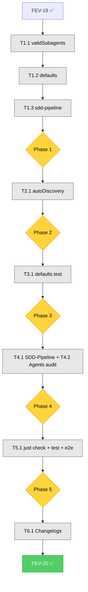

# FEV-20 Todo List — Plugin VALID_SUBAGENTS Removal (v2.0 Phase 4)

**Phase:** FEV-20 (v2.0 Phase 4) — 🔲 Planificado
**Scope:** Eliminar `VALID_SUBAGENTS` Set hardcoded (~110 entries) de `validSubagents.ts`; mantener `PRIMARY_AGENTS` (6 primarios) como única fuente de verdad hardcoded. Cambiar el fallback en `sdd-pipeline.ts` de `DEFAULTS.VALID_SUBAGENTS` a `new Set(PRIMARY_AGENTS)`. Actualizar mensajes de error. Hacer que `discoverValidSubagents()` escanee recursivamente subdirectorios del `agents/` del usuario (forward-compatible con estructura `packs/`). Actualizar tests + Wiki.
**Spec:** [specs/spec-agent-packs.md §5](../specs/spec-agent-packs.md), [ADR-014](../specs/adr/adr-014-agent-pack-system.md)
**Tech Debt:** TD-V2-1, TD-V2-5
**Date:** 2026-08-05
**Author:** Moctezuma (Strategic Planner)
**Full plan:** [plan-fev-20.md](./plan-fev-20.md)
**Branch:** `feat/new-agents` (continúa de FEV-19 ✅; usuario confirmó no crear branch nueva)
**Total effort:** ~3h wall-clock (1 día calendario con review)

---

## Decisiones Confirmadas (vía question tool, 2026-08-05)

| # | Pregunta | Decisión |
|---|----------|----------|
| 1 | Recursive scan scope | **Recursivo en subdirectorios** (forward-compatible, satisfies SC-P8) |
| 2 | Commit slicing | **Per-file vertical** (consistente con FEV-19, mejor rollback) |

---

## Pre-Audit Snapshot (2026-08-05)

### `VALID_SUBAGENTS` references (11 total, all to be removed)

| File | Line(s) | Action |
|------|:-------:|--------|
| `validSubagents.ts` | 30-143 | Delete entire Set (~114 entries) |
| `defaults.ts` | 15, 19, 146, 153 | Remove import, re-export, type field, object field |
| `sdd-pipeline.ts` | 60, 334 | Change fallback + error message |
| `defaults.test.ts` | 10, 19-22, 71-74, 110-114 | Remove/update 2 tests + 1 reformulation |

### Hardcoded catalog size

| State | Count |
|-------|:-----:|
| **Current (post-FEV-19)** | 114 (6 primary + 108 subagents) |
| **Target (post-FEV-20)** | 6 (only PRIMARY_AGENTS) |
| **Reduction** | **-108 entries (94.7% reduction)** |

### Auto-discovery: flat vs recursive

| State | Behavior |
|-------|----------|
| **Current** | Flat scan: only top-level `*.md` files in `agents/` |
| **Target** | Recursive: walks subdirs, skips hidden dirs (`.git`, `.opencode`, etc.) |

---

## Dependency Order (Critical Path)

```
FEV-19 ✅ (feat/new-agents base)
    ↓
Phase 1: Plugin Source (1h, sequential by file)
    ├── T1.1 validSubagents.ts (delete Set) → 1 commit
    ├── T1.2 defaults.ts (remove references) → 1 commit
    └── T1.3 sdd-pipeline.ts (fallback + error msg) → 1 commit
    ↓
Phase 2: Auto-Discovery Recursive (0.5h)
    └── T2.1 autoDiscovery.ts (recursive helper) + tests → 1 commit
    ↓
Phase 3: Test Updates (0.5h)
    └── T3.1 defaults.test.ts (remove assertions) → 1 commit
    ↓
Phase 4: Documentation (0.5h, gates Phase 5)
    └── T4.1 SDD-Pipeline.md (count, error, size) + T4.2 Agents.md audit → 1 commit
    ↓
Phase 5: Verification (0.25h, gates Phase 6)
    └── T5.1 just check + just test + just test-e2e
    ↓
Phase 6: Final Docs (0.25h, gates FEV-21)
    └── T6.1 CHANGELOG + WORKFLOW + TECH_DEBT → 1 commit
    ↓
FEV-20 Complete → FEV-21 ready
```

**Critical path:** T1.1 → T1.2 → T1.3 → T2.1 → T3.1 → T4.1 → T5.1 → T6.1 (~3h total)

---

## Phase 1: Plugin Source Code Changes

- [ ] **Task 1.1:** Delete `VALID_SUBAGENTS` Set from `validSubagents.ts` (líneas 23-143). Keep `PRIMARY_AGENTS` (líneas 9-21). Update header comment to reference autoDiscovery + ADRs. File: 143 → ~25 lines. Commit: `refactor(plugin): delete VALID_SUBAGENTS hardcoded catalog; rely on filesystem auto-discovery`
- [ ] **Task 1.2:** Remove `VALID_SUBAGENTS` from `defaults.ts` (líneas 15, 19, 146, 153). Keep `PRIMARY_AGENTS` in all those locations. Commit: `refactor(plugin): remove VALID_SUBAGENTS from defaults.ts imports and DEFAULTS object`
- [ ] **Task 1.3:** Update `sdd-pipeline.ts` (3 changes): (1) import `PRIMARY_AGENTS` from `./src/validSubagents`; (2) fallback `DEFAULTS.VALID_SUBAGENTS` → `new Set(PRIMARY_AGENTS)` with comment; (3) error message "Use an agent from the VALID_SUBAGENTS catalog" → "Create an .md file in the agents/ directory or use a primary agent". Commit: `refactor(plugin): use PRIMARY_AGENTS as fallback and update error message`

**Checkpoint:** ✅
- [ ] 3 archivos del plugin modificados (validSubagents, defaults, sdd-pipeline)
- [ ] 0 referencias a `VALID_SUBAGENTS` en código del plugin
- [ ] `PRIMARY_AGENTS` preservado en los 3 archivos
- [ ] **Review con humano** — verificar que el cambio no rompe tests existentes

---

## Phase 2: Auto-Discovery Recursive Scan

- [ ] **Task 2.1:** Add `scanMarkdownFilesRecursive(dir)` helper in `autoDiscovery.ts` (~25 lines, recursive + skips hidden dirs). Update import to add `join` from `node:path`. Modify `discoverValidSubagents()` to use the recursive helper. Add 2 tests to `autoDiscovery.test.ts`: (11) nested subdirs, (12) hidden dirs skip. Commit: `feat(plugin): recursive scan of agents/ directory for subagent discovery`

**Checkpoint:** ✅
- [ ] `scanMarkdownFilesRecursive` añadido y usado por `discoverValidSubagents`
- [ ] `scanMarkdownFiles` preservado (non-recursive, usado por `discoverCommandAgentMap`)
- [ ] 2 nuevos tests pasan (12/12 total en autoDiscovery.test.ts)
- [ ] **Review con humano** — validar que la recursión no introduce ciclos infinitos

---

## Phase 3: Test Updates

- [ ] **Task 3.1:** Update `defaults.test.ts` (4 changes): (1) remove `VALID_SUBAGENTS` from import; (2) delete test "VALID_SUBAGENTS is a non-empty Set<string>"; (3) delete test "DEFAULTS contains VALID_SUBAGENTS"; (4) reformulate test "VALID_SUBAGENTS contains primary agents" to use `PRIMARY_AGENTS`. Commit: `test(plugin): remove VALID_SUBAGENTS assertions from defaults tests`

**Checkpoint:** ✅
- [ ] `defaults.test.ts` sin referencias a `VALID_SUBAGENTS`
- [ ] Tests restantes pasan (0 fail)
- [ ] Cobertura de `defaults.ts` ≥ 95% line
- [ ] **Review con humano** — validar que ningún test crítico fue eliminado

---

## Phase 4: Documentation Updates

- [ ] **Task 4.1:** Update `docs/wiki-source/SDD-Pipeline.md` (4 cambios + 1 nota): (1) línea 5: "1508 lines total" → recálculo; (2) línea 52: "104 agents: 98 subagents + 6 primary" → "~355 agents: ~349 subagents from packs/ + 6 primary"; (3) líneas 55-56: error message example; (4) línea 156: `defaults.ts` 529 → ~155; (5) post-línea 137: nota sobre recursive scan + hidden dirs skip
- [ ] **Task 4.2:** Audit `docs/wiki-source/Agents.md` (esperado: 0 cambios). Si hay referencias a "VALID_SUBAGENTS catalog" o "104 agents", corregir inline. Commit: `docs(wiki): update SDD-Pipeline.md and Agents.md for FEV-20`

**Checkpoint:** ✅
- [ ] `SDD-Pipeline.md` actualizado: count, error message, module size, recursive scan note
- [ ] `Agents.md` auditado (sin cambios esperados)
- [ ] 0 referencias a "VALID_SUBAGENTS catalog" en `docs/wiki-source/`
- [ ] **Review con humano** — validar coherencia docs ↔ código

---

## Phase 5: Verification (CRITICAL — gates Phase 6)

- [ ] **Task 5.1:** Run full verification — `just check` (0 errors) + `just test` (988+ tests pass, 0 fail — net 0 change) + `just test-e2e` (16/16 scenarios)
- [ ] Manual validation:
  - [ ] `head -25 template/obligatorio/core/.opencode/plugins/src/validSubagents.ts` muestra solo `PRIMARY_AGENTS`
  - [ ] `grep "VALID_SUBAGENTS" template/obligatorio/core/.opencode/plugins/` returns 0
  - [ ] `grep "scanMarkdownFilesRecursive" template/obligatorio/core/.opencode/plugins/src/autoDiscovery.ts` returns ≥ 2

**Checkpoint:** ✅
- [ ] `just check` 0 errors
- [ ] `just test` 988+ tests pass
- [ ] `just test-e2e` 16/16 pass
- [ ] Cobertura plugin ≥ 95% line

---

## Phase 6: Final Documentation

- [ ] **Task 6.1:** Update 3 files: (1) `CHANGELOG.md` — add FEV-20 entry with 2 subsecciones (Changed, Docs); (2) `docs/WORKFLOW.md` — FEV-20 status `🔲 Planificado` → `✅ Completo (2026-08-05)` + expand section; (3) `docs/TECH_DEBT.md` — close TD-V2-1, TD-V2-5 in v2.0.0 Resolved section. Commit: `docs: FEV-20 changelog, workflow, and tech debt updates (TD-V2-1/5 closed)`

**Checkpoint:** ✅
- [ ] Commits atómicos con Conventional Commits (6 total)
- [ ] Todos los commits con `Co-Authored-By: Moctezuma <dev@fisherk2.com>` trailer
- [ ] Branch `feat/new-agents` ready para PR a `develop`
- [ ] **FEV-20 cierra; FEV-21 puede comenzar**

---

## DoD Checklist — FEV-20

### Funcional

- [ ] `validSubagents.ts` contiene solo `PRIMARY_AGENTS` (~25 lines, sin `VALID_SUBAGENTS`)
- [ ] `defaults.ts` no importa ni re-exporta `VALID_SUBAGENTS`
- [ ] `defaults.ts` `DEFAULTS` object no tiene campo `VALID_SUBAGENTS`
- [ ] `sdd-pipeline.ts` importa `PRIMARY_AGENTS` desde `./src/validSubagents`
- [ ] `sdd-pipeline.ts` fallback es `new Set(PRIMARY_AGENTS)`
- [ ] `sdd-pipeline.ts` error message: "agents/ directory" (no "VALID_SUBAGENTS catalog")
- [ ] `autoDiscovery.ts` tiene `scanMarkdownFilesRecursive` helper
- [ ] `discoverValidSubagents()` usa la versión recursiva
- [ ] Hidden directories se saltan

### Tests

- [ ] `autoDiscovery.test.ts` tiene 2 nuevos tests (nested + hidden)
- [ ] `defaults.test.ts` no tiene referencias a `VALID_SUBAGENTS`
- [ ] 988+ tests pass, 0 fail (net 0 from baseline)

### Docs

- [ ] `SDD-Pipeline.md` actualizado: count, error, size, recursive note
- [ ] `Agents.md` auditado (sin cambios)
- [ ] `CHANGELOG.md` entrada FEV-20
- [ ] `docs/WORKFLOW.md` FEV-20 ✅
- [ ] `docs/TECH_DEBT.md` TD-V2-1, TD-V2-5 cerradas

### Calidad

- [ ] `just check`: 0 errors, 0 warnings nuevos
- [ ] `just test`: 988+ tests, 0 fail
- [ ] `just test-e2e`: 16/16 scenarios
- [ ] Cobertura plugin ≥ 95% line
- [ ] No `any` types introducidos
- [ ] No nuevos dependencies

### Proceso

- [ ] 6 atomic commits con Conventional Commits
- [ ] Todos los commits con `Co-Authored-By: Moctezuma <dev@fisherk2.com>` trailer
- [ ] Branch `feat/new-agents` (continúa de FEV-19)
- [ ] PR description documentado
- [ ] No version bump (v2.0.0 coordina al final)

---

## Resumen de Archivos a Crear/Modificar

### Archivos modificados (10)

**Plugin source (3):**
1. `template/obligatorio/core/.opencode/plugins/src/validSubagents.ts` (-118 lines)
2. `template/obligatorio/core/.opencode/plugins/src/defaults.ts` (-4 lines)
3. `template/obligatorio/core/.opencode/plugins/sdd-pipeline.ts` (±0 net)

**Plugin auto-discovery (1):**
4. `template/obligatorio/core/.opencode/plugins/src/autoDiscovery.ts` (+25 lines)

**Plugin tests (2):**
5. `template/obligatorio/core/.opencode/plugins/src/__tests__/defaults.test.ts` (-12 lines)
6. `template/obligatorio/core/.opencode/plugins/src/__tests__/autoDiscovery.test.ts` (+40 lines)

**Docs (4):**
7. `docs/wiki-source/SDD-Pipeline.md` (~5 lines)
8. `CHANGELOG.md` (+~20 lines)
9. `docs/WORKFLOW.md` (~10 lines)
10. `docs/TECH_DEBT.md` (+~10 lines)

### Archivos NO modificados (verificados)

- `configLoader.ts`, `destructivePatterns.ts`, `intentPatterns.ts`, `normalizeBash.ts`, `types.ts`, `escapeRegExp.ts` (no usan `VALID_SUBAGENTS`)
- `template/obligatorio/packs/**` (agents intactos)
- `docs/wiki-source/Agents.md` (auditado, sin cambios)

### Nuevos archivos (0)

- 0 scripts nuevos
- 0 specs nuevos
- 0 archivos de tests nuevos (2 tests añadidos a archivo existente)

### Total changes

- 10 files modified
- +115 lines, -148 lines = **-33 lines net**
- 6 atomic commits
- 2 new tests (autoDiscovery), 2 tests removed (defaults)

---

## Métricas Esperadas

| Métrica | Baseline (post-FEV-19) | Meta FEV-20 | Verificación |
|---------|------------------------|-------------|--------------|
| Tests (pass/fail) | 991 / 0 | 991 / 0 (net 0) | `just test` |
| E2E scenarios | 16 / 16 | 16 / 16 | `just test-e2e` |
| `just check` errors | 0 | 0 | `just check` |
| Coverage (plugin) | ≥95% | ≥95% | `bun test --coverage` |
| Hardcoded agents in plugin | 114 (6+108) | 6 (solo PRIMARY_AGENTS) | `grep "VALID_SUBAGENTS" plugin` |
| `VALID_SUBAGENTS` references | 11 | 0 | `grep "VALID_SUBAGENTS" plugin/` |
| Files touched | — | 10 | `git diff --stat` |
| Atomic commits | — | 6 | `git log --oneline develop..HEAD \| wc -l` |
| Wall-clock | — | ~3h | Self-reported |

---

## Dependency Graph (Mermaid)



---

## Open Questions (decidir durante ejecución)

1. **¿Mantener `PRIMARY_AGENTS` re-exportado desde `defaults.ts`?** → **SÍ** (consumidores no cambian).
2. **¿Mover test de `PRIMARY_AGENTS` a `validSubagents.test.ts`?** → **NO** (dejar en `defaults.test.ts`, no crear archivo nuevo).
3. **¿Sincronizar Wiki público en FEV-20 o esperar a FEV-23?** → **ESPERAR** (consistente con FEV-19).

---

## Próximo Paso

Una vez aprobado el plan:
1. **Phase 1** (3 commits, ~1h) — Plugin source: `validSubagents.ts` + `defaults.ts` + `sdd-pipeline.ts`
2. **Phase 2** (1 commit, ~0.5h) — Auto-discovery recursive scan + 2 tests
3. **Phase 3** (1 commit, ~0.5h) — `defaults.test.ts` cleanup
4. **Phase 4** (1 commit, ~0.5h) — Wiki updates
5. **Phase 5** (verification, ~0.25h) — Quality gates
6. **Phase 6** (1 commit, ~0.25h) — Changelog + workflow + tech debt
7. **Total:** ~3h wall-clock, 1 día calendario con review cycles

**Comando sugerido:** `> Run /build to start Phase 1 Task 1.1 (delete VALID_SUBAGENTS Set from validSubagents.ts)`

---

*Última actualización: 2026-08-05 — Moctezuma (Strategic Planner) — FEV-20 plan ready for human review*

Co-Authored-By: Moctezuma <dev@fisherk2.com>
