# FEV-24 Todo List — v2.1.0 New Commands

> **✅ COMPLETO** (2026-08-11). Archivo histórico — ver `docs/WORKFLOW.md` para estado actual.

**Phase:** FEV-24 (v2.1.0 New Features) — ✅ Completo
**Scope:** Implementar 4 nuevos comandos agent-orchestration (`/sync`, `/migrate`, `/deploy`, `/analyze`) en `template/obligatorio/core/commands/` + 1 E2E smoke test + 1 command update (diagnosis.md) + 3 doc updates (CHANGELOG, WORKFLOW, Wiki). NO incluye el release real (PR merge, tag, npm publish) — release coordination deferred per user decision.
**Specs:** [`docs/diagnosis/fix09-sync-command.md`](../docs/diagnosis/fix09-sync-command.md), [`fix10-migrate-command.md`](../docs/diagnosis/fix10-migrate-command.md), [`fix11-deploy-command.md`](../docs/diagnosis/fix11-deploy-command.md), [`fix12-analyze-command.md`](../docs/diagnosis/fix12-analyze-command.md)
**Date:** 2026-08-07
**Author:** Moctezuma (Strategic Planner)
**Full plan:** [plan.md](./plan.md)
**Branch:** `feature/new-commands` (continúa de FEV-24 docs merge in commit `673a029`)
**Total effort:** ~7.5-8.5h wall-clock (1-2 días calendario con review)

---

## Decisiones Confirmadas (vía question tool, 2026-08-07)

| # | Pregunta | Decisión |
|---|----------|----------|
| 1 | Alcance del plan | **All 4 commands in 1 plan** (FEV-24-A, B, C, D) |
| 2 | Test strategy | **Smoke tests only** (frontmatter + estructura) |
| 3 | Release/versioning | **Defer release decision** (no version bump en FEV-24) |
| 4 | Doc updates | **Standard**: CHANGELOG + WORKFLOW + Wiki |

---

## Pre-Audit Snapshot (2026-08-07)

### Current State (FEV-24 ✅ Completo — 2026-08-11)

| Metric | Value |
|--------|------:|
| Tests (pass/fail) | 1920 / 0 (post-FEV-23) |
| E2E scenarios | 30 / 30 |
| `just check` errors | 0 |
| Coverage (lines) | 95.68% overall / 99.12% production `src/` |
| `package.json` version | 2.0.0 (no bump in FEV-24) |
| Branch | `feature/new-commands` |
| Working tree | clean (commit `9dd9fb7` HEAD) |
| Existing commands | 13 (build, code-simplify, design, diagnosis, docs-update, evolve, help, plan, review, ship, spec, test, webperf) |
| Existing primary agents | 6 (huitzilopochtli, mictlantecuhtli, moctezuma, quetzalcoatl, tezcatlipoca, tlaloc) |

### Command-to-Agent Mapping Matrix

| Command | Owner Agent | Agent Permissions |
|---------|-------------|-------------------|
| `/sync` | `tlaloc` (Builder) | write:allow, edit:allow, patch:allow |
| `/migrate` | `quetzalcoatl` (Architect) | write:deny, edit:*.md:allow, patch:deny |
| `/deploy` | `mictlantecuhtli` (Judge) | write:allow, edit:allow, patch:allow |
| `/analyze` | `quetzalcoatl` (Architect) | write:deny, edit:*.md:allow, patch:deny |

---

## Dependency Order (Critical Path)

```
FEV-23 ✅ (v2.0.0 base, 1920 tests, 30 E2E)
    ↓
Phase 1: FEV-24-A /sync (tlaloc) (1.5-2h, 1 commit)
    ├── T1.1 Create template/obligatorio/core/commands/sync.md
    └── T1.2 Add /sync to smoke test (initial)
    ↓
Phase 2: FEV-24-B /migrate (quetzalcoatl) (1.5-2h, 1 commit)
    ├── T2.1 Create template/obligatorio/core/commands/migrate.md
    └── T2.2 Add /migrate to smoke test
    ↓
Phase 3: FEV-24-C /deploy (mictlantecuhtli) (1.5-2h, 1 commit)
    ├── T3.1 Create template/obligatorio/core/commands/deploy.md
    └── T3.2 Add /deploy to smoke test
    ↓
Phase 4: FEV-24-D /analyze (quetzalcoatl) (1.5-2h, 1 commit)
    ├── T4.1 Create template/obligatorio/core/commands/analyze.md
    ├── T4.2 Update template/obligatorio/core/commands/diagnosis.md (TECH_DEBT.md input)
    └── T4.3 Add /analyze + diagnosis integration to smoke test
    ↓
Phase 5: Documentation Sync (1.3h, 1 commit)
    ├── T5.1 CHANGELOG.md (v2.1.0 entry)
    ├── T5.2 docs/WORKFLOW.md (FEV-24 ✅ + 4 sub-fases)
    ├── T5.3 docs/wiki-source/Commands.md (4 new commands)
    ├── T5.4 Finalize smoke test
    └── T5.5 README.md (in-place: Features + Mermaid + Full Cycle)
    ↓
Phase 6: Verification (0.5h, no commit)
    ├── T6.1 just check (0 errors)
    ├── T6.2 just test (1920+ tests pass)
    ├── T6.3 just test-e2e (31/31 scenarios)
    ├── T6.4 npm pack --dry-run
    └── T6.5 Manual load test (4 commands load in harness)
    ↓
FEV-24 ✅ Complete → Release coordination deferred (separate)
```

**Critical path:** T1.1 → T2.1 → T3.1 → T4.1 → T5.1-T5.5 → T6.1-T6.5 (~7.5-8.5h total)
**Atomic commits:** 5 (1 per phase 1-5) + 1 verification (no commit)

---

## Phase 1: FEV-24-A `/sync`

- [ ] **Task 1.1:** Create `template/obligatorio/core/commands/sync.md` with YAML frontmatter (description + `agent: tlaloc`), body sections (Pre-Flight, Phase 1, Phase 2, Phase 3, Phase 4, Rules, Skills Used, Suggested Next Step). Document 4 modes (full-sync, incremental-sync, dry-run, conflict-resolution) + 4 strategies (NEWER_WINS, GITHUB_WINS, LOCAL_WINS, INTELLIGENT_MERGE). Commit: `feat(command): add /sync for bidirectional git sync with intelligent conflict resolution`
- [ ] **Task 1.2:** Create `tests/e2e/31-commands-fe24-smoke.sh` with validation framework (`validate_command` helper) + /sync check. Make executable. Verify `bash tests/e2e/31-commands-fe24-smoke.sh` exit 0. Commit: (bundled with T1.1)

**Checkpoint:**
- [ ] `template/obligatorio/core/commands/sync.md` created
- [ ] `tests/e2e/31-commands-fe24-smoke.sh` created with /sync check
- [ ] `bash tests/e2e/31-commands-fe24-smoke.sh` exit 0
- [ ] `just check` 0 errors
- [ ] **Review con humano antes de Phase 2**

---

## Phase 2: FEV-24-B `/migrate`

- [ ] **Task 2.1:** Create `template/obligatorio/core/commands/migrate.md` with YAML frontmatter (description + `agent: quetzalcoatl`), body marked as **Optional**, SDD flow position (before `/diagnosis`, `/docs-update`, `/evolve`), all phases (Pre-Flight, Phase 1, Phase 2, Phase 3, Rules, Skills, Suggested Next Step). Commit: `feat(command): add /migrate (optional) for technology stack migration planning`
- [ ] **Task 2.2:** Amend smoke test to include /migrate validation. Verify "Optional" marker is present. Verify `bash tests/e2e/31-commands-fe24-smoke.sh` exit 0. Commit (bundled): Same as T2.1

**Checkpoint:**
- [ ] `template/obligatorio/core/commands/migrate.md` created (Optional marked)
- [ ] Smoke test includes /migrate validation
- [ ] `just check` 0 errors
- [ ] **Review con humano antes de Phase 3**

---

## Phase 3: FEV-24-C `/deploy`

- [ ] **Task 3.1:** Create `template/obligatorio/core/commands/deploy.md` with YAML frontmatter (description + `agent: mictlantecuhtli`), SDD flow position (after `/ship`), 3 modes (no workflow, betterable, established), all phases (Pre-Flight, Phase 1, Phase 2, Phase 3, Phase 4, Phase 5, Rules, Skills, Suggested Next Step). Include example templates for PR template, CI pipeline, branch protection. Commit: `feat(command): add /deploy for git workflow and CI/CD configuration`
- [ ] **Task 3.2:** Amend smoke test to include /deploy validation. Verify `bash tests/e2e/31-commands-fe24-smoke.sh` exit 0. Commit (bundled): Same as T3.1

**Checkpoint:**
- [ ] `template/obligatorio/core/commands/deploy.md` created
- [ ] Smoke test includes /deploy validation
- [ ] `just check` 0 errors
- [ ] **Review con humano antes de Phase 4**

---

## Phase 4: FEV-24-D `/analyze`

- [ ] **Task 4.1:** Create `template/obligatorio/core/commands/analyze.md` with YAML frontmatter (description + `agent: quetzalcoatl`), SDD flow position (after `/migrate`, before `/diagnosis`), 8 analysis dimensions (system structure, design patterns, dependency architecture, data flow, scalability, security, testability, documentation), TECH_DEBT.md generation template, integration with `/diagnosis`, all phases (Pre-Flight, Phase 1, Phase 2, Phase 3, Rules, Skills, Suggested Next Step). Commit: `feat(command): add /analyze for architectural analysis and TECH_DEBT generation`
- [ ] **Task 4.2:** Update `template/obligatorio/core/commands/diagnosis.md` Pre-Flight section to reference `docs/TECH_DEBT.md` as input. Include actionable instruction: read TECH_DEBT, reference specific entries (TD-XXX), use findings for severity assessment. Commit (bundled): Same as T4.1
- [ ] **Task 4.3:** Amend smoke test to include /analyze validation + verify diagnosis.md has TECH_DEBT reference. Verify all 4 commands exist. Verify `bash tests/e2e/31-commands-fe24-smoke.sh` exit 0. Commit (bundled): Same as T4.1

**Checkpoint:**
- [ ] `template/obligatorio/core/commands/analyze.md` created
- [ ] `template/obligatorio/core/commands/diagnosis.md` updated for FEV-24-D integration
- [ ] Smoke test includes /analyze + diagnosis integration check
- [ ] All 4 commands exist
- [ ] `just check` 0 errors
- [ ] **Review con humano antes de Phase 5**

---

## Phase 5: Documentation Sync

- [ ] **Task 5.1:** Update `CHANGELOG.md`. Add `## [2.1.0] - YYYY-MM-DD` section with Keep a Changelog categories (Added, Changed, Deprecated, Removed, Fixed, Security). Document 4 new commands (sync, migrate, deploy, analyze), FEV-24-D integration (diagnosis → TECH_DEBT), E2E smoke test. Reference FEV-24-A/B/C/D and issues #57, #64, #67, #68. Commit (bundled): `docs: v2.1.0 FEV-24 command additions (sync, migrate, deploy, analyze)`
- [ ] **Task 5.2:** Update `docs/WORKFLOW.md`. FEV-24 row: `🔍 En revisión` → `✅ Completo (YYYY-MM-DD)`. Add 4 sub-fases (FEV-24-A/B/C/D) + Docs sub-phase. Add FEV-24 métricas section. Commit (bundled): Same as T5.1
- [ ] **Task 5.3:** Update `docs/wiki-source/Commands.md` (or equivalent). Add 4 new command entries: `/sync`, `/migrate` (marked Optional), `/deploy`, `/analyze`. Each entry: Agent, SDD Position, Purpose, Output, Issue, Doc link. Commit (bundled): Same as T5.1
- [ ] **Task 5.4:** Finalize `tests/e2e/31-commands-fe24-smoke.sh`. Verify all 4 commands validated + diagnosis integration check + 4-commands-exist check. Verify `bash tests/e2e/31-commands-fe24-smoke.sh` exit 0. Commit (bundled): Same as T5.1
- [ ] **Task 5.5:** Update `README.md`. Do NOT add new section. Update 3 existing sections: (1) Features list: "13 Slash Commands" → "17 Slash Commands" + 4 new commands in list. (2) Mermaid workflow diagram: add 4 new commands at SDD flow positions (`/sync` wildcard, `/migrate` optional before docs/diagnosis, `/analyze` after `/migrate` before `/diagnosis`, `/deploy` after `/ship`). (3) Full Cycle table: add 4 new rows with Agent + Description + Skills columns. Mark `/migrate` as Optional. Do NOT claim version 2.1.0. Commit (bundled): Same as T5.1

**Checkpoint:**
- [ ] CHANGELOG has v2.1.0 entry
- [ ] WORKFLOW.md marks FEV-24 ✅ + 4 sub-fases
- [ ] Wiki source has 4 new command entries
- [ ] README.md updated in-place (Features list, Mermaid diagram, Full Cycle table)
- [ ] Smoke test validates all 4 commands + diagnosis integration
- [ ] `just check` 0 errors
- [ ] **5 atomic commits total (1 per phase 1-5)**

---

## Phase 6: Verification (CRITICAL — gates FEV-24 completion)

- [ ] **Task 6.1:** Run `just check` (lint + format + typecheck). Verify 0 errors.
- [ ] **Task 6.2:** Run `just test` (full test suite). Verify 1920+ tests pass, 0 fail.
- [ ] **Task 6.3:** Run `just test-e2e` (E2E suite). Verify 31/31 scenarios pass (30 baseline + 1 FEV-24 smoke).
- [ ] **Task 6.4:** Run `npm pack --dry-run`. Verify tarball includes 4 new command files. Tarball name: `fisherk2-dev-codice-2.0.0.tgz` (no version bump).
- [ ] **Task 6.5:** Manual load test in OpenCode harness (or equivalent). Verify 4 commands load with correct agents (tlaloc, quetzalcoatl, mictlantecuhtli, quetzalcoatl).

**Checkpoint:**
- [ ] `just check` 0 errors
- [ ] `just test` 1920+ tests pass
- [ ] `just test-e2e` 31/31 pass
- [ ] `npm pack` successful, includes 4 new commands
- [ ] Manual load test passes
- [ ] **FEV-24 ✅ COMPLETO; release coordination deferred to separate process**

---

## DoD Checklist — FEV-24

### Functional

- [x] `/sync` command file created with 4 modes + 4 strategies
- [x] `/migrate` command file created (marked Optional)
- [x] `/deploy` command file created with 3 modes
- [x] `/analyze` command file created with 8 analysis dimensions
- [x] `diagnosis.md` updated to reference `TECH_DEBT.md` as input (FEV-24-D integration)

### Testing

- [x] 1 new E2E smoke test (`31-commands-fe24-smoke.sh`)
- [x] All 4 commands validated: file exists, frontmatter schema, body structure
- [x] `diagnosis.md` integration verified
- [x] 31/31 E2E pass (30 baseline + 1 new)
- [x] No regression: 1920+ unit/integration tests still pass

### Documentation

- [x] CHANGELOG v2.1.0 entry (Added, Changed categories)
- [x] WORKFLOW.md: FEV-24 ✅, 4 sub-fases documented
- [x] Wiki source: 4 new command entries in Commands.md
- [x] README.md: Updated 3 existing sections (Features list, Mermaid workflow diagram, Full Cycle table) with 4 new commands and their SDD flow positions. No new section added.

### Quality

- [x] `just check`: 0 errors
- [x] `just test`: 1920+ tests, 0 fail
- [x] `just test-e2e`: 31/31 scenarios
- [x] No `any` types introduced (commands are markdown, no TS)
- [x] No new dependencies (cero deps nuevas)
- [x] No source code changes (`src/` is untouched)

### Process

- [x] 5 atomic commits with Conventional Commits format
- [x] All commits with `Co-Authored-By: Moctezuma <dev@fisherk2.com>` trailer (or appropriate agent trailer)
- [x] Branch `feature/new-commands` (continúa de FEV-24 docs merge)
- [x] Release coordination deferred to separate process (user decision)

---

## Resumen de Archivos a Crear/Modificar

### Archivos modificados (4)

1. `template/obligatorio/core/commands/diagnosis.md` (+10 / -2) — FEV-24-D integration
2. `CHANGELOG.md` (+50 / -0) — v2.1.0 entry
3. `README.md` (+30 / -5) — Updated 3 sections (Features, Mermaid, Full Cycle) in place
4. `docs/WORKFLOW.md` (+20 / -5) — FEV-24 ✅
5. `docs/wiki-source/Commands.md` (+80 / -0) — 4 new commands

### Archivos nuevos (5)

6. `template/obligatorio/core/commands/sync.md` (+350) — FEV-24-A
7. `template/obligatorio/core/commands/migrate.md` (+300) — FEV-24-B
8. `template/obligatorio/core/commands/deploy.md` (+350) — FEV-24-C
9. `template/obligatorio/core/commands/analyze.md` (+300) — FEV-24-D
10. `tests/e2e/31-commands-fe24-smoke.sh` (+200) — E2E smoke

### Total changes

- **5 files modified + 5 new = 10 files total**
- **+1690 lines, -12 lines = +1678 lines net** (mostly new commands)
- **5 atomic commits + 1 verification** (no commit)

---

## Métricas Esperadas

| Métrica | Baseline (post-FEV-23) | Meta FEV-24 | Verificación |
|---------|------------------------|-------------|--------------|
| Tests (pass/fail) | 1920 / 0 | 1920+ / 0 (no new unit tests, only smoke E2E) | `just test` |
| E2E scenarios | 30 / 30 | 31 / 31 (30 baseline + 1 FEV-24 smoke) | `just test-e2e` |
| `just check` errors | 0 | 0 | `just check` |
| Commands count | 13 | 17 (+4 new) | `ls template/obligatorio/core/commands/` |
| Wiki entries | 13 | 17 (+4 new) | `docs/wiki-source/Commands.md` |
| Files touched | — | 4 modified + 5 new = 9 | `git diff --stat` |
| Atomic commits | — | 5 | `git log --oneline` |
| Wall-clock | — | ~7.5-8.5h | Self-reported |
| Version | 2.0.0 | 2.0.0 (no bump in FEV-24, deferred to release) | `package.json` |
| Tarball | 8.0MB | 8.0MB + 1.3MB ≈ 9.3MB | `npm pack --dry-run` |

---

## Dependency Graph (Mermaid)

```mermaid
graph TD
    F23[FEV-23 ✅<br/>v2.0.0 base<br/>1920 tests, 30 E2E<br/>2.0.0]:::done --> P1
    P1[Phase 1: /sync<br/>tlaloc<br/>~1.5-2h]:::seq --> CP1
    CP1{Phase 1<br/>sync.md + smoke<br/>pass}:::gate --> P2
    P2[Phase 2: /migrate<br/>quetzalcoatl<br/>~1.5-2h]:::seq --> CP2
    CP2{Phase 2<br/>migrate.md + smoke<br/>pass}:::gate --> P3
    P3[Phase 3: /deploy<br/>mictlantecuhtli<br/>~1.5-2h]:::seq --> CP3
    CP3{Phase 3<br/>deploy.md + smoke<br/>pass}:::gate --> P4
    P4[Phase 4: /analyze<br/>quetzalcoatl<br/>+ diagnosis update<br/>~1.5-2h]:::seq --> CP4
    CP4{Phase 4<br/>analyze.md + smoke<br/>pass}:::gate --> P5
    P5[Phase 5: Docs<br/>CHANGELOG+WORKFLOW<br/>+Wiki+README+smoke<br/>~1.3h]:::seq --> CP5
    CP5{Phase 5<br/>v2.1.0 docs ready}:::gate --> P6
    P6[Phase 6: Verify<br/>check+test+e2e<br/>+pack+manual<br/>~0.5h]:::seq --> DONE
    DONE[FEV-24 ✅<br/>v2.1.0 implementation<br/>complete, release<br/>deferred]:::done

    classDef done fill:#51cf66,stroke:#2f9e44,color:#fff
    classDef gate fill:#ffd43b,stroke:#f59f00,color:#000
    classDef seq fill:#e7e7e7,stroke:#666,color:#000
```



---

## Open Questions (decidir durante ejecución)

1. **¿Actualizar `help.md` para listar los 4 nuevos comandos?** → **NO** (user chose standard docs, not help update).
2. **¿Version bump a 2.1.0 en `package.json`?** → **NO** (user chose defer release). El bump queda para release coordination.
3. **¿Crear skills nuevos referenciados por los comandos?** → **NO en FEV-24**. Los comandos referencian skills existentes o marcan como "TODO" en el body. Si un skill falta, se crea en FEV-25 o posterior.
4. **¿Actualizar SPEC.md con los 4 nuevos comandos?** → **NO** (user chose standard docs). SPEC.md se actualiza en release coordination si es necesario.
5. **¿Crear tests E2E de comportamiento (no solo smoke)?** → **NO** (user chose smoke tests only). Comandos son orquestadores, no lógica. Behavior es responsabilidad del agente ejecutor.
6. **¿Sincronizar el GitHub Wiki directamente?** → **NO en FEV-24**. FEV-22 ya estableció el patrón: actualizar `docs/wiki-source/`, sync se hace en release coordination.

---

## Próximo Paso

Una vez aprobado el plan:
1. **Phase 1** (1 commit, ~1.5-2h) — Crear `/sync` + initial smoke test
2. **Phase 2** (1 commit, ~1.5-2h) — Crear `/migrate` + append to smoke test
3. **Phase 3** (1 commit, ~1.5-2h) — Crear `/deploy` + append to smoke test
4. **Phase 4** (1 commit, ~1.5-2h) — Crear `/analyze` + update `diagnosis.md` + append to smoke test
5. **Phase 5** (1 commit, ~1.3h) — CHANGELOG + WORKFLOW + Wiki + README + finalize smoke test
6. **Phase 6** (verification, ~0.5h) — `just check` + `just test` + `just test-e2e` + `npm pack` + manual load
7. **Total:** ~7.5-8.5h wall-clock, 1-2 días calendario con review cycles

**Comando sugerido:** `> Run /build to start Phase 1 Task 1.1 (create /sync command)`

---

*Última actualización: 2026-08-07 — Moctezuma (Strategic Planner) — FEV-24 plan ready for human review*

Co-Authored-By: Moctezuma <dev@fisherk2.com>
